<p align="left"><font size=20>Learn Quantum Computation using Qiskit（中文版）</font></p>
  


<p align="right"><font size=5>https://qiskit.org/</font></p>

  


<center><font size=5>中文版译者：徐柳青

电话：18616020096（Wechat）

电子邮件：<45045590@qq.com>

Github：https://github.com/xushengun/

日期：20201016</font></center>


# 前言

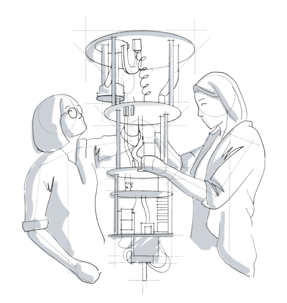

来自Qiskit社区团队的问候!本教程是Qiskit的大学量子算法/计算课程的补充：

1.  量子算法背后的数学

2.  当今非容错量子设备的细节

3.  用Qiskit编写代码并在IBM的云量子系统上实现量子算法

关于本教程
----------

这是一个免费的数字版教程，在使用Qiskit
SDK的同时通过本教程教授量子计算的概念。

以内联方式运行代码
------------------

本教程构建于可以轻松阅读的jupyter
notebook框架上，同时也可以让读者能够直接在本教程中编辑和运行代码。本教程的些章也可以在IBM
Quantum Experience中以jupyter notebook的格式打开而无需安装！

> print(\"This code works!\")
>
> This code works!
>
> from qiskit import QuantumCircuit
>
> qc = QuantumCircuit(2) \# Create circuit with 2 qubits
>
> qc.h(0) \# Do H-gate on q0
>
> qc.cx(0,1) \# Do CNOT on q1 controlled by q0
>
> qc.measure_all()
>
> qc.draw()

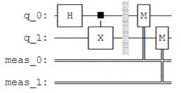

学习真正的量子系统
------------------

最好的学习方法是实践。Qiskit允许用户在舒适的家中使用最先进的量子设备进行实验。本教程不仅教授理论量子计算，而且还教授实现理论的实验量子物理。

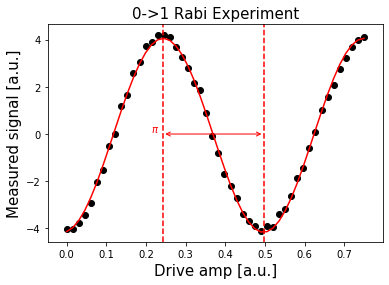

使用本教程的方法
----------------

### 课程整合

本教程可以作为一个独立的课程，但其最初目的是为配合传统的大学课程而设计。本教程向学生展示了如何使用Qiskit来进行量子算法和硬件的实验，并以此来加强他们的理解。

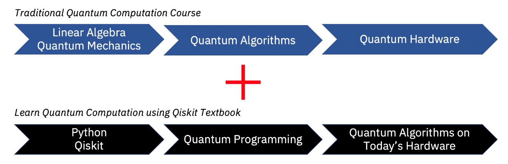

### 路线图

Qiskit教程中涵盖了广泛的材料，并非所有的材料可以在一个单一课程中揭示。读者可以使用下面的指南来调整需要学习的部分。但是，下面的指南仅是使用本教程的一种建议方法。

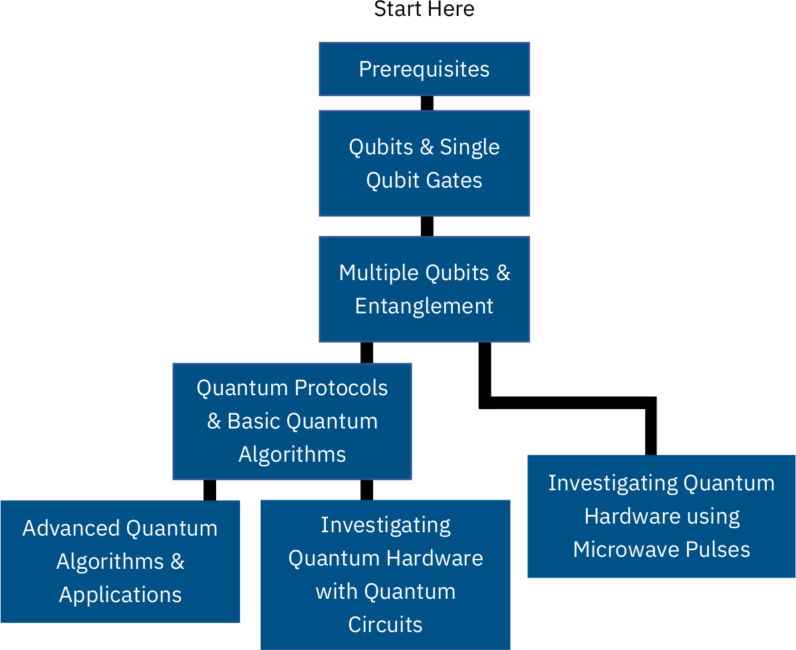

信誉
----

### 联系方式

如果您对本教程有任何疑问或建议，或者想将其纳入您的课程表，请联系Frank
Harkins（Francis.Harkins\@ibm.com）。本着开放源代码的精神，在此GitHub存储库中欢迎任何章节的贡献。

### 贡献者

本教程是多人工作的结果。如果在工作中使用本教程，请引用[bib文件](https://github.com/Qiskit/qiskit-textbook/blob/master/content/qiskit-textbook.bib)或直接引用：

*Abraham Asfaw, Luciano Bello, Yael Ben-Haim, Sergey Bravyi, Lauren
Capelluto, Almudena Carrera Vazquez, Jack Ceroni, Richard Chen, Albert
Frisch, Jay Gambetta, Shelly Garion, Leron Gil, Salvador De La Puente
Gonzalez, Francis Harkins, Takashi Imamichi, David McKay, Antonio
Mezzacapo, Zlatko Minev, Ramis Movassagh, Giacomo Nannicni, Paul Nation,
Anna Phan, Marco Pistoia, Arthur Rattew, Joachim Schaefer, Javad
Shabani, John Smolin, Kristan Temme, Madeleine Tod, Stephen Wood, James
Wootton.*

什么是量子？
============

"量子物理学"是一个被广泛使用但却很少被人理解的术语。它是一种数学模型，最初用于描述实验室中微小物体的行为，其揭露了先前"经典"物理学理论的缺陷。量子理论解释了这种行为，并为我们提供了一个更完整的宇宙图像。人们已经意识到可以利用这种以前无法解释的行为来进行某些之前认为不可能的计算。人们将其称之为量子计算。

量子计算是您涉足量子物理学的完美方式。量子计算将量子物理学的核心概念提炼为最简单的形式，同时剥离了物理世界的复杂性。本文将带您去探索和理解一些奇怪的量子现象，并让您对什么是"量子"有一个初步的了解。

经典概率回顾
------------

若要理解量子现象，我们首先需要了解"经典"概率。此处的"经典"是指在量子物理被发现之前，比如您在上学时学到的正态概率树（normal
probability
tree）。如果您对已经熟悉了这些材料，那么请快速浏览一下。如果您对这个不是很感兴趣，也不用担心------我们只会涵盖一些可能是最简单的概率问题。

### 概率树

希望您还记得上学时学过的概率树。该想法很简单------用一张图描绘出每一种可能发生事情的可能性，从中计算出其发生的几率。

假设我们有一枚均匀的硬币，以包含头像（Head）的一面为正面。然后抛掷这一均匀硬币并观察结果，会发看到正面H及反面T的机率各占50%。我们将这一结果画在一个概率树上：

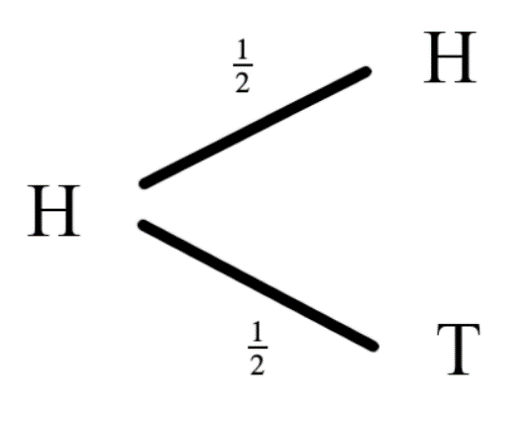我们在每个分叉的末端画出结果并在每个分叉上标注出现的概率。与上述步骤相同，如果从反面开始抛掷这个硬币，仍各有50%的机会看到正面或反面。


我们可以通过不断尝试来测试这个过程。您可以找出一枚硬币并抛掷多次，然后记录每一次的结果；最终您会看到大约有50%的结果是正面H，50%是反面T。经验估计大约需要500到1000次抛掷就足以得出可靠的结果。

### 实验\#1：单硬币抛掷

如果您没有时间进行这样的实验？请不必担心！您可以通过点击网页上的"Toss
Coin"按钮来模拟这个实验，并保存抛掷的结果。您还可以改变抛掷时的初始状态为正面（Head）或反面（Tail），或通过增加硬币的数量来快速获取大量结果。点击"Reset"可以丢弃先前的结果并重新开始。

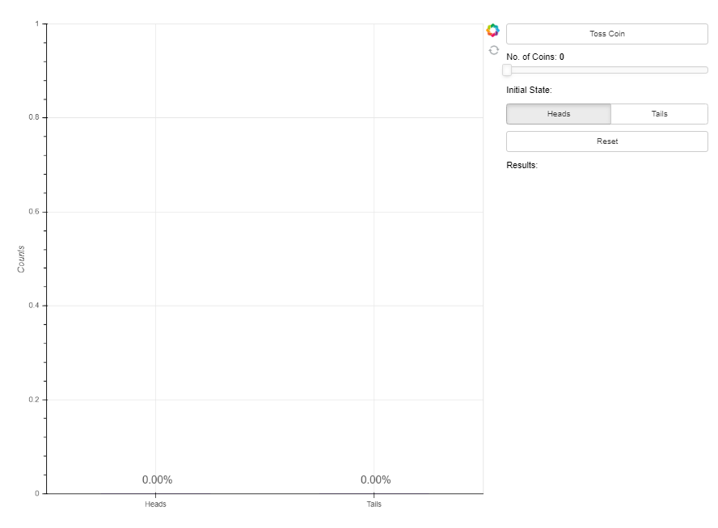

### 进一步探索

通过上面的实验可以验证：概率树模型正确地预测了实验的结果。此时我们可以更进一步，通过把概率树串联起来预测一连串事件的结果。假设我们从正面（Head）开始抛硬币并不断重复，结果会是什么？此时我们可以利用概率树解读：


您可能还记得沿着概率树中树枝上的概率相乘来计算一个事件的组合概率：


然后将结果相加，计算每种结果的概率：


可以看到在两次抛掷后看到正面H的概率是50%，在两次抛掷后看到反面T的概率也是50%。

### 实验\#2：双硬币抛掷

您可以通过按两次"Toss
Coin"按钮来模拟单硬币抛掷实验并获得最终结果。还可以改变初始状态或改变同时被抛掷的硬币数量来快速获取大量结果。


通过足够多次的抛掷，我们发现结果与预期相同：正面H和反面T的出现次数几乎相同。

量子硬币
--------

通过上面的实验，我们对经典硬币有了完整的了解。现在引入量子"硬币"，称为"量子比特（qubit）"。

因为其很难被操纵，所以量子比特只能在实验室里玩。经过多年的科学和技术的进步已经能够创造出现今我们所拥有的量子比特了，但学习量子计算的美妙之处在于，我们可以忽略物理的复杂性并仅需记住当测量一个量子比特时，其将会处在两种状态之一：量子比特的状态$0$和状态$1$。

### 实验\#3：量子硬币抛掷

现在我们使用量子硬币来做进行抛掷实验。与上面的抛掷经典硬币的实验一样，进行量子抛掷、测量量子硬币的状态并记录。

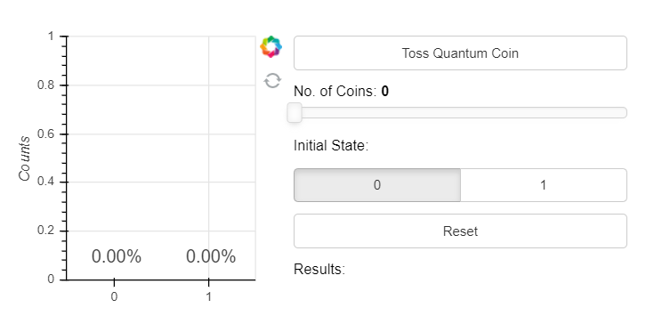

然后，尝试用概率树来描述这一过程中的量子硬币。在状态$0$下抛掷量子硬币有50%的机率会得到$0$或$1$，我们把这一结果画在概率树上：

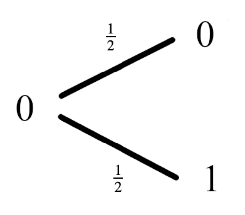

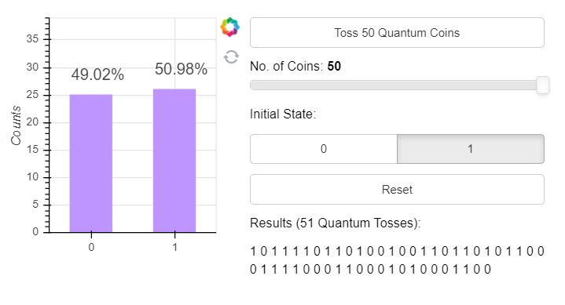

相类似的，在状态1下各有50%的机率测得结果为0或1，所绘制的概率树为：


### 实验\#4：双量子硬币抛掷

自此我们有了一个可以预测量子硬币行为的模型。现在我们想要对这个模型进行测试，观察其是否对新情况也成立。测试的方法为像前面那样一次抛两枚硬币。与经典硬币模型相同，量子硬币模型预测无论开始时处于哪一状态，都有50%的机会测得0或1：

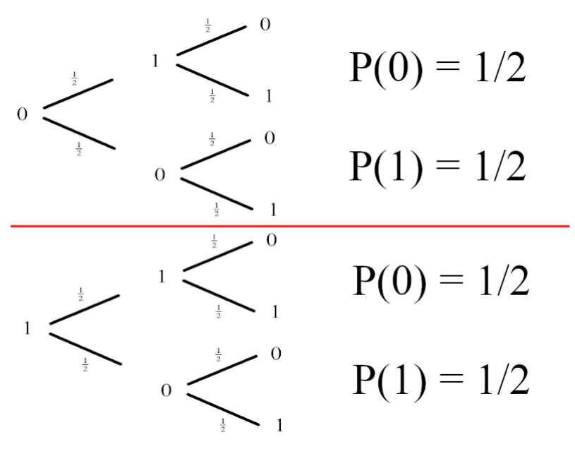

我们可以通过工具抛掷一个量子硬币两次：


可以看到结果并非如我们所希望。再看看把初始状态设置为1是会发生什么！


这与我们的预测完全不符！模型失效了！这就是物理学家在20世纪初遇到的相同问题。寻找这一问题答案的过程导致了量子物理学的发展，我们将用这一过程来描述抛掷量子硬币。

量子模型
--------

**简而言之，量子理论是包含负数的概率论。**

这句话是什么意思呢？不可能有负的概率，因为根本没有意义。为了包容这一情况，此处使用了一个称为幅值（amplitude）的量并将其画在树上。由于不可能有负的概率而且所有的概率加起来必须是1，为了避开这一事实，此处使用了一个数学技巧：*使用幅值的平方来计算概率*。


从上图中可以看到，从状态0开始抛掷量子硬币的动作给两种结果分配了相同的幅值。当对这些幅值取平方后就给出了测量0或1的正确概率。如何知道幅值为$\sqrt{\frac{1}{2}}$？因为正是上面的实验值给出了正确答案！

从状态1开始，幅值树就会不同：

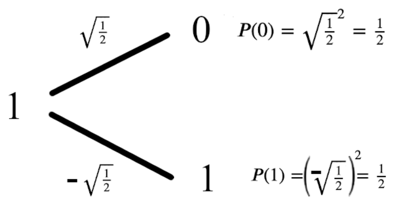

在此处，结果的幅值中出现第一个负数。当我们平方幅值来计算概率时，这个负号就消失了，测得的概率仍是50%。当我们把这些概率串在一起时会发生一些有趣的事情。

对双量子硬币抛掷的诠释
----------------------

与经典概率相同，我们将会沿着幅值树的分叉来计算每种情况的幅值：


为了计算出每个测量结果的概率，我们把这些幅值相加后平方：


可以看到处于状态1的硬币（量子比特）幅值抵消了其他输出，称之为**干涉效应**。您应该试着自己验证这个模型在初始状态为1时是否可以工作。

什么是量子计算？
----------------

上面的过程是不是很有趣？但有何作用呢？事实证明：这些**干涉效应**可以为我们所用；我们可以将这些操作组合起来，比如通过量子硬币抛掷来构建更高效的算法。这些算法可以利用**干涉效应**使错误的答案迅速抵消，并有很高的概率测得正确答案。这就是量子计算背后的思想。

1.  预备知识
    ========

    1.  设置环境
        --------

以下是在您的个人计算机上设置并使用Qiskit
Textbook环境的全面指南。本指南将帮助您重现在Qiskit
Textbook网站上看到的结果。Qiskit Textbook用[Jupyter
Notebook](https://jupyter.org/install)编写，Notebook及其[网站](https://qiskit.org/textbook/preface.html)是唯一完全支持本Textbook的媒介。

### 安装qiskit_textbook软件包

qiskit_textbook软件包中给出了一些本教程特定的工具和控件，但在Qiskit软件中未提供。安装qiskit_textbook的最快方式是使用[Pip](http://pypi.org/project/pip/)和[Git](http://git-scm.com/)运行下面的命令：

> pip install
> git+https://github.com/qiskit-community/qiskit-textbook.git\#subdirectory=qiskit-textbook-src

您也可以从Github上下载qiskit-textbook-src（https://github.com/qiskit-community/qiskit-textbook）后，在解压后的目录中运行以下命令：

pip install ./qiskit-textbook-src

### 按照Qiskit Textbook的要求复现输出的步骤（可选步骤）

#### 1. 将默认作图工具设置为MatPlotLib

QuantumCircuit.draw()与qiskit.visualization.circuit_drawer()的默认后端为文本后端。当然，依据您计算机中的环境您可能想要将其更改为更加适合的后端。这一步骤可以通过修改用户配置文件来完成，位于用户主目录的.qiskit目录中：settings.conf（Linux
或 MacOS）或.ini（Windows）。

Qiskit
Textbook的默认量子回路绘制工具是MatPlotLib。为了能够再现本教程中给出的可视化部分，可在.qiskit目录创建settings.conf文件并在其中添加：

> \[default\]
>
> circuit_drawer = mpl

#### 2. 将默认图片类型设置为svg

您还可以在ipython_kernel_config.py文件中添加以下代码将默认的图片格式从PNG更改成具有更佳缩放的SVG格式：（ipython_kernel_config.py通常在用户主目录的.ipython/profile_default/文件夹中）

c.InlineBackend.figure_format = \'svg\'

#### 3. 同步TextBook中使用的Qiskit版本

您将在本教程大多数章节的最后找到以下代码片段，其输出包含了在该章节中所使用的Qiskit版本信息。如果您运行这一章节中的代码时发现不一致的语法和/或输出，请尽量使用相同的版本。

您可以在Python终端和Jupyter
Notebook中运行下面的代码来查看在您电脑上所安装Qiskit的版本：

> import qiskit
>
> qiskit.\_\_qiskit_version\_\_

Python和Jupyter Notebooks
-------------------------

Python是一种不需要编译的编程语言。读者可以逐行运行其代码（这就是在Notebook中使用Python的方式)。因此，如果您对编程相当陌生，那么Python是一个很好的起点。我们将使用当前Python
3版本。

用Python编码的一种方法是使用Jupyter
Notebook。该工具可能是结合编程、文本和图像的最佳方法。在Notebook中所有内容都放置在单元（cell）中，其中最常见的文本单元和代码单元。如果您用装有Jupyter
Notebook的电脑查看本节，则现在正在阅读的文本位于文本单元中。您可以在下面找到一个代码单元。

若要运行代码单元中的内容，可以单击进入该单元，然后按Shift +
Enter。或者，如果单元左侧有一个小箭头，那么可以直接单击运行。

> 1+1
>
> 输出：
>
> 2

如果您是在Jupyter
Notebook中查看本节，就可以在阅读过程中逐个运行其中的代码单元。

> a = 1
>
> b = 0.5
>
> a + b
>
> 输出：
>
> 1.5

上面的代码中创建了两个变量，分别为a和b并为其赋值，然后变量a与b相加。这样的简单算法在Python中相当直截了当。

Python中的变量有多种形式，下面是一些例子：

> an_integer = 42 \# Just an integer
>
> a_float = 0.1 \# A non-integer number, up to a fixed precision
>
> a_boolean = True \# A value that can be True or False
>
> a_string = \'\'\'just enclose text between two \'s, or two \"s, or do
> what we did for this string\'\'\' \# Text
>
> none_of_the_above = None \# The absence of any actual value or
> variable type

除了数字之外，我们可以使用的另一种数据结构是列表（list）。

a_list = \[0,1,2,3\]

在Python中，一个列表的索引是从0开始（与Fortran之类的语言不同）。下面的代码是如何访问a_list列表中第一个元素。

> a_list\[0\]
>
> 输出：
>
> 0

与列表类似的数据结构是元组（tuple）。

> a_tuple = ( 42, 0.5, True, \[0,1\], None, \'Banana\' )
>
> a_tuple\[0\]
>
> 输出：
>
> 42

列表和元组之间的主要区别是列表可以更改其中的元素，但是元组不行。

> a_list\[5\] = \'apple\'
>
> print(a_list)
>
> 输出：
>
> \[42, 0.5, True, \[0, 1\], None, \'apple\'\]
>
> a_tuple\[5\] = \'apple\'
>
> 输出：
>
> \-\-\-\-\-\-\-\-\-\-\-\-\-\-\-\-\-\-\-\-\-\-\-\-\-\-\-\-\-\-\-\-\-\-\-\-\-\-\-\-\-\-\-\-\-\-\-\-\-\-\-\-\-\-\-\-\-\-\-\-\-\-\-\-\-\-\-\-\-\-\-\-\-\--
>
> TypeError Traceback (most recent call last)
>
> \<ipython-input-9-42d08f1e5606\> in \<module\>
>
> \-\-\--\> 1 a_tuple\[5\] = \'apple\'
>
> TypeError: \'tuple\' object does not support item assignment

我们还可以在列表的末尾添加一个元素，但是元组做不到。

> a_list.append( 3.14 )
>
> print(a_list)
>
> 输出：
>
> \[42, 0.5, True, \[0, 1\], None, \'apple\', 3.14\]

Python另一个有用的数据结构是字典（dictionary）。字典可以存储一组值（value），其中每个值都由一个惟一的键（key）标记。

字典中的值可以是任何数据类型，键可以是任意足够简单的东西（整数、浮点数、布尔值、字串）。*键不能是一个列表，但可以是一个元组*。

> a_dict = { 1:\'This is the value, for the key 1\', \'This is the key
> for a value 1\':1, False:\':)\', (0,1):256 }

访问字典值的方式是使用对应的键：

> a_dict\[\'This is the key for a value 1\'\]
>
> 输出：
>
> 1

只要为新的键提供值，就可以在字典中添加新的键/值对。

a_dict\[\'new key\'\] = \'new_value\'

遍历一个数字范围的语法是：

> for j in range(5):
>
> print(j)
>
> 输出:
>
> 0
>
> 1
>
> 2
>
> 3
>
> 4

**注意，range(n)是从0开始(默认)并以n-1结束。**

您还可以遍历任何"可迭代（iterable）"对象，比如列表：

> for j in range(5):
>
> print(j)
>
> 输出:
>
> 0
>
> 1
>
> 2
>
> 3
>
> 4

或字典：

> for key in a_dict:
>
> value = a_dict\[key\]
>
> print(\'key =\',key)
>
> print(\'value =\',value)
>
> print()
>
> 输出:
>
> key = 1
>
> value = This is the value, for the key 1
>
> \...
>
> key = new key
>
> value = new_value

Python中的条件语句使用if、elif和else完成，使用以下语法：

> if \'strawberry\' in a_list:
>
> print(\'We have a strawberry!\')
>
> elif a_list\[5\]==\'apple\':
>
> print(\'We have an apple!\')
>
> else:
>
> print(\'Not much fruit here!\')
>
> 输出:
>
> We have an apple!

导入Python软件包用一行代码就可以完成：

import numpy

Numpy包是Python中很重要的数学计算包：

numpy.sin( numpy.pi/2 )

在上面的代码中必须在每个numpy中命令前加上**numpy.**，以便让Python知道如何查找在numpy中定义的命令。为了减少代码的长度，通常可以使用：

> import numpy as np
>
> np.sin( np.pi/2 )
>
> 输出:
>
> 1.0

现在只须使用numpy的缩写。虽然大多数人使用np，但您可以使用您喜欢的缩写。

您也可以直接把numpy中的所有东西直接导入Python的名称空间：

from numpy import \*

然后就可以直接使用numpy中的命令。但这样操作可能会导致程序包之间的名称混乱，因此不建议使用。

> sin( pi/2 )
>
> 输出:
>
> 1.0

如果您计算三角函数，线性代数等，那么使用numpy就可以了。在Python中绘图则需要使用matplotlib。如果在Python的计算中涉及图论（graph
theory），可以使用networkx。当然在Python中进行量子计算，就需要使用qiskit了。不管您想要什么，都可能会有一个适合您需求的软件包。

在任何编程语言中都需要知道的是如何构造函数。

下面的代码定义了一个名称为do_some_math的函数，有两个参数分别为Input1和Input2，该函数的输出为the_answer。

> def do_some_maths ( Input1, Input2 ):
>
> the_answer = Input1 + Input2
>
> return the_answer

Python中函数的调用方式如下：

> x = do_some_maths(1,72)
>
> print(x)
>
> 输出:
>
> 73

如果给一个函数一个对象，并且这个函数调用这一对象的一个方法来改变其的状态，那么这一对象状态的改变不会随着函数运行的结束而消失。如果这就是想要的效果，那么函数不需要返回任何东西。例如使用列表的append方法：

> def add_sausages ( input_list ):
>
> if \'sausages\' not in input_list:
>
> input_list.append(\'sausages\')
>
> print(\'List before the function\')
>
> print(a_list)
>
> add_sausages(a_list) \# function called without an output
>
> print(\'\\nList after the function\')
>
> print(a_list)
>
> 输出：
>
> List before the function
>
> \[42, 0.5, True, \[0, 1\], None, \'apple\', 3.14\]
>
> List after the function
>
> \[42, 0.5, True, \[0, 1\], None, \'apple\', 3.14, \'sausages\'\]

在Python可以使用random包生成随机数：

> import random
>
> for j in range(5):
>
> print(\'\* Results from sample\',j+1)
>
> print(\'\\n Random number from 0 to 1:\', random.random() )
>
> print(\"\\n Random choice from our list:\", random.choice( a_list ) )
>
> print(\'\\n\')
>
> 输出：
>
> \* Results from sample 1
>
> Random number from 0 to 1: 0.8871532828770763
>
> Random choice from our list: True
>
> ...

以上是Python中最基本的语法。现在您所仅需的是一个搜索引擎，以及在Stack
Exchange上听取哪一建议的直觉，然后就可以用Python做任何事情了。您的代码可能不是最"python化"的，但只有Pythonistas真正关心这一问题。

0.2 Qiskit
----------

### 基础Qiskit语法

#### 安装

Qiskit是Python中用于量子计算的软件包。

如果您尚未安装，则需要安装完成后才能在Python中导入Qiskit。

安装Qiskit通常需要两个步骤。第一个是安装Anaconda，其中几乎包含了所有您将会用到的相关软件包。在完成安装Anaconda后，可以在终端中通过运行以下命令来安装Qiskit：

pip install qiskit \#国内用户建议将pip的源更换为阿里或清华

相关详细的安装说明，请参阅[Qiskit的安装文档](https://qiskit.org/documentation/install.html)。

注：本节的剩余部分是为已经了解量子计算基本概念的人准备的。读者可以直接跳到后面的章节中使用这些概念。所有其他的读者都应该从阅读[Python和Jupyter
notebooks](\l)开始，然后直接进入第一章的开头。

#### 量子回路

> from qiskit import \*
>
> \#在Jupyter Notebooks中：
>
> %config InlineBackend.figure_format = \'svg\' \#
> 可是使所生成的图片看上去更加清晰

Qiskit的核心是**量子回路**（**quantum
circuit，也可将其称之为"量子线路"**）。以下是在Python中创建一个量子回路的实例------qc：

qc = QuantumCircuit()

这一回路目前是完全不包含任何东西，没有量子比特，也就不会有输出。

#### 量子寄存器

为了使刚才生成的量子回路并非毫无用处，需要定义一个量子比特寄存器，使用QuantumRegister对象完成。例如，定义一个由两个量子比特组成的寄存器，称之为qr。

qr = QuantumRegister(2,\'qreg\')

给qr起一个类似\'qreg\'的名字是可选参数。

现在可以使用add_register方法将qr添加到回路中，并通过检查回路对象的qregs变量来查看是否其已被添加。在Jupter
Notebook中，最后的代码单元及其输出如下：

> qc.add_register( qr )
>
> qc.qregs
>
> 输出：
>
> \[QuantumRegister(2, \'qreg\')\]

至此回路qc中有了一些量子比特，可以使用回路的另一个属性draw()来查看其具体形态。

> qc.draw(output=\'mpl\')
>
> 输出：

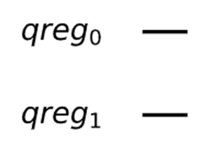

我们可以看到量子比特已经准备好开始其旅程了，但目前都只是处于态\|0⟩（对于此处不熟悉的小伙伴可以阅读狄拉克符号及其意义）。

#### 使用Gate（门）

为了发生些什么事情，需要在回路实例qc中添加量子门。例如，尝试h()：

> qc.h()
>
> 输出：
>
> \-\-\-\-\-\-\-\-\-\-\-\-\-\-\-\-\-\-\-\-\-\-\-\-\-\-\-\-\-\-\-\-\-\-\-\-\-\-\-\-\-\-\-\-\-\-\-\-\-\-\-\-\-\-\-\-\-\-\-\-\-\-\-\-\-\-\-\-\-\-\-\-\-\--
>
> TypeError Traceback (most recent call last)
>
> \<ipython-input-7-68b196ebf214\> in \<module\>
>
> \-\-\--\> 1 qc.h()
>
> /usr/local/anaconda3/lib/python3.7/site-packages/qiskit/util.py in
> wrapper(\*args, \*\*kwargs)
>
> 106 if kwargs:
>
> 107 \_rename_kwargs(func.\_\_name\_\_, kwargs, kwarg_map)
>
> \--\> 108 return func(\*args, \*\*kwargs)
>
> 109 return wrapper
>
> 110 return decorator
>
> TypeError: h() missing 1 required positional argument: \'qubit\'

这里得到一个错误，因为在此操作中没有指定应该作用于哪一个量子比特。寄存器qr中有两个量子比特分别称为qr\[0\]和qr\[1\]。

> qc.h(qr\[0\])
>
> 输出：
>
> \<qiskit.circuit.instructionset.InstructionSet at 0x7fe099f71110\>

请忽略上面的输出。当一个单元的最后一行没有"="时，Jupyter
Notebook会打印出该单元的内容。在这个例子中打印出有一个由Qiskit定义的Hadamard门。可以使用"
; "抑制这种输出。

我们还可以在量子回路中添加一个受控非门（Controlled-NOT）控件**cx**，此操作需要两个参数：控制量子比特（control
qubit）和目标量子比特（target qubit）。

qc.cx(qr\[0\], qr\[1\]);

现在，回路qc中包含了新的内容。

> qc.draw(output=\'mpl\')
>
> 输出：

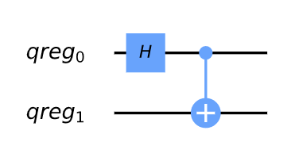

#### 态向量（statevector）模拟器

到现在为止量子回路qc中已经包含了足够的器件来构成回路，让我们看看回路qc的输出是什么？*其过程具体为使用"态向量模拟器"来查看两个量子比特的态向量发生了什么变化*。

准备模拟器的代码如下：

vector_sim = Aer.get_backend(\'statevector_simulator\')

在Qiskit中使用后端（backend）引用量子程序实际运行的东西（模拟器或真正的量子设备）。若要为后端设置作业（job），需要设置相应的后端对象。

我们想要的模拟器定义在Qiskit中称为Aer的部分。通过在Aer的get_backend()方法中给出想要的模拟器名称，就可以得到相应的后端对象。本例中后端的名称为\'statevector_simulator\'。

可以使用下面的代码获取Aer中所有可能的模拟器列表：

> Aer.backends()
>
> 输出：
>
> \[\<QasmSimulator(\'qasm_simulator\') from AerProvider()\>,
>
> \<StatevectorSimulator(\'statevector_simulator\') from
> AerProvider()\>,
>
> \<UnitarySimulator(\'unitary_simulator\') from AerProvider()\>,
>
> \<PulseSimulator(\'pulse_simulator\') from AerProvider()\>\]

所显示的模拟器都来自"本地"，表明其都可在预装Qiskit的机器上运行。您可以在自己的机器上使用这些模拟器，而无需签署IBMQ用户协议。

我们通过Qiskit的execute命令运行这些模拟器，该命令需要的参数是：

要运行的回路和运行该回路的"后端"（在本例中是模拟器）。

job = execute(qc, vector_sim)

上面的代码创建了一个处理作业（job）的对象，在这里称为作业（job）。我们只需从中提取结果，具体为提取态向量。

> ket = job.result().get_statevector()
>
> for amplitude in ket:
>
> print(amplitude)
>
> 输出：**（每个电脑的结果不同）**
>
> (0.7071067811865476+0j)
>
> 0j
>
> 0j
>
> (0.7071067811865476+0j)

结果是一个贝尔态（Bell
state）的向量$(|00\rangle + |11\rangle)/\sqrt{2}$，正是我们想要回路qc输出的结果。

显然，我们已经获得了一个完整定义的态向量，但还可以采用Qiskit的另一个特性：用任意纯态初始化回路。

> new_qc = QuantumCircuit(qr)
>
> new_qc.initialize(ket,qr)

#### 经典寄存器（ClassicalRegister）和qasm模拟器

在上面的仿真中，我们得到了一个态向量（statevector），但并非是从真正的量子计算机中获取，为此需要对其测量。为了处理测量过程，需要定义结果的走向。这一步骤通过ClassicalRegister完成的。现在定义一个包含两个比特（bit）的经典寄存器，用以测量的之前所生成的两个量子比特（qubit）。

> cr = ClassicalRegister(2,\'creg\')
>
> qc.add_register(cr)

现在可以使用量子回路的测量方法了，该方法需要两个参数：正在测量的量子比特，以及写入结果的位。

> qc.measure(qr\[0\],cr\[0\])
>
> qc.measure(qr\[1\],cr\[1\])
>
> qc.draw(output=\'mpl\')
>
> 输出：
>
> 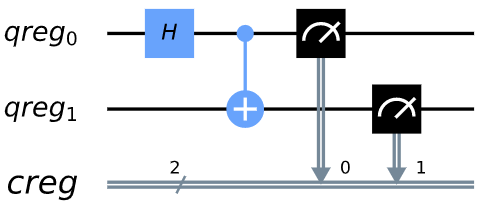

我们可以测量两个量子比特，并把结果写入到经典寄存器的不同位中。

现在可以在本地模拟器上运行qc了，其效果是模拟真实的量子设备。为此，我们需要向执行函数shots添加另一个输入，该输入决定了运行回路进行统计的次数。如果不提供任何shots值，则默认为1024。

> emulator = Aer.get_backend(\'qasm_simulator\')
>
> job = execute( qc, emulator, shots=8192 )

上面代码的结果本质上是一个Python字典形式的直方图，可以打印出该结果。

> hist = job.result().get_counts()
>
> print(hist)
>
> 输出：（结果每台电脑不一样）
>
> {\'00\': 4029, \'11\': 4163}

可以让Qiskit把上面的输出画成柱状图。

> from qiskit.visualization import plot_histogram
>
> plot_histogram(hist)
>
> 输出：


对于兼容的后端，还可以请求并获得结果的有序列表。

> job = execute(qc, emulator, shots=10, memory=True)
>
> samples = job.result().get_memory()
>
> print(samples)
>
> 输出：
>
> \[\'11\', \'11\', \'00\', \'00\', \'00\', \'00\', \'11\', \'11\',
> \'11\', \'00\'\]

注意位（bit）被标记为自右到左，cr\[0\]是最右边的，其余以此类推。举个例子，这是一个8量子比特回路，其中**Pauli
X**（泡利-X 门）只在编号7的量子比特上，那么其输出存储在编号7的位上。

> qubit = QuantumRegister(8)
>
> bit = ClassicalRegister(8)
>
> circuit = QuantumCircuit(qubit,bit)
>
> circuit.x(qubit\[7\])
>
> circuit.measure(qubit,bit)
> \#此为一次性完成所有qc.measure(qr8\[j\],cr8\[j\])的方法
>
> execute(circuit, emulator, shots=8192).result().get_counts()
>
> 输出：
>
> {\'10000000\': 8192}

可以看到出现在输出最左侧的是1。

这种编号方式反映了位（bit）表示整数时的作用。

$$b_{n - 1}b_{n - 2}\cdots b_{1}b_{0} = \sum_{j}^{}{b_{j}2^{j}}$$

所以我们在结果中得到的字串是二进制的$2^{7}$，因为输出结果中的第7位（从0开始）是1。

#### 简化符号

可以将多个量子寄存器和经典寄存器添加到一个回路中。然而，如果只需要其中的一个，可以使用简化符号。

例如，考虑以下内容。

qc = QuantumCircuit(3)

上面代码中QuantumCircuit()的唯一参数被解释为需要的量子比特数量。这一回路只有一个由三个量子比特组成的量子寄存器，没有经典寄存器。

在添加门回路时，我们可以简单地通过其的索引引用这三个量子比特：0、1或2。例如下面的代码中定义了一个量子比特1处的哈达玛门。

> qc.h(1)
>
> qc.draw(output=\'mpl\')
>
> 输出：

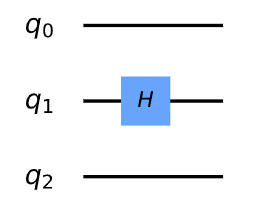

为了定义同时具有量子寄存器和经典寄存器的回路，可以向QuantumCircuit提供两个参数。第一个将被解释为量子比特的数量，第二个是位的数量。例如，以下是一个两个量子比特的回路，只取一个位的输出。

为了观察其的运行，以下是一个简单的回路。注意！在进行测量时，我们也通过索引引用经典寄存器中的位。

#### 创建自定义门

qc = QuantumCircuit(2,1)

> qc.h(0)
>
> qc.cx(0,1)
>
> qc.measure(1,0)
>
> qc.draw(output=\'mpl\')
>
> 输出：

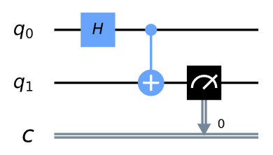

正如我们所看到的，具有把不同的回路组合成更大的回路的可能性。还可以使用更复杂的版本来定制门。例如，下面有一个回路中实现了量子比特0和2之间的cx（受控非门），使用量子比特1来协调这个过程。

> sub_circuit = QuantumCircuit(3, name=\'toggle_cx\')
>
> sub_circuit.cx(0,1)
>
> sub_circuit.cx(1,2)
>
> sub_circuit.cx(0,1)
>
> sub_circuit.cx(1,2)
>
> sub_circuit.draw(output=\'mpl\')
>
> 输出：

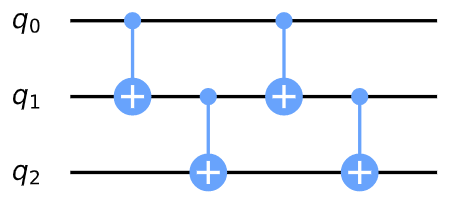

现在把sub_circuit变成门回路：

toggle_cx = sub_circuit.to_instruction()

然后用我们选择其他回路中的任意一组量子比特插入toggle_cx：

> qr = QuantumRegister(4)
>
> new_qc = QuantumCircuit(qr)
>
> new_qc.append(toggle_cx, \[qr\[1\],qr\[2\],qr\[3\]\])
>
> new_qc.draw(output=\'mpl\')
>
> 输出：


#### 访问真正的量子硬件（未注册，只显示代码不显示输出）

您还可以使用IBMQ包设置后端对象。这些应用要求创建一个IBMQ帐户。假设访问凭证已经加载到您的计算机上：

> IBMQ.load_account()
>
> 输出：
>
> \<AccountProvider for IBMQ(hub=\'ibm-q\', group=\'open\',
> project=\'main\')\>

让我们看看有哪些可用的后端：

> provider = IBMQ.get_provider(hub=\'ibm-q\')
>
> provider.backends()
>
> 输出：
>
> \[\<IBMQSimulator(\'ibmq_qasm_simulator\') from IBMQ(hub=\'ibm-q\',
> group=\'open\', project=\'main\')\>,
>
> \<IBMQBackend(\'ibmqx2\') from IBMQ(hub=\'ibm-q\', group=\'open\',
> project=\'main\')\>,
>
> \<IBMQBackend(\'ibmq_16_melbourne\') from IBMQ(hub=\'ibm-q\',
> group=\'open\', project=\'main\')\>,
>
> \<IBMQBackend(\'ibmq_vigo\') from IBMQ(hub=\'ibm-q\', group=\'open\',
> project=\'main\')\>,
>
> \<IBMQBackend(\'ibmq_ourense\') from IBMQ(hub=\'ibm-q\',
> group=\'open\', project=\'main\')\>,
>
> \<IBMQBackend(\'ibmq_london\') from IBMQ(hub=\'ibm-q\',
> group=\'open\', project=\'main\')\>,
>
> \<IBMQBackend(\'ibmq_burlington\') from IBMQ(hub=\'ibm-q\',
> group=\'open\', project=\'main\')\>,
>
> \<IBMQBackend(\'ibmq_essex\') from IBMQ(hub=\'ibm-q\', group=\'open\',
> project=\'main\')\>,
>
> \<IBMQBackend(\'ibmq_armonk\') from IBMQ(hub=\'ibm-q\',
> group=\'open\', project=\'main\')\>\]

在输出中有一个模拟器，但其余都是原型量子设备。还可以通过status()方法查看其使用方法。

> for backend in provider.backends():
>
> print(backend.status())
>
> 输出：
>
> BackendStatus(backend_name=\'ibmq_qasm_simulator\',
> backend_version=\'0.1.547\', operational=True, pending_jobs=4,
> status_msg=\'active\')
>
> BackendStatus(backend_name=\'ibmqx2\', backend_version=\'2.0.5\',
> operational=True, pending_jobs=10, status_msg=\'active\')
>
> BackendStatus(backend_name=\'ibmq_16_melbourne\',
> backend_version=\'2.0.6\', operational=True, pending_jobs=15,
> status_msg=\'active\')
>
> BackendStatus(backend_name=\'ibmq_vigo\', backend_version=\'1.0.2\',
> operational=True, pending_jobs=5, status_msg=\'active\')
>
> BackendStatus(backend_name=\'ibmq_ourense\',
> backend_version=\'1.0.1\', operational=True, pending_jobs=5,
> status_msg=\'active\')
>
> BackendStatus(backend_name=\'ibmq_london\', backend_version=\'1.1.0\',
> operational=True, pending_jobs=6, status_msg=\'active\')
>
> BackendStatus(backend_name=\'ibmq_burlington\',
> backend_version=\'1.1.4\', operational=True, pending_jobs=3,
> status_msg=\'active\')
>
> BackendStatus(backend_name=\'ibmq_essex\', backend_version=\'1.0.1\',
> operational=True, pending_jobs=1, status_msg=\'active\')
>
> BackendStatus(backend_name=\'ibmq_armonk\', backend_version=\'1.1.0\',
> operational=True, pending_jobs=33, status_msg=\'active\')

现在获取最大公共设备的后端对象。

real_device = provider.get_backend(\'ibmq_16_melbourne\')

我们可以使用real_device在设备上以与模拟器完全相同的方式运行作业（job），也可以提取其属性。

> properties = real_device.properties()
>
> coupling_map = real_device.configuration().coupling_map

由此我们可以构建一个噪声模型来模拟设备上的噪声（将在稍后的教程中进一步讨论噪声模型）。

> from qiskit.providers.aer.noise import NoiseModel
>
> noise_model = NoiseModel.from_backend(properties)

然后在模拟器上运行作业，再现真实设备的所有这些特性。以下是回路在无噪声的情况下应该输出\'10\'的例子。

> qc = QuantumCircuit(2,2)
>
> qc.x(1)
>
> qc.measure(0,0)
>
> qc.measure(1,1)
>
> job = execute(qc, emulator, shots=1024, noise_model=noise_model,
>
> coupling_map=coupling_map,
>
> basis_gates=noise_model.basis_gates)
>
> job.result().get_counts()
>
> 输出：
>
> {\'10\': 966, \'11\': 6, \'00\': 52}

至此本节中已经涵盖了Qiskit中的最基本内容，接下来将要学习更多量子比特和量子回路的知识。

> import qiskit
>
> qiskit.\_\_qiskit_version\_\_
>
> 输出：
>
> {\'qiskit-terra\': \'0.12.0\',
>
> \'qiskit-aer\': \'0.4.1\',
>
> \'qiskit-ignis\': \'0.2.0\',
>
> \'qiskit-ibmq-provider\': \'0.6.0\',
>
> \'qiskit-aqua\': \'0.6.5\',
>
> \'qiskit\': \'0.17.0\'}

0.3 线性代数
------------

> from matplotlib import pyplot as plt
>
> import numpy as np
>
> from qiskit import \*
>
> from qiskit.visualization import plot_bloch_vector

### 简介

线性代数是量子计算的语言。因此理解线性代数所建立的基本数学概念至关重要，如此才能理解量子计算中出现的许多惊人而有趣的结构。本节的目标是在您的大脑中建立基础的线性代数知识，在此基础上读者可以构建自身研究量子计算的研究。

### 向量和向量空间

我们将首先讨论量子计算中最重要的数学量之一：向量，并以此开始对线性代数的介绍。

在形式上,一个向量\|v⟩被定义为一组称为向量空间的元素。更直观、更几何的定义是：向量"是一个同时具有方向和大小的数学量"。例如，考虑一个具有x和y分量的向量$\left( \frac{3}{5} \right)$。这个向量可以被想象成一个箭头，指向x轴正3个单位，指向y轴正5个单位：

> plt.figure()
>
> ax = plt.gca()
>
> ax.quiver(\[3\], \[5\], angles=\'xy\', scale_units=\'xy\', scale=1)
>
> ax.set_xlim(\[-1, 10\])
>
> ax.set_ylim(\[-1, 10\])
>
> plt.draw()
>
> plt.show()
>
> 输出：

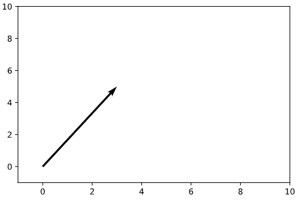

注意，向量的"尾巴"不一定要定位在坐标的原点；只需要指出正确的方向。

在量子计算中，我们经常处理态向量，这些向量指向空间中与特定量子态相对应的特定点。可以用布洛赫球（Bloch
Sphere）来表示。例如，一个表示量子系统状态的向量可以像一个箭头一样被包裹在布洛赫球中，这就是所谓的"态空间（state
space）"，所有可能的点都可以被态向量"指向"：

> plot_bloch_vector(\[1, 0, 0\])
>
> 输出：

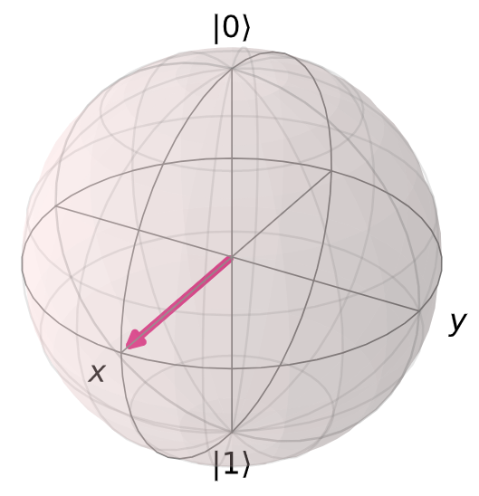

> **注解**
>
> **布洛赫球(Bloch
> Sphere)是一个可以将qubit的状态(纯态或混合态)直观化的巧妙工具。**


向量\|0⟩和\|1⟩之间的特定状态对应于一个均衡的叠加态（箭头是介于球体的顶部\|0⟩和底部\|1⟩之间）。向量可以在球面上任意旋转，球面上的每个点都代表不同的量子态。

我们先回顾一下向量更加正式的定义，即向量是向量空间的一个元素。现在必须定义一个向量空间。向量空间**V**是数域**F**（**field
F**）之上的一组对象（包括：向量和点），满足两个条件。第一，两个向量\|a⟩和\|b⟩的向量加法（**vector
addition**）的结果仍然在**V**之内。第二，对于\|a⟩ ∈ V与某一n ∈
F的标量乘法（**scalar multiplication**）的结果仍然在**V**之内。

现在，我们将通过一个基本示例来阐明刚才的定义。让我们证明集R^2^是数域R上的向量空间，我们断言：

$$\left( \frac{x_{1}}{y_{1}} \right) + \left( \frac{x_{2}}{y_{2}} \right) = \left( \frac{x_{1} + x_{2}}{y_{1} + y_{2}} \right)$$

上述公式包含于R^2^。情况显然如此，两个实数的和仍然是实数，使得新形成向量的两个分量都是实数，由此包含于R^2^中的向量被定义。我们还可以断言：

$$n\left| v \right\rangle = \left( \frac{\text{nx}}{\text{ny}} \right) \in \text{V\ \ \ }\forall n \in R$$

这也成立，因为实数和实数的乘积是实数，使得整个新的向量是实数，从而证明了这个表述。

#### 矩阵与矩阵运算

现在我们将注意力转向另一个基础概念：矩阵。矩阵是把一个向量转换为另一个向量的数学对象。

\|𝑣⟩ → \|𝑣′⟩ = 𝑀\|𝑣⟩

矩阵通常写为数组形式的数字，如下所示：

$$M = \left\lbrack \begin{matrix}
1 \\
1 \\
1 + i \\
\end{matrix}\begin{matrix}
 - 2 \\
5i \\
7 \\
\end{matrix}\begin{matrix}
3 \\
0 \\
 - 4 \\
\end{matrix} \right\rbrack$$

我们可以执行矩阵乘法将一个矩阵乘以一个向量。通常，两个矩阵之间的矩阵乘法涉及将第一个矩阵中每一行的元素乘以第二个矩阵中每一列的每一个元素然后将乘积相加，该乘积成为新矩阵中对应行列中的一个元素，以此类推。以下是矩阵乘法（叉积）的一个示例：

$$\left( \begin{matrix}
2 \\
5 \\
\end{matrix}\begin{matrix}
\ 0 \\
\  - 1 \\
\end{matrix} \right)\left( \begin{matrix}
 - 3\  \\
2 \\
\end{matrix}\begin{matrix}
1 \\
\ 1 \\
\end{matrix} \right) = \left( \begin{matrix}
\left( 2 \right)\left( - 3 \right) + \left( 0 \right)\left( 2 \right) \\
\left( 5 \right)\left( - 3 \right) + \left( - 1 \right)\left( 2 \right) \\
\end{matrix}\ \begin{matrix}
\left( 2 \right)\left( 1 \right) + \left( 0 \right)\left( 1 \right) \\
\left( 5 \right)\left( 1 \right) + \left( - 1 \right)\left( 1 \right) \\
\end{matrix} \right) = \left( \begin{matrix}
 - 6\  \\
 - 17 \\
\end{matrix}\begin{matrix}
2 \\
\ 4 \\
\end{matrix} \right)$$

为了进行量子计算，通过对量子态向量应用一个矩阵来对其操作。一个向量就是一个只有一列的矩阵。因此要将一个矩阵应用于一个向量，需要遵循上面描述的相同矩阵乘法过程。我们可以通过应用一系列的量子门（**quantum
gates**）在量子电脑上操纵量子比特。每个量子门都被表示为可应用于态向量的矩阵，从而改变态向量的状态。例如，经常可见的量子门是Pauli-X门，用矩阵的方式如下：

$$\sigma_{x} = \left( \begin{matrix}
0 \\
1 \\
\end{matrix}\ \begin{matrix}
1 \\
0 \\
\end{matrix} \right)$$

这一量子门的行为与经典的非逻辑门相似。其将计算量的基态\|0⟩和\|1⟩分别映射为\|1⟩和\|0⟩（将状态反转了）。我们将这两个基态表述为两个列向量：

$$\left| 0 \right\rangle = \begin{pmatrix}
1 \\
0 \\
\end{pmatrix}\text{\ \ }\left| 1 \right\rangle = \begin{pmatrix}
0 \\
1 \\
\end{pmatrix}$$

然后将Pauli-X门的矩阵分别应用于这两个基态：

$$\sigma_{x}\left| 0 \right\rangle = \left( \begin{matrix}
0 \\
1 \\
\end{matrix}\ \begin{matrix}
1 \\
0 \\
\end{matrix} \right)\begin{pmatrix}
1 \\
0 \\
\end{pmatrix} = \begin{pmatrix}
\left( 0 \right)\left( 1 \right) + \left( 1 \right)\left( 0 \right) \\
\left( 1 \right)\left( 1 \right) + \left( 0 \right)\left( 0 \right) \\
\end{pmatrix} = \begin{pmatrix}
0 \\
1 \\
\end{pmatrix} = \left| 1 \right\rangle$$

$$\sigma_{x}\left| 1 \right\rangle = \left( \begin{matrix}
0 \\
1 \\
\end{matrix}\ \begin{matrix}
1 \\
0 \\
\end{matrix} \right)\begin{pmatrix}
0 \\
1 \\
\end{pmatrix} = \begin{pmatrix}
\left( 0 \right)\left( 0 \right) + \left( 1 \right)\left( 1 \right) \\
\left( 1 \right)\left( 0 \right) + \left( 0 \right)\left( 1 \right) \\
\end{pmatrix} = \begin{pmatrix}
1 \\
0 \\
\end{pmatrix} = \left| 0 \right\rangle$$

态向量矩阵计算的结果与我们的预期一致。

在量子计算中，我们经常遇到两个非常重要的矩阵：厄米矩阵（**Hermitian**）和幺正矩阵（**Unitary**）。前者在量子力学的研究中更为重要，但在量子计算的研究中仍有必要加以讨论。后者在量子力学和量子计算中都具有无与伦比的重要性。如果您只从线性代数这一节中学会一个概念，那么就应该是一个幺正矩阵的概念。

厄米矩阵就是一个等于它的共轭转置（**conjugate
transpose**）的矩阵(用†符号表示)。这表明翻转厄米矩阵的虚部符号，然后沿着主对角线（从左上角到右下角）反射矩阵中的元素，就得到了一个相等的矩阵。例如，量子计算中常用的Pauli-Y矩阵是厄米矩阵：

$$\sigma_{y} = \left( \begin{matrix}
0 \\
i \\
\end{matrix}\ \begin{matrix}
 - i \\
0 \\
\end{matrix} \right) \Rightarrow \sigma_{y}^{\dagger} = \left( \begin{matrix}
0 \\
 - \left( - i \right) \\
\end{matrix}\ \begin{matrix}
 - \left( i \right) \\
0 \\
\end{matrix} \right) = \left( \begin{matrix}
0 \\
i \\
\end{matrix}\ \begin{matrix}
 - i \\
0 \\
\end{matrix} \right) = \sigma_{y}$$

注意我们交换了𝑖和−𝑖的位置（反映在主对角线，0保持不变）,然后翻转的符号。

幺正矩阵与上述非常相似。具体的说，幺正矩阵是一个矩阵使得逆矩阵等于原矩阵的共轭转置。

矩阵A的逆标注为$A^{- 1}$：

$$A^{- 1}A = AA^{- 1}\mathbb{= I}$$

其中$\mathbb{I}$是单位矩阵（**identity
matrix**），该矩阵的主对角线元素为1，其他元素皆为0。之所以将这一矩阵称为单位矩阵，因为任何矩阵与之相乘都等于其本身。

当一个矩阵的大小超过$2 \times 2$时，矩阵逆的计算就变得非常复杂，通常由计算机来完成。对于$2 \times 2$的矩阵，其逆定义为：

$$A = {\left( \begin{matrix}
a \\
c \\
\end{matrix}\ \begin{matrix}
b \\
d \\
\end{matrix} \right) \Rightarrow A}^{- 1} = \frac{1}{\text{detA}}\left( \begin{matrix}
d \\
 - c \\
\end{matrix}\ \begin{matrix}
 - b \\
a \\
\end{matrix} \right)$$

其中det A是矩阵A的行列式（**determinant**），在$2 \times 2$矩阵中，det
A=ad-bc。

在量子计算中，矩阵逆的计算很少是重要的。因为我们遇到的大多数矩阵都是幺正的，可以假设矩阵的逆就是通过求共轭转置得到的。

让我们看一个基本的例子。Pauli-Y矩阵，即是厄米矩阵，也是幺正矩阵（等于它的共轭转置，也等于它的逆；因此，Pauli-Y矩阵是它自己的逆！）。我们可以证明这个矩阵实际上是幺正的：

$$\sigma_{y} = \left( \begin{matrix}
0 \\
i \\
\end{matrix}\ \begin{matrix}
 - i \\
0 \\
\end{matrix} \right) \Rightarrow \sigma_{y}^{\dagger} = \left( \begin{matrix}
0 \\
i \\
\end{matrix}\ \begin{matrix}
 - i \\
0 \\
\end{matrix} \right) \Rightarrow \sigma_{y}^{\dagger}\sigma_{y} = \left( \begin{matrix}
\left( 0 \right)\left( 0 \right) + \left( - i \right)\left( i \right) \\
\left( i \right)\left( 0 \right) + \left( 0 \right)\left( i \right) \\
\end{matrix}\ \begin{matrix}
\left( 0 \right)\left( - i \right) + \left( - i \right)\left( 0 \right) \\
\left( i \right)\left( - i \right) + \left( 0 \right)\left( 0 \right) \\
\end{matrix} \right) = \left( \begin{matrix}
1 \\
0 \\
\end{matrix}\ \begin{matrix}
0 \\
1 \\
\end{matrix} \right)\mathbb{= I}$$

幺正矩阵重要的原因将在希尔伯特空间一节中变得更加明显，在这本教程的量子力学章节中更是如此。其基本思想是，量子态的演化通过应用幺正矩阵"保持"量子态。

#### 生成集，线性相关和基

我们现在开始讨论向量空间的构造。考虑某个向量空间V。我们说一些向量的集合S张成一个子空间V~S~⊂V（子集在向量空间操作时封闭）的向量空间，我们是否可以将子空间中的任何向量写成包含于生成集中向量的线性组合（**linear
combination**）。

在数域**F**上的一些向量空间中的一些适量集合\|𝑣~1~⟩, \...,
\|𝑣~𝑛~⟩被定义为这些向量（另一称之为\|𝑣⟩的向量）的任意和。

$$\left| v \right\rangle = f_{1}\left| v_{1} \right\rangle + f_{2}\left| v_{2} \right\rangle + \cdots + f_{n}\left| v_{n} \right\rangle = \sum_{i}^{}{f_{i}\left| v_{i} \right\rangle}$$

其中$f_{i}$是数域**F**中的元素。如果有一向量集张成一个空间，那么该向量空间中的**任意其他向量**都可表示为向量集中的向量的线性组合。

这一向量集\|𝑣~1~⟩, \..., \|𝑣~𝑛~⟩被称为线性相关（**linearly
dependent**），如果该集中每个向量都存在相应的系数$b_{i} \in F$，使得：

$$b_{1}\left| v_{1} \right\rangle + b_{2}\left| v_{2} \right\rangle + \cdots + b_{n}\left| v_{n} \right\rangle = \sum_{i}^{}{b_{i}\left| v_{i} \right\rangle} = 0$$

其中至少有一个系数$b_{i}$非零。该等式等更直观的表述\"一个向量集可以表示为彼此的线性组合\"。例如，集{\|𝑣~1~⟩,
\..., \|𝑣~𝑛~⟩}以及相应系数{\|b~1~⟩, \...,
\|b~𝑛~⟩}的线性组合等于0。因此其中至少有一个向量的系数不为零，我们在这一线性组合中选取一项b~a~\|𝑣~a~⟩：

$$\sum_{i}^{}{b_{i}\left| v_{i} \right\rangle} = b_{a}\left| v_{a} \right\rangle + \sum_{i,i \neq a}^{}{b_{i}\left| v_{i} \right\rangle} = 0 \Rightarrow \left| v_{a} \right\rangle = - \sum_{i,i \neq a}^{}{\frac{b_{i}}{b_{a}}\left| v_{i} \right\rangle} = \sum_{i,i \neq a}^{}{c_{i}\left| v_{i} \right\rangle}$$

此时系数$b_{a}$是唯一的非零系数，向量$\left| v_{a} \right\rangle$必然是零向量（**null
vevtor**），则该向量集线性相关。如果不是这样，向量$\left| v_{a} \right\rangle$可写为非零向量的线性组合，如下所示。为证明该逆命题，我们假设在子空间\|𝑣~1~⟩,
\...,
\|𝑣~𝑛~⟩中存在一些向量$\left| v_{a} \right\rangle$可被写为该子空间中其他向量的线性组合，这就是说：

$$\left| v_{a} \right\rangle = \sum_{s}^{}{b_{s}\left| v_{s} \right\rangle}$$

其中s是子空间中所有子集的索引，其遵循：

$$\left| v_{a} \right\rangle - \sum_{s}^{}{b_{s}\left| v_{s} \right\rangle} = \left| v_{a} \right\rangle - \left( \left| v_{s_{1}} \right\rangle + \cdots + \left| v_{s_{r}} \right\rangle \right) = 0$$

对于所有不包含在由𝑠索引子集中的该子空间向量，我们设置其系数由𝑞索引且等于0。因此,

$$\left| v_{a} \right\rangle - \left( \left| v_{s_{1}} \right\rangle + \cdots + \left| v_{s_{r}} \right\rangle \right) + \left( 0 \right)\left( \left| v_{q_{1}} \right\rangle + \cdots + \left| v_{q_{t}} \right\rangle \right) = 0$$

上式即是子空间\|𝑣~1~⟩, \...,
\|𝑣~𝑛~⟩中所有元素的线性组合。其组合的结果等于0，从而完成了线性相关两个定义相互包含的证明。

现在让我们思考一个基础示例。假设在$\mathbb{R}^{2}$中的两组向量，由$\left| a \right\rangle = \left( \frac{1}{0} \right)$和$\left| b \right\rangle = \left( \frac{2}{0} \right)$组成。如果选择该向量空间在数域R上，那么就可以使得这些向量线性组合等于0。

$$2\left| a \right\rangle - \left| b \right\rangle = 0$$

当一组向量中的一个向量不能表示为所有其他向量的线性组合时，我们称这组向量线性无关（**linearly
independent**）。

基（**basis**）的概念可以简单的定义为线性无关张成集（**linearly
independent spanning
set**）。从这个意义上来说，向量空间的基是张成整个空间的最小可能向量集。我们将张成向量空间的一组基的大小称为维度（**dimension**）。

基和张成集非常重要，因为可以让我们"缩小"向量空间，并且仅用少量的向量就能够表达。我们可以得出向量空间基的一些结论，并可以将其推广至整个向量空间，因为我们知道空间中的每个向量都是基向量的线性组合。

在量子计算中，我们遇到的基通常为\|0⟩和\|1⟩。我们可以将任一量子态写为基向量的线性组合。

$$\frac{\left| 0 \right\rangle + \left| 1 \right\rangle}{\sqrt{2}}$$

例如，上面的线性组合通过等概率测量处于任一基向量状态中的量子态，呈现在基态\|0⟩和\|1⟩之间的叠加态。（直观的说，因为"权重"或"每一基向量的数目"在线性组合中相等，所以两者都乘以1/$\sqrt{2}$）

#### 希尔伯特空间，正交性，和内积

希尔伯特空间是量子力学和量子计算中最重要的数学结构之一。希尔伯特空间可以被认为是所有量子态向量"居住"的态空间。希尔伯特空间与任何随机向量空间的主要区别在于，希尔伯特空间有内积（**inner
product**）。内积是在两个向量之间执行运算并返回一个标量。

在量子力学和量子计算的背景下，两个态向量之间的内积返回一个标量，*表示第一个向量与第二个之间的距离*。由此，可以计算出不同量子态的测量概率（将在量子力学的子主题中进行更多的讨论）。

对于在希尔伯特空间中的两个向量\|𝑎⟩和\|𝑏⟩，我们将其内即表示为⟨𝑎\|𝑏⟩，其中⟨𝑎\|是向量\|𝑎⟩的共轭转置，记为$\left| a \right\rangle^{\dagger}$。因此，希尔伯特空间中两个向量的内积类似于：

$$\left\langle a \middle| b \right\rangle = \ \left( a_{1}^{*}\ a_{2}^{*}\text{...}a_{n}^{*} \right)\left( \frac{b_{1}}{\begin{matrix}
b_{2} \\
. \\
. \\
. \\
b_{n} \\
\end{matrix}} \right) = \ a_{1}^{*}b_{1} + a_{2}^{*}b_{2} + \ldots + a_{n}^{*}b_{n}$$

其中∗表示向量的复共轭（**complex conjugate**）。

希尔伯特空间表示为一个量子系统的最重要条件是向量与其自身的内积等于一：⟨𝜓\|𝜓⟩
=
1。这就是所谓的归一化条件，即向量长度的平方必须等于1（通过内积的定义，向量的每一分量都被平方并加在一起）。这一理论的物理意义在于，向量在特定方向上的长度代表了量子系统在特定状态下测量所得的"概率振幅（probability
amplitude）"。显然，量子系统在其所处状态下被测量的概率必须是1（毕竟，在任何特定状态下发现量子系统的概率之和必等于1）。考虑布洛赫球：

> plot_bloch_vector(\[0, 0, 0\])
>
> 输出：


该球的表面连同量子比特态向量之间的内积是一个有效的希尔伯特空间。此外，由于布洛赫球的半径为1，所以归一化条件也成立，因此每个向量的长度的平方也必须等于1。

关于希尔伯特空间和内积的最后一点说明是其与幺正矩阵的关系。幺正矩阵在量子计算中很重要，因其保有内积，表明无论您如何在一个幺正矩阵序列下变换一个向量，归一化条件仍然成立。这点可以通过下面的简短过程来证明：

$$\left\langle \psi \middle| \psi \right\rangle = 1 \Rightarrow \left| \psi \right\rangle \rightarrow U\left| \psi \right\rangle = \left| \psi^{'} \right\rangle \Rightarrow \left\langle \psi^{'} \middle| \psi^{'} \right\rangle = {(U|\psi\rangle)}^{\dagger}U\left| \psi \right\rangle = \left\langle \psi\left| U^{\dagger}U \right|\psi \right\rangle = \left\langle \psi \middle| \psi \right\rangle = 1$$

上式表面幺正变换将量子态发送到其他有效的量子态。对于一个由布洛赫球表示的单量子比特希耳伯特空间，幺正变换对应于态向量在球上不同点的旋转，而不以任何方式改变态向量的长度。

#### 本征向量和本征值

考虑下面等式的关系：

$$A\left| v \right\rangle = \lambda\left| v \right\rangle$$

其中A是一个矩阵，$\lambda$是一个数字。如果给出一个矩阵A，要找出满足上述关系的向量$\left| \upsilon \right\rangle$和数字$\lambda$，我们称这些向量是本征向量（**eigenvector**），所对应的乘数为本征值（**eigenvalue**）。本征向量和本征值在量子力学中具有非常重要的物理意义，因此在量子计算中也同样重要。给出矩阵𝐴，我们可以利用一个有趣的技巧找到相应本征向量和本征值的集合。把上面的等式重新整理一下：

$$A\left| v \right\rangle - \lambda\left| v \right\rangle = 0 \Rightarrow \left( A - \lambda\mathbb{I} \right)\left| v \right\rangle = 0$$

如果方程两边同时乘以逆矩阵$\left( A - \lambda\mathbb{I} \right)^{- 1}$，将会得到$\left| v \right\rangle = 0$。这是一个无关的解（我们不允许本征向量是零向量，否则任意本征值/矩阵组合都会满足本征向量-本征值关系)。因此，为了找到允许的本征向量和本征值，我们假设矩阵$\left( A - \lambda\mathbb{I} \right)$不可逆（**non-invertible**）。回忆一下前面的例子，矩阵的逆是：

$$M^{- 1} = \frac{1}{\det\left( M \right)}F\left( M \right)$$

其中$F\left( M \right)$是某个基于于$M$的新矩阵（这些细节在这里并不重要）。这一等式中我们感兴趣的部分是行列式的逆。如果矩阵$M$的行列式等于0，则该矩阵的逆无定义，因此逆也就无定义，使得矩阵$M$不可逆。因此，我们要求：

$$\det\left( A - \text{λI} \right) = \mathbf{0}$$

然后我们就可以确定$\lambda$，接着将每个$\lambda$值代入原方程获得本征值。例如，找到Pauli-Z矩阵的本征向量和本征值$\sigma_{\mathcal{z}}$。

$$\det\left( \sigma_{\mathcal{z}} - \lambda\mathbb{I} \right) = det\left( \frac{1 - \lambda}{0}\frac{0}{- 1 - \lambda} \right) = \left( - 1 - \lambda \right)\left( 1 - \lambda \right) = 1 - \lambda^{2} = 0 \Rightarrow \lambda = \pm 1$$

这一等式依据$\lambda$所解出的行列式称之为特征多项式（**characteristic
polynomial**）。然后将每个值代入原来的等式，以$\lambda = 1$开始：

$$\left( \frac{1}{0}\frac{0}{- 1} \right)\left| v \right\rangle = \left| v \right\rangle \Rightarrow \left( \frac{1}{0}\frac{0}{- 1} \right)\left( \frac{a}{b} \right) = \left( \frac{a}{b} \right) \Rightarrow \left( \frac{a}{- b} \right) = \left( \frac{a}{b} \right)$$

因此a可以是任一数字，b为0；向量$\left( \frac{1}{0} \right)$构成了所有满足关系向量的一组基，因此该本征向量是对应于本征值1。用同样的方式带代入$\lambda = - 1$：

$$\left( \frac{1}{0}\frac{0}{- 1} \right)\left| v \right\rangle = - \left| v \right\rangle \Rightarrow \left( \frac{1}{0}\frac{0}{- 1} \right)\left( \frac{a}{b} \right) = \left( \frac{- a}{- b} \right) \Rightarrow \left( \frac{a}{- b} \right) = \left( \frac{- a}{- b} \right)$$

此时b可以是任一数字，a为0；因此基向量是$\left( \frac{0}{1} \right)$（对应于于-1的本征向量）。可以看到Pauli-Z矩阵的本征向量是量子计算中的基态\|0⟩和\|1⟩，此并非巧合。例如，当我们测量Z基上的量子比特时，所谓的测量是指重叠量子比特的状态到Z矩阵的本征向量\|0⟩或\|1⟩。

#### 矩阵指数

矩阵指数（**Matrix
Exponential**）的概念是一个非常具体但又非常重要的概念。我们经常看到以下形式的幺正变换：

$$U = \mathcal{e}^{\text{iγH}}$$

其中H是厄米矩阵（**Hermitian
matrix**），γ是实数。上面的等式相当简单地证明了这一形式的所有矩阵都是幺正。对等式中的矩阵U进行共轭转置：

$$U^{\mathbf{\dagger}}\mathbf{=}\left( \mathcal{e}^{\text{iγH}} \right)^{\mathbf{\dagger}}\mathbf{=}\mathcal{e}^{\mathbf{-}\text{iγ}H^{\mathbf{\dagger}}}$$

但是由于矩阵H是厄米矩阵，所以$H^{\mathbf{\dagger}} = H$：

$$\mathcal{e}^{\mathbf{-}\text{iγ}H^{\mathbf{\dagger}}} = \mathcal{e}^{\mathbf{-}\text{iγ}H} \Rightarrow U^{\mathbf{\dagger}}U = \mathcal{e}^{\mathbf{-}\text{iγ}H}\mathcal{e}^{\text{iγ}H} = \mathbb{I}$$

您可能想知道为什么指数中的矩阵仍然可以被认为是一个矩阵。当我们把指数函数展开成泰勒级数时，答案就变得更清楚了。回想一下微积分中泰勒级数本质上是编写无穷次多项式（infinite-degree
polynomial）函数，其主要思想是依据我们尝试将其转换为多项式的函数依次选择多项式函数及其中心点$x_{0}$，诸如第零、第一、第二、第三等，其导数是相同的原始函数和多项式。因此，我们将泰勒级数写成：

$$g\left( x \right) = \sum_{n = 0}^{\infty}f^{\left( n \right)}\left( x_{0} \right)\frac{\left( x - x_{0} \right)^{n}}{n!}$$

其中g(x)是一个多项式，f(x)是原函数，$f^{\left( n \right)}$是函数f的n阶导数，$x_{0}$是函数的中心点。因为我们不是在求近似解，所以$x_{0}$无关紧要，为了简单起见选择$x_{0}$=0，泰勒级数就变成了麦克劳林级数（**Maclaurin
series**）：

$$g\left( x \right) = \sum_{n = 0}^{\infty}f^{\left( n \right)}\left( 0 \right)\frac{\left( x \right)^{n}}{n!}$$

如果选择$f\left( x \right) = \mathcal{e}^{x}$，就能使用麦克劳林级数创建等价的多项式。由于$\mathcal{e}^{x}$的导数就是其本身并且$\mathcal{e}^{0} = 1$，我们得到：

$$g\left( x \right) = \sum_{n = 0}^{\infty}\frac{\left( x \right)^{n}}{n!} = \mathcal{e}^{x}$$

因此对于某些矩阵$\text{iγH}$，我们得到：

$$\mathcal{e}^{\text{iγH}} = \sum_{n = 0}^{\infty}\frac{\left( \text{iγH} \right)^{n}}{n!}$$

所以矩阵指数就是矩阵，是一个无穷次幂矩阵的和，看起来非常复杂......但这里的关键是矩阵指数确实是一个矩阵。

我们现在可以证明一个非常重要的事实：如果我们有一些矩阵B使得$B^{2}\mathbb{= I}$（involutory
matrix，**对合矩阵**）。

$$\mathcal{e}^{\text{iγ}B} = \text{co}s\left( \gamma \right)\mathbb{I +}\text{isin}\left( \gamma \right)B$$

我们从麦考林级数开始：

$$\mathcal{e}^{\text{iγ}B} = \sum_{n = 0}^{\infty}\frac{\left( \text{iγB} \right)^{n}}{n!}$$

依据总和的每一项中𝑛是否是奇数还是偶数，可以将上式拆分为虚部和实部：

$$\sum_{n = 0}^{\infty}\frac{\left( \text{iγB} \right)^{n}}{n!} = \sum_{n = 0}^{\infty}\frac{\left( - 1 \right)^{n}\left( \gamma \right)^{2n}\left( B \right)^{2n}}{\left( 2n \right)!} + i\sum_{n = 0}^{\infty}\frac{\left( - 1 \right)^{n}\left( \gamma \right)^{2n + 1}\left( B \right)^{2n + 1}}{\left( 2n + 1 \right)!}$$

现在找出sinx和cosx的麦考林级数。从f(x)=sinx开始：

$$\text{sinx} = \sum_{n = 0}^{\infty}f^{n}\left( 0 \right)\frac{\left( x \right)^{n}}{n!}$$

在某种意义上sinx的导数是周期性的（每个箭头代表前一函数的导数）：

$$sinx\  \rightarrow \ cosx\  \rightarrow \  - sinx\  \rightarrow \  - cosx\  \rightarrow \ sinx$$

由于sin(0)=0和cos(0)=1，所有为偶数的n都变成了0，所以我们得到：

$$\sum_{n = 0}^{\infty}f^{n}\left( 0 \right)\frac{\left( x \right)^{n}}{n!} = \sum_{n = 0}^{\infty}\frac{\left( - 1 \right)^{n}x^{2n + 1}}{\left( 2n + 1 \right)!}$$

上式看起来很像原方程的奇数项。事实上如果让$x = \ \text{γB}$，两者就完全相同了。我们遵循一个几乎完全相同的过程来证明偶数项与f(x)=cosx的麦克劳林级数相同。

$$\text{cosx} = \sum_{n = 0}^{\infty}f^{n}\left( 0 \right)\frac{x^{n}}{n!}$$

$$\Rightarrow \ cosx\  \rightarrow \  - sinx\  \rightarrow \  - cosx\  \rightarrow \ sinx\  \rightarrow \ cosx$$

$$\Rightarrow \ \sum_{n = 0}^{\infty}f^{n}\left( 0 \right)\frac{x^{n}}{n!} = \sum_{n = 0}^{\infty}\frac{\left( - 1 \right)^{n}x^{2n}}{\left( 2n \right)!}$$

现在回到原方程，会想一下$B^{2}\mathbb{= I}$。对于任一n，我们有：

$$B^{2n} = {{(B}^{2})}^{n} = \mathbb{I}^{n}\mathbb{= I}$$

$$B^{2n + 1} = B{(B^{2})}^{n} = B\mathbb{I}^{n} = B\mathbb{I =}B$$

代入这个新信息，得到:

$$\sum_{n = 0}^{\infty}\frac{\left( - 1 \right)^{n}\left( \gamma \right)^{2n}\left( B \right)^{2n}}{\left( 2n \right)!} + i\sum_{n = 0}^{\infty}\frac{\left( - 1 \right)^{n}\left( \gamma \right)^{2n + 1}\left( B \right)^{2n + 1}}{\left( 2n + 1 \right)!}\mathbb{= I}\sum_{n = 0}^{\infty}\frac{\left( - 1 \right)^{n}\gamma^{2n}}{\left( 2n \right)!} + iB\sum_{n = 0}^{\infty}{\frac{\left( - 1 \right)^{n}\gamma^{2n + 1}}{\left( 2n + 1 \right)!} = \text{co}s\left( \gamma \right)\mathbb{I +}\text{isin}\left( \gamma \right)B}$$

这一事实在量子计算中非常有用。考虑Pauli矩阵：

$$\sigma_{x} = \left( \frac{0}{1}\ \frac{1}{0} \right)$$

$$\sigma_{y} = \left( \frac{0}{- i}\ \frac{i}{0} \right)$$

$$\sigma_{z} = \left( \frac{1}{0}\ \frac{0}{- 1} \right)$$

这些矩阵是用来操作量子比特的基本"量子门**quantum
gate**"之一。这些操作并非只有幺正Unitary，还有厄米Hermitian和对合Involutory。表明形似$e^{\text{iγσk}}k \in x,y,z$的矩阵不仅是一个有效的幺正矩阵，还可以作用于量子态向量（一个量子比特），而且可以用我们刚刚证明的正弦余弦（sine-cosine）关系来表示。这一点非常强大，在整个量子计算理论中都可以看到，因为此种类型的门一直都在使用。

关于矩阵指数最后一个重要的事实：如果我们有一些矩阵𝑀,与本征向量\|𝑣⟩和相应的本征值𝑣,然后：

$$e^{M}\left| v \right\rangle = e^{v}\left| v \right\rangle$$

上式更容易证明：

$$e^{M}\left| v \right\rangle = \sum_{n = 0}^{\infty}\frac{B^{n}\left| v \right\rangle}{n!} = \sum_{n = 0}^{\infty}\frac{v^{n}\left| v \right\rangle}{n!} = e^{v}\left| v \right\rangle$$

这一事实也非常有用。当创建一个模拟哈密顿算子（Hamiltonian）的量子回路（特别是变分回路**variational
circuit**）时，我们时常使用$\mathcal{e}^{\text{iγ}\sigma_{z}}$形式的量子门。由于$\left| 0 \right\rangle$和$\left| 1 \right\rangle$是$\sigma_{z}$的本征值，我们可以很容易从数学上确认$\mathcal{e}^{\text{iγ}\sigma_{z}}$加上相位$\mathcal{e}^{\text{iγ}}$后变为\|0⟩，加上相位$\mathcal{e}^{- i\gamma}$后变为\|1⟩。因为知道该量子门数学结果的计算基础，我们可以依据$\text{CNOT}$和相位/旋转门很容易构建这一量子门。

这一事实不仅能应用于$\sigma_{z}$门的指数。例如，我们可以确认本征向量$\sigma_{x}$上形如$\mathcal{e}^{\text{iγ}\sigma_{x}}$门的结果$(|0\rangle + |1\rangle)/\sqrt{2}$和$(|0\rangle - |1\rangle)/\sqrt{2}$。同样的操作还可用于$\sigma_{z}$矩阵。

#### 参考文献

\[1\] Cayley, Arthur. "A Memoir on the Theory of Matrices."
Philosophical Transactions of the Royal Society of London, vol. 148,
1858, pp. 17--37. JSTOR.

\[2\] A New Branch of Mathematics: The Ausdehnungslehre of 1844 and
Other Works: Hermann Grassmann, Lloyd C. Kannenberg: 9780812692761

1. 量子态与量子比特
===================

1.1 简介
--------

如果量子力学听起来很有挑战性，那么您并不孤军奋战。我们所有的直觉都是建立在日常经验的基础上，因此比起原子及电子的行为更容易理解球和香蕉的行为。虽然量子对象一开始看起来是随机和混乱，但它们只是遵循一套不同的规则。一旦我们知道了这些规则，就可以利用它们来创造新的强大技术。量子计算将是这方面最具革命性的例子。


为了让您开始量子计算之旅，先测试一下已有的知识。下列哪一项是对bit（比特、位）的正确描述?

-   木匠用的刀。

-   最小的信息单位0或1。

-   放进马嘴里的东西。

事实上上面讲的都对！但如果您选择了第二个，表明您已经在沿着正确的方向思考了。信息可以存储和处理为一系列的0和1是一个巨大的概念障碍，但今天大多数人甚至不加思考就知道了这一点。以此为出发点，我们可以开始想象符合量子力学规则的比特。这些量子比特（***qubit***），可以让我们以新的、不同的方式处理信息。


我们将开始深入研究量子比特的世界，为此需要某种方法来跟踪使用量子门时会发生什么。最有效的方法是使用向量和矩阵的数学语言。

对于已经熟悉向量和矩阵的读者来说，本章将会产生预期结果。那些不熟悉的人可能也不会有什么问题，可以偶尔参考一下前一章中量子计算的线性代数介绍可能会很有用。

因为我们将使用Qiskit，基于Python的量子计算框架，了解Python的基础知识也会很有用。那些需要入门的人可以查阅Python和Jupyter
Notebook的介绍。

1.2 计算的基元
--------------

现今，任何人都可以在自己舒适的家中为量子计算机编程。

但是创造了什么呢？量子程序到底是什么？事实上，什么是量子计算机？

这些问题可以通过与标准数字计算机进行比较来回答。但非常不幸的是大多数人也不知道数字计算机的工作原理。在本节中我们将了解这些设备背后的基本原理。为了帮助我们以后过渡到量子计算，我们将使用与量子计算相同的工具。

如果想使用本页中的其他代码，需要运行下面的Python代码：

> from qiskit import QuantumCircuit, execute, Aer
>
> from qiskit.visualization import plot_histogram

### 1. 把信息分解成比特

我们需要知道的第一件事是比特（bit）的概念。比特被设计成世界上最简单的字母表。只有两个字符：0和1，我们可以用来表示任何信息。

数字就是一个例子。您可能已经习惯了通过一个由10个数字组成的字串来表示数字0、1、2、3、4、5、6、7、8和9。在这串数字中，每个数字表示该数字包含十的一定次方的次数。例如，当我们写9213时：

$$9000 + 200 + 10 + 3$$

或者，用一种强调十的幂的方式来表达：

$$9\mathbf{\times}10^{3} + 2\mathbf{\times}10^{2} + 10\mathbf{\times}10^{1} + 3\mathbf{\times}10^{0}$$

虽然我们通常使用基于数字10的系统，但我们也可以很容易地使用基于任何其他数字的系统。例如，二进制数字系统是基于数字2，表明使用两个字符0和1将数字表示为2的幂的倍数。例如，把9213变成了10001111111101，因为：

$$9213\mathbf{=}\left( 1\mathbf{\times}2^{13} \right)\mathbf{+}\left( 0\mathbf{\times}2^{12} \right)\mathbf{+}\left( 0\mathbf{\times}2^{11} \right)\mathbf{+}\left( 0\mathbf{\times}2^{10} \right)\mathbf{+}\left( 1\mathbf{\times}2^{9} \right)\mathbf{+}\left( 1\mathbf{\times}2^{8} \right)\mathbf{+}\left( 1\mathbf{\times}2^{7} \right)\mathbf{+}\left( 1\mathbf{\times}2^{6} \right)\mathbf{+}\left( 1\mathbf{\times}2^{5} \right)\mathbf{+}\left( 1\mathbf{\times}2^{4} \right)\mathbf{+}\left( 1\mathbf{\times}2^{3} \right)\mathbf{+}\left( 1\mathbf{\times}2^{2} \right)\mathbf{+}\left( 0\mathbf{\times}2^{1} \right)\mathbf{+}\left( 1\mathbf{\times}2^{0} \right)$$

在上式中我们将数字表示为2、4、8、16、32等的倍数，而非10、100、1000...。

这一系列比特，即所谓的二进制序列，可以用来表示的不仅仅是数字。例如，有一种使用比特表示任何文本的方法。对于要使用的任何字母、数字或标点符号，可以使用表1找到最多8位的对应字串。虽然这些都是很随意的，但这是一个被广泛接受的标准。事实上，正是应用该表中的定义通过互联网把这篇文章发送给您。

表1：ASCII、十进制、十六进制、八进制和二进制值之间的转换

| ASCII                     | Decimal | Hexadecimal | Octal | Binary   |
| ------------------------- | ------- | ----------- | ----- | -------- |
| null                      | 0       | 0           | 0     | 0        |
| start of header           | 1       | 1           | 1     | 1        |
| start of text             | 2       | 2           | 2     | 10       |
| end of text               | 3       | 3           | 3     | 11       |
| end of transmission       | 4       | 4           | 4     | 100      |
| enquire                   | 5       | 5           | 5     | 101      |
| acknowledge               | 6       | 6           | 6     | 110      |
| bell                      | 7       | 7           | 7     | 111      |
| backspace                 | 8       | 8           | 10    | 1000     |
| horizontal tab            | 9       | 9           | 11    | 1001     |
| linefeed                  | 10      | A           | 12    | 1010     |
| vertical tab              | 11      | B           | 13    | 1011     |
| form feed                 | 12      | C           | 14    | 1100     |
| carriage return           | 13      | D           | 15    | 1101     |
| shift out                 | 14      | E           | 16    | 1110     |
| shift in                  | 15      | F           | 17    | 1111     |
| data link escape          | 16      | 10          | 20    | 10000    |
| device control 1/Xon      | 17      | 11          | 21    | 10001    |
| device control 2          | 18      | 12          | 22    | 10010    |
| device control 3/Xoff     | 19      | 13          | 23    | 10011    |
| device control 4          | 20      | 14          | 24    | 10100    |
| negative acknowledge      | 21      | 15          | 25    | 10101    |
| synchronous idle          | 22      | 16          | 26    | 10110    |
| end of transmission block | 23      | 17          | 27    | 10111    |
| cancel                    | 24      | 18          | 30    | 11000    |
| end of medium             | 25      | 19          | 31    | 11001    |
| end of file/ substitute   | 26      | 1A          | 32    | 11010    |
| escape                    | 27      | 1B          | 33    | 11011    |
| file separator            | 28      | 1C          | 34    | 11100    |
| group separator           | 29      | 1D          | 35    | 11101    |
| record separator          | 30      | 1E          | 36    | 11110    |
| unit separator            | 31      | 1F          | 37    | 11111    |
| space                     | 32      | 20          | 40    | 100000   |
| !                         | 33      | 21          | 41    | 100001   |
| "                         | 34      | 22          | 42    | 100010   |
| #                         | 35      | 23          | 43    | 100011   |
| $                         | 36      | 24          | 44    | 100100   |
| %                         | 37      | 25          | 45    | 100101   |
| &                         | 38      | 26          | 46    | 100110   |
| '                         | 39      | 27          | 47    | 100111   |
| (                         | 40      | 28          | 50    | 101000   |
| )                         | 41      | 29          | 51    | 101001   |
| *                         | 42      | 2A          | 52    | 101010   |
| +                         | 43      | 2B          | 53    | 101011   |
| ,                         | 44      | 2C          | 54    | 101100   |
| -                         | 45      | 2D          | 55    | 101101   |
| .                         | 46      | 2E          | 56    | 101110   |
| /                         | 47      | 2F          | 57    | 101111   |
| 0                         | 48      | 30          | 60    | 110000   |
| 1                         | 49      | 31          | 61    | 110001   |
| 2                         | 50      | 32          | 62    | 110010   |
| 3                         | 51      | 33          | 63    | 110011   |
| 4                         | 52      | 34          | 64    | 110100   |
| 5                         | 53      | 35          | 65    | 110101   |
| 6                         | 54      | 36          | 66    | 110110   |
| 7                         | 55      | 37          | 67    | 110111   |
| 8                         | 56      | 38          | 70    | 111000   |
| 9                         | 57      | 39          | 71    | 111001   |
| :                         | 58      | 3A          | 72    | 111010   |
| ;                         | 59      | 3B          | 73    | 111011   |
| <                         | 60      | 3C          | 74    | 111100   |
| =                         | 61      | 3D          | 75    | 111101   |
| >                         | 62      | 3E          | 76    | 111110   |
| ?                         | 63      | 3F          | 77    | 111111   |
| @                         | 64      | 40          | 100   | 1000000  |
| A                         | 65      | 41          | 101   | 1000001  |
| B                         | 66      | 42          | 102   | 1000010  |
| C                         | 67      | 43          | 103   | 1000011  |
| D                         | 68      | 44          | 104   | 1000100  |
| E                         | 69      | 45          | 105   | 1000101  |
| F                         | 70      | 46          | 106   | 1000110  |
| G                         | 71      | 47          | 107   | 1000111  |
| H                         | 72      | 48          | 110   | 1001000  |
| I                         | 73      | 49          | 111   | 1001001  |
| J                         | 74      | 4A          | 112   | 1001010  |
| K                         | 75      | 4B          | 113   | 1001011  |
| L                         | 76      | 4C          | 114   | 1001100  |
| M                         | 77      | 4D          | 115   | 1001101  |
| N                         | 78      | 4E          | 116   | 1001110  |
| O                         | 79      | 4F          | 117   | 1001111  |
| P                         | 80      | 50          | 120   | 1010000  |
| Q                         | 81      | 51          | 121   | 1010001  |
| R                         | 82      | 52          | 122   | 1010010  |
| S                         | 83      | 53          | 123   | 1010011  |
| T                         | 84      | 54          | 124   | 1010100  |
| U                         | 85      | 55          | 125   | 1010101  |
| V                         | 86      | 56          | 126   | 1010110  |
| W                         | 87      | 57          | 127   | 1010111  |
| X                         | 88      | 58          | 130   | 1011000  |
| Y                         | 89      | 59          | 131   | 1011001  |
| Z                         | 90      | 5A          | 132   | 1011010  |
| [                         | 91      | 5B          | 133   | 1011011  |
| \                         | 92      | 5C          | 134   | 1011100  |
| ]                         | 93      | 5D          | 135   | 1011101  |
| ^                         | 94      | 5E          | 136   | 1011110  |
| _                         | 95      | 5F          | 137   | 1011111  |
| `                         | 96      | 60          | 140   | 1100000  |
| a                         | 97      | 61          | 141   | 1100001  |
| b                         | 98      | 62          | 142   | 1100010  |
| c                         | 99      | 63          | 143   | 1100011  |
| d                         | 100     | 64          | 144   | 1100100  |
| e                         | 101     | 65          | 145   | 1100101  |
| f                         | 102     | 66          | 146   | 1100110  |
| g                         | 103     | 67          | 147   | 1100111  |
| h                         | 104     | 68          | 150   | 1101000  |
| i                         | 105     | 69          | 151   | 1101001  |
| j                         | 106     | 6A          | 152   | 1101010  |
| k                         | 107     | 6B          | 153   | 1101011  |
| l                         | 108     | 6C          | 154   | 1101100  |
| m                         | 109     | 6D          | 155   | 1101101  |
| n                         | 110     | 6E          | 156   | 1101110  |
| o                         | 111     | 6F          | 157   | 1101111  |
| p                         | 112     | 70          | 160   | 1110000  |
| q                         | 113     | 71          | 161   | 1110001  |
| r                         | 114     | 72          | 162   | 1110010  |
| s                         | 115     | 73          | 163   | 1110011  |
| t                         | 116     | 74          | 164   | 1110100  |
| u                         | 117     | 75          | 165   | 1110101  |
| v                         | 118     | 76          | 166   | 1110110  |
| w                         | 119     | 77          | 167   | 1110111  |
| x                         | 120     | 78          | 170   | 1111000  |
| y                         | 121     | 79          | 171   | 1111001  |
| z                         | 122     | 7A          | 172   | 1111010  |
| {                         | 123     | 7B          | 173   | 1111011  |
| \|                        | 124     | 7C          | 174   | 1111100  |
| }                         | 125     | 7D          | 175   | 1111101  |
| ~                         | 126     | 7E          | 176   | 1111110  |
| DEL                       | 127     | 7F          | 177   | 1111111  |
|                           | 128     | 80          | 200   | 10000000 |
|                           | 129     | 81          | 201   | 10000001 |
|                           | 130     | 82          | 202   | 10000010 |
|                           | 131     | 83          | 203   | 10000011 |
|                           | 132     | 84          | 204   | 10000100 |
|                           | 133     | 85          | 205   | 10000101 |
|                           | 134     | 86          | 206   | 10000110 |
|                           | 135     | 87          | 207   | 10000111 |
|                           | 136     | 88          | 210   | 10001000 |
|                           | 137     | 89          | 211   | 10001001 |
|                           | 138     | 8A          | 212   | 10001010 |
|                           | 139     | 8B          | 213   | 10001011 |
|                           | 140     | 8C          | 214   | 10001100 |
|                           | 141     | 8D          | 215   | 10001101 |
|                           | 142     | 8E          | 216   | 10001110 |
|                           | 143     | 8F          | 217   | 10001111 |
|                           | 144     | 90          | 220   | 10010000 |
|                           | 145     | 91          | 221   | 10010001 |
|                           | 146     | 92          | 222   | 10010010 |
|                           | 147     | 93          | 223   | 10010011 |
|                           | 148     | 94          | 224   | 10010100 |
|                           | 149     | 95          | 225   | 10010101 |
|                           | 150     | 96          | 226   | 10010110 |
|                           | 151     | 97          | 227   | 10010111 |
|                           | 152     | 98          | 230   | 10011000 |
|                           | 153     | 99          | 231   | 10011001 |
|                           | 154     | 9A          | 232   | 10011010 |
|                           | 155     | 9B          | 233   | 10011011 |
|                           | 156     | 9C          | 234   | 10011100 |
|                           | 157     | 9D          | 235   | 10011101 |
|                           | 158     | 9E          | 236   | 10011110 |
|                           | 159     | 9F          | 237   | 10011111 |
|                           | 160     | A0          | 240   | 10100000 |
|                           | 161     | A1          | 241   | 10100001 |
|                           | 162     | A2          | 242   | 10100010 |
|                           | 163     | A3          | 243   | 10100011 |
|                           | 164     | A4          | 244   | 10100100 |
|                           | 165     | A5          | 245   | 10100101 |
|                           | 166     | A6          | 246   | 10100110 |
|                           | 167     | A7          | 247   | 10100111 |
|                           | 168     | A8          | 250   | 10101000 |
|                           | 169     | A9          | 251   | 10101001 |
|                           | 170     | AA          | 252   | 10101010 |
|                           | 171     | AB          | 253   | 10101011 |
|                           | 172     | AC          | 254   | 10101100 |
|                           | 173     | AD          | 255   | 10101101 |
|                           | 174     | AE          | 256   | 10101110 |
|                           | 175     | AF          | 257   | 10101111 |
|                           | 176     | B0          | 260   | 10110000 |
|                           | 177     | B1          | 261   | 10110001 |
|                           | 178     | B2          | 262   | 10110010 |
|                           | 179     | B3          | 263   | 10110011 |
|                           | 180     | B4          | 264   | 10110100 |
|                           | 181     | B5          | 265   | 10110101 |
|                           | 182     | B6          | 266   | 10110110 |
|                           | 183     | B7          | 267   | 10110111 |
|                           | 184     | B8          | 270   | 10111000 |
|                           | 185     | B9          | 271   | 10111001 |
|                           | 186     | BA          | 272   | 10111010 |
|                           | 187     | BB          | 273   | 10111011 |
|                           | 188     | BC          | 274   | 10111100 |
|                           | 189     | BD          | 275   | 10111101 |
|                           | 190     | BE          | 276   | 10111110 |
|                           | 191     | BF          | 277   | 10111111 |
|                           | 192     | C0          | 300   | 11000000 |
|                           | 193     | C1          | 301   | 11000001 |
|                           | 194     | C2          | 302   | 11000010 |
|                           | 195     | C3          | 303   | 11000011 |
|                           | 196     | C4          | 304   | 11000100 |
|                           | 197     | C5          | 305   | 11000101 |
|                           | 198     | C6          | 306   | 11000110 |
|                           | 199     | C7          | 307   | 11000111 |
|                           | 200     | C8          | 310   | 11001000 |
|                           | 201     | C9          | 311   | 11001001 |
|                           | 202     | CA          | 312   | 11001010 |
|                           | 203     | CB          | 313   | 11001011 |
|                           | 204     | CC          | 314   | 11001100 |
|                           | 205     | CD          | 315   | 11001101 |
|                           | 206     | CE          | 316   | 11001110 |
|                           | 207     | CF          | 317   | 11001111 |
|                           | 208     | D0          | 320   | 11010000 |
|                           | 209     | D1          | 321   | 11010001 |
|                           | 210     | D2          | 322   | 11010010 |
|                           | 211     | D3          | 323   | 11010011 |
|                           | 212     | D4          | 324   | 11010100 |
|                           | 213     | D5          | 325   | 11010101 |
|                           | 214     | D6          | 326   | 11010110 |
|                           | 215     | D7          | 327   | 11010111 |
|                           | 216     | D8          | 330   | 11011000 |
|                           | 217     | D9          | 331   | 11011001 |
|                           | 218     | DA          | 332   | 11011010 |
|                           | 219     | DB          | 333   | 11011011 |
|                           | 220     | DC          | 334   | 11011100 |
|                           | 221     | DD          | 335   | 11011101 |
|                           | 222     | DE          | 336   | 11011110 |
|                           | 223     | DF          | 337   | 11011111 |
|                           | 224     | E0          | 340   | 11100000 |
|                           | 225     | E1          | 341   | 11100001 |
|                           | 226     | E2          | 342   | 11100010 |
|                           | 227     | E3          | 343   | 11100011 |
|                           | 228     | E4          | 344   | 11100100 |
|                           | 229     | E5          | 345   | 11100101 |
|                           | 230     | E6          | 346   | 11100110 |
|                           | 231     | E7          | 347   | 11100111 |
|                           | 232     | E8          | 350   | 11101000 |
|                           | 233     | E9          | 351   | 11101001 |
|                           | 234     | EA          | 352   | 11101010 |
|                           | 235     | EB          | 353   | 11101011 |
|                           | 236     | EC          | 354   | 11101100 |
|                           | 237     | ED          | 355   | 11101101 |
|                           | 238     | EE          | 356   | 11101110 |
|                           | 239     | EF          | 357   | 11101111 |
|                           | 240     | F0          | 360   | 11110000 |
|                           | 241     | F1          | 361   | 11110001 |
|                           | 242     | F2          | 362   | 11110010 |
|                           | 243     | F3          | 363   | 11110011 |
|                           | 244     | F4          | 364   | 11110100 |
|                           | 245     | F5          | 365   | 11110101 |
|                           | 246     | F6          | 366   | 11110110 |
|                           | 247     | F7          | 367   | 11110111 |
|                           | 248     | F8          | 370   | 11111000 |
|                           | 249     | F9          | 371   | 11111001 |
|                           | 250     | FA          | 372   | 11111010 |
|                           | 251     | FB          | 373   | 11111011 |
|                           | 252     | FC          | 374   | 11111100 |
|                           | 253     | FD          | 375   | 11111101 |
|                           | 254     | FE          | 376   | 11111110 |
|                           | 255     | FF          | 377   | 11111111 |

以上就是所有信息在计算机中表示的方式。无论是数字、字母、图像还是声音，都以二进制字串的形式存在。

和标准数字计算机一样，量子计算机也是基于相同的基本原理。其主要的区别是量子计算机使用量子比特，量子比特是量子力学的延伸。在这本教程的其余部分，我们将探索什么是量子比特，能做什么以及如何做到。然而，在本节中我们不讨论量子。所以我们仅像比特一样使用量子比特。

#### 快速练习

2.  随意的想出一个数字，并试着用二进制写下来。

3.  如果你有n个比特，可以表示多少种不同的状态？

### 用图解释计算

无论我们使用量子比特还是经典比特，都需要对其进行操作，以便将输入转换成需要的输出。对于非常简单的小比特程序来说，用回路图来表示这个过程就非常直观了。左边是输入，右边是输出，中间是用神秘符号表示的操作。这些操作被称为"gate（门）"，该名称的出处是出于历史的原因。

下面是一个标准的基于经典比特的计算机回路例子。您不需要了解其的功能，该回路只是让您知道这些回路的大概样子。

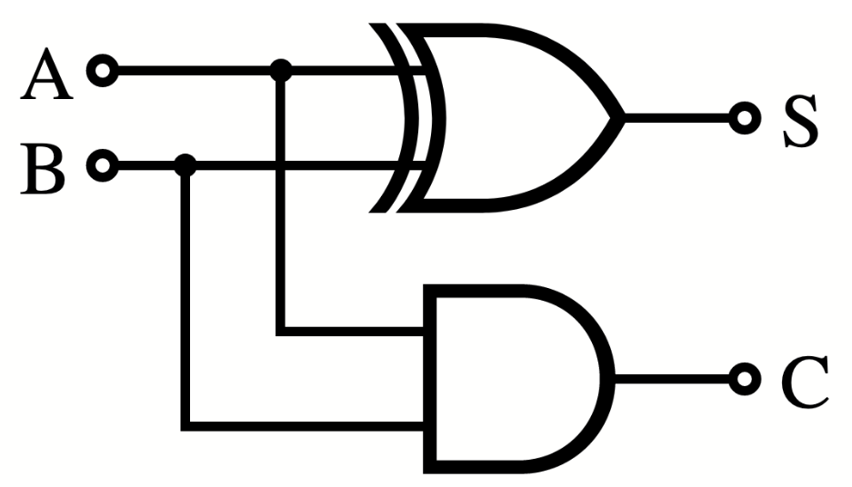

对于量子计算机，我们使用相同的基本思想，但对于表示输入、输出和用于操作的符号有不同的约定。下面的就是一个量子回路，表示了与上图相同的过程。

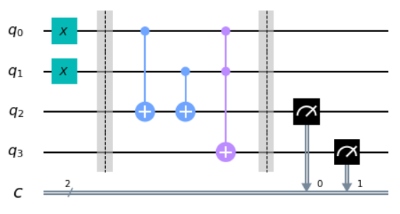

在本节的其余部分，我们将解释如何构建量子回路。在最后您会知道如何创建上面的回路，及其作用和意义。

### 第一个量子回路

在回路中，通常需要做三件事：首先对输入进行编码，然后进行一些实际的计算，最后提取输出。对于您的第一个量子回路，我们将聚焦在这些工作的最后一个。我们首先创建一个有8个量子比特和8个输出的回路。

> n = 8
>
> n_q = n
>
> n_b = n
>
> qc_output = QuantumCircuit(n_q,n_b)

在上述代码中创建的量子回路称之为qc_output，是由Qiskit使用QuantumCircuit创建的。数字n_q定义了回路中量子比特数量。n_b定义为从最后的回路中提取的输出比特数量。

在量子回路中，输出的提取是通过一种叫做**测量（measure**）的操作来完成的。每个测量都告诉一个特定量子比特给出一个特定的输出比特。下面的代码向8个量子比特中的每一个都添加一个测量操作。量子比特和比特都是由0到7的数字标记的（因为程序员喜欢这样做）。qc.measure(j,j)命令向回路qc添加一个测量，告诉量子比特j向比特j给出一个输出。

> for j in range(n):
>
> qc_output.measure(j,j)

现在我们的回路中有一些东西，我们来看一下。

qc_output.draw()

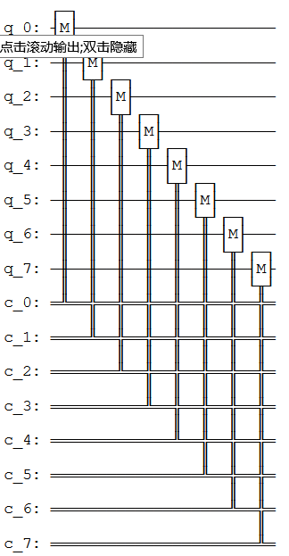

量子比特总是初始化为输出0。因为我们未对上面回路中的量子比特做任何处理，这就是我们测量量子比特时得到的结果。可以通过多次运行回路并将结果绘制成柱状图来了解这一点。我们会发现每个量子比特的结果总为00000000。

> counts =
> execute(qc_output,Aer.get_backend(\'qasm_simulator\')).result().get_counts()
>
> plot_histogram(counts)

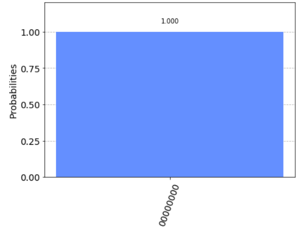

运行多次并将结果显示为柱状图的原因是，量子计算机的结果可能存在一些随机性。在这种情况下，由于没有做任何量子计算，只确定得到了00000000的结果。

请注意，这一结果来自于一个量子模拟器，其本质仍是一个标准的计算机，理想的量子计算机会做什么？模拟器只可能运行少量的量子比特（大约30个)，但仍是设计第一个量子回路时非常有用的工具。若要在实际设备上运行，只需将Aer.get_backend(\'qasm_simulator\')替换为您想要使用设备的后端对象。

4.  ### 示例：创建一个加法回路

    1.  #### 编码输入

现在让我们看看如何将不同的二进制字串编码为输入。为此，我们需要一个被称为"非门NOT
gate"的东西。这是您在电脑上能做的最基本操作。非门可将比特值0翻转为1，1翻转为0。在量子计算中一个叫做x的运算来完成"非门"的工作。

在本小节中我们将创建了一个名称为qc_encode的用于编码输入的新回路。现在只指定量子比特的数目。

> qc_encode = QuantumCircuit(n)
>
> qc_encode.x(7)
>
> qc_encode.draw()
>
> 输出：


提取结果可以使用之前的回路：qc_output。使用qc_encode +
qc_output将创建一个新的回路，其中包含提取在回路末端输出所需的所有内容。

> qc = qc_encode + qc_output
>
> qc.draw(output=\'mpl\',justify=\'none\')
>
> 输出：


现在可以运行上述的组合回路并查看结果。

可以看到现在计算机输出的是字串10000000。

> counts =
> execute(qc,Aer.get_backend(\'qasm_simulator\')).result().get_counts()
>
> plot_histogram(counts)
>
> 输出：


我们所翻转的那个比特，来自于量子比特7，位于字串的最左边。这是因为Qiskit将字串中的比特从右到左编号。有些人喜欢用另一种方式给比特编号，但是当我们用比特来表示数字时，Qiskit的系统肯定有其优势。具体来说，量子比特7告诉我们在数字中有多少个$2^{7}$。通过翻转这个比特，我们现在已经能够在一个简单的8位计算机中写入了数字128。

现在您可以试着再写一个数字，比如您的年龄。只要用搜索引擎找出相对应的二进制数字，然后如果你小于64岁，在左边加几个0。

> qc_encode = QuantumCircuit(n)
>
> qc_encode.x(1)
>
> qc_encode.x(5)
>
> qc_encode.draw()
>
> 输出：


至此我们了解了如何在计算机中对信息进行编码。下一步是对其进行处理：将编码的输入转换为需要的输出。

#### 4.2 回想如何做加法

为了将输入转化为输出，我们需要解决一个问题。现在让我们做一些基本的数学运算。在小学时您会学到如何把大的数学问题分解成可处理的块。例如，您如何解决下面的问题？

$$\frac{\begin{matrix}
\ \ \ \ \ \ 9213 \\
 + \ \ \ 1854 \\
\end{matrix}}{= \ \ \ \ \ ????}$$

一种方法是从右到左一位数一位数地相加。从3+4开始：

$$\frac{\begin{matrix}
\ \ \ \ \ \ 9213 \\
 + \ \ \ 1854 \\
\end{matrix}}{= \ \ \ \ \ ???7}$$

然后是：

$$\frac{\begin{matrix}
\ \ \ \ \ \ 9213 \\
 + \ \ \ 1854 \\
\end{matrix}}{= \ \ \ \ \ ??67}$$

接着2+8=10。因为所得是一个两位数的答案，需要把答案中的1移到下一列。

$$\frac{\begin{matrix}
\ \ \ \ \ \ 9213 \\
 + \ \ \ 1854 \\
\end{matrix}}{\begin{matrix}
 = \ \ \ \ \ ?167 \\
\ \ \ \ \ \ \ \ \ 1\ \ \ \ \ \ \ \ \  \\
\end{matrix}}$$

最后计算9+1+1=11，就能获取最终结果：

$$\frac{\begin{matrix}
\ \ \ \ \ \ 9213 \\
 + \ \ \ 1854 \\
\end{matrix}}{\begin{matrix}
 = \ 11167 \\
\ \ \ \ \ \ \ \ \ 1\ \ \ \ \ \ \ \ \  \\
\end{matrix}}$$

这也许只是简单的加法，但其演示了所有算法背后的原理。无论这个算法是用来解决数学问题，还是用来处理文本或图像，我们总是把大任务分解成小而简单的步骤。

若要在计算机上运行，算法需要被编译到最小且最简单的步骤。为了看看算法的样子，我们用二进制再做一遍上面的加法问题。

$$\frac{\begin{matrix}
\ \ \ \ \ \ 10001111111101 \\
 + \ \ \ 00011100111110 \\
\end{matrix}}{= \ \ \ ?????????????}$$

注意第二个数的左边有一串额外的0，是为了让两个字符串的长度相同。

我们的第一个任务是对右边的列执行1+0。二进制与任何数字系统中一样，其结果是1。对于第二列的0+1我们得到了相同的结果。

$$\frac{\begin{matrix}
\ \ \ \ \ \ 10001111111101 \\
 + \ \ \ 00011100111110 \\
\end{matrix}}{= \ \ \ ???????????11}$$

然后是1+1。您肯定知道1+1=2。在二进制中，数字2被写成10，因此需要两位，表明我们要进位1，如同在十进制中要进位10一样。

$$\frac{\begin{matrix}
\ \ \ \ \ \ 10001111111101 \\
 + \ \ \ 00011100111110 \\
\end{matrix}}{\begin{matrix}
 = \ \ \ ??????????011 \\
\ \ \ \ \ \ \ \ \ \ \ \ \ \ \ \ \ \ \ \ \ \ \ \ \ \ \ \ 1 \\
\end{matrix}}$$

下一列现在要求计算1+1+1，需要把三个数字加在一起，所以对于计算机来说，事情变得越来越复杂。但是我们仍然可以把将其编译成更简单的操作，并且只需要把两个比特加在一起就可以了，可以从前两个1开始。

$$\frac{\begin{matrix}
\ \ \ \ \ \ \ \ 1 \\
 + \ \ \ \ \ 1 \\
\end{matrix}}{= \ \ 10}$$

现在需要把这个10与最后一个1相加，此时可以我们用通常的方法来做。

$$\frac{\begin{matrix}
\ \ \ \ \ \ \ \ 11 \\
 + \ \ \ \ \ 10 \\
\end{matrix}}{= \ \ \ \ 11}$$

最终的结果是11（也就是十进制的3）。

现在回到问题的其余部分。有了答案11，我们就有了另一个进位。

$$\frac{\begin{matrix}
\ \ \ \ \ \ 10001111111101 \\
 + \ \ \ 00011100111110 \\
\end{matrix}}{\begin{matrix}
 = \ \ \ \ ?????????1011 \\
\ \ \ \ \ \ \ \ \ \ \ \ \ \ \ \ \ \ \ \ \ \ 11 \\
\end{matrix}}$$

现在我们还有另一个1+1+1要操作。但我们已经知道怎么做了，所以没什么大不了的。

事实上，到目前为止剩下的事情我们都已经知道如何去做了。这是因为，如果您把所有的东西都分解成加2个比特，那么就只需要计算4中可能情况。以下是四中基本的和，其中把所有的答案用来2个比特表示，以保持一致。

0+0 = 00 (十进制 0+0=0)

0+1 = 01 (十进制 0+1=1)

1+0 = 01 (十进制 1+0=1)

1+1 = 10 (十进制 1+1=2)

这叫做半加器（**half
adder**）。如果我们的计算机可以实现，并且如果该计算机可以把这些操作链接在一起，那么这一计算机就可以累加任一值。

#### 4.3 使用Qiskit进行加法操作

现在用Qiskit制作我们自己的半加器。这一量子半加器中将包括对输入进行编码、执行算法和提取结果的回路。每当我们想要使用一个新的输入时，第一编码输入部分就需要改变，但其余部分将会始终保持不变。


我们想要加入的两个比特被编码成量子比特0和1。上图的例子中将这两个量子比特中都编码为1，因此其寻求的是1+1的解。结果是一个由两个比特组成的字串，将从量子比特2和3中读出。剩下的就是填写实际程序，位于中间的空白区域。

图中的虚线仅是为了区分回路的不同部分（尽管也可以有更有趣的用途）。虚线是使用barrier命令生成。

计算的基本操作被称为逻辑门（logic
gate）。上文中我们已经使用了非门，但仅有非门并不足以使实现半加器，只能用非门来手动写出答案。但是既然我们想让计算机为我们做实际的计算，我们就需要一些更为强大的逻辑门。

为了了解我们需要什么，再看看半加器需要做什么。

0+0 = 00

0+1 = 01

1+0 = 01

1+1 = 10

上面的四个答案中最右边的比特完全取决于我们添加的两个比特是相同的还是不同的。对于0+0和1+1的答案最右边的比特是0。对于0+1和1+0，当不同的比特值相加时，最右边的比特是1。

为了使这部分解正确，需要一些东西来判断两位是否不同。在传统数字计算的研究中被称为异或门（**XOR
gate**）。

|**Input 1**   |**Input 2**   |**XOR Output**|
|:--|:--|:--|
|0             |0             |0|
|0             |1             |1|
|1             |0             |1|
|1             |1             |0|

在量子计算机中，异或门的工作由受控非门（controlled-NOT gate）完成的。

> qc_cnot = QuantumCircuit(2)
>
> qc_cnot.cx(0,1)
>
> qc_cnot.draw()
>
> 输出：


因为该名字很长，所以通常就叫做CNOT，Qiskit中的名字是cx，甚至更短。回路图如下所示：

上面的CNOT作用于一个量子比特对。其中一个作为控制量子比特（有小黑点的）。另一个为目标量子比特（有x的）。

理论上有多种方法可以解释CNOT的效果。一种说法是它会查看两个输入比特，检查其是相同还是不同，然后把答案写在目标量子比特上。如果它们相同，则目标为0，如果不同，则目标为1。

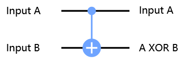

另一种解释CNOT的方法是，如果控制端为1，则其对目标执行NOT，而不执行其他操作。这一解释和前一解释同样有效（事实上，正是由于这一解释才给予这一逻辑门CNOT的名称）。

您可以通过每种可能的输入来测试CNOT。例如，以下是一个用输入01测试CNOT的回路。

> qc = QuantumCircuit(2,2)
>
> qc.x(0)
>
> qc.cx(0,1)
>
> qc.measure(0,0)
>
> qc.measure(1,1)
>
> qc.draw()
>
> 输出：


如果云心这一回路，您会发现输出是11，这是由于下述原因之一：

-   CNOT计算输入值是否不同，若发现不同则输出1。通过写入量子比特1的状态（记住，它在比特字串的左边），将01变成11来实现这一点。

-   CNOT看到量子比特0处于状态1，所以对量子比特1应用NOT。这样就把量子比特1的0变成了1，从而把01变成了11。

下面是CNOT门的所有可能输入与对应输出的表格：

| Input  (q1 q0) | Output (q1 q0) |
| :------------: | :------------: |
|       0        |       0        |
|       1        |       11       |
|       10       |       10       |
|       11       |       1        |

对于半加器，我们并不想要覆写一个输入。相反，我们想把结果写在另一对量子比特上，为此可以使用两个CNOT。

> qc_ha = QuantumCircuit(4,2)
>
> \# encode inputs in qubits 0 and 1
>
> qc_ha.x(0) \# For a=0, remove this line. For a=1, leave it.
>
> qc_ha.x(1) \# For b=0, remove this line. For b=1, leave it.
>
> qc_ha.barrier()
>
> \# use cnots to write the XOR of the inputs on qubit 2
>
> qc_ha.cx(0,2)
>
> qc_ha.cx(1,2)
>
> qc_ha.barrier()
>
> \# extract outputs
>
> qc_ha.measure(2,0) \# extract XOR value
>
> qc_ha.measure(3,1)
>
> qc_ha.draw()
>
> 输出：

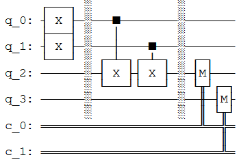

我们现在实现了一个完全半加器的一半功能。只剩下用于输出的比特要处理：存在于量子比特4上的比特。

若再看一下四种可能的和，您会注意到只有一种情况是1代替0：1+1=10。只有当我们加的两个比特都是1时才会发生。

为了计算这部分的输出，我们可以让计算机看看是否两个输入都是1。当且仅当都是1时------我们需要在量子比特4上做一个非门，把值翻转到所需的值1（仅在本例中），从而得到想要的输出。

为此我们需要一个新的逻辑门：与CNOT类似，但控制端在两个量子比特而非一个。只有当两个控制端都处于状态1时，才会对目标量子比特执行NOT。这一新的逻辑门叫做***Toffoli门***。对于熟悉布尔逻辑门的人来说，其基本上就是一个与门（**AND
gate**）。

在Qiskit中，Toffoli用ccx命令表示。

> qc_ha = QuantumCircuit(4,2)
>
> \# encode inputs in qubits 0 and 1
>
> qc_ha.x(0) \# For a=0, remove the this line. For a=1, leave it.
>
> qc_ha.x(1) \# For b=0, remove the this line. For b=1, leave it.
>
> qc_ha.barrier()
>
> \# use cnots to write the XOR of the inputs on qubit 2
>
> qc_ha.cx(0,2)
>
> qc_ha.cx(1,2)
>
> \# use ccx to write the AND of the inputs on qubit 3
>
> qc_ha.ccx(0,1,3)
>
> qc_ha.barrier()
>
> \# extract outputs
>
> qc_ha.measure(2,0) \# extract XOR value
>
> qc_ha.measure(3,1) \# extract AND value
>
> qc_ha.draw()
>
> 输出：


在这个示例中计算了1+1，由于两个输入比特都是1，看看能得到什么。

> counts =
> execute(qc_ha,Aer.get_backend(\'qasm_simulator\')).result().get_counts()
>
> plot_histogram(counts)
>
> 输出：


结果是10，是十进制数字2的二进制表示。我们已经建立了一个能够解决著名的数学问题1+1的计算器。

现在您可以用其他三种可能的输入进行尝试，并证明上述的算法也给出了正确结果。

半加器包含了所有需要的加法。使用NOT、CNOT和Toffoli门，我们可以创建累加任意大小的任意数字的程序。

这三个门也足以在计算机领域做任何事情。事实上，我们甚至可以不使用CNOT，而非门实际上只需要创建值为1的比特。Toffoli门实质上是数学的基元，是其他所有问题解决技术都可以编译成的最简单元素。

正如下面的代码的输出所示，在量子计算中我们会拆分基元。

> import qiskit
>
> qiskit.\_\_qiskit_version\_\_
>
> 输出：
>
> {\'qiskit-terra\': \'0.14.1\',
>
> \'qiskit-aer\': \'0.5.1\',
>
> \'qiskit-ignis\': \'0.3.0\',
>
> \'qiskit-ibmq-provider\': \'0.7.1\',
>
> \'qiskit-aqua\': \'0.7.1\',
>
> \'qiskit\': \'0.19.2\'}

1.3 呈现量子比特的状态
----------------------

现在您对比特和所熟悉的数字计算机的工作原理有了一些了解。在现代软件中使用的所有复杂变量、对象和数据结构基本上都是一大堆比特。从事量子计算的人称之为经典变量。使用经典变量的计算机，就像您用来阅读这篇文章的计算机，称之为经典计算机。

在量子计算机中，我们的基本变量是量子比特：比特的量子变体。量子比特所有的限制与经典比特完全相同：只能存储单个二进制比特的信息，并且只能输出0或1。然而，量子比特也可以被操纵，但只能用量子力学来描述。这一点给我们提供了新的选择，让我们可以找到设计算法的新方法。

若要完全理解这些新的量子门，我们首先需要理解如何写出量子态。为此，我们将使用向量、矩阵和复数的数学方法。虽然我们将在进行过程中介绍这些概念，但是最好您对其有所熟悉。如果需要更深入的解释或复习，可以在本教程"0.预备知识"的线性代数中找到相应的指南。

### 本节的内容

1.  经典比特与量子比特

    1.  态向量

    2.  量子比特的表示法

    3.  使用Qiskit探索量子比特

2.  测量规则

> 2.1 一条非常重要的规则
>
> 2.2 这一规则的寓意

3.  Bloch球

    1.  描述受限量子比特的状态

    2.  直观地呈现一个量子比特的状态

```{=html}
<!-- -->
```
1.  ### 经典比特与量子比特

    1.  #### 态向量

在量子物理中我们使用态向量（**statevector**）描述一个系统的状态。假设我们想描述一辆车沿着轨道的位置，在这一经典的系统中可以用一个数字x描述：


或者，我们可以使用一个名为statevector向量中的数字集合来描述。statevector中的每个元素都含有在某一位置找到汽车的概率：


这中表示方法并不局限于位置，还可以用态向量记录所有可能的速度以及所有可能的颜色。在经典系统中（如上面的汽车例子），这是一件愚蠢的事情，因为当我们只需要一个数字时，该系统需要包含巨量的向量。但是正如我们将在本章中看到的，态向量碰巧是持续跟踪量子系统（包括量子计算机）一种非常好的方法。

#### 量子比特表示法

经典比特总是有一个完全良好定义的状态：在计算过程中的每一个点都是0或1。我们不能在这一样的一个比特上增加状态的细节。所以要写入经典比特(c)状态a，我们仅能用这两个二进制值。例如：

c = 0

量子比特的这种限制被解除了。无论我们从一个量子比特得到0还是1，只需要在进行测量以提取输出时定义清楚即可。此时，其必须提交所使用的这两个选项中的一个。在其他任何时候，其状态都比一个简单的二进制值所能捕捉到的要复杂。

为了了解如何描述这些，我们可以首先关注两个最简单的情况。正如我们在上一节中所看到的，有可能准备一个量子比特，使其在测量时的结果明确为0。

我们需要为这一状态命名，就叫做0吧。类似地，存在一个一定会输出1的量子比特状态，叫做1。这两种状态完全互斥。要么量子比特明确输出0，要么明确输出1，没有重叠。用数学表示它的一种方法是使用两个正交的向量。

$$\left| 0 \right\rangle = \begin{bmatrix}
1 \\
0 \\
\end{bmatrix}\text{\ \ }\left| 1 \right\rangle = \begin{bmatrix}
0 \\
1 \\
\end{bmatrix}$$

这是一个很复杂的概念。首先让我们了解奇怪的符号\|和⟩。这两个符号的作用本质上就是提醒我们，所讨论的是表示量子比特状态的向量，标记为0和1。这些符号有助于我们将其与诸如比特值0和1或数字0和1之类的东西区分开来。两个符号是由狄拉克引入的"狄拉克符号（bra-ket
notation）"的一部分。

如果您不熟悉向量，可以把它们想象成一串用一些特定的规则处理的数字。如果您在高中物理课上熟悉向量，就会知道这些规则使向量非常适合描述有大小和方向的量。例如，一个物体的速度可以用向量完美地描述。然而，我们用向量表示量子态的方式与此稍有不同。所以不要太执着于之前的直觉，是时候做一些新的事情了!

通过向量我们可以描述更复杂的状态，而不仅仅是\|0⟩和\|1⟩，比如向量：

$$\left| q_{0} \right\rangle = \begin{bmatrix}
\frac{1}{\sqrt{2}} \\
\frac{i}{\sqrt{2}} \\
\end{bmatrix}$$

为了理解这一状态所代表的含义，我们需要使用数学规则来处理这个向量。具体来说，我们需要理解如何将向量相加以及如何与标量相乘（**scalar**）。

**提示：按标量进行矩阵加法和乘法**

两个向量相加，把它们的元素相加：

$$\left| a \right\rangle = \begin{bmatrix}
a_{0} \\
a_{1} \\
 \vdots \\
a_{n} \\
\end{bmatrix}\ ,\ \left| b \right\rangle = \begin{bmatrix}
b_{0} \\
b_{1} \\
 \vdots \\
b_{n} \\
\end{bmatrix}$$

$$\left| a \right\rangle + \left| b \right\rangle = \begin{bmatrix}
a_{0} + b_{0} \\
a_{1} + b_{1} \\
 \vdots \\
a_{n} + b_{n} \\
\end{bmatrix}$$

将一个向量乘以一个标量，就是将向量中的每个元素乘以标量：

$$x\left| a \right\rangle = \begin{bmatrix}
x \times a_{0} \\
x \times a_{1} \\
 \vdots \\
x \times a_{n} \\
\end{bmatrix}$$

这两个规则用于重写向量$\left| q_{0} \right\rangle$(如上所示):

$${\left| q_{0} \right\rangle = \frac{1}{\sqrt{2}}\left| 0 \right\rangle + \frac{i}{\sqrt{2}}\left| 1 \right\rangle
}{= \frac{1}{\sqrt{2}}\begin{bmatrix}
1 \\
0 \\
\end{bmatrix} + \frac{i}{\sqrt{2}}\begin{bmatrix}
0 \\
1 \\
\end{bmatrix}
}{= \begin{bmatrix}
\frac{1}{\sqrt{2}} \\
0 \\
\end{bmatrix} + \begin{bmatrix}
0 \\
\frac{i}{\sqrt{2}} \\
\end{bmatrix}
}{= \begin{bmatrix}
\frac{1}{\sqrt{2}} \\
\frac{i}{\sqrt{2}} \\
\end{bmatrix}}$$

**提示：标准正交基(Orthonormal Base)**

正如在之前申明的一样，两个向量\|0⟩和\|1⟩正交，表明这两个向量都是正交和正规化（normalised）。正交表示两个向量成直角:

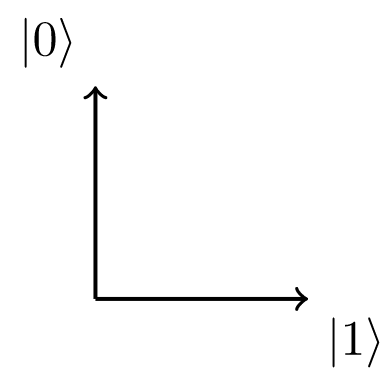

正规化表示向量的大小（箭头的长度）等于1。若两个向量\|0⟩和\|1⟩是线性无关,表明我们不能描述用\|1⟩描述\|0⟩，反之亦然。然而,使用向量\|0⟩和\|1⟩以及加法和标量乘法的规则,我们可以描述所有可能的2D空间中向量:

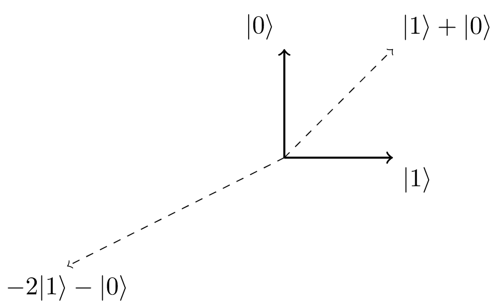

由于向量\|0⟩与\|1⟩线性无关,并且可以通过使用向量加法和标量乘法来描述在2D空间中的任一向量,我们说向量\|0⟩和\|1⟩是2D空间的基。在这种情况下，因为这两个向量都是正交和正规，所以称之为标准正交基（orthonormal
basis）。

由于状态\|0⟩和\|1⟩形成了一组标准正交基，我们可以用这两个状态的组合代表任一2D向量。这就可以让我们把量子比特的状态写成另一种形式：

$$\left| q_{0} \right\rangle = \frac{1}{\sqrt{2}}\left| 0 \right\rangle + \frac{i}{\sqrt{2}}\left| 1 \right\rangle$$

向量$\left| q_{0} \right\rangle$被称为量子比特的态向量（**statevector**），告诉我们量子比特所能知道的一切。至此，我们只能得出一些有关这一特定态向量例子的简单结论：并不完全为\|0⟩，也不完全为\|1⟩。相反，上面的态向量是由$\left| 0 \right\rangle$与$\left| 1 \right\rangle$的线性组合来描述的。在量子力学中，我们通常用"叠加（**superposition**）"这个词来描述类似的线性组合。

显然我们的态向量$\left| q_{0} \right\rangle$的示例可以表示为一个\|0⟩和\|1⟩的叠加，没有比其更能明确且良好定义的量子比特状态了。为了说明这一点，我们开始探索如何操纵一个量子比特。

#### 使用Qiskit探索量子比特

首先，我们需要在Python中导入需要的所有工具：

> from qiskit import QuantumCircuit, execute, Aer
>
> from qiskit.visualization import plot_histogram, plot_bloch_vector
>
> from math import sqrt, pi

在Qiskit中使用QuantumCircuit对象来存储量子回路，本质上是回路中的量子以及所作用量子比特的列表。

qc = QuantumCircuit(1) \# Create a quantum circuit with one qubit

在量子回路中，量子比特总是以状态\|0⟩开始。可以使用initialize()方法将其转换为任一状态。我们以列表的形式给与方法initialize()想要的向量，并告诉它初始化哪一量子比特为这一状态：

> qc = QuantumCircuit(1) \# Create a quantum circuit with one qubit
>
> initial_state = \[0,1\] \# Define initial_state as
> $\left| 1 \right\rangle$
>
> qc.initialize(initial_state, 0) \# Apply initialisation operation to
> the 0th qubit
>
> qc.draw() \# Let\'s view our circuit
>
> 输出：


然后，使用Qiskit的模拟器之一来查看量子比特的结果状态。首先，我们将使用statevector模拟器，将在稍后解释不同的模拟器及其用途。

backend = Aer.get_backend(\'statevector_simulator\') \# Tell Qiskit how
to simulate our circuit

为了从回路中得到结果，通过将回路和后端（backend）作为参数输入execute中来运行该回路。然后使用.result()来获得以下结果：

> qc = QuantumCircuit(1) \# Create a quantum circuit with one qubit
>
> initial_state = \[0,1\] \# Define initial_state as
> $\left| 1 \right\rangle$
>
> qc.initialize(initial_state, 0) \# Apply initialisation operation to
> the 0th qubit
>
> result = execute(qc,backend).result() \# Do the simulation, returning
> the result

根据result，我们可以使用.get_statevector()获得最终的statevector：

> qc = QuantumCircuit(1) \# Create a quantum circuit with one qubit
>
> initial_state = \[0,1\] \# Define initial_state as \|1\>
>
> qc.initialize(initial_state, 0) \# Apply initialisation operation to
> the 0th qubit
>
> result = execute(qc,backend).result() \# Do the simulation, returning
> the result
>
> out_state = result.get_statevector()
>
> print(out_state) \# Display the output state vector
>
> 输出：
>
> \[0.+0.j 1.+0.j\]

**注意**：Python使用j表示复数的i。从输出中可以看到一个有两个复元素的向量：0.+0.j
= 0，和1 +0.j = 1。

现在让我们像在真正的量子计算机中一样测量量子比特，来看看结果：

> qc.measure_all()
>
> qc.draw()
>
> 输出：


这次，我们不再使用statevector，而是使用.get_counts()来获取0和1结果的计数：

> result = execute(qc,backend).result()
>
> counts = result.get_counts()
>
> plot_histogram(counts)
>
> 输出：


可以看到,毫无疑问的有100%的机会测量值为\|1⟩。这一次，把量子比特放到叠加位置，看看会发生什么，在此我们将使用在本节中之前的状态$\left| q_{0} \right\rangle$：

$$\left| q_{0} \right\rangle = \frac{1}{\sqrt{2}}\left| 0 \right\rangle + \frac{i}{\sqrt{2}}\left| 1 \right\rangle$$

我们需要将这些幅值添加到python列表中。为了表述复数幅值，我们使用复数并给出实部和虚部作为参数：

initial_state = \[1/sqrt(2), 1j/sqrt(2)\] \# Define state \|q\>

然后我们重复初始化量子比特的步骤：

> qc = QuantumCircuit(1) \# Must redefine qc
>
> qc.initialize(initial_state, 0) \# Initialise the 0th qubit in the
> state \`initial_state\`
>
> state = execute(qc,backend).result().get_statevector() \# Execute the
> circuit
>
> print(state) \# Print the result
>
> 输出：
>
> \[0.70710678+0.j 0.+0.70710678j\]
>
> results = execute(qc,backend).result().get_counts()
>
> plot_histogram(results)
>
> 输出：

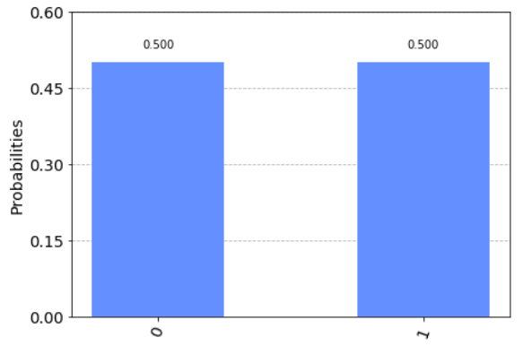

可以看到我们测量\|0⟩或\|1⟩所得概率相等。为了向您解释这一点，需要谈一谈测量。

2.  ### 测量规则

    1.  #### 一条非常重要的规则

有一条简单的测量规则。找出在我们所创建的态$\left| x \right\rangle$中测量出态$\left| \psi \right\rangle$的概率：

$$p(|\psi\rangle) = \left| \left\langle \psi \middle| x \right\rangle \right|^{2}$$

其中符号⟨和\|表示$\left\langle \psi \right|$是一个行向量。在量子力学中，我们称列向量为右矢（ket），称行向量为左矢（bra），合在一起构成了狄拉克符号。任何右矢$\left| a \right\rangle$都有对应的左矢$\left\langle a \right|$，可以使用共轭转置（conjugate
transpose）对其进行转换。

**提示：内积（Inner Product）**

向量相乘有不同的方法，在这里我们用内积。内积是点积（*dot
product*）的一般化，对于点积您可能已经很熟悉了。在本指南中，我们使用了一个左矢(行向量)和一个右矢(列向量)之间的内积，其遵循以下规则:

$$\langle a| = \left\lbrack a_{0}^{*},a_{1}^{*},\cdots,a_{n}^{*} \right\rbrack\ ,\left| b \right\rangle = \begin{bmatrix}
b_{0} \\
b_{1} \\
 \vdots \\
b_{n} \\
\end{bmatrix}$$

$$\left\langle a \middle| b \right\rangle = a_{0}^{*}b_{0} + a_{1}^{*}b_{1} + \cdots + a_{n}^{*}b_{n}$$

可以看到两个向量的内积总是给出一个标量。记住其中一个有用的概念：**两个正交向量的内积为0**。例如,如果有两个正交向量$|0\rangle$和$|1\rangle$：

$$\left\langle 0 \middle| 1 \right\rangle = \left\lbrack 0,1 \right\rbrack\begin{bmatrix}
1 \\
0 \\
\end{bmatrix} = 0$$

另外，也应记住向量$|0\rangle$和$|1\rangle$也都是正规化的（大小等于1）：

$$\left\langle 0 \middle| 0 \right\rangle = \left\lbrack 1,0 \right\rbrack\begin{bmatrix}
1 \\
0 \\
\end{bmatrix} = 1$$

$$\left\langle 1 \middle| 1 \right\rangle = \left\lbrack 0,1 \right\rbrack\begin{bmatrix}
0 \\
1 \\
\end{bmatrix} = 1$$

在上面的等式中，$\left| x \right\rangle$可以是量子比特的任一状态。为了找出测量$\left| x \right\rangle$的概率，我们取$\left| x \right\rangle$和所测状态（本示例中为$\left| \psi \right\rangle$）的内积，然后对起结果取平方。听上去有点复杂，但很快就会成为您的第二天性。

如果我们回头看一下之前的态$\left| q_{0} \right\rangle$，能够看到测量$\left| 0 \right\rangle$的概率是0.5。

$${\left| q_{0} \right\rangle = \frac{1}{\sqrt{2}}\left| 0 \right\rangle + \frac{i}{\sqrt{2}}\left| 1 \right\rangle
}{\langle q_{0}| = \frac{1}{\sqrt{2}}\langle 0| - \frac{i}{\sqrt{2}}\langle 1|
}{\left\langle q_{0} \middle| 0 \right\rangle = \frac{1}{\sqrt{2}}\left\langle 0 \middle| 0 \right\rangle - \frac{i}{\sqrt{2}}\left\langle 1 \middle| 0 \right\rangle
}{\left\langle q_{0} \middle| 0 \right\rangle = \frac{1}{\sqrt{2}} \bullet 1 - \frac{i}{\sqrt{2}} \bullet 0
}{\left\langle q_{0} \middle| 0 \right\rangle = \frac{1}{\sqrt{2}} \Rightarrow {|\left\langle q_{0} \middle| 0 \right\rangle|}^{2} = \frac{1}{2}}$$

您可以把验证测量$\left| 1 \right\rangle$的概率当作练习。

这一规则支配着我们如何从量子态得到信息，因此对我们在量子计算中所做的一切都非常重要。该规则也直接暗示了一些重要的事实。

#### 这一条规则的寓意

##### \#1 标准化、正态化（Normalisation）

这条规则告诉我们幅值与概率有关。如果想让概率加起来等于1，需要确保态向量恰当地归一化。具体来说，我们需要态向量的大小为1。

$$\left\langle \psi \middle| \psi \right\rangle = 1$$

因此，如果：

$$\left| \psi \right\rangle = \alpha\left| 0 \right\rangle + \beta\left| 1 \right\rangle$$

然后：

$$\sqrt{\left| \alpha \right|^{2} + \left| \beta \right|^{2}} = 1$$

这就解释了在本章中见到过的因子$\sqrt{2}$。事实上，如果我们试图给initialize()一个正规化的向量，就会给出一个错误：

> vector = \[1,1\]
>
> qc.initialize(vector, 0)
>
> 输出：
>
> \-\-\-\-\-\-\-\-\-\-\-\-\-\-\-\-\-\-\-\-\-\-\-\-\-\-\-\-\-\-\-\-\-\-\-\-\-\-\-\-\-\-\-\-\-\-\-\-\-\-\-\-\-\-\-\-\-\-\-\-\-\-\-\-\-\-\-\-\-\-\-\-\-\--
>
> QiskitError Traceback (most recent call last)
>
> \<ipython-input-28-ddc73828b990\> in \<module\>
>
> 1 vector = \[1,1\]
>
> \-\-\--\> 2 qc.initialize(vector, 0)
>
> \~/anaconda3/lib/python3.7/site-packages/qiskit/extensions/quantum_initializer/initializer.py
> in initialize(self, params, qubits)
>
> 252 if not isinstance(qubits, list):
>
> 253 qubits = \[qubits\]
>
> \--\> 254 return self.append(Initialize(params), qubits)
>
> 255
>
> 256
>
> \~/anaconda3/lib/python3.7/site-packages/qiskit/extensions/quantum_initializer/initializer.py
> in \_\_init\_\_(self, params)
>
> 56 if not math.isclose(sum(np.absolute(params) \*\* 2), 1.0,
>
> 57 abs_tol=\_EPS):
>
> \-\--\> 58 raise QiskitError(\"Sum of amplitudes-squared does not
> equal one.\")
>
> 59
>
> 60 num_qubits = int(num_qubits)
>
> QiskitError: \'Sum of amplitudes-squared does not equal one.\'

###### 快速练习

1.  构建一个态向量，其能在测量$\left| 0 \right\rangle$时给出1/3的概率。

2.  构建一个不同的态向量，但能够给出相同的测量概率。

3.  验证测量$\left| 1 \right\rangle$的两个这两个态的概率是2/3。

您可以在下面的小工具中查看答案（你可以在向量中使用"pi"和"sqrt"）：

> \# Run the code in this cell to interact with the widget
>
> from qiskit_textbook.widgets import state_vector_exercise
>
> state_vector_exercise(target=1/3)
>
> \#qiskit_textbook这个模块一直都没有找到

##### \#2 替代测量

测量规则给出了$\left| x \right\rangle$中测得$\left| \psi \right\rangle$的概率$p(|x\rangle)$，还告诉我们$\left| x \right\rangle$要么是$\left| 0 \right\rangle$，要么是$\left| 1 \right\rangle$。

到目前为止，我们所考虑的测量实际上只是测量一个量子比特无数可能方法中的一种。对于任何正交的状态对，我们可以定义一个度量，使量子比特在这两个状态之间进行选择。

下一节将进一步探讨这种可能性。现在,请仅记住$\left| x \right\rangle$并不局限于只是$\left| 0 \right\rangle$或$\left| 1 \right\rangle$。

##### \#3 全局相位（Global Phase）

我们知道测量态\|1⟩将给出确定输出1。但是我们也可以写出类似以下的状态：

$$\begin{bmatrix}
0 \\
i \\
\end{bmatrix} = i\left| 1 \right\rangle$$

为了了解其行为，对其应用测量规则。

$$\left| \left\langle x \middle| \left( i \middle| 1 \right\rangle \right) \right|^{2} = \left| i\left\langle x \middle| 1 \right\rangle \right|^{2} = \left| \left\langle x \middle| 1 \right\rangle \right|^{2}$$

此处我们发现：一旦取复数的大小时$i$就消失了。这一效果完全独立于态$\left| x \right\rangle$的测量。所以其与我们想要测量的无关，所测得态$i\left| x \right\rangle$的概率与测量态$\left| 1 \right\rangle$完全一致。由于测量是我们从一个量子比特中提取信息的唯一方法，表明这两种状态在物理相关的所有方面都是等价的。

更普遍的情况是，我们将在状态为$\left| \gamma \right| = 1$中的任一总体因子$\gamma$指称为"全局相位"。仅因全局相位而不同的状态在物理上是无法区分的。

$$\left| \left\langle x \middle| \left( \gamma \middle| a \right\rangle \right) \right|^{2} = \left| \gamma\left\langle x \middle| a \right\rangle \right|^{2} = \left| \left\langle x \middle| a \right\rangle \right|^{2}$$

注意！上述所讲的不同于叠加之间的相位差，叠加即所谓的"相对相位（**relative
phase**）"。一旦我们考虑不同类型的度量时就会变为相关。

##### \#4 观察者效应（The Observer Effect）

我们已经知道幅值包含了我们在特定状态下找到量子比特概率的信息，但是一旦我们测量了量子比特，就确切地知道了量子比特的状态。例如，如果在一个状态下测量量子比特：

$$\left| q \right\rangle = \alpha\left| 0 \right\rangle + \beta\left| 1 \right\rangle$$

发现该量子比特处于态$\left| 0 \right\rangle$，如果我们再次测量，则可以100%确定该量子比特处于态$\left| 0 \right\rangle$。表明测量操作改变（*change*）了量子比特的状态。

$$\left| q \right\rangle = \begin{bmatrix}
\alpha \\
\beta \\
\end{bmatrix}\overset{\text{Measure}\left| 0 \right\rangle}{\rightarrow}\left| q \right\rangle = \left| 0 \right\rangle = \begin{bmatrix}
1 \\
0 \\
\end{bmatrix}$$

我们有时把这称为塌缩量子比特的状态。这是一种强有力的影响，因此必须明智地加以利用。例如,我们在每次计算时不断地测量每个量子比特来跟踪它们的值，这些量子比特都只是在被定义明确的状态\|0⟩或\|1⟩之一。因此，量子比特与经典比特没有什么不同，我们的计算可以很容易被经典计算所取代。为了获得真正的量子计算，我们必须允许量子比特探索更复杂的状态。因此，只有在需要提取输出时才测量，其意义是我们经常把所有的测量放在量子回路的末端。

可以使用Qiskit的statevector模拟器来演示这一点。首先初始化一个叠加态量子比特：

> qc = QuantumCircuit(1) \# Redefine qc
>
> initial_state = \[0.+1.j/sqrt(2),1/sqrt(2)+0.j\]
>
> qc.initialize(initial_state, 0)
>
> qc.draw()
>
> 输出：


上面的代码初始化一个量子比特处于态：

$$\left| q \right\rangle = \frac{i}{\sqrt{2}}\left| 0 \right\rangle + \frac{1}{\sqrt{2}}\left| 1 \right\rangle$$

可以用模拟器来验证量子比特是否处于上述的状态：

> state = execute(qc, backend).result().get_statevector()
>
> print(\"Qubit State = \" + str(state))
>
> 输出：
>
> Qubit State = \[0.+0.70710678j 0.70710678+0.j\]

从输出中可以看到量子比特初始化的状态\[0.+0.70710678j
0.70710678+0.j\]，正是所期望的状态。

现在对该量子比特进行测量：

> qc.measure_all()
>
> qc.draw()
>
> 输出：


当我们模拟整个回路时，可以看到其中一个幅值总为0：

> state = execute(qc, backend).result().get_statevector()
>
> print(\"State of Measured Qubit = \" + str(state))
>
> 输出：
>
> State of Measured Qubit = \[0.+1.j 0.+0.j\]

您可以重新运行这个单元几次，以便重新初始化量子比特并再次测量。您可能会注意到所有的测量结果都是等可能的，但量子比特的状态从来就不是叠加了\|0⟩和\|1⟩。比较有趣的是，全局相位状态\|0⟩幸存了下来，但因为这是全局相位，我们永远无法在一个真正的量子计算机中对其测量。

####### 关于量子模拟器的说明

依据上述过程可以看到记录一个量子比特的状态需要跟踪两个复数，但是当使用真正的量子计算机时，我们只会收到每个量子比特处于是或否(0或1)答案。10-qubit的量子计算机输出如下所示：

0110111110

只有10位，没有叠加及复杂的幅值。当使用真正的量子计算机时，我们无法在计算过程中看到量子比特的状态，因为对其测量或破坏状态！这种行为对于学习来说并不理想，因此Qiskit提供了不同的量子模拟器：qasm_simulator的行为就像您在与真正的量子计算机进行交互一样，并且不允许您使用.get_statevector()。或者使用statevector_simulator（态向量模拟器）在测量之前查看量子态，正如使用的方式。

### 布洛赫球（Bloch Sphere）

#### 3.1 描述受限的量子比特状态

我们在本章的先前部分看到量子比特\|q⟩的一般状态：

$$\left| q \right\rangle = \alpha\left| 0 \right\rangle + \beta\left| 1 \right\rangle$$

$$\alpha,\beta\mathbb{\in C}$$

（第二行告诉我们$\alpha$和$\beta$是复数。）第2节的前两个含意告诉我们，我们无法区分其中的状态，表明可以更具体地描述量子比特。

首先，因为我们不能衡量全局相位，只能测量态\|0⟩和\|1⟩之间的相位差异。加入α和β就变得更加复杂了，我们可以将其限制在实数范围内，然后加上一项，以便找出之间的相对相位：

$$\left| q \right\rangle = \alpha\left| 0 \right\rangle + e^{\text{iϕ}}\beta\left| 1 \right\rangle\left( 欧拉公式：e^{\text{ix}} = cosx + isinx \right)$$

$$\alpha,\beta,\phi \in \mathbb{R}$$

最后，由于量子比特的状态必须正规化，即：

$$\sqrt{\alpha^{2} + \beta^{2}} = 1$$

可以用三角恒等式：

$$\sqrt{\sin^{2}x + \cos^{2}x} = 1$$

用一个变量$\theta$分别描述实数$\alpha$和$\beta$：

$\alpha = \cos\frac{\theta}{2}\ ,\ \beta = \sin\frac{\theta}{2}$

#### 3.2 直观地呈现一个量子比特的状态

我们会想要绘制出通常的量子比特状态：

$$\left| q \right\rangle = \cos\frac{\theta}{2}\left| 0 \right\rangle + e^{\text{iϕ}}\sin\frac{\theta}{2}\left| 1 \right\rangle$$

如果我们将$\theta$和$\phi$演绎为球体的坐标（r=1，因量子比特状态的大小是1），就可以在球体的表面绘制出任一量子比特，该球体称之为布洛赫球（Bloch
Sphere）。

下面我们绘制了一个量子比特\|+⟩的状态，其中θ=π/2、ϕ=0。

（Qiskit有一个用于绘制洛赫球的函数plot_bloch_vector()，但是在编写本文时，它只使用笛卡尔坐标。所以我们添加了一个自动转换的函数。）

> from qiskit_textbook.widgets import plot_bloch_vector_spherical
>
> coords = \[pi/2,0,1\] \# \[Theta, Phi, Radius\]
>
> plot_bloch_vector_spherical(coords) \# Bloch Vector with spherical
> coordinates
>
> 输出：

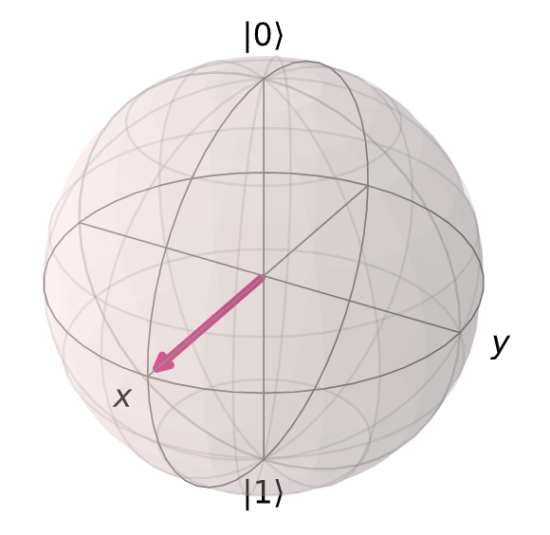

**警告！**

当第一次学习量子比特的状态时，很容易把量子比特的态向量与其Bloch向量混淆。请记住，在本教程1.1中讨论的态向量是向量，其中保存了量子比特可处于两种状态的幅值。Bloch向量是一种可视化工具，可以将复杂二维态向量映射到真实的三维空间。

从这一点来看，通过变量$\phi$和$\theta$可以描述任何量子比特的状态：

$$\left| q \right\rangle = \cos\frac{\theta}{2}\left| 0 \right\rangle + e^{\text{iϕ}}\sin\frac{\theta}{2}\left| 1 \right\rangle\ ,\ \ \theta,\phi\mathbb{\in R}$$

#### 快速练习

使用plot_bloch_vector()或plot_bloch_sphere_spherical()以下状态的量子比特：

1.  $\left| 0 \right\rangle$

2.  $\left| 1 \right\rangle$

3.  $\frac{1}{2}\left( \left| 0 \right\rangle + \left| 1 \right\rangle \right)$

4.  $\frac{1}{2}\left( \left| 0 \right\rangle - i\left| 1 \right\rangle \right)$

5.  $\frac{1}{2}\begin{bmatrix}
    i \\
    1 \\
    \end{bmatrix}$

我们还可以使用下面的小部件从球坐标转换为笛卡尔坐标，可将转换后的坐标用于plot_bloch_vector()：

> from qiskit_textbook.widgets import bloch_calc
>
> bloch_calc()
>
> import qiskit
>
> qiskit.\_\_qiskit_version\_\_
>
> 输出：
>
> {\'qiskit-terra\': \'0.14.1\',
>
> \'qiskit-aer\': \'0.5.1\',
>
> \'qiskit-ignis\': \'0.3.0\',
>
> \'qiskit-ibmq-provider\': \'0.7.1\',
>
> \'qiskit-aqua\': \'0.7.1\',
>
> \'qiskit\': \'0.19.2\'}

1.4 单量子比特门
----------------

在之前的章节中我们找寻了一个量子比特的可能状态。我们看到量子比特可以用二维向量表示，并且量子比特的状态被限制为：

$$\left| q \right\rangle = \cos\frac{\theta}{2}\left| 0 \right\rangle + e^{\text{iϕ}}\sin\frac{\theta}{2}\left| 1 \right\rangle$$

其中$\theta$和$\phi$是实数。本部分的内容将覆盖门（gate）：改变量子比特状态的操作。由于门的数量及其之间的相似性，本章有成为一个列表的风险。为了解决这一问题，我们在本章中适当的地方加入了一些题外话来介绍重要的思想。

### 内容

1.  泡利门（Pauli Gate）

    1.  泡利X门（Pauli X-Gate）

    2.  泡利Y和Z门（Pauli Y-Gate 、Pauli Z-Gate）

2.  题外话：X、Y和Z-基

3.  阿达马门（Hadamard Gate）

4.  题外话：以不同的基测量

5.  $R_{\phi}$门（R~ϕ~-gate）

6.  I、S和T-门（I、S、T-gates）

> 6.1 I-Gate
>
> 6.2 S-Gate
>
> 6.3 T-Gate

7.  通用U~3~门（U~3~-gate）

在基元的计算中会遇到了一些门，并用它们来进行经典的计算。量子回路的一个重要特征是在初始化量子比特和测量量子比特之间，操作（gate）总是可逆的！这些可逆的门可以表示为矩阵，也可以表示为绕布洛赫球的旋转。

> from qiskit import \*
>
> from math import pi
>
> from qiskit.visualization import plot_bloch_multivector

### 泡利门（Pauli Gate）

您应该熟悉线性代数部分的泡利矩阵。如果本部分中的数学知识对于您来说从未遇到，那么应该使用本教程的线性代数部分来加快阅读速度。我们将在本部分中了解到泡利矩阵可以用于表示一些非常常用的量子门。

#### 泡利 X-门（Pauli X-Gate）

Pauli X-门可用Pauli-X矩阵表示：

$$X = \left\lbrack \begin{matrix}
0 \\
1 \\
\end{matrix}\ \begin{matrix}
1 \\
0 \\
\end{matrix} \right\rbrack = |0\rangle\langle 1| + |1\rangle\langle 0|$$

要查看一个门对一个量子比特的影响，只需将这个量子比特的态向量乘以改门。可以看到：X-gate将量子比特状态的幅值\|0⟩转换为\|1⟩：

$$X\left| 0 \right\rangle = \left\lbrack \begin{matrix}
0 \\
1 \\
\end{matrix}\ \begin{matrix}
1 \\
0 \\
\end{matrix} \right\rbrack\begin{bmatrix}
1 \\
0 \\
\end{bmatrix} = \begin{bmatrix}
0 \\
1 \\
\end{bmatrix} = \left| 1 \right\rangle$$

**提示：向量乘以矩阵**

矩阵乘法是上一章中内积的一般化。在用一个向量乘以一个矩阵的特殊情况下（如上所示），总是会得到一个向量：

$$M\left| \upsilon \right\rangle = \left\lbrack \begin{matrix}
a \\
c \\
\end{matrix}\ \begin{matrix}
b \\
d \\
\end{matrix} \right\rbrack\begin{bmatrix}
\upsilon_{0} \\
\upsilon_{1} \\
\end{bmatrix} = \begin{bmatrix}
a \bullet \upsilon_{0} + b \bullet \upsilon_{1} \\
c \bullet \upsilon_{0} + d \bullet \upsilon_{1} \\
\end{bmatrix}$$

在量子计算中，我们可以把矩阵写成基向量的形式：

$$X = |0\rangle\langle 1| + |1\rangle\langle 0|$$

由于可以看到不同的乘法所产生的结果，有时比使用方框矩阵更清晰：

$$X|1\rangle = (|0\rangle\langle 1| + |1\rangle\langle 0|)|1\rangle = |0\rangle\langle 1|1\rangle + |1\rangle\langle 0|1\rangle = |0\rangle \times 1 + |1\rangle \times 0 = |0\rangle$$

事实上，当右矢（ket）和左矢（bra）相乘时:

$$|a\rangle\langle b|$$

称之为外积（**outer product**），其遵循以下规则：

$$|a\rangle\langle b| = \begin{bmatrix}
a_{0}b_{0}\text{\ a}_{0}b_{1}\ \cdots\ a_{0}b_{n} \\
a_{1}b_{0}\  \ddots \ \ \ \ \ \ \ \ \ \ \ \ \ \ \ \  \vdots \ \ \ \  \\
 \vdots \ \ \ \ \ \ \ \ \ \ \ \ \  \ddots \ \ \ \ \ \ \ \ \ \  \vdots \  \\
a_{n}b_{0}\ \cdots\ \ \ \ \cdots\ \ a_{n}b_{n} \\
\end{bmatrix}$$

可以看到该运算过程确实导出了上述的泡利X-矩阵：

$$|0\rangle\langle 1| + |1\rangle\langle 0| = \left\lbrack \begin{matrix}
0 \\
0 \\
\end{matrix}\ \begin{matrix}
1 \\
0 \\
\end{matrix} \right\rbrack + \left\lbrack \begin{matrix}
0 \\
1 \\
\end{matrix}\ \begin{matrix}
0 \\
0 \\
\end{matrix} \right\rbrack = \left\lbrack \begin{matrix}
0 \\
1 \\
\end{matrix}\ \begin{matrix}
1 \\
0 \\
\end{matrix} \right\rbrack = X$$

在Qiskit中我们可以创建一个小的回路来实现：

> \# Let\'s do an X-gate on a \|0\> qubit
>
> qc = QuantumCircuit(1)
>
> qc.x(0)
>
> qc.draw(\'mpl\')
>
> 输出：

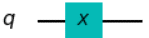

让我们看看上面回路的输出。**注意**：在这里我们使用plot_bloch_multiector()函数，它接受一个量子比特的态向量，而非Bloch向量。

> \# Let\'s see the result
>
> backend = Aer.get_backend(\'statevector_simulator\')
>
> out = execute(qc,backend).result().get_statevector()
>
> plot_bloch_multivector(out)
>
> 输出：


可以从上面输出的图像看出该量子比特的预期为态\|1⟩。我们可以认为这是在布洛赫球体中绕x轴旋转π弧度。X-gate也经常被称为"非门（NOT-gate）"，用于指称经典计算中的类似情况。

#### 1.2 泡利 Y-门与Z-门

与泡利 X-门相类似，在量子回路中泡利Y和Z矩阵也扮演了Y-门与Z-门的角色：

$$Y = \left\lbrack \begin{matrix}
0 \\
i \\
\end{matrix}\ \begin{matrix}
 - i \\
0 \\
\end{matrix} \right\rbrack\ \ \ \ Z = \left\lbrack \begin{matrix}
1 \\
0 \\
\end{matrix}\ \begin{matrix}
0 \\
 - 1 \\
\end{matrix} \right\rbrack$$

$$Y = - i\left| 0 \right\rangle\left\langle 1\left| + i \right|1 \right\rangle\left\langle 0 \right|$$

$$Z = |0\rangle\langle 0| - |1\rangle\langle 1|$$

不出意料的是Y-和Z-门分别在布洛赫球中依据y和z轴旋转π弧度。

下面的代码是一个在布洛赫球中显示一个量子比特状态的小部件，按下其中一个按钮将在量子位上执行量子门的操作：

> \# Run the code in this cell to see the widget
>
> from qiskit_textbook.widgets import gate_demo
>
> gate_demo(gates=\'pauli\')
>
> 输出：


在Qiskit中，我们可以使用以下代码将Y-和Z-门应用在量子回路中：

> qc.y(0) \# Do Y-gate on qubit 0
>
> qc.z(0) \# Do Z-gate on qubit 0
>
> qc.draw(\'mpl\')
>
> 输出：

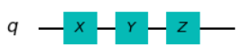

**提示：矩阵的本征向量**

我们已经看到用一个向量乘以一个矩阵会得到一个向量：

$$M\left| \upsilon \right\rangle = \left| \upsilon^{'} \right\rangle \longleftarrow \mathbf{新的向量}$$

如果选择正确的向量和矩阵，可以找到一种情况，在这种情况下，矩阵乘法和标量乘法是相等的：

$$M|v\rangle\  = \ \lambda|v\rangle$$

（上式中$M$是一个矩阵，$\lambda$是一标量）。对于矩阵$M$，任一符合上式的向量被成为矩阵$M$的本征向量。例如，Z-矩阵的本征向量是$|0\rangle$和$|1\rangle$：

$${Z\left| 0 \right\rangle = \left| 0 \right\rangle
}{Z\left| 1 \right\rangle = - |1\rangle}$$

因此我们用向量来描述量子比特的状态，在这种情况下我们通常称这些向量为本征态（*eigenstate*）。本征向量在量子计算中非常重要，所您需要对其有坚实的掌握。

### 题外话：X、Y和Z-基

您可能已经注意到，当Z-门处于这两种状态中的任何一种时，似乎对我们的量子比特没有影响。这是因为态\|0⟩和\|1⟩是Z-门的两个本征态。事实上，计算基（*computational
basis*，\|0⟩和\|1⟩形式的基矢）通常被称为Z-基（Z-basis），但不是可使用的唯一基，一个流行的基是X-基（X-basis），由泡利X-门的本征态组成。我们称向量\|+⟩和\|−⟩：

$$\left| + \right\rangle = \frac{1}{\sqrt{2}}(\left| 0 \right\rangle + |1\rangle) = \frac{1}{\sqrt{2}}\begin{bmatrix}
1 \\
1 \\
\end{bmatrix}$$

$$\left| - \right\rangle = \frac{1}{\sqrt{2}}(\left| 0 \right\rangle - |1\rangle) = \frac{1}{\sqrt{2}}\begin{bmatrix}
1 \\
 - 1 \\
\end{bmatrix}$$

另一个不常用的基由泡利Y-门的本征态组成：

$$\left| \circlearrowleft \right\rangle,\left| \circlearrowright \right\rangle$$

我们将其作为一个练习来计算。事实上有无数的基；为了组成其中的任意一个，只需要两个正交的向量。

#### 快速练习

1.  验证$\left| + \right\rangle$和$\left| - \right\rangle$是泡利X-门的本征态。

2.  上述向量的本征值是什么？

3.  为何在布洛赫球看不到这些本征值的出现？

4.  找出泡利Y-门的本征态及其在布洛赫球上的坐标。

除态\|0⟩和\|1⟩之外，只使用Pauli门不能初始化任意状态的量子比特，因此不能实现叠加态。表明我们看不出任何与经典比特不同的行为。为了创造更多有趣的状态，我们需要更多的门！

### 阿达马门（Hadamard Gate）

阿达马门（H-gate）是一个基本量子门，其可以让我们远离布洛赫球的两极并创建出介于\|0⟩和\|1⟩之间的叠加态。该量子门的矩阵形如：

$$H = \frac{1}{\sqrt{2}}\left\lbrack \begin{matrix}
1 \\
1 \\
\end{matrix}\ \begin{matrix}
1 \\
 - 1 \\
\end{matrix} \right\rbrack$$

执行该矩阵转换的结果如下：

$$H\left| 0 \right\rangle = \left| + \right\rangle$$

$$H\left| 1 \right\rangle = \left| - \right\rangle$$

上述转换可以被认为是围绕Bloch向量\[1,0,1\]（x和z轴之间的线）的旋转，或者是转换X-和Z-基之间量子比特的状态。

您可以使用下面的小工具来试验：

> \# Run the code in this cell to see the widget
>
> from qiskit_textbook.widgets import gate_demo
>
> gate_demo(gates=\'pauli+h\')
>
> 输出：

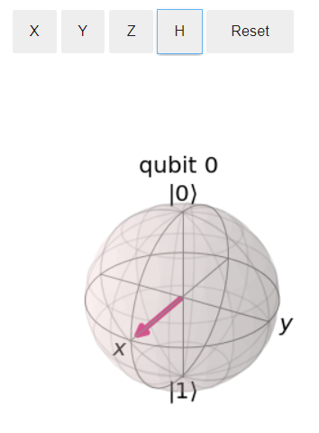

#### 快速练习

1.  写出H-gate与向量\|0⟩、\|1⟩、\|+⟩和\|−⟩的外积。

2.  证明对任意量子比特的状态应用门序列HZH与应用泡利X-门是等价的。

3.  找出X-、Z-和H-门的组合，使其等价于Y-门（忽略全局相位）。

4.  ### 题外话：使用不同的基来测量

我们已经看到Z轴本质上并不特殊，还有无穷多的其他基。与测量类似，我们不必总是在计算基上测量（Z-基），可以在任何基上测量量子比特。

尝试使用X-基测量，我们可以计算中测量\|+⟩或\|−⟩的概率：

$$p(| + \rangle) = \left| \left\langle + \middle| q \right\rangle \right|^{2},p(| - \rangle) = \left| \left\langle - \middle| q \right\rangle \right|^{2}$$

在测量之后，可以保证在这两种状态之一有一个量子比特。由于Qiskit只允许在Z-基上进行测量，我们必须使用H-gate来创建我们自己的基：

> from qiskit.extensions import Initialize \# Import the Inititialize
> function
>
> \# Create the X-measurement function:
>
> def x_measurement(qc,qubit,cbit):
>
> \"\"\"Measure \'qubit\' in the X-basis, and store the result in
> \'cbit\'\"\"\"
>
> qc.h(qubit)
>
> qc.measure(qubit, cbit)
>
> qc.h(qubit)
>
> return qc
>
> \# Initialise our qubit and measure it
>
> qc = QuantumCircuit(1,1)
>
> initial_state = \[0,1\]
>
> initializer = Initialize(initial_state)
>
> initializer.label = \"init\"
>
> qc.append(initializer, \[0\])
>
> x_measurement(qc, 0, 0)
>
> qc.draw()
>
> 输出：

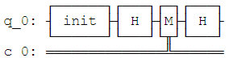

在之前的快速练习中，您可以通过将Z门夹在两个H-门之间来创建一个X门：

$$X = HZH$$

从Z-基开始，H门将量子比特转换到X-基，Z门在X-基上进行一个非门（NOT）操作，最后的H门将量子比特返回到Z-基。


我们可以通过矩阵相乘验证HZH的行为就是X门：

$$\text{HZH} = \frac{1}{\sqrt{2}}\left\lbrack \begin{matrix}
1 \\
1 \\
\end{matrix}\ \begin{matrix}
1 \\
 - 1 \\
\end{matrix} \right\rbrack\left\lbrack \begin{matrix}
1 \\
0 \\
\end{matrix}\ \begin{matrix}
0 \\
 - 1 \\
\end{matrix} \right\rbrack\frac{1}{\sqrt{2}}\left\lbrack \begin{matrix}
1 \\
1 \\
\end{matrix}\ \begin{matrix}
1 \\
 - 1 \\
\end{matrix} \right\rbrack = \left\lbrack \begin{matrix}
0 \\
1 \\
\end{matrix}\ \begin{matrix}
1 \\
0 \\
\end{matrix} \right\rbrack = X$$

按照相同的逻辑，这里通过将Z-测量（Z-measurement）夹在两个H门之间创建一个X-测量（X-measurement）。


现在看看上面逻辑的在Qiskit中的输出：

> backend = Aer.get_backend(\'statevector_simulator\') \# Tell Qiskit
> how to simulate our circuit
>
> out_state = execute(qc,backend).result().get_statevector() \# Do the
> simulation, returning the state vector
>
> plot_bloch_multivector(out_state) \# Display the output state vector
>
> 输出：

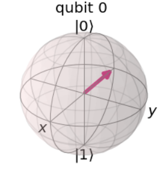

我们在态\|1⟩中初始化量子比特，可以看到测量会坍塌量子比特的状态为\|+⟩或\|−⟩。如果你再次运行的上面的两端代码，则会看到不同的结果，但量子比特的最终状态总是\|+⟩或\|−⟩。

#### 快速练习

1.  如果我们在态\|+⟩中初始化量子比特，测得其在态\|−⟩中的概率是多少?

2.  使用Qiskit显示测量量子比特\|0⟩在态\|+⟩和\|−⟩中的概率（提示：您可能会用到.get_counts()和plot_histogram()）。

3.  尝试创建一个用Y-基测量的函数。

用不同的基测量可以让我们看到海森堡著名的测不准原理是如何起作用的。确定以Z-基测量某个状态，就消除了以X-基测量某个特定状态的所有确定性，反之亦然。一个常见的误解是不确定性是由于设备的限制，但在这里可以看到，不确定性实际上是量子比特本质的一部分。

例如，如果我们把量子比特放入态\|0⟩中，以Z-基测量肯定会得到\|0⟩，但以X-基测量则会得到完全随机的结果！类似地，如果把量子比特放入态\|−⟩，以X-基测量肯定会得到\|−⟩，但现在以Z-基的任意测量将会完全随机的结果。

**更一般地：无论我们的量子系统处于什么状态，总有一种测量会有一个确定的结果。**

H门的引入是的我们能够探索一些有趣的现象，但在量子操作方面仍然非常有限。现在介绍一种新型的量子门：

### 5. $\mathbf{R}_{\mathbf{\phi}}$门（R~ϕ~-gate）

由于R~ϕ~是参数化的（parametrised），因此其需要一个数字（$\phi$）来告诉它做什么。R~ϕ~-gate执行绕Z轴旋转$\phi$角度，因此也被称为Rz-gate，其矩阵形式如下：

$$R_{\phi} = \left\lbrack \begin{matrix}
1 \\
0 \\
\end{matrix}\ \begin{matrix}
0 \\
e^{i\phi} \\
\end{matrix} \right\rbrack$$

其中$\phi$是一个实数。

您也可以使用qiskit_textbook中的小部件尝试R~ϕ~-gate，可以通过里面的滑块制定$\phi$：

> \# Run the code in this cell to see the widget
>
> from qiskit_textbook.widgets import gate_demo
>
> gate_demo(gates=\'pauli+h+rz\')
>
> 输出：

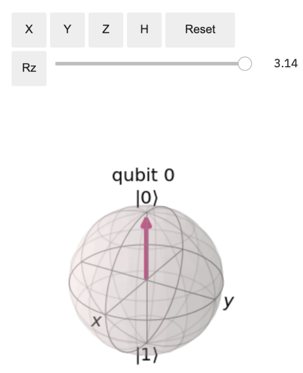

在Qiskit中，我可以通过rz(phi, qubit)来指定一个R~ϕ~-gate：

您可以看到当𝜙=𝜋时，Z门是R~ϕ~-gate的一种特殊情况。实际上有三个更常见的参考量子门会在本章中提及，它们都是R~ϕ~-gate的特殊情况：

> qc = QuantumCircuit(1)
>
> qc.rz(pi/4, 0)
>
> qc.draw(\'mpl\')
>
> 输出：

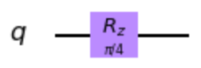

### 6. I、S和T-门（I、S、T-gates）

#### 6.1 I-gate

第一个是"I-gate"(又名"Id-gate"或"Identity
gate")。这是一个不进行任何操作的量子门，其矩阵形式为单位矩阵：

$$I = \left\lbrack \begin{matrix}
1 \\
0 \\
\end{matrix}\ \begin{matrix}
0 \\
1 \\
\end{matrix} \right\rbrack$$

将该单位量子门应用于量子回路中不会改变量子比特的状态，所以将其认作一个量子门值得探寻。有两个原因导致如此：第一I-gate被经常用于计算中，比如证明泡利X门是其自身的逆。

$$I = XX$$

第二考虑实际硬件来指定"do-nothing"或"none"操作通常很有用。

##### 快速练习

1.  I-gate的本征态是什么？

#### 6.2 S-gate

接下来将要提及的量子门是S-gate（有时被称为$\sqrt{Z}$-gate），是𝜙=𝜋/2时的R~ϕ~-gate。该量子门绕布洛赫球旋转四分之一圈。值得注意的是与本章到目前为止介绍的所有门不同，S门不是其自身的逆！在此我们先给出结果，您会经常看到S^†^-gate，也称为"S-dagger"、"Sdg"或${\sqrt{Z}}^{\dagger}$-gate。S^†^-gate是当𝜙=−𝜋/2时的R~ϕ~-gate。

$$S = \left\lbrack \begin{matrix}
1 \\
0 \\
\end{matrix}\ \begin{matrix}
0 \\
e^{\frac{\text{iπ}}{2}} \\
\end{matrix} \right\rbrack\ \ ,S^{\dagger} = \left\lbrack \begin{matrix}
1 \\
0 \\
\end{matrix}\ \begin{matrix}
0 \\
e^{- \frac{\text{iπ}}{2}} \\
\end{matrix} \right\rbrack$$

$\sqrt{Z}$-gate的名字是由于两次成功应用S-gate的效果与Z-gate一致：

$$\text{SS}\left| q \right\rangle = Z\left| q \right\rangle$$

这一符号在量子计算中很常见。

在Qiskit中添加一个S-gate的代码如下：

> qc = QuantumCircuit(1)
>
> qc.s(0) \# Apply S-gate to qubit 0
>
> qc.sdg(0) \# Apply Sdg-gate to qubit 0
>
> qc.draw(\'mpl\')
>
> 输出：

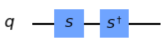

#### 6.3 T-gate

T-gate是量子计算中最长使用的一个量子门，其为在𝜙=𝜋/4时的R~ϕ~-gate。

$$T = \left\lbrack \begin{matrix}
1 \\
0 \\
\end{matrix}\ \begin{matrix}
0 \\
e^{\frac{\text{iπ}}{4}} \\
\end{matrix} \right\rbrack\ \ ,T^{\dagger} = \left\lbrack \begin{matrix}
1 \\
0 \\
\end{matrix}\ \begin{matrix}
0 \\
e^{- \frac{\text{iπ}}{4}} \\
\end{matrix} \right\rbrack$$

> qc = QuantumCircuit(1)
>
> qc.t(0) \# Apply T-gate to qubit 0
>
> qc.tdg(0) \# Apply Tdg-gate to qubit 0
>
> qc.draw(\'mpl\')
>
> 输出：

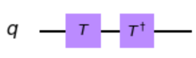

与S-gate一样，T-gate有时被称为$\sqrt[4]{Z}$-gate。在Qiskit中，您可以使用qiskit_textbook中的小部件把玩本章中介绍的所有量子门：

> \# Run the code in this cell to see the widget
>
> from qiskit_textbook.widgets import gate_demo
>
> gate_demo()
>
> 输出：

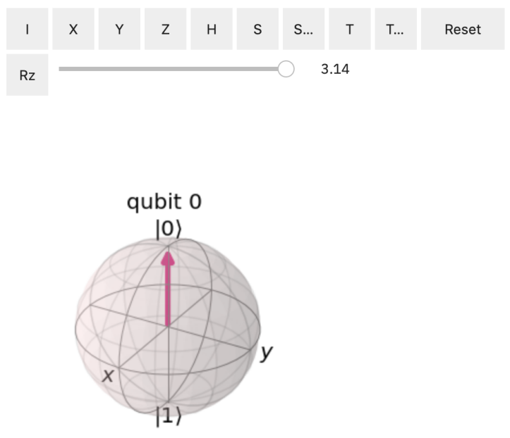

### 7. 通用U-gate

正如我们先前所讲，I、Z、S和T-gate都是R~ϕ~-gate的特俗情况。同样的道理，U~3~-gate是所有单量子比特量子门中最常用的一种，也是一个参数化的量子门：

$$U_{3}\left( \theta,\phi,\lambda \right) = \left\lbrack \begin{matrix}
\cos\left( \frac{\theta}{2} \right) \\
e^{\text{iϕ}}\text{si}n\left( \frac{\theta}{2} \right) \\
\end{matrix}\text{\ \ }\begin{matrix}
{- e}^{\text{iϕ}}\sin\left( \frac{\theta}{2} \right) \\
e^{i\lambda + i\phi}\text{co}s\left( \frac{\theta}{2} \right) \\
\end{matrix} \right\rbrack$$

本章中介绍的每一个量子门都可以被指定为一个$U_{3}\left( \theta,\phi,\lambda \right)$，但这一情况在一个回路的图解中不常见，其可能的原因是相对于比较难以阅读。

Qiskit提供了U~1~-和U~2~-gate，用于分别指代𝜃 = 𝜋/2和𝜃 = 𝜙
=0时U~3~-gate的特殊情况。您将会看到U~1~-gate等同于R~ϕ~-gate。

$$U_{3}\left( \pi/2,\phi,\lambda \right) = U_{2} = \frac{1}{\sqrt{2}}\left\lbrack \begin{matrix}
1 \\
e^{\text{iϕ}} \\
\end{matrix}\text{\ \ }\begin{matrix}
{- e}^{\text{iλ}} \\
e^{i\lambda + i\phi} \\
\end{matrix} \right\rbrack$$

$$U_{3}\left( 0,0,\lambda \right) = U_{1} = \left\lbrack \begin{matrix}
1 \\
0 \\
\end{matrix}\text{\ \ }\begin{matrix}
0 \\
e^{\text{iλ}} \\
\end{matrix} \right\rbrack$$

在真正的IBM量子硬件上运行之前，所有单量子比特操作都被编译为𝑈~1~、𝑈~2~和𝑈~3~，因此有时被称为物理门（*physical
gate*）。

由此可以明显看出，可能存在无穷多的门，其中也包括Rx和Ry-gate，尽管这里没有提到。还必须注意的是Z-基没有什么特别之处，只是它被选为标准计算基。这就是为什么我们给予S-和T-gate名字，却没有给其X和Y等价物取名字的原因。（比如：$\sqrt{X}$和$\sqrt[4]{Y}$）

2. 多量子比特和纠缠（Entanglement）
===================================

2.1 介绍
--------

若仅仅有量子比特不足以形成量子回路，我们还需要对其进行操纵。所有可能的方法都可以被编译成一组基本的操作，称为量子门。

通常，可以直接在硬件中实现的量子门只作用于一个或两个量子比特。在我们的回路中，可能想要使用作用于大量量子比特的复杂量子们。幸运的是，这不是一个问题。有了硬件提供的1和2个量子门，就有可能建造任何其他的量子门。

在本章中，我们将首先介绍最基本的门，以及用来描述和分析的数学。然后将展示如何证明这些门可以用来创建任何可能的量子算法。

然后，本章以观察量子门的小规模应用作为结束。例如，我们看到如何从单量子比特操作和双量子比特操作构建类似于Toffoli的三量子比特门。


2.2 多量子比特和纠缠态（Entangled State）
-----------------------------------------

单量子比特是很有趣，但单个并不能提供计算优势。现在我们来看看如何表示多量子比特，以及这些量子比特如何相互作用。我们已经看到了如何用二维向量表示一个量子比特的状态，现在将看到如何表示多量子比特的状态。

### 内容

1\. 呈现多量子比特的状态

1.1 练习

2\. 用多量子比特态向量呈现单量子比特

2.1 练习

3\. 多量子比特门

3.1 受控非门

3.2 纠缠态

3.3 练习

### 1. 呈现多量子比特的状态

我们看到单个比特有两种可能的状态，而一个量子比特有两个复数幅值。同样，两个比特有四种可能的状态：

00 01 10 11

要描述两个量子比特的状态需要四个复数幅值。我们将这些幅值存储在一个四维的矢量中：

$$\left| a \right\rangle = a_{00}\left| 00 \right\rangle + a_{01}\left| 01 \right\rangle + a_{10}\left| 10 \right\rangle + a_{11}\left| 11 \right\rangle = \begin{bmatrix}
a_{00} \\
a_{01} \\
a_{10} \\
a_{11} \\
\end{bmatrix}$$

测量规则仍然上一章中所诉的相同：

$$p(|00\rangle) = \left| \left\langle 00 \middle| a \right\rangle \right|^{2} = \left| a00 \right|^{2}$$

同样的含义也适用，例如标准化条件：

$$\left| a_{00} \right|^{2} + \left| a_{01} \right|^{2} + \left| a_{10} \right|^{2} + \left| a_{11} \right|^{2} = 1$$

如果有两个分开的量子比特，我们可以用张量积（**tensor
product**）来描述它们的总体状态：

$$\left| a \right\rangle = \begin{bmatrix}
a_{0} \\
a_{1} \\
\end{bmatrix},\ \left| b \right\rangle = \begin{bmatrix}
b_{0} \\
b_{1} \\
\end{bmatrix}$$

$$\left| \text{ab} \right\rangle = \left| a \right\rangle \otimes \left| b \right\rangle = \begin{bmatrix}
a_{0} \times \begin{bmatrix}
b_{0} \\
b_{1} \\
\end{bmatrix} \\
a_{1} \times \begin{bmatrix}
b_{0} \\
b_{1} \\
\end{bmatrix} \\
\end{bmatrix} = \begin{bmatrix}
a_{0}b_{0} \\
a_{0}b_{1} \\
a_{1}b_{0} \\
a_{1}b_{1} \\
\end{bmatrix}$$

遵循同样的规则，我们可以用张量积来描述任意数量的量子比特的总体状态。下面是一个包含三个量子比特的例子：

$$\left| \text{abc} \right\rangle = \begin{bmatrix}
a_{0}b_{0}c_{0} \\
a_{0}b_{0}c_{1} \\
\ a_{0}b_{1}c_{0} \\
a_{0}b_{1}c_{1} \\
\ a_{1}b_{0}c_{0} \\
a_{1}b_{0}c_{1} \\
a_{1}b_{1}c_{0} \\
a_{1}b_{1}c_{1} \\
\end{bmatrix}$$

如果我们有n个量子比特，就需要追踪$2^{n}$个复数幅值。正如我们所看到的，这些向量依据量子比特的数量指数级别的增长。这就为什么含有大数量的量子比特的量子计算机很难模拟的原因。一台较新的笔记本电脑可以模拟约20个量子比特，但如果有100个量子比特即使是超级计算机也很难模拟。

现在让我们看一个量子回路的示例：

from qiskit import \*

from math import pi

import numpy as np

from qiskit.visualization import plot_bloch_multivector, plot_histogram

> qc = QuantumCircuit(3)
>
> \# Apply H-gate to each qubit:
>
> for qubit in range(3):
>
> qc.h(qubit)
>
> \# See the circuit:
>
> qc.draw()
>
> 输出：

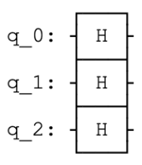

每一个量子比特都处于\|+⟩，所以我们应该看到向量：

$$\left| + + + \right\rangle = \frac{1}{\sqrt{8}}\begin{bmatrix}
1 \\
1 \\
1 \\
1 \\
1 \\
1 \\
1 \\
1 \\
\end{bmatrix}$$

> \# Let\'s see the result
>
> backend = Aer.get_backend(\'statevector_simulator\')
>
> final_state = execute(qc,backend).result().get_statevector()
>
> \# In Jupyter Notebooks we can display this nicely using Latex.
>
> \# If not using Jupyter Notebooks you may need to remove the
>
> \# vector2latex function and use print(final_state) instead.
>
> from qiskit_textbook.tools import array_to_latex
>
> array_to_latex(final_state, pretext=\"\\\\text{Statevector} = \")
>
> 输出：

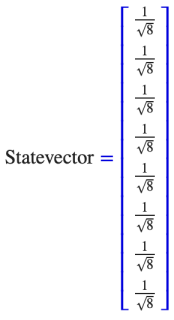

以上代码的输出正是我们所期望的结果。

1.1 快速练习

1\. 写出以下量子比特的张量积：

> a\) $|0\rangle|1\rangle$
>
> b\) $|0\rangle| + \rangle$
>
> c\) $| + \rangle|1\rangle$
>
> d\) $| - \rangle| + \rangle$

2\.
将态向量$\left| \psi \right\rangle = \frac{1}{\sqrt{2}}\left| 00 \right\rangle + \frac{i}{\sqrt{2}}\left| 01 \right\rangle$写成两个单独的量子比特。

### 2. 用多量子比特态向量呈现单量子比特

我们已经看到用矩阵表示的X-gate：

$$X = \left\lbrack \begin{matrix}
0 \\
1 \\
\end{matrix}\ \begin{matrix}
1 \\
0 \\
\end{matrix} \right\rbrack$$

当其作用于态$\left| 0 \right\rangle$时：

$$X\left| 0 \right\rangle = \left\lbrack \begin{matrix}
0 \\
1 \\
\end{matrix}\ \begin{matrix}
1 \\
0 \\
\end{matrix} \right\rbrack\begin{bmatrix}
1 \\
0 \\
\end{bmatrix} = \begin{bmatrix}
0 \\
1 \\
\end{bmatrix}$$

但X-gate在多量子比特向量中如何作用于一个量子比特尚不清楚。幸运的是，规则相当简单；和我们用张量积计算多量子比特态向量一样，使用张量积计算矩阵的过程正是作用于这些态向量的过程。例如，在下面的回路中：

> qc = QuantumCircuit(2)
>
> qc.h(0)
>
> qc.x(1)
>
> qc.draw()
>
> 输出：

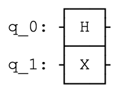

我们可以用张量积模拟这一操作（H&X）：

$$X\left| q_{1} \right\rangle \otimes H\left| q_{0} \right\rangle = \left( X \otimes H \right)\left| q_{1}q_{0} \right\rangle$$

这一操作的过程为：

$$X \otimes H = \left\lbrack \begin{matrix}
0 \\
1 \\
\end{matrix}\ \begin{matrix}
1 \\
0 \\
\end{matrix} \right\rbrack \otimes \frac{1}{\sqrt{2}}\left\lbrack \begin{matrix}
1 \\
1 \\
\end{matrix}\ \begin{matrix}
1 \\
 - 1 \\
\end{matrix} \right\rbrack = \frac{1}{\sqrt{2}}\left\lbrack \begin{matrix}
0 \times \left\lbrack \begin{matrix}
1 \\
1 \\
\end{matrix}\ \begin{matrix}
1 \\
 - 1 \\
\end{matrix} \right\rbrack \\
1 \times \left\lbrack \begin{matrix}
1 \\
1 \\
\end{matrix}\ \begin{matrix}
1 \\
 - 1 \\
\end{matrix} \right\rbrack \\
\end{matrix}\ \begin{matrix}
1 \times \left\lbrack \begin{matrix}
1 \\
1 \\
\end{matrix}\ \begin{matrix}
1 \\
 - 1 \\
\end{matrix} \right\rbrack \\
0 \times \left\lbrack \begin{matrix}
1 \\
1 \\
\end{matrix}\ \begin{matrix}
1 \\
 - 1 \\
\end{matrix} \right\rbrack \\
\end{matrix} \right\rbrack = \frac{1}{\sqrt{2}}\left\lbrack \begin{matrix}
0 \\
0 \\
1 \\
1 \\
\end{matrix}\ \begin{matrix}
0 \\
0 \\
1 \\
 - 1 \\
\end{matrix}\ \begin{matrix}
1 \\
1 \\
0 \\
0 \\
\end{matrix}\ \begin{matrix}
1 \\
 - 1 \\
0 \\
0 \\
\end{matrix} \right\rbrack$$

我们可以将上式应用四维态向量$\left| q_{1}q_{0} \right\rangle$。使其变得非常容易，您将会经常看到下面的清晰符号：

$$X \otimes H = \left\lbrack \begin{matrix}
0 \\
H \\
\end{matrix}\ \begin{matrix}
H \\
0 \\
\end{matrix} \right\rbrack$$

与其手算之一过程，我们可以使用Qiskit中的unitary_simulator来计算。幺正模拟器将回路中所有的量子门相乘，得出一个运行整个量子回路的幺正矩阵：

> backend = Aer.get_backend(\'unitary_simulator\')
>
> unitary = execute(qc,backend).result().get_unitary()
>
> \# In Jupyter Notebooks we can display this nicely using Latex.
>
> \# If not using Jupyter Notebooks you may need to remove the
>
> \# unitary2latex function and use print(unitary) instead.
>
> from qiskit_textbook.tools import array_to_latex
>
> array_to_latex(unitary, pretext=\"\\\\text{Circuit = }\\n\")
>
> 输出：

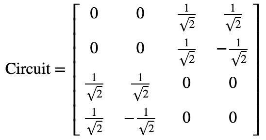

如果我们仅想要每次只在一个量子比特上应用一个量子门（如下所示），使用单位矩阵进行张量积：

$$X \otimes I$$

可以看到，在Qiskit中进行张量积的结果：

$$X \otimes I = \left\lbrack \begin{matrix}
0 \\
I \\
\end{matrix}\ \begin{matrix}
I \\
0 \\
\end{matrix} \right\rbrack = \left\lbrack \begin{matrix}
0 \\
0 \\
1 \\
0 \\
\end{matrix}\ \begin{matrix}
0 \\
0 \\
0 \\
1 \\
\end{matrix}\ \begin{matrix}
1 \\
0 \\
0 \\
0 \\
\end{matrix}\ \begin{matrix}
0 \\
1 \\
0 \\
0 \\
\end{matrix} \right\rbrack$$

#### 2.1 快速练习

1\. 计算由一系列量子门创建的单一量子比特$U = XZH$的幺正变换unitary
(𝑈)。使用Qiskit中的幺正模拟器来验证您的答案。

2\.
尝试改变上述产量子回路中的量子门。计算其张量积，并用幺正模拟器检查答案。

**注：**不同书籍、软件和网站中量子比特的顺序也不同，表明同一量子回路的张量积可能看上去极为不同。当查阅其他资料时，请将这一点铭记在心。

> qc = QuantumCircuit(2)
>
> qc.x(1)
>
> qc.draw()
>
> 输出：

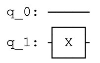

> \# Simulate the unitary
>
> backend = Aer.get_backend(\'unitary_simulator\')
>
> unitary = execute(qc,backend).result().get_unitary()
>
> \# Display the results:
>
> array_to_latex(unitary, pretext=\"\\\\text{Circuit = } \")
>
> 输出：

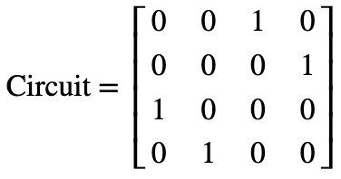

### 3. 多量子比特门

至此我们知道了如何表示多量子比特的状态，为学习量子比特之间如何交互做好了准备。其中一个非常重要的双量子比特门（two-qubit
gate）是受控非门（CNOT-gate）。

#### 3.1 受控非门（CNOT-gate）

您在先前的"计算的基元"中已经遇到过该量子门。如果第一个量子比特（控制）是$|1\rangle$，受控非门是一个在第二个量子比特（目标）上执行X-gate的条件门（conditional
gate）。该量子门绘制在回路中的样子如下，其中q0作为控制，q1作为目标：

> qc = QuantumCircuit(2)
>
> \# Apply CNOT
>
> qc.cx(0,1)
>
> \# See the circuit:
>
> qc.draw()
>
> 输出：


当量子比特不处于$|0\rangle$和$|1\rangle$（类似经典比特的行为）之间的叠加态时，受控非门非常简单且能够被直观的理解。我们可以使用经典真值表来描述：

  **输入(t,c)**   **输出(t,c)**
--------------- ---------------
  00              00
  01              11
  10              10
  11              01

将其转换为四位态向量，其为以下两个矩阵中的一个：

$$ {CNOT = \left\lbrack \begin{matrix}
1 \\
0 \\
0 \\
0 \\
\end{matrix}\ \begin{matrix}
0 \\
0 \\
0 \\
1 \\
\end{matrix}\ \begin{matrix}
0 \\
0 \\
1 \\
0 \\
\end{matrix}\ \begin{matrix}
0 \\
1 \\
0 \\
0 \\
\end{matrix} \right\rbrack,\ 
}{\ \ \ \ \ \ \ \ \ \ \ \ \ \ \ \ \ CNOT = \left\lbrack \begin{matrix}
1 \\
0 \\
0 \\
0 \\
\end{matrix}\ \begin{matrix}
0 \\
1 \\
0 \\
0 \\
\end{matrix}\ \begin{matrix}
0 \\
0 \\
0 \\
1 \\
\end{matrix}\ \begin{matrix}
0 \\
0 \\
1 \\
0 \\
\end{matrix} \right\rbrack}$$

依据哪一量子比特是控制端或目标端。不同书籍、模拟器和论文对量子比特的排序也不一样。在我们的例子中，左侧的矩阵对应于上述所有量子回路中的受控非门。该矩阵交换态向量中\|01⟩和\|11⟩之间的幅值。

$$\left| a \right\rangle = \begin{bmatrix}
a_{00} \\
a_{01} \\
a_{10} \\
a_{11} \\
\end{bmatrix},\ \ CNOT\left| a \right\rangle = \begin{bmatrix}
a_{00} \\
a_{11} \\
a_{10} \\
a_{01} \\
\end{bmatrix}$$

我们已经看到了受控非门如何作用于经典状态的方式，现在看看该量子门如何作用于处于叠加态的量子比特。我们将其作用于态\|+⟩：

> qc = QuantumCircuit(2)
>
> \# Apply H-gate to the first:
>
> qc.h(0)
>
> qc.draw()
>
> 输出：
>
> 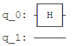
>
> \# Let\'s see the result:
>
> backend = Aer.get_backend(\'statevector_simulator\')
>
> final_state = execute(qc,backend).result().get_statevector()
>
> \# Print the statevector neatly:
>
> array_to_latex(final_state, pretext=\"\\\\text{Statevector = }\")
>
> 输出：

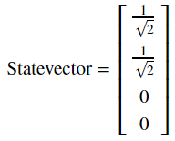

正如所期望的那样，这一操作产生了$\left| 0 \right\rangle \otimes \left| + \right\rangle = \left| 0 + \right\rangle$：

$$\left| 0 + \right\rangle = \frac{1}{\sqrt{2}}\left( \left| 00 \right\rangle + \left| 01 \right\rangle \right)$$

接着看看应用受控非门之后的情况：

> qc = QuantumCircuit(2)
>
> \# Apply H-gate to the first:
>
> qc.h(0)
>
> \# Apply a CNOT:
>
> qc.cx(0,1)
>
> qc.draw()
>
> 输出：

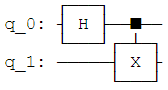

> \# Let\'s see the result:
>
> backend = Aer.get_backend(\'statevector_simulator\')
>
> final_state = execute(qc,backend).result().get_statevector()
>
> \# Print the statevector neatly:
>
> array_to_latex(final_state, pretext=\"\\\\text{Statevector = }\")
>
> 输出：


可以看到我们获得了态：

$$\text{CNOT}\left| 0 + \right\rangle = \frac{1}{\sqrt{2}}\left( \left| 00 \right\rangle + \left| 11 \right\rangle \right)$$

这一量子态非常有趣，因为其是纠缠的（***entangled***）。这一发现将我们引向下一节的内容。

#### 3.2 纠缠态（Entangled State）

在前一节中我们创建了态：

$$\frac{1}{\sqrt{2}}\left( \left| 00 \right\rangle + \left| 11 \right\rangle \right)$$

这一量子态被称为贝尔基态（*Bell*
state）。可以看出该量子态有50%的概率测量出态$\left| 00 \right\rangle$，以及50%的机率测量态$\left| 11 \right\rangle$。非常有趣的是：该量子态测量出态$\left| 01 \right\rangle$和$\left| 10 \right\rangle$的机率为0。我们呢可以在Qiskit中使用如下代码来验证：

> results = execute(qc,backend).result().get_counts()
>
> plot_histogram(results)
>
> 输出：

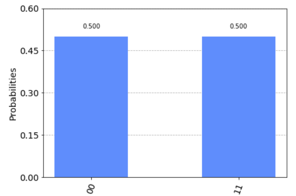

这一复合状态无法写为两个单独量子比特的状态，其蕴含的意义让人着迷。虽然我们的量子比特处于叠加态，测量其中一个会告诉我们另一个的状态并使其叠加态坍缩。例如，如果我们测量坐上面的量子巴比特并获知其状态为$\left| 1 \right\rangle$，所有量子比特的整体状态变化如下：

$$\frac{1}{\sqrt{2}}\left( \left| 00 \right\rangle + \left| 11 \right\rangle \right)\overset{\text{measure}}{\rightarrow}\left| 11 \right\rangle$$

即使将这些量子比特放置在互相相隔光年以外的位置，测量其中一个量子比特就会使叠加态坍缩，并在其他量子比特上即刻产生影响。这就是鬼魅般的超距作用（[spooky
action at a
distance](https://en.wikipedia.org/wiki/Quantum_nonlocality)），该作用使得20世纪的大部分物理学家感到沮丧。

#### 3.3 快速练习

1\.
创建一个可以产生贝尔基态$\frac{1}{\sqrt{2}}\left( \left| 01 \right\rangle + \left| 10 \right\rangle \right)$的量子回路。使用Qiskit中的态向量模拟器验证结果。

2\.
在上面练习中创建的量子回路将态$\left| 00 \right\rangle$转换为$\frac{1}{\sqrt{2}}\left( \left| 01 \right\rangle + \left| 10 \right\rangle \right)$，使用Qiskit中的模拟器计算这一回路的幺正矩阵。验证这一幺正矩阵执行了准确的变换。

### 4. 参考文献

\[1\] Asher Peres, Daniel R. Terno, Quantum Information and Relativity
Theory, 2004, https://arxiv.org/abs/quant-ph/0212023

2.3 相位反冲（Phase Kickback）
------------------------------

### 内容

1\. 探索受控非门

2\. 相位反冲

2.1 解释受控非门回路恒等式

2.2 使用T-gate反冲

### 1. 探索受控非门

在之前的章节中，我们看到受控非门的一些非常基础结果。在本节中我们将会探索更有趣的结果。

我们在上一节中看到可以通过设置受控量子比特为态$| + \rangle$使得两个量子比特纠缠：

$$\text{CNOT}\left| 0 + \right\rangle = \frac{1}{\sqrt{2}}\left( \left| 00 \right\rangle + \left| 11 \right\rangle \right)$$

但是如果放入处于叠加态的第二个两个比特会发生什么情况？

> from qiskit import QuantumCircuit, Aer, execute
>
> from math import pi
>
> import numpy as np
>
> from qiskit.visualization import plot_bloch_multivector,
> plot_histogram
>
> \# In Jupyter Notebooks we can display this nicely using Latex.
>
> \# If not using Jupyter Notebooks you may need to remove the
>
> \# array_to_latex function and use print() instead.
>
> from qiskit_textbook.tools import array_to_latex
>
> qc = QuantumCircuit(2)
>
> qc.h(0)
>
> qc.h(1)
>
> qc.cx(0,1)
>
> qc.draw()
>
> 输出：


在上面的量子回路中，我们将受控非门作用于态：

$$| + + \rangle = \frac{1}{\sqrt{2}}(|00\rangle + |01\rangle + |10\rangle + |11\rangle)$$

由于受控非门CNOT交换态$\left| 01 \right\rangle$和$\left| 11 \right\rangle$的幅值，所以我们不会看到变化：

> qc = QuantumCircuit(2)
>
> qc.h(0)
>
> qc.h(1)
>
> qc.cx(0,1)
>
> display(qc.draw())
>
> \# Let\'s see the result
>
> statevector_backend = Aer.get_backend(\'statevector_simulator\')
>
> final_state =
> execute(qc,statevector_backend).result().get_statevector()
>
> array_to_latex(final_state, pretext=\"\\\\text{Statevector} = \",
> precision=1)
>
> plot_bloch_multivector(final_state)
>
> 输出：


现在设置目标量子比特为态$| - \rangle$，所以其成为一个负相位：

> qc = QuantumCircuit(2)
>
> qc.h(0)
>
> qc.x(1)
>
> qc.h(1)
>
> qc.draw()
>
> 输出：


将会生成如下状态：

$$| \mp \rangle = \frac{1}{\sqrt{2}}(|00\rangle + |01\rangle - |10\rangle - |11\rangle)$$

> qc = QuantumCircuit(2)
>
> qc.h(0)
>
> qc.x(1)
>
> qc.h(1)
>
> display(qc.draw())
>
> \# See the result
>
> final_state =
> execute(qc,statevector_backend).result().get_statevector()
>
> array_to_latex(final_state, pretext=\"\\\\text{Statevector} = \",
> precision=1)
>
> plot_bloch_multivector(final_state)
>
> 输出：


如果受控非门作用于这一状态，将会交换态$\left| 01 \right\rangle$和$\left| 11 \right\rangle$的幅值，结果会是如下的状态：

$$CNOT| \mp \rangle = \frac{1}{\sqrt{2}}(|00\rangle - |01\rangle - |10\rangle + |11\rangle)$$

$$\text{CNOT}\left| \mp \right\rangle = \left| - - \right\rangle$$

这一点非常有趣，因为其在不改变目标量子比特状态的情况下影响了控制量子比特的状态。

> qc.cx(0,1)
>
> display(qc.draw())
>
> final_state =
> execute(qc,statevector_backend).result().get_statevector()
>
> array_to_latex(final_state, pretext=\"\\\\text{Statevector} = \",
> precision=1)
>
> plot_bloch_multivector(final_state)
>
> 输出：


如果您还记得H-gate（阿达马门）将$\left| + \right\rangle \rightarrow \left| 0 \right\rangle$以及$\left| - \right\rangle \rightarrow \left| 1 \right\rangle$，我们可以在多个H-gate中装入一个受控非门，等同于一个相反方向受控非门的行为：


我们可以使用Qiskit中的幺正模拟器来验证这一想法：

> qc = QuantumCircuit(2)
>
> qc.h(0)
>
> qc.h(1)
>
> qc.cx(0,1)
>
> qc.h(0)
>
> qc.h(1)
>
> display(qc.draw())
>
> \# \`display\` is an IPython tool, remove if it cases an error
>
> unitary_backend = Aer.get_backend(\'unitary_simulator\')
>
> unitary = execute(qc,unitary_backend).result().get_unitary()
>
> array_to_latex(unitary, pretext=\"\\\\text{Circuit = }\\n\")
>
> 输出：


> qc = QuantumCircuit(2)
>
> qc.cx(1,0)
>
> display(qc.draw())
>
> unitary_backend = Aer.get_backend(\'unitary_simulator\')
>
> unitary = execute(qc,unitary_backend).result().get_unitary()
>
> array_to_latex(unitary, pretext=\"\\\\text{Circuit = }\\n\")
>
> 输出：


这一等式就是相位反冲（*phase
kickback*）的示例，并将我们引向下一节的内容。

### 2. 相位反冲

2.1 解释受控非门回路恒等式

在上一节中，我们看到如下恒等式：


这一反冲（相位反冲）的示例非常重要，其可用在几乎所有的量子算法中。反冲即由一个量子门加到量子比特上的本征值，经由一个受控操作"回弹（kicked
back）"至一个不同的量子比特。例如，我们看到过在一个$\left| - \right\rangle$态的量子比特执行X-gate会给出该量子比特的相位-1：

$$X\left| - \right\rangle = - \left| - \right\rangle$$

当我们的控制端量子比特处于态$\left| 0 \right\rangle$或$\left| 1 \right\rangle$时，该相位会影响整个状态，然而全局相位没有受到明显的影响：

$${\text{CNOT}\left| - 0 \right\rangle = \left| - \right\rangle \otimes \left| 0 \right\rangle
}{\ \ \ \ \ \ \ \ \ \ \ \ \ \ \ \ \ \ \ \ \ \  = \left| - 0 \right\rangle
}{\text{CNOT}\left| - 1 \right\rangle = X\left| - \right\rangle \otimes \left| 1 \right\rangle
}{\ \ \ \ \ \ \ \ \ \ \ \ \ \ \ \ \ \ \ \ \ \  = - \left| - \right\rangle \otimes \left| 1 \right\rangle
}{= - \left| - 1 \right\rangle}$$

这一有趣的影响当控制端量子比特处于叠加态时才会发生，仅当目标端量子比特处于态$\left| 1 \right\rangle$时这一相位因子才会应用于目标端量子比特，就是在控制端量子比特上添加一个相对相位：

$$CNOT| \mp \rangle = \frac{1}{\sqrt{2}}(CNOT| - 0\rangle + CNOT| - 1\rangle)$$

$$CNOT| \mp \rangle = \frac{1}{\sqrt{2}}(| - 0\rangle + X| - 1\rangle)$$

$$CNOT| \mp \rangle = \frac{1}{\sqrt{2}}(| - 0\rangle - | - 1\rangle)$$

上述也可写成两个单独的量子比特的状态：

$$CNOT| \mp \rangle = | - \rangle \otimes \frac{1}{\sqrt{2}}(|0\rangle - |1\rangle)$$

$$\text{CNOT}\left| \mp \right\rangle = \left| - - \right\rangle$$

装入多个H-gate的受控非门将量子比特从计算基转换为基\|+⟩和\|−⟩，正如我们所看到的一样。这一恒等式在硬件中非常有用，因为某些量子硬件仅允许受控非门作用于两个特定量子比特中的一个方向上。我们可以利用这一恒等式克服这一问题，让受控非门能够在两个方向上发生作用。

2.2 使用T-gate实现反冲

现在我们看一看两一个受控的操作，受控T门：

> qc = QuantumCircuit(2)
>
> qc.cu1(pi/4, 0, 1)
>
> qc.draw()
>
> 输出：


T-gate的矩阵形式如下：

$$T = \left\lbrack \begin{matrix}
1 \\
0 \\
\end{matrix}\ \begin{matrix}
0 \\
e^{\frac{\text{iπ}}{4}} \\
\end{matrix} \right\rbrack$$

受控T门的矩阵形式如下：

$$\text{Controlled} - T = \left\lbrack \begin{matrix}
\begin{matrix}
1 \\
0 \\
\end{matrix} \\
\begin{matrix}
0 \\
0 \\
\end{matrix} \\
\end{matrix}\ \begin{matrix}
\begin{matrix}
0 \\
1 \\
\end{matrix} \\
\begin{matrix}
0 \\
0 \\
\end{matrix} \\
\end{matrix}\ \begin{matrix}
\begin{matrix}
0 \\
0 \\
\end{matrix} \\
\begin{matrix}
1 \\
0 \\
\end{matrix} \\
\end{matrix}\ \begin{matrix}
\begin{matrix}
0 \\
0 \\
\end{matrix} \\
\begin{matrix}
0 \\
e^{\frac{\text{iπ}}{4}} \\
\end{matrix} \\
\end{matrix} \right\rbrack$$

我们可以使用Qiskit中的幺正模拟器来验证：

> qc = QuantumCircuit(2)
>
> qc.cu1(pi/4, 0, 1)
>
> display(qc.draw())
>
> \# See Results:
>
> unitary_backend = Aer.get_backend(\'unitary_simulator\')
>
> unitary = execute(qc,unitary_backend).result().get_unitary()
>
> array_to_latex(unitary, pretext=\"\\\\text{Controlled-T} = \\n\")
>
> 输出：


更一般地，我们可以用以下规则找到任一受控U操作的矩阵：

$$U = \left\lbrack \begin{matrix}
u_{00} \\
u_{10} \\
\end{matrix}\ \begin{matrix}
u_{01} \\
u_{11} \\
\end{matrix} \right\rbrack$$

$$\text{Controlled} - U = \left\lbrack \begin{matrix}
I \\
0 \\
\end{matrix}\ \begin{matrix}
0 \\
U \\
\end{matrix} \right\rbrack = \left\lbrack \begin{matrix}
\begin{matrix}
1 \\
0 \\
\end{matrix} \\
\begin{matrix}
0 \\
0 \\
\end{matrix} \\
\end{matrix}\ \begin{matrix}
\begin{matrix}
0 \\
1 \\
\end{matrix} \\
\begin{matrix}
0 \\
0 \\
\end{matrix} \\
\end{matrix}\ \begin{matrix}
\begin{matrix}
0 \\
0 \\
\end{matrix} \\
\begin{matrix}
u_{00} \\
u_{10} \\
\end{matrix} \\
\end{matrix}\ \begin{matrix}
\begin{matrix}
0 \\
0 \\
\end{matrix} \\
\begin{matrix}
u_{01} \\
u_{11} \\
\end{matrix} \\
\end{matrix} \right\rbrack$$

或者使用Qiskit的量子比特排列：

$$\text{Controlled} - U = \left\lbrack \begin{matrix}
\begin{matrix}
1 \\
0 \\
\end{matrix} \\
\begin{matrix}
0 \\
0 \\
\end{matrix} \\
\end{matrix}\ \begin{matrix}
\begin{matrix}
0 \\
u_{00} \\
\end{matrix} \\
\begin{matrix}
0 \\
u_{10} \\
\end{matrix} \\
\end{matrix}\ \begin{matrix}
\begin{matrix}
0 \\
0 \\
\end{matrix} \\
\begin{matrix}
1 \\
0 \\
\end{matrix} \\
\end{matrix}\ \begin{matrix}
\begin{matrix}
0 \\
u_{01} \\
\end{matrix} \\
\begin{matrix}
0 \\
u_{11} \\
\end{matrix} \\
\end{matrix} \right\rbrack$$

如果应用T-gate于一个处于态\|1⟩的量子比特，就会在该量子比特上添加了$e^{\frac{\text{iπ}}{4}}$的相位：

$$T\left| 1 \right\rangle = e^{\frac{\text{iπ}}{4}}\left| 1 \right\rangle$$

此为全局相位（*global
phase*）且不受控。但如果我们使用处于态\|+⟩的另一个量子比特来控制这一操作，全局相位就会变为相对相位：

$${|1 + \rangle = |1\rangle \otimes \frac{1}{\sqrt{2}}(|0\rangle + |1\rangle) = \frac{1}{\sqrt{2}}(|10\rangle + |11\rangle)
}{Controlled - T|1 + \rangle = \frac{1}{\sqrt{2}}(|10\rangle + e^{\frac{\text{iπ}}{4}}|11\rangle)
}{Controlled - T|1 + \rangle = |1\rangle \otimes \frac{1}{\sqrt{2}}(|0\rangle + e^{\frac{\text{iπ}}{4}}|1\rangle)}$$

使得控制端量子比特绕着布洛赫球的z轴旋转，同时保持目标端量子比特不变：

> qc = QuantumCircuit(2)
>
> qc.h(0)
>
> qc.x(1)
>
> display(qc.draw())
>
> \# See Results:
>
> final_state =
> execute(qc,statevector_backend).result().get_statevector()
>
> plot_bloch_multivector(final_state)
>
> 输出：


> qc = QuantumCircuit(2)
>
> qc.h(0)
>
> qc.x(1)
>
> \# Add Controlled-T
>
> qc.cu1(pi/4, 0, 1)
>
> display(qc.draw())
>
> \# See Results:
>
> final_state =
> execute(qc,statevector_backend).result().get_statevector()
>
> plot_bloch_multivector(final_state)
>
> 输出：


可以看到最右边的量子比特正如我们所希望地绕布洛赫球的z轴旋转了π/4。在探索了这种行为之后，为何Qiskit以这种对称方式（两个控制端而不是一个控制端和一个目标端）绘制受控Z旋转量子门的原因就变得很清楚了。在所有情况下，量子比特没有明确的控制端或目标端。


#### 快速练习

1\.
如果目标端量子比特（q1）处于态\|0⟩时，控制端量子比特\|1⟩（q0）的最终状态将是如何？（是不是于下面图中的的回路一样）？使用Qiskit检查答案。


2\.
如果目标端量子比特（q1）处于态\|1⟩且在回路中使用受控Sdg门代替受控T门时，控制端量子比特\|1⟩（q0）的最终状态将是如何？（如下所示的量子回路）


3\.
如果在应用受控T门之前将控制端量子比特（q0）的状态\|1⟩替换为\|+⟩，其会发生什么？（如下所示的量子回路）


2.4 证明普适性
--------------

### 内容

1\. 前言

2\. 定义普适性

3\. 证明普适性

4\. 通用量子门集

5\. 参考文献

### 1. 前言

对一台计算机来说做所有可能做的事情意味着什么？这就是在我们对计算机有一个很好的概念之前，艾伦·图灵（Alan
Turing）解决的问题。

若要向经典计算机问这个问题，特别是标准数字计算机，我们需要去掉所有的屏幕、扬声器和花哨的输入设备。所剩下的只是一台将输入比特串转换成输出比特串的机器。如果一个设备可以进行任何这样的转换，取任意一组输入并将其转换为任意选择的一组输出，我们称之为普适（*universal*）。

这些设备的普适性要求看上去非常合理。我们在"计算的基元"中执行加法所需的量子门也足以实现任何可能的计算。事实上，只要有足够数量的与非门就足够了。

虽然目前的计算机在理论上可以做任何事情，但有些任务在实践中过于耗费资源。在如何进行加法运算的研究中，我们看到所需的资源与问题的大小成线性关系。例如，如果将数字中的位数翻倍，需要进行加法的规模数量也翻倍。

对于许多其他问题，所需的资源随着输入的大小呈指数级增长，因式分解就是其中一个明显的例子。在最近的一项研究中\[1\]，一个320位数字会让CPU花费几年的时间来进行因式分解。对于那些并不很大的数字，在这个世界上也没有足够的计算资源来处理------尽管相同的数字可以在一个更合理的时间内仅用智能手机进行相加或相乘。

量子计算机将通过一种完全不同的方式实现普适性来缓解这些问题。正如我们所看到的，量子计算的变量并不等同于标准计算机的变量。我们所使用的量子门，例如在最后一节中使用的量子门，超出了标准计算机的逻辑门的范围。正因如此，我们可以找到其他方法来实现不可能实现的结果。

### 2. 定义普适性

那么我们如何定义量子计算机的普适性呢？可以用类似于上面讨论的定义方式来实现。正如数字计算机将一组输入比特串转换成一组输出比特串，幺正操作将一组正交输入状态转换成正交输出状态。

作为一种特殊情况，这些状态可以用量子形式描述比特串。如果我们能实现任一幺正，就能因此实现普遍性。

另一种特殊情况是输入和输出状态可以描述真实的物理系统。然后，幺正函数对应于时间演化。当用合适的厄米矩阵表示成指数形式时，该矩阵将对应于Hamiltonian。因此，实现任一幺正函数都对应于模拟任一时间演化，并实现任一Hamiltonian的影响。这也是一个重要的问题，对经典计算机来说是不切实际的，但却是量子计算机的原生应用。

量子计算机的普适性是如此简单：在任意数量的量子比特上实现任何所期望幺正的能力。

### 3. 证明普适性

对于经典计算机，我们需要将一个大的工作分割成可管理的块。我们需要找到一组基础的量子门来实现这一目标。正如将会看到的，上一节所提及的单量子比特和双量子比特门足以完成这项任务。

假设我们想要实现幺正变换：

$$U = e^{i\left( aX + bZ \right)}$$

但我们仅有量子门$R_{x}\left( \theta \right) = e^{i\frac{\theta}{2}X}$和$R_{z}\left( \theta \right) = e^{i\frac{\theta}{2}Z}$。处理这一问题的最佳方式为使用欧拉角（Euler
angle）。但先让我们考虑另一种不同的方法。

在$U$指数中的厄米矩阵仅是$R_{x}\left( \theta \right)$和$R_{z}\left( \theta \right)$旋转的和。这就给出了解决上述问题的天生方法：我们可以在应用$R_{x}\left( 2a \right) = e^{\text{iaX}}$之后紧跟$R_{z}\left( 2b \right) = e^{\text{ibZ}}$。但不幸的是，由于幂中的矩阵无法对易，这一方法就无法实现。

$$e^{\text{iaX}}e^{\text{ibZ}} \neq e^{i\left( aX + bZ \right)}$$

然而，我们可以使用修正的版本：

$$U = \lim_{n \rightarrow \infty}\left( e^{iaX/n}e^{ibZ/n} \right)^{n}$$

在这里我们把$U$分成n个片段。对于其中的每个片段，就会有一个很好的近似：

$$e^{iaX/n}e^{ibZ/n} = e^{i\left( aX + bZ \right)\text{/n}}$$

这一近似误差大小为$1/n^{2}$。当我们将n个片段组合起来后，所得到的目标幺正矩阵的误差大小为$1/n$。故只需简单的增加片段的数量，就能无限接近$U$。创建序列的其他方法也可能获得目标幺正更精确的版本。

这一方法的强大之处在于它可以应用于复杂的情况，而非仅是单个量子比特。例如，考虑幺正函数：

$$U = e^{i\left( aX \otimes X \otimes X + bZ \otimes Z \otimes Z \right)}$$

我们知道如何从但量子比特$R_{x}\left( \theta \right)$以及两个受控非门创建幺正$e^{i\frac{\theta}{2}X \otimes X \otimes X}$。

> theta = \'θ\'
>
> qc = QuantumCircuit(3)
>
> qc.cx(0,2)
>
> qc.cx(0,1)
>
> qc.rx(theta,0)
>
> qc.cx(0,1)
>
> qc.cx(0,1)
>
> qc.draw()
>
> 输出：


通过一些阿达马门，可以对$e^{i\frac{\theta}{2}Z \otimes Z \otimes Z}$进行同样的操作：

> qc.h(0)
>
> qc.h(1)
>
> qc.h(2)
>
> qc.cx(0,2)
>
> qc.cx(0,1)
>
> qc.rx(theta,0)
>
> qc.cx(0,1)
>
> qc.cx(0,1)
>
> qc.h(2)
>
> qc.h(1)
>
> qc.h(0)
>
> qc.draw()
>
> 输出：


这使我们有能力复制的片段，三量子比特U：

$$e^{i\frac{\theta}{2}X \otimes X \otimes X/n}e^{i\frac{\theta}{2}Z \otimes Z \otimes Z/n} = e^{i\left( aX \otimes X \otimes X + bZ \otimes Z \otimes Z \right)\text{/n}}$$

正如之前所说，接着我们将所有片段组合起来就能获得$U$的任意精确近似。

当我们增加量子比特的数量以及需要模拟项的数量时，这一方法仍然有效。必须小心确保近似仍然精确，但这可以通过请求合理资源的方式来实现。若要增加额外的项来模拟或者增加期望的精度，该方法的复杂度只要求增加多项式。

这一形式的方法可以复制任一$U\  = \ e^{\text{iH}}$，因此$H$可以表示为泡利量子门的张量积。由于我们在之前已经展示了所有矩阵都可以用这一方法表示，这足以说明我们可以复制所有的幺正变换。虽然其他方法在实践中可能更好，但本章的主旨是确实有一种方法可以仅使用Qiskit中的基本操作来重现所有的多量子比特。量子普适性可以被实现了！

### 4. 通用量子门集

在上面的内容中国呢我们看到通过$R_{x}$、$H$和CNOT（受控非门）实现普遍性，单还有许多不通的通用量子门。例如，IBMQX2处理器给出的一些基础量子门：

> from qiskit import IBMQ
>
> IBMQ.load_account()
>
> ibmqx2 = IBMQ.get_provider(\'ibm-q\').get_backend(\'ibmqx2\')
>
> ibmqx2.configuration().basis_gates
>
> 输出：
>
> \[\'u1\', \'u2\', \'u3\', \'cx\', \'id\'\]

从上面的输出可以看到IBMQX2处理器给出了$U_{1}$、$U_{2}$、$U_{3}$、$\text{CX}$和$\text{Id}$，足以复制任何幺正变换。其他类型的量子计算机有不同的原声量子门，比如双量子比特的Ising-gate\[2\]，这些量子门将不在此处讨论。您现在需要知道的是：使用一组通用量子门创建的任何算法都可以在任何通用量子计算机上运行。

### 5. 参考文献

\[1\] "[Factorization of a 1061-bit number by the Special Number Field
Sieve](https://eprint.iacr.org/2012/444.pdf)"by Greg Childers.

\[2\] "[Demonstration of a small programmable quantum computer with
atomic
qubits](http://iontrap.umd.edu/wp-content/uploads/2012/12/nature18648.pdf)"
by S.Debnath1, N.M.Linke1, C.Figgatt1, K.A.Landsman1, K.Wright1 &
C.Monroe

2.5 更多回路恒等式
------------------

> from qiskit import QuantumCircuit
>
> from qiskit.circuit import Gate
>
> from math import pi
>
> qc = QuantumCircuit(2)
>
> c = 0
>
> t = 1

当我们在量子计算机上编程时，我们的目标始终是从基础构建模块（the basic
building
blocks）构建有用的量子回路。但有时我们可能不能获取想要的全部基础构建模块。在本节中，我们将看到如何在基础的量子门之间进行转换，以及如何使用这些基础量子门构建稍微复杂的量子门。

我们在本章中所讨论的技术由Barenco及其合作者在1995年的论文中第一次被提出\[1\]。

### 内容

1\. 从一个CNOT创建一个受控Z门

2\. 交换量子比特

3\. 受控旋转

4\. Toffoli门

5\. H和T的任意旋转

6\. 参考文献

### 1. 从一个CNOT创建一个受控Z门

受控Z门（cz）是另一个经常使用的双量子比特门。如同无论控制端的量子比特是否处于态$\left| 1 \right\rangle$，作用于$X$（泡利-X）目标端量子比特的CNOT一样，受控Z门同样应用一个$Z$变换。在Qiskit中可以直接调用：

> \# a controlled-Z
>
> qc.cz(c,t)
>
> qc.draw()
>
> 输出：


代码中的c和t是控制端和目标端量子比特。然而在IBM的Q设备上，唯一一类可以直接应用的双量子比特门是CNOT，所以我们需要找到将其转换为其他类型的方法。

这一过程相当简单。我们知道将态$\left| 0 \right\rangle$和$\left| 1 \right\rangle$转换为态$\left| + \right\rangle$和$\left| - \right\rangle$的阿达马门（Hadamard），还知道Z-gate在态$\left| + \right\rangle$和$\left| - \right\rangle$上所导致的影响与$X$在态$\left| 0 \right\rangle$和$\left| 1 \right\rangle$上所导致的相同。依据这些原因以及简单的矩阵相乘，我们发现：

$$HXH = Z,HZH = X$$

同样的技巧可以将CNOT转换为受控Z门时使用。所要做的仅是在目标量子比特的CNOT前后放置阿达马门。这一操作将应用于量子比特的任一$X$转换为一个$Z$。

> qc = QuantumCircuit(2)
>
> \# also a controlled-Z
>
> qc.h(t)
>
> qc.cx(c,t)
>
> qc.h(t)
>
> qc.draw()
>
> 输出：


用更加通俗的方式来讲，我们可以将单个CNOT转换为任一布洛赫球中旋转角度$\pi$的受控版本，仅通过在其前后放置正确的旋转角度。例如，一个受控Y门：

> qc = QuantumCircuit(2)
>
> \# a controlled-Y
>
> qc.sdg(t)
>
> qc.cx(c,t)
>
> qc.s(t)
>
> qc.draw()
>
> 输出：


以及一个受控H门：

> qc = QuantumCircuit(2)
>
> \# a controlled-H
>
> qc.ry(pi/4,t)
>
> qc.cx(c,t)
>
> qc.ry(-pi/4,t)
>
> qc.draw()
>
> 输出：


### 2. 交换量子比特

有时我们需要移动一个量子计算机中的信息。对于某些量子比特的实现，可以通过物理移动来实现。另一种方式是简单地在两个量子比特之间移动其状态。这就是由交换门（SWAP
gate）完成。

> a = 0
>
> b = 1
>
> qc = QuantumCircuit(2)
>
> \# swaps states of qubits a and b
>
> qc.swap(a,b)
>
> qc.draw()
>
> 输出：


上面的代码中直接调用了这一量子门，现在让我们看看如何使用标准量子门集来实现SWAP
gate。

首先，我们来看看处于态\|1⟩的量子比特a和处于态\|0⟩的量子比特b，为此将应用以下的量子门：

> qc = QuantumCircuit(2)
>
> \# swap a 1 from a to b
>
> qc.cx(a,b) \# copies 1 from a to b
>
> qc.cx(b,a) \# uses the 1 on b to rotate the state of a to 0
>
> qc.draw()
>
> 输出：


这就产生让量子比特a处于态\|0⟩以及量子比特b处于态\|1⟩的效果。至少在这一情况下，完成了交换（SWAP）操作。

现在让我们上面的状态交换至最初状态。您可能早就猜到，我们可以通过反转上述的过程来实现：

> \# swap a q from b to a
>
> qc.cx(b,a) \# copies 1 from b to a
>
> qc.cx(a,b) \# uses the 1 on a to rotate the state of b to 0
>
> qc.draw()
>
> 输出：


在这两个过程中可以看到，第一个步骤的量子门不会改变另一个的初始状态。例如，最后的cx(b,a)要求当我们从a至b交换\|1⟩时，不会对\|1⟩是否在b上产生影响。

通过这些观察，我们可以在其中添加一个无效的量子门来结合这两个过程。例如：

> qc = QuantumCircuit(2)
>
> qc.cx(b,a)
>
> qc.cx(a,b)
>
> qc.cx(b,a)
>
> qc.draw()
>
> 输出：


我们可以将这一过程当作开头包含无用qc.cx(b,a)的从a至b交换\|1⟩的过程。也可以将这一过程当作结尾包含无用qc.cx(b,a)的从b至a交换\|1⟩的过程。无论哪种方式，其结果是同时进行两种交换的过程。

上述过程对\|00⟩态也有正确的影响。由于\|00⟩态的对称性，交换量子比特的状态不会造成影响。因此在控制端量子比特为\|0⟩时，受控非门不会产生影响，这一过程正确地完成什么都不做的操作。

\|11⟩态也是对称的，所以会从交换过程中获得一些微不足道的影响。在这一情况下，上述过程中第一个受控非门将会导致第二个无效，第三个会撤销第一个的操作。因此，对于整体的影响确实是微不足道。

如此，我们找到了将SWAP
gate分解为单量子比特旋转和受控非门的标准量子门集的方法。

> qc = QuantumCircuit(2)
>
> qc.cx(b,a)
>
> qc.cx(a,b)
>
> qc.cx(b,a)
>
> qc.draw()
>
> 输出：


这一方法对态\|00⟩、\|01⟩、\|10⟩和\|11⟩起作用，如果这一方法对计算基的所有状态起作用，那么其必然对所有量子的装态普遍起作用。因此这一量子回路能够交换所有可能的双量子比特状态。

如果我们改变CNOT的顺序，会产生相同结果的影响：

> qc = QuantumCircuit(2)
>
> \# swaps states of qubits a and b
>
> qc.cx(a,b)
>
> qc.cx(b,a)
>
> qc.cx(a,b)
>
> qc.draw()
>
> 输出：


上面的代码是获得SWAP gate的同等有效方法。

这里的推导过程基于Z基态，但也可以通过思考交换处于态\|+⟩和\|−⟩的量子比特需要什么来实现。实现SWAP
gate的方法与上述的方法完全相同。

#### 快速练习

-   找出能够交换处于态\|+⟩和\|−⟩的量子比特的不同回路，并给出出等同于上文所示回路的图片。

### 3. 受控旋转

我们已经知道如何从单个受控非门构建受控的$\pi$旋转。此时我们将要看看如何构建任何受控旋转。

首先，让我们思考一下绕y轴的任意旋转，特别是思考以下量子门序列：

> qc = QuantumCircuit(2)
>
> theta = pi \# theta can be anything (pi chosen arbitrarily)
>
> qc.ry(theta/2,t)
>
> qc.cx(c,t)
>
> qc.ry(-theta/2,t)
>
> qc.cx(c,t)
>
> qc.draw()
>
> 输出：


如果控制端量子比特处于态\|0⟩，我们将获得紧随$R_{y}\left( \theta/2 \right)$后的逆$R_{y}\left( - \theta/2 \right)$。最终影响还是无关紧要。如果控制端量子比特处于态\|1⟩，在X-gate前后的ry(-theta/2)会生效。这会产生改变y旋转方向的影响，并且生成第二个$R_{y}\left( \theta/2 \right)$。因此在这一情况下的净影响为使得$R_{y}\left( \theta/2 \right)$进行了受控的旋转。

因为x和y轴正交，所以这一方法有效，因而导致x门翻转了旋转方向。故相类似的过程创建了一个受控的$R_{z}\left( \theta \right)$。受控的$R_{x}\left( \theta \right)$也可以通过受控非门使用类似的方法创建。

我们还可以创建任一但量子比特$U$旋转的受控版本。此时我们进需要找出符合下述条件的旋转A、B、C和相位$\alpha$：

$$ABC = I,\ \ \ e^{\text{iα}}AZBZC = U$$

无论控制端是否处于态\|0⟩，使用受控Z门引发这些关系的第一个发生，然后当控制端处于态\|1⟩时引发第二个关系发生。$R_{z}\left( 2\alpha \right)$旋转也在控制端上获取正确的相位，每当处于叠加状态时这一点就变得很重要。

> A = Gate(\'A\', 1, \[\])
>
> B = Gate(\'B\', 1, \[\])
>
> C = Gate(\'C\', 1, \[\])
>
> alpha = 1 \# arbitrarily define alpha to allow drawing of circuit
>
> qc = QuantumCircuit(2)
>
> qc.append(C, \[t\])
>
> qc.cz(c,t)
>
> qc.append(B, \[t\])
>
> qc.cz(c,t)
>
> qc.append(A, \[t\])
>
> qc.u1(alpha,c)
>
> qc.draw()
>
> 输出：


此处的A、B和C分别是$A$、$B$和$C$量子门的实现。

### 4. Toffoli门（又被称作 "控-控-非"门，\"controlled-controlled-not （CCNOT）\" gate）

Toffoli门是一个三量子比特门，其包含两个控制端以及一个目标端。其仅在两个控制端皆处于态\|1⟩时，才会在目标端上执行$X$（泡利-X）。

> qc = QuantumCircuit(3)
>
> a = 0
>
> b = 1
>
> t = 2
>
> \# Toffoli with control qubits a and b and target t
>
> qc.ccx(a,b,t)
>
> qc.draw()
>
> 输出：


首先通过观察如何从单和双量子比特门来构建Toffoli门对于展示如何构建更通用的量子门非常有帮助：任何单量子比特经U旋转的任意控-控-U门（controlled-controlled-U）。若要创建控-控-U门，要定义受控版本的$V = \sqrt{U}$和$V^{\dagger}$。在下面的代码中，我们使用cu1(theta,c,t)和cu1(-theta,c,t)分别替换未定义的子程序cv和cvdg，其中控制端为$a$和$b$,目标端为$t$。

> qc = QuantumCircuit(3)
>
> qc.cu1(theta,b,t)
>
> qc.cx(a,b)
>
> qc.cu1(-theta,b,t)
>
> qc.cx(a,b)
>
> qc.cu1(theta,a,t)
>
> qc.draw()
>
> 输出：


通过跟踪两个控制端量子比特的值，您能够说服自己：如果仅当两个控制端都为1时，U-gate才被应用于目标端量子比特。依据我们早就描述的想法，您现在能够通过受控V门（controlled-V
gate）实现某些回路中的双控U门（doubly-controlled-U
gate）。事实证明实现Toffoli门所需受控非门的最小数量为6 \[2\]。


Toffoli门并非是在量子计算中实现与门（AND
gate）的唯一方式。我们还可以定义其他的量子门来实现相同的效果，但需要引入相对相位。在这一情况下，能够通过一些受控非门来实现与门。

例如，假设我们同时使用可以由单个受控非门实现的受控阿达马门和受控Z门构建以下回路：

> qc = QuantumCircuit(3)
>
> qc.ch(a,t)
>
> qc.cz(b,t)
>
> qc.ch(a,t)
>
> qc.draw()
>
> 输出：


对于两个处于态\|00⟩的控制端，该回路不会在目标端做出任何改变。但对于态\|11⟩，目标端经历在一个Z-gate前后放置的$H$（$\text{HZH}$）。该过程的净影响是在目标端的$X$。若受控端处于\|01⟩和\|10⟩，目标端仅经历两个$H$（互相抵消）或一个$Z$（仅引入一个相对相位）。由于目标端的值仅当控制端处于\|11⟩态才会被改变，因此该回路幅重复了与门的效果，但其只用相当于三个CNOT门就实现了功能。

### 5. 自$\mathbf{H}$和$\mathbf{T}$的任意旋转

现有设备中的量子比特会受到噪声的影响，因此基本上组成量子门的是错误（mistake）。类似温度等简单情况会干扰磁场或激活相邻的量子比特，使得会发生所不期望的事情。

对于量子计算机中的大型应用程序，非常有必要以不受噪声影响的方式编码量子比特。因而使得依据错误或捎带错误的量子比特实现量子门极其困难。

这一不幸的情况在单量子比特旋转$R_{x}\left( \theta \right)$、$R_{y}\left( \theta \right)$和$R_{z}\left( \theta \right)$都存在。因此是不可能以完全的精度实现角度$\theta$的旋转，因而可以确信实现$\theta + 0.0000001$绝非偶然。我们所能达到的精度总有一个极限，而且当考虑到大型电路的累积不完全时，这一极限总是大于可容忍的范围。因此，我们将无法在容错（fault-tolerant）量子计算机中直接实现这些旋转，而是需要以一种更为慎重的方式来构建。

容错方案通常使用两个量子门（H和T）的多个应用来执行这些旋转。

在Qiskit中T-gate使用.t()表示：

> qc = QuantumCircuit(1)
>
> qc.t(0) \# T gate on qubit 0
>
> qc.draw()
>
> 输出：


这是一个绕Z轴进行$\theta = \pi/4$的旋转，其数学上的表示为$R_{z}\left( \pi/4 \right) = e^{i\pi/8\ Z}$。

在下文中我们假设$H$门和$T$门以有效的完美方式运行。这一点可以通过适当的纠错和容错方法来实现。

通过Hadamard以及在最后一章中讨论的方法，我们可以使用T-gate创建一个绕x轴的类似旋转。

qc = QuantumCircuit(1)

> qc.h(0)
>
> qc.t(0)
>
> qc.h(0)
>
> qc.draw()
>
> 输出：


现在将上面两个回路放在一起来创建$R_{x}\left( \pi/4 \right)R_{z}\left( \pi/4 \right)$门。

> qc = QuantumCircuit(1)
>
> qc.h(0)
>
> qc.t(0)
>
> qc.h(0)
>
> qc.t(0)
>
> qc.draw()
>
> 输出：


由于这是一个单量子比特门，我们可以想象其在布洛赫球中旋转的情形。这表明$R_{x}\left( \pi/4 \right)R_{z}\left( \pi/4 \right)$门是绕某一坐标轴按照某一角度的旋转。我们在此处不需要想象太多的坐标轴，仅用x、y和z轴就能够说明问题。更加重要的是角度问题。

这一旋转中角度的关键特性为其为无理数。您可以用一大堆数学来证明，但也可以通过应用该量子门后观察其不合理的动作来验证。重复该量子门n次会导致绕同一轴按照不同的角度旋转。由于无理性，不同的重复所产生的角度永远不会相同。

我们可以利用这一点。每一个角度都在$0$和$2\pi$之间，我们可以将这一间隔分割成宽度为$2\pi/n$的$n$个切片。对于每次重复，结果角度都会落在这些切片的一个中。如果我们查看第一次$n + 1$重复的角度，会发现至少有一个切片包含这些角度中的两个。此处我们使用$n_{1}$表示第一次需要重复的次数，$n_{2}$表示第二次需要重复的次数。

因此，我们可以证明关于$n_{2} - n_{1}$次重复中角度的一些问题。这和$n_{2}$次重复然后反向$n_{1}$次重复一样。由于这些重复中的角度不相等（由于无理性），但也不会大于$2\pi/n$（因为角度对应于同一切片），因此$n_{2} - n_{1}$次重复的角度满足：

$$\theta_{n_{2} - n_{1}} \neq 0,\  - \frac{2\pi}{n} \leq \theta_{n_{2} - n_{1}} \leq \frac{2\pi}{n}$$

所以我们有能力做小角度的旋转。我们可以使用这一原理旋转想要的任何角度，只需增加重复这一量子门的次数。

通过使用大量小角度旋转，我们还能够实现任何想要的旋转。虽然并非总是精确，但可保证$2\pi/n$的精度，并且可做到尽可能的小。至此我们可以控制旋转中的不精确性了。

到目前为止，我们只能绕一个轴做任意的旋转。对于第二个轴，我们简单地以相反的顺序进行$R_{x}\left( \pi/4 \right)$和$R_{z}\left( \pi/4 \right)$的旋转。

> qc = QuantumCircuit(1)
>
> qc.h(0)
>
> qc.t(0)
>
> qc.h(0)
>
> qc.t(0)
>
> qc.draw()
>
> 输出：


这一旋转所对用的轴与先前思考的量子门相同。我们现在有了绕两个轴的任意旋转，因此万可以实现绕布洛赫球的任意旋转。我们又可以做任何事情了，尽管需要很多T-gate。

正因为这样的应用，T-gate才在量子计算中如此突出。事实上，容错量子计算机算法的复杂性经常被引到需要多少T-gate上。这促使人们追求用尽可能少的T-gate来实现目标。可以看出上面的讨论只是为了证明T-gate可以用这一种方式来使用，其并不是我们所知道的最有效方法。

### 6. 参考文献

\[1\] [Barenco, et al.
1995](https://journals.aps.org/pra/abstract/10.1103/PhysRevA.52.3457?cm_mc_uid=43781767191014577577895&cm_mc_sid_50200000=1460741020)

\[2\] [Shende and Markov,
2009](http://dl.acm.org/citation.cfm?id=2011799)

3. 量子协议和量子算法
=====================

关于本节
--------

至此我们已经讲述了量子计算的基础，现在准备介绍一些量子协议（Quantum
Protocol）和算法（Quantum
Algorithm）。通过这些算法，我们会看到上一章中的概念，并将引入新的思想和技术。您将首先学习的算法是概念验证算法（**proof-of-concept
algorithm**），这些算法开发目的是展示量子计算机的优势。这些算法是学习量子编程很好的起点；因其展示了一些技术并在后来被应用到"有用的"算法中，从而引发了人们对量子计算的兴奋。这些算法可以让我们以其最简单的形式理解其中的核心思想。概念验证算法在测试硬件时也可以作为基准。

即将到来
--------

以下主题目前正在开发中，将被添加到本教程中：

-   NISQ硬件中的量子算法概览

3.1 定义量子回路
----------------

### 内容

1\. 引言

2\. 什么是量子回路？

3\. 示例：量子隐形传态（Quantum Teleportation）

4\. 示例：变分量子本征值求解器（Variational Quantum Eigensolver）

5\. 为何有经典部分？

### 1. 引言

到目前为止，我们已经看到过不同额单量子比特和多量子比特的量子门，还看到如何组合这两量子门和其他组件来构建量子回路。

在真实的量子计算机上实现量子算法之前，具体的强调一下量子回路的定义非常重要，如同我们将会创建量子回路来实现这些算法一样。

### 2. 什么是量子回路？

量子回路是由量子数据（如量子比特）上的相关量子操作和并行实时经典计算组成的计算程序，为量子门、测量和重置的有序序列，所有这些都可以有条件地使用来自实时经典计算的数据。

如果量子数据的任何幺正变换都可以有效地任意近似成量子门的序列，那么一组量子门就称为普适（universal）。任何量子程序都表示为一组量子电路和非并行经典计算。

### 3. 示例：量子隐形传态

看一看下面的量子回路，您将了解将要实现的量子隐形传态算法（the quantum
teleportation algorithm）。现在，看一下这一量子电路的组成就足够了。


该量子回路使用三个量子比特和两个经典比特。在这个量子回路中有四个主要元件。

#### 初始化和重置

首先，我们需要定义良好的量子态来开始量子计算，可以使用初始化和重置操作来实现。

重置操作可由结合单量子比特门和并发实时经典计算来实现，然后通过测量来监控是否成功地创建了所需的状态。然后通过应用单量子比特门初始化$q_{0}$至理想态$\left| \psi \right\rangle$。

#### 量子门

第二，我们应用一个量子门序列来操纵三个量子比特，以满足量子隐形传态算法的要求。在这一情况下，仅需使用单量子比特阿达马门（$H$）以及双量子比特受控X门（$\oplus$）。

#### 测量

第三，对三个量子比特中的两个进行测量。经典计算机将每个量子比特的测量结果解释为经典结果（0和1），并将其存储于两个经典比特中。

#### 经典条件量子门

第四，在第三个量子比特上应用单量子比特$Z$和$X$量子门。这些量子门是否运行由存储在两个经典比特的测量结果决定。此时，我们在同一量子回路中同时实时地使用了经典计算的结果。

### 4. 示例：变分量子本征值求解器

以下是一个量子程序的示例。您将在接下来的章节中学习，该程序实现了一个变分量子特征值求解器。在这个程序中，经典计算机与量子计算机非并发地协同工作。


#### 量子块（Quantum Block）

在上面的示例1中，量子态$\left| \Psi\left( \theta \right) \right\rangle$是由单和多量子比特量子门形成的重置组合。在这里，状态的参数被量$\theta$参数化。一旦其准备好，量子态就可以用量子门操纵并测量。量子块内的所有操作都由量子回路组成。

#### 经典块（Classical Block）

一旦量子态被测量，一个经典计算器对测量结果进行解释，并使用针对特定应用选择的代价（cost）函数来计算其代价。在此代价的基础上，经典计算器确定参数$\theta$的另一个值。

#### 联合运行（Combined operation）

一旦经典计算器确定了重置序列的下一个参数$\theta$，量子回路中的单和多量子比特量子门就会准备$\left| \Psi\left( \theta \right) \right\rangle$，这一过程会一直运行直到被测量子态的代价稳定，或者直到另一个预先确定的结果得到满足。

### 5. 为何有经典部分？

虽然通用量子计算机可以做任何经典计算机能做的事情，但我们经常在量子电路中添加经典部分，因为量子态很脆弱。

当我们测量量子比特时就探索了其的状态，破坏了其中的许多信息。由于所有测量都会破坏信息，所以理论上我们总是可以最后测量并且不会失去计算上的优势。但现实中，早先测量提供了许多实际的优势。

例如，在隐形传态回路中，通过测量量子比特就可以通过经典信道而非量子信道发送信息。其优点是经典信道非常稳定，而且我们并没有可行的方法将量子信息发送给其他人，因为这种信道很难创建。

在变分量子本征值求解器的例子中，把计算分解成更小的量子计算实际上失去了一些计算优势，但通过减少量子比特的叠加时间弥补了这一点。这意味着干扰导致结果不准确的机会减少。

最后，若要在日常中使用量子计算的结果，需要在计算结束时测量和解释这些状态。

3.2 量子隐形传态
----------------

### 内容

1\. 概述

2\. 量子隐形传态协议

3\. 模拟隐形传态协议

3.1
我们如何在真正的量子计算机上测试该协议？（原文错误，原文中是结果Result）

3.2 使用态向量模拟器

3.3 使用QASM模拟器

4\. 理解隐形传态

5\. 在真正的量子计算机上隐形传态

5.1 IBM硬件与递延测量

5.2 执行

6\. 参考文献

### 1. 概述

Alice想要传送量子信息给Bob。具体来说，假设她想发送量子比特状态$\left| \psi \right\rangle = \alpha\left| 0 \right\rangle + \beta\left| 1 \right\rangle$，就需要向Bob传递关于$\alpha$和$\beta$的信息。

在量子力学中存在一个定理：您不能简单地复制一个未知的量子状态，这就是所谓的非克隆定理（no-cloning
theorem）。因此我们可以看到Alice不能简单地生成$\left| \psi \right\rangle$的副本并发生给Bob，所以我们只能复制经典态（不能复制叠加态）。

然而，利用两个经典比特和一对纠缠量子比特，Alice可以转移状态$\left| \psi \right\rangle$给Bob。我们将在Bob收到$\left| \psi \right\rangle$后Alice就没有该$\left| \psi \right\rangle$的情况称之为隐形传态（**teleportation**）。

### 2. 量子隐形传态协议

为了转移一个量子比特，Alice和Bob必须让第三方（Eve）向他们发送一个纠缠的量子比特对。然后Alice他们对发送给她的量子比特进行一些操作，并通过一个经典的通信信道将结果发送给Bob，然后Bob在他的量子比特上进行一些操作来接收Alice的量子比特。


我们将在下面量子回路中描述该步骤。在这里，没有量子比特实际上被"发送"，您只需要想象该情况！

首先设置会话：

> \# Do the necessary imports
>
> import numpy as np
>
> from qiskit import QuantumCircuit, QuantumRegister, ClassicalRegister,
> execute, BasicAer, IBMQ
>
> from qiskit.visualization import plot_histogram,
> plot_bloch_multivector
>
> from qiskit.extensions import Initialize
>
> from qiskit_textbook.tools import random_state, array_to_latex

然后创建量子回路：

> qr = QuantumRegister(3) \# Protocol uses 3 qubits
>
> crz = ClassicalRegister(1) \# and 2 classical bits
>
> crx = ClassicalRegister(1) \# in 2 different registers
>
> teleportation_circuit = QuantumCircuit(qr, crz, crx)

#### 步骤1

第三方Eve创建一纠缠的量子比特对，并将其分别给Alice和Bob。

Eve创建的纠缠对是一个称之为贝尔对（Bell
pair）的特定量子比特对。用量子回路的语言描述，创建两个两个量子比特的贝尔对是使用阿达马门先将其中一个转移至X-基（$\left| + \right\rangle$和$\left| - \right\rangle$），然后依据在X-基上的量子比特在另一个上应用一个受控非门。

> def create_bell_pair(qc, a, b):
>
> \"\"\"Creates a bell pair in qc using qubits a & b\"\"\"
>
> qc.h(a) \# Put qubit a into state \|+\>
>
> qc.cx(a,b) \# CNOT with a as control and b as target
>
> \#\# SETUP
>
> \# Protocol uses 3 qubits and 2 classical bits in 2 different
> registers
>
> qr = QuantumRegister(3)
>
> crz, crx = ClassicalRegister(1), ClassicalRegister(1)
>
> teleportation_circuit = QuantumCircuit(qr, crz, crx)
>
> \#\# STEP 1
>
> \# In our case, Eve entangles qubits q1 and q2
>
> \# Let\'s apply this to our circuit:
>
> create_bell_pair(teleportation_circuit, 1, 2)
>
> \# And view the circuit so far:
>
> teleportation_circuit.draw()
>
> 输出：


在将该贝尔对分开后，我们可以说Alice拥有$q_{1}$而Bob拥有$q_{2}$。

#### 步骤2

Alice在$q_{1}$上应用一个由$\left| \psi \right\rangle$控制的受控非门，$\left| \psi \right\rangle$是将要传送给Bob的量子比特。然后Alice在$\left| \psi \right\rangle$应用一个阿达马门。在我们所创建的量子回路中，Alice想要传送的量子比特$\left| \psi \right\rangle$是$q_{0}$：

> def alice_gates(qc, psi, a):
>
> qc.cx(psi, a)
>
> qc.h(psi)
>
> \#\# SETUP
>
> \# Protocol uses 3 qubits and 2 classical bits in 2 different
> registers
>
> qr = QuantumRegister(3)
>
> crz, crx = ClassicalRegister(1), ClassicalRegister(1)
>
> teleportation_circuit = QuantumCircuit(qr, crz, crx)
>
> \#\# STEP 1
>
> create_bell_pair(teleportation_circuit, 1, 2)
>
> \#\# STEP 2
>
> teleportation_circuit.barrier() \# Use barrier to separate steps
>
> alice_gates(teleportation_circuit, 0, 1)
>
> teleportation_circuit.draw()
>
> 输出：


#### 步骤3

接着，Alice在其所有的量子比特$q_{1}$和$\left| \psi \right\rangle$上应用一个测量，并将结果储存在两个经典比特中。然后将这两个经典比特传送给Bob。

> def measure_and_send(qc, a, b):
>
> \"\"\"Measures qubits a & b and \'sends\' the results to Bob\"\"\"
>
> qc.barrier()
>
> qc.measure(a,0)
>
> qc.measure(b,1)
>
> \#\# SETUP
>
> \# Protocol uses 3 qubits and 2 classical bits in 2 different
> registers
>
> qr = QuantumRegister(3)
>
> crz, crx = ClassicalRegister(1), ClassicalRegister(1)
>
> teleportation_circuit = QuantumCircuit(qr, crz, crx)
>
> \#\# STEP 1
>
> create_bell_pair(teleportation_circuit, 1, 2)
>
> \#\# STEP 2
>
> teleportation_circuit.barrier() \# Use barrier to separate steps
>
> alice_gates(teleportation_circuit, 0, 1)
>
> \#\# STEP 3
>
> measure_and_send(teleportation_circuit, 0 ,1)
>
> teleportation_circuit.draw()
>
> 输出：


#### 步骤4

已有量子比特$q_{2}$的Bob会在接收经典比特后，依据所接收经典比特所代表的状态应用以下量子门：

00$\rightarrow$什么也不做

01$\rightarrow$应用$X$-gate

10$\rightarrow$应用$Z$-gate

11$\rightarrow$应用$\text{ZX}$-gate

> \# This function takes a QuantumCircuit (qc), integer (qubit)
>
> \# and ClassicalRegisters (crz & crx) to decide which gates to apply
>
> def bob_gates(qc, qubit, crz, crx):
>
> \# Here we use c_if to control our gates with a classical
>
> \# bit instead of a qubit
>
> qc.x(qubit).c_if(crx, 1) \# Apply gates if the registers
>
> qc.z(qubit).c_if(crz, 1) \# are in the state \'1\'
>
> \#\# SETUP
>
> \# Protocol uses 3 qubits and 2 classical bits in 2 different
> registers
>
> qr = QuantumRegister(3)
>
> crz, crx = ClassicalRegister(1), ClassicalRegister(1)
>
> teleportation_circuit = QuantumCircuit(qr, crz, crx)
>
> \#\# STEP 1
>
> create_bell_pair(teleportation_circuit, 1, 2)
>
> \#\# STEP 2
>
> teleportation_circuit.barrier() \# Use barrier to separate steps
>
> alice_gates(teleportation_circuit, 0, 1)
>
> \#\# STEP 3
>
> measure_and_send(teleportation_circuit, 0 ,1)
>
> \#\# STEP 4
>
> teleportation_circuit.barrier() \# Use barrier to separate steps
>
> bob_gates(teleportation_circuit, 2, crz, crx)
>
> teleportation_circuit.draw()
>
> 输出：


（注：此处是纯经典的信息转移。）

在这个协议的最后，Alice的量子比特已经传送给Bob了。

### 3. 模拟隐形传态协议

#### 3.1 我们如何在真正的量子计算机上测试该协议？

在本notebook中，我们将初始化Alice的量子比特为随机态$\left| \psi \right\rangle$（psi，普西）。这一状态将通过在$\left| q_{0} \right\rangle$上初始一个量子门来创建。我们在本章中使用random_state函数为我们选择psi，但是您可以将psi设置为任意想要的量子比特。

> \# Create random 1-qubit state
>
> psi = random_state(1)
>
> \# Display it nicely
>
> array_to_latex(psi, pretext=\"\|\\\\psi\\\\rangle =\")
>
> \# Show it on a Bloch sphere
>
> plot_bloch_multivector(psi)
>
> 输出：


现在让我们从态$\left| 0 \right\rangle$创建初始的量子门：

> init_gate = Initialize(psi)
>
> init_gate.label = \"init\"

如果量子隐形传态工作，那么在量子回路末端的$\left| q_{2} \right\rangle$就会处于这一状态（psi）。我们将会使用态向量模拟器来检查。

#### 3.2 使用态向量模拟器

我们可以使用态向量模拟器来验证量子比特是否被传送。

> \#\# SETUP
>
> qr = QuantumRegister(3) \# Protocol uses 3 qubits
>
> crz = ClassicalRegister(1) \# and 2 classical registers
>
> crx = ClassicalRegister(1)
>
> qc = QuantumCircuit(qr, crz, crx)
>
> \#\# STEP 0
>
> \# First, let\'s initialise Alice\'s q0
>
> qc.append(init_gate, \[0\])
>
> qc.barrier()
>
> \#\# STEP 1
>
> \# Now begins the teleportation protocol
>
> create_bell_pair(qc, 1, 2)
>
> qc.barrier()
>
> \#\# STEP 2
>
> \# Send q1 to Alice and q2 to Bob
>
> alice_gates(qc, 0, 1)
>
> \#\# STEP 3
>
> \# Alice then sends her classical bits to Bob
>
> measure_and_send(qc, 0, 1)
>
> \#\# STEP 4
>
> \# Bob decodes qubits
>
> bob_gates(qc, 2, crz, crx)
>
> \# Display the circuit
>
> qc.draw()
>
> 输出：


我们可以从下面看到，通过使用态向量模拟器$\left| q_{2} \right\rangle$的状态与所创建的$\left| \psi \right\rangle$完全一样，同时$\left| q_{0} \right\rangle$和$\left| q_{1} \right\rangle$的状态坍缩为$\left| 0 \right\rangle$和$\left| 1 \right\rangle$。态$\left| \psi \right\rangle$被从量子比特0传态至量子比特2。

> backend = BasicAer.get_backend(\'statevector_simulator\')
>
> out_vector = execute(qc, backend).result().get_statevector()
>
> plot_bloch_multivector(out_vector)
>
> 输出：


您可以通过多次上面的代码来确认。您可能已经注意到：量子比特0和1改变了其状态，但是量子比特2始终处于态$\left| \psi \right\rangle$。

#### 3.3 使用QASM模拟器

量子隐形传态被设计为在两方之间发送量子比特。我们没有硬件来演示，但我们可以证明量子门在单一量子芯片上执行正确的转换。在这里我们使用QASM模拟器来模拟如何测试该协议。

在一台真正的量子计算机上我们无法对态向量进行采样，所以如果想检查隐形传态回路是否正常，需要做一些稍微不同的事情。是否还记得我们使用初始化（Initialize）将态$\left| 0 \right\rangle$的量子比特转换为$\left| \psi \right\rangle$。

$$\left| 0 \right\rangle\overset{\text{Initiali}se}{\rightarrow}\left| \psi \right\rangle$$

由于所有量子比特都是可反转的（reversible），我们可以找到初始化的逆：

inverse_init_gate = init_gate.gates_to_uncompute()

该操作有性质为：

$$\left| \psi \right\rangle\overset{\text{Inverse\ Initiali}se}{\rightarrow}\left| 0 \right\rangle$$

为了验证量子比特$\left| q_{0} \right\rangle$被传态至$\left| q_{2} \right\rangle$，如果在$\left| q_{2} \right\rangle$上执行逆初始化操作，我们期望确定无疑地测量为$\left| 0 \right\rangle$。实现这一过程的回路如下代码：

> \#\# SETUP
>
> qr = QuantumRegister(3) \# Protocol uses 3 qubits
>
> crz = ClassicalRegister(1) \# and 2 classical registers
>
> crx = ClassicalRegister(1)
>
> qc = QuantumCircuit(qr, crz, crx)
>
> \#\# STEP 0
>
> \# First, let\'s initialise Alice\'s q0
>
> qc.append(init_gate, \[0\])
>
> qc.barrier()
>
> \#\# STEP 1
>
> \# Now begins the teleportation protocol
>
> create_bell_pair(qc, 1, 2)
>
> qc.barrier()
>
> \#\# STEP 2
>
> \# Send q1 to Alice and q2 to Bob
>
> alice_gates(qc, 0, 1)
>
> \#\# STEP 3
>
> \# Alice then sends her classical bits to Bob
>
> measure_and_send(qc, 0, 1)
>
> \#\# STEP 4
>
> \# Bob decodes qubits
>
> bob_gates(qc, 2, crz, crx)
>
> \#\# STEP 5
>
> \# reverse the initialisation process
>
> qc.append(inverse_init_gate, \[2\])
>
> \# Display the circuit
>
> qc.draw()
>
> 输出：


最后，我们测量第三个量子比特，并将结果存储在第三个经典比特中：

> \# Need to add a new ClassicalRegister
>
> \# to see the result
>
> cr_result = ClassicalRegister(1)
>
> qc.add_register(cr_result)
>
> qc.measure(2,2)
>
> qc.draw()
>
> 输出：


接着进行实验：

> backend = BasicAer.get_backend(\'qasm_simulator\')
>
> counts = execute(qc, backend, shots=1024).result().get_counts()
>
> plot_histogram(counts)
>
> 输出：


可以看到测量$q_{2}$的结果100%处于态$\left| 0 \right\rangle$。这正是所期望的结果，表明传态协议工作正常。

### 4. 理解量子隐形传态

在您实现可运行的量子隐形传态的实例之前，因当理解该协议背后的数学原理。

#### 步骤1

量子隐形传态开始于Alice传送一个随机量子比特（$|q\rangle = a|0\rangle + b|1\rangle$）给Bob。Alice并不清楚该量子比特处于哪种状态。因此，Alice和Bob向第三方Eva求助。Eva为Alice和Bob准备一对处于纠缠态的量子比特对，这一纠缠量子比特对可以写为如下狄拉克符号：

$$|\psi \rangle = \frac{1}{\sqrt{2}} (|00\rangle + |11\rangle)$$

Alice和Bob分别处理该纠缠量子比特对中一个量子比特（分别标记为A和B）：

$$|\psi\rangle = \frac{1}{\sqrt{2}} (|0\rangle_A |0\rangle_B + |1\rangle_A |1\rangle_B)$$

经过处理后会生成一个三量子比特系统，其中Alice拥有前两个，而Bob拥有最后一个。

$$
|q\rangle \otimes |\psi\rangle = \frac{1}{\sqrt{2}} (a |0\rangle \otimes (|00\rangle + |11\rangle) + b |1\rangle \otimes (|00\rangle + |11\rangle))\\
= \frac{1}{\sqrt{2}} (a|000\rangle + a|011\rangle + b|100\rangle + b|111\rangle)$$

#### 步骤2

现在依据协议，Alice在其所有两个量子比特上应用CNOT量子门，然后对第一个量子比特应用一个阿达玛门（H-gate）。这一过程会生成如下状态：

$$
(H \otimes I \otimes I) (CNOT \otimes I) (|q\rangle \otimes |\psi\rangle)\\
=(H \otimes I \otimes I) (CNOT \otimes I) \frac{1}{\sqrt{2}} (a|000\rangle + a|011\rangle + b|100\rangle + b|111\rangle) \\
= (H \otimes I \otimes I) \frac{1}{\sqrt{2}} (a|000\rangle + a|011\rangle + b|110\rangle + b|101\rangle) \\
= \frac{1}{2}  (a(|000\rangle + |011\rangle + |100\rangle + |111\rangle) + b(|010\rangle + |001\rangle - |110\rangle - |101\rangle))
$$

然后可以将其分开写成：

$$
= \frac{1}{2}(\phantom{+} |00\rangle (a|0\rangle + b|1\rangle) \hphantom{\quad )} \\
  + |01\rangle (a|1\rangle + b|0\rangle) \hphantom{\quad )}\\[4pt]
  + |10\rangle (a|0\rangle - b|1\rangle) \hphantom{\quad )}\\[4pt]
  + |11\rangle (a|1\rangle - b|0\rangle) \quad )
$$

#### 步骤3

Alice对所有的前两个量子比特进行测量后将测量结果作为两个经典比特发送给Bob。Alice测量所获得的结果始终以等概率的情况落于标准基态$|00\rangle，|01\rangle，|10\rangle，|11\rangle$之一。

依据Alice的测量结果，Bob将其映射至：

$$|00\rangle \rightarrow (a|0\rangle + b|1\rangle)\\
|01\rangle \rightarrow (a|1\rangle + b|0\rangle)\\
|10\rangle \rightarrow (a|0\rangle - b|1\rangle)\\
|11\rangle \rightarrow (a|1\rangle - b|0\rangle)$$

#### 步骤4

Bob在收到来自Alice的经典比特后就知道可以通过在纠缠量子比特对中属于他的量子比特上应用相应的变换来获取原始态$|q\rangle$。

Bob所需要的变换步骤如下：


经过上述步骤之后Bob就成功的重构Alice所拥有量子比特的状态了。

### 5. 在真正的量子计算机上隐形传态

#### 5.1 IBM硬件与递延测量

IBM量子计算机目前不支持后测量的指令，表明我们不能在真实的硬件上运行当前形式的量子隐形传态。幸运的是，由于递延测量原理\[1\]，这一点并没有限制我们执行任何计算的能力。该原理表明，任何测量都可以推迟到回路的末端，也就是说我么可以将所有的测量移到末端，就会看到相同的结果。


早期测量的任何益处都与硬件相关联：如果能够提前测量，我们就能够重用量子比特，或者减少量子比特处于脆弱叠加态的时间。在这个例子中，量子隐形传态的早期测量允许我们在没有直接量子通信信道的情况下传输一个量子比特。

虽然移动量子门可以让我们在真实的硬件上演示"隐形传态"回路，但需要注意的是，隐形传态过程（通过经典通道传输量子态）的益处已经丧失了。

下载改写bob_gates函数为new_bob_gates：

> def new_bob_gates(qc, a, b, c):
>
> qc.cz(a, c)
>
> qc.cx(b, c)
>
> qc = QuantumCircuit(3,1)
>
> \# First, let\'s initialise Alice\'s q0
>
> qc.append(init_gate, \[0\])
>
> qc.barrier()
>
> \# Now begins the teleportation protocol
>
> create_bell_pair(qc, 1, 2)
>
> qc.barrier()
>
> \# Send q1 to Alice and q2 to Bob
>
> alice_gates(qc, 0, 1)
>
> qc.barrier()
>
> \# Alice sends classical bits to Bob
>
> new_bob_gates(qc, 0, 1, 2)
>
> \# We undo the initialisation process
>
> qc.append(inverse_init_gate, \[2\])
>
> \# See the results, we only care about the state of qubit 2
>
> qc.measure(2,0)
>
> \# View the results:
>
> qc.draw()
>
> 输出：


然后创建一个新的量子回路：

> \# First, see what devices we are allowed to use by loading our saved
> accounts，此步骤需要注册IBM的账号
>
> IBMQ.load_account()
>
> provider = IBMQ.get_provider(hub=\'ibm-q\')
>
> provider.backends()
>
> 输出：
>
> 略...

#### 5.2 执行

> \# get the least-busy backend at IBM and run the quantum circuit there
>
> from qiskit.providers.ibmq import least_busy
>
> backend = least_busy(provider.backends(filters=lambda b:
> b.configuration().n_qubits \>= 3 and
>
> not b.configuration().simulator and b.status().operational==True))
>
> job_exp = execute(qc, backend=backend, shots=8192)
>
> \# Get the results and display them
>
> exp_result = job_exp.result()
>
> exp_measurement_result = exp_result.get_counts(qc)
>
> print(exp_measurement_result)
>
> plot_histogram(exp_measurement_result)
>
> 输出：


正如所看到的，有一些我们测量出为态$\left| 1 \right\rangle$的结果。这些结果的出现是由于量子门和量子比特中的误差。相比之下，本章中在先前的模拟器运行该量子门没有发生错误，并且允许无差错的传态。

> error_rate_percent = sum(\[exp_measurement_result\[result\] for result
> in exp_measurement_result.keys() if result\[0\]==\'1\'\]) \\
>
> \* 100./ sum(list(exp_measurement_result.values()))
>
> print(\"The experimental error rate : \", error_rate_percent, \"%\")
>
> 输出：
>
> The experimental error rate : 7.6171875 %

### 6. 参考文献

\[1\] M. Nielsen and I. Chuang, Quantum Computation and Quantum
Information, Cambridge Series on Information and the Natural Sciences
(Cambridge University Press, Cambridge, 2000).

3.3 超密编码（Superdense Coding）
---------------------------------

本节证明了超密编码（Superdense
Coding，SDC）协议。我们首先使用Qiskit的模拟器来测试量子回路，然后在一台真正的量子计算机上进行测试。

### 内容

1\. 超密编码和量子隐形传态

2\. 过程

2.1 步骤1

2.2 步骤2

2.3 步骤3

3\. 模拟超密编码协议

3.1 可视化测量

4\. 在真正的量子计算机上超密编码

### 1. 超密编码和量子隐形传态之间的不同

量子隐形传态和超密编码是密切相关的，为了避免混淆，需要澄清之间的区别。

量子隐形传态是通过两个经典通信和一个贝尔对将一个处于态$\left| \psi \right\rangle$的量子比特从一个地方传送到另一个地方的过程。也就说我么可以将这一过程认可为一个协议，其可以在共享纠缠态帮助下，在一个位置摧毁一个量子比特的量子态，然后在另一个遥远的位置重建。超密编码是一种程序，允许某人仅使用单个量子比特通信就可以向另一方发送两个经典比特。

  **Teleportation**   **Superdense Coding**
  ------------------- -----------------------
  Transmit one        Transmit two
  qubit using two     classical bits
  classical bits      using one qubit

远程传态协议可以看作是超密编码协议的翻版，就其意义而言Alice和Bob只是"交换了彼此的设备"。

### 2. 过程


#### 2.1 步骤1

超密编码的过程从一个第三方开始，我们将其称为Charlie。两个处于纠缠态的量子比特由Charlie给出。他将这两个量子比特初始化为基态$\left| 0 \right\rangle$。接着将一个阿达马门（$H$）应用于第一个量子比特使其处于叠加态，然后应用一个受控非门（$\text{CX}$）是第一个量子比特为控制端，另一个为目标端。这就生成了我们在之前提到的纠缠态（Bell
pair）。

##### 结果状态

Charlie先应用了一个阿达马门。

当H-gate应用于第一个量子比特后，创建了如下状态的叠加态：

$$|0 + \rangle = \frac{1}{\sqrt{2}}(|00\rangle + |01\rangle)$$

然后再应用一个受控非门。该受控非门将两个量子比特就餐在一起，若控制端的态为$\left| 1 \right\rangle$则翻转目标端。请注意控制端的量子比特时上式中最右侧的一个。

$$\text{CNOT}\frac{1}{\sqrt{2}}(|00\rangle + |01\rangle) = \frac{1}{\sqrt{2}}(|00\rangle + |11\rangle)$$

#### 2.2 步骤2

Charlie将第一个量子比特发送给了Alice，并将第二个发给了Bob。这一协议的目的为Alice通过发给她的量子比特发送两个经典比特的信息给Bob。在她做出这些操作前，

Alice需要依据所要发出的2个比特信息在她的量子比特上应用一组量子门。

##### 超密编码的编码规则（Alice 协议）


因此，如果她想发送一个00，则对其量子比特不做任何操作（应用I-gate（I））。如果需要发送一个10，那么应用X门。根据想要发送的内容应用适当的门，然后将她的量子比特发送给Bob进行最后一步。

#### 2.3 步骤3

Bob收到Alice发过来的量子比特后使用他的量子比特解码Alice的信息。注意：Bob不需要知道解码量子态信息的知识，只需简单的还原加密操作（反向）。

Bob应用一个受控非门，将最右侧的量子比特作为控制端，最左侧的为目标端。然后应用阿达马门，并在最后对两个量子比特执行测量来提取Alice的信息。


当Bob执行测量时，就确认收到了来自Alice的信息。注意！解码信息所得的最后结果带有负号（$- \left| 11 \right\rangle$），将其写为$\left| 11 \right\rangle$也正确，因为这是一个无法测量的全局相位。

### 3. 模拟超密编码协议

> \# Importing everything
>
> from qiskit import \*
>
> from qiskit.visualization import plot_histogram
>
> \# For Jupyter Notebooks, change the settings to get nicer images
>
> %config InlineBackend.figure_format = \'svg\'

在之前的介绍中我们看到需要创建一个纠缠的量子对，先应用一个H-hate，接着应用一个CNOT。我们可以创建一个函数来完成这一过程，该函数分别接收参数为量子回路与纠缠的量子对（分别为a和b）：

> \# Define a function that takes a QuantumCircuit (qc)
>
> \# and two integers (a & b)
>
> def create_bell_pair(qc, a, b):
>
> qc.h(a) \# Apply a h-gate to the first qubit
>
> qc.cx(a,b) \# Apply a CNOT, using the first qubit as the control

接着就需要对信息进行编码。在这之前我们看到由四种可能的信息可以被发送：00、01、10和11。我们可以创建一个函数来接收这个信息并应用相应的量子门：

> \# Define a function that takes a QuantumCircuit (qc)
>
> \# a qubit index (qubit) and a message string (msg)
>
> def encode_message(qc, qubit, msg):
>
> if msg == \"00\":
>
> pass \# To send 00 we do nothing
>
> elif msg == \"10\":
>
> qc.x(qubit) \# To send 10 we apply an X-gate
>
> elif msg == \"01\":
>
> qc.z(qubit) \# To send 01 we apply a Z-gate
>
> elif msg == \"11\":
>
> qc.z(qubit) \# To send 11, we apply a Z-gate
>
> qc.x(qubit) \# followed by an X-gate
>
> else:
>
> print(\"Invalid Message: Sending \'00\'\")

最后，需要对信息进行解码，如同在之前所见，先应用一个CNOT，然后是H-gate。我们也创建一个函数来处理：

> def decode_message(qc, a, b):
>
> qc.cx(a,b)
>
> qc.h(a)

最终，我们将所有一切组合起来就完成了协议。

> \# Create the quantum circuit with 2 qubits
>
> qc = QuantumCircuit(2)
>
> \# First, Charlie creates the entangled pair between Alice and Bob
>
> create_bell_pair(qc, 0, 1)
>
> qc.barrier() \# This adds a barrier to our circuit. A barrier
>
> \# separates the gates in our diagram and makes it
>
> \# clear which part of the circuit is which
>
> \# At this point, qubit 0 goes to Alice and qubit 1 goes to Bob
>
> \# Next, Alice encodes her message onto qubit 0. In this case,
>
> \# we want to send the message \'10\'. You can try changing this
>
> \# value and see how it affects the circuit
>
> message = \"10\"
>
> encode_message(qc, 0, message)
>
> qc.barrier()
>
> \# Alice then sends her qubit to Bob.
>
> \# After recieving qubit 0, Bob applies the recovery protocol:
>
> decode_message(qc, 0, 1)
>
> \# Finally, Bob measures his qubits to read Alice\'s message
>
> qc.measure_all()
>
> \# Draw our output
>
> qc.draw(output = \"mpl\")
>
> 输出：


#### 3.1 可视化测量

> backend = Aer.get_backend(\'qasm_simulator\')
>
> job_sim = execute(qc, backend, shots=1024)
>
> sim_result = job_sim.result()
>
> measurement_result = sim_result.get_counts(qc)
>
> print(measurement_result)
>
> plot_histogram(measurement_result)
>
> 输出：
>
> {\'10\': 1024}


模拟器模拟出了一台*完美*的量子计算机。可以看到没有任何错误发生，测量出100%准确的信息。

### 4. 在真正的量子计算机上超密编码

至此，我们可以在一台真正的量子计算机上查看上述工作的过程。搜先，我们想要加载的帐户获取负载最小的量子系统：

> from qiskit import IBMQ
>
> \#IBMQ.save_account(\'MY_API_TOKEN\')
>
> from qiskit.providers.ibmq import least_busy
>
> shots = 256
>
> \# Load local account information
>
> IBMQ.load_account()
>
> \# Get the least busy backend
>
> provider = IBMQ.get_provider(hub=\'ibm-q\')
>
> backend = least_busy(provider.backends(filters=lambda x:
> x.configuration().n_qubits \>= 2
>
> and not x.configuration().simulator
>
> and x.status().operational==True))
>
> print(\"least busy backend: \", backend)
>
> \# Run our circuit
>
> job = execute(qc, backend=backend, shots=shots)
>
> 输出：
>
> least busy backend: ibmq_burlington
>
> \# Monitoring our job
>
> from qiskit.tools.monitor import job_monitor
>
> job_monitor(job)
>
> 输出：
>
> Job Status: job has successfully run
>
> \# Plotting our result
>
> result = job.result()
>
> plot_histogram(result.get_counts(qc))
>
> 输出：


正如上面的输出所示，当在真正的量子计算机上运行时有一些自其他三个状态的结果。导致这些错误的原因是量子门和量子比特发生了退相干（**decoherence**）。我们将在最后的章节中了解这些错误的更多信息。

> correct_results = result.get_counts(qc)\[message\]
>
> accuracy = (correct_results/shots)\*100
>
> print(\"Accuracy = %.2f%%\" % accuracy)
>
> 输出：
>
> Accuracy = 62.50% \#每次运行都不同

3.4 Deutsch-Josza算法
---------------------

在这本节中，我们首先介绍Deutsch-Josza问题，以及解决的经典和量子算法。然后使用Qiskit实现该量子算法，并在模拟器和设备上运行。

### 1. 引言

Deutsch-Josza算法在在参考文献\[1\]中第一次被引入，是第一个比最好的经典算法运行更加的量子算法。其展示了可以利用量子计算机当作处理特定问题的计算工具。

#### 1.1 Deutsch-Josza问题

我们得到了一个隐藏的布尔函数$f$，该函数接收一个经典比特字串作为输入，并返回$0$或$1$。

$$f\left( x_{0},x_{1},x_{2},\ldots \right) \rightarrow 0or1,wherex_{n}is0or1$$

所给布尔函数的性质是保证均衡或常值。一个常值函数对任何输入都返回全$0$或全$1$，一个均衡函数对输入中的一半返回$0$并对输入的另一半返回$1$。我们的任务是确定给定函数是均衡还是常值。

注意！Deutsch-Josza问题是单比特Deutsch问题的$n$比特的扩展。

#### 1.2 经典解法

通常，在最好的情况下两个查询的预言（oracle）就可以确定隐藏的布尔函数$f\left( x \right)$是否是均衡函数：如我们得到$f\left( 0,0,0,\ldots \right) \rightarrow 0$和$f\left( 1,0,0,\ldots \right) \rightarrow 1$，由于获得了两个不同的输出，就知道该函数是均衡函数。

在最糟糕的情况下，如果函数对于所尝试的输入持续给出同一输出，我们需要检查所有可能输入的一半加上1来确定$f\left( x \right)$是常值函数。由于所有可能输入的数量为$2^{n}$，意味在最糟糕的情况下需要$2^{n + 1} + 1$次尝试输入来确定$f\left( x \right)$是常值函数。例如，对于4比特的字串，如果我们检查了16种可能组合中的8种，所有的结果都是$0$，仍然有可能在第9次输入后返回1，则$f\left( x \right)$是均衡函数。从概率上讲，这是一个极其不可能发生的事件。事实上，如果连续地得到相同的结果，当一个函数的$k$次输入后确定其为常值函数的概率可以表示为：

$$P_{\text{constant}}\left( k \right) = 1 - \frac{1}{2^{k - 1}}\ for\ k \leq 2^{n - 1}$$

实际上，我们可以选择提前截断经典算法，假设我们有超过x%的确信。但如果我们想要100%的确信，据需要检查$2^{n + 1}$次输入。

#### 1.3 量子解法

使用量子计算机，只需调用函数$f\left( x \right)$一次，我们就可以100%确信地解决这一问题，假设函数$f$被实现为量子预言，将态$\left| x \right\rangle\left| y \right\rangle$映射为$\left| x \right\rangle\left| y \oplus f\left( x \right) \right\rangle$，其中符号$\oplus$表示以2为模。下图为Deutsch-Josza算法的通用回路。


现在，我们来看看算法的步骤：

1.  准备两个量子寄存器。第一个是一个n-量子比特寄存器初始化为$\left| 0 \right\rangle$，第二个是一个单量比特寄存器初始化$\left| 1 \right\rangle$：

$$\left| \psi_{0} \right\rangle = \left| 0 \right\rangle^{\otimes n}\left| 1 \right\rangle$$

2.  在每个量子比特上应用一个阿达马门：

$$\left| \psi_{1} \right\rangle = \frac{1}{\sqrt{2^{n + 1}}}\sum_{x = 0}^{2^{n} - 1}\left| x \right\rangle(|0\rangle - |1\rangle)$$

3.  应用量子语言，使$\left| x \right\rangle\left| y \right\rangle$变为$\left| x \right\rangle\left| y \oplus f\left( x \right) \right\rangle$，

$${\left| \psi_{2} \right\rangle = \frac{1}{\sqrt{2^{n + 1}}}\sum_{x = 0}^{2^{n} - 1}\left| x \right\rangle(|f(x)\rangle - |1 \oplus f(x)\rangle)
}{\ \ \ \ \ \ \ \ \ \  = \frac{1}{\sqrt{2^{n + 1}}}\sum_{x = 0}^{2^{n} - 1}{\left( - 1 \right)^{f\left( x \right)}\left| x \right\rangle}(|0\rangle - |1\rangle)}$$

对于每个$x$，$f\left( x \right)$不是$0$就是$1$。

4.  此时，第二个单量子比特寄存器可能被忽略。对第一个寄存器的每个量子比特应用阿达马门：
$$ {\left| \psi_{3} \right\rangle = \frac{1}{2^{n}}\sum_{x = 0}^{2^{n} - 1}{\left( - 1 \right)^{f\left( x \right)}\left\lbrack \sum_{x = 0}^{2^{n} - 1}{\left( - 1 \right)^{x \bullet y}\left| y \right\rangle} \right\rbrack}
}{\ \ \ \ \ \ \ \ \ \  = \frac{1}{2^{n}}\sum_{x = 0}^{2^{n} - 1}\left\lbrack \sum_{x = 0}^{2^{n} - 1}{\left( - 1 \right)^{f\left( x \right)}\left( - 1 \right)}^{x \bullet y} \right\rbrack\left| y \right\rangle
}$$

5.  测量第一个寄存器。可以看出测量的概率为$\left| 0 \right\rangle^{\otimes n} = \left| \frac{1}{2^{n}}\sum_{x = 0}^{2^{n} - 1}\left( - 1 \right)^{f\left( x \right)} \right|^{2}$，当$f\left( x \right)$为是常值函数时为$1$，$f\left( x \right)$为是均衡函数时为$0$。

#### 1.4 为何要进行这一工作？

##### 常值预言

当预言为常值（*constant*）时，不会在输入量子比特上造成影响（一直到一个全局相位），且无论在查询预言的前后量子态都相同。由于H-gate是其自身的逆，在步骤4中我们通过反转步骤2来获取第一个寄存器中$\left| 00\ldots 0 \right\rangle$的初始量子态。

$$H^{\otimes n}\begin{bmatrix}
1 \\
0 \\
0 \\
 \vdots \\
0 \\
\end{bmatrix} = \frac{1}{\sqrt{2^{n}}}\begin{bmatrix}
1 \\
1 \\
1 \\
 \vdots \\
1 \\
\end{bmatrix}\overset{\text{after\ \ \ }U_{f}}{\rightarrow}H^{\otimes n}\frac{1}{\sqrt{2^{n}}}\begin{bmatrix}
1 \\
1 \\
1 \\
 \vdots \\
1 \\
\end{bmatrix} = \begin{bmatrix}
1 \\
0 \\
0 \\
 \vdots \\
0 \\
\end{bmatrix}$$

##### 均衡预言

在步骤2之后，我们的输入寄存器是计算基上所有状态的相等叠加。当预言为均衡（*balanced*）时，相位反冲会在这些状态中半上添加一个负相位。

$$U_{f}\frac{1}{\sqrt{2^{n}}}\begin{bmatrix}
1 \\
1 \\
1 \\
 \vdots \\
1 \\
\end{bmatrix} = \frac{1}{\sqrt{2^{n}}}\begin{bmatrix}
 - 1 \\
1 \\
 - 1 \\
 \vdots \\
1 \\
\end{bmatrix}$$

查询预言之后的量子态与查询预言之前的量子态正交。因此在步骤4中，当应用H-gate后，必以正交于$\left| 00\cdots 0 \right\rangle$的量子态结束。这表明我们绝不会测量到全零的状态。

### 2. 有效示例

现在让我们了解一个双比特均衡函数的特定示例，其中将会在两个比特上均应用X-gate。

1.  在第一个寄存器中的两个量子比特均初始化为$\left| 00 \right\rangle$，第二个寄存器中的另一个量子比特初始化为$\left| 1 \right\rangle$

$$\left| \psi_{0} \right\rangle = \left| 00 \right\rangle_{1}\left| 1 \right\rangle_{2}$$

2.  对所有量子比特应用阿达马门

$$\left| \psi_{1} \right\rangle = \frac{1}{2}\left( \left| 00 \right\rangle_{1} + \left| 01 \right\rangle_{1} + \left| 10 \right\rangle_{1} + \left| 11 \right\rangle_{1} \right)\frac{1}{\sqrt{2}}\left( \left| 0 \right\rangle_{2} - \left| 1 \right\rangle_{2} \right)$$

3.  预言方程可实现为$Q_{f} = \text{CX}_{1a}\text{CX}_{2a}$

$${|\psi_{2}\rangle = \frac{1}{2\sqrt{2}}\lbrack\left| 00 \right\rangle_{1}\left( \left| 0\bigoplus_{}^{}{0\bigoplus_{}^{}0} \right\rangle_{2} - \left| 1\bigoplus_{}^{}{0\bigoplus_{}^{}0} \right\rangle_{2} \right)
}{\ \ \ \ \ \ \ \ \ \ \ \ \ \ \ \ \ \ \ \ \  + \left| 01 \right\rangle_{1}\left( \left| 0\bigoplus 0\bigoplus 1 \right\rangle_{2} - \left| 1\bigoplus 0\bigoplus 1 \right\rangle_{2} \right)}$$

$$\ \ \ \ \ \ \ \ \ \ \ \ \ \ \ \ \ \ \ \ \  + \left| 10 \right\rangle_{1}\left( \left| 0\bigoplus_{}^{}{1\bigoplus_{}^{}0} \right\rangle_{2} - \left| 1\bigoplus_{}^{}{1\bigoplus_{}^{}0} \right\rangle_{2} \right)$$

$$\ \ \ \ \ \ \ \ \ \ \ \ \ \ \ \ \ \ \ \ \ \ \  + \left| 11 \right\rangle_{1}\left( \left| 0\bigoplus_{}^{}{1\bigoplus_{}^{}1} \right\rangle_{2} - \left| 1\bigoplus_{}^{}{1\bigoplus_{}^{}1} \right\rangle_{2} \right)\rbrack$$

4.  因此

$$\left| \psi_{2} \right\rangle = \frac{1}{2\sqrt{2}}\left\lbrack \left| 00 \right\rangle_{1}\left( \left| 0 \right\rangle_{2} - \left| 1 \right\rangle_{2} \right) - \left| 01 \right\rangle_{1}\left( \left| 0 \right\rangle_{2} - \left| 1 \right\rangle_{2} \right) - \left| 10 \right\rangle_{1}\left( \left| 0 \right\rangle_{2} - \left| 1 \right\rangle_{2} \right) + \left| 11 \right\rangle_{1}\left( \left| 0 \right\rangle_{2} - \left| 1 \right\rangle_{2} \right) \right\rbrack$$

$$= \frac{1}{2}\left( \left| 00 \right\rangle_{1} - \left| 01 \right\rangle_{1} - \left| 10 \right\rangle_{1} + \left| 11 \right\rangle_{1} \right)\frac{1}{\sqrt{2}}\left( \left| 0 \right\rangle_{2} - \left| 1 \right\rangle_{2} \right)$$

$$= \frac{1}{\sqrt{2}}\left( \left| 0 \right\rangle_{10} - \left| 1 \right\rangle_{10} \right)\frac{1}{\sqrt{2}}\left( \left| 0 \right\rangle_{11} - \left| 1 \right\rangle_{11} \right)\frac{1}{\sqrt{2}}\left( \left| 0 \right\rangle_{2} - \left| 1 \right\rangle_{2} \right)$$

5.  在第一个寄存器上应用阿达马门

$$\left| \psi_{3} \right\rangle = \left| 1 \right\rangle_{10}\left| 1 \right\rangle_{11}\left( \left| 0 \right\rangle_{2} - \left| 1 \right\rangle_{2} \right)$$

6.  对开始的两个量子比特测量会给出非零$11$，表明是一个均衡函数。

您可以使用下面的小部件尝试类似的示例。点击按钮添加H-gate和预言，重新运行单元和或设置case=\"constant\"来尝试不同的预言。

> from qiskit_textbook.widgets import dj_widget
>
> dj_widget(size=\"small\", case=\"balanced\")

输出：


### 3. 创建量子预言

让我们看一看创建量子预言的几种不同方法。

对于常值函数，很简单：

1.  如果f(x)=0，则在寄存器2中对量子比特应用I-gate。

2.  如果f(x)=1，则在寄存器2中对量子比特应用H-gate。

对于均衡函数，可以创建许多不同的回路。可以保证均衡回路的一种方式是对寄存器1中的每个量子比特执行CNOT，并把寄存器2中的量子比特作为目标端。


在上面的图片中，上三个量子比特形成输入寄存器，最底下的一个量子比特是输出寄存器。我们可以在下表中查看每一状态所给出的相应输出：

  **States that output 0**   **States that output 1**
-------------------------- --------------------------
  000                        001
  011                        100
  101                        010
  110                        111

我们可以通过将选定的控制端包入一个X-gate中来更改结果，同时保持结果平衡。例如，请参见下面的电路及其结果表：


  **States that output 0**   **States that output 1**
-------------------------- --------------------------
  001                        000
  010                        011
  100                        101
  111                        110

### 4. 在Qiskit中实现

现在，我们用常值和均衡预言的三比特函数为示例实现Deutsch-Josza算法。首先在Python中导入相应的库：

> \# initialization
>
> import numpy as np
>
> \# importing Qiskit
>
> from qiskit import IBMQ, BasicAer
>
> from qiskit.providers.ibmq import least_busy
>
> from qiskit import QuantumCircuit, execute
>
> \# import basic plot tools
>
> from qiskit.visualization import plot_histogram

接着为预言设置输入寄存器的大小：

> \# set the length of the n-bit input string.
>
> n = 3

#### 4.1 常值预言

我们从创建一个常值预言开始，在这种情况下输入对输出没有影响，因此只是将输出量子比特随机设置为0或1：

> \# set the length of the n-bit input string.
>
> n = 3
>
> const_oracle = QuantumCircuit(n+1)
>
> output = np.random.randint(2)
>
> if output == 1:
>
> const_oracle.x(n)
>
> const_oracle.draw()
>
> 输出：


#### 4.2 均衡预言

balanced_oracle = QuantumCircuit(n+1)

接着创建一个均衡预言。正如在本章的1b节中所见，我们可以通过执行多个CNOT来创建均衡预言，其中每一个输入端量子比特为控制端，而输出端量子比特为目标端。我们可以通过将某些控制端装入X-gate来给予输入状态0或1。首先选择一个长度为n的二进制字串，该字串用于指明要包入的控件：

b_str = \"101\"

至此我们有了这样的一个字串，就可以将该字串当作放置X-gate的钥匙。对于在回路中的每个量子比特，如果b_str中相对应的数位（digit）是1，则在该数位对应的量子比特处放置一个X-gate。

接着我们使用输入端的每个量子比特作为控制端，依次应用受控非门，所有CNOT的目标端是输出端的量子比特：

> balanced_oracle = QuantumCircuit(n+1)
>
> b_str = \"101\"
>
> \# Place X-gates
>
> for qubit in range(len(b_str)):
>
> if b_str\[qubit\] == \'1\':
>
> balanced_oracle.x(qubit)
>
> balanced_oracle.draw()
>
> 输出：


> balanced_oracle = QuantumCircuit(n+1)
>
> b_str = \"101\"
>
> \# Place X-gates
>
> for qubit in range(len(b_str)):
>
> if b_str\[qubit\] == \'1\':
>
> balanced_oracle.x(qubit)
>
> \# Use barrier as divider
>
> balanced_oracle.barrier()
>
> \# Controlled-NOT gates
>
> for qubit in range(n):
>
> balanced_oracle.cx(qubit, n)
>
> balanced_oracle.barrier()
>
> balanced_oracle.draw()
>
> 输出：


最后，重复两个单元中的代码完成在控制端装入X-gate：

> balanced_oracle = QuantumCircuit(n+1)
>
> b_str = \"101\"
>
> \# Place X-gates
>
> for qubit in range(len(b_str)):
>
> if b_str\[qubit\] == \'1\':
>
> balanced_oracle.x(qubit)
>
> \# Use barrier as divider
>
> balanced_oracle.barrier()
>
> \# Controlled-NOT gates
>
> for qubit in range(n):
>
> balanced_oracle.cx(qubit, n)
>
> balanced_oracle.barrier()
>
> \# Place X-gates
>
> for qubit in range(len(b_str)):
>
> if b_str\[qubit\] == \'1\':
>
> balanced_oracle.x(qubit)
>
> \# Show oracle
>
> balanced_oracle.draw()
>
> 输出：


我们刚刚创建了一个均衡预言！剩下要做的事情就是看Deutsch-Joza算法是否可以将其解出。

#### 4.3 完整的算法

现在我们将所有的东西放在一起。算法中的第一部将回路的输入端和输出端量子比特分别初始化为态$\left| + \right\rangle$和态$\left| - \right\rangle$。

> dj_circuit = QuantumCircuit(n+1, n)
>
> \# Apply H-gates
>
> for qubit in range(n):
>
> dj_circuit.h(qubit)
>
> \# Put qubit in state \|-\>
>
> dj_circuit.x(n)
>
> dj_circuit.h(n)
>
> dj_circuit.draw()
>
> 输出：


下一步就是应用预言，此处我们应用之前创建的balanced_oracle：

> dj_circuit = QuantumCircuit(n+1, n)
>
> \# Apply H-gates
>
> for qubit in range(n):
>
> dj_circuit.h(qubit)
>
> \# Put qubit in state \|-\>
>
> dj_circuit.x(n)
>
> dj_circuit.h(n)
>
> \# Add oracle
>
> dj_circuit += balanced_oracle
>
> dj_circuit.draw()
>
> 输出：


最后，在n量子比特的输入端执行H-gate，然后测量输入寄存器：

> dj_circuit = QuantumCircuit(n+1, n)
>
> \# Apply H-gates
>
> for qubit in range(n):
>
> dj_circuit.h(qubit)
>
> \# Put qubit in state \|-\>
>
> dj_circuit.x(n)
>
> dj_circuit.h(n)
>
> \# Add oracle
>
> dj_circuit += balanced_oracle
>
> \# Repeat H-gates
>
> for qubit in range(n):
>
> dj_circuit.h(qubit)
>
> dj_circuit.barrier()
>
> \# Measure
>
> for i in range(n):
>
> dj_circuit.measure(i, i)
>
> \# Display circuit
>
> dj_circuit.draw()
>
> 输出：


看一看输入如何：

> \# use local simulator
>
> backend = BasicAer.get_backend(\'qasm_simulator\')
>
> shots = 1024
>
> results = execute(dj_circuit, backend=backend, shots=shots).result()
>
> answer = results.get_counts()
>
> plot_histogram(answer)
>
> 输出：


从上面的结果可以看出，测量出$000$的概率是0％，正确地预测了函数是均衡函数。

#### 4.4 通用量子回路

在下面的代码中给出了一个通用函数，该函数用于创建Deutsch-Joza预言并将其转换为量子门。其接收"balanced"或"constant"以及输入寄存器的大小n作为参数：

> def dj_oracle(case, n):
>
> \# We need to make a QuantumCircuit object to return
>
> \# This circuit has n+1 qubits: the size of the input,
>
> \# plus one output qubit
>
> oracle_qc = QuantumCircuit(n+1)
>
> \# First, let\'s deal with the case in which oracle is balanced
>
> if case == \"balanced\":
>
> \# First generate a random number that tells us which CNOTs to
>
> \# wrap in X-gates:
>
> b = np.random.randint(1,2\*\*n)
>
> \# Next, format \'b\' as a binary string of length \'n\', padded with
> zeros:
>
> b_str = format(b, \'0\'+str(n)+\'b\')
>
> \# Next, we place the first X-gates. Each digit in our binary string
>
> \# corresponds to a qubit, if the digit is 0, we do nothing, if it\'s
> 1
>
> \# we apply an X-gate to that qubit:
>
> for qubit in range(len(b_str)):
>
> if b_str\[qubit\] == \'1\':
>
> oracle_qc.x(qubit)
>
> \# Do the controlled-NOT gates for each qubit, using the output qubit
>
> \# as the target:
>
> for qubit in range(n):
>
> oracle_qc.cx(qubit, n)
>
> \# Next, place the final X-gates
>
> for qubit in range(len(b_str)):
>
> if b_str\[qubit\] == \'1\':
>
> oracle_qc.x(qubit)
>
> \# Case in which oracle is constant
>
> if case == \"constant\":
>
> \# First decide what the fixed output of the oracle will be
>
> \# (either always 0 or always 1)
>
> output = np.random.randint(2)
>
> if output == 1:
>
> oracle_qc.x(n)
>
> oracle_gate = oracle_qc.to_gate()
>
> oracle_gate.name = \"Oracle\" \# To show when we display the circuit
>
> return oracle_gate

我们还可以创建一个函数接收该预言量子门并在其上执行Deutsch-Joza算法：

> def dj_algorithm(oracle, n):
>
> dj_circuit = QuantumCircuit(n+1, n)
>
> \# Set up the output qubit:
>
> dj_circuit.x(n)
>
> dj_circuit.h(n)
>
> \# And set up the input register:
>
> for qubit in range(n):
>
> dj_circuit.h(qubit)
>
> \# Let\'s append the oracle gate to our circuit:
>
> dj_circuit.append(oracle, range(n+1))
>
> \# Finally, perform the H-gates again and measure:
>
> for qubit in range(n):
>
> dj_circuit.h(qubit)
>
> for i in range(n):
>
> dj_circuit.measure(i, i)
>
> return dj_circuit

最后通过这些函数把玩以下Deutsch-Joza算法：

> n = 4
>
> oracle_gate = dj_oracle(\'balanced\', n)
>
> dj_circuit = dj_algorithm(oracle_gate, n)
>
> dj_circuit.draw()
>
> 输出：


看一下这一回路的运行结果：

> results = execute(dj_circuit, backend=backend, shots=1024).result()
>
> answer = results.get_counts()
>
> plot_histogram(answer)
>
> 输出：


### 5. 体现真实的设备

我们可以在真实设备上运行这个回路，如下所示。当然，首先寻找可以处理该回路负载最轻的设备。

> \# Load our saved IBMQ accounts and get the least busy backend device
> with greater than or equal to (n+1) qubits
>
> IBMQ.load_account()
>
> provider = IBMQ.get_provider(hub=\'ibm-q\')
>
> backend = least_busy(provider.backends(filters=lambda x:
> x.configuration().n_qubits \>= (n+1) and
>
> not x.configuration().simulator and x.status().operational==True))
>
> print(\"least busy backend: \", backend)
>
> 输出：
>
> least busy backend: ibmq_london
>
> \# Run our circuit on the least busy backend. Monitor the execution of
> the job in the queue
>
> from qiskit.tools.monitor import job_monitor
>
> shots = 1024
>
> job = execute(dj_circuit, backend=backend, shots=shots,
> optimization_level=3)
>
> job_monitor(job, interval = 2)
>
> 输出：
>
> Job Status: job has successfully run
>
> \# Get the results of the computation
>
> results = job.result()
>
> answer = results.get_counts()
>
> plot_histogram(answer)
>
> 输出：


正如输出的柱状图所示，最有可能结果是0111和1111。其他结果是由量子计算中的误差造成的。

### 6. 问题

1\. 您是否能够创造一个均衡或常值的不同形式预言？

> from qiskit_textbook.problems import dj_problem_oracle
>
> oracle = dj_problem_oracle(1)

函数dj_problem_oracle（如上所示）以量子门的形式返回一个Deutsch-Joza预言，其中最终的量子比特是输出端量子比特（与上面的例子一样）。您可以通过给函数dj_problem_oracle
1到5之间不同的整数来得到不同预言。使用Deutsch-Joza算法来决定每个预言是均衡还是常值（**注意**：强烈建议您使用qasm_simulator而不是真正的设备来尝试这一示例）。

### 7. 参考文献

1\. David Deutsch and Richard Jozsa (1992). \"Rapid solutions of
problems by quantum computation\". Proceedings of the Royal Society of
London A. 439: 553--558.
[doi:10.1098/rspa.1992.0167](https://doi.org/10.1098%2Frspa.1992.0167).

2\. R. Cleve; A. Ekert; C. Macchiavello; M. Mosca (1998). \"Quantum
algorithms revisited\". Proceedings of the Royal Society of London A.
454: 339--354.
[doi:10.1098/rspa.1998.0164](https://doi.org/10.1098%2Frspa.1998.0164).

3.5 Bernstein-Vazirani 算法
---------------------------

本节中首先介绍Bernstein-Vazirani问题，及其经典解和用于处理的量子算法。然后使用Qiskit实现量子算法，并在模拟器和设备上运行。

### 内容

1\. Bernstein-Vazirani算法

1.1 Bernstein-Vazirani问题

1.2 经典解法

1.3 量子解法

2\. 示例

3\. Qiskit实现

3.1 模拟器

3.2 真实设备

4\. 练习

5\. 参考文献

### 1. Bernstein-Vazirani算法

Bernstein-Vazirani在参考文献\[1\]中第一次被引入，可被看作是上一节中Deutsch-Josza的扩展。该算法揭示了通过将量子计算机作为一个计算工具能够处理比Deutsch-Joszawen问题更加复杂的问题。

#### 1.1 Bernstein-Vazirani问题

我们还是给出一个黑箱函数$f$，该函数接受一串比特（$x$）作为输入，并返回$0$或$1$：

$$f\left( x0,x1,x2,\ldots \right) \rightarrow 0\ or\ 1\ where\ x_{n}\ is\ 0\ or\ 1$$

与Deutsch-Josza问题中的均衡或常值函数不同，上述函数返回输入与字串$s$的位积。换句话说，给定一个输入$x$，$f\left( x \right) = s \cdot x\left( mod2 \right)$。我们想要找出字串$s$。作为经典可逆电路，Bernstein-Vazirani预言看起来像：


#### 1.2 经典解法

通常来讲，这一预言在给定输入$x$时应返回：

$$f_{s}\left( x \right) = s \cdot x\ mod\ 2$$

因此，通过一系列的输入查询预言，可以找出隐藏的比特串$s$：

  **Input(x)**
  --------------
  100\...0
  010\...0
  001\...0
  000\...1

当然不同的查询揭示不同的$s$（$s_{i}$）。比如，用x =
1000...0可以获取$s$的最低有效位，用x =
0100...0可以获取下一个最低有效位，等等。这一过程表明我们需要调用函数$f_{s}\left( x \right)$
$n$次。

#### 1.3 量子解法

通过阿哥量子计算机，我们可以仅调用函数$f_{s}\left( x \right)$一次就能在100%确信的情况解决该问题。量子Bernstein-Vazirani算法找出隐藏比特字串的方式非常简单：

1.  初始化输入端量子比特为态$\left| 0 \right\rangle^{\otimes n}$，输出端量子比特为态$\left| - \right\rangle$。

2.  在输入寄存器上应用阿达马门。

3.  查询预言。

4.  在输入寄存器上应用阿达马门。

5.  测量


为了解释该算法，让我们更仔细地看看当对每个量子比特应用H-gate时会发生什么。如果有一个$n$-量子比特处于态$\left| a \right\rangle$并应用H-gate，将会看到如下变化式：

$$\left| a \right\rangle\overset{H^{\otimes n}}{\rightarrow}\frac{1}{\sqrt{2^{n}}}\sum_{x \in {0,1}^{n}}^{}{\left( - 1 \right)^{a \bullet x}\left| x \right\rangle}$$

**等式注解**

回想一下阿达马门在一个量子比特上执行以下转换：

$$H\left| b \right\rangle = \frac{1}{\sqrt{2}}(\left| 0 \right\rangle + \left| 1 \right\rangle)$$

$$H\left| 1 \right\rangle = \frac{1}{\sqrt{2}}(\left| 0 \right\rangle - \left| 1 \right\rangle)$$

使用求和符号，我们可以将其改写为：

$$H\left| a \right\rangle = \sum_{a \in \{ 0,1\}}^{}{{(-1)}^{a \bullet x}|x\rangle}$$

对于两个量子比特，对每个量子比应用阿达马门执行一下转换：

$$H^{\otimes 2}\left| 00 \right\rangle = \left| 00 \right\rangle + \left| 01 \right\rangle + \left| 10 \right\rangle + \left| 11 \right\rangle$$

$$H^{\otimes 2}\left| 01 \right\rangle = \left| 00 \right\rangle - \left| 01 \right\rangle + \left| 10 \right\rangle - \left| 11 \right\rangle$$

$$H^{\otimes 2}\left| 10 \right\rangle = \left| 00 \right\rangle + \left| 01 \right\rangle - \left| 10 \right\rangle - \left| 11 \right\rangle$$

$$H^{\otimes 2}\left| 11 \right\rangle = \left| 00 \right\rangle - \left| 01 \right\rangle - \left| 10 \right\rangle + \left| 11 \right\rangle$$

我们可以用和来表示:

$$H^{\otimes 2}\left| 11 \right\rangle = \sum_{x \in {\{ 0,1\}}^{2}}^{}{( - 1)}^{a \bullet x}|x\rangle$$

希望您现在能看到得到上面等式的过程。

特别是，当我们以量子寄存器为态$\left| 00\ldots 0 \right\rangle$开始并应用$n$个阿达马门后，就获得了熟悉的量子叠加态：

$$\left| 00\ldots 0 \right\rangle\overset{H^{\otimes n}}{\rightarrow}\frac{1}{\sqrt{2^{n}}}\sum_{x \in {0,1}^{n}}^{}\left| x \right\rangle$$

在这一情况下，相位项$\left( - 1 \right)^{a \bullet x}$消失了，因为$a = 0$所以$\left( - 1 \right)^{a \bullet x} = 1$。

经典预言$f_{s}$对于任意输入$x$都返回$1$，使得$s \bullet x\ mod\ 2 = 1$，其他情况则返回$0$。如果使用Deutsch-Joza算法中同样的相位反冲技巧并将其作用在处于态$\left| - \right\rangle$的一个量子比特，我们会获得下述变化式：

$$\left| x \right\rangle\overset{f_{s}}{\rightarrow}\left( - 1 \right)^{s \bullet x}\left| x \right\rangle$$

用于揭露隐藏比特字串的算法采用通过查询量子预言$f_{s}$的量子叠加态从阿达马变换获得$\left| 00\ldots 0 \right\rangle$。也就是说，

$$\left| 00\ldots 0 \right\rangle\overset{H^{\otimes n}}{\rightarrow}\frac{1}{\sqrt{2^{n}}}\sum_{x \in {0,1}^{n}}^{}\left| x \right\rangle\overset{f_{n}}{\rightarrow}\frac{1}{\sqrt{2^{n}}}\sum_{x \in {0,1}^{n}}^{}\left( - 1 \right)^{a \bullet x}\left| x \right\rangle$$

因为$n$个H-gate的逆仍是$n$个H-gate，我们可以通过下式获取$a$：

$$\frac{1}{\sqrt{2^{n}}}\sum_{x \in {0,1}^{n}}^{}\left( - 1 \right)^{a \bullet x}\left| a \right\rangle\overset{H^{\otimes n}}{\rightarrow}\left| a \right\rangle$$

### 2. 示例

现在让我们仔细检查$n = 2$个量子比特与秘密字串$s = 11$的特定示例。注意我们正在使用参考文献\[2\]的公式在生成Bernstein-Vazirani量子预言回路时只使用一个寄存器。

1\. 两个量子比特寄存器初始化为0：

$$\left| \psi_{0} \right\rangle = \left| 00 \right\rangle$$

2\. 在两个量子比特上分别应用H-gate：

$$\left| \psi_{1} \right\rangle = \frac{1}{2}(|00\rangle + |01\rangle + |10\rangle + |11\rangle)$$

3\. 对于字串$s = 11$，量子预言执行以下操作：

$${\left| x \right\rangle\overset{f_{s}}{\rightarrow}\left( - 1 \right)^{x \bullet 11}\left| x \right\rangle
}{\left| \psi_{2} \right\rangle = \frac{1}{2}(\left( - 1 \right)^{00 \bullet 11}|00\rangle + \left( - 1 \right)^{01 \bullet 11}|01\rangle + \left( - 1 \right)^{10 \bullet 11}|10\rangle + \left( - 1 \right)^{11 \bullet 11}|11\rangle)
}{\left| \psi_{2} \right\rangle = \frac{1}{2}(|00\rangle - |01\rangle - |10\rangle + |11\rangle)}$$

4\. 在两个量子比特上分别应用H-gate：

$$\left| \psi_{3} \right\rangle = \left| 11 \right\rangle$$

5\. 测量并找出秘密字串$s = 11$：

使用下面的小部件bv_widget。点击按钮应用不同的步骤，并尝试跟随算法步骤。您可以通过前两个位置参数更改输入量子比特的数量和秘密字串的值。

> from qiskit_textbook.widgets import bv_widget
>
> bv_widget(2, \"11\")

### 3. Qiskit实现

现在我们将通过一个三比特的函数$s = 011$在Qiskit中遍历Bernstein-Vazirani算法的实现过程。

> \# initialization
>
> import matplotlib.pyplot as plt
>
> import numpy as np
>
> \# importing Qiskit
>
> from qiskit import IBMQ, BasicAer
>
> from qiskit.providers.ibmq import least_busy
>
> from qiskit import QuantumCircuit, ClassicalRegister, QuantumRegister,
> execute
>
> \# import basic plot tools
>
> from qiskit.visualization import plot_histogram

首先，我们设置实验中使用的量子比特数量，以及将要通过算法找出的隐藏比特字串。该隐藏比特字串$s$用于确定量子预言的回路。

> n = 3 \# number of qubits used to represent s
>
> s = \'011\' \# the hidden binary string

然后在Qiskit中编写Bernstein-Vazirani算法。

> \# We need a circuit with n qubits, plus one ancilla qubit
>
> \# Also need n classical bits to write the output to
>
> bv_circuit = QuantumCircuit(n+1, n)
>
> \# put ancilla in state \|-\>
>
> bv_circuit.h(n)
>
> bv_circuit.z(n)
>
> \# Apply Hadamard gates before querying the oracle
>
> for i in range(n):
>
> bv_circuit.h(i)
>
> \# Apply barrier
>
> bv_circuit.barrier()
>
> \# Apply the inner-product oracle
>
> s = s\[::-1\] \# reverse s to fit qiskit\'s qubit ordering
>
> for q in range(n):
>
> if s\[q\] == \'0\':
>
> bv_circuit.i(q)
>
> else:
>
> bv_circuit.cx(q, n)
>
> \# Apply barrier
>
> bv_circuit.barrier()
>
> \#Apply Hadamard gates after querying the oracle
>
> for i in range(n):
>
> bv_circuit.h(i)
>
> \# Measurement
>
> for i in range(n):
>
> bv_circuit.measure(i, i)
>
> bv_circuit.draw()


#### 3.1 使用模拟器进行试验

我们可以在模拟器上运行上面的回路：

> \# use local simulator
>
> backend = BasicAer.get_backend(\'qasm_simulator\')
>
> shots = 1024
>
> results = execute(bv_circuit, backend=backend, shots=shots).result()
>
> answer = results.get_counts()
>
> plot_histogram(answer)
>
> 输出：


从输出中可以看到测量结果就是隐藏字串$011$。

#### 3.2 在真实的量子设备上进行实验

我们可以在真实的量子设备上运行上面的回路：

> \# Load our saved IBMQ accounts and get the least busy backend device
> with less than or equal to 5 qubits
>
> IBMQ.load_account()
>
> provider = IBMQ.get_provider(hub=\'ibm-q\')
>
> provider.backends()
>
> backend = least_busy(provider.backends(filters=lambda x:
> x.configuration().n_qubits \<= 5 and x.configuration().n_qubits \>= 2
> and not x.configuration().simulator and x.status().operational==True))
>
> print(\"least busy backend: \", backend)
>
> 输出：
>
> least busy backend: ibmqx2
>
> \# Run our circuit on the least busy backend. Monitor the execution of
> the job in the queue
>
> from qiskit.tools.monitor import job_monitor
>
> shots = 1024
>
> job = execute(bv_circuit, backend=backend, shots=shots)
>
> job_monitor(job, interval = 2)
>
> 输出：
>
> Job Status: job has successfully run
>
> \# Get the results from the computation
>
> results = job.result()
>
> answer = results.get_counts()
>
> plot_histogram(answer)
>
> 输出：


正如输出所示，结果中最有可能的是$011$。其他结果是因量子计算中的错误产生。

### 4. 练习

> from qiskit_textbook.widgets import bv_widget
>
> bv_widget(3, \"011\", hide_oracle=False)

使用下面的小部件查看Bernstein-Vazirani算法在不同预言上的作用情况：

1\.
在上述[Bernstein-Vazirani的实现](https://qiskit.org/textbook/ch-algorithms/bernstein-vazirani.html#implementation)中秘密比特字串为$s = 11$，将其修改为$s = 1011$。运行结果与所期望的相同吗？解释一下。

2\.
在上述[Bernstein-Vazirani的实现](https://qiskit.org/textbook/ch-algorithms/bernstein-vazirani.html#implementation)中秘密比特字串为$s = 11$，将其修改为$s = 11101101$。运行结果与所期望的相同吗？解释一下。

### 5. 参考文献

1\. Ethan Bernstein and Umesh Vazirani (1997) \"Quantum Complexity
Theory\" SIAM Journal on Computing, Vol. 26, No. 5: 1411-1473,
[doi:10.1137/S0097539796300921](https://doi.org/10.1137/S0097539796300921).

2\. Jiangfeng Du, Mingjun Shi, Jihui Wu, Xianyi Zhou, Yangmei Fan,
BangJiao Ye, Rongdian Han (2001) \"Implementation of a quantum algorithm
to solve the Bernstein-Vazirani parity problem without entanglement on
an ensemble quantum computer\", Phys. Rev. A 64, 042306,
[10.1103/PhysRevA.64.042306](https://doi.org/10.1103/PhysRevA.64.042306),
[arXiv:quant-ph/0012114](https://arxiv.org/abs/quant-ph/0012114).

> import qiskit
>
> qiskit.\_\_qiskit_version\_\_
>
> {\'qiskit-terra\': \'0.14.2\',
>
> \'qiskit-aer\': \'0.5.2\',
>
> \'qiskit-ignis\': \'0.3.3\',
>
> \'qiskit-ibmq-provider\': \'0.7.2\',
>
> \'qiskit-aqua\': \'0.7.3\',
>
> \'qiskit\': \'0.19.6\'}

3.6 Simon算法（Simon\'s Algorithm）
-----------------------------------

在本节中，我们首先介绍Simon问题，及其经典与量子算法解。然后在Qiskit中实现该量子算法，并在模拟器和真实设备上运行。

### 内容

1\. 简介

1.1 Simon问题

1.2 Simon算法

2\. 示例

3\. Qiskit实现

3.1 模拟器

3.2 真实设备

4\. 预言

5\. 练习

6\. 参考文献

### 1. 简介

Simon算法在参考文献\[1\]中第一次被引入，其为相对于最好的经典算法在解决特定问题时采用指数倍加速的第一个量子算法。这一算法启发了离散傅里叶变换的量子算法（也被称为量子傅里叶变换），其被用于最著名的量子算法：Shor\'s
factoring algorithm。

#### 1.1 Simon问题

给出一个未知黑箱函数$f$，该函数保证一对一或二对一，其中一对一和二对一具备以下属性：

-   一对一：为每个输入映射唯一输出，如$f\left( 1 \right) \rightarrow 1$、$f\left( 2 \right) \rightarrow 2$、$f\left( 3 \right) \rightarrow 3$和$f\left( 4 \right) \rightarrow 4$。

-   二对一：将两个输入映射唯一输出，如依据隐藏比特字串$s$，$f\left( 1 \right) \rightarrow 1$、$f\left( 2 \right) \rightarrow 2$、$f\left( 3 \right) \rightarrow 1$和$f\left( 4 \right) \rightarrow 2$。其中：

$${\text{given\ }x_{1},x_{2}:f\left( x_{1} \right) = f\left( x_{2} \right)
}{it\ is\ guaranteed\ :x_{1} \oplus x_{2} = b}$$

因此所给出的函数$f$是黑箱函数，我们如何快速确定函数$f$是一对一还是二对一？如果函数$f$是而二对一，则如何快速确定隐藏比特字串$b$？事实证明，这两种情况可归结为同样的问题------找出$s$，其中比特字串$b = 000\ldots$表示一对一$f$。

#### 1.2 Simon算法

##### 经典解法

通常，如果想要100%确定给定函数$f$的字串$b$，我们需要检查$2^{N + 1} + 1$个输入，其中$N$是输入中比特的数量，表明需要检查所有可能输入的一半以上直到找出两个输入产生同一输出。这一点与Deutsch-Jozsa问题非常像，如果幸运的话，我们可以在尝试的前两次就能解决这以问题。但是如果正好函数$f$是一对一，或者非常不幸的获得了二对一的$f$，那么就只能对其$2^{N + 1} + 1$次的输入检查。有一些已知的算法拥有$\Omega\left( 2^{N\text{/2}} \right)$的下界（见参考文献\[2\]），但一般来说复杂度随着N呈指数增长。

##### 量子解法

如下是用量子回路实现Simon算法：


其中查询函数$Q_{f}$作用于两个量子寄存器：

$$\left| x \right\rangle\left| a \right\rangle \rightarrow \left| x \right\rangle\left| a \oplus f\left( x \right) \right\rangle$$

在特定的情况下,如第二寄存器处于态$|0\rangle = |00\ldots 0\rangle$：

$$\left| x \right\rangle\left| 0 \right\rangle \rightarrow \left| x \right\rangle\left| f\left( x \right) \right\rangle$$

该算法涉及以下步骤：

1\. 两个$n$-量子比特寄存器初始化为0状态：

$$\left| \psi_{1} \right\rangle = \left| 0 \right\rangle^{\otimes n}\left| 0 \right\rangle^{\otimes n}$$

2\. 对第一寄存器应用阿达马变换：

$$\left| \psi_{2} \right\rangle = \frac{1}{\sqrt{2^{n}}}\sum_{x \in {0,1}^{n}}^{}{\left| x \right\rangle\left| 0 \right\rangle^{\otimes n}}$$

3\. 应用查询函数$Q_{f}$：

$$\left| \psi_{3} \right\rangle = \frac{1}{\sqrt{2^{n}}}\sum_{x \in {0,1}^{n}}^{}{\left| x \right\rangle\left| f\left( x \right) \right\rangle}$$

4\.
对第二个寄存器进行测量，$f\left( x \right)$的确定值将会被观察到。由于这一问题的设置，$f\left( x \right)$的观测值与两个可能的输入相对应：$x$和$y = x\bigoplus_{}^{}b$。因此第一个寄存器变为：

$$\left| \psi_{4} \right\rangle = \frac{1}{\sqrt{2}}(|x\rangle + |y\rangle)$$

由于已经对第二个寄存器进行了测量，所以将其忽略。

5\. 在第一个寄存器上应用H-gate：

$$\left| \psi_{5} \right\rangle = \frac{1}{\sqrt{2^{n + 1}}}\sum_{z \in {0,1}^{n}}^{}\left\lbrack \left( - 1 \right)^{x \bullet z} + \left( - 1 \right)^{y \bullet z} \right\rbrack\left| z \right\rangle$$

6\. 测量第一个寄存器会给出一个输出，仅当：

$$\left( - 1 \right)^{x \bullet z} = \left( - 1 \right)^{y \bullet z}$$

表明：

$${x \bullet z = y \bullet z
}{x \bullet z = \left( x \oplus b \right) \bullet z
}{x \bullet z = x \bullet z \oplus b \bullet z
}{b \bullet z = 0\left( mod2 \right)}$$

（注：$x \equiv 0\left( mod2 \right)$表示$x$与$0$在模$2$下是同余的，表明$x$除以$2$与$0$除以$2$余数相同，也就是说$x$是个偶数。）

字串$z$与$b$的内积将会被测量到。因此重复大约$n$次，我们会获得$n$个不同的$z$值，可以写出以下方程组：

$$\left\{ \begin{matrix}
b \cdot z_{1} = 0 \\
b \cdot z_{2} = 0 \\
 \vdots \\
b \cdot z_{n} = 0 \\
\end{matrix} \right.\ $$

因此$b$可以被确定，比如通过高斯消元法。

所以在这以特殊的问题中量子算法相对于经典算法所执行的步数指数级减少。再一次强调，您可能很难想象这一算法的应用（尽管其启发了最著名的Shor算法），但其意义为第一个证明通过使用量子计算机而非经典计算机在解决具体问题时能够指数倍加速。

### 2. 示例

让我们观察一个具有双量子比特且秘密字串$b = 11$的示例，因而如果$y = x \oplus b$则$f\left( x \right) = f\left( y \right)$。这一量子回路解决如下问题：


1\. 两个双量子比特输入寄存器时初始化为：

$$\left| \psi_{1} \right\rangle = \left| 00 \right\rangle_{1}\left| 00 \right\rangle_{2}$$

2\. 对第一个寄存器中的量子比特应用H-gate：

$$\left| \psi_{2} \right\rangle = \frac{1}{2}(\left| 00 \right\rangle_{1} + \left| 01 \right\rangle_{1}{+ \left| 10 \right\rangle}_{1} + \left| 11 \right\rangle_{1})\left| 00 \right\rangle_{2}$$

3\.
对于字串$b = 11$，查询函数实现为$Q_{f} = CX_{1_{a}2_{a}}CX_{1_{a}2_{b}}CX_{1_{b}2_{a}}CX_{1_{b}2_{b}}$：

$$ {\left| \psi_{3} \right\rangle = \frac{1}{2}(\left| 00 \right\rangle_{1}\left| 0 \oplus 0 \oplus 0,0 \oplus 0 \oplus 0 \right\rangle_{2}
}{\ \ \ \ \ \ \ \ \ \ \ \ \ \ \ \  + \left| 01 \right\rangle_{1}\left| 0 \oplus 0 \oplus 1,0 \oplus 0 \oplus 1 \right\rangle_{2}
}{\text{\ \ \ \ \ \ \ \ \ \ \ \ \ \ \ \ }{+ \left| 10 \right\rangle}_{1}\left| 0 \oplus 1 \oplus 0,0 \oplus 1 \oplus 0 \right\rangle_{2}
}{\ \ \ \ \ \ \ \ \ \ \ \ \ \ \ \  + {|11\rangle}_{1}\left| 0 \oplus 1 \oplus 1,0 \oplus 1 \oplus 1 \right\rangle_{2})}$$

因此

$$\left| \psi_{3} \right\rangle = \frac{1}{2}\left( \left| 00 \right\rangle_{1}\left| 00 \right\rangle_{2} + \left| 01 \right\rangle_{1}\left| 11 \right\rangle_{2} + \left| 10 \right\rangle_{1}\left| 11 \right\rangle_{2} + \left| 11 \right\rangle_{1}\left| 00 \right\rangle_{2} \right)$$

4\.
对第二寄存器进行测量，测得结果为$\left| 00 \right\rangle_{2}$和$\left| 11 \right\rangle_{2}$的概率各位50%。为了完成这一示例，我们假设会看到$\left| 11 \right\rangle_{2}$，那么系统的状态将为：

$$\left| \psi_{4} \right\rangle = \frac{1}{\sqrt{2}}\left( \left| 01 \right\rangle_{1} + \left| 10 \right\rangle_{1} \right)$$

此时由于第二寄存器已经被测量，所以将其忽略。

5\. 对第一个寄存器应用H-gate：

$${\left| \psi_{5} \right\rangle = \frac{1}{2\sqrt{2}}\left\lbrack \left( \left| 0 \right\rangle + \left| 1 \right\rangle \right)\bigotimes\left( \left| 0 \right\rangle - \left| 1 \right\rangle \right) + \left( \left| 0 \right\rangle - \left| 1 \right\rangle \right)\bigotimes\left( \left| 0 \right\rangle + \left| 1 \right\rangle \right) \right\rbrack
}{\ \ \ \ \ \ \ \ \ \  = \frac{1}{2\sqrt{2}}\lbrack|00\rangle - |01\rangle + |10\rangle - |11\rangle + |00\rangle + |01\rangle - |10\rangle - |11\rangle\rbrack
}{\ \ \ \ \ \ \ \ \ \  = \frac{1}{2\sqrt{2}}(|00\rangle - |01\rangle)}$$

6\.
对第一寄存器进行测量会以等概率得到$\left| 00 \right\rangle$或$\left| 11 \right\rangle$。

7\. 如果测得的结果为$\left| 11 \right\rangle$，则：

$$b \cdot 11 = 0$$

这就说明$b \neq 01$或$10$，则剩下的两个可能解为$b = 00$或$b = 11$。注意，$b = 00$永远是联立方程的一个平凡解。如果多次重复步骤1-6，我们将仅会测量$|00\rangle$或$|11\rangle$为：

$$b \cdot 11 = 0$$

$$b \cdot 00 = 0$$

是唯一满足$b = 11$的方程。我们可以通过选取一个随机输入$\left( x_{i} \right)$并检查$f\left( x_{i} \right) = f\left( x_{i} \oplus b \right)$来验证$b = 11$。例如：

$$01 \oplus b = 10$$

$$f\left( 01 \right) = f\left( 10 \right) = 11$$

### 3. Qiskit实现

现在我们在将在Qiskit中通过一个3-量子比特且$b = 110$的示例来实现Simon算法。

\# importing Qiskit

from qiskit import IBMQ, BasicAer

from qiskit.providers.ibmq import least_busy

from qiskit import QuantumCircuit, execute

\# import basic plot tools

from qiskit.visualization import plot_histogram

from qiskit_textbook.tools import simon_oracle

上面导入的函数simon_oracle为位字串b创建了Simon语言。此处没有给出解释，但是我们将在第4节中讨论这个方法。

在Qiskit中仅在量子回路的末端才能测量。实际上，在Simon算法中我们并不关心第二寄存器额输出，故仅测量第一寄存器。

> The function simon_oracle (imported above) creates a Simon oracle for
> the bitstring b. This is given without explanation, but we will
> discuss the method in section 4.b = \'110\'
>
> n = len(b)
>
> simon_circuit = QuantumCircuit(n\*2, n)
>
> \# Apply Hadamard gates before querying the oracle
>
> simon_circuit.h(range(n))
>
> \# Apply barrier for visual separation
>
> simon_circuit.barrier()
>
> simon_circuit += simon_oracle(b)
>
> \# Apply barrier for visual separation
>
> simon_circuit.barrier()
>
> \# Apply Hadamard gates to the input register
>
> simon_circuit.h(range(n))
>
> \# Measure qubits
>
> simon_circuit.measure(range(n), range(n))
>
> simon_circuit.draw()
>
> 输出：


#### 3.1 通过模拟器实验

在模拟器中运行上面的量子回路：

> \# use local simulator
>
> backend = BasicAer.get_backend(\'qasm_simulator\')
>
> shots = 1024
>
> results = execute(simon_circuit, backend=backend,
> shots=shots).result()
>
> counts = results.get_counts()
>
> plot_histogram(counts)
>
> 输出：


由于我们已经知道$b$的值，我们可以通过结果是否满足$b \cdot z = 0(mod2)$来验证：

> \# Calculate the dot product of the results
>
> def bdotz(b, z):
>
> accum = 0
>
> for i in range(len(b)):
>
> accum += int(b\[i\]) \* int(z\[i\])
>
> return (accum % 2)
>
> for z in counts:
>
> print( \'{}.{} = {} (mod 2)\'.format(b, z, bdotz(b,z)) )
>
> 输出：
>
> 110.000 = 0 (mod 2)
>
> 110.001 = 0 (mod 2)
>
> 110.111 = 0 (mod 2)
>
> 110.110 = 0 (mod 2)

利用这些结果，我们可以通过求解这组联立方程来揭示$b = 110$的值。例如，假设我们第一次测得001：

$$\begin{matrix}
b \cdot 001 & = 0 \\
(b_{2} \cdot 0) + (b_{1} \cdot 0) + (b_{0} \cdot 0) & = 0 \\
(\boxed{b_{2} \cdot 0}) + (\boxed{b_{1} \cdot 0}) + (b_{0} \cdot 1) & = 0 \\
b_{0} & = 0 \\
\end{matrix}$$

如果接着测得111：

$$\begin{matrix}
b \cdot 111 & = 0 \\
(b_{2} \cdot 1) + (b_{1} \cdot 1) + (\boxed{0 \cdot 1}) & = 0 \\
(b_{2} \cdot 1) + (b_{1} \cdot 1) & = 0 \\
\end{matrix}$$

则告诉我们：

$$b_{2} = b_{1} = 0,b = 000$$

或：

$$b_{2} = b_{1} = 1,b = 110$$

其中$b = 110$是联立方程的非平凡解。我们可以使用高斯消元法来解决这些问题，但高斯消元法的运行时间为$O(n_{3})$。

#### 3.2 在真实的设备上实验

在上一节中的量子回路用到了$2n = 6$个量子比特，但在编写本章内容时多数IBM量子设备仅有5个量子比特。我们将会运行与上节中相同的代码，但将使用第二节中的$b = 11$代替$b = 110$，因此仅需要4个量子比特。

> b = \'11\'
>
> n = len(b)
>
> simon_circuit_2 = QuantumCircuit(n\*2, n)
>
> \# Apply Hadamard gates before querying the oracle
>
> simon_circuit_2.h(range(n))
>
> \# Query oracle
>
> simon_circuit_2 += simon_oracle(b)
>
> \# Apply Hadamard gates to the input register
>
> simon_circuit_2.h(range(n))
>
> \# Measure qubits
>
> simon_circuit_2.measure(range(n), range(n))
>
> simon_circuit_2.draw()


此回路与第2节所示的回路略有不同。输出是不同的，但输入靠接相同，即两者都具有$f(x) = f(x \oplus 11)$的性质。

> \# Load our saved IBMQ accounts and get the least busy backend device
> with less than or equal to 5 qubits
>
> IBMQ.load_account()
>
> provider = IBMQ.get_provider(hub=\'ibm-q\')
>
> backend = least_busy(provider.backends(filters=lambda x:
> x.configuration().n_qubits \>= n and
>
> not x.configuration().simulator and x.status().operational==True))
>
> print(\"least busy backend: \", backend)
>
> \# Execute and monitor the job
>
> from qiskit.tools.monitor import job_monitor
>
> shots = 1024
>
> job = execute(simon_circuit_2, backend=backend, shots=shots,
> optimization_level=3)
>
> job_monitor(job, interval = 2)
>
> \# Get results and plot counts
>
> device_counts = job.result().get_counts()
>
> plot_histogram(device_counts)
>
> 输出：
>
> least busy backend: ibmq_burlington
>
> Job Status: job has successfully run


> \# Calculate the dot product of the results
>
> def bdotz(b, z):
>
> accum = 0
>
> for i in range(len(b)):
>
> accum += int(b\[i\]) \* int(z\[i\])
>
> return (accum % 2)
>
> print(\'b = \' + b)
>
> for z in device_counts:
>
> print( \'{}.{} = {} (mod 2) ({:.1f}%)\'.format(b, z, bdotz(b,z),
> device_counts\[z\]\*100/shots))
>
> 输出：
>
> b = 11
>
> 11.00 = 0 (mod 2) (49.2%)
>
> 11.11 = 0 (mod 2) (32.0%)
>
> 11.10 = 1 (mod 2) (9.1%)
>
> 11.01 = 1 (mod 2) (9.7%)

正如输出所示，最显著的结果是$b \cdot z = 0\left( mod2 \right)$。其他结果是错误的，但发生的概率较低。假设我们不太可能测得错误的结果，然后我们可以使用经典计算机通过求解线性方程组来揭示b的值。对于这一$n = 2$的情况，$b = 11$。

### 4. 预言

上述Simon算法的示例和实现都特定于$b$的值。为能够将这一问题扩展至其他秘密比特字串，我们需要讨论Simon查询函数或预言的更多细节。

Simon算法用于处理找出预言$f_{s}$的隐藏字串$b \in {0,1}^{n}$，预言$f_{b}$对于所有$x \in {0,1}^{n}$满足$f_{b}\left( x \right) = f_{b}\left( y \right)$，当且仅当$y = x \oplus b$。此处的$\oplus$是逐位的异或运算（XOR
operation）。因此，如果$b = 0\ldots 0$（如全零比特字串），那么$f_{b}$是一个一对一（排列，permutation）函数。否则，如果$b \neq 0\ldots 0$则$f_{b}$是一个二对一函数。

在这一算法中，该预言接收$\left| x \right\rangle\left| 0 \right\rangle$作为输入。对于预定的$b$，预言将其输出写入第二个寄存器，故该预言将输入转换为$\left| x \right\rangle\left| f_{b}\left( x \right) \right\rangle$，对于所有$x \in {0,1}^{n}$使得$f\left( x \right) = f\left( x \oplus b \right)$。

此类的黑箱函数可以通过以下程序实现。

-   将第一个寄存器中的内容复制至第二寄存器。

$$\left| x \right\rangle\left| 0 \right\rangle \rightarrow \left| x \right\rangle\left| x \right\rangle$$

-   （**创建1-to-1或2-to-2映射**）如果$s$并非全零，那么至少有一个索引$j$使得$s_{j} = 1$。如果$x_{j} = 1$,然后使用$s$对第二寄存器执行异或操作，否则不改变第二寄存器。

$$\left| x \right\rangle\left| x \right\rangle \rightarrow \left| x \right\rangle\left| x \oplus s \right\rangle\text{\ \ if\ \ }x_{j} = 0\ \ for\ the\ least\ index\ j$$

-   （**创建随机排列**）随机排列和翻转第二个寄存器的量子比特。

$$\left| x \right\rangle\left| y \right\rangle \rightarrow \left| x \right\rangle\left| f_{b}\left( y \right) \right\rangle$$

### 5. 练习

1\. 实现一个通用Simon预言。

2\.
在模拟器和真实设备上用秘密比特字串$s = 1001$测试所建的通用预言。结果是否如期望的一样？为何？

### 6. 参考文献

1\. Daniel R. Simon (1997) \"On the Power of Quantum Computation\" SIAM
Journal on Computing, 26(5), 1474--1483,
[doi:10.1137/S0097539796298637](https://doi.org/10.1137/S0097539796298637)

2\. Guangya Cai and Daowen Qiu. Optimal separation in exact query
complexities for Simon\'s problem. Journal of Computer and System
Sciences 97: 83-93, 2018, <https://doi.org/10.1016/j.jcss.2018.05.001>

3.7 量子傅里叶变换
------------------

在本节中，我们将会介绍量子傅里叶变换（quantum fourier transform
QFT），导出其量子回路，并在Qiskit中实现。本节中的内容还将展示如何在模拟器和5个量子比特的设备上运行QFT。

### 内容

1\. 简介

2\. 直觉（Intuition）

2.1 以傅里叶基（Fourier Basis）计数

3\. 示例1：单量子比特QFT

4\. 量子傅里叶变换

5\. 实现QFT的量子回路

6\. 示例2：3-量子比特QFT

7\. QFT回路形式的注意事项

8\. Qiskit实现

8.1 3-量子比特示例

8.2 通用QFT函数

8.3 在真实的设备上运行QFT

9\. 练习

10\. 参考文献

### 1. 简介

傅里叶变换在经典计算中有许多不同的版本，所涉及的领域从信号处理到数据压缩以及复杂性理论。

量子傅里叶变换（QFT）是对波函数的幅值进行离散傅里叶变换的量子实现。QFT是许多量子算法的一部分，其中最著名的是Shor因式算法（SFA）和量子相位估计。

离散傅里叶变换依据如下等式将向量$\left( x_{0},\ldots,x_{N - 1} \right)$映射为向量$\left( y_{0},\ldots,y_{N - 1} \right)$：

$$y_{k} = \frac{1}{\sqrt{N}}\sum_{j = 0}^{N - 1}{x_{j}\omega_{N}^{\text{jk}}}$$

其中$\omega_{N}^{\text{jk}} = e^{2\pi i\frac{\text{jk}}{N}}$。

同样的，量子傅里叶变换依据如下等式将量子态$\sum_{i = 0}^{N - 1}{x_{i}\left| i \right\rangle}$映射为量子态$\sum_{i = 0}^{N - 1}{y_{i}\left| i \right\rangle}$：

$$y_{k} = \frac{1}{\sqrt{N}}\sum_{j = 0}^{N - 1}{x_{j}\omega_{N}^{\text{jk}}}$$

其中$\omega_{N}^{\text{jk}} = e^{2\pi i\frac{\text{jk}}{N}}$。可以注意到这一变换仅对量子态的幅值有效。

这一变换还可以表示为映射：

$$\left| x \right\rangle \longmapsto \frac{1}{\sqrt{N}}\sum_{y = 0}^{N - 1}{\omega_{N}^{\text{xy}}\left| y \right\rangle}$$

或表示为幺正矩阵：

$$U_{\text{QFT}} = \frac{1}{\sqrt{N}}\sum_{x = 0}^{N - 1}{\sum_{y = 0}^{N - 1}{\omega_{N}^{\text{xy}}\left| y \right\rangle\left\langle x \right|}}$$

### 2. 直觉

量子傅里叶变换是在两个基之间进行：计算基（Z）与傅里叶基（Fourier
basis）。H-gate就是单量子比特QFT，其将处于态$\left| 0 \right\rangle$和$\left| 1 \right\rangle$的Z-基变换为处于态$\left| + \right\rangle$和$\left| 1 \right\rangle$的X-基。运用同样的方法，所有计算基（computational
basis）中多量子比特的状态都在傅里叶基中有对应的状态。QFT仅是在这些基中进行变换的简单函数：

$$\left| \text{StateinComputationalBasis} \right\rangle\overset{\text{QFT}}{\rightarrow}\left| \text{StateinFourierBasis} \right\rangle$$

$$\text{QFT}\left| x \right\rangle = \left| \widetilde{x} \right\rangle$$

（我们经常用波浪号（\~）表示傅里叶基中的状态。）

#### 2.1 以傅里叶基（Fourier Basis）计数

在计算基中，我们使用态$\left| 0 \right\rangle$和$\left| 1 \right\rangle$以二进制的形式存储数字。


注意不同量子比特的变化频率；最左边的量子比特每增加一次就翻转一次，下一个量子比特为每增加2次，第三个量子比特为每增加4次，以此类推。在傅里叶基上，我们使用不同绕Z轴的旋转来存储数字：


我们想要存储的数字决定了每个量子比特绕Z轴旋转的角度。以态$\left| \widetilde{0} \right\rangle$为例，所有量子比特都处于态$\left| + \right\rangle$。如上面的图片所示，要在3个量子比特中编码态$\left| \widetilde{5} \right\rangle$，需要将最左边的量子比特旋转$\frac{5}{2^{n}} = \frac{5}{8} \times 2\pi$。下一个量子比特旋转两倍的角度（$\frac{10}{8} \times 2\pi$），再下一个旋转角度再加倍，以此类推。

再次强调，注意不同量子比特的变化频率。在这一情况下，处于最左边的量子比特的旋转频率最小，最右边的最大。

### 3. 示例1：1-量子比特 QFT

思考如何将上述的QFT操作作用于处于态$\left| \psi \right\rangle = \alpha\left| 0 \right\rangle + \beta\left| 1 \right\rangle$的单个量子比特上。在这一情况下，$x_{0} = \alpha$、$x_{1} = \beta$以及$N = 2$，则：

$$y_{0} = \frac{1}{\sqrt{2}}\left( \alpha\exp\left( 2\pi i\frac{0 \times 0}{2} \right) + \beta\exp\left( 2\pi i\frac{1 \times 0}{2} \right) \right) = \frac{1}{\sqrt{2}}\left( \alpha + \beta \right)$$

以及

$$y_{1} = \frac{1}{\sqrt{2}}\left( \alpha\exp\left( 2\pi i\frac{0 \times 1}{2} \right) + \beta\exp\left( 2\pi i\frac{1 \times 1}{2} \right) \right) = \frac{1}{\sqrt{2}}\left( \alpha - \beta \right)$$

因此最终结果为态：

$U_{\text{QFT}}\left| \psi \right\rangle = \frac{1}{\sqrt{2}}\left( \alpha + \beta \right)\left| 0 \right\rangle - \frac{1}{\sqrt{2}}\left( \alpha - \beta \right)\left| 1 \right\rangle$

这一操作正是在一个量子比特上应用阿达马算子（$H$）的结果：

$$H = \frac{1}{\sqrt{2}}\left\lbrack \begin{matrix}
1 \\
1 \\
\end{matrix}\ \begin{matrix}
1 \\
 - 1 \\
\end{matrix} \right\rbrack$$

如果我们将$H$算子应用于态$\left| \psi \right\rangle = \alpha\left| 0 \right\rangle + \beta\left| 1 \right\rangle$，将会获得一个新的状态：

$$\frac{1}{\sqrt{2}}\left( \alpha + \beta \right)\left| 0 \right\rangle - \frac{1}{\sqrt{2}}\left( \alpha - \beta \right)\left| 1 \right\rangle \equiv \widetilde{\alpha}\left| 0 \right\rangle + \widetilde{\beta}\left| 1 \right\rangle$$

可以注意到阿达马门如何在量子态的幅值上执行$N = 2$的离散傅里叶变换。

### 4. 量子傅里叶变换

很大数量$N$的QFT会是什么样子呢？让我们推导一下作用于态$\left| x \right\rangle = \left| x_{1}\ldots x_{n} \right\rangle$的$N = 2^{n}$的$\text{QFT}_{N}$的变化式，其中$x_{1}$是最高有效位（*most
significant
bit，MSB：指多字节序列中具有最大权重的字节*）。这里的数学是为那些发现其有用的人准备的，如果您愿意同其斗争，那么就不必担心；只要您能够理解上文中直觉部分的内容，就可以直接进入下一部分内容的学习。
$$ {U_{\text{QFT}}\left| x \right\rangle = \frac{1}{\sqrt{N}}\sum_{y = 0}^{N - 1}{\omega_{N}^{\text{xy}}\left| y \right\rangle}
}{\ \ \ \ \ \ \ \ \ \ \ \ \ \ \ \  = \frac{1}{\sqrt{N}}\sum_{y = 0}^{N - 1}{e^{2\pi ix\frac{y}{2^{n}}}\left| y \right\rangle}\ 因\ \omega_{N}^{\text{xy}} = e^{2\pi i\frac{\text{xy}}{N}}\ 以及\ N = 2^{n}
}{\ \ \ \ \ \ \ \ \ \ \ \ \ \ \ \  = \frac{1}{\sqrt{N}}\sum_{y = 0}^{N - 1}{e^{2\pi i\left( \sum_{k = 1}^{n}\frac{y_{k}}{2^{k}} \right)x}\left| y_{1}\cdots y_{n} \right\rangle}}$$

$$= \frac{1}{\sqrt{N}}\sum_{y = 0}^{N - 1}{\prod_{k = 1}^{n}e^{2\pi ix\frac{y_{k}}{2^{k}}}\left| y_{1}\cdots y_{n} \right\rangle}$$

将和的指数展开为指数的积后：

$$= \frac{1}{\sqrt{N}}{\bigotimes_{}^{}\left( \left| 0 \right\rangle + e^{\frac{2\pi ix}{2^{k}}}\left| 1 \right\rangle \right)}_{k = 1}^{n}$$

重新排列和与积并展开$\sum_{y = 0}^{N - 1}{= \sum_{y_{1} = 0}^{1}{\sum_{y_{2} = 0}^{1}{\cdots\sum_{y_{n} = 0}^{1}}}}$

$$= \frac{1}{\sqrt{N}}(\left| 0 \right\rangle + e^{\frac{2\pi i}{2}x}\left| 1 \right\rangle)\bigotimes(\left| 0 \right\rangle + e^{\frac{2\pi i}{2^{2}}x}\left| 1 \right\rangle)\bigotimes\cdots\bigotimes(\left| 0 \right\rangle + e^{\frac{2\pi i}{2^{n - 1}}x}\left| 1 \right\rangle)\bigotimes(\left| 0 \right\rangle + e^{\frac{2\pi i}{2^{n}}x}\left| 1 \right\rangle)$$

这就是在直觉中动画数学描述：


### 5. 实现QFT的量子回路

实现QFT的量子回路使用两个量子门。第一个为单量子比特阿达马门$H$。自上文示例1中，您已经看到了作用处于态$|x_{k}\rangle$单量子比特的$H$的功能：

$$H|x_{k}\rangle = |0\rangle + \exp{\left( \frac{2\pi i}{2}x_{k} \right)|1\rangle}$$

第二个为以块对角形式（block-diagonal
form）给出的双量子比特受控旋转$C\text{ROT}_{k}$：

$$C\text{ROT}_{k} = \begin{bmatrix}
I & 0 \\
0 & U\text{ROT}_{k} \\
\end{bmatrix}$$

其中

$$U\text{ROT}_{k} = \begin{bmatrix}
I & 0 \\
0 & \exp\left( \frac{2\pi i}{2^{k}} \right) \\
\end{bmatrix}$$

作用处于态$|x_{j}x_{k}\rangle$双量子比特$C\text{ROT}_{k}$的功能为其中第一个量子比特为受控端，第二个为目标端：

$$C\text{ROT}_{k}|1x_{j}\rangle = |0x_{j}\rangle$$

以及

$$C\text{ROT}_{k}|1x_{j}\rangle = \exp\left( \frac{2\pi i}{2^{k}}x_{j} \right)|1x_{j}\rangle$$

在给出这两个量子门之后，实现n-量子比特QFT的量子回路为：


这一回路的实现步骤如下所示，我们从处于态$|x_{0}x_{1}\ldots x_{n}\rangle$的n-量子比特开始。

1\. 在H-gate应用于量子比特1之后，状态由输入时的变换为：

$$H_{1}|x_{0}x_{1}\ldots x_{n}\rangle = \frac{1}{\sqrt{2}}\lbrack|0\rangle + \exp{\left( \frac{2\pi i}{2}x_{1} \right)|1\rangle}\rbrack\bigotimes|x_{2}x_{3}\ldots x_{n}\rangle$$

2\.
在将$U\text{ROT}_{2}$应用于由量子比特2控制的量子比特1之后，状态转变为：

$$\frac{1}{\sqrt{2}}\lbrack|0\rangle + \exp{\left( \frac{2\pi i}{2^{2}}x_{2} + \frac{2\pi i}{2}x_{1} \right)|1\rangle}\rbrack\bigotimes|x_{2}x_{3}\ldots x_{n}\rangle$$

3\.
在对由量子比特n控制的量子比特1应用最后一个$C\text{ROT}_{2}$之后，状态变为：

$$\frac{1}{\sqrt{2}}\lbrack|0\rangle + \exp{\left( \frac{2\pi i}{2^{n}}x_{n} + \frac{2\pi i}{2^{n - 1}}x_{n - 1} + \cdots + \frac{2\pi i}{2^{2}}x_{2} + \frac{2\pi i}{2}x_{1} \right)|1\rangle}\rbrack\bigotimes|x_{2}x_{3}\ldots x_{n}\rangle$$

注意到：

$$x = 2^{n - 1}x_{1} + 2^{n - 2}x_{2} + \cdots + 2^{1}x_{n - 1} + 2^{0}x_{n}$$

我们可以将上面的状态改写为：

$$\frac{1}{\sqrt{2}}\lbrack|0\rangle + \exp{\left( \frac{2\pi i}{2^{n}}x \right)|1\rangle}\rbrack\bigotimes|x_{2}x_{3}\ldots x_{n}\rangle$$

4\.
再对量子比特$2\cdots n$应用相似的量子门序列之后，我们发现最终的状态为：

$$\frac{1}{\sqrt{2}}\lbrack|0\rangle + \exp{\left( \frac{2\pi i}{2^{n}}x \right)|1\rangle}\rbrack\bigotimes\frac{1}{\sqrt{2}}\lbrack|0\rangle + \exp{\left( \frac{2\pi i}{2^{n - 1}}x \right)|1\rangle}\rbrack\bigotimes\cdots\bigotimes\frac{1}{\sqrt{2}}\lbrack|0\rangle + \exp{\left( \frac{2\pi i}{2^{2}}x \right)|1\rangle}\rbrack\bigotimes\frac{1}{\sqrt{2}}\lbrack|0\rangle + \exp{\left( \frac{2\pi i}{2^{1}}x \right)|1\rangle}\rbrack$$

以上正是上文中所推导的输入态的QFT，但应注意此时量子比特的顺序与输出态相反。

### 6. 示例2：1-量子比特QFT

创建$|y_{3}y_{2}y_{1}\rangle = \text{QFT}_{8}|x_{3}x_{2}x_{1}\rangle$量子回路的步骤如下：

1\. 在$|x_{1}\rangle$上应用H-gate：

$$\psi_{1} = |x_{3}\rangle\bigotimes|x_{2}\rangle\bigotimes\frac{1}{\sqrt{2}}\lbrack|0\rangle + \exp{\left( \frac{2\pi i}{2}x_{1} \right)|1\rangle}\rbrack$$

2\. 依据$|x_{2}\rangle$在$|x_{1}\rangle$上应用$U\text{ROT}_{2}$：

$$\psi_{2} = |x_{3}\rangle\bigotimes|x_{2}\rangle\bigotimes\frac{1}{\sqrt{2}}\lbrack|0\rangle + \exp{\left( \frac{2\pi i}{2^{2}}x_{2} + \frac{2\pi i}{2}x_{1} \right)|1\rangle}\rbrack$$

3\. 依据$|x_{3}\rangle$在$|x_{1}\rangle$上应用$U\text{ROT}_{3}$：

$$\psi_{3} = |x_{3}\rangle\bigotimes|x_{2}\rangle\bigotimes\frac{1}{\sqrt{2}}\lbrack|0\rangle + \exp{\left( \frac{2\pi i}{2^{2}}x_{3} + \frac{2\pi i}{2^{2}}x_{2} + \frac{2\pi i}{2}x_{1} \right)|1\rangle}\rbrack$$

4\. 在$|x_{2}\rangle$上应用H-gate：

$$\psi_{4} = |x_{3}\rangle\bigotimes\frac{1}{\sqrt{2}}\lbrack|0\rangle + \exp{\left( \frac{2\pi i}{2}x_{2} \right)|1\rangle}\rbrack\bigotimes\frac{1}{\sqrt{2}}\lbrack|0\rangle + \exp{\left( \frac{2\pi i}{2^{3}}x_{3} + \frac{2\pi i}{2^{2}}x_{2} + \frac{2\pi i}{2}x_{1} \right)|1\rangle}\rbrack$$

5\. 依据$|x_{3}\rangle$在$|x_{2}\rangle$上应用$U\text{ROT}_{2}$：

$$\psi_{5} = |x_{3}\rangle\bigotimes\frac{1}{\sqrt{2}}\lbrack|0\rangle + \exp{\left( \frac{2\pi i}{2^{2}}x_{3} + \frac{2\pi i}{2}x_{2} \right)|1\rangle}\rbrack\bigotimes\frac{1}{\sqrt{2}}\lbrack|0\rangle + \exp{\left( \frac{2\pi i}{2^{3}}x_{3} + \frac{2\pi i}{2^{2}}x_{2} + \frac{2\pi i}{2}x_{1} \right)|1\rangle}\rbrack$$

6\. 在$|x_{3}\rangle$上应用H-gate：

$$\psi_{6} = \frac{1}{\sqrt{2}}\lbrack|0\rangle + \exp{\left( \frac{2\pi i}{2}x_{3} \right)|1\rangle}\rbrack\bigotimes\frac{1}{\sqrt{2}}\lbrack|0\rangle + \exp{\left( \frac{2\pi i}{2^{2}}x_{3} + \frac{2\pi i}{2}x_{2} \right)|1\rangle}\rbrack\bigotimes\frac{1}{\sqrt{2}}\lbrack|0\rangle + \exp{\left( \frac{2\pi i}{2^{3}}x_{3} + \frac{2\pi i}{2^{2}}x_{2} + \frac{2\pi i}{2}x_{1} \right)|1\rangle}\rbrack$$

7\.
应当记住输出状态是所需QFT的逆序。因此我们必须将量子比特的顺序反过来（在本示例中可交换$y_{3}$和$y_{1}$）。

### 7. QFT量子回路形式的注解

上文示例证明了一种非常有用的$N = 2^{n}$的QFT形式。可以看到只有最后一个量子比特取决于所有其他输入端量子比特的值，每前一个量子比特对于输入端量子比特的依赖越来越小。这一点对无力实现QFT很重要，因最近邻耦合比量子比特之间的远距离耦合更容易实现。

此外，当QFT量子回路很大的时候，会有越来越多的时间花在做越来越小的旋转上。结果表明：当我们忽略低于某个阈值的旋转时仍然可以得到很好的结果，这就是所谓的近似QFT。这在物理实现中也很重要，因为减少操作的数量可以大大减少退相干和潜在的量子门错误。

### 8. Qiskit实现

在Qiskit中使用上文中讨论的受控相位旋转门来实现$C\text{ROT}$门。这一量子门在在[OpenQASM](https://github.com/QISKit/openqasm)中被定义为：

$$\text{CU}_{1} = \left\lbrack \begin{matrix}
1 \\
0 \\
0 \\
0 \\
\end{matrix}\text{\ \ }\begin{matrix}
0 \\
1 \\
0 \\
0 \\
\end{matrix}\text{\ \ }\begin{matrix}
0 \\
0 \\
1 \\
0 \\
\end{matrix}\text{\ \ }\begin{matrix}
0 \\
0 \\
0 \\
e^{\text{iθ}} \\
\end{matrix} \right\rbrack$$

因此，将上文中所讨论$C\text{ROT}_{k}$映射为$\text{CU}_{1}$等式如下：

$$\theta = \frac{2\pi}{2^{k}} = \frac{\pi}{2^{k - 1}}$$

#### 8.1 3-量子比特的示例

> import numpy as np
>
> from numpy import pi
>
> \# importing Qiskit
>
> from qiskit import QuantumCircuit, execute, Aer, IBMQ
>
> from qiskit.providers.ibmq import least_busy
>
> from qiskit.tools.monitor import job_monitor
>
> from qiskit.visualization import plot_histogram,
> plot_bloch_multivector
>
> %config InlineBackend.figure_format = \'svg\' \# Makes the images look
> nice

在生成n-量子比特QFT之前先生成3-量子比特QFT的相关代码非常有用。第一步，我们必须定义量子回路：

qc = QuantumCircuit(3)

**注**：是否还记得Qiskit的最高有效位元所有的最小索引（0），因此这一量子回路是第5章中相关图像的水平镜像。首先，我们对量子比特2应用一个H-gate：

> qc.h(2)
>
> qc.draw(\'mpl\')
>
> 输出：


然后，如果量子比特1处于态$|1\rangle$时再转四分之一圈：

> qc.cu1(pi/2, 1, 2) \# CROT from qubit 1 to qubit 2
>
> qc.draw(\'mpl\')
>
> 输出：


如果最高有效量子比特1是$\left| 1 \right\rangle$时，再旋转八分之一圈：

> qc.cu1(pi/4, 0, 2) \# CROT from qubit 2 to qubit 0
>
> qc.draw(\'mpl\')
>
> 输出：


在处理完这一量子比特之后，将其忽略并重复这一过程，对量子比特1和2使用相同的逻辑：

> qc.h(1)
>
> qc.cu1(pi/2, 0, 1) \# CROT from qubit 0 to qubit 1
>
> qc.h(0)
>
> qc.draw(\'mpl\')
>
> 输出：


最后，我们必须交换量子比特0和2来完成QFT：

> qc.swap(0,2)
>
> qc.draw(\'mpl\')
>
> 输出：


#### 8.2 通用QFT函数

现在我们在Qiskit中创建一个QFT的通用量子回路，创建大型通用回路正是Qiskit的亮点。

创建量子比特倒置的QFT回路比较容易，然后再将其交换；我们将从创建正确旋转量子比特的函数开始。在此处我们通过正确旋转最高有效量子比特（拥有最大索引值的量子比特），从上述3-量子比特的示例开始：

> def qft_rotations(circuit, n):
>
> if n == 0: \# Exit function if circuit is empty
>
> return circuit
>
> n -= 1 \# Indexes start from 0
>
> circuit.h(n) \# Apply the H-gate to the most significant qubit
>
> for qubit in range(n):
>
> \# For each less significant qubit, we need to do a
>
> \# smaller-angled controlled rotation:
>
> circuit.cu1(pi/2\*\*(n-qubit), qubit, n)

运行该函数，看看其结果如何：

> qc = QuantumCircuit(4)
>
> qft_rotations(qc,4)
>
> qc.draw(\'mpl\')
>
> 输出：


我们可以下面的小部件来查看这一回路如何因量子比特的数量而缩放：

> from qiskit_textbook.widgets import scalable_circuit
>
> scalable_circuit(qft_rotations)

上面的代码实现了我们QFT的第一部分。现在若要正确旋转最高有效量子比特，我们需要正确地旋转第二最高有效量子比特，然后必须处理第三最高有效量子比特，等等。但为何编写更多的代码呢？当qft_rotations()函数运行至末尾时，我们可以使用相同的代码在下一个n-1量子比特上重复这一过程：

> def qft_rotations(circuit, n):
>
> \"\"\"Performs qft on the first n qubits in circuit (without
> swaps)\"\"\"
>
> if n == 0:
>
> return circuit
>
> n -= 1
>
> circuit.h(n)
>
> for qubit in range(n):
>
> circuit.cu1(pi/2\*\*(n-qubit), qubit, n)
>
> \# At the end of our function, we call the same function again on
>
> \# the next qubits (we reduced n by one earlier in the function)
>
> qft_rotations(circuit, n)
>
> \# Let\'s see how it looks:
>
> qc = QuantumCircuit(4)
>
> qft_rotations(qc,4)
>
> qc.draw(\'mpl\')


很简单吧！在一个函数内部调用其自身称为递归（*recursion*），这一方法可以极大的简化代码。使用下面的小部件，可以再次看看回路是如何缩放的：

scalable_circuit(qft_rotations)

最后为了满足QFT的定义，需要在这个QFT函数的尾部添加一些交换。我们将这一步放入最终的函数qft()中：

> def swap_registers(circuit, n):
>
> for qubit in range(n//2):
>
> circuit.swap(qubit, n-qubit-1)
>
> return circuit
>
> def qft(circuit, n):
>
> \"\"\"QFT on the first n qubits in circuit\"\"\"
>
> qft_rotations(circuit, n)
>
> swap_registers(circuit, n)
>
> return circuit
>
> \# Let\'s see how it looks:
>
> qc = QuantumCircuit(4)
>
> qft(qc,4)
>
> qc.draw(\'mpl\')
>
> 输出：


以上就是为量子傅里叶变换生成的量子回路。我们还可以使用小部件看看这一回路的缩放情况：

scalable_circuit(qft)

为了要证明这个回路运行的准确性，我们先要将一个数字编码为计算基。将数字5编码为二进制101：

> bin(5)
>
> 输出：
>
> '0b101'

（输出中的0b仅是提醒我们这是一个二进制数字）。现在将其编入量子比特中：

> \# Create the circuit
>
> qc = QuantumCircuit(3)
>
> \# Encode the state 5
>
> qc.x(0)
>
> qc.x(2)
>
> %config InlineBackend.figure_format = \'svg\' \# Makes the images fit
>
> qc.draw(\'mpl\')
>
> 输出：


然后使用态向量模拟器检查这些量子比特的状态：

> backend = Aer.get_backend(\"statevector_simulator\")
>
> statevector = execute(qc, backend=backend).result().get_statevector()
>
> plot_bloch_multivector(statevector)
>
> 输出：


最后对其使用之前定义的QFT函数并查看量子比特的最终状态：

> qft(qc,3)
>
> qc.draw(\'mpl\')
>
> 输出：


> statevector = execute(qc, backend=backend).result().get_statevector()
>
> plot_bloch_multivector(statevector)
>
> 输出：


从上面所示的状态可以看出所定义的QFT函数准确地完成了其工作。相对于态$|\widetilde{0}\rangle = | + + + \rangle$，量子比特0被旋转了$\frac{5}{8}$周，量子比特1旋转了$\frac{10}{8}$周（相当于$\frac{1}{4}$周），量子比特2旋转了$\frac{20}{8}$周（相当于$\frac{1}{2}$周）。

#### 8.3 在真实的设备上运行QFT

如果在真正的量子设备上尝试运行8.2节中的量子回路，那么其将产生完全随机的结果，因为所有的量子比特都处于$|0\rangle$和$|1\rangle$之间相等的叠加态之中。如果想要证明和探讨这一在真实设备上运行的QFT回路，我们可以代之以8.2节尾部创建的态$|\widetilde{5}\rangle$，反向运行该QFT回路并验证输出是否是所期望的$|5\rangle$。

首先，使用Qiskit很容易反转QFT的操作步骤：

> def inverse_qft(circuit, n):
>
> \"\"\"Does the inverse QFT on the first n qubits in circuit\"\"\"
>
> \# First we create a QFT circuit of the correct size:
>
> qft_circ = qft(QuantumCircuit(n), n)
>
> \# Then we take the inverse of this circuit
>
> invqft_circ = qft_circ.inverse()
>
> \# And add it to the first n qubits in our existing circuit
>
> circuit.append(invqft_circ, circuit.qubits\[:n\])
>
> return circuit.decompose() \# .decompose() allows us to see the
> individual gates

然后，将量子比特置于态$|\widetilde{5}\rangle$：

> nqubits = 3
>
> number = 5
>
> qc = QuantumCircuit(nqubits)
>
> for qubit in range(nqubits):
>
> qc.h(qubit)
>
> qc.u1(number\*pi/4,0)
>
> qc.u1(number\*pi/2,1)
>
> qc.u1(number\*pi,2)
>
> qc.draw(\'mpl\')
>
> 输出：


我们可以看到经过这一步骤后确实得到了傅里叶状态$|\widetilde{5}\rangle$：

> backend = Aer.get_backend(\"statevector_simulator\")
>
> statevector = execute(qc, backend=backend).result().get_statevector()
>
> plot_bloch_multivector(statevector)
>
> 输出：


最后对其应用反转的QFT：

> qc = inverse_qft(qc,nqubits)
>
> qc.measure_all()
>
> qc.draw(\'mpl\')
>
> 输出：


> \# Load our saved IBMQ accounts and get the least busy backend device
> with less than or equal to nqubits
>
> IBMQ.load_account()
>
> provider = IBMQ.get_provider(hub=\'ibm-q\')
>
> backend = least_busy(provider.backends(filters=lambda x:
> x.configuration().n_qubits \>= nqubits
>
> and not x.configuration().simulator
>
> and x.status().operational==True))
>
> print(\"least busy backend: \", backend)
>
> 输出：
>
> least busy backend: ibmq_london
>
> shots = 2048
>
> job = execute(qc, backend=backend, shots=shots, optimization_level=3)
>
> job_monitor(job)
>
> 输出：
>
> Job Status: job has successfully run
>
> counts = job.result().get_counts()
>
> plot_histogram(counts)
>
> 输出：


正如我们所期望，最大概率的结果是$101$。

### 9. 练习

1\.
上述的QFT实现已通过将傅里叶状态$|\widetilde{5}\rangle$转换为$\text{QFT}^{\dagger}|\widetilde{5}\rangle = |101\rangle$的过程进行了验证。尝试找出将$\text{QFT}^{\dagger}|a\rangle = |100\rangle$的中态$|a\rangle$。

2\. 找出$\text{QFT}^{\dagger}|b\rangle = |011\rangle$的中态$|b\rangle$。

3\. 尝试编写不使用递归的QFT函数并使用Qiskit中的幺正模拟器来验证结果。

### 10. 参考文献

1\. M. Nielsen and I. Chuang, Quantum Computation and Quantum
Information, Cambridge Series on Information and the Natural Sciences
(Cambridge University Press, Cambridge, 2000).

3.8 量子相位估计（Quantum Phase Estimation）
--------------------------------------------

### 内容

1\. 概述

1.1 直觉

1.2 数学基础

2\. 示例：T-gate

2.1 创建量子回路

2.2 结果

3\. 示例：获取更高精度

3.1 问题

3.2 解决方法

4\. 在真实设备上实验

4.1 使用2.1节中的回路

5\. 练习

6\. 展望

7\. 参考文献

8\. 贡献者

量子相位估计是量子计算中最重要的子程序之一，是许多量子算法的核心组成部分。该算法的目标如下：

给定一个幺正算子$U$，该算法估计$U\left| \psi \right\rangle = e^{2\pi i\theta}\left| \psi \right\rangle$中的$\theta$。此处的$\psi$是一个本征向量，$e^{2\pi i\theta}$是相对应的本征值。由于$U$是幺正的，其所有本征值的范数都是1。

### 1. 概述

下图所示为相位估计的通用量子回路。上部寄存器$t$包含"计数"量子比特，下部包含处于态$\left| \psi \right\rangle$的量子比特：


#### 1.1 直觉

量子相位估计算法使用相位反冲将相位$U$（傅立叶基）写入计数寄存器中的量子比特$t$。然后使用逆QFT将其从傅立叶基转换为可测量的计算基。

在QFT一章中提到：在傅里叶基中最顶端的量子比特在对$0$和$2^{t}$之间进行计数时会完成一个完整的旋转。为算出在$0$和$2^{t}$之间的数字$x$，我们绕Z轴旋转这一量子比特$\frac{x}{2^{t}}$圈，下一个量子比特旋转$\frac{2x}{2^{t}}$，第三个旋转$\frac{4x}{2^{t}}$。


当我们使用一个量子比特来控制U-gate时，该量子比特由于反冲的原因将会相应地转换至相位$e^{2\pi i\theta}$。我们可以使用连续的受控幺正量子门（$\text{CU}$-gate）多次重复这一旋转至相应的数字，直到我们将相位$\theta$编码为傅立叶基中在$0$和$2^{t}$之间的数字。

然后，简单地使用$\text{QFT}^{\dagger}$将其转换为计算基。

#### 1.2 数学基础

正如上文中所提到的，该量子回路用于估计幺正算子$U$的相位，其估计$U\left| \psi \right\rangle = e^{2\pi i\theta}\left| \psi \right\rangle$中的$\theta$，其中$\psi$是一个本征向量而$e^{2\pi i\theta}$是相对应的本征值。该回路的工作步骤如下：

**i.
设置**：$\left| \psi \right\rangle$在一组量子比特寄存器中，来自计数寄存器的另一组$n$-量子比特被用于存储值$2^{n}\theta$：

$$\psi_{0} = \left| 0 \right\rangle^{\bigotimes n}\left| \psi \right\rangle$$

**ii. 叠加**：在计数寄存器上应用一个n-比特的阿达马门$H^{\bigotimes n}$：

$$\psi_{1} = \frac{1}{2^{\frac{n}{2}}}{(\left| 0 \right\rangle + \left| 1 \right\rangle)}^{\bigotimes n}\left| \psi \right\rangle$$

**iii.
受控幺正操作**：在这里我们需要引入受控幺正变换$C - U$，该变换在控制比特为$\left| 1 \right\rangle$时在目标寄存器上应用幺正算子$U$。由于$U$是类似于$U\left| \psi \right\rangle = e^{2\pi i\theta}\left| \psi \right\rangle$中本征向量$\left| \psi \right\rangle$的幺正操作，表明：

$$U^{2j}\left| \psi \right\rangle = U^{2j - 1}U\left| \psi \right\rangle = U^{2j - 1}e^{2\pi i\theta}\left| \psi \right\rangle = \cdots = e^{2\pi i2^{j}\theta}\left| \psi \right\rangle$$

应用在$0 \leq j \leq n - 1$中的所有$n$个受控操作$C - U^{2j}$，然后利用关系式$\left| 0 \right\rangle\bigotimes\left| \psi \right\rangle + \left| 1 \right\rangle\bigotimes e^{2\pi i\theta}\left| \psi \right\rangle = (\left| 0 \right\rangle + e^{2\pi i\theta}\left| 1 \right\rangle)\bigotimes\left| \psi \right\rangle$：

$${\psi_{2} = \frac{1}{2^{\frac{n}{2}}}\left( \left| 0 \right\rangle + e^{2\pi i\theta 2^{n - 1}}\left| 1 \right\rangle \right)\bigotimes\cdots\bigotimes\left( \left| 0 \right\rangle + e^{2\pi i\theta 2^{1}}\left| 1 \right\rangle \right)\bigotimes\left( \left| 0 \right\rangle + e^{2\pi i\theta 2^{0}}\left| 1 \right\rangle \right)\bigotimes\left| \psi \right\rangle
}{\ \ \ \ \ \  = \frac{1}{2^{\frac{n}{2}}}\sum_{k = 0}^{2^{n} - 1}{e^{2\pi i\theta k}\left| k \right\rangle\bigotimes\left| \psi \right\rangle}}$$

其中$k$为n-比特二进制数字的整数表示。

**iv.
逆傅立叶变换**：可以看出上述表示了应用量子傅里叶变换后的精确结果。量子傅里叶变换将n-量子比特的输入状态$|x\rangle$映射至：

$\text{QFT}\left| x \right\rangle = \frac{1}{2^{\frac{n}{2}}}\left( \left| 0 \right\rangle + e^{\frac{2\pi i}{2}x}\left| 1 \right\rangle \right)\bigotimes\cdots\bigotimes\left( \left| 0 \right\rangle + e^{\frac{2\pi i}{2^{2}}x}\left| 1 \right\rangle \right)\bigotimes\left( \left| 0 \right\rangle + e^{\frac{2\pi i}{2^{n - 1}}x}\left| 1 \right\rangle \right)\bigotimes\left( \left| 0 \right\rangle + e^{\frac{2\pi i}{2^{n}}x}\left| 1 \right\rangle \right)$

通过将上式中的$x$替换为$2^{n}\theta$会给出第二步中精确表达式。因此，为了恢复态$\left| 2^{n}\theta \right\rangle$，需要在附属寄存器上应用一个逆傅里叶变换。经过这些步骤后发现：

$$\left| \psi_{3} \right\rangle = \frac{1}{2^{\frac{n}{2}}}\sum_{k = 0}^{2^{n} - 1}{e^{2\pi i\theta k}\left| k \right\rangle\bigotimes\left| \psi \right\rangle}\overset{\text{QFT}_{n}^{- 1}}{\rightarrow}\frac{1}{2^{n}}\sum_{x = 0}^{2^{n} - 1}{\sum_{k = 0}^{2^{n} - 1}{e^{- \frac{2\pi ik}{2^{n}}(x - 2^{n}\theta)}\left| x \right\rangle\bigotimes\left| \psi \right\rangle}}$$

**v.
测量**：上述表达式在接近$x = 2^{n}\theta$时达到峰值。在$2^{n}\theta$是一个整数的情况时，在计算基上测量会给出附属寄存器中具有高概率的相位：

$$\left| \psi_{4} \right\rangle = \left| 2^{n}\theta \right\rangle\bigotimes\left| \psi \right\rangle$$

在$2^{n}\theta$不是整数的情况时，能够看出上面的表达式在临近$x = 2^{n}\theta$时仍能比$4/\pi^{2} \approx 40\%$
\[1\]有更高的概率。

### 2. 示例：T-gate

我们以已知的量子门$T$-gate做示例，并使用量子相位估计来估计该量子门的相位。$T$-gate能够将相位$e^{\frac{\text{iπ}}{4}}$添加至态$\left| 1 \right\rangle$：

$$T\left| 1 \right\rangle = \begin{bmatrix}
1 & 0 \\
0 & e^{\frac{\text{iπ}}{4}} \\
\end{bmatrix}\begin{bmatrix}
0 \\
1 \\
\end{bmatrix} = e^{\frac{\text{iπ}}{4}}\left| 1 \right\rangle$$

因此量子相位估计（QPE）会给出$\theta$：

$$T\left| 1 \right\rangle = e^{2i\text{πθ}}\left| 1 \right\rangle$$

我们期望找到：

$$\theta = \frac{1}{8}$$

在本示例中我们将会用到三个量子比特，并获取一个准确的结果而不是一个估计。

#### 2.1 创建量子回路

首先准备好程序环境：

> \#initialization
>
> import matplotlib.pyplot as plt
>
> %matplotlib inline
>
> %config InlineBackend.figure_format = \'svg\' \# Makes the images look
> nice
>
> import numpy as np
>
> import math
>
> \# importing Qiskit
>
> from qiskit import IBMQ, Aer
>
> from qiskit import QuantumCircuit, ClassicalRegister, QuantumRegister,
> execute
>
> \# import basic plot tools
>
> from qiskit.visualization import plot_histogram

然后，设置该量子回路。在此回路中我们将会用到四个量子比特------量子比特0至2用作计数，量子比特3用作幺正算子（$T$）的本征态。

通过应用一个$X$-gate初始化$\left| \psi \right\rangle = \left| 1 \right\rangle$：

> qpe = QuantumCircuit(4, 3)
>
> qpe.x(3)
>
> qpe.draw(output=\'mpl\')
>
> 输出：


接着，我们在计数量子比特上应用H-gate：

> for qubit in range(3):
>
> qpe.h(qubit)
>
> qpe.draw(output=\'mpl\')
>
> 输出：


下一步我们执行受控幺正操作。**记住**：Qiskit对量子比特的排序与上图相反。

repetitions = 1

for counting_qubit in range(3):

for i in range(repetitions):

qpe.cu1(math.pi/4, counting_qubit, 3); \# This is C-U

repetitions \*= 2

qpe.draw(output=\'mpl\')

输出：


我们应用逆量子傅立叶变换来转换计数寄存器的状态。此处给出$\text{QFT}^{\dagger}$的代码：

> def qft_dagger(circ, n):
>
> \"\"\"n-qubit QFTdagger the first n qubits in circ\"\"\"
>
> \# Don\'t forget the Swaps!
>
> for qubit in range(n//2):
>
> circ.swap(qubit, n-qubit-1)
>
> for j in range(n):
>
> for m in range(j):
>
> circ.cu1(-math.pi/float(2\*\*(j-m)), m, j)
>
> circ.h(j)

然后测量计数寄存器。在此刻量子比特的顺序是反的！这在量子计算中是一个常见的问题。我们通过逆序测量经典比特来修复该问题：

> qpe.barrier()
>
> \# Apply inverse QFT
>
> qft_dagger(qpe, 3)
>
> \# Measure
>
> qpe.barrier()
>
> for n in range(3):
>
> qpe.measure(n,n)
>
> qpe.draw(output=\"mpl\")
>
> 输出：


#### 2.2 结果

> backend = Aer.get_backend(\'qasm_simulator\')
>
> shots = 2048
>
> results = execute(qpe, backend=backend, shots=shots).result()
>
> answer = results.get_counts()
>
> plot_histogram(answer)
>
> 输出：


可以看到我们得到了一个确定的结果（001），转化成小数为1。现在需要通过将$2^{n}$除以结果（1）来获取$\theta$：

$$\theta = \frac{1}{2^{3}} = \frac{1}{8}$$

这正式我们所期望的精确结果！

### 3. 示例：获取更高精度

#### 3.1 问题

我们使用$\theta = \frac{1}{3}$的量子门代替$T$-gate。按照最后一个示例的样子设置这一量子回路：

> \# Create and set up circuit
>
> qpe2 = QuantumCircuit(4, 3)
>
> \# Apply H-Gates to counting qubits:
>
> for qubit in range(3):
>
> qpe2.h(qubit)
>
> \# Prepare our eigenstate \|psi\>:
>
> qpe2.x(3)
>
> \# Do the controlled-U operations:
>
> angle = 2\*math.pi/3
>
> repetitions = 1
>
> for counting_qubit in range(3):
>
> for i in range(repetitions):
>
> qpe2.cu1(angle, counting_qubit, 3);
>
> repetitions \*= 2
>
> \# Do the inverse QFT:
>
> qft_dagger(qpe2, 3)
>
> \# Measure of course!
>
> for n in range(3):
>
> qpe2.measure(n,n)
>
> qpe2.draw(output=\'mpl\')
>
> 输出：


> \# Let\'s see the results!
>
> backend = Aer.get_backend(\'qasm_simulator\')
>
> shots = 4096
>
> results = execute(qpe2, backend=backend, shots=shots).result()
>
> answer = results.get_counts()
>
> plot_histogram(answer)
>
> 输出：


我们期望结果为$\theta = 0.3333\cdots$，可以看到最有可能的结果是010(bin)
= 2(dec)和011(bin) = 3(dec)。这两个结果分别告诉我们$\theta = 0.25$（off
by 25%）以及$\theta = 0.375$（off by
13%）。$\theta$的真值处于从计数比特获取的值之中，导致了不确定以及不精确。

#### 3.2 解决方法

为了获取更高的精度，只需简单地添加更多的计数比特。我们将会增加两个计数比特：

> \# Create and set up circuit
>
> qpe3 = QuantumCircuit(6, 5)
>
> \# Apply H-Gates to counting qubits:
>
> for qubit in range(5):
>
> qpe3.h(qubit)
>
> \# Prepare our eigenstate \|psi\>:
>
> qpe3.x(5)
>
> \# Do the controlled-U operations:
>
> angle = 2\*math.pi/3
>
> repetitions = 1
>
> for counting_qubit in range(5):
>
> for i in range(repetitions):
>
> qpe3.cu1(angle, counting_qubit, 5);
>
> repetitions \*= 2
>
> \# Do the inverse QFT:
>
> qft_dagger(qpe3, 5)
>
> \# Measure of course!
>
> for n in range(5):
>
> qpe3.measure(n,n)
>
> qpe3.draw(output=\'mpl\')

输出：


> \# Let\'s see the results!
>
> backend = Aer.get_backend(\'qasm_simulator\')
>
> shots = 4096
>
> results = execute(qpe3, backend=backend, shots=shots).result()
>
> answer = results.get_counts()
>
> plot_histogram(answer)
>
> 输出：


现在最可能的两个测量值是01011（十进制11）和01010（十进制10）。测量这些结果会告诉我们$\theta$是：

$\theta = \frac{11}{2^{5}} = 0.344$ 或
$\theta = \frac{10}{2^{5}} = 0.313$

这两个结果分别在3%和6%处相差$\frac{1}{3}$，已经是更高的精度了。

### 4. 在真实设备上实验

4.1 采用2.1中的回路

我们可以在真实的设备上运行2.1节中的量子回路，先让我们回忆一下这一回路：

> qpe.draw(output=\"mpl\")
>
> 输出：


> \# Load our saved IBMQ accounts and get the least busy backend device
> with less than or equal to n qubits
>
> IBMQ.load_account()
>
> from qiskit.providers.ibmq import least_busy
>
> from qiskit.tools.monitor import job_monitor
>
> provider = IBMQ.get_provider(hub=\'ibm-q\')
>
> backend = least_busy(provider.backends(filters=lambda x:
> x.configuration().n_qubits \>= 4 and not x.configuration().simulator
> and x.status().operational==True))
>
> print(\"least busy backend: \", backend)
>
> \# Run with 2048 shots
>
> shots = 2048
>
> job = execute(qpe, backend=backend, shots=2048, optimization_level=3)
>
> job_monitor(job)
>
> 输出：
>
> least busy backend: ibmqx2
>
> Job Status: job has successfully run
>
> \# get the results from the computation
>
> results = job.result()
>
> answer = results.get_counts(qpe)
>
> plot_histogram(answer)
>
> 输出：


我们希望看到最有可能的结果是001，从模拟器中获得的期望结果。与模拟器不同的是，测量所得概率给出的不是001，这是由于量子计算机中的噪声和量子门误差导致的结果。

### 5. 练习

1\.
尝试使用不同的量子门（$\text{CNOT}，S$，$T^{\dagger}$）来进行上述的实验，结果是否如您所期望？获得了哪些结果？

2\.
尝试使用$Y$-gate实验，是否能够获取正确的结果？（提示：确认$|\psi\rangle$是$Y$的本征态！）

### 6. 展望

量子相位估计算法看上去毫无意义，因为在量子计算机上执行受控-$U$操作必须知道$\theta$。我们将在后面的章节中看到在不知道$\theta$的情况下创建量子回路的可能性，对学习theta可以告诉我们一些非常有用的东西（其中最著名的就是如何因式分解一个数字）。

### 7. 参考文献

\[1\] Michael A. Nielsen and Isaac L. Chuang. 2011. Quantum Computation
and Quantum Information: 10th Anniversary Edition (10th ed.). Cambridge
University Press, New York, NY, USA.

### 8. 贡献者

03/20/2020 --- Hwajung Kang (\@HwajungKang) ---
修复了不一致的量子比特顺序

3.9 Shor算法
------------

Shor算法以在多项式时间（Polynomial
Time）内分解整数而闻名。由于最著名的经典算法需要子指数时间（Sub-Exponential
Time）来分解两个素数的乘积，因此广泛使用的RSA密码系统基于足够大的整数不可能分解。

在本章中，我们将重点讨论Shor算法的量子部分，该算法实际上解决了周期寻找（period-finding）的问题。由于因式分解问题可以在多项式时间内转化为周期寻找问题，因此有效的周期寻找算法也可以有效地分解整数。现在该算法足以表明如果我们可以高效地计算出段$a^{x}\text{mod}\ N$，那么也可以高效地进行因式分解。由于周期查找本身就其本身而言是一个有价值的问题，我们将首先解决这一问题，然后讨论如何在本章的第5节中使用它来进行因式分解。

> import matplotlib.pyplot as plt
>
> import numpy as np
>
> from qiskit import QuantumCircuit, Aer, execute
>
> from qiskit.visualization import plot_histogram
>
> from math import gcd
>
> from numpy.random import randint
>
> from tabulate import tabulate
>
> from fractions import Fraction
>
> print(\"Imports Successful\")
>
> 输出：
>
> Imports Successful

### 1. 问题：周期寻找

我们先看一个周期函数：

$$f\left( x \right) = a^{x}\text{mod}\ N$$

**提示：摸和模运算**

取模运算(简称"mod")的意思是求一个数除以另一个数的余数。例如：

$$17\ \text{mod}\ 5 = 2$$

由于$17 \div 5 = 3$余$2$（$17 = \left( 3 \times 5 \right)\_ 2$）。在Python中，取模运算使用符号$\%$。这一行为被用在模运算（[modular
arithmetic](https://en.wikipedia.org/wiki/Modular_arithmetic)），在这一运算中数字间相互包裹直到找到一个确定值（模数
modulus）。我们可以将模运算写成如下等式：

$$17 \equiv 2(mod\ 5)$$

可以看出此处的（$mod\ 5$）应用于整个等式（由于其在圆括弧中），与之不同在上面的等式中仅将（$mod\ 5$）作用于等式的左侧。

𝑎和𝑁是正整数，𝑎小于𝑁，且没有公因子。周期或者阶($r$)是最小非零整数的情况如：

$$a^{r}\ \text{mod}\ N = 1$$

我们可以在下图中看到这类函数的一个例子。请注意点之间的线是为了帮助查看周期性，不用于表示x标记之间的中间值。

> N = 35
>
> a = 3
>
> \# Calculate the plotting data
>
> xvals = np.arange(35)
>
> yvals = \[np.mod(a\*\*x, N) for x in xvals\]
>
> \# Use matplotlib to display it nicely
>
> fig, ax = plt.subplots()
>
> ax.plot(xvals, yvals, linewidth=1, linestyle=\'dotted\', marker=\'x\')
>
> ax.set(xlabel=\'\$x\$\', ylabel=\'\$%i\^x\$ mod \$%i\$\' % (a, N),
>
> title=\"Example of Periodic Function in Shor\'s Algorithm\")
>
> try: \# plot r on the graph
>
> r = yvals\[1:\].index(1) +1
>
> plt.annotate(s=\'\', xy=(0,1), xytext=(r,1),
> arrowprops=dict(arrowstyle=\'\<-\>\'))
>
> plt.annotate(s=\'\$r=%i\$\' % r, xy=(r/3,1.5))
>
> except:
>
> print(\'Could not find period, check a \< N and have no common
> factors.\')
>
> 输出：


### 2. 解决方案

Shor解决方案为在幺正算子上使用量子相位估计：

$$U|y\rangle \equiv |ay\ mod\ N\rangle$$

为了看出为何这一方法对解决问题有帮助，我们需要找出U的本征态的具体样子。如果行态$|1\rangle$开始，我们可以看到每一逐个的U应用将会与寄存器的状态相乘$a(mod\ N)$次，在$r$次应用后我们将会再次抵达态$|1\rangle$。例如$a = 3$及$N = 35$：

$${U\left| 1 \right\rangle = \left| 3 \right\rangle
}{U^{1}\left| 1 \right\rangle = \left| 9 \right\rangle
}{U^{3}\left| 1 \right\rangle = \left| 27 \right\rangle
}{\vdots 
}{U^{\left( r - 1 \right)}\left| 1 \right\rangle = \left| 12 \right\rangle
}{U^{r}\left| 1 \right\rangle = \left| 1 \right\rangle}$$

> ax.set(xlabel=\'Number of applications of U\', ylabel=\'End state of
> register\',
>
> title=\"Effect of Successive Applications of U\")
>
> fig
>
> 输出：


因此$U$的本征态$\left| U^{0} \right\rangle$在这一循环中可以是一个叠加态：

$$\left| u_{0} \right\rangle = \frac{1}{\sqrt{r}}\sum_{k = 0}^{r - 1}\left| a^{k}\ \text{mod}\ N \right\rangle$$

**提示：a=3及N=35的例子**

$${\left| u_{0} \right\rangle = \frac{1}{\sqrt{12}}\left( \left| 1 \right\rangle + \left| 3 \right\rangle + \left| 9 \right\rangle\cdots + \left| 4 \right\rangle + \left| 12 \right\rangle \right)
}{U\left| u_{0} \right\rangle = \frac{1}{\sqrt{12}}\left( U\left| 1 \right\rangle + U\left| 3 \right\rangle + \left| U9 \right\rangle\cdots + U\left| 4 \right\rangle + U\left| 12 \right\rangle \right)
}{\ \ \ \ \ \ \ \ \ \ \ \  = \frac{1}{\sqrt{12}}\left( \left| 3 \right\rangle + \left| 9 \right\rangle + \left| 27 \right\rangle\cdots + \left| 12 \right\rangle + \left| 1 \right\rangle \right)
}{\ \ \ \ \ \ \ \ \ \ \ \  = \left| u_{0} \right\rangle}$$

这一本征态有一个本征值1，因此该本征态并不让人感兴趣。一个更加有趣的本征态可能为不同于三个计算基状态的相位。让我们看一看与$k$相对应的$k$次状态的相位：

$$\left| u_{1} \right\rangle = \frac{1}{\sqrt{r}}\sum_{k = 0}^{r - 1}{e^{- \frac{2\pi\text{ik}}{r}}\left| a^{k}\ \text{mod}\ N \right\rangle}$$

$$U\left| u_{1} \right\rangle = e^{\frac{2\pi i}{r}}\left| u_{1} \right\rangle$$

**提示：a=3及N=35的例子**

$${\left| u_{1} \right\rangle = \frac{1}{\sqrt{12}}\left( \left| 1 \right\rangle + e^{- \frac{2\pi i}{12}}\left| 3 \right\rangle + e^{- \frac{4\pi i}{12}}\left| 9 \right\rangle\cdots + e^{- \frac{20\pi i}{12}}\left| 4 \right\rangle + e^{- \frac{22\pi i}{12}}\left| 12 \right\rangle \right)
}{U\left| u_{1} \right\rangle = \frac{1}{\sqrt{12}}\left( \left| 3 \right\rangle + e^{- \frac{2\pi i}{12}}\left| 9 \right\rangle + e^{- \frac{4\pi i}{12}}\left| 27 \right\rangle\cdots + e^{- \frac{22\pi i}{12}}\left| 12 \right\rangle + e^{- \frac{24\pi i}{12}}\left| 1 \right\rangle \right)
}{U\left| u_{1} \right\rangle = e^{\frac{2\pi i}{12}}\left| u_{1} \right\rangle}$$

（我们可以在相位的分母上看到$r = 12$）

这是一个特别有趣的本征值，因为其中包含$r$。以上并不是唯一有这种行为的本征态，为了将其泛化我们可以乘以一个整数$s$来形成这样的相位差，该相位差将出现在本征值中：

$$\left| u_{s} \right\rangle = \frac{1}{\sqrt{r}}\sum_{k = 0}^{r - 1}{e^{- \frac{2\pi\text{isk}}{r}}\left| a^{k}\ \text{mod}\ N \right\rangle}$$

$$U\left| u_{s} \right\rangle = e^{\frac{2\pi\text{is}}{r}}\left| u_{s} \right\rangle$$

**提示：a=3及N=35的例子**

$${\left| u_{s} \right\rangle = \frac{1}{\sqrt{12}}\left( \left| 1 \right\rangle + e^{- \frac{2\pi is}{12}}\left| 3 \right\rangle + e^{- \frac{4\pi is}{12}}\left| 9 \right\rangle\cdots + e^{- \frac{20\pi is}{12}}\left| 4 \right\rangle + e^{- \frac{22\pi is}{12}}\left| 12 \right\rangle \right)
}{U\left| u_{s} \right\rangle = \frac{1}{\sqrt{12}}\left( \left| 3 \right\rangle + e^{- \frac{2\pi is}{12}}\left| 9 \right\rangle + e^{- \frac{4\pi is}{12}}\left| 27 \right\rangle\cdots + e^{- \frac{22\pi is}{12}}\left| 12 \right\rangle + e^{- \frac{24\pi is}{12}}\left| 1 \right\rangle \right)
}{U\left| u_{s} \right\rangle = e^{\frac{2\pi is}{12}}\left| u_{s} \right\rangle}$$

至此在$0 < s < r - 1$中的每个本征值$s$都有唯一的本征态。非常方便吧！如果将所有本征态相加，不同的相位消除了除态$\left| 1 \right\rangle$之外的所有计算基的状态：

$$\frac{1}{\sqrt{r}}\sum_{k = 0}^{r - 1}\left| u_{s} \right\rangle = \left| 1 \right\rangle$$

**提示：a=7及N=15的例子**

我们将看一下a=7及N=15的情况，在这一情况下r=4：

$${\frac{1}{2}(\ \ \left| u_{0} \right\rangle = \frac{1}{2}\left( \left| 1 \right\rangle + \left| 7 \right\rangle + \left| 4 \right\rangle + \left| 13 \right\rangle \right)\cdots
}{+ \left| u_{1} \right\rangle = \frac{1}{2}\left( \left| 1 \right\rangle + e^{- \frac{2\pi i}{4}}\left| 7 \right\rangle + e^{- \frac{4\pi i}{4}}\left| 4 \right\rangle + e^{- \frac{6\pi i}{4}}\left| 13 \right\rangle \right)\cdots
}{+ \left| u_{2} \right\rangle = \frac{1}{2}\left( \left| 1 \right\rangle + e^{- \frac{4\pi i}{4}}\left| 7 \right\rangle + e^{- \frac{8\pi i}{4}}\left| 4 \right\rangle + e^{- \frac{12\pi i}{4}}\left| 13 \right\rangle \right)\cdots
}{+ \left| u_{3} \right\rangle = \frac{1}{2}\left( \left| 1 \right\rangle + e^{- \frac{6\pi i}{4}}\left| 7 \right\rangle + e^{- \frac{12\pi i}{4}}\left| 4 \right\rangle + e^{- \frac{18\pi i}{4}}\left| 13 \right\rangle \right)\ \ ) = \left| 1 \right\rangle}$$

我们可以看出计算基的状态$\left| 1 \right\rangle$是政协本征态中的叠加态，表明如果使用态$\left| 1 \right\rangle$在$U$上进行量子相位估计，我们将会测的如下相位：

$$\phi = \frac{s}{r}$$

其中$s$是$0$至$r - 1$之间的一个随机整数。我们最终在$\phi$上使用连分式算法来找出$r$。该量子回路的图解如下所示：


接下来我将会使用Qiskit的模拟器来证明Shor算法。对于这一证明过程，我们将直接给出$U$的量子回路而不经解释，但在本章的第4节中捡回讨论如何有效地构建$U^{2^{j}}$的量子回路。

### 3. Qiskit实现

在这一示例中我们将会解决a=7和N=15的周期找寻问题。我给出如下$U$回路且不经解释：

$$U|y\rangle = |ay\ mod\ 15\rangle$$

为了创建$U^{x}$，只需简单地重复这一回路$x$次。在下一节中我们将会讨论创建这些有效量子回路的通用方法。函数c_amod15返回a的重复指数次的受控U-gate。

> def c_amod15(a, power):
>
> \"\"\"Controlled multiplication by a mod 15\"\"\"
>
> if a not in \[2,7,8,11,13\]:
>
> raise ValueError(\"\'a\' must be 2,7,8,11 or 13\")
>
> U = QuantumCircuit(4)
>
> for iteration in range(power):
>
> if a in \[2,13\]:
>
> U.swap(0,1)
>
> U.swap(1,2)
>
> U.swap(2,3)
>
> if a in \[7,8\]:
>
> U.swap(2,3)
>
> U.swap(1,2)
>
> U.swap(0,1)
>
> if a == 11:
>
> U.swap(1,3)
>
> U.swap(0,2)
>
> if a in \[7,11,13\]:
>
> for q in range(4):
>
> U.x(q)
>
> U = U.to_gate()
>
> U.name = \"%i\^%i mod 15\" % (a, power)
>
> c_U = U.control()
>
> return c_U

我们还给出了逆量子傅立叶变换的量子回路：

> def qft_dagger(n):
>
> \"\"\"n-qubit QFTdagger the first n qubits in circ\"\"\"
>
> qc = QuantumCircuit(n)
>
> \# Don\'t forget the Swaps!
>
> for qubit in range(n//2):
>
> qc.swap(qubit, n-qubit-1)
>
> for j in range(n):
>
> for m in range(j):
>
> qc.cu1(-np.pi/float(2\*\*(j-m)), m, j)
>
> qc.h(j)
>
> qc.name = \"QFT†\"
>
> return qc

通过这些基本构成要素，我们可以轻易的构建Shor算法的量子回路：

> \# Specify variables
>
> n_count = 8 \# number of counting qubits
>
> a = 7
>
> \# Create QuantumCircuit
>
> qc = QuantumCircuit(4+n_count, n_count)
>
> \# Initialise counting qubits
>
> \# in state \|+\>
>
> for q in range(n_count):
>
> qc.h(q)
>
> \# And ancilla register in state \|1\>
>
> qc.x(3+n_count)
>
> \# Do controlled-U operations
>
> for q in range(n_count):
>
> qc.append(c_amod15(a, 2\*\*q),
>
> \[q\] + \[i+n_count for i in range(4)\])
>
> \# Do inverse-QFT
>
> qc.append(qft_dagger(n_count), range(n_count))
>
> \# Measure circuit
>
> qc.measure(range(n_count), range(n_count))
>
> qc.draw(\'text\')


让我们看一下测量的结果是什么：

> backend = Aer.get_backend(\'qasm_simulator\')
>
> results = execute(qc, backend, shots=2048).result()
>
> counts = results.get_counts()
>
> plot_histogram(counts)
>
> 输出：


由于我们有3个量子比特，与测得相位对应的结果为：

> rows, measured_phases = \[\], \[\]
>
> for output in counts:
>
> decimal = int(output, 2) \# Convert (base 2) string to decimal
>
> phase = decimal/(2\*\*n_count) \# Find corresponding eigenvalue
>
> measured_phases.append(phase)
>
> \# Add these values to the rows in our table:
>
> rows.append(\[\"%s(bin) = %i(dec)\" % (output, decimal), \"%i/%i =
> %.2f\" % (decimal, 2\*\*n_count, phase)\])
>
> \# Can use tabulate to print the rows this as a nice ASCII table:
>
> print(tabulate(rows, headers=\[\"Register Output\", \"Phase\"\],
> colalign=\[\"left\",\"right\"\]))
>
> 输出：


我们可以使用Python内建的Fractions模块将浮点数转换为分数对象：

> Fraction(0.666)
>
> 输出：
>
> Fraction(5998794703657501, 9007199254740992)
>
> 5998794703657501/9007199254740992
>
> 输出：
>
> 0.666

因其给出的分数返回精确的结果(在本例中是0.6660000...)，所以可能会得到类似上面粗糙结果。我们可以使用.limit_denominator()方法来获得分母在某一值以下的最接近浮点数的分数:

> \# Get fraction that most closely resembles 0.666
>
> \# with denominator \< 15
>
> Fraction(0.666).limit_denominator(15)
>
> 输出：
>
> Fraction(2, 3)

好多了！阶(r)肯定小于N，所以我们把最大分母设为15：

> rows = \[\]
>
> for phase in measured_phases:
>
> frac = Fraction(phase).limit_denominator(15)
>
> rows.append(\[phase, \"%i/%i\" % (frac.numerator, frac.denominator),
> frac.denominator\])
>
> \# Print as a table
>
> headers=\[\"Phase\", \"Fraction\", \"Guess for r\"\]
>
> df = pd.DataFrame(rows, columns=headers)
>
> print(df)
>
> Phase Fraction Guess for r
>
> \-\-\-\-\-\-- \-\-\-\-\-\-\-\-\-- \-\-\-\-\-\-\-\-\-\-\-\--
>
> 0.75 3/4 4
>
> 0.5 1/2 2
>
> 0.25 1/4 4
>
> 0 0/1 1

可以看到其中两个测得的本征值给出了正确的结果：$r = 4$，并且还能看出Shor算法有失效的可能。这些错误的结果由于$s = 0$，或者由于$s$和$r$互素并且我们被给予了$r$的一个因子而非$r$。最简单的解决方案是简单地重复这一实验,直到得到令人满意的结果$r$。

#### 快速练习

-   用$a = 2、8、11和13$修改上述的回路。您所获的结果是什么？为何？

### 4. 模幂运算

您可能已经察觉到通过重复与𝑗呈指数级增长的$U$创建$U^{2^{j}}$的方法，并且不会得到多项式时间算法。我们想要找出创建与𝑗呈指数级增长的如下算子的方法：

$$U^{2^{j}}\left| y \right\rangle = \left| a^{2^{j}}y\ \text{mod}\ N \right\rangle$$

幸运的是有可能有效的计算下式：

$$a^{2^{j}}\ \text{mod}\ N$$

经典计算机能够使用反复平方法（repeated-squaring
algorithm）来计算出指数。在我们的案例中，由于仅需处理$2^{j}$形式的指数，反复平方法就会变得非常简单：

> def a2jmodN(a, j, N):
>
> \"\"\"Compute a\^{2\^j} (mod N) by repeated squaring\"\"\"
>
> for i in range(j):
>
> a = np.mod(a\*\*2, N)
>
> return a
>
> a2jmodN(7, 2049, 53)
>
> 输出：
>
> 47

如果在Python中存在一个有效的算法，那么就可以在量子计算机上使用相同的算法。但很不幸的是：尽管用$j$进行了多项式缩放，模幂运算回路仍不简单,此为Shor算法的瓶颈。一个对初学者友好的实现可以在参考文献\[1\]中找到。

### 5. 周期找寻求因式分解

并非所有的因式分解问题都是困难的；我们可以立即发现一个偶数的因子之一是2。事实上存在一些难以找出因子的数字的[具体标准](https://nvlpubs.nist.gov/nistpubs/FIPS/NIST.FIPS.186-4.pdf#%5B%7B%22num%22%3A127%2C%22gen%22%3A0%7D%2C%7B%22name%22%3A%22XYZ%22%7D%2C70%2C223%2C0%5D)，但基本思想是选择两个大素数的乘积。

在使用Shor周期找寻算法应对最坏的情况的情况前，一个通用因式分解算法首先会检查是否存在分解一个整数的捷径（数字是偶数吗？数字是不是$N = a^{b}$的形式？）。由于目标是算法的量子部分，我们将直接跳到N是两个素数乘积的情况。

#### 示例：因式分解15

为了观察分解少量量子比特的例子，我们将因式分解由不太大的质数3和5的乘积15。

N = 15

第一步是在$1$和$N - 1$之间选择一个随机数字$x$：

> np.random.seed(1) \# This is to make sure we get reproduceable results
>
> a = randint(2, 15)
>
> print(a)
>
> 输出：
>
> 7

接着快速检查这一数字是否是N的非平凡因子（注：若x能整除n且1\<x\<n，则x是n的非平凡因子）。

> from math import gcd \# greatest common divisor
>
> gcd(a, 15)
>
> 输出：
>
> 1

下一步对a=7和N=15使用Shor的阶找寻算法。记住！我们测量的相位是$s/r$，其中：

$$a^{r}\ \text{mod}\ N = 1$$

$s$是$0$和$r - 1$之间的一个随机整数。

> def qpe_amod15(a):
>
> n_count = 3
>
> qc = QuantumCircuit(4+n_count, n_count)
>
> for q in range(n_count):
>
> qc.h(q) \# Initialise counting qubits in state \|+\>
>
> qc.x(3+n_count) \# And ancilla register in state \|1\>
>
> for q in range(n_count): \# Do controlled-U operations
>
> qc.append(c_amod15(a, 2\*\*q),
>
> \[q\] + \[i+n_count for i in range(4)\])
>
> qc.append(qft_dagger(n_count), range(n_count)) \# Do inverse-QFT
>
> qc.measure(range(n_count), range(n_count))
>
> \# Simulate Results
>
> backend = Aer.get_backend(\'qasm_simulator\')
>
> \# Setting memory=True below allows us to see a list of each
> sequential reading
>
> result = execute(qc, backend, shots=1, memory=True).result()
>
> readings = result.get_memory()
>
> print(\"Register Reading: \" + readings\[0\])
>
> phase = int(readings\[0\],2)/(2\*\*n_count)
>
> print(\"Corresponding Phase: %f\" % phase)
>
> return phase

对于这一相位，我们可以轻易的找出$r$的一个猜测。

> np.random.seed(3) \# This is to make sure we get reproduceable results
>
> phase = qpe_amod15(a) \# Phase = s/r
>
> Fraction(phase).limit_denominator(15) \# Denominator should
> (hopefully!) tell us r
>
> 输出：
>
> Register Reading: 100
>
> Corresponding Phase: 0.500000
>
> Fraction(1, 2)
>
> frac = Fraction(phase).limit_denominator(15)
>
> s, r = frac.numerator, frac.denominator
>
> print(r)
>
> 输出：
>
> 2

至此我们获得了$r$，我们可以使用这个数字来找出$N$的一个因子。

由于：

$$a^{r}\ \text{mod}\ N = 1$$

然后：

$$(a^{r} - 1)\ \text{mod}\ N = 0$$

表明$N$整除$a^{r} - 1$。如果$r$还是一个偶数，则：

$$a^{r} - 1 = (a^{\frac{r}{2}} - 1)(a^{\frac{r}{2}} + 1)$$

（如果$r$不是偶数就不能继续了，必须用不同的$a$值再试一次。）那么有很大的概率$a^{\frac{r}{2}} - 1$或$a^{\frac{r}{2}} + 1$的最大公约数是$N$的一个因子
\[2\]。

> guesses = \[gcd(a\*\*(r//2)-1, N), gcd(a\*\*(r//2)+1, N)\]
>
> print(guesses)
>
> 输出：
>
> \[3,1\]

下面代码中将重复算法直到至少找出15的一个因子。您应该再次运行这些代码多次来查看其作用。

> a = 7
>
> factor_found = False
>
> attempt = 0
>
> while not factor_found:
>
> attempt += 1
>
> print(\"\\nAttempt %i:\" % attempt)
>
> phase = qpe_amod15(a) \# Phase = s/r
>
> frac = Fraction(phase).limit_denominator(15) \# Denominator should
> (hopefully!) tell us r
>
> r = frac.denominator
>
> print(\"Result: r = %i\" % r)
>
> if phase != 0:
>
> \# Guesses for factors are gcd( x\^{r/2} ±1 , 15)
>
> guesses = \[gcd(a\*\*(r//2)-1, 15), gcd(a\*\*(r//2)+1, 15)\]
>
> print(\"Guessed Factors: %i and %i\" % (guesses\[0\], guesses\[1\]))
>
> for guess in guesses:
>
> if guess != 1 and (15 % guess) == 0: \# Check to see if guess is a
> factor
>
> print(\"\*\*\* Non-trivial factor found: %i \*\*\*\" % guess)
>
> factor_found = True
>
> 输出：
>
> Attempt 1:
>
> Register Reading: 110
>
> Corresponding Phase: 0.750000
>
> Result: r = 4
>
> Guessed Factors: 3 and 5
>
> \*\*\* Non-trivial factor found: 3 \*\*\*
>
> \*\*\* Non-trivial factor found: 5 \*\*\*

### 6. 参考文献

1\. Stephane Beauregard, Circuit for Shor\'s algorithm using 2n+3
qubits, [arXiv:quant-ph/0205095](https://arxiv.org/abs/quant-ph/0205095)

2\. M. Nielsen and I. Chuang, Quantum Computation and Quantum
Information, Cambridge Series on Information and the Natural Sciences
(Cambridge University Press, Cambridge, 2000). (Page 633)

3.10 Grover\'s Algorithm（量子搜寻算法）
----------------------------------------

在本节中，我们引入Grover算法并解释其如何用于解决非结构化搜索问题。然后使用Qiskit实现这一量子算法，并在模拟器和真实设备上运行该算法。

### 内容

1\. 简介

2\. 示例：2-量子比特

2.1 Qiskit实现

2.1.1 模拟器

2.1.2 真实设备

3\. 示例：3-量子比特

3.1 模拟器

3.2 真实设备

4\. 练习

5\. 参考文献

### 1. 简介

您可能已经听过量子计算机相对于传统计算机所具有的众多优势之一是其卓越的数据库搜索速度。Grover算法证明了这一能力。该算法可以对非结构化搜索问题进行二次加速，但是其用途不仅限于此；其可以用作通用技巧或子例程，让各种其他算法获得二次运行时间的改进。这被称为幅值放大技巧。

#### 非结构化搜索

假设给您一个有$N$个项目的大列表。在这些项目中有一个项目具有独特的属性，我们希望将其找出；我们将其称为赢家$\omega$。我们将列表中的每一项看作是一个特定颜色的框。假设除了紫色的赢家$\omega$之外，列表中的所有项目都是灰色。


为了找出紫色的框------标记项------使用经典计算方法将会检查至少$N/2$个框，最差的情况需要检查全部项目。然而在一个量子计算机上，我们可以使用Grover幅值放大技巧在大致$\sqrt{N}$步内找出被标记项。在查找长列表中的标记项时，二次加速确实可以节省大量时间。此外，该算法不使用列表的内部结构，使其具有通用性；这就是为什么这一算法立即为许多经典问题提供了二次量子加速的原因。

#### 创建一个预言

对于章中的例子，我们的"数据库"是由量子比特可能所处的所有计算基的状态组成。例如,如果我们有3个量子比特,列表是态$|000\rangle|001\rangle\ldots\ldots|111\rangle$(即态$|0\rangle$→态$|7\rangle$)。

Grover算法解决了在解态上添加负相位的预言。即对任意态$|x\rangle$其计算基为:

$$U_{\omega}|x\rangle = \{\begin{matrix}
\text{\ \ \ }\left| x \right\rangle\text{\ \ \ }\text{if}\text{\ \ \ }x \neq \omega \\
 - \left| x \right\rangle\text{\ \ \ }\text{if}\text{\ \ \ }x = \omega \\
\end{matrix}$$

这个预言将是一个对角矩阵，其中对应于标记项的条目将具有一个负相位。例如,如果我们有三个量子比特和$\omega = 101$,改预言将是矩阵:

$$U_{\omega} = \begin{bmatrix}
1 & 0 & 0 & 0 & 0 & 0 & 0 & 0 \\
0 & 1 & 0 & 0 & 0 & 0 & 0 & 0 \\
0 & 0 & 1 & 0 & 0 & 0 & 0 & 0 \\
0 & 0 & 0 & 1 & 0 & 0 & 0 & 0 \\
0 & 0 & 0 & 0 & 1 & 0 & 0 & 0 \\
0 & 0 & 0 & 0 & 0 & - 1 & 0 & 0 \\
0 & 0 & 0 & 0 & 0 & 0 & 1 & 0 \\
0 & 0 & 0 & 0 & 0 & 0 & 0 & 1 \\
\end{bmatrix}\begin{matrix}
 \\
 \\
 \\
 \\
 \\
 \\
 \leftarrow \omega = \text{101} \\
 \\
 \\
 \\
\end{matrix}$$

是什么导致Grover算法可以如此轻易将一个问题转换为如此形势的预言呢？在许多计算问题中很难*找出*一个解，但比较容易*验证*一个解。例如通过检查是否满足所有规则，我们可以很容易地验证一个数独游戏的解。对于这些问题,我们可以创建一个函数$f$并输入预想的解$x$,在$x$并非解时$(x \neq \omega)$返回$f(x) = 0$和在$x$是一个有效解$(x = \omega)$时返回$f(x) = 1$。我们的预言可以这样描述:

$$U_{\omega}|x\rangle = ( - 1)^{f(x)}|x\rangle$$

此时预言矩阵将是对角矩阵的形式：

$$U_{\omega} = \begin{bmatrix}
( - 1)^{f\left( 0 \right)} & 0 & \cdots & 0 \\
0 & ( - 1)^{f\left( 1 \right)} & \cdots & 0 \\
 \vdots & 0 & \ddots & \vdots \\
0 & 0 & \cdots & ( - 1)^{f\left( 2^{n} \right)} \\
\end{bmatrix}$$

**提示：一个Grover预言的回路结构**

若有一经典函数$f(x)$，我们可以将其转换为如下形式的可逆回路：


如果我们将"输出"量子比特初始化为态$| - \rangle$，相位反冲效果会将其转换为一个Grover预言（类似于Deutsch-Jozsa预言的作用效果）：


然后我们忽略辅助量子比特（$| - \rangle$）。

如何将列表项提供给量子计算机呢？编码此类列表的一种常见方法是使用函数$f$，该函数对所有未标记项$x$返回$f(x) = 0$，对赢家返回$f(w) = 1$。若要使用量子计算机来解决这一问题，我们必须向这一函数给出这些项目的叠加态，所以我们将这个函数编码成一个称为*预言*的幺正矩阵。首先，我们对这些项目进行二进制编码$x,w \in {\{ 0,1\}}^{n}$，因此$N = 2^{n}$；现在我们可以在量子计算机上用量子比特来表示这些项目。然后定义一个预言矩阵$U_{f}$执行任一简单操作，通过$U_{f}\left| x \right\rangle = {( - 1)}^{f(x)}|x\rangle$规范基$|x\rangle$的状态。

可以看出如果$x$是一个没有标记的项目，则预言就不会改变其状态。然而，当我们在基态$|\omega\rangle$上应用预言时，就会将其映射为$U_{f}\left| w \right\rangle = - |\omega\rangle$。从几何上讲，这一幺正矩阵对应于关于$N = 2^{n}$维向量空间中标记项原点的反射。

#### 幅值放大

那么这一算法是如何工作的呢？在看项目清单之前，我们不知道标记项在哪里。因此对其位置的任何猜测都相同，可以用均匀叠加的形式表示：$\left| s \right\rangle = \frac{1}{\sqrt{N}}\sum_{x = 0}^{N - 1}{|x\rangle}$。

如果我们在标准基$\{|x\rangle\}$下测量，依据第五量子定律这一叠加态将会坍缩，导致任一基态都将是同样的概率$\frac{1}{N} = \frac{1}{2^{n}}$。我们猜到正确$\omega$值的几率是可预见的$\frac{1}{2^{n}}$。因此，通常来说我们需要尝试$N = 2^{n}$次才能猜到正确项目。

这是一个叫做幅值放大的过程，量子计算机就是这样显著地提高了这种可能性。这以过程扩展（放大）标记项的幅值从而缩小其他项的幅值，因此测量最终状态将近乎确定地返回正确的项目。

该算法对两种反射具有良好的几何推断，会在二维平面中产生一个旋转。我们需要考虑的只有两中特殊的状态：赢家$|\omega\rangle$和均匀叠加$|s\rangle$。这两个向量在向量空间$\mathbb{C}^{N}$中张成一个二维平面。这两个向量之间并非相互垂直,因为$|\omega\rangle$出现在幅值为$N^{- 1/2}$的叠加态中。然而，我们可以在这两个向量张成的平面中引入一个附加状态$|s'\rangle$，使其垂直于$|\omega\rangle$并通过移除$|\omega\rangle$和尺度变换从$|s\rangle$中获取这一附加状态。

**步骤1**：幅值放大过程以均匀叠加$|s\rangle$开始,其很容易由$\left| s \right\rangle = H^{\bigotimes n}{|0\rangle}^{n}$构建。


左边的图对应于由相互垂直的向量$|w\rangle$和$|s'\rangle$张成的二位平面，可将初始状态表述为$|s\rangle = sin\theta|\omega\rangle + cos\theta|s'\rangle$，其中$\theta = \arcsin\langle s|\omega\rangle = arcsin\frac{1}{\sqrt{N}}$。右边的图为$N = 2^{2} = 4$情况下态$|s\rangle$幅值的柱状图，平均幅值用虚线表示。

**步骤2**：应用预言反射$U_{f}$至态$|s\rangle$。


从几何上来说这一过程对应于关于$|s'\rangle$的态$|s\rangle$的反射。这一变换意味着先前态$|w\rangle$的幅值变为负值，同时平均幅值变小。

**步骤3**：现在在态$|s\rangle$应用一个额外的反射（$U_{s}$）:$U_{s} = 2|s\rangle\langle s| - \mathbb{1}$。这一变换将态$|s\rangle$映射至$U_{s}U_{f}|s\rangle$并完成了整个变换过程。


两次反射始终对应于一个旋转。变换$U_{s}U_{f}$将初始态$|s\rangle$旋转至赢家$|\omega\rangle$附近。在幅值的条形图解中反射$U_{s}$的动作可被理解为关于平均幅值的反射。由于在第一个反射之后平均幅值变小了，这一变换将$|w\rangle$的幅值提高至原来的三倍，也同时减小了其他幅值。然后重复步骤2中的应用。这一过程将重复几次，以锁定赢家$|w\rangle$。

经过$t$步后，我们将获得态$|\psi_{t}\rangle$，其中$|\psi_{t}\rangle = {(U_{s}U_{f})}^{t}|s\rangle$。

我们需要应用多少次旋转呢？事实证明大约$\sqrt{N}$次足矣。在观察态$|\psi\rangle$的幅值时就清楚了。我们可以看到态$|\psi\rangle$的幅值随着应用次数$tN^{- 1/2}$的增加呈现线性增长。然而，由于我们关心的是幅值并非概率，所以向量空间的维数以平方根的形式输入。因此在这一过程中被放大的不仅是概率还有幅值。在有$M$个解的情况下，可以看出大约$\sqrt{(N/M)}$次旋转就足够了。


### 2. 示例：2-量子比特

我们首先看一下用两个量子比特实现Grover算法$N = 4$的情况。在这一与直觉相反的特殊情况中，只需要一次旋转就可以将初始态$|s\rangle$变换为赢家$|\psi\rangle$（参阅参考文献\[3\]）。

1\. 依据上文的介绍，在$N = 4$时我们有：

$$\theta = \arcsin\frac{1}{2} = \frac{\pi}{6}$$

2\. 经过$t$步后：

$${(U_{s}U_{f})}^{t}\left| s \right\rangle = \sin\theta_{t}\left| \omega \right\rangle + \cos\theta_{t}|s'\rangle$$

其中：

$$\theta_{t} = (2t + 1)\theta$$

3\.
为了获得$\left| \omega \right\rangle$需要$\theta_{t} = \frac{\pi}{2}$，当插入$\theta = \frac{\pi}{6}$时上面的结果为$t = 1$。这表明在$t = 1$的旋转后，想要搜索的元素就被找出来了。

现在让我们考察一下可能的预言。我们有$N = 4$个可能的元素，如：$\left| 00 \right\rangle$、$\left| 01 \right\rangle$、$\left| 10 \right\rangle$和$\left| 11 \right\rangle$，因此总共需要4个预言。

#### $\mathbf{|}\mathbf{w}\mathbf{\rangle = |11\rangle}$的预言

我们从$|w\rangle = |11\rangle$的情况开始。在此情况中预言$U_{f}$按照如下步骤作用：

$$U_{f}\left| s \right\rangle = U_{f}\frac{1}{2}\left( \left| 00 \right\rangle + \left| 01 \right\rangle + \left| 10 \right\rangle + \left| 11 \right\rangle \right) = \frac{1}{2}\left( \left| 00 \right\rangle + \left| 01 \right\rangle + \left| 10 \right\rangle - \left| 11 \right\rangle \right)$$

为了实现$|11\rangle$的符号翻转，我们只需要对初始状态施加一个受控Z门即可。这会导出以下回路：


#### $\mathbf{|}\mathbf{\omega}\mathbf{\rangle = |00\rangle}$的预言

在$|w\rangle = |\mathbf{00}\rangle$的情况中预言$U_{f}$按照如下步骤作用：

$$U_{f}\left| s \right\rangle = U_{f}\frac{1}{2}\left( \left| 00 \right\rangle + \left| 01 \right\rangle + \left| 10 \right\rangle + \left| 11 \right\rangle \right) = \frac{1}{2}\left( - \left| 00 \right\rangle + \left| 01 \right\rangle + \left| 10 \right\rangle + \left| 11 \right\rangle \right)$$

为了实现$|00\rangle$的符号翻转，我们需要对初始状态施加"反相"受控Z门，从而导出以下回路：


#### $\mathbf{|}\mathbf{w}\mathbf{\rangle = |01\rangle}$和$\mathbf{|}\mathbf{w}\mathbf{\rangle = |10\rangle}$的预言

按照上述逻辑，可以直接构造$|\omega\rangle = |01\rangle$（左侧的回路）和$|\omega\rangle = |10\rangle$（右侧的回路）的预言：


#### 反射$\mathbf{U}_{\mathbf{s}}$

为了完成这一量子回路，我们需要实现一个额外的反射$U_{s} = 2|s\rangle\langle s| - \mathbb{1}$。由于这是关于$|s\rangle$的反射，因此我们想向与$|s\rangle$正交的每个状态添加一个负相位。

想要做到这一点的一种方法是利用使$|s\rangle \rightarrow \left| 0 \right\rangle$的变换操作，我们已经知道这是应用于每个量子比特的阿达马门：

$$H^{\bigotimes n}|s\rangle = |0\rangle$$

然后在态$|0\rangle$上应用添加一个负相位的回路：

$$U_{0}\frac{1}{2}\left( \left| 00 \right\rangle + \left| 01 \right\rangle + \left| 10 \right\rangle + \left| 11 \right\rangle \right) = \frac{1}{2}\left( \left| 00 \right\rangle - \left| 01 \right\rangle - \left| 10 \right\rangle - \left| 11 \right\rangle \right)$$

即：除了$|00\rangle$之外，每个状态的符号都被翻转了。我们可以很容易地验证，实现$U_{0}$的一种方法是以下的回路：


最后，我们进行将态$\left| 0 \right\rangle$变换为$|s\rangle$的操作（在此应用H-gate）：

$$H^{\bigotimes n}U_{0}H^{\bigotimes n} = U_{s}$$

完整的$U_{s}$回路看起来如下图的样子：


注意！该回路实际上在态$|s\rangle$上增加了一个负相位，并使所有正交的态保持不变，因此该回路实现了${- U}_{s}$。幸运的是，此相位是全局相位，可以安全地忽略。

#### $\mathbf{|}\mathbf{\omega}\mathbf{\rangle = |00\rangle}$的完整回路

由于$N = 4$的特定情况仅需一次旋转，我们可以用上面的组件为$|\omega\rangle = |00\rangle$情况的Grover算法构建完整的回路：


另三个量子回路可用同样的方式构建，此处就不再累述了。

#### 2.1 Qiskit实现

现在我们实现上文中两个量子比特$|\omega\rangle = |00\rangle$情况的Grover算法。

> \#initialization
>
> import matplotlib.pyplot as plt
>
> import numpy as np
>
> %matplotlib inline
>
> %config InlineBackend.figure_format = \'svg\' \# Makes the images look
> nice
>
> \# importing Qiskit
>
> from qiskit import IBMQ, Aer
>
> from qiskit.providers.ibmq import least_busy
>
> from qiskit import QuantumCircuit, ClassicalRegister, QuantumRegister,
> execute
>
> \# import basic plot tools
>
> from qiskit.visualization import plot_histogram

我们通过准备一个包含两个量子比特的量子回路开始：

> n = 2
>
> grover_circuit = QuantumCircuit(n)

然后，我们只需简单地写出上文中所描绘回路的命令。

> def initialize_s(qc, qubits):
>
> \"\"\"Apply a H-gate to \'qubits\' in qc\"\"\"
>
> for q in qubits:
>
> qc.h(q)
>
> return qc

首先，初始化态$|s\rangle$：

> grover_circuit = initialize_s(grover_circuit, \[0,1\])
> grover_circuit.draw(\'mpl\')
>
> 输出：


将预言应用于$|w\rangle = |00\rangle$：

> for qubit in range(n):
>
> grover_circuit.x(qubit)
>
> grover_circuit.cz(0, 1)
>
> for qubit in range(n):
>
> grover_circuit.x(qubit)
>
> grover_circuit.draw(\'mpl\')
>
> 输出：


在两个量子比特上都应用一个阿达马操作：

> for qubit in range(n):
>
> grover_circuit.h(qubit)
>
> grover_circuit.draw(\'mpl\')
>
> 输出：


应用$U_{s}$反射：

> for qubit in range(n):
>
> grover_circuit.z(qubit)
>
> grover_circuit.cz(0, 1)
>
> grover_circuit.draw(\'mpl\')
>
> 输出：


在两个量子比特上都应用最后的H-gate：

> for qubit in range(n):
>
> grover_circuit.h(qubit)
>
> grover_circuit.draw(\'mpl\')
>
> 输出：


可以看到我们已经组装出了正确的回路。

##### 2.1.1 在模拟器中实验

我们在模拟器中运行这一回路来堆砌进行测试。首先，我们可以验证获取了正确的态向量：

> backend_sim = Aer.get_backend(\'statevector_simulator\')
>
> job_sim = execute(grover_circuit, backend_sim)
>
> statevec = job_sim.result().get_statevector()
>
> from qiskit_textbook.tools import vector2latex
>
> vector2latex(statevec, pretext=\"\|\\\\psi\\\\rangle =\")


现在测量其状态，并创建相应的直方图：

> grover_circuit.measure_all()
>
> backend = Aer.get_backend(\'qasm_simulator\')
>
> shots = 1024
>
> results = execute(grover_circuit, backend=backend,
> shots=shots).result()
>
> answer = results.get_counts()
>
> plot_histogram(answer)


我们验证了找出元素$|00\rangle$概率为100%。

##### 2.1.2 在真实的设备上实验

我们可以在真实的设备上运行这一回路。

> \# Load IBM Q account and get the least busy backend device
>
> provider = IBMQ.load_account()
>
> device = least_busy(provider.backends(filters=lambda x:
> x.configuration().n_qubits \>= 3 and
>
> not x.configuration().simulator and x.status().operational==True))
>
> print(\"Running on current least busy device: \", device)
>
> 输出：
>
> Running on current least busy device: ibmq_ourense
>
> \# Run our circuit on the least busy backend. Monitor the execution of
> the job in the queue
>
> from qiskit.tools.monitor import job_monitor
>
> job = execute(grover_circuit, backend=device, shots=1024,
> max_credits=10)
>
> job_monitor(job, interval = 2)
>
> 输出：
>
> Job Status: job has successfully run
>
> \# Get the results from the computation
>
> results = job.result()
>
> answer = results.get_counts(grover_circuit)
>
> plot_histogram(answer)
>
> 输出：


我们验证了在大多数情况下可以找出元素$|00\rangle$。其他是由量子计算中的错误产生的结果。

### 3. 示例：3-量子比特

现在我们将快速浏览包含两个标记态$|101\rangle$和$|110\rangle$的3-量子比特Grover算法的示例，该示例依据参考文献\[2\]的实现。这一量子回路使用相位预言处理该问题：


1\.
在三个量子比特上应用H-gate初始化态$|000\rangle$来创建一个均匀的叠加态：

$$\left| \psi_{1} \right\rangle = \frac{1}{8}\left( \left| 000 \right\rangle + \left| 001 \right\rangle + \left| 011 \right\rangle + \left| 100 \right\rangle + \left| 101 \right\rangle + \left| 110 \right\rangle + \left| 111 \right\rangle \right)$$

2\. 使用相位预言标记态$|101\rangle$和$|110\rangle$：

$$\left| \psi_{2} \right\rangle = \frac{1}{8}\left( \left| 000 \right\rangle + \left| 001 \right\rangle + \left| 011 \right\rangle + \left| 100 \right\rangle - \left| 101 \right\rangle - \left| 110 \right\rangle + \left| 111 \right\rangle \right)$$

3\. 绕平均幅值执行反射操作：

1\. 在各个量子比特上应用H-gate：

$$\left| \psi_{3a} \right\rangle = \frac{1}{2}\left( \left| 000 \right\rangle + \left| 011 \right\rangle + \left| 100 \right\rangle - \left| 111 \right\rangle \right)$$

2\. 在各个量子比特上应用X-gate：

$$\left| \psi_{3b} \right\rangle = \frac{1}{2}\left( - \left| 000 \right\rangle + \left| 011 \right\rangle + \left| 100 \right\rangle + \left| 111 \right\rangle \right)$$

> 3\.
> 在量子比特1和2（控制端）与量子比特3（目标端）应用一个双受控Z-gate：

$$\left| \psi_{3c} \right\rangle = \frac{1}{2}\left( - \left| 000 \right\rangle + \left| 011 \right\rangle + \left| 100 \right\rangle - \left| 111 \right\rangle \right)$$

4\. 在各个量子比特上应用X-gate：

$$\left| \psi_{3d} \right\rangle = \frac{1}{2}\left( - \left| 000 \right\rangle + \left| 011 \right\rangle + \left| 100 \right\rangle - \left| 111 \right\rangle \right)$$

5\. 在各个量子比特上应用H-gate：

$$\left| \psi_{3e} \right\rangle = \frac{1}{\sqrt{2}}\left( - \left| 101 \right\rangle - \left| 110 \right\rangle \right)$$

4\.
通过测量这三个量子比特来检索态$\left| 101 \right\rangle$和$\left| 110 \right\rangle$

此时应注意，由于其中有两个解以及八中可能性，需要在步骤2和3种运行一个迭代。

#### 3.1 Qiskit实现

现在我们将实现上述3-量子比特的Grover算法并搜索两个标记态$|101\rangle$和$|110\rangle$。**注**：记住Qiskit组织量子比特顺序与此资源相反，因此所绘制的回路显示出在水平方向上翻转。

首先，我们创建一个标记态$|101\rangle$和$|110\rangle$为结果的相位预言（步骤1）。

> def phase_oracle(circuit):
>
> circuit.cz(0, 2)
>
> circuit.cz(1, 2)

然后依据平均幅值设置一个反转回路（步骤2），称之为"扩散算子（diffusion
operator）"：

> def diffuser(circuit):
>
> \"\"\"Apply inversion about the average step of Grover\'s
> algorithm.\"\"\"
>
> qubits = circuit.qubits
>
> nqubits = len(qubits)
>
> for q in range(nqubits):
>
> circuit.h(q)
>
> circuit.x(q)
>
> \# Do controlled-Z
>
> circuit.h(2)
>
> circuit.ccx(0,1,2)
>
> circuit.h(2)
>
> for q in range(nqubits):
>
> circuit.x(q)
>
> circuit.h(q)

现在通过在回路的头部创建均匀的叠加态以及在回路的尾部进行测量，将所有的片段都结合起来。**注**：由于存在两个解以及八种可能性，我们只需运行一次迭代。

> n = 3
>
> barriers = True
>
> grover_circuit = QuantumCircuit(n)
>
> for qubit in range(n):
>
> grover_circuit.h(qubit)
>
> if barriers:
>
> grover_circuit.barrier()
>
> phase_oracle(grover_circuit)
>
> if barriers:
>
> grover_circuit.barrier()
>
> diffuser(grover_circuit)
>
> grover_circuit.measure_all()
>
> grover_circuit.draw(output=\"mpl\")
>
> 输出：


##### 3.1.1 在模拟器中实验

我们可以在模拟器中运行上面的量子回路。

> backend = Aer.get_backend(\'qasm_simulator\')
>
> shots = 1024
>
> results = execute(grover_circuit, backend=backend,
> shots=shots).result()
>
> answer = results.get_counts()
>
> plot_histogram(answer)
>
> 输出：


正如输出所示，算法找出了标记态$|101\rangle$和$|110\rangle$。

##### 3.1.2 在真实设备上实验

我们使用下面的代码在真实的设备上运行这一量子回路。

> backend = least_busy(provider.backends(filters=lambda x:
> x.configuration().n_qubits \>= 3 and
>
> not x.configuration().simulator and x.status().operational==True))
>
> print(\"least busy backend: \", backend)
>
> 输出：
>
> least busy backend: ibmq_ourense
>
> \# Run our circuit on the least busy backend. Monitor the execution of
> the job in the queue
>
> from qiskit.tools.monitor import job_monitor
>
> shots = 1024
>
> job = execute(grover_circuit, backend=backend, shots=shots,
> optimization_level=3)
>
> job_monitor(job, interval = 2)
>
> 输出：
>
> Job Status: job has successfully run
>
> \# Get the results from the computation
>
> results = job.result()
>
> answer = results.get_counts(grover_circuit)
>
> plot_histogram(answer)
>
> 输出：


正如我们所期望的情况，算法在真实设备上也找出了标记态$|101\rangle$和$|110\rangle$。量子计算中的错误导致了其他的结果。

### 4. 练习

下面的函数grover_problem_oracle接受若干个量子比特(n)和一个变量，并返回一个n量子比特的预言。对于相同的n和变量，函数总是返回相同的预言。您可以通过在调用grover_problem_oracle时设置print_solutions
= True来查看每个预言的解。

> from qiskit_textbook.problems import grover_problem_oracle
>
> \#\# Example Usage
>
> n = 4
>
> oracle = grover_problem_oracle(n, variant=1) \# 0th variant of oracle,
> with n qubits
>
> qc = QuantumCircuit(n)
>
> qc.append(oracle, \[0,1,2,3\])
>
> qc.draw()


1\. grover_problem_oracle(4, variant=2)使用4个量子比特，获取解$1$。

a\. 我们需要多少次迭代才能有\> 90%的机会测量该解?

b\. 利用Grover算法求解此解态。

c\. 如果我们应用更多的迭代次数，会发生什么？为何？

2\.
若有2个解和4个量子比特，需要多少迭代次数才能在大于90%的概率下测量到一个解？使用预言grover_problem_oracle(4,
variant=1) （2个解）来验证您的答案。

3\. 创建一个函数grover_solver(oracle, iterations)，输入为:

一个量子门实现的Grover预言（oracle）

迭代次数（整数，iterations）

并返回一个在"预言"量子门上执行Grover算法的量子回路。

*注：上述的三个问题简化了问题的难度，所以以下两个原问题仍然给出。*

4\. 上文中Grover算法的示例和实现用于找出3-量子比特标记态$|101\rangle$和

\|110⟩，修改这一实现使其能够找出2-量子比特标记态$|01\rangle$。运行结果是否符合

要求？为何？

5\. 修改上文中3-量子比特的Grover 实现使其能够找出4-量子比特标记态

$|0101\rangle$。运行结果是否符合要求？为何？

### 5. 使用Grover算法解决数独

到目前为止，在本章中使用的预言都是用其解的先验知识来创建的。我们现在用Grover算法来解决一个简单的问题，对于这一问题，我们事先不一定知道其答案。我们的问题是一个2×2二进制数独，在此情况下有两个简单的规则：

\* 任何列都不包含两次相同的值

\* 任何行都不包含两次相同的值

如果我们给数独中的每个方块分配一个变量：


我们想要的是让量子回路输出这一数独游戏的解。

请注意，虽然这种使用Grover算法来解决这一问题的方法是不实际，因为您可以在自己的头脑中找到解决方案！但是这一示例的目的是演示如何将经典的决策问题转换为Grover算法的预言。

#### 5.1 把问题变成一个回路

我们希望创建一个预言来帮助我们解决这个问题。我们将从创建一个能够识别正确解的回路开始。与我们在*计算基*（）中使用量子电路创建经典加法器类似，只需在量子回路上创建一个经典函数来检查可变比特的状态是否是一个有效的解。

由于需要检查两列和两行，所以有4个条件需要检查：

> v0 ≠ v1 \# check along top row
>
> v2 ≠ v3 \# check along bottom row
>
> v0 ≠ v2 \# check down left column
>
> v1 ≠ v3 \# check down right column

记住，我们是在与经典的(计算基)状态做比较。为了方便起见，我们可以将这组比较编写为条件列表：

> clause_list = \[\[0,1\],
>
> \[0,2\],
>
> \[1,3\],
>
> \[2,3\]\]

我们将把每个变量的值赋给回路中的一个比特。为了以计算的方式检查这些条件，将会用到异或门。

> def XOR(qc, a, b, output):
>
> qc.cx(a, output)
>
> qc.cx(b, output)

应确信只当$input0 \neq input1$时，以下回路的$output0$位才会翻转:

> \# We will use separate registers to name the bits
>
> in_qubits = QuantumRegister(2, name=\'input\')
>
> out_qubit = QuantumRegister(1, name=\'output\')
>
> qc = QuantumCircuit(in_qubits, out_qubit)
>
> XOR(qc, in_qubits\[0\], in_qubits\[1\], out_qubit)
>
> qc.draw()

输出：


该回路检查$input0\  = = \ input1$并将输出存储到$output0$。为了检查每个条件，我们在clause_list中的每个对重复运行这一回路，并将输出存储到一个新的比特中：

> \# Create separate registers to name bits
>
> var_qubits = QuantumRegister(4, name=\'v\') \# variable bits
>
> clause_qubits = QuantumRegister(4, name=\'c\') \# bits to store
> clause-checks
>
> \# Create quantum circuit
>
> qc = QuantumCircuit(var_qubits, clause_qubits)
>
> \# Use XOR gate to check each clause
>
> i = 0
>
> for clause in clause_list:
>
> XOR(qc, clause\[0\], clause\[1\], clause_qubits\[i\])
>
> i += 1
>
> qc.draw()

输出：


只有当v0、v1、v2、v3的赋值是数独的解时，c0、c1、c2、c3比特的最终状态才都是1。为了完成这一检验回路，我们希望当(且仅当)所有条件都满足时，单个比特为1，这样我们只需观察一个比特就能检查赋值是否是一个解。，可以使用multi-controlled-Toffoli-gate：

> \# Create separate registers to name bits
>
> var_qubits = QuantumRegister(4, name=\'v\')
>
> clause_qubits = QuantumRegister(4, name=\'c\')
>
> output_qubit = QuantumRegister(1, name=\'out\')
>
> qc = QuantumCircuit(var_qubits, clause_qubits, output_qubit)
>
> \# Compute clauses
>
> i = 0
>
> for clause in clause_list:
>
> XOR(qc, clause\[0\], clause\[1\], clause_qubits\[i\])
>
> i += 1
>
> \# Flip \'output\' bit if all clauses are satisfied
>
> qc.mct(clause_qubits, output_qubit)
>
> qc.draw()
>
> 输出：


上面的回路以v0、v1、v2和v3的初始分配作为输入，所有其他的比特都应初始化为0。运行该回路后，$out0$位的状态告诉我们这一赋值是否是一个解；$out0\  = \ 0$表示赋值不是解，$out0\  = \ 1$表示赋值是解。

**重点**：在您继续后续步骤之前，应充分理解这一回路并确信其能如上述过程一样运行。

#### 5.2 非计算，完成预言

我们现在可以通过相位反冲把这一检验回路变成Grove预言。总结一下，我们有3个寄存器：

-   一个寄存器用来存储数独变量(x=v3,v2,v1,v0)

-   一个寄存器存储条款(这些条件存储在态$|0000\rangle$中，开始时将其缩写为$|0\rangle$)

-   以及一个量子比特($|out_{0}\rangle$)，我们一直使用该量子比特存储检验回路的输出。

为了创建一个预言，我们需要回路($U_{\omega}$)执行变换：

$$U_{\omega}|x\rangle|0\rangle|\text{out}_{0}\rangle = |x\rangle|0\rangle|\text{out}_{0} \oplus f(x)\rangle$$

如果我们设置量子比特$\text{ou}t_{0}$为叠加态$| - \rangle$：

$$\begin{matrix}
U_{\omega}|x\rangle|0\rangle| - \rangle & = U_{\omega}|x\rangle|0\rangle \otimes \frac{1}{\sqrt{2}}(|0\rangle - |1\rangle) \\
 & = |x\rangle|0\rangle \otimes \frac{1}{\sqrt{2}}(|0 \oplus f(x)\rangle - |1 \oplus f(x)\rangle) \\
\end{matrix}$$

如果$f(x) = 0$,则我们会得到态：

$$\begin{matrix}
 & = |x\rangle|0\rangle \otimes \frac{1}{\sqrt{2}}(|0\rangle - |1\rangle) \\
 & = |x\rangle|0\rangle| - \rangle \\
\end{matrix}$$

（即：没有变化）。但若$f(x) = 1$（即：$x = \omega$），我们就在量子比特$| - \rangle$上引入一个负相位：

$$\begin{matrix}
 & = |x\rangle|0\rangle \otimes \frac{1}{\sqrt{2}}(|1\rangle - |0\rangle) \\
 & = |x\rangle|0\rangle \otimes - \frac{1}{\sqrt{2}}(|0\rangle - |1\rangle) \\
 & = - |x\rangle|0\rangle| - \rangle \\
\end{matrix}$$

这个功用预言会用到两个处于态$|0\rangle| - \rangle$的辅助寄存器：

$$U_{\omega}|x\rangle|0\rangle| - \rangle = \{\begin{matrix}
\text{\ \ \ }\left| x \right\rangle\left| 0 \right\rangle\left| - \right\rangle\text{\ \ \ }\text{for}\text{\ \ \ }x \neq \omega \\
 - \left| x \right\rangle\left| 0 \right\rangle\left| - \right\rangle\text{\ \ \ }\text{for}\text{\ \ \ }x = \omega \\
\end{matrix}$$

为了将检验回路纳入一个Gover预言中，我们需要保证在计算完成后位于第二寄存器（c）的比特始终返回态$|0000\rangle$。仅需在回路运行时重复计算保证条件c0
= c1 = c2 = c3 =
0的部分，就可实现上述要求。我们将这一步称为：非计算"**uncomputation**"。

> var_qubits = QuantumRegister(4, name=\'v\')
>
> clause_qubits = QuantumRegister(4, name=\'c\')
>
> output_qubit = QuantumRegister(1, name=\'out\')
>
> cbits = ClassicalRegister(4, name=\'cbits\')
>
> qc = QuantumCircuit(var_qubits, clause_qubits, output_qubit, cbits)
>
> def sudoku_oracle(qc, clause_list, var_qubits, clause_qubits, cbits):
>
> \# Compute clauses
>
> i = 0
>
> for clause in clause_list:
>
> XOR(qc, clause\[0\], clause\[1\], clause_qubits\[i\])
>
> i += 1
>
> \# Flip \'output\' bit if all clauses are satisfied
>
> qc.mct(clause_qubits, output_qubit)
>
> \# Uncompute clauses to reset clause-checking bits to 0
>
> i = 0
>
> for clause in clause_list:
>
> XOR(qc, clause\[0\], clause\[1\], clause_qubits\[i\])
>
> i += 1
>
> sudoku_oracle(qc, clause_list, var_qubits, clause_qubits, cbits)
>
> qc.draw()

输出：


综上所述，上述回路执行如下：

$$U_{\omega}|x\rangle|0\rangle|\text{out}_{0}\rangle = \{\begin{matrix}
\text{\ \ \ \ \ \ \ \ \ }\left| x \right\rangle\left| 0 \right\rangle\left| \text{out}_{0} \right\rangle\text{\ \ \ }\text{for}\text{\ \ \ \ }x \neq \omega \\
\left| x \right\rangle\left| 0 \right\rangle \otimes X\left| \text{out}_{0} \right\rangle\text{\ \ \ }\text{for}\text{\ \ \ \ }x = \omega \\
\end{matrix}$$

且当初始态$|\text{out}_{0}\rangle = | - \rangle$：

$$U_{\omega}|x\rangle|0\rangle| - \rangle = \{\begin{matrix}
\phantom{\text{\ \ \ }}\left| x \right\rangle\left| 0 \right\rangle\left| - \right\rangle\text{\ \ \ }\text{for}\text{\ \ \ }x \neq \omega \\
 - \left| x \right\rangle\left| 0 \right\rangle\left| - \right\rangle\text{\ \ \ }\text{for}\text{\ \ \ }x = \omega \\
\end{matrix}$$

#### 5.3 完整的算法

现在要做的就是把这一预言放到Grover算法中!

> var_qubits = QuantumRegister(4, name=\'v\')
>
> clause_qubits = QuantumRegister(4, name=\'c\')
>
> output_qubit = QuantumRegister(1, name=\'out\')
>
> cbits = ClassicalRegister(4, name=\'cbits\')
>
> qc = QuantumCircuit(var_qubits, clause_qubits, output_qubit, cbits)
>
> \# Initialise \'out0\' in state \|-\>
>
> qc.initialize(\[1, -1\]/np.sqrt(2), output_qubit)
>
> \# Initialise qubits in state \|s\>
>
> qc.h(var_qubits)
>
> qc.barrier() \# for visual separation
>
> \#\# First Iteration
>
> \# Apply our oracle
>
> sudoku_oracle(qc, clause_list, var_qubits, clause_qubits, cbits)
>
> qc.barrier() \# for visual separation
>
> \# Apply our diffuser
>
> qc.append(diffuser(4), \[0,1,2,3\])
>
> \#\# Second Iteration
>
> sudoku_oracle(qc, clause_list, var_qubits, clause_qubits, cbits)
>
> qc.barrier() \# for visual separation
>
> \# Apply our diffuser
>
> qc.append(diffuser(4), \[0,1,2,3\])
>
> \# Measure the variable qubits
>
> qc.measure(var_qubits, cbits)
>
> qc.draw()

输出：


> \# Simulate and plot results
>
> qasm_simulator = Aer.get_backend(\'qasm_simulator\')
>
> result = execute(qc, backend=qasm_simulator, shots=1024).result()
>
> plot_histogram(result.get_counts())


有两个比特字串0110和1001具有比其他任一一个更高的测量概率，与其对应的赋值为：

> v0 = 0
>
> v1 = 1
>
> v2 = 1
>
> v3 = 0

以及：

> v0 = 1
>
> v1 = 0
>
> v2 = 0
>
> v3 = 1

以上就是数独游戏的两种解！本节的目的是展示如何从实际问题中创造Grover预言。虽然这一特定问题非常简单，但此过程在能够生成足够大回路的量子计算机上可以应用于任意决策问题。概括其步骤如下：

1\. 创建一个可逆的经典回路，以确定正确的解。

2\. 使用相位反冲以及非计算将其转换为一个预言。

3\. 使用Grover算法处理该预言。

### 6. 参考文献

1\. L. K. Grover (1996), \"A fast quantum mechanical algorithm for
database search\", Proceedings of the 28th Annual ACM Symposium on the
Theory of Computing (STOC 1996),
[doi:10.1145/237814.237866](http://doi.acm.org/10.1145/237814.237866),
[arXiv:quant-ph/9605043](https://arxiv.org/abs/quant-ph/9605043)

2\. C. Figgatt, D. Maslov, K. A. Landsman, N. M. Linke, S. Debnath & C.
Monroe (2017), \"Complete 3-Qubit Grover search on a programmable
quantum computer\", Nature Communications, Vol 8, Art 1918,
[doi:10.1038/s41467-017-01904-7](https://doi.org/10.1038/s41467-017-01904-7),
[arXiv:1703.10535](https://arxiv.org/abs/1703.10535)

3\. I. Chuang & M. Nielsen, \"Quantum Computation and Quantum
Information\", Cambridge: Cambridge University Press, 2000.

3.11 量子计数
-------------

### 内容

1\. 简介

1.1 直觉

1.2 近观

2\. 代码

2.1 初始化代码

2.2 受控Grover迭代

2.3 逆QFT

2.4 组合

3\. 模拟

4\. 找出解的数量

5\. 练习

6\. 参考文献

### 1. 简介

#### 1.1 直觉

在量子计数中，我们将会简单地使用量子相位估计算法找出Grover搜索迭代中地本征值。您是否还记得Grover算法中的一个迭代过程$G$，该迭代过程在基$|\omega\rangle$和$|s'\rangle$上将态向量旋转$\theta$。


在搜寻空间中解的数量比例会影响$|s\rangle$和\|s′⟩之间的差异。假设没有很多解时，$|s\rangle$会与\|s′⟩很接近，而且$\theta$会变的很小。事实证明Grover迭代器的本征值是$e^{\pm i\theta}$，我们能够使用量子相位估计（GPE）对其进行提取来估计解的数量（M）。

#### 1.2 近观

依据基$|\omega\rangle$和\|s′⟩，我们可以把Grover迭代器写成一个矩阵：

$$G = \begin{pmatrix}
\cos\theta & - sin\theta \\
\sin\theta & \cos\theta \\
\end{pmatrix}$$

依据上文中所提及的本征值$e^{\pm i\theta}$，该矩阵$G$有一个本征向量：

$$\begin{pmatrix}
 - i \\
1 \\
\end{pmatrix},\begin{pmatrix}
i \\
1 \\
\end{pmatrix}$$

幸运的是，我们不需要为这两个状态中的任意一个预备寄存器，态$|s\rangle$在$|\omega\rangle$，$|s'\rangle$所张成的空间中，因此是两个向量的叠加。

$$|s\rangle = \alpha|\omega\rangle + \beta|s'\rangle$$

结果是QPE算法的输出会是两个相位的叠加，且当我们测量寄存器时将会获取到两个值中的一个！然后使用一些简单的数学运算就能获得数量估计$M$。


### 2. 代码

#### 2.1 初始化代码

第一步，导入所需的全部库。

import matplotlib.pyplot as plt

import numpy as np

import math

\# importing Qiskit

import qiskit

from qiskit import IBMQ, Aer

from qiskit import QuantumCircuit, execute

\# import basic plot tools

from qiskit.visualization import plot_histogram

本节中将会对量子回路的前四个量子比特进行"计数"，我们将用于计数量子比特的数量称为$t$，此处为$t = 4$，同理量子回路中用于搜索的后四个量子比特（$n = 4$）。依据这些设定，我们就可以开始构建量子回路的构成要素了。

#### 2.2 受控Grover迭代

我们已经在Grover算法一节中介绍了Grover迭代。此处是一个与扩散算子相结合包含16种状态（$N = 2^{n} = 16$）中5个解（$M = 5$）的预言。

> def example_grover_iteration():
>
> \"\"\"Small circuit with 5/16 solutions\"\"\"
>
> \# Do circuit
>
> qc = QuantumCircuit(4)
>
> \# Oracle
>
> qc.h(\[2,3\])
>
> qc.ccx(0,1,2)
>
> qc.h(2)
>
> qc.x(2)
>
> qc.ccx(0,2,3)
>
> qc.x(2)
>
> qc.h(3)
>
> qc.x(\[1,3\])
>
> qc.h(2)
>
> qc.mct(\[0,1,3\],2)
>
> qc.x(\[1,3\])
>
> qc.h(2)
>
> \# Diffuser
>
> qc.h(range(3))
>
> qc.x(range(3))
>
> qc.z(3)
>
> qc.mct(\[0,1,2\],3)
>
> qc.x(range(3))
>
> qc.h(range(3))
>
> qc.z(3)
>
> return qc

可以看到该Python函数不接收任何输入且返回一个有四个量子比特组成的量子回路对象。在之前所创建的函数中带部分用于修改一个已经存在量子回路，但类似上面的函数可以将量子回路生成为一个用于控制的单一量子门。

我们可以使用.to_gate()和.control()方法从一个量子回路创建一个受控量子门，将Grover迭代器称之为grit，受控Grover迭代器称为cgrit：

> \# Create controlled-Grover
>
> grit = example_grover_iteration().to_gate()
>
> cgrit = grit.control()
>
> cgrit.label = \"Grover\"

#### 2.3 逆量子傅里叶变换（Inverse QFT）

我们现在需要创建一个逆QFT。以下是用于在n个量子比特上实现QFT的代码：

> def qft(n):
>
> \"\"\"Creates an n-qubit QFT circuit\"\"\"
>
> circuit = QuantumCircuit(4)
>
> def swap_registers(circuit, n):
>
> for qubit in range(n//2):
>
> circuit.swap(qubit, n-qubit-1)
>
> return circuit
>
> def qft_rotations(circuit, n):
>
> \"\"\"Performs qft on the first n qubits in circuit (without
> swaps)\"\"\"
>
> if n == 0:
>
> return circuit
>
> n -= 1
>
> circuit.h(n)
>
> for qubit in range(n):
>
> circuit.cu1(np.pi/2\*\*(n-qubit), qubit, n)
>
> qft_rotations(circuit, n)
>
> qft_rotations(circuit, n)
>
> swap_registers(circuit, n)
>
> return circuit

可以看到我们选择了返回另一个量子回路对象，这样就可以轻易的翻转量子门。在这一量子回路中，我们使用与计数量子比特相同的数量（$n = 4$）来创建这一量子门：

> qft_dagger = qft(4).to_gate().inverse()
>
> qft_dagger.label = \"QFT†\"

2.4 组合

至此，我们已经为将来的工作准备好了一切所需！现在让我们将其组合起来。

第一步，需要将所有的量子比特都置于态$| + \rangle$：

> \# Create QuantumCircuit
>
> t = 4 \# no. of counting qubits
>
> n = 4 \# no. of searching qubits
>
> qc = QuantumCircuit(n+t, t) \# Circuit with n+t qubits and t classical
> bits
>
> \# Initialise all qubits to \|+\>
>
> for qubit in range(t+n):
>
> qc.h(qubit)
>
> \# Begin controlled Grover iterations
>
> iterations = 1
>
> for qubit in range(t):
>
> for i in range(iterations):
>
> qc.append(cgrit, \[qubit\] + \[\*range(t, n+t)\])
>
> iterations \*= 2
>
> \# Do inverse QFT on counting qubits
>
> qc.append(qft_dagger, range(t))
>
> \# Measure counting qubits
>
> qc.measure(range(t), range(t))
>
> \# Display the circuit
>
> qc.draw()
>
> 输出：


### 3. 模拟

> \# Execute and see results
>
> emulator = Aer.get_backend(\'qasm_simulator\')
>
> job = execute(qc, emulator, shots=2048 )
>
> hist = job.result().get_counts()
>
> plot_histogram(hist)
>
> 输出：


可以看到有两个值比较突出，比其他值有更高的测量概率。这两个值对应于$e^{i\theta}$和$e^{- i\theta}$，但还不能看出解的数量。我们需要做更多的处理才能获得此信息，因此首先将输出转换成可以使用的内容（一个整数）。

从输出数据中获取最有可能结果的字符串：

measured_str = max(hist, key=hist.get)

并将其存储为一个整数：

> measured_int = int(measured_str,2)
>
> print(\"Register Output = %i\" % measured_int)
>
> 输出：
>
> Register Output = 5

### 4. 找出解的数量（$\mathbf{M}$）

我们将会创建一个名称为calculate_M()的函数，该函数接收一个十进制整数作为输入并输出寄存器、计数量子比特的数量（$t$）以及搜索量子比特的数量（$n$）。

首先从measured_int中获取$\theta$。回想一下：量子相位估计（QPE）从本征值$e^{2\pi i\varnothing}$中给出测量值为$2^{n}\varnothing$，所以若要获得$\theta$则需进行如下变换：

$$\theta = 测量值 \times \frac{2\pi}{2^{t}}$$

代码形式为：

> theta = (measured_int/(2\*\*t))\*math.pi\*2
>
> print(\"Theta = %.5f\" % theta)
>
> 输出：
>
> Theta = 1.96350

您可能还记得我们可以从$|s\rangle$和$|s'\rangle$的内积中获得角度$\theta/2$：


$$\langle s'|s\rangle = \cos\frac{\theta}{2}$$

而这些向量的内积为：

$$\langle s'|s\rangle = \sqrt{\frac{N - M}{N}}$$

将上面的两个式子组合起来，然后运用三角和代数知识将其变换为：

$$N\sin^{2}\frac{\theta}{2} = M$$

回想一下：在Grover算法一章中创建一个扩散算子$U_{s}$的通常方式就是真实实现$U_{s}$。Grover算法一章给出的这一实现被用于创建Grover迭代。在一个通常的Grover搜索中，这一相位是全局相位且不能被忽略，但现在我们控制Grover迭代时这一相位仍然存在影响。事实情况是我们已经有效地搜索了*非*解的状态，并且量子计数算法告诉我们有多少个状态是*非*解。为了修复这一问题，只需简单的$N - M$。

上述过程的代码试下如下所示：

> N = 2\*\*n
>
> M = N \* (math.sin(theta/2)\*\*2)
>
> print(\"No. of Solutions = %.1f\" % (N-M))
>
> 输出：
>
> No. of Solutions = 4.9

从输出可以看到大约正确的答案！我们可以使用以下方法近似计算此答案中的错误：

> m = t - 1 \# Upper bound: Will be less than this
>
> err = (math.sqrt(2\*M\*N) + N/(2\*\*(m-1)))\*(2\*\*(-m))
>
> print(\"Error \< %.2f\" % err)
>
> 输出：
>
> Error \< 2.85

对错误计算的解释已经超出本文的范围，但其中的一种解释可在参考文献\[1\]中找到。

最后，下述代码是函数calculate_M()的最终形态：

> def calculate_M(measured_int, t, n):
>
> \"\"\"For Processing Output of Quantum Counting\"\"\"
>
> \# Calculate Theta
>
> theta = (measured_int/(2\*\*t))\*math.pi\*2
>
> print(\"Theta = %.5f\" % theta)
>
> \# Calculate No. of Solutions
>
> N = 2\*\*n
>
> M = N \* (math.sin(theta/2)\*\*2)
>
> print(\"No. of Solutions = %.1f\" % (N-M))
>
> \# Calculate Upper Error Bound
>
> m = t - 1 \#Will be less than this (out of scope)
>
> err = (math.sqrt(2\*M\*N) + N/(2\*\*(m-1)))\*(2\*\*(-m))
>
> print(\"Error \< %.2f\" % err)

### 5. 练习

1\. 创建一个不同数量解的预言。所创建量子计数算法的准确度如何变化？

2\. 您能够使用更多或更少的计数量子比特调整量子回路获得不同精度的结果吗？

### 6. 参考文献

\[1\] Michael A. Nielsen and Isaac L. Chuang. 2011. Quantum Computation
and Quantum Information: 10th Anniversary Edition (10th ed.). Cambridge
University Press, New York, NY, USA.

3.12 量子密钥分发（Quantum Key Distribution QKD）
-------------------------------------------------

### 内容

1\. 简介

2\. 协议概述

3\. 不包含监听的Qiskit示例

4\. 包含监听的Qiskit示例

5\. 风险分析

### 1. 简介

当Alice和Bob想要通过不安全的渠道（如：互联网）传送秘密信息（如：Bob的在线网上银行信息），对信息加密就显得至关重要了。由于密码学是一个广阔的领域，其几乎所有的内容都不在本书的讨论范围之内，因此我们可以确信Alice和Bob所拥有的他人未知的密钥就变得非常有用了，他们可以使用对称密钥进行加密通信。

如果Alice和Bob要使用Eve的通常交流渠道来共享密钥，那么就无法判断Eve是否为自己制作了这个密钥的副本。因此他们必须完全信任Eve没有监听。但是，如果Eve提供了一个量子通信信道，那么Alice和Bob不再需要完全信任Eve------他们能够知道Eve是否在将信息发送给Alice前尝试读取Bob的消息。

对于某些读者而言，给出如何物理实现量子信道的想法可能会很有帮助。一个经典信道的例子可以是电话线路；我们通过该线路发送代表信息（或比特）的电信号。所提及的量子通信信道示例可以是某种光纤线缆，通过该线缆我们可以发送单个光子（光粒子）。光子具有一个称为极化（polarisation）的属性，这种极化可以呈现两种状态中的一种，可以以此来表示一个量子比特。

### 2. 协议概述

该协议利用了测量量子比特可以改变其状态的事实。如果Alice向Bob发送了一个量子比特，并且一个窃听者（Eve）试图在Bob之前进行测量，那么Eve的测量可能会改变量子比特的状态，而Bob将不会收到Alice所发送量子比特的状态。

> from qiskit import QuantumCircuit, execute, Aer
>
> from qiskit.visualization import plot_histogram,
> plot_bloch_multivector
>
> from numpy.random import randint
>
> import numpy as np
>
> print(\"Imports Successful\")

如果Alice准备了一个处于态$| + \rangle$的量子比特（在X-基矢上的0），然后Bob对其在X-基矢上进行测量，那么可以确信Bob所测得的结果为0.

> qc = QuantumCircuit(1,1)
>
> \# Alice prepares qubit in state \|+\>
>
> qc.h(0)
>
> qc.barrier()
>
> \# Alice now sends the qubit to Bob
>
> \# who measures it in the X-basis
>
> qc.h(0)
>
> qc.measure(0,0)
>
> \# Draw and simulate circuit
>
> display(qc.draw())
>
> svs = Aer.get_backend(\'qasm_simulator\')
>
> job = execute(qc, svs)
>
> plot_histogram(job.result().get_counts())
>
> 输出：


但如果Eve试着在这一量子比特达到Bob处前对其在Z-基矢上进行测量，这一操作将会使得这个量子比特由态$| + \rangle$转变为$|0\rangle$或$|1\rangle$，Bob就不能够确定的测量到0了：

> qc = QuantumCircuit(1,1)
>
> \# Alice prepares qubit in state \|+\>
>
> qc.h(0)
>
> \# Alice now sends the qubit to Bob
>
> \# but Eve intercepts and tries to read it
>
> qc.measure(0, 0)
>
> qc.barrier()
>
> \# Eve then passes this on to Bob
>
> \# who measures it in the X-basis
>
> qc.h(0)
>
> qc.measure(0,0)
>
> \# Draw and simulate circuit
>
> display(qc.draw())
>
> svs = Aer.get_backend(\'qasm_simulator\')
>
> job = execute(qc, svs)
>
> plot_histogram(job.result().get_counts())
>
> 输出：


可以看到Bob现在的测量到1的概率为约为50%，如果确实如此则Bob和Alice就会知道信道发生了一些错误。

量子密钥分发协议涉及重复此过程足够多次，以使窃听者实现监听的机率变得微不足道。其过程大致如下：

**-步骤1**

Alice选出一个随机比特字串，如：

1000101011010100

然后为其中的每个比特随机选择基矢：

ZZXZXXXZXZXXXXXX

Alice把这两条信息保密起来。

**-步骤2**

然后Alice使用所选的基矢对量子比特字串中的每一个进行编码，这一操作将每个量子比特随机置于态$|0\rangle$、$|1\rangle$、$| + \rangle$或$| - \rangle$中的一个。经过这一操作后量子比特字串可能同如下所示：

$$|1\rangle|0\rangle| + \rangle|0\rangle| - \rangle| + \rangle| - \rangle|0\rangle| - \rangle|1\rangle| + \rangle| - \rangle| + \rangle| - \rangle| + \rangle| + \rangle$$

这就是Alice发给Bob的信息。

**-步骤3**

Bob收到消息后随机对这些量子比特进行测量，比如可能使用如下基矢：

XZZZXZXZXZXZZZXZ

并对所测得结果保密。

**-步骤4**

然后Bob和Alice公开分享他们为每个量子比特使用的基矢。如果Bob以Alice所准备的相同基矢测量一个量子比特，则将其用作共享密钥的一部分，否则将丢弃该比特的信息。

**-步骤5**

最后，Bob和Alice共享密钥的随机样本，如果样本匹配就可以确信（以很小的误差）传输成功。

### 3. 不包含监听的Qiskit示例

首先，让我们看看当无人监听时该协议如何工作，然后看看Bob和Alice如何能够检测到窃听者。

为了生成伪随机密钥，我们将使用numpy中的randint函数。为了确保您可以在此页面上重现结果，我们将种子设置为0：

np.random.seed(seed=0)

我们将Alice初始信息的长度称为n。在此示例中，Alice将发送一条长度为100个量子比特的信息：

n = 100

#### 3.1 步骤1

随机生成比特集：

> np.random.seed(seed=0)
>
> n = 100
>
> \#\# Step 1
>
> \# Alice generates bits
>
> alice_bits = randint(2, size=n)
>
> print(alice_bits)
>
> 输出：
>
> \[0 1 1 0 1 1 1 1 1 1 1 0 0 1 0 0 0 0 0 1 0 1 1 0 0 1 1 1 1 0 1 0 1 0
> 1 1 0 1 1 0 0 1 0 1 1 1 1 1 0 1 0 1 1 1 1 0 1 0 0 1 1 0 1 0 1 0 0 0 0
> 0 1 1 0 0 0 1 1 0 1 0 0 1 0 1 1 1 1 1 1 0 1 1 0 0 1 0 0 1 1 0\]

目前，只有Alice才知道名为"alice_bits"的比特集。我们将在下表中跟踪Alice只知道哪些信息，Bob只知道哪些信息以及通过Eve的信道所发送的信息：

  **Alice\'s Knowledge**   **Over Eve\'s Channel**   **Bob\'s Knowledge**
------------------------ ------------------------- ----------------------
  alice_bits                                         

#### 3.2 步骤2

Alice选择随机在X-基矢或Z-基矢的量子比特对每一信息中的比特进行编码，并将编码后结果存储在alice_bases中。我们定义0表示"在Z-基矢上准备"，1表示"在X-基矢上准备"：

> np.random.seed(seed=0)
>
> n = 100
>
> \#\# Step 1
>
> \#Alice generates bits
>
> alice_bits = randint(2, size=n)
>
> \#\# Step 2
>
> \# Create an array to tell us which qubits
>
> \# are encoded in which bases
>
> alice_bases = randint(2, size=n)
>
> print(alice_bases)
>
> 输出：
>
> \[1 0 0 1 0 0 0 1 1 0 1 0 0 0 0 0 1 0 1 0 1 1 1 1 1 0 1 1 1 1 0 1 1 0
> 0 1 0 0 0 0 1 1 0 0 1 0 1 1 1 1 0 0 0 1 0 1 1 1 0 1 0 0 1 0 1 1 0 0 1
> 0 1 0 1 0 1 0 1 0 0 0 1 0 1 0 1 0 0 0 0 0 1 0 0 1 0 0 0 1 0 0\]

Alice仍将这一信息保密：

  **Alice\'s Knowledge**   **Over Eve\'s Channel**   **Bob\'s Knowledge**
------------------------ ------------------------- ----------------------
  alice_bits                                         
  alice_bases                                        

下面函数encode_message用于创建一个量子回路的列表，其中的每一个量子回路都用于表示Alice信息中单个量子比特：

> def encode_message(bits, bases):
>
> message = \[\]
>
> for i in range(n):
>
> qc = QuantumCircuit(1,1)
>
> if bases\[i\] == 0: \# Prepare qubit in Z-basis
>
> if bits\[i\] == 0:
>
> pass
>
> else:
>
> qc.x(0)
>
> else: \# Prepare qubit in X-basis
>
> if bits\[i\] == 0:
>
> qc.h(0)
>
> else:
>
> qc.x(0)
>
> qc.h(0)
>
> qc.barrier()
>
> message.append(qc)
>
> return message
>
> np.random.seed(seed=0)
>
> n = 100
>
> \#\# Step 1 Alice generates bits
>
> alice_bits = randint(2, size=n)
>
> \#\# Step 2 Create an array to tell us which qubits are encoded in
> which bases
>
> alice_bases = randint(2, size=n)
>
> message = encode_message(alice_bits, alice_bases)

我们可以看到在alices_bits中的第一个比特是0，对其进行编码的为X-基矢（表示为1）：

> print(\'bit = %i\' % alice_bits\[0\])
>
> print(\'basis = %i\' % alice_bases\[0\])
>
> 输出：
>
> bit = 0
>
> basis = 1

如果查看用于表示Alice信息中第一个量子比特的量子回路，我们可以确认Alice将这一量子比特置于态$| + \rangle$：

> message\[0\].draw()
>
> 输出：


另一示例，我们可以看到alice_bits中的第四个比特为1，并在Z-基矢上对其编码，Alice所准备相应的量子比特处于态$|1\rangle$：

> print(\'bit = %i\' % alice_bits\[4\])
>
> print(\'basis = %i\' % alice_bases\[4\])
>
> message\[4\].draw()
>
> 输出：


这些量子比特信息将会通过Eve的量子信道发送给Bob：

  **Alice\'s Knowledge**   **Over Eve\'s Channel**   **Bob\'s Knowledge**
------------------------ ------------------------- ----------------------
  alice_bits                                         
  alice_bases                                        
  message                  message                   message

#### 3.3 步骤3

Bob会在接收到信息后随机在X-基矢或Z-基矢上对其测量并保存测量结果：

> np.random.seed(seed=0)
>
> n = 100
>
> \#\# Step 1
>
> \# Alice generates bits
>
> alice_bits = randint(2, size=n)
>
> \#\# Step 2
>
> \# Create an array to tell us which qubits
>
> \# are encoded in which bases
>
> alice_bases = randint(2, size=n)
>
> message = encode_message(alice_bits, alice_bases)
>
> \#\# Step 3
>
> \# Decide which basis to measure in:
>
> bob_bases = randint(2, size=n)
>
> print(bob_bases)
>
> 输出：
>
> \[1 0 1 0 0 1 1 0 0 0 1 1 0 0 0 0 0 1 0 1 0 0 0 1 1 1 0 0 1 1 1 1 0 0
> 0 1 1 0 1 0 0 1 0 1 1 1 1 0 0 0 1 1 1 0 1 1 1 1 0 0 1 1 0 0 0 1 1 0 1
> 1 1 1 1 0 0 0 1 0 1 0 1 1 0 0 0 1 0 0 1 1 1 1 0 1 0 0 0 0 1 1\]

Bob将选择在哪一基矢上测量每一个量子比特的信息保存在bob_bases中：

  **Alice\'s Knowledge**   **Over Eve\'s Channel**   **Bob\'s Knowledge**
------------------------ ------------------------- ----------------------
  alice_bits                                         
  alice_bases                                        
  message                  message                   message
                                                     bob_bases

下面的函数measure_message会应用对应的测量并模拟出每个量子比特的测量结果。我们将测量结果存储在bob_results中。

> def measure_message(message, bases):
>
> backend = Aer.get_backend(\'qasm_simulator\')
>
> measurements = \[\]
>
> for q in range(n):
>
> if bases\[q\] == 0: \# measuring in Z-basis
>
> message\[q\].measure(0,0)
>
> if bases\[q\] == 1: \# measuring in X-basis
>
> message\[q\].h(0)
>
> message\[q\].measure(0,0)
>
> result = execute(message\[q\], backend, shots=1, memory=True).result()
>
> measured_bit = int(result.get_memory()\[0\])
>
> measurements.append(measured_bit)
>
> return measurements
>
> np.random.seed(seed=0)
>
> n = 100
>
> \#\# Step 1
>
> \# Alice generates bits
>
> alice_bits = randint(2, size=n)
>
> \#\# Step 2
>
> \# Create an array to tell us which qubits
>
> \# are encoded in which bases
>
> alice_bases = randint(2, size=n)
>
> message = encode_message(alice_bits, alice_bases)
>
> \#\# Step 3
>
> \# Decide which basis to measure in:
>
> bob_bases = randint(2, size=n)
>
> bob_results = measure_message(message, bob_bases)

可以看到消息\[0\]（表示第0个量子比特）中的回路已由Bob添加了X-量度：

> message\[0\].draw()
>
> 输出：


由于Bob偶然地选中与Alice编码量子比特相同的基矢，Bob可以确信所得结果是0。对于第六个量子比特（如下所示），Bob随机选择的测量基矢与Alice的不同，Bob的测量结果仅有50%的概率匹配Alice的信息。

> message\[6\].draw()
>
> 输出：


> print(bob_results)
>
> 输出：
>
> \[0, 1, 1, 1, 1, 1, 0, 0, 0, 1, 1, 0, 0, 1, 0, 0, 1, 1, 0, 1, 1, 0, 0,
> 0, 0, 1, 1, 1, 1, 0, 0, 0, 0, 0, 1, 1, 0, 1, 1, 0, 0, 1, 0, 1, 1, 0,
> 1, 0, 0, 1, 0, 0, 1, 0, 1, 0, 1, 0, 0, 0, 1, 1, 1, 0, 1, 0, 1, 0, 0,
> 0, 1, 0, 0, 0, 1, 1, 1, 0, 1, 0, 0, 1, 0, 1, 1, 1, 1, 1, 0, 1, 1, 1,
> 0, 0, 1, 0, 0, 1, 0, 0\]

Bob还将其结果保密。

  **Alice\'s Knowledge**   **Over Eve\'s Channel**   **Bob\'s Knowledge**
------------------------ ------------------------- ----------------------
  alice_bits                                         
  alice_bases                                        
  message                  message                   message
                                                     bob_bases
                                                     bob_results

#### 3.4 步骤4

经过上述步骤之后，Alice将哪一量子比特在哪一基矢上编码的信息通过Eve的信道发送出去：

  **Alice\'s Knowledge**   **Over Eve\'s Channel**   **Bob\'s Knowledge**
------------------------ ------------------------- ----------------------
  alice_bits                                         
  alice_bases                                        
  message                  message                   message
                                                     bob_bases
                                                     bob_results
                           alice_bases               alice_bases

Bob则将使用哪一基矢测量量子比特的信息发送：

  **Alice\'s Knowledge**   **Over Eve\'s Channel**   **Bob\'s Knowledge**
------------------------ ------------------------- ----------------------
  alice_bits                                         
  alice_bases                                        
  message                  message                   message
                                                     bob_bases
                                                     bob_results
                           alice_bases               alice_bases
  bob_bases                bob_bases                 

如果Bob碰巧以Alice为其准备的相同基矢进行测量，则表明bob_results中的条目将与alice_bits中的相应条目相匹配，并且他们可以将该比特用作其密钥的一部分。如果他们以不同的基准进行衡量，那么Bob所测得是随机结果，并且他们都会将该比特丢弃。如下remove_garbage函数为我们执行此操作的功能：

> def remove_garbage(a_bases, b_bases, bits):
>
> good_bits = \[\]
>
> for q in range(n):
>
> if a_bases\[q\] == b_bases\[q\]:
>
> \# If both used the same basis, add
>
> \# this to the list of \'good\' bits
>
> good_bits.append(bits\[q\])
>
> return good_bits

在Alice和Bob都丢弃了无用的比特后使用剩余的比特来形成其私钥：

> np.random.seed(seed=0)
>
> n = 100
>
> \#\# Step 1
>
> \# Alice generates bits
>
> alice_bits = randint(2, size=n)
>
> \#\# Step 2
>
> \# Create an array to tell us which qubits
>
> \# are encoded in which bases
>
> alice_bases = randint(2, size=n)
>
> message = encode_message(alice_bits, alice_bases)
>
> \#\# Step 3
>
> \# Decide which basis to measure in:
>
> bob_bases = randint(2, size=n)
>
> bob_results = measure_message(message, bob_bases)
>
> \#\# Step 4
>
> alice_key = remove_garbage(alice_bases, bob_bases, alice_bits)
>
> print(alice_key)
>
> 输出：
>
> \[0, 1, 1, 1, 1, 0, 1, 0, 0, 0, 0, 1, 0, 0, 0, 1, 1, 1, 0, 1, 0, 1, 1,
> 0, 1, 0, 0, 0, 0, 0, 0, 1, 0, 0, 1, 1, 0, 0, 0, 1, 1, 1, 1, 0, 0, 1,
> 0, 0\]

  **Alice\'s Knowledge**   **Over Eve\'s Channel**   **Bob\'s Knowledge**
------------------------ ------------------------- ----------------------
  alice_bits                                         
  alice_bases                                        
  message                  message                   message
                                                     bob_bases
                                                     bob_results
                           alice_bases               alice_bases
  bob_bases                bob_bases                 
  alice_key                                          

> np.random.seed(seed=0)
>
> n = 100
>
> \#\# Step 1
>
> \# Alice generates bits
>
> alice_bits = randint(2, size=n)
>
> \#\# Step 2
>
> \# Create an array to tell us which qubits
>
> \# are encoded in which bases
>
> alice_bases = randint(2, size=n)
>
> message = encode_message(alice_bits, alice_bases)
>
> \#\# Step 3
>
> \# Decide which basis to measure in:
>
> bob_bases = randint(2, size=n)
>
> bob_results = measure_message(message, bob_bases)
>
> \#\# Step 4
>
> alice_key = remove_garbage(alice_bases, bob_bases, alice_bits)
>
> bob_key = remove_garbage(alice_bases, bob_bases, bob_results)
>
> print(bob_key)
>
> 输出：
>
> \[0, 1, 1, 1, 1, 0, 1, 0, 0, 0, 0, 1, 0, 0, 0, 1, 1, 1, 0, 1, 0, 1, 1,
> 0, 1, 0, 0, 0, 0, 0, 0, 1, 0, 0, 1, 1, 0, 0, 0, 1, 1, 1, 1, 0, 0, 1,
> 0, 0\]

  **Alice\'s Knowledge**   **Over Eve\'s Channel**   **Bob\'s Knowledge**
------------------------ ------------------------- ----------------------
  alice_bits                                         
  alice_bases                                        
  message                  message                   message
                                                     bob_bases
                                                     bob_results
                           alice_bases               alice_bases
  bob_bases                bob_bases                 
  alice_key                                          bob_key

##### 3.5 步骤5

最后，Alice和Bob对比密匙中的随机选择来确认这一协议运行正确：

> def sample_bits(bits, selection):
>
> sample = \[\]
>
> for i in selection:
>
> \# use np.mod to make sure the
>
> \# bit we sample is always in
>
> \# the list range
>
> i = np.mod(i, len(bits))
>
> \# pop(i) removes the element of the
>
> \# list at index \'i\'
>
> sample.append(bits.pop(i))
>
> return sample

Alice和Bob都广播了这些公开内容，因其不再是秘密了，所以从密钥中将其删除：

> np.random.seed(seed=0)
>
> n = 100
>
> \#\# Step 1
>
> \# Alice generates bits
>
> alice_bits = randint(2, size=n)
>
> \#\# Step 2
>
> \# Create an array to tell us which qubits
>
> \# are encoded in which bases
>
> alice_bases = randint(2, size=n)
>
> message = encode_message(alice_bits, alice_bases)
>
> \#\# Step 3
>
> \# Decide which basis to measure in:
>
> bob_bases = randint(2, size=n)
>
> bob_results = measure_message(message, bob_bases)
>
> \#\# Step 4
>
> alice_key = remove_garbage(alice_bases, bob_bases, alice_bits)
>
> bob_key = remove_garbage(alice_bases, bob_bases, bob_results)
>
> \#\# Step 5
>
> sample_size = 15
>
> bit_selection = randint(n, size=sample_size)
>
> bob_sample = sample_bits(bob_key, bit_selection)
>
> print(\" bob_sample = \" + str(bob_sample))
>
> alice_sample = sample_bits(alice_key, bit_selection)
>
> print(\"alice_sample = \"+ str(alice_sample))
>
> 输出：
>
> bob_sample = \[0, 1, 0, 1, 1, 0, 0, 0, 0, 0, 0, 1, 0, 0, 0\]
>
> alice_sample = \[0, 1, 0, 1, 1, 0, 0, 0, 0, 0, 0, 1, 0, 0, 0\]

  **Alice\'s Knowledge**   **Over Eve\'s Channel**   **Bob\'s Knowledge**
------------------------ ------------------------- ----------------------
  alice_bits                                         
  alice_bases                                        
  message                  message                   message
                                                     bob_bases
                                                     bob_results
                           alice_bases               alice_bases
  bob_bases                bob_bases                 
  alice_key                                          bob_key
  bob_sample               bob_sample                bob_sample
  alice_sample             alice_sample              alice_sample

如果在没有监听的情况下该协议正常运行，则其样本应匹配：

> bob_sample == alice_sample
>
> 输出
>
> True

如果样本匹配，表明alice_key和bob_key高概率相等。现在他们可以分享密匙用于加密之间的通信信息。

  **Alice\'s Knowledge**   **Over Eve\'s Channel**   **Bob\'s Knowledge**
------------------------ ------------------------- ----------------------
  alice_bits                                         
  alice_bases                                        
  message                  message                   message
                                                     bob_bases
                                                     bob_results
                           alice_bases               alice_bases
  bob_bases                bob_bases                 
  alice_key                                          bob_key
  bob_sample               bob_sample                bob_sample
  alice_sample             alice_sample              alice_sample
  shared_key                                         shared_key

> print(bob_key)
>
> print(alice_key)
>
> print(\"key length = %i\" % len(alice_key))
>
> 输出：
>
> \[1, 1, 0, 1, 0, 0, 1, 0, 1, 1, 1, 0, 1, 1, 1, 0, 1, 0, 0, 1, 0, 0, 1,
> 1, 0, 0, 0, 1, 1, 0, 1, 0, 0\]
>
> \[1, 1, 0, 1, 0, 0, 1, 0, 1, 1, 1, 0, 1, 1, 1, 0, 1, 0, 0, 1, 0, 0, 1,
> 1, 0, 0, 0, 1, 1, 0, 1, 0, 0\]
>
> key length = 33

### 4. 包含监听的Qiskit示例

现在让我们看看如果Eve在试着监听量子信息时Alice和Bob如何获知。我们将重复无监听中的步骤，但在Bob收到量子比特之前，Eve会试着重中提取信息。这次我们将设置一个不同的随机数种子，所以我们可以得到了一组特定且可再现的"随机"结果：

np.random.seed(seed=3)

#### 4.1 步骤1

Alice生成其随机比特集：

> np.random.seed(seed=3)
>
> \#\# Step 1
>
> alice_bits = randint(2, size=n)
>
> print(alice_bits)
>
> 输出：
>
> \[0 0 1 1 0 0 0 1 1 1 0 1 1 1 0 1 1 0 0 0 0 1 1 0 0 0 1 0 0 0 0 1 0 1
> 1 0 1 0 0 1 1 0 0 1 0 1 0 1 1 1 1 0 1 0 0 1 1 1 0 0 0 1 0 0 0 1 0 0 1
> 1 0 0 1 1 1 0 1 1 1 1 1 1 0 1 0 0 1 1 0 1 0 0 0 0 0 1 1 0 1 1\]

#### 4.2 步骤2

Alice随机在Z-基矢和X-基矢上对上面的信息进行编码，并将编码后的结果通过Eve的量子信道发送给Bob。

> np.random.seed(seed=3)
>
> \#\# Step 1
>
> alice_bits = randint(2, size=n)
>
> \#\# Step 2
>
> alice_bases = randint(2, size=n)
>
> message = encode_message(alice_bits, alice_bases)
>
> print(alice_bases)
>
> 输出：
>
> \[1 0 0 1 1 0 1 0 0 0 0 0 0 0 0 0 1 0 0 0 0 1 1 1 1 0 0 1 1 0 0 1 1 1
> 1 0 0 1 1 0 0 0 0 0 0 0 0 1 1 0 0 0 1 0 1 1 1 0 0 1 0 1 0 1 1 0 0 1 0
> 0 1 1 1 1 1 0 0 0 0 0 1 1 1 0 0 0 0 0 0 1 0 1 0 0 0 1 0 1 1 1\]

在这一情况下，Alice信息中的第一个量子比特被置于态$| + \rangle$：

> message\[0\].draw()
>
> 输出：


#### 监听！

在Alice的信息经过Eve的信道时，Eve对其进行了监听。她尝试以随机选择的基矢上测量这些量子比特，这一操作与Bob收到信息的处理方式相同。

> np.random.seed(seed=3)
>
> \#\# Step 1
>
> alice_bits = randint(2, size=n)
>
> \#\# Step 2
>
> alice_bases = randint(2, size=n)
>
> message = encode_message(alice_bits, alice_bases)
>
> \#\# Interception!!
>
> eve_bases = randint(2, size=n)
>
> intercepted_message = measure_message(message, eve_bases)
>
> print(intercepted_message)
>
> 输出：
>
> \[1, 0, 0, 0, 0, 0, 1, 0, 1, 1, 0, 1, 1, 1, 0, 1, 0, 0, 0, 0, 1, 1, 0,
> 0, 1, 1, 1, 0, 0, 0, 0, 1, 0, 1, 1, 0, 1, 0, 0, 1, 1, 0, 0, 0, 1, 0,
> 1, 0, 1, 1, 1, 1, 1, 0, 1, 0, 0, 0, 0, 0, 0, 1, 0, 0, 0, 1, 0, 1, 0,
> 1, 0, 0, 1, 1, 0, 0, 1, 1, 1, 0, 1, 0, 0, 0, 0, 0, 0, 1, 0, 1, 0, 0,
> 0, 0, 0, 1, 1, 0, 1, 0\]

下面所示的为该情况下的量子比特0；Eve所随机选择的基矢与Alice的不同，这会将原量子态$| + \rangle$改变为Z-基矢上的随机态，$|0\rangle$或$|1\rangle$各有50%的概率。

> message\[0\].draw()
>
> 输出：


#### 4.3 步骤3

然后，Eve会将已经过监听的量子比特传给Bob，Bob会在收到后对其进行随机测量。在这一情况下，Bob偶然选中了与Alice准备量子比特时相同的基矢。在没有监听的情况下Bob会获得测量值0，但由于Eve有尝试读取信息的操作导致Bob现在有50%的概率获得测量值1。

> np.random.seed(seed=3)
>
> \#\# Step 1
>
> alice_bits = randint(2, size=n)
>
> \#\# Step 2
>
> alice_bases = randint(2, size=n)
>
> message = encode_message(alice_bits, alice_bases)
>
> \#\# Interception!!
>
> eve_bases = randint(2, size=n)
>
> intercepted_message = measure_message(message, eve_bases)
>
> \#\# Step 3
>
> bob_bases = randint(2, size=n)
>
> bob_results = measure_message(message, bob_bases)
>
> message\[0\].draw()


#### 4.4 步骤4

Bob和Alice公开了他们的基矢选择，并删除了无用的比特：

> np.random.seed(seed=3)
>
> \#\# Step 1
>
> alice_bits = randint(2, size=n)
>
> \#\# Step 2
>
> alice_bases = randint(2, size=n)
>
> message = encode_message(alice_bits, alice_bases)
>
> \#\# Interception!!
>
> eve_bases = randint(2, size=n)
>
> intercepted_message = measure_message(message, eve_bases)
>
> \#\# Step 3
>
> bob_bases = randint(2, size=n)
>
> bob_results = measure_message(message, bob_bases)
>
> \#\# Step 4
>
> bob_key = remove_garbage(alice_bases, bob_bases, bob_results)
>
> alice_key = remove_garbage(alice_bases, bob_bases, alice_bits)

#### 4.5 步骤5

Bob和Alice通过对比他们密匙中相同位置的随机选择来查看量子比特是否被监听：

> np.random.seed(seed=3)
>
> \#\# Step 1
>
> alice_bits = randint(2, size=n)
>
> \#\# Step 2
>
> alice_bases = randint(2, size=n)
>
> message = encode_message(alice_bits, alice_bases)
>
> \#\# Interception!!
>
> eve_bases = randint(2, size=n)
>
> intercepted_message = measure_message(message, eve_bases)
>
> \#\# Step 3
>
> bob_bases = randint(2, size=n)
>
> bob_results = measure_message(message, bob_bases)
>
> \#\# Step 4
>
> bob_key = remove_garbage(alice_bases, bob_bases, bob_results)
>
> alice_key = remove_garbage(alice_bases, bob_bases, alice_bits)
>
> \#\# Step 5
>
> sample_size = 15
>
> bit_selection = randint(n, size=sample_size)
>
> bob_sample = sample_bits(bob_key, bit_selection)
>
> print(\" bob_sample = \" + str(bob_sample))
>
> alice_sample = sample_bits(alice_key, bit_selection)
>
> print(\"alice_sample = \"+ str(alice_sample))
>
> 输出：
>
> bob_sample = \[1, 1, 1, 0, 1, 1, 0, 1, 1, 0, 0, 0, 0, 0, 1\]
>
> alice_sample = \[1, 1, 0, 0, 1, 0, 0, 0, 0, 0, 0, 1, 0, 0, 0\]
>
> bob_sample == alice_sample
>
> 输出：
>
> False

看到没有！Alice和Bob的密匙不匹配。我们直到这时由于Eve在步骤2和3之间尝试读取这一信息所致，从而导致了量子比特状态的改变。对于Alice和Bob来说，密匙不匹配的原因可能是量子信道中的噪声引起的，但无论如何他们都必须舍弃现有结果，然后再试一次------Eve的监听尝试失败了！

### 5. 风险分析

对于这种Eve测量所有量子比特的监听，在Alice通过Eve的信道发送她易受攻击的信息时，Alice和Bob之间样本匹配的几率极小。让我们计算这一几率并看一下量子密钥分发有多危险。

-   为了使Alice和Bob使用相同量子比特结果，他们必须都选中相同基矢。如果Eve也选中了这一基矢，她将会在不会引入任何错误的情况下成功监听这个比特。这一情况发生的几率为50%。

-   如果Eve选中了错误的基矢，Bob仍有50%的几率测量到Alice发送的值。在这一情况下，监听无法被探测到。

-   如果Eve选中了错误的基矢，Bob有50%的几率测量不到Alice发送的值，并会在Alice和Bob的密匙中引入错误。


如果Alice和Bob对比了他们密匙中的一个比特，这一比特匹配的概率是$0.75$，因此他们不会发现Eve的监听。如果他们测量了两个量子比特，监听不被发现的概率就是${0.75}^{2} = 0.5625$。可以看出Eve的监听不被发现的概率由Alice和Bob用于比较的比特数量（$x$）来计算：

$$P(undeteced) = {0.75}^{x}$$

如果我们决定按照上述的过程对比15个比特，Eve的监听不被发现的几率为1.3%。如果这以几率对于我们来说仍然过于危险，我们可以对比50个比特，此时监听不被发现的几率为0.00006％。

您可以运行下面的代码来重新实验这一协议。将sample_size更改为较小值，看看Eve截取Alice和Bob的密钥有多么容易。n
= 100

> \# Step 1
>
> alice_bits = randint(2, size=n)
>
> alice_bases = randint(2, size=n)
>
> \# Step 2
>
> message = encode_message(alice_bits, alice_bases)
>
> \# Interception!
>
> eve_bases = randint(2, size=n)
>
> intercepted_message = measure_message(message, eve_bases)
>
> \# Step 3
>
> bob_bases = randint(2, size=n)
>
> bob_results = measure_message(message, bob_bases)
>
> \# Step 4
>
> bob_key = remove_garbage(alice_bases, bob_bases, bob_results)
>
> alice_key = remove_garbage(alice_bases, bob_bases, alice_bits)
>
> \# Step 5
>
> sample_size = 15 \# Change this to something lower and see if
>
> \# Eve can intercept the message without Alice
>
> \# and Bob finding out
>
> bit_selection = randint(n, size=sample_size)
>
> bob_sample = sample_bits(bob_key, bit_selection)
>
> alice_sample = sample_bits(alice_key, bit_selection)
>
> if bob_sample != alice_sample:
>
> print(\"Eve\'s interference was detected.\")
>
> else:
>
> print(\"Eve went undetected!\")
>
> 输出：
>
> Eve\'s interference was detected.

4. 量子算法的应用
=================

关于本章
--------

此刻，读者可以选择继续学习应用量子算法，也可以跳到"使用量子回路研究量子硬件"一章。在4.1中，我们将演示应用于实际问题的量子算法。在4.2中为帮助读者了解该领域的最新动态，我们将介绍最新的量子算法。

4.1 应用量子算法
----------------

### 关于本节

能够感受到量子算法的广泛应用很重要，但正如我们所见，理解一个问题可能和理解解决这一问题的算法一样困难。本节的主题范围从化学到机器学习，在其自身的领域中都是大且复杂的问题，本Qiskit教程不可能对其给出一个完整的介绍。虽然我们试图在本教程中包含必要的背景来解释算法，但这些解释不是对某一领域的严格介绍，在这些页面中将不可避免地涉及到本教程范围之外的概念。

建议您使用本节来了解我们到目前为止所学的算法如何应用于实际问题，并更深入地阅读最感兴趣的主题。

### 4.1.1 使用HHL求解线性方程组

在本教程中，我们将介绍HHL算法并导出相应的量子回路，然后使用Qiskit对其进行实现。我们将会展示如何在模拟器和五个量子比特的设备上运行HHL。

#### 内容

1\. 简介

2\. HHL算法

2.1 数学背景

2.2 HHL算法描述

2.3 HHL中的量子相位估计（QPE）

2.4 非精确QPE

3\. 示例1：4量子比特HHL

4\. Qiskit实现

4.1 在模拟器上运行HHL：一般方法

4.2 在真实设备上运行HHL：优化的例子

5\. 练习

6\. 参考文献

#### 1. 简介

线性方程组在许多实际应用中自然地出现在广泛的领域中，例如偏微分方程的求解，财务模型的校准，流体模拟或数值场计算。这些问题可以定义为：给定一个矩阵$A \in \mathbb{C}^{N \times N}$和向量$\overrightarrow{b} \in \mathbb{C}^{N}$，找出满足$A\overrightarrow{x} = \overrightarrow{b}$中属于$\mathbb{C}^{N}$的向量$\overrightarrow{x}$。

例如：$N = 2$，

$$A = \begin{pmatrix}
1 & - 1\text{/}3 \\
 - 1\text{/}3 & 1 \\
\end{pmatrix}\ ,\ \overrightarrow{x} = \left( \frac{x_{1}}{x_{2}} \right)\ 和\ \overrightarrow{b} = \left( \frac{1}{0} \right)$$

这一问题还可写成找出属于$\mathbb{C}$的$x_{1}$和$x_{2}$：

$$\left\{ \begin{matrix}
x_{1} - \frac{x_{2}}{3} = 1 \\
 - \frac{x_{1}}{3} + x_{2} = 0 \\
\end{matrix} \right.\ $$

如果矩阵$A$的每行或每列最多具有$s$个非零条目，则这一线性方程组称为$s$-稀疏。用经典计算机使用共轭梯度法^\[1\](\#conjgrad)^解大小为$N$的$s$-稀疏方程组需要$\mathcal{O(}\text{Ns}\kappa log(1/\epsilon))$的运行时间。其中的$\kappa$为方程组的条件数，$\epsilon$为近似精度。

当矩阵A是在有效预言假设下加载数据、哈密顿模拟和计算解函数的厄密矩阵时，HHL是一个量子算法，其作用为估计运行时间复杂度为$\mathcal{O(}log(N)s^{2}\kappa^{2}/\epsilon)$^\[2\](\#hhl)^的解函数。HHL算法依据方程组的大小对求解有指数级别的加速，然而需要牢记的一点是经典算法返回全部解，而HHL只能给出解向量的近似函数。

#### 2. HHL算法

##### A. 数学背景知识

用量子计算机解决线性方程组的第一步是用量子语言将问题编码。通过重新调整方程组的规模，我们可以假定将向量$\overrightarrow{b}$和$\overrightarrow{x}$归一化后映射到对应的量子态$|b\rangle$和$|x\rangle$。通常，所使用的映射使得向量$\overrightarrow{b}$的第$i$个分量对应于量子态$|b\rangle$的第$i$个基态的幅值，向量$\overrightarrow{x}$同理。

$$A|x\rangle = |b\rangle$$

由于矩阵$A$是一个厄米矩阵，其有一个谱分解（又称：特征分解
EigenDecomposition）：

$$A = \sum_{j = 0}^{N - 1}{\lambda_{j}\left| u_{j} \right\rangle\left\langle u_{j} \right|}\ ,\ \ \lambda_{j} \in R$$

其中$\left| u_{j} \right\rangle$是矩阵$A$对应于本征值$\lambda_{j}$的本征向量。

$$A^{- 1} = \sum_{j = 0}^{N - 1}{{\lambda_{j}}^{- 1}\left| u_{j} \right\rangle\left\langle u_{j} \right|}$$

如此，方程组的右侧可被写成矩阵$A$的本征基：

$$\left| b \right\rangle = \sum_{j = 0}^{N - 1}{b_{j}\left| u_{j} \right\rangle}\ ,\ \ \ {\text{\ \ \ \ \ \ \ }b}_{j} \in \mathbb{C}$$

请牢记HHL的目标是通过读取如下寄存器中的状态来推出该算法：

$$|x\rangle = A^{- 1}\left| b \right\rangle = \sum_{j = 0}^{N - 1}{{\lambda_{j}}^{- 1}b_{j}\left| u_{j} \right\rangle}$$

注意：由于我们正在讨论一个量子态，因此此处已经有了隐式归一化常数。

##### B．HHL算法描述

该算法使用三个量子寄存器，在算法开始时将它们全部置为为$|0\rangle$。其中一个寄存器用下标标记为$n_{l}$，用于存储矩阵$A$本征值的二进制形态。标记为$n_{b}$的第二个寄存器包含自$N = 2^{n_{b}}$时的向量解。剩余的一个寄存器用作辅助量子位。这些各个计算中用作中间步骤的量子比特将在下面的叙述中被忽略，因为它们在每次计算开始时都置为$|0\rangle$，并在各个操作结束时恢复为态$|0\rangle$。

以下是HHL算法的概述以及相应回路的示意图。为了叙述的简明性，在随后的描述中假定所有计算都是精确的，本章中的节2.D节给出了非精确情况的更详细说明。


1\. 载入数据$|b\rangle \in \mathbb{C}^{N}$并执行转换：

$${|0\rangle}_{n_{b}} \mapsto {|b\rangle}_{n_{b}}$$

2\. 应用如下量子相位估计（QPE）：

$$U = e^{\text{iAt}}: = \sum_{j = 0}^{N - 1}{e^{i\lambda_{j}t}\left| u_{j} \right\rangle\left\langle u_{j} \right|}$$

以矩阵$A$的本征基所表示寄存器的量子态现为：

$$\sum_{j = 0}^{N - 1}{b_{j}\left| \lambda_{j} \right\rangle_{n_{l}}\left\langle u_{j} \right|_{n_{b}}}$$

其中$\left| \lambda_{j} \right\rangle_{n_{l}}$代表$\lambda_{j}$的$n_{l}$-比特的二进制表示。

3\.
添加一个辅助量子位并应用一个以$\left| \lambda_{j} \right\rangle$为条件的旋转，

$$\sum_{j = 0}^{N - 1}{b_{j}\left| \lambda_{j} \right\rangle_{n_{l}}\left\langle u_{j} \right|_{n_{b}}}\left( \sqrt{1 - \frac{C^{2}}{\lambda_{j}^{2}}}\left| 0 \right\rangle + \frac{C}{\lambda}\left| 1 \right\rangle \right)$$

其中$C$是归一化常量。

4\. 应用$\text{QPE}^{\dagger}$。通过忽略自QPE的可能错误，其结果为：

$$\sum_{j = 0}^{N - 1}{b_{j}\left| 0 \right\rangle_{n_{l}}\left\langle u_{j} \right|_{n_{b}}}\left( \sqrt{1 - \frac{C^{2}}{\lambda_{j}^{2}}}\left| 0 \right\rangle + \frac{C}{\lambda}\left| 1 \right\rangle \right)$$

5\. 以计算基测量辅助量子位。如果测量结果为$1$，则该寄存器处于后测状态：

$$\left( \sqrt{\frac{1}{\sum_{j = 0}^{N - 1}{{|b_{j}|}^{2}/{|\lambda_{j}|}^{2}}}} \right)\sum_{j = 0}^{N - 1}{b_{j}\left| 0 \right\rangle_{n_{l}}\left| u_{j} \right\rangle_{n_{b}}}$$

相当于归一化因子对应于相应的解。

6\.
应用一个可观测$M$来计算$F\left( x \right) ≔ \left\langle x \right|M\left| x \right\rangle$。

##### C. HHL中的量子相位估计

量子相位估计已在第3章详细讨论过了。然而，由于这个量子过程是HHL算法的核心所在，我们需要在此回顾一下其定义。大致说来，量子相位估计是在给定本征向量为$\left| \psi \right\rangle_{m}$以及本征值为$e^{2\pi i\theta}$的一个幺正变换$U$中找出$\theta$的过程。我们可以正式定义如下。

**定义：**令$U \in \mathbb{C}^{2^{m} \times 2^{m}}$是一个幺正矩阵，且令$\left| \psi \right\rangle_{m} \in \mathbb{C}^{2^{m}}$是所对应本征值$e^{2\pi i\theta}$的本征向量之一。**量子相位估计算法**（**QPE**）接收自$U$的U-gate以及态$\left| 0 \right\rangle_{n}\left| \psi \right\rangle_{m}$作为输入并返回态$\left| \widetilde{\theta} \right\rangle_{n}\left| \psi \right\rangle_{m}$。此处的$\widetilde{\theta}$表示对$2^{n}\theta$的二进制近似，下标$n$表示截断至$n$位。

$$QPE(U,\left| 0 \right\rangle_{n}\left| \psi \right\rangle_{m}) = \left| \widetilde{\theta} \right\rangle_{n}\left| \psi \right\rangle_{m}$$

对于HHL,我们将使用$U = e^{\text{iAt}}$的QPE，其中$A$是与我们要求解的方程组关联的矩阵。在本例中：

$$e^{\text{iAt}} = \sum_{j = 0}^{N - 1}{e^{i\lambda_{j}t}\left| u_{j} \right\rangle\left\langle u_{j} \right|}$$

因此，对于拥有本征值为$e^{i\lambda_{j}t}$的本征向量$\left| u_{j} \right\rangle_{n_{b}}$，QPE将会输出$\left| \widetilde{\lambda_{j}} \right\rangle_{n_{l}}\left| u_{j} \right\rangle_{n_{b}}$。其中$\widetilde{\lambda_{j}}$表示对$2^{n_{l}}\frac{\lambda_{j}t}{2\pi}$的$n_{l}$位的二进制估计。因此，如果每个$\lambda_{j}$都可以用$n_{l}$位精确表示：

$$QPE(e^{\text{iAt}},\sum_{j = 0}^{N - 1}{b_{j}\left| 0 \right\rangle_{n_{l}}\left| u_{j} \right\rangle_{n_{b}}}) = \sum_{j = 0}^{N - 1}{b_{j}\left| \lambda_{j} \right\rangle_{n_{l}}\left| u_{j} \right\rangle_{n_{b}}}$$

##### D. 非精确QPE

在现实中，应用QPE之后寄存器的量子态被初始化为态：

$$\sum_{j = 0}^{N - 1}b_{j}\left( \sum_{l = 0}^{2^{n_{l}} - 1}{\alpha_{l|j}|l\rangle_{n_{l}}} \right)|u_{j}\rangle_{n_{b}}$$

其中：

$$\alpha_{l|j} = \frac{1}{2^{n_{l}}}\sum_{k = 0}^{2^{n_{l}} - 1}\left( e^{2\pi i(\frac{\lambda_{j}t}{2\pi} - \frac{l}{2^{n_{l}}})} \right)^{k}$$

若用$\overset{\sim}{\lambda_{j}}$表示对$\lambda_{j}$的$n_{l}$位最佳近似，$1 \leq j \leq N$。然后我们可以重新标记$n_{l}$寄存器，使$\alpha_{l|j}$表示$|l + {\overset{\sim}{\lambda}}_{j}\rangle_{n_{l}}$的幅值：

$$\alpha_{l|j}: = \frac{1}{2^{n_{l}}}\sum_{k = 0}^{2^{n_{l}} - 1}\left( e^{2\pi i(\frac{\lambda_{j}t}{2\pi} - \frac{l + \overset{\sim}{\lambda_{j}}}{2^{n_{l}}})} \right)^{k}$$

如果每一$\frac{\lambda_{j}t}{2\pi}$都能精确表示为$n_{l}$位二进制，那么$\forall j$都有$\frac{\lambda_{j}t}{2\pi} = \frac{{\overset{\sim}{\lambda}}_{j}}{2^{n_{l}}}$。因此对于任一$1 \leq j \leq N$，在$\forall l \neq 0$时都有$\alpha_{0|j} = 1$以及$\alpha_{0|j} = 0$。只有在这种情况下我们才可以写出应用QPE后的寄存器状态：

$$\sum_{j = 0}^{N - 1}{b_{j}|\lambda_{j}\rangle_{n_{l}}|u_{j}\rangle_{n_{b}}}$$

否则$|\alpha_{0|j}|$会很大，当且仅当$\frac{\lambda_{j}t}{2\pi} \approx \frac{l + {\overset{\sim}{\lambda}}_{j}}{2^{n_{l}}}$，此时寄存器的状态为：

$$\sum_{j = 0}^{N - 1}{}\sum_{l = 0}^{2^{n_{l}} - 1}{\alpha_{l|j}b_{j}|l\rangle_{n_{l}}|u_{j}\rangle_{n_{b}}}$$

#### 3. 示例：4-量子比特HHL

让我们以简介中的一个小例子来说明这一算法。该示例为：

$$A = \begin{pmatrix}
1 & - 1/3 \\
 - 1/3 & 1 \\
\end{pmatrix}\ \text{和}\text{\ }|b\rangle = \begin{pmatrix}
1 \\
0 \\
\end{pmatrix}$$

我们将使用$n_{b} = 1$个量子比特来表示$\left| b \right\rangle$以及之后的解$\left| x \right\rangle$，$n_{l} = 2$个量子比特存储本征值的二进制表示，$1$个辅助量子比特来存储是否有条件旋转，因此该算法是有效的。

为了说明该算法，我们将作弊计算$A$的特征值，以便能够选择$t$以获得$n_{l}$-寄存器中被重新缩放特征值的精确二进制表示。但是，请记住对于HHL算法的实现，不需要先前的特征值知识。话虽如此，经过简短的计算将得出：

$$\lambda_{1} = 2/3\ \text{和}\text{\ }\lambda_{2} = 4/3$$

回顾前一节中的内容我们得知QPE将会输出$n_{l}$位（本示例中为$2$位）对于$\frac{\lambda_{j}t}{2\pi}$的二进制近似。因此，如果我们设

$$t = 2\pi \cdot \frac{3}{8}$$

那么QPE会给出的$2$位二进制的近似为：

$$\frac{\lambda_{1}t}{2\pi} = 1/4\ \text{和}\text{\ }\frac{\lambda_{2}t}{2\pi} = 1/2$$

分别对应于：

$$|01\rangle_{n_{l}}\text{\ }\text{和}\text{\ }|10\rangle_{n_{l}}$$

此时的本征向量分别为：

$$|u_{1}\rangle = (\begin{matrix}
1 \\
 - 1 \\
\end{matrix})\ \text{和}\text{\ }|u_{2}\rangle = (\begin{matrix}
1 \\
1 \\
\end{matrix})$$

[再次强调对于HHL的实现不需要计算本征向量。]{.ul}实际上，维数为$N$的一般厄米矩阵$A$最多可以具有$N$个不同的本征值，因此计算过程将花费$\mathcal{O(}N)$的时间，量子计算的优势就会丧失。

然后，我们可以将$|b\rangle$写在$A$的本征基上：

$$|b\rangle_{n_{b}} = \sum_{j = 1}^{2}{\frac{1}{\sqrt{2}}|u_{j}\rangle_{n_{b}}}$$

至此我们已经为经历HHL算法的不同步骤做好了准备。

1\. 因为$|b\rangle = |0\rangle$，所以本例中的状态设置很简单。

2\. 应用QPE会生成：

$$\frac{1}{\sqrt{2}}|01\rangle|u_{1}\rangle + \frac{1}{\sqrt{2}}|10\rangle|u_{2}\rangle$$

3\. $C = 3/8$的条件旋转可抵消本征值的重新缩放，从而得到：

$$\frac{1}{\sqrt{2}}|01\rangle|u_{1}\rangle\left( \sqrt{1 - \frac{(3/8)^{2}}{(1/4)^{2}}}|0\rangle + \frac{3/8}{1/4}|1\rangle \right) + \frac{1}{\sqrt{2}}|10\rangle|u_{2}\rangle\left( \sqrt{1 - \frac{(3/8)^{2}}{(1/2)^{2}}}|0\rangle + \frac{3/8}{1/2}|1\rangle \right)$$

$$= \frac{1}{\sqrt{2}}|01\rangle|u_{1}\rangle\left( \sqrt{1 - \frac{9}{4}}|0\rangle + \frac{3}{2}|1\rangle \right) + \frac{1}{\sqrt{2}}|10\rangle|u_{2}\rangle\left( \sqrt{1 - \frac{9}{16}}|0\rangle + \frac{3}{4}|1\rangle \right)$$

4\. 在应用$\text{QPE}^{\dagger}$后，量子计算机处于态：

$$\frac{1}{\sqrt{2}}|00\rangle|u_{1}\rangle\left( \sqrt{1 - \frac{9}{4}}|0\rangle + \frac{3}{2}|1\rangle \right) + \frac{1}{\sqrt{2}}|00\rangle|u_{2}\rangle\left( \sqrt{1 - \frac{9}{16}}|0\rangle + \frac{3}{4}|1\rangle \right)$$

5\. 在辅助量子比特测得结果为$1$时，状态为：

$$\frac{\frac{1}{\sqrt{2}}|00\rangle|u_{1}\rangle\frac{3}{2}|1\rangle + \frac{1}{\sqrt{2}}|00\rangle|u_{2}\rangle\frac{3}{4}|1\rangle}{\sqrt{45/32}}$$

经快速计算表明：

$$\frac{\frac{3}{2\sqrt{2}}|u_{1}\rangle + \frac{3}{4\sqrt{2}}|u_{2}\rangle}{\sqrt{45/32}} = \frac{|x\rangle}{||x||}$$

6\.
此时无需使用额外的量子门，我们就可以计算出$|x|$的范数：自上一步中在辅助量子位中测得$1$的概率。

$$P\lbrack|1\rangle\rbrack = {(\frac{3}{2\sqrt{2}})}^{2} + {(\frac{3}{4\sqrt{2}})}^{2} = \frac{45}{32} = |||x\rangle||^{2}$$

#### 4. Qiskit实现

至此我们已经由示例解析地解决了问题，我们将使用该示例来说明如何在量子模拟器和实际硬件上运行HHL。对于量子模拟器，Qiskit
Aqua已提供了HHL算法的实现，该算法要求矩阵$A$和$|b\rangle$作为基本输入。其主要优点在于可以采用一般的厄米矩阵和任意初始状态作为输入。这意味着该算法是为通用目的而设计，并未针对特定问题地优化回路，如果您地目标是在现有的实际硬件上运行该回路，这就有问题了。在撰写本文时，现有的量子计算机噪声很大，只能运行小型回路。因此，在第4.B节中将会看到一个已优化的回路，该回路可用于示例所属的一类问题，同时提及了处理量子计算机噪声的现有程序。

##### A．在模拟器上运行HHL：一般方法

要运行Qiskit
Aqua提供的HHL算法，只需导入正确的模块并设置如下参数。在上文中可运行的示例中，我们设置哈密顿模拟的时间为$t = 2\pi \cdot \frac{3}{8}$，然而我们将会在不设置此参数的情况下运行模拟，以表明对于本征值的了解并非必须。虽然如此，如果矩阵有一些可能会获得本征值信息的结构，就可以使用它来选择一个合适的$t$，以提高HHL所返回解的准确性。运行算法时设置时间$t = 2\pi \cdot \frac{3}{8}$，如果操作正确则解的保真度应为$1$。

> from qiskit import Aer
>
> from qiskit.circuit.library import QFT
>
> from qiskit.aqua import QuantumInstance, aqua_globals
>
> from qiskit.quantum_info import state_fidelity
>
> from qiskit.aqua.algorithms import HHL, NumPyLSsolver
>
> from qiskit.aqua.components.eigs import EigsQPE
>
> from qiskit.aqua.components.reciprocals import LookupRotation
>
> from qiskit.aqua.operators import MatrixOperator
>
> from qiskit.aqua.components.initial_states import Custom
>
> import numpy as np
>
> def create_eigs(matrix, num_ancillae, num_time_slices,
> negative_evals):
>
> ne_qfts = \[None, None\]
>
> if negative_evals:
>
> num_ancillae += 1
>
> ne_qfts = \[QFT(num_ancillae - 1), QFT(num_ancillae - 1).inverse()\]
>
> return EigsQPE(MatrixOperator(matrix=matrix),
>
> QFT(num_ancillae).inverse(),
>
> num_time_slices=num_time_slices,
>
> num_ancillae=num_ancillae,
>
> expansion_mode=\'suzuki\',
>
> expansion_order=2,
>
> evo_time=None, \# This is t, can set to: np.pi\*3/4
>
> negative_evals=negative_evals,
>
> ne_qfts=ne_qfts)

下面的函数用于计算HHL算法返回解的保真度。

> def fidelity(hhl, ref):
>
> solution_hhl_normed = hhl / np.linalg.norm(hhl)
>
> solution_ref_normed = ref / np.linalg.norm(ref)
>
> fidelity = state_fidelity(solution_hhl_normed, solution_ref_normed)
>
> print(\"Fidelity:\\t\\t %f\" % fidelity)
>
> matrix = \[\[1, -1/3\], \[-1/3, 1\]\]
>
> vector = \[1, 0\]
>
> orig_size = len(vector)
>
> matrix, vector, truncate_powerdim, truncate_hermitian =
> HHL.matrix_resize(matrix, vector)
>
> \# Initialize eigenvalue finding module
>
> eigs = create_eigs(matrix, 3, 50, False)
>
> num_q, num_a = eigs.get_register_sizes()
>
> \# Initialize initial state module
>
> init_state = Custom(num_q, state_vector=vector)
>
> \# Initialize reciprocal rotation module
>
> reci = LookupRotation(negative_evals=eigs.\_negative_evals,
> evo_time=eigs.\_evo_time)
>
> algo = HHL(matrix, vector, truncate_powerdim, truncate_hermitian,
> eigs,
>
> init_state, reci, num_q, num_a, orig_size)

选择$t = 2\pi \cdot \frac{3}{8}$的理由是重新缩放的本征值可以用$2$个二进制位精确表示。由于现在不是这种情况，因此将是近似表示，因此QPE不精确，所返回的解也将是近似解。

> result =
> algo.run(QuantumInstance(Aer.get_backend(\'statevector_simulator\')))
>
> print(\"Solution:\\t\\t\", np.round(result\[\'solution\'\], 5))
>
> result_ref = NumPyLSsolver(matrix, vector).run()
>
> print(\"Classical Solution:\\t\", np.round(result_ref\[\'solution\'\],
> 5))
>
> print(\"Probability:\\t\\t %f\" % result\[\'probability_result\'\])
>
> fidelity(result\[\'solution\'\], result_ref\[\'solution\'\])
>
> 输出：
>
> Solution: \[1.13586-0.j 0.40896+0.j\]
>
> Classical Solution: \[1.125 0.375\]
>
> Probability: 0.056291
>
> Fidelity: 0.999432

我们可以打印出算法使用的资源。其中深度是施加到单个量子比特上最大量子门数量，而宽度定义为所需的量子比特数量。我们还将打印出CNOT的数量，因为该数量和宽度可以很好地说明在当前实际硬件上运行这一回路是否可行。

> print(\"circuit_width:\\t\", result\[\'circuit_info\'\]\[\'width\'\])
>
> print(\"circuit_depth:\\t\", result\[\'circuit_info\'\]\[\'depth\'\])
>
> print(\"CNOT gates:\\t\",
> result\[\'circuit_info\'\]\[\'operations\'\]\[\'cx\'\])
>
> 输出：
>
> circuit_width: 7
>
> circuit_depth: 102
>
> CNOT gates: 54

##### B. 在真实设备上运行HHL：优化示例

上一节中我们运行了Qiskit中提供的标准算法，并看到其使用了$7$个量子比特，深度为$102$个量子门，总共需要$54$个CNOT门。这些数量对于当前可用的硬件不可行，因此需要缩减这些数量。目标是将CNOT的数量减少$5$倍，因其的保真度比单个量子比特门差。此外，正如问题的原始说明一样，我们可以将量子比特的数量减少到$4$个：Qiskit的方法是为解决一般问题而编写的，这就是为什么需要$3$个额外辅助量子比特的原因。

然而，仅仅减少量子门和量子比特的数量并不能很好地近似实际硬件上的解。其原因为存在两个误差的来源：运行电路和读取时发生的误差。

Qiskit提供了一个模块，可通过单独准备和测量所有基态来减少读取误差，详细处理方法请参阅Dewes等人的论文^\[3\]^。为了处理回路运行期间发生的误差，可以用Richardson外推法将回路运行三次，期间每个CNOT门分别替换为$1$、$3$和$5$个CNOT门，可将误差减少至无限趋近零^\[4\]^。这一想法是理论上三个回路应该产生相同的结果，但在实际的硬件中添加CNOT意味着放大误差。既然我们知道已经获得了误差放大后的结果，并且可以估计每种情况下误差放大了多少，那么就可以通过重新组合这些数量来得到一个新的结果，这一结果比以前得到的任何值都更接近解析解。

下面我们给出了可用于任何形式问题的优化回路：

$$A = \begin{pmatrix}
a & b \\
b & a \\
\end{pmatrix}\text{和}\text{\ }\left| b \right\rangle = \begin{pmatrix}
\text{co}s\left( \theta \right) \\
\text{si}n\left( \theta \right) \\
\end{pmatrix}，其中a,b,\theta \in \mathbb{R}$$

下面的优化提取自三对角对称矩阵的HHL工作^\[\[5\]\]^，这一特殊的回路通过UniversalQCompiler软件导出^\[\[6\]\](\#qcompiler)^。

> from qiskit import QuantumRegister, QuantumCircuit
>
> import numpy as np
>
> t = 2 \# This is not optimal; As an exercise, set this to the
>
> \# value that will get the best results. See section 8 for solution.
>
> nqubits = 4 \# Total number of qubits
>
> nb = 1 \# Number of qubits representing the solution
>
> nl = 2 \# Number of qubits representing the eigenvalues
>
> theta = 0 \# Angle defining \|b\>
>
> a = 1 \# Matrix diagonal
>
> b = -1/3 \# Matrix off-diagonal
>
> \# Initialise the quantum and classical registers
>
> qr = QuantumRegister(nqubits)
>
> \# Create a Quantum Circuit
>
> qc = QuantumCircuit(qr)
>
> qrb = qr\[0:nb\]
>
> qrl = qr\[nb:nb+nl\]
>
> qra = qr\[nb+nl:nb+nl+1\]
>
> \# State preparation.
>
> qc.ry(2\*theta, qrb\[0\])
>
> \# QPE with e\^{iAt}
>
> for qu in qrl:
>
> qc.h(qu)
>
> qc.u1(a\*t, qrl\[0\])
>
> qc.u1(a\*t\*2, qrl\[1\])
>
> qc.u3(b\*t, -np.pi/2, np.pi/2, qrb\[0\])
>
> \# Controlled e\^{iAt} on \\lambda\_{1}:
>
> params=b\*t
>
> qc.u1(np.pi/2,qrb\[0\])
>
> qc.cx(qrl\[0\],qrb\[0\])
>
> qc.ry(params,qrb\[0\])
>
> qc.cx(qrl\[0\],qrb\[0\])
>
> qc.ry(-params,qrb\[0\])
>
> qc.u1(3\*np.pi/2,qrb\[0\])
>
> \# Controlled e\^{2iAt} on \\lambda\_{2}:
>
> params = b\*t\*2
>
> qc.u1(np.pi/2,qrb\[0\])
>
> qc.cx(qrl\[1\],qrb\[0\])
>
> qc.ry(params,qrb\[0\])
>
> qc.cx(qrl\[1\],qrb\[0\])
>
> qc.ry(-params,qrb\[0\])
>
> qc.u1(3\*np.pi/2,qrb\[0\])
>
> \# Inverse QFT
>
> qc.h(qrl\[1\])
>
> qc.rz(-np.pi/4,qrl\[1\])
>
> qc.cx(qrl\[0\],qrl\[1\])
>
> qc.rz(np.pi/4,qrl\[1\])
>
> qc.cx(qrl\[0\],qrl\[1\])
>
> qc.rz(-np.pi/4,qrl\[0\])
>
> qc.h(qrl\[0\])
>
> \# Eigenvalue rotation
>
> t1=(-np.pi +np.pi/3 - 2\*np.arcsin(1/3))/4
>
> t2=(-np.pi -np.pi/3 + 2\*np.arcsin(1/3))/4
>
> t3=(np.pi -np.pi/3 - 2\*np.arcsin(1/3))/4
>
> t4=(np.pi +np.pi/3 + 2\*np.arcsin(1/3))/4
>
> qc.cx(qrl\[1\],qra\[0\])
>
> qc.ry(t1,qra\[0\])
>
> qc.cx(qrl\[0\],qra\[0\])
>
> qc.ry(t2,qra\[0\])
>
> qc.cx(qrl\[1\],qra\[0\])
>
> qc.ry(t3,qra\[0\])
>
> qc.cx(qrl\[0\],qra\[0\])
>
> qc.ry(t4,qra\[0\])
>
> qc.measure_all()
>
> print(\"Depth: %i\" % qc.depth())
>
> print(\"CNOTS: %i\" % qc.count_ops()\[\'cx\'\])
>
> qc.draw(fold=100)
>
> 输出：
>
> Depth: 26
>
> CNOTS: 10


下面的代码将我们的回路、真正的硬件后端和想要使用的量子比特集作为输入，并返回可以在指定设备上运行的实例。用$3$个和$5$个CNOT创建的电路是相同的，但是需要用正确的量子回路调用transpile方法。

真实的硬件设备需要定期重新校准，特定的量子比特或门的保真度会随着时间而改变。此外，不同的芯片有不同的联结度。如果尝试运行一个回路，在没有连接到指定设备上的两个量子比特之间执行一个二量子比特的门，transpiler将会添加交换门。因此在运行以下代码之前，最好先查阅IBM
Q
Experience页面^\[\[7\]\])^，并在给定时间选择一组连接正确且错误率最低的量子比特。

from qiskit import execute, BasicAer, ClassicalRegister, IBMQ

from qiskit.compiler import transpile

from qiskit.ignis.mitigation.measurement import (complete_meas_cal, \#
Measurement error mitigation functions

CompleteMeasFitter,

MeasurementFilter)

provider = IBMQ.load_account()

backend = provider.get_backend(\'ibmqx2\') \# calibrate using real
hardware

layout = \[2,3,0,4\]

chip_qubits = 5

\# Transpiled circuit for the real hardware

qc_qa_cx = transpile(qc, backend=backend, initial_layout=layout)

下一步是创建额外的电路来减少读出错误^\[3\]^。

> meas_cals, state_labels = complete_meas_cal(qubit_list=layout,
> qr=QuantumRegister(chip_qubits))
>
> qcs = meas_cals + \[qc_qa_cx\]
>
> shots = 10
>
> job = execute(qcs, backend=backend, shots=shots, optimization_level=0)

下图^\[5\]^显示了在$10$种不同的初始状态下在实际硬件上运行上述电路的结果。$x$轴分别代表每一种情况下初始状态的角度$\theta$。在减少读取误差以及从具有$1$个，$3$个和$5$个CNOT回路的结果中推断出该回路运行过程中出现的误差之后可获得结果。


在没有误差减小或自CNOT的外推下的结果比较：


#### 8. 练习

1\. 将运行时间"evo_time"设置为$2\pi(3/8)$，此时的保真度应为$1$。

##### 真实设备：

1\. 设置优化示例的时间参数。

**解**

最好的结果是设置$t = 2.344915690192344$，以便可以精确表示最小的本征值，因其逆在解中的贡献最大。

2\.
从给定回路"qc"为$3$和$5$个CNOT创建转换回路。在创建回路时必须添加屏障（barrier），以便在使用transpile()方法时不会取消这些连续的CNOT门。

3\. 在实际硬件上运行回路并对结果进行二次拟合以得出外推值。

#### 9. 参考文献

1\. J. R. Shewchuk. An Introduction to the Conjugate Gradient Method
Without the Agonizing Pain. Technical Report CMU-CS-94-125, School of
Computer Science, Carnegie Mellon University, Pittsburgh, Pennsylvania,
March 1994.

2\. A. W. Harrow, A. Hassidim, and S. Lloyd, "Quantum algorithm for
linear systems of equations," Phys. Rev. Lett. 103.15 (2009), p. 150502.

3\. A. Dewes, F. R. Ong, V. Schmitt, R. Lauro, N. Boulant, P. Bertet, D.
Vion, and D. Esteve, "Characterization of a two-transmon processor with
individual single-shot qubit readout," Phys. Rev. Lett. 108, 057002
(2012).

4\. N. Stamatopoulos, D. J. Egger, Y. Sun, C. Zoufal, R. Iten, N. Shen,
and S. Woerner, "Option Pricing using Quantum Computers,"
arXiv:1905.02666 .

5\. A. Carrera Vazquez, A. Frisch, D. Steenken, H. S. Barowski, R.
Hiptmair, and S. Woerner, "Enhancing Quantum Linear System Algorithm by
Richardson Extrapolation," (to be included).

6\. R. Iten, O. Reardon-Smith, L. Mondada, E. Redmond, R. Singh Kohli,
R. Colbeck, "Introduction to UniversalQCompiler," arXiv:1904.01072 .

7\. https://quantum-computing.ibm.com/ .

8\. D. Bucher, J. Mueggenburg, G. Kus, I. Haide, S. Deutschle, H.
Barowski, D. Steenken, A. Frisch, \"Qiskit Aqua: Solving linear systems
of equations with the HHL algorithm\"
https://github.com/Qiskit/qiskit-tutorials/blob/master/legacy_tutorials/aqua/linear_systems_of_equations.ipynb\"

### 4.1.2 使用VQE进行分子模拟

在本节中，我们将介绍变分量子特征值求解算法（Variational Quantum
Eigensolver，**VDE**），给出使用的理由，对必要的理论进行解释，并其在寻找分子基态能量中的应用给出演示。

#### 内容

1\. 简介

2\. 量子力学的变分法

2.1 数学背景

2.2 基态边界

3\. 变分量子特征值求解算法

3.1 变分形式

3.2 简单变分形式

3.3 参数优化

3.4 单量子比特变分形式

3.5 常见变分形式的结构

4\. 在Qiskit中实现VDE

4.1 在态向量模拟器上运行VDE

4.2 在包含噪声的模拟器上运行VDE

5\. 练习

6\. 参考文献

#### 1. 简介

在许多应用中找出矩阵的最小本征值很重要。例如在化学中表征某分子厄米矩阵的最小本征值是该系统的基态能量。也许在将来可以使用量子相位估计算法来找到最小本征值。然而，其在有用问题上的实现所要求的回路深度超过了NISQ
era可用硬件的极限。因此Peruzzo等在在2014年提出了使用大量浅回路（shallower
circuit\[1\]）估计分子基态能量的VDE方法。

其正式的陈述为：给定一个厄米矩阵$H$及其未知最小本征值$\lambda_{\min}$，以及与其相关的本征态$|\psi_{\min}\rangle$，VDE给出了$\lambda_{\min}$边界的估计$\lambda_{\theta}$。

$$\lambda_{\min} \leq \lambda_{\theta} \equiv \langle\psi(\theta)|H|\psi(\theta)\rangle$$

其中$|\psi(\theta)\rangle$是与$\lambda_{\theta}$相关的本征态。通过在任意的开始态$|\psi\rangle$上应用一个由$U(\theta)$代表的参数化回路，该算法可以在态$|\psi_{\min}\rangle$上获取一个估计$U(\theta)|\psi\rangle \equiv |\psi(\theta)\rangle$。这一估计通过经典控制器不断地改变参数$\theta$以使$\langle\psi(\theta)|H|\psi(\theta)\rangle$的期望值最小化，从而实现迭代优化。

#### 2. 量子力学的变分法

##### 2.1 数学背景

VQE是量子力学变分法的应用。为了更好地理解变分法，此处给出了一些初步的数学背景。矩阵$A$的本征向量$|\psi_{i}\rangle$在与标量乘法常数（特征值$\lambda_{i}$）相乘的情况下保持不变。

$$A|\psi_{i}\rangle = \lambda_{i}|\psi_{i}\rangle$$

此外，当矩阵$H$等于其自身的共轭转置时就是一个厄米矩阵。

$$H = H^{\dagger}$$

谱定理指出厄米矩阵的本征值必然是实数。因此任一$H$的本征值都有一个特性$\lambda_{i} = \lambda_{i}^{*}$。由于任一测量的结果必然是实数，所以厄米矩阵适用于描述量子系统的哈密顿量。此外$H$可以表示为：

$$H = \sum_{i = 1}^{N}{\lambda_{i}|\psi_{i}\rangle\langle\psi_{i}|}$$

其中的每一个$\lambda_{i}$都是对应于其本征态$|\psi_{i}\rangle$的本征值。此外，在任意量子态$|\psi\rangle$上可观测$H$的期望值如下：

$$\langle H\rangle_{\psi} \equiv \langle\psi|H|\psi\rangle$$

将$H$的表示形式替换为其特征向量的加权和

$$\langle H\rangle_{\psi} = \langle\psi|H|\psi\rangle = \langle\psi|\left( \sum_{i = 1}^{N}{\lambda_{i}\left| \psi_{i} \right\rangle\langle\psi_{i}|} \right)\left| \psi \right\rangle$$

$$= \sum_{i = 1}^{N}{\lambda_{i}\left\langle \psi \middle| \psi_{i} \right\rangle\left\langle \psi_{i} \middle| \psi \right\rangle}$$

$$= \sum_{i = 1}^{N}{\lambda_{i}|\langle\psi_{i}|\psi\rangle|^{2}}$$

上面的最后一个等式证明在任一状态下可观测的期望值可用与$H$相关的本征值作为权重表示成线性组合。而且线性组合中的每个权重都大于等于0，如$|\langle\psi_{i}|\psi\rangle|^{2} \geq 0$，所以显然：

$$\lambda_{\min} \leq \langle H\rangle_{\psi} = \langle\psi|H|\psi\rangle = \sum_{i = 1}^{N}{\lambda_{i}|\langle\psi_{i}|\psi\rangle|^{2}}$$

上面的等式就是著名的**变分法**（**variational method**,
在某些教材中也被称为变分原理）\[2\]。值得注意的是：上式表明任一波动函数的期望值始终至少为与$H$相关联的最小本征值。而且，态$|\psi_{\min}\rangle$的期望值由$\langle\psi_{\min}|H|\psi_{\min}\rangle = \langle\psi_{\min}|\lambda_{\min}|\psi_{\min}\rangle = \lambda_{\min}$给出。因此正如所期望$\langle H\rangle_{\psi_{\min}} = \lambda_{\min}$。

##### 2.2 基态边界

当用厄米矩阵$H$描述一个系统的哈密顿量时，该系统的基态能量$E_{\text{gs}}$是与$H$相关的最小本征值。通过任意选择一个波动函数$|\psi\rangle$（称为ansatz，【物】拟设（德语））作为近似$|\psi_{\min}\rangle$的初始猜测值，计算其期望值${\langle H\rangle}_{\psi}$，并通过迭代更新该波动函数可以得到哈密顿量基态能量的任意紧界。

#### 3. 变分量子本征值求解算法

##### 3.1 变分形式

改变拟设的系统方法要求在一台量子计算机上实现变分法。VQE通过使用具有固定形式的参数化回路来实现这一点。这种回路常称为*变分形式*（variational
form），其作用可以用线性变换$U(\theta)$表示。一个变分形式应用于开始状态$|\psi\rangle$（诸如：真空态$|0\rangle$或Hartree-Fock态）后生成输出状态$U(\theta)|\psi\rangle \equiv |\psi(\theta)\rangle$。在$|\psi(\theta)\rangle$上迭代优化的目的是生成一个期望值$\langle\psi(\theta)|H|\psi(\theta)\rangle \approx E_{\text{gs}} \equiv \lambda_{\min}$。理想情况下,尽管在实践中$|\psi(\theta)\rangle$贴近$|\psi_{\min}\rangle$（其中"贴近"由态保真度或曼哈顿距离表征），然而当事实并非如此时仍可获得有用的$E_{\text{gs}}$边界。

此外，具有多项式参数的固定变分形式只能生成指数大小希尔伯特空间中所有状态的多项式大小子空间的变换。因此存在各种变分形式。诸如Ry和RyRz是一些启发式设计，并没有考虑目标域。其他如UCCCD，则利用领域特定知识基于问题的结构生成近似值。常见的变体形式结构将在本节的后面部分进行更深入的讨论。

##### 3.2 简单变分形式

当构建一个变分形式时我们需要平衡两个相对的目标。在理想的情况下，$n$量子比特变分形式将能够生成任意可能的状态$|\psi\rangle$，其中$|\psi\rangle \in \mathbb{C}^{N}$和$N = 2^{n}$。然而，我们想要变分形式使用尽可能少的参数。此处，我们着眼于对满足第一个目标变分形式的构造给出直观的认识，而为了简单起见忽略第二个目标。

假设$n = 1$的情况。一个U3-gate接收三个参数$\theta$、$\phi$和$\lambda$，以及表示如下变换：

$$\begin{matrix}
U3(\theta,\phi,\lambda) = \begin{pmatrix}
\cos(\frac{\theta}{2}) & - e^{\text{iλ}}\sin(\frac{\theta}{2}) \\
e^{\text{iϕ}}\sin(\frac{\theta}{2}) & e^{i\lambda + i\phi}\cos(\frac{\theta}{2}) \\
\end{pmatrix} \\
\end{matrix}$$

上至全局相位都可以通过适当设置这些参数来实现任何可能的单个量子比特转换。因此对于单个量子比特的情况，回路给出了能够产生任何可能状态的变分形式：


此外，这一通用的"变分形式"仅具有3个参数，因此可以有效地进行优化。值得强调的是，生成任意状态的能力确保了在优化过程中，变分形式不会限制所取$H$的期望值所能达到的状态集。从而在理想情况下可确保最小期望值仅受经典优化器的功能限制。

对于两个量子比特的情况，可能会得出不平凡的通用变分形式，在这种情况下必须考虑两个物体的相互作用以及纠缠才能实现通用性。根据Shende等人提出的工作\[3\]，以下是通用参数化两个量子比特的示例：


允许由上述回路执行的变换由$U(\theta)$表示。当进行变分优化时，在$U\left( \theta \right)\left| \psi \right\rangle \equiv \left| \psi\left( \theta \right) \right\rangle \approx \left| \psi_{\min} \right\rangle$时$H$的期望值最小。通过公式化，$U(\theta)$会转变成任何可能的状态，因此这种变化形式可以在两个量子比特基态能量上获得任意紧密边界，而这仅受经典优化器功能的限制。

##### 3.3 参数优化

一旦选择了一种有效的参数化变分形式，依据变分方法必须对其参数进行优化，使目标哈密顿量的期望值最小。参数优化过程存在各种挑战。例如量子硬件具有多种类型的噪声，因此目标函数评价（能量计算）不一定能反映真实的目标函数。此外，一些优化器根据参数集的基数执行许多目标函数评估。应该根据应用程序的需求选择合适的优化器。

一种流行的优化策略是梯度下降（*gradient
decent*），其每个参数在产生最大局部能量变化的方向上进行更新。因此所执行的评估数量取决于需要优化参数的数量。这一方法允许算法在搜索空间中快速找到*局部最优*。但是，这种优化策略经常陷入不良的局部最优状态，并且在执行的回路评估数量方面的计算开销相对昂贵。虽然这是一种直观的优化策略，但不建议在VQE中使用。

同步扰动随机近似优化器（*SPSA：Simultaneous Perturbation Stochastic
Approximation
optimizer*）适用于优化噪声目标函数。SPSA仅需两次测量即可近似目标函数的梯度。此方法是通过以随机方式同步扰动所有参数来实现的，这与每个参数被独立扰动的梯度下降相反。在包含噪声的模拟器或实际硬件中使用VQE时，建议将SPSA作为经典的优化器。

当代价函数的评估中不存在噪声时（例如：将VQE与态向量模拟器一起使用时），各种经典优化器可能会有用。Qiskit
Aqua中所支持的两个此类优化器是序贯最小二乘规划优化器（*SLSQP：Sequential
Least Squares Programming
optimizer*）和线性近似优化器的约束优化（*COBYLA：Constrained
Optimization by Linear Approximation
optimizer*）。值得注意的是COBYLA每次优化迭代仅执行一次目标函数评估（因此评估次数与参数集的基数无关）。因此，如果目标函数是噪声免疫并且希望将执行的评估次数减至最少，则建议尝试使用COBYLA。

##### 3.4 单量子比特变分形式

现在，我们将使用简单的单量子比特变分形式来解决类似于基态能量估计的问题。具体来说给定一个随机概率向量$\overrightarrow{x}$，希望为单个量子比特变分形式确定可能的参数化，以使其输出接近$\overrightarrow{x}$的概率分布（其中，紧密度是根据两个概率之间的曼哈顿距离定义的向量）。

我们首先在Python中创建随机概率向量：

> import numpy as np
>
> np.random.seed(999999)
>
> target_distr = np.random.rand(2)
>
> \# We now convert the random vector into a valid probability vector
>
> target_distr /= sum(target_distr)

随后创建了一个以单个U3变分形式作为参数并返回相应的量子回路的函数：

> from qiskit import QuantumCircuit, ClassicalRegister, QuantumRegister
>
> def get_var_form(params):
>
> qr = QuantumRegister(1, name=\"q\")
>
> cr = ClassicalRegister(1, name=\'c\')
>
> qc = QuantumCircuit(qr, cr)
>
> qc.u3(params\[0\], params\[1\], params\[2\], qr\[0\])
>
> qc.measure(qr, cr\[0\])
>
> return qc

创建指定目标函数，其以变分形式的参数列表作为输入并返回与这些参数相关的代价：

> from qiskit import Aer, execute
>
> backend = Aer.get_backend(\"qasm_simulator\")
>
> NUM_SHOTS = 10000
>
> def get_probability_distribution(counts):
>
> output_distr = \[v / NUM_SHOTS for v in counts.values()\]
>
> if len(output_distr) == 1:
>
> output_distr.append(0)
>
> return output_distr
>
> def objective_function(params):
>
> \# Obtain a quantum circuit instance from the paramters
>
> qc = get_var_form(params)
>
> \# Execute the quantum circuit to obtain the probability distribution
> associated with the current parameters
>
> result = execute(qc, backend, shots=NUM_SHOTS).result()
>
> \# Obtain the counts for each measured state, and convert those counts
> into a probability vector
>
> output_distr = get_probability_distribution(result.get_counts(qc))
>
> \# Calculate the cost as the distance between the output distribution
> and the target distribution
>
> cost = sum(\[np.abs(output_distr\[i\] - target_distr\[i\]) for i in
> range(2)\])
>
> return cost

最后，创建COBYLA优化器的一个实例并运行算法。请注意：每次运行的输出都不一样。而且在接近的情况下，得到的分布可能与目标分布并不完全相同，但通过增加拍摄的次数会增加输出的准确性。

> from qiskit.aqua.components.optimizers import COBYLA
>
> \# Initialize the COBYLA optimizer
>
> optimizer = COBYLA(maxiter=500, tol=0.0001)
>
> \# Create the initial parameters (noting that our single qubit
> variational form has 3 parameters)
>
> params = np.random.rand(3)
>
> ret = optimizer.optimize(num_vars=3,
> objective_function=objective_function, initial_point=params)
>
> \# Obtain the output distribution using the final parameters
>
> qc = get_var_form(ret\[0\])
>
> counts = execute(qc, backend, shots=NUM_SHOTS).result().get_counts(qc)
>
> output_distr = get_probability_distribution(counts)
>
> print(\"Target Distribution:\", target_distr)
>
> print(\"Obtained Distribution:\", output_distr)
>
> print(\"Output Error (Manhattan Distance):\", ret\[1\])
>
> print(\"Parameters Found:\", ret\[0\])
>
> 输出：
>
> Target Distribution: \[0.51357006 0.48642994\]
>
> Obtained Distribution: \[0.5148, 0.4852\]
>
> Output Error (Manhattan Distance): 0.009140118738839131
>
> Parameters Found: \[1.59180522 1.23579418 0.65390252\]

##### 3.5 常见变分形式的结构

如前所述，多项式参数化变分形式不能生成任意状态的转换。变分形式可以分为两类，取决于如何处理这一限制。第一类变分形式使用领域或应用特定知识来限制可能的输出状态集。第二种方法使用启发式回路而不必具备预先的领域或应用的特定知识。

第一类变分形式利用问题域的特征来限制可能需要的转换集。例如，当计算一个分子的基态能量时，系统中的粒子数是预先明确的。因此，如果使用准确粒子数的初始状态，通过将变体形式限制为仅生成保留粒子的变换，可以大大减少跨越新变换子空间所需的参数数量。事实上，利用耦合簇理论的相似信息，变分形式UCCSD在从Hartree
Fock状态开始时，可以获得非常准确的分子基态能量估计结果。另一说明对领域特定知识利用的例子是考虑在真实的量子硬件上可实现的一组回路。现有的量子计算机，例如基于超导量子比特的计算机，其量子比特联结度有限。也就是说，在任意量子比特对上实现2-量子比特门是不可能的(不插入交换门)。因此，变分形式已经被构造为特定的量子计算机架构，其中的回路被特别调整，以便最大限度地利用先天可用的联结度和门的一个给定的量子设备。2017年时利用这种变分形式，在IBM量子计算机\[4\]上成功地实现了VQE，其作用是估算类似BeH~2~大小分子的基态能量。

在第二种方法中，将量子门分层以便可以在很宽的状态范围内获得良好的近似值。Qiskit
Aqua支持三种这样的变分形式：RyRz、Ry和SwapRz(我们将只讨论前两种)。所有这些变分形式都可接受多个用户指定的参数。其中的三个基本参数是系统中的量子比特数、深度设置和纠缠设置。变分形式的一个层指定了单个量子比特旋转和CX门的某种模式。深度设置表示变分形式应重复此模式多少次。通过增加深度设置，以增加必须优化参数的数量为代价，变分形式可生成的状态集会增加。最后，纠缠设置选择CX门的配置和隐式数。例如,当纠缠设置是线性时CX门按顺序应用于相邻的量子比特对上(因此会在每一个层上添加$n - 1$个CX门)。当纠缠设置为full时，CX门应用于每一层中的每一量子比特对。执行以下代码片段可以看到entanglement=\"full\"和entanglement=\"linear\"对应的RyRz电路:

> from qiskit.circuit.library import EfficientSU2
>
> entanglements = \[\"linear\", \"full\"\]
>
> for entanglement in entanglements:
>
> form = EfficientSU2(num_qubits=4, entanglement=entanglement)
>
> if entanglement == \"linear\":
>
> print(\"=============Linear Entanglement:=============\")
>
> else:
>
> print(\"=============Full Entanglement:=============\")
>
> \# We initialize all parameters to 0 for this demonstration
>
> display(form.draw(fold=100))
>
> print()

=============Linear Entanglement:=============


=============Full Entanglement:=============


其中假设将深度设置设置为$d$。且RyRz有$n \times (d + 1) \times 2$个参数，线性纠缠的Ry有$2n \times (d + \frac{1}{2})$个参数，全纠缠的Ry有$d \times n \times \frac{(n + 1)}{2} + n$个参数。

#### 4. 在Qiskit中实现VDE

本节中演示了使用编程方法实现VQE。Qiskit
Aqua还支持声明式实现，但是其所揭示关于底层算法的信息较少。该代码（特别是量子比特运算符的准备）基于Qiskit教程存储库中的代码(截止2019年7月，可以在<https://github.com/Qiskit/qiskit-tutorials>中找到)。

下面的库必须预先导入。

from qiskit.aqua.algorithms import VQE, NumPyEigensolver

import matplotlib.pyplot as plt

import numpy as np

from qiskit.chemistry.components.variational_forms import UCCSD

from qiskit.chemistry.components.initial_states import HartreeFock

from qiskit.circuit.library import EfficientSU2

from qiskit.aqua.components.optimizers import COBYLA, SPSA, SLSQP

from qiskit.aqua.operators import Z2Symmetries

from qiskit import IBMQ, BasicAer, Aer

from qiskit.chemistry.drivers import PySCFDriver, UnitsType

from qiskit.chemistry import FermionicOperator

from qiskit import IBMQ

from qiskit.aqua import QuantumInstance

from qiskit.ignis.mitigation.measurement import CompleteMeasFitter

from qiskit.providers.aer.noise import NoiseModel

##### 4.1 在态向量模拟器上运行VDE

我们演示了不同原子间距离下LiH的基态能量的计算。分子的驱动必须在每一个这样的距离上创建。请注意：在此实验中为了减少所使用的量子比特数量，我们冻结了核心并删除了两个未占用的轨道。第一步定义一个函数，该函数接受原子间距离最为参数并返回适当的量子比特运算符$H$以及有关该运算符的其他信息。

> def get_qubit_op(dist):
>
> driver = PySCFDriver(atom=\"Li .0 .0 .0; H .0 .0 \" + str(dist),
> unit=UnitsType.ANGSTROM,
>
> charge=0, spin=0, basis=\'sto3g\')
>
> molecule = driver.run()
>
> freeze_list = \[0\]
>
> remove_list = \[-3, -2\]
>
> repulsion_energy = molecule.nuclear_repulsion_energy
>
> num_particles = molecule.num_alpha + molecule.num_beta
>
> num_spin_orbitals = molecule.num_orbitals \* 2
>
> remove_list = \[x % molecule.num_orbitals for x in remove_list\]
>
> freeze_list = \[x % molecule.num_orbitals for x in freeze_list\]
>
> remove_list = \[x - len(freeze_list) for x in remove_list\]
>
> remove_list += \[x + molecule.num_orbitals - len(freeze_list) for x in
> remove_list\]
>
> freeze_list += \[x + molecule.num_orbitals for x in freeze_list\]
>
> ferOp = FermionicOperator(h1=molecule.one_body_integrals,
> h2=molecule.two_body_integrals)
>
> ferOp, energy_shift = ferOp.fermion_mode_freezing(freeze_list)
>
> num_spin_orbitals -= len(freeze_list)
>
> num_particles -= len(freeze_list)
>
> ferOp = ferOp.fermion_mode_elimination(remove_list)
>
> num_spin_orbitals -= len(remove_list)
>
> qubitOp = ferOp.mapping(map_type=\'parity\', threshold=0.00000001)
>
> qubitOp = Z2Symmetries.two_qubit_reduction(qubitOp, num_particles)
>
> shift = energy_shift + repulsion_energy
>
> return qubitOp, num_particles, num_spin_orbitals, shift

首先，使用量子比特算符和经典精确本征求解算法计算精确的基态能量。随后,初始状态$|\psi\rangle$被创建,这一VQE实例用于生成最终的拟设$\min_{\theta}(|\psi(\theta)\rangle)$。每个原子间距上的精确结果和VQE结果会被储存起来。观察由vqe.run(backend)\[\'energy\'\]
+
shift所给出的结果等于量$\min_{\theta}(\langle\psi(\theta)|H|\psi(\theta)\rangle)$，其中的最小值不一定是全局最小值。

当设置参数VQE(qubitOp, var_form, optimizer,
\'matrix\')初始化VQE实例时，在$\left| \psi\left( \theta \right) \right\rangle$上的期望值$H$由矩阵乘法直接计算得出。然而当使用真实设备或类似设置参数为VQE(qubitOp,
var_form, optimizer,
\'paulis\')的qasm_simulator的真实模拟器时，期望值的计算过程会更加复杂。一个哈密顿量可以表示为Pauli字串的总和，每个Pauli项作用在一个量子比特上，并依据所使用的映射所指定。每个Pauli字串都有一个对应的回路，该回路附加到与$|\psi(a)\rangle$相对应的回路上。随后，执行所有这些回路并将所有结果用于确定$|\psi(\theta)\rangle$上$H$的期望值。在下面的示例中，我们将使用矩阵模式初始化VQE实例，因此期望值是通过矩阵乘法直接计算所得。

请注意，下面的代码片段可能要运行几分钟才能完成。

> backend = BasicAer.get_backend(\"statevector_simulator\")
>
> distances = np.arange(0.5, 4.0, 0.1)
>
> exact_energies = \[\]
>
> vqe_energies = \[\]
>
> optimizer = SLSQP(maxiter=5)
>
> for dist in distances:
>
> qubitOp, num_particles, num_spin_orbitals, shift = get_qubit_op(dist)
>
> result = NumPyEigensolver(qubitOp).run()
>
> exact_energies.append(np.real(result.eigenvalues) + shift)
>
> initial_state = HartreeFock(
>
> num_spin_orbitals,
>
> num_particles,
>
> qubit_mapping=\'parity\'
>
> )
>
> var_form = UCCSD(
>
> num_orbitals=num_spin_orbitals,
>
> num_particles=num_particles,
>
> initial_state=initial_state,
>
> qubit_mapping=\'parity\'
>
> )
>
> vqe = VQE(qubitOp, var_form, optimizer)
>
> vqe_result = np.real(vqe.run(backend)\[\'eigenvalue\'\] + shift)
>
> vqe_energies.append(vqe_result)
>
> print(\"Interatomic Distance:\", np.round(dist, 2), \"VQE Result:\",
> vqe_result, \"Exact Energy:\", exact_energies\[-1\])
>
> print(\"All energies have been calculated\")

plt.plot(distances, exact_energies, label=\"Exact Energy\")

plt.plot(distances, vqe_energies, label=\"VQE Energy\")

plt.xlabel(\'Atomic distance (Angstrom)\')

plt.ylabel(\'Energy\')

plt.legend()

plt.show()

输出：


注意！VQE结果与精确结果非常接近，因此精确的能量曲线隐藏在VQE曲线中。

##### 4.2 在包含噪声的模拟器上运行VDE

在本节中，我们将使用含有噪声的模拟器计算H~2~的基态能量并缓解错误。

首先准备表示该分子哈密顿量的量子比特算子：

> driver = PySCFDriver(atom=\'H .0 .0 -0.3625; H .0 .0 0.3625\',
> unit=UnitsType.ANGSTROM, charge=0, spin=0, basis=\'sto3g\')
>
> molecule = driver.run()
>
> num_particles = molecule.num_alpha + molecule.num_beta
>
> qubitOp = FermionicOperator(h1=molecule.one_body_integrals,
> h2=molecule.two_body_integrals).mapping(map_type=\'parity\')
>
> qubitOp = Z2Symmetries.two_qubit_reduction(qubitOp, num_particles)

现在，我们从IBMQ提供程序加载设备耦合映射和噪声模型，并创建一个量子实例从而启用错误缓解功能：

> IBMQ.load_account()
>
> provider = IBMQ.get_provider(hub=\'ibm-q\')
>
> backend = Aer.get_backend(\"qasm_simulator\")
>
> device = provider.get_backend(\"ibmq_vigo\")
>
> coupling_map = device.configuration().coupling_map
>
> noise_model = NoiseModel.from_backend(device.properties())
>
> quantum_instance = QuantumInstance(backend=backend,
>
> shots=1000,
>
> noise_model=noise_model,
>
> coupling_map=coupling_map,
>
> measurement_error_mitigation_cls=CompleteMeasFitter,
>
> cals_matrix_refresh_period=30)

最后，我们必须配置优化器、变分形式和VQE实例。两个量子比特门回路的深度随着噪声的增加而增加，此处我们使用试探式变分形式(RYRZ)而非UCCSD，因为RYRZ的回路比UCCSD浅得多，并且其所使用的二量子位门也少得多。

运行以下代码可能需要几分钟时间。

> exact_solution = NumPyEigensolver(qubitOp).run()
>
> print(\"Exact Result:\", np.real(exact_solution.eigenvalues))
>
> optimizer = SPSA(max_trials=100)
>
> var_form = EfficientSU2(qubitOp.num_qubits, entanglement=\"linear\")
>
> vqe = VQE(qubitOp, var_form, optimizer=optimizer)
>
> ret = vqe.run(quantum_instance)
>
> vqe_result = np.real(ret\[\'eigenvalue\'\])
>
> print(\"VQE Result:\", vqe_result)
>
> 输出：
>
> Exact Result: \[-1.86712098\]
>
> VQE Result: -1.80040360007339

当噪音缓解被启用时，即使结果不符合化学精度(在精确结果的0.0016
Hartree范围内)，但也相当接近精确的解决方案了。

#### 5. 练习

1\. 给定一个哈密顿量$H$，保证其基态接近最大纠缠n个量子比特状态。
说明哪种变分形式（一种或多种形式）可能有效而准确地学习$H$的基态能量。
您也可以通过创建自己的变分形式并解释为何其适合于该哈密顿量。

2.当使用COBYLA优化器、参数shots=1000的qasm_simulator以及和包含60个泡利字串的哈密顿量时，通过计算回路的数量评估每次优化迭代时所执行的回路。

3\. 使用VQE估计原子间距为1.3Å的BeH~2~的基态能量。您可以通过替换atom=\"Li
.0 .0 .0; H .0 .0 \" + str(dist)为atom=\"Be .0 .0 .0; H .0 .0 -\" +
str(dist) + \"; H .0 .0 \" +
str(dist)来重用函数get_qubit_op(dist)，并通过get_qubit_op(1.3)调用该函数。请注意移除未占据的轨道并不能保持分子的化学精度。然而，为了将所需的量子比特数降低到6(从而允许在大多数笔记本电脑上进行有效的模拟)，这种精度的损失可以接受。虽然超出了本练习的范围，感兴趣的读者可以使用量子比特逐渐减少的操作来减少所需的量子比特数到7，而不会损失任何化学精度。

#### 6. 参考文献

1\. Peruzzo, Alberto, et al. \"A variational eigenvalue solver on a
photonic quantum processor.\" Nature communications 5 (2014): 4213.

2\. Griffiths, David J., and Darrell F. Schroeter. Introduction to
quantum mechanics. Cambridge University Press, 2018.

3\. Shende, Vivek V., Igor L. Markov, and Stephen S. Bullock. \"Minimal
universal two-qubit cnot-based circuits.\" arXiv preprint
quant-ph/0308033 (2003).

4\. Kandala, Abhinav, et al. \"Hardware-efficient variational quantum
eigensolver for small molecules and quantum magnets.\" Nature 549.7671
(2017): 242.

### 4.1.3 使用QAOA解决组合优化问题

在本节中我们将介绍组合优化问题，解释近似优化算法以及量子近似优化算法(QAOA：Quantum
Approximate Optimization
Algorithm)的工作原理，并给出一个可以在模拟器或5量子比特的量子芯片上运行的实例。

#### 内容

1\. 简介

2\. 示例

3\. 近似优化算法

4\. QAOA算法

5\. Qiskit实现

5.1 在模拟器上运行QAOA

5.2 在真实量子设备上运行QAOA

6\. 联系

7\. 参考文献

#### 1.简介

组合优化^\[1\]^是指在有限或可数无限的潜在解集中寻找最优解。最优性被定义为一些判别函数，其为最小化还是最大化，这些函数通常被称为代价函数。

在现实世界中有着各种类型的优化问题。某些包含最小化问题：成本、距离、遍历的长度、重量、加工时间、材料、能源消耗、对象数量。某些包含最大化问题：利润、价值、产出、回报、产量、效用、效率、容量、对象数量。任一最大化问题都可以用最小化问题来表示，反之亦然。以下给出了组合优化问题的一般形式：

$$\text{maximize\ }C(x)$$

$$\text{subject\ to\ }x \in S$$

其中$x \in S$是一个离散变量，$C:D \rightarrow \mathbb{R}$是代价函数。这一形式将域$S$映射至实数$\mathbb{R}$。变量$x$受制于一组约束并位于可行点的集合$S \subset D$之内。

在二元组合优化问题中，代价函数通常可以表示为在$x \in {\{ 0,1\}}^{n}$中$n$位字串的一个子集$Q \subset \lbrack n\rbrack$所有项的总和。代价函数$C$通常以如下标准形式书写：

$$C\left( x \right) = \sum_{\left( Q,\overline{Q} \right) \subset \left\lbrack n \right\rbrack}^{}w_{\left( Q,\overline{Q} \right)}\prod_{i \in Q}^{}x_{i}\prod_{j \in \overline{Q}}^{}\left( 1 - x_{j} \right)$$

其中$x_{i} \in \{ 0,1\}$以及$w_{(Q,\overline{Q})} \in \mathbb{R}$。我们想要找出使得$C(x)$最大时的$n$-比特字串$x$。

##### 1.1 对角哈密顿量

这一代价函数可以映射到一个在计算基上是对角的哈密顿量。给定代价函数$C$，哈密顿量就可以写成：

$$H = \sum_{x \in \{ 0,1\}^{n}}^{}{C(x)|x\rangle\langle x|}$$

其中$x \in \{ 0,1\}^{n}$标记计算基的状态$|x\rangle \in \mathbb{C}^{2^{n}}$。如果代价函数最多只有$k$项权值，如仅有$Q$给出贡献且仅涉及最多$Q \leq k$位，那么该对角哈密顿量也是权重为$k$的Pauli
$Z$算子的和。

哈密顿量$H$至Pauli
$Z$算子的扩展可以通过把每个二元变量$x_{i} \in \{ 0,1\}$代入矩阵$x_{i} \rightarrow 2^{- 1}(1 - Z_{i})$从成本函数$C$的规范展开中获得。此处的$Z_{i}$被视为作用于量子比特$i$的Pauli
$Z$算子，其对所有其他都为零。如：

$$Z_{i} = \begin{pmatrix}
1 & 0 \\
0 & - 1 \\
\end{pmatrix}$$

这意味着经典成本函数的自旋-哈密顿量可编码为仅涉及Pauli
$Z$算子的局部量子自旋哈密顿量$|Q|$。

$$H = \sum_{(Q,\overline{Q}) \subset \lbrack n\rbrack}^{}{w_{(Q,\overline{Q})}\frac{1}{2^{|Q| + |\overline{Q}|}}}\prod_{i \in Q}^{}{(1 - Z_{i})}\prod_{j \in \overline{Q}}^{}{(1 + Z_{j})}$$

现在，我们假设一小部分$w_{(Q,\overline{Q})}$为非零（多项式大部分在$n$中）。此外，我们还假设集合$|(Q,\overline{Q})|$有界且不会太大。这表明我们可以把代价函数和哈密顿量$H$写成$m$个局部项${\widehat{C}}_{k}$的和：

$$H = \sum_{k = 1}^{m}{\widehat{C}}_{k}$$

其中m和${\widehat{C}}_{k}$的支撑集都是合理有界。

#### 2. 示例

通过考虑两个例子来说明组合优化问题。我们将在Qiskit中实现第一个示例，但提供一系列练习来给出实现第二个示例的指导。

##### 2.1 （加权）*MAXCUT*

考虑一个$n$节点的无向图$G = (V,E)$，其中$|V| = n$的边权为$w_{\text{ij}} > 0$，对于$(j,k) \in E$
$w_{\text{ij}} = w_{\text{ji}}$。切割被定义为将原始集合V划分为两个子集。在这种情况下，需要优化的代价函数是两个不同子集连接点的边权之和，这些连接点横越（*crossing*）于切割之间。通过将$x_{i} = 0$或$x_{i} = 1$分配给每个节点$i$，可以尝试最大化全局利润函数（在这里和下面的求和中，索引为0,1，...n-1）。

$$C(\text{x}) = \sum_{i,j = 1}^{n}{w_{\text{ij}}x_{i}\left( 1 - x_{j} \right)}$$

为了简化符号，我们假设对于所有$(i,j) \in E$统一权重为$w_{\text{ij}} = 1$。为了在量子计算机上找到这个问题的解决方案，首先需要将其映射到如上所述的对角哈密顿量。我们把和写成集合$(i,j) = E$中边的和：

$$C(\text{x}) = \sum_{i,j = 1}^{n}{w_{\text{ij}}x_{i}\left( 1 - x_{j} \right)} = \sum_{(i,j) \in E}^{}\left( x_{i}\left( 1 - x_{j} \right) + x_{j}\left( 1 - x_{i} \right) \right)$$

要映射到自旋哈密顿量，我们需要对其进行赋值$x_{i} \rightarrow (1 - Z_{i})/2$，其中$Z_{i}$是本征值为$\pm 1$的泡利Z算子并获得$X \rightarrow H$

$$H = \sum_{(j,k) \in E}^{}{\frac{1}{2}\left( 1 - Z_{j}Z_{k} \right)}$$

这表明哈密顿量可以写成$m = |E|$局部项${\overset{\hat{}}{C}}_{e} = \frac{1}{2}\left( 1 - Z_{e1}Z_{e2} \right)$之和，其中$e = (e1,e2) \in E$。

##### 2.2 约束满意度问题与$\mathbf{\text{MAX}}\mathbf{3 -}\mathbf{\text{SAT}}$

组合优化问题的另一个示例是$3 - SAT$。此处的代价函数$C(\text{x}) = \sum_{k = 1}^{m}{c_{k}(\text{x})}$是条款$c_{k}(\text{x})$的和，该条款约束了参与这些条款的某些$\text{x} \in \{ 0,1\}^{n}$的3个比特的值，例如，考虑对于比特字串$\text{x} \in \{ 0,1\}^{133}$的$3 - SAT$示例：

$$c_{1}(\text{x}) = (1 - x_{1})(1 - x_{3})x_{132}$$

条款仅在将比特设置为$x_{1} = 0$、$x_{3} = 0$和$x_{132} = 1$满足要求。$3 - SAT$问题现在表诉为是否存在一个满足所有$m$条款的比特字串或其不存在。此决策问题是NP完全问题（NP-complete）的主要示例。

与之密切相关的优化问题$MAX3 - SAT$要求找到满足$C(x)$中条款最大数量的比特字串$x$。如果我们问在是否存在满足$m$个条款中$\overset{\sim}{m}$个以上的比特字串的问题，这当然又变为了决策问题，也就是NP完全问题。

#### 3. 近似优化算法

实际上，先前认为的$\text{MAXCUT}$和$MAX3 - SAT$问题都是NP难题（NP-Hard）\[1\]。事实证明，许多组合优化问题通常在计算上难以解决。鉴于这一事实，我们不能期望找到一种可证明其有效的算法，即可解决这些问题的规模为多项式运行时间的算法。这同时也适用于量子算法。解决此类问题有两种主要方法。第一种方法是近似算法，可以保证在多项式时间内找到指定精度的解。第二种方法是启发式算法，其没有多项式运行时间保证，但在某些此类问题的实例上表现良好。

近似优化算法有效且为近似解与问题之实际最优值之间的接近程度提供了可证明的保证。这一保证通常以*近似比*$\alpha \leq 0$的形式出现。概率近似优化算法可确保产生一个比特字串$\text{x}^{*} \in \{ 0,1\}^{n}$，因此在高概率的情况下具有正的$C_{\max} = \max_{\text{x}}C(\text{x})$

$$C_{\max} \geq C\left( \text{x}^{*} \right) \geq \alpha C_{\max}$$

对于$\text{MAXCUT}$问题Goemans和Williamson创建了一个著名近似算法\[2\]。该算法基于原始问题的SDP松弛与概率舍入技术相结合，该概率舍入技术产生了具有高概率的近似解$\text{x}^{*}$，其*近似比*为$\alpha \approx 0.868$。实际上，这一*近似比*被认为是最佳近似比，因此我们不需要通过使用量子算法来对其进行改进。

#### 4. QAOA算法

Farhi，Goldsone和Gutmann的量子近似优化算法（QAOA）\[3\]是启发式算法的一个示例。与Goemans-Williamson算法不同，QAOA不提供性能保证。QAOA采用经典近似算法的方式，寻找一种将产生经典比特字串$\text{x}^{*}$的量子类似物，该比特字串高概率具有良好的近似比$\alpha$。在讨论细节之前，让我们首先介绍一下这一方法的基础概念。

##### 4.1 简介

我们想要找到基于一些实参数$\overset{\rightarrow}{\gamma},\overset{\rightarrow}{\beta} \in \mathbb{R}^{p}$的一个量子态$|\psi_{p}(\overset{\rightarrow}{\gamma},\overset{\rightarrow}{\beta})\rangle$，这一量子态具有关于问题哈密顿量𝐻的期望值最大化的特性。通过给定这一判别态（trial
state），我们就可以搜索使得$F_{p}(\overset{\rightarrow}{\gamma},\overset{\rightarrow}{\beta}) = \langle\psi_{p}(\overset{\rightarrow}{\gamma},\overset{\rightarrow}{\beta})|H|\psi_{p}(\overset{\rightarrow}{\alpha},\overset{\rightarrow}{\beta})\rangle$最大化的参数${\overset{\rightarrow}{\gamma}}^{*},{\overset{\rightarrow}{\beta}}^{*}$。

一旦我们获得了这样的状态和相应的参数，就可以在量子计算基上准备状态$|\psi_{p}({\overset{\rightarrow}{\gamma}}^{*},{\overset{\rightarrow}{\beta}}^{*})\rangle$并在$Z$基$|x\rangle = |x_{1},\ldots x_{n}\rangle$上测量该状态开获取一个随机输出$x^{*}$。

我们将会看到该随机$x^{*}$是一个比特字串且高概率接近期望值$M_{p} = F_{p}({\overset{\rightarrow}{\gamma}}^{*},{\overset{\rightarrow}{\beta}}^{*})$。因此，如果$M_{p}$接近$C_{\max}$则其就是$C(x^{*})$。

##### 4.2 QAOA算法的构成

###### 4.2.1 QAOA判别态

QAOA的核心是一个将在量子计算机上准备的判别态$\left| \psi_{p}\left( \overset{\rightarrow}{\gamma},\overset{\rightarrow}{\beta} \right) \right\rangle$。理想情况下，我们希望该判别态关于问题哈密顿量$H$产生一个大的期望值$F_{p}(\overset{\rightarrow}{\alpha},\overset{\rightarrow}{\beta}) = \langle\overset{\rightarrow}{\gamma},\overset{\rightarrow}{\beta})|H|\psi_{p}(\overset{\rightarrow}{\gamma},\overset{\rightarrow}{\beta})\rangle$。在Frahi\[3\]，判别态$\left| \psi_{p}\left( \overset{\rightarrow}{\gamma},\overset{\rightarrow}{\beta} \right) \right\rangle$由问题哈密顿量$H$与但量子比特泡利$X$旋转构建。这一过程表明，给定一个问题哈密顿量：

$$H = \sum_{k = 1}^{m}{\overset{\hat{}}{C}}_{k}$$

对角计算基和横向场哈密顿量为：

$$B = \sum_{i = 1}^{n}X_{i}$$

通过应用$p$次交替幺正准备判别态：

$$|\psi_{p}(\overset{\rightarrow}{\gamma},\overset{\rightarrow}{\beta})\rangle = e^{- i\beta_{p}B}e^{- i\gamma_{p}H}\ldots e^{- i\beta_{1}B}e^{- i\gamma_{1}H}| + \rangle^{n}$$

至包含$X| + \rangle = | + \rangle$的直积态$| + \rangle^{n}$。

这一特定拟设的优点是对向量${\overset{\rightarrow}{\gamma}}^{*}$和${\overset{\rightarrow}{\beta}}^{*}$有明确地选择，使得当我们取极限$\lim_{p \rightarrow \infty}M_{p} = C_{\max}$时$M_{p} = F_{p}({\overset{\rightarrow}{\alpha}}^{*},{\overset{\rightarrow}{\beta}}^{*})$。这一过程通过将判别态$|\psi_{p}(\overset{\rightarrow}{\gamma},\overset{\rightarrow}{\beta})\rangle$视为对$H$和横向场哈密顿量B的渐进绝热演化而得出的状态，请参阅参考文献\[3\]。

这种判别态的缺点是通常会希望从不太深的量子回路生成一种状态。此处的深度对应于可以直接应用在量子芯片上的量子门测量深度。因此，另一个建议是使用更加适合参考文献\[4\]和\[5\]所提及量子芯片硬件的拟设判别态。

###### 4.2.2 计算期望值

这一方法的重要组成部分是我们必须计算或估计期望值：

$$F_{p}(\overset{\rightarrow}{\gamma},\overset{\rightarrow}{\beta}) = \langle\psi_{p}(\overset{\rightarrow}{\gamma},\overset{\rightarrow}{\beta})|H|\psi_{p}(\overset{\rightarrow}{\alpha},\overset{\rightarrow}{\beta})\rangle$$

才能优化参数$\overset{\rightarrow}{\gamma}$和$\overset{\rightarrow}{\beta}$。此处我们将会考虑两种情况。

####### 经典求值

当用于准备$|\psi_{p}(\overset{\rightarrow}{\alpha},\overset{\rightarrow}{\beta})\rangle$的量子回路不太深时，我们可以注意到有可能使用经典方式对期望值$F_{p}$进行求值。

例如，当有人考虑对有界幂的图形使用$\text{MAXCUT}$而有人考虑$p = 1$的回路时就会发生这种情况。我们将在下面的Qiskit实现（5.2节）中看到一个示例，并给出一个练习来计算期望值。

为了说明这一思想，请回想一下哈密顿量可以写成单个项的总和$H = \sum_{k = 1}^{m}{\widehat{c}}_{k}$。由于期望值是线性的，因此考虑各个被加数的期望值就可以了。对于$p = 1$的情况有：

$$\langle\psi_{1}(\overset{\rightarrow}{\gamma},\overset{\rightarrow}{\beta})|{\widehat{c}}_{k}|\psi_{1}(\overset{\rightarrow}{\alpha},\overset{\rightarrow}{\beta})\rangle = \langle +^{n}|e^{i\gamma_{1}H}e^{i\beta_{1}B}|{\widehat{c}}_{k}|e^{- i\beta_{1}B}e^{- i\gamma_{1}H}| +^{n}\rangle$$

可观察到：当$B = \sum_{i = 1}^{n}X_{i}$时，幺正$e^{- i\beta_{1}B}$实际上是单个量子比特绕$X$旋转$\beta$的乘积，我们将其写为$X(\beta)_{k} = \exp(i\beta X_{k})$。

所有不做用于量子比特的单独旋转，因${\widehat{c}}_{k}$支持与${\widehat{c}}_{k}$转换，从而抵消。因而不会增加对算子${\widehat{c}}_{k}$的支持。表明第二组U-gate
$e^{- i\gamma_{1}H} = \prod_{l = 1}^{m}{U_{l}(\gamma)}$具有大量转换为算子$e^{i\beta_{1}B}{\widehat{c}}_{k}e^{- i\beta_{1}B}$的$U_{l}(\gamma) = )e^{- i\gamma_{1}{\widehat{c}}_{l}}$的量子门。对期望值有帮助的仅有的量子门$U_{l}(\gamma) = )e^{- i\gamma_{1}{\widehat{c}}_{l}}$是那些在原来${\widehat{c}}_{k}$的支持下所涉及量子比特的量子门。

因此，对于有限幂相互作用$e^{i\gamma_{1}H}e^{i\beta_{1}B}{\widehat{c}}_{k}e^{- i\beta_{1}B}e^{- i\gamma_{1}H}$的支持仅由幂$H$所给定的量扩展，因而与系统大小无关。这意味着对于这些较小的子问题，期望值与$n$无关，可以经典估计。通用幂为$3$的情况在参考文献\[3\]中讲述。

这一个普遍的观察结果表明：如果用于准备判别态的回路只会以恒定的量增加哈密顿量中每一项，则可以直接估计代价函数。

在这种情况下，在准备判别态时只需要几个参数$\beta$和$\gamma$，就可以通过简单的网格搜索轻松地将其找出。此外，精确的最佳$M_{p}$值可用于限制近似比：

$$\frac{M_{p}}{C_{\max}} \geq \alpha$$

来获取估计值$\alpha$。对于这种情况，QAOA算法具有与常规近似优化算法相同的特性：可用问题规模的多项式效率获得确保的近似比。

###### 在量子计算机上求值

当量子回路变得太深而无法经典估计时，或者当问题哈密顿量的联结度太高时，我们可以采用其他方法来估计期望值。这一过程涉及在量子计算机上直接估计$F_{p}(\overset{\rightarrow}{\gamma},\overset{\rightarrow}{\beta})$。这一方法遵循VQE\[4\]中所使用的常规期望值估计路径，其中的判别态$|\psi(\overset{\rightarrow}{\gamma},\overset{\rightarrow}{\beta})$直接在量子计算机上准备并从采样中获取期望值。

由于QAOA具有对角哈密顿量$H$，因此实际上可以直接估计期望值。我们只需要在计算基上从判别态获取样本。回想$H = \sum_{x \in \{ 0,1\}^{n}}^{}{C(x)|x\rangle\langle x|}$，因此我们通过在$Z$-基上重复态$|\psi_{p}(\overset{\rightarrow}{\gamma},\overset{\rightarrow}{\beta})\rangle$的单量子比特测量可从下式中得到样本估计：

$$\langle\psi_{p}(\overset{\rightarrow}{\gamma},\overset{\rightarrow}{\beta})|H|\psi_{p}(\overset{\rightarrow}{\alpha},\overset{\rightarrow}{\beta})\rangle = \sum_{x \in \{ 0,1\}^{n}}^{}{C(x)|\langle x|\psi_{p}(\overset{\rightarrow}{\gamma},\overset{\rightarrow}{\beta})\rangle|^{2}}$$

对于从分布$|\langle x|\psi_{p}(\overset{\rightarrow}{\gamma},\overset{\rightarrow}{\beta})\rangle|^{2}$中获取的每个比特字串$x$，我们对代价函数进行求值并将其除以样本总数求得均值。由此产生的经验均值近似于期望值，直至附加抽样误差处于状态方差范围内。方差将在下文中讨论。

通过访问期望值，我们现在可以运行经典优化算法（例如参考文献\[6\]）来优化$F_{p}$。

虽然这种方法不能保证$x^{*}$的a-先验近似，但优化的函数值可以稍后用于给出近似比$\alpha$的估计。

##### 4.2.3 在给定的近似比下求高概率解

这一算法本质上是概率，并且根据分布$|\langle x|\psi_{p}(\overset{\rightarrow}{\gamma},\overset{\rightarrow}{\beta})\rangle|^{2}$产生随比特字串。那么，如何确定我们会采集到接近最佳期望值$M_{p}$的近似值$x^{*}$呢？请注意！这个问题首先与量子计算机上$M_{p}$的估算有关。如果从$|\langle x|\psi_{p}(\overset{\rightarrow}{\gamma},\overset{\rightarrow}{\beta})\rangle|^{2}$提取的样本方差太大，则需要大量样本来确定均值。

我们将会从绘制图中看到在能量作为变量时比特字串$x^{*}$接近于均值$M_{p}$，且几乎没有变化。

注意，哈密顿量$H = \sum_{k = 1}^{m}{\widehat{c}}_{k}$中的项数以$m$为界。假设每个单独的被加数${\widehat{c}}_{k}$都有一个算子范数，对于所有$k = 1\ldots m$，其可以由一个通用常数$\|{\widehat{c}}_{k}\| \leq \widetilde{C}$界定。然后考虑：

$$\begin{matrix}
\langle\psi_{p}(\overset{\rightarrow}{\gamma},\overset{\rightarrow}{\beta})|H^{2}|\psi_{p}(\overset{\rightarrow}{\alpha},\overset{\rightarrow}{\beta})\rangle - \langle\psi_{p}(\overset{\rightarrow}{\gamma},\overset{\rightarrow}{\beta})|H|\psi_{p}(\overset{\rightarrow}{\alpha},\overset{\rightarrow}{\beta})\rangle^{2} & \leq & \langle\psi_{p}(\overset{\rightarrow}{\gamma},\overset{\rightarrow}{\beta})|H^{2}|\psi_{p}(\overset{\rightarrow}{\alpha},\overset{\rightarrow}{\beta})\rangle \\
 & = & \sum_{k,l = 1}^{m}{\langle\psi_{p}(\overset{\rightarrow}{\gamma},\overset{\rightarrow}{\beta})|{\overset{\hat{}}{C}}_{k}{\overset{\hat{}}{C}}_{l}|\psi_{p}(\overset{\rightarrow}{\alpha},\overset{\rightarrow}{\beta})\rangle} \\
 & \leq & m^{2}{\overset{\sim}{C}}^{2} \\
\end{matrix}$$

其中我们使$\langle\psi_{p}(\overset{\rightarrow}{\gamma},\overset{\rightarrow}{\beta})|{\overset{\hat{}}{C}}_{k}{\overset{\hat{}}{C}}_{l}|\psi_{p}(\overset{\rightarrow}{\alpha},\overset{\rightarrow}{\beta})\rangle \leq {\overset{\sim}{C}}^{2}$。

这表明任意期望值的方差$F_{p}(\overset{\rightarrow}{\gamma},\overset{\rightarrow}{\beta})$由$m^{2}{\overset{\sim}{C}}^{2}$界定。因此特别适用于$M_{p}$。此外，如果$m$仅在量子比特的多项式数量$n$上增长，我们知道从$|\langle x|\psi_{p}(\overset{\rightarrow}{\gamma},\overset{\rightarrow}{\beta})\rangle|^{2}$中取多项式增长的样本$s = O(\frac{{\overset{\sim}{C}}^{2}m^{2}}{\epsilon^{2}})$就足以得到$x^{*}$使得$C(x^{*})$接近$M_{p}$。

#### 5. Qiskit实现

我们在公开可用的蝴蝶图IBMQ
5-qubit芯片上实现所考虑的$\text{MAXCUT}$问题。该图将在下文中定义，其对应于设备的本地连通性。这使我们能够实现的原始版本$\text{QAOA}$算法,其中代价函数$C$和哈密顿量$H$用于生成一致的状态。此外，对于这样一个简单的图，精确的代价函数可以解析地计算出来，从而避免了不断变化地寻找最优参数的需求\[7\]。为了实现这个回路，我们遵循Qiskit文档中的符号和量子门的定义。

第一步加载Qiskit和其他Python包。

> %matplotlib inline
>
> \# useful additional packages
>
> \#import math tools
>
> import numpy as np
>
> \# We import the tools to handle general Graphs
>
> import networkx as nx
>
> \# We import plotting tools
>
> import matplotlib.pyplot as plt
>
> from matplotlib import cm
>
> from matplotlib.ticker import LinearLocator, FormatStrFormatter
>
> %config InlineBackend.figure_format = \'svg\' \# Makes the images look
> nice
>
> \# importing Qiskit
>
> from qiskit import Aer, IBMQ
>
> from qiskit import QuantumRegister, ClassicalRegister, QuantumCircuit,
> execute
>
> from qiskit.providers.ibmq import least_busy
>
> from qiskit.tools.monitor import job_monitor
>
> from qiskit.visualization import plot_histogram

##### 5.1 问题定义

我们根据超导芯片的蝶形图定义代价函数。该图具有$n = 5$个顶点$V = \{ 0,1,2,3,4\}$和六个边$E = \{(0,1),(0,2),(1,2),(3,2),(3,4),(4,2)\}$，且具有相同的单位权重$w_{\text{ij}} = 1$。我们加载一个附加的网络程序包以对图形进行编码并绘制连接性。

> \# Generating the butterfly graph with 5 nodes
>
> n = 5
>
> V = np.arange(0,n,1)
>
> E =\[(0,1,1.0),(0,2,1.0),(1,2,1.0),(3,2,1.0),(3,4,1.0),(4,2,1.0)\]
>
> G = nx.Graph()
>
> G.add_nodes_from(V)
>
> G.add_weighted_edges_from(E)
>
> \# Generate plot of the Graph
>
> colors = \[\'r\' for node in G.nodes()\]
>
> default_axes = plt.axes(frameon=True)
>
> pos = nx.spring_layout(G)
>
> nx.draw_networkx(G, node_color=colors, node_size=600, alpha=1,
> ax=default_axes, pos=pos)
>
> 输出：


##### 5.2 最优判别态参数

这本示例中，我们考虑$p = 1$的情况，比如：仅包含一层量子门。期望值$F_{1}(\gamma,\beta) = \langle\psi_{1}(\beta,\gamma)|H|\psi_{1}(\beta,\gamma)\rangle$可通过此简单设置进行解析计算。然后明确地讨论实现哈密顿量$H = \sum_{(j,k) \in E}^{}{\frac{1}{2}(1 - Z_{i}Z_{k})}$的步骤。由于是线性期望值，我们就可以分别计算边的期望值：

$f_{(i,k)}(\beta,\alpha) = \langle\psi_{1}(\gamma,\beta)|\frac{1}{2}(1 - Z_{i}Z_{k})|\psi_{1}(\gamma,\beta)\rangle$。

对于上面所做的蝴蝶图，可观察到只有两种边$A = \{(0,1),(3,4)\}$和$B = \{(0,2),(1,2),(2,3),(2,4)\}$。在$A$中的边仅有两个邻边，而$B$中的边有4个邻边。可确认：由于其他边的期望值相同，我们只需计算每个集合中单个边的期望值。其意义为：通过仅计算两个期望值就可以算出$F_{1}(\gamma,\beta) = 2f_{A}(\gamma,\beta) + 4f_{B}(\gamma,\beta)$。注意！按照第4.2.2节中所述的论据，所有不与Pauli算子$Z_{0}Z_{1}$或$Z_{0}Z_{2}$相交的量子门都进行了对易和抵消，因此我们只需要计算：

$$f_{A}(\gamma,\beta) = \frac{1}{2}(1 - \langle +^{3}|U_{21}(\gamma)U_{02}(\gamma)U_{01}(\gamma)X_{0}(\beta)X_{1}$$

$$\ \ \ \ \ \ \ \ \ \ \ \ \ \ \ \ \ \ \ \ \ \ \ \ \ \ \ \ \ \ \ \ \ \ \ \ \ \ \ \ \ \ \ \ (\beta)Z_{0}Z_{1}X_{1}^{\dagger}(\beta)X_{0}^{\dagger}(\beta)U_{01}^{\dagger}(\gamma)U_{02}^{\dagger}(\gamma)U_{12}^{\dagger}(\gamma)| +^{3}\rangle)$$

和

$$f_{B}(\gamma,\beta) = \frac{1}{2}(1 - \langle +^{5}|U_{21}(\gamma)U_{24}(\gamma)U_{23}(\gamma)U_{01}(\gamma)U_{02}(\gamma)X_{0}(\beta)X_{2}(\beta)$$

$$\text{\ \ \ \ \ \ \ \ \ \ \ \ \ \ \ \ \ \ \ \ \ \ \ \ \ \ \ \ \ \ \ Z}_{0}Z_{2}X_{0}^{\dagger}(\beta)X_{2}^{\dagger}(\beta)U_{02}^{\dagger}(\gamma)U_{01}^{\dagger}(\gamma)U_{12}^{\dagger}(\gamma)U_{23}^{\dagger}(\gamma)U_{24}^{\dagger}(\gamma)| +^{5}\rangle)$$

这些期望值的复杂程度通常仅取决于所考虑图的阶数，并且如果阶数是有界的，则与整个图的规模无关。使用$U_{k,l}(\gamma) = \exp\frac{\text{iγ}}{2}(1 - Z_{k}Z_{l})$与$X_{k}(\beta) = \exp(i\beta X_{k})$对这一表达式直接求值后生成：

$$f_{A}(\gamma,\beta) = \frac{1}{2}(sin(4\gamma)sin(4\beta) + sin^{2}(2\beta)sin^{2}(2\gamma))$$

和

$$f_{B}(\gamma,\beta) = \frac{1}{2}(1 - sin^{2}(2\beta)sin^{2}(2\gamma)cos^{2}(4\gamma) - \frac{1}{4}sin(4\beta)sin(4\gamma)(1 + cos^{2}(4\gamma)))$$

现在可以如上文所述组合这些结果，因此期望值由下式给出。

$$F_{1}(\gamma,\beta) = 3 - (sin^{2}(2\beta)sin^{2}(2\gamma) - \frac{1}{2}sin(4\beta)sin(4\gamma))(1 + cos^{2}(4\gamma)),$$

我们对函数$F_{1}(\gamma,\beta)$进行作图，并使用简单的网格搜索来找到使期望值最大的参数$(\gamma^{*},\beta^{*})$。

> \# Evaluate the function
>
> step_size = 0.1;
>
> a_gamma = np.arange(0, np.pi, step_size)
>
> a_beta = np.arange(0, np.pi, step_size)
>
> a_gamma, a_beta = np.meshgrid(a_gamma,a_beta)
>
> F1 =
> 3-(np.sin(2\*a_beta)\*\*2\*np.sin(2\*a_gamma)\*\*2-0.5\*np.sin(4\*a_beta)\*np.sin(4\*a_gamma))\*(1+np.cos(4\*a_gamma)\*\*2)
>
> \# Grid search for the minimizing variables
>
> result = np.where(F1 == np.amax(F1))
>
> a = list(zip(result\[0\],result\[1\]))\[0\]
>
> gamma = a\[0\]\*step_size;
>
> beta = a\[1\]\*step_size;
>
> \# Plot the expetation value F1
>
> fig = plt.figure()
>
> ax = fig.gca(projection=\'3d\')
>
> surf = ax.plot_surface(a_gamma, a_beta, F1, cmap=cm.coolwarm,
> linewidth=0, antialiased=True)
>
> ax.set_zlim(1,4)
>
> ax.zaxis.set_major_locator(LinearLocator(3))
>
> ax.zaxis.set_major_formatter(FormatStrFormatter(\'%.02f\'))
>
> plt.show()
>
> \#The smallest parameters and the expectation can be extracted
>
> print(\'\\n \-\-- OPTIMAL PARAMETERS \-\-- \\n\')
>
> print(\'The maximal expectation value is: M1 = %.03f\' % np.amax(F1))
>
> print(\'This is attained for gamma = %.03f and beta = %.03f\' %
> (gamma,beta))

输出：


> \-\-- OPTIMAL PARAMETERS \-\--
>
> The maximal expectation value is: M1 = 3.431
>
> This is attained for gamma = 1.900 and beta = 0.200

##### 5.3 量子回路

通过这些参数，我们现在可以构造回路，为上问所述顶点集$V = \{ 0,1,2,3,4\}$和边$E = \{(0,1),(0,2),(1,2),(3,2),(3,4),(4,2)\}$的图或图$G = (V，E)$准备判别态。该回路需要$n = 5$个量子比特，且我们将要准备态

$|\psi_{1}(\gamma,\beta)\rangle = e^{- i\beta B}e^{- i\gamma H}| + \rangle^{n}$。

回想由$B = \sum_{k \in V}^{}X_{k}$和$H = \sum_{(k,m) \in E}^{}{\frac{1}{2}(1 - Z_{k}Z_{m})}$给出的项。按照如下步骤生成这一回路：

-   首先，实现5个$H$门来生成统一的叠加态。

-   接着，沿边$(k,l) \in E$实现具有角度$\gamma$的6个Ising型量子门$U_{k,l}(\gamma)$。该量子门可以用原生的Qiskit量子门表示：

$$U_{k,l}(\gamma) = C_{u1}( - 2\gamma)_{k,l}u1(\gamma)_{k}u1(\gamma)_{l}$$

-   然后，对具有角度$\beta$的每个顶点$k \in V$中单个量子比特$X$施加旋转$X_{k}(\beta)$。该量子门在Qiskit中直接参数化为$X_{k}(\beta) = R_{x}(2\beta)_{k}$。

-   最后，在计算基上测量这些量子比特，即执行𝑍-测量并记录所得的比特串$x \in \{ 0,1\}^{5}$。

> \# prepare the quantum and classical resisters
>
> QAOA = QuantumCircuit(len(V), len(V))
>
> \# apply the layer of Hadamard gates to all qubits
>
> QAOA.h(range(len(V)))
>
> QAOA.barrier()
>
> \# apply the Ising type gates with angle gamma along the edges in E
>
> for edge in E:
>
> k = edge\[0\]
>
> l = edge\[1\]
>
> QAOA.cu1(-2\*gamma, k, l)
>
> QAOA.u1(gamma, k)
>
> QAOA.u1(gamma, l)
>
> \# then apply the single qubit X - rotations with angle beta to all
> qubits
>
> QAOA.barrier()
>
> QAOA.rx(2\*beta, range(len(V)))
>
> \# Finally measure the result in the computational basis
>
> QAOA.barrier()
>
> QAOA.measure(range(len(V)),range(len(V)))
>
> \#\#\# draw the circuit for comparison
>
> QAOA.draw(output=\'mpl\')
>
> 输出：


##### 5.4 代价函数求值

最后，我们需要一个例程来根据比特串计算代价函数的值。这是决定我们是否找到"良好候选"比特串$x$的必要条件，但也可以用于在无法直接求期望值的情况下估计期望值$F_{1}(\gamma,\beta)$。

> \# Compute the value of the cost function
>
> def cost_function_C(x,G):
>
> E = G.edges()
>
> if( len(x) != len(G.nodes())):
>
> return np.nan
>
> C = 0;
>
> for index in E:
>
> e1 = index\[0\]
>
> e2 = index\[1\]
>
> w = G\[e1\]\[e2\]\[\'weight\'\]
>
> C = C + w\*x\[e1\]\*(1-x\[e2\]) + w\*x\[e2\]\*(1-x\[e1\])
>
> return C

###### 5a. 在模拟器上运行QAOA

我们首先在本地的QASM模拟器上运行该算法。

> \# run on local simulator
>
> backend = Aer.get_backend(\"qasm_simulator\")
>
> shots = 10000
>
> simulate = execute(QAOA, backend=backend, shots=shots)
>
> QAOA_results = simulate.result()
>
> plot_histogram(QAOA_results.get_counts(),figsize = (8,6),bar_labels =
> False)

输出：


####### 评估模拟数据

现在从模拟数据中计算相关信息。我们将使用获得的结果来：

-   计算平均能量并检查其是否与理论预测相符

-   报告具有最大观测的代价函数$C(x^{*})$的采样比特串$x^{*}$

-   通过绘制能量直方图查看其是否确实集中在预测均值周围

> \# Evaluate the data from the simulator
>
> counts = QAOA_results.get_counts()
>
> avr_C = 0
>
> max_C = \[0,0\]
>
> hist = {}
>
> for k in range(len(G.edges())+1):
>
> hist\[str(k)\] = hist.get(str(k),0)
>
> for sample in list(counts.keys()):
>
> \# use sampled bit string x to compute C(x)
>
> x = \[int(num) for num in list(sample)\]
>
> tmp_eng = cost_function_C(x,G)
>
> \# compute the expectation value and energy distribution
>
> avr_C = avr_C + counts\[sample\]\*tmp_eng
>
> hist\[str(round(tmp_eng))\] = hist.get(str(round(tmp_eng)),0) +
> counts\[sample\]
>
> \# save best bit string
>
> if( max_C\[1\] \< tmp_eng):
>
> max_C\[0\] = sample
>
> max_C\[1\] = tmp_eng
>
> M1_sampled = avr_C/shots
>
> print(\'\\n \-\-- SIMULATION RESULTS \-\--\\n\')
>
> print(\'The sampled mean value is M1_sampled = %.02f while the true
> value is M1 = %.02f \\n\' % (M1_sampled,np.amax(F1)))
>
> print(\'The approximate solution is x\* = %s with C(x\*) = %d \\n\' %
> (max_C\[0\],max_C\[1\]))
>
> print(\'The cost function is distributed as: \\n\')
>
> plot_histogram(hist,figsize = (8,6),bar_labels = False)
>
> \-\-- SIMULATION RESULTS \-\--
>
> The sampled mean value is M1_sampled = 3.29 while the true value is M1
> = 3.43
>
> The approximate solution is x\* = 00101 with C(x\*) = 4
>
> The cost function is distributed as:


###### 5b. 在真实设备上运行QAOA

接下来，我们将会看到如何在真实设备的后端运行同样的回路。

> \# Use the IBMQ essex device
>
> provider = IBMQ.load_account()
>
> backend = provider.get_backend(\'ibmq_essex\')
>
> shots = 2048
>
> job_exp = execute(QAOA, backend=backend, shots=shots)
>
> job_monitor(job_exp)
>
> 输出：
>
> Job Status: job has successfully run
>
> exp_results = job_exp.result()
>
> plot_histogram(exp_results.get_counts(),figsize = (10,8),bar_labels =
> False)
>
> 输出：


####### 评估实验数据

现在，我们可以重复之前相同的分析并比较实验结果。

> \# Evaluate the data from the experiment
>
> counts = exp_results.get_counts()
>
> avr_C = 0
>
> max_C = \[0,0\]
>
> hist = {}
>
> for k in range(len(G.edges())+1):
>
> hist\[str(k)\] = hist.get(str(k),0)
>
> for sample in list(counts.keys()):
>
> \# use sampled bit string x to compute C(x)
>
> x = \[int(num) for num in list(sample)\]
>
> tmp_eng = cost_function_C(x,G)
>
> \# compute the expectation value and energy distribution
>
> avr_C = avr_C + counts\[sample\]\*tmp_eng
>
> hist\[str(round(tmp_eng))\] = hist.get(str(round(tmp_eng)),0) +
> counts\[sample\]
>
> \# save best bit string
>
> if( max_C\[1\] \< tmp_eng):
>
> max_C\[0\] = sample
>
> max_C\[1\] = tmp_eng
>
> M1_sampled = avr_C/shots
>
> print(\'\\n \-\-- EXPERIMENTAL RESULTS \-\--\\n\')
>
> print(\'The sampled mean value is M1_sampled = %.02f while the true
> value is M1 = %.02f \\n\' % (M1_sampled,np.amax(F1)))
>
> print(\'The approximate solution is x\* = %s with C(x\*) = %d \\n\' %
> (max_C\[0\],max_C\[1\]))
>
> print(\'The cost function is distributed as: \\n\')
>
> plot_histogram(hist,figsize = (8,6),bar_labels = False)
>
> \-\-- EXPERIMENTAL RESULTS \-\--
>
> The sampled mean value is M1_sampled = 3.14 while the true value is M1
> = 3.43
>
> The approximate solution is x\* = 00101 with C(x\*) = 4
>
> The cost function is distributed as:


#### 6. 练习

1.QAOA算法会生成一个比特串，此比特串是否是该图的最优解？将超导芯片的实验结果与本地QASM仿真的结果进行比较。

2.我们已经在5.2节中分析了代价函数$F_{1}$。验证步骤并计算$f_{A}(\gamma,\beta)$和$f_{B}(\gamma,\beta)$。

3.在Qiskit实现中为$F_{1}$给出了精确的表达式：

\-
编写一个例程以便从结果所获得样本中估计期望值$F_{1}(\gamma,\beta)$（提示：使用第5.4节中的函数function
cost_function_C(x,G)和第5.a/5.b节中的数据评估）。

\-
使用优化例程，例如本教程VQE示例中的SPSA，以数字方式优化采样的$F_{1}(\gamma,\beta)$中的参数。是否找到与$\gamma^{*},\beta^{*}$相同的值？

4\. 第5.3节中的判别回路对应于深度$p = 1$，其直接目的是与硬件兼容。

\-
使用练习2中的例程评估$p = 2,3$的代价函数$F_{p}(\gamma,\beta)$。您希望在实际的硬件中看到什么？

\- 将此类判别态推广到其他候选波动函数，例如参考文献4中的硬件高效拟设。

5.思考示例部分中所讨论的$\text{MAX}3 - \text{SAT}$，并将其修改为5.4节中用于计算$F_{p}$的的函数cost_function_C(c,G)。使用硬件高效算法为$\text{MAX}3 - \text{SAT}$实例运行QAOA算法并分析结果。

#### 7. 参考文献

1.  Garey, Michael R.; David S. Johnson (1979). Computers and
    > Intractability: A Guide to the Theory of NP-Completeness. W. H.
    > Freeman. ISBN 0-7167-1045-5

2.  Goemans, Michel X., and David P. Williamson. [Journal of the ACM
    > (JACM) 42.6 (1995):
    > 1115-1145](http://www-math.mit.edu/~goemans/PAPERS/maxcut-jacm.pdf).

3.  Farhi, Edward, Jeffrey Goldstone, and Sam Gutmann. \"A quantum
    > approximate optimization algorithm.\" arXiv
    > preprint [arXiv:1411.4028 (2014)](https://arxiv.org/abs/1411.4028).

4.  Kandala, Abhinav, et al. \"Hardware-efficient variational quantum
    > eigensolver for small molecules and quantum magnets.\" [Nature
    > 549.7671 (2017):
    > 242](https://www.nature.com/articles/nature23879).

5.  Farhi, Edward, et al. \"Quantum algorithms for fixed qubit
    > architectures.\" arXiv
    > preprint [arXiv:1703.06199 (2017)](https://arxiv.org/abs/1703.06199).

6.  Spall, J. C. (1992), [IEEE Transactions on Automatic Control, vol.
    
> 37(3), pp. 332--341](https://ieeexplore.ieee.org/document/119632).
    
7.  Michael Streif and Martin Leib \"Training the quantum approximate
    > optimization algorithm without access to a quantum processing
    > unit\" (2020) [Quantum Sci. Technol. 5
    > 034008](https://doi.org/10.1088/2058-9565/ab8c2b)

### 4.1.4 用Grover算法解决可满足性问题

在本节中，将演示如何使用Qiskit Aqua中的Grover算法实现解决可满足性问题。

#### 1.简介

在本教程的早先部分介绍了Grover的非结构化搜索算法，并给出了使用Qiskit
Terra的示例和实现。我们看到Grover搜索是一种量子算法，比对应的传统算法搜索出正确解的速度快两倍。此处，我们将说明使用Grover算法来解决一个特殊的组合布尔可满足性问题（Boolean
Satisfiability Problem）。

在计算机科学中，布尔可满足性问题是确定是否存在满足给定布尔公式解释的问题。换句话说，该问题询问给定布尔公式的变量是否可以一致地被TRUE或FALSE值替换，从而使公式的计算结果为TRUE。若是这种情况，则这一公式被称为可满足。另一方面，如果不存在这样的赋值，则公式所表示的函数对于所有可能的变量赋值都为FALSE，且公式不可满足。这就可以将其看作是一个搜索问题，其解是满足布尔公式的赋值。

#### 2. 3-可满足性问题

3-可满足性问题（3SAT）可通过一下具体问题来解释。考虑具有三个布尔变量$v_{1}$，$v_{2}$，$v_{3}$的布尔函数$f$：

$$f(v_{1},v_{2},v_{3}) = (\neg v_{1} \vee \neg v_{2} \vee \neg v_{3}) \land (v_{1} \vee \neg v_{2} \vee v_{3}) \land (v_{1} \vee v_{2} \vee \neg v_{3}) \land (v_{1} \vee \neg v_{2} \vee \neg v_{3}) \land (\neg v_{1} \vee v_{2} \vee v_{3})$$

在上面的函数中，方程右侧处于括号（）中的项称为子句；该函数具有5个子句。作为3SAT问题，每个子句恰好具有三个文字。比如，第一个子句中$\neg v_{1}$，$\neg v_{2}$和$\neg v_{3}$就是其文字。符号$\neg$是布尔运算中的NOT，其作用是抵消（或翻转）其后继文字的值。符号$\vee$和$\land$分别对应于布尔运算中的OR和AND。如果存在$v_{1}$，$v_{2}$，$v_{3}$的赋值得出$f(v_{1},v_{2},v_{3}) = 1$（即$f$得出True），则该布尔函数$f$满足要求。

查找此类排布的一种简单方法是尝试布尔函数$f$输入值的所有可能组合。下表是$v_{1}$，$v_{2}$，$v_{3}$所有可能组合的表。为了便于说明，我们定义$0 = \text{False}$，以及$1 = True$。

| $v_{1}$ | $v_{2}$ | $v_{3}$ | $f$ | **Comment**                       |
| --------- | --------- | --------- | ----- | --------------------------------- |
| 0         | 0         | 0         | 1     | Solution                          |
| 0         | 0         | 1         | 0     | Not a solution because 𝑓 is False |
| 0         | 1         | 0         | 0     | Not a solution because 𝑓 is False |
| 0         | 1         | 1         | 0     | Not a solution because 𝑓 is False |
| 1         | 0         | 0         | 0     | Not a solution because 𝑓 is False |
| 1         | 0         | 1         | 1     | Solution                          |
| 1         | 1         | 0         | 1     | Solution                          |
| 1         | 1         | 1         | 0     | Not a solution because 𝑓 is False |


从上面的表格中，我们可以看到此3-SAT问题实例具有三个可满足的解决方案：$(v_{1},v_{2},v_{3}) = (T,F,T)$或$(F,F,F)$或$(T,T,F)$。

通常来说，布尔函数$f$可以具有许多子句和布尔变量。可以看到3SAT问题始终可以用合取范式（CNF：Conjunctive
Normal
Form）来写，即一个或多个子句的连接，其中一个子句是三个文字的析取（disjunction）；否则其就是3个OR的AND。

#### 3. Qiskit实现

现在，让我们使用Qikit的Aqua来求解3SAT问题：

$$f(v_{1},v_{2},v_{3}) = (\neg v_{1} \vee \neg v_{2} \vee \neg v_{3}) \land (v_{1} \vee \neg v_{2} \vee v_{3}) \land (v_{1} \vee v_{2} \vee \neg v_{3}) \land (v_{1} \vee \neg v_{2} \vee \neg v_{3}) \land (\neg v_{1} \vee v_{2} \vee v_{3})$$

首先需要了解Qiskit的Aqua中用于解决此问题的输入[DIMACS
CNF](http://www.satcompetition.org/2009/format-benchmarks2009.html)格式，类似于以下内容：

c example DIMACS CNF 3-SAT

p cnf 3 5

-1 -2 -3 0

1 -2 3 0

1 2 -3 0

1 -2 -3 0

-1 2 3 0

-   以c开头的行是注释

```{=html}
<!-- -->
```
-   比如：c example DIMACS CNF 3-SAT

```{=html}
<!-- -->
```
-   第一条非注释行的格式应为p cnf nbvar nbclauses，其中：

```{=html}
<!-- -->
```
-   cnf表示输入为CNF格式

-   nbvar是文件中出现变量的确切数量

-   nbclauses是文件中所包含子句的确切数量

-   比如：p cnf 3 5

```{=html}
<!-- -->
```
-   然后每个子句都有一行，其中：

```{=html}
<!-- -->
```
-   每个子句是在同一行上以0结尾的-nbvar和nbvar之间不同的非空数字序列

-   不能同时包含相反的文字i和-i

-   正数表示相应的变量

-   负数表示相应变量的取反

-   比如：-1 2 3 0对应于子句$\neg v_{1} \vee v_{2} \vee v_{3}$

同样，问题$(v_{1},v_{2},v_{3}) = (T,F,T)$的解可写为1 -2 3，-1 -2 -3或1 2
-3。

通过此示例问题的输入，我们为Grover搜索创建了相应的预言。我们使用Aqua提供的LogicalExpressionOracle组件，该组件支持解析DIMACS
CNF格式字符串并构造相应的预言回路。

> import numpy as np
>
> from qiskit import BasicAer
>
> from qiskit.visualization import plot_histogram
>
> from qiskit.aqua import QuantumInstance
>
> from qiskit.aqua.algorithms import Grover
>
> from qiskit.aqua.components.oracles import LogicalExpressionOracle,
> TruthTableOracle
>
> input_3sat = \'\'\'
>
> c example DIMACS-CNF 3-SAT
>
> p cnf 3 5
>
> -1 -2 -3 0
>
> 1 -2 3 0
>
> 1 2 -3 0
>
> 1 -2 -3 0
>
> -1 2 3 0
>
> \'\'\'
>
> oracle = LogicalExpressionOracle(input_3sat)

现在可以使用预言创建一个Grover实例：

grover = Grover(oracle)

然后配置模拟器后端并运行Grover实例以获取结果：

> backend = BasicAer.get_backend(\'qasm_simulator\')
>
> quantum_instance = QuantumInstance(backend, shots=1024)
>
> result = grover.run(quantum_instance)
>
> print(result\[\'result\'\])
>
> 输出：
>
> \[-1, -2, -3\]

如上所示，获得了指定的3-SAT问题的可满足解，其结果确为三个可满足解之一。

由于我们使用的是模拟器，因此还返回了完整的测量结果（如下图所示），可以看出二进制字符串000、011和101（注意每个字符串中的位顺序）所对应的三个可满足解都具有高概率。

> plot_histogram(result\[\'measurement\'\])
>
> 输出：


模拟器可以找到示例问题的解，如果使用具有噪声和不完美量子门的真实量子器件会发生什么？

然而，由于可以通过网络发送到实际设备的字符串的长度受到限制（超过QASM回路六万个字符的限制），因此目前上述回路无法在实际设备后端运行。但是，我们可以在实际设备ibmq_16_melbourne后端上看到已编译的QASM，如下所示：

> \# Load our saved IBMQ accounts and get the ibmq_16_melbourne backend
>
> from qiskit import IBMQ
>
> IBMQ.load_account()
>
> provider = IBMQ.get_provider(hub=\'ibm-q\')
>
> backend = provider.get_backend(\'ibmq_16_melbourne\')
>
> from qiskit.compiler import transpile
>
> \# transpile the circuit for ibmq_16_melbourne
>
> grover_compiled = transpile(result\[\'circuit\'\], backend=backend,
> optimization_level=3)
>
> print(\'gates = \', grover_compiled.count_ops())
>
> print(\'depth = \', grover_compiled.depth())
>
> 输出：
>
> gates = OrderedDict(\[(\'cx\', 437), (\'u2\', 130), (\'u1\', 85),
> (\'u3\', 75), (\'measure\', 3), (\'barrier\', 2)\])
>
> depth = 448

可以看到所需量子门的数量远远超过了当前近期量子计算机退相干时间限制。现今，设计用于Grover搜索的量子回路来解决可满足性和其他优化问题仍是一个挑战。

#### 4. 练习

1\. 使用Qiskit Aqua解决以下3SAT问题。结果是是否如你所期望？

$$f(x_{1},x_{2},x_{3}) = (x_{1} \vee x_{2} \vee \neg x_{3}) \land (\neg x_{1} \vee \neg x_{2} \vee \neg x_{3}) \land (\neg x_{1} \vee x_{2} \vee x_{3})$$

#### 5. 参考文献

1\. Giacomo Nannicini (2017), \"An Introduction to Quantum Computing,
Without the
Physics\", [arXiv:1708.03684](https://arxiv.org/abs/1708.03684)

### 4.1.5 PyTorch和Qiskit的混合量子经典神经网络

机器学习（ML：Machine
Learning）已将自己确立为一个成功的跨学科领域，该领域寻求从数据中数学化地提取可概括的信息。量子计算的兴起引起了有趣的研究领域，这些领域试图利用量子力学的原理来增强机器学习，反之亦然。无论您是要通过将困难的计算外包给量子计算机来增强经典机器学习算法，还是要使用经典机器学习体系结构优化量子算法------两者都属于量子机器学习（QML：Quantum
Machine Learning）的范畴。

在本节中，我们将探索如何把经典神经网络部分量化来创建混合量子经典神经网络。我们将编写一个简单的示例，将Qiskit与最新的开源软件包PyTorch集成在一起。本示例的目的是演示将Qiskit与现有机器学习工具集成的简便性，并鼓励机器学习实践者探索量子计算。

#### 内容

1\. 工作原理

1.1 初步工作

2\. 那么量子是如何进入这个世界的呢?

3\. 开始编码！

3.1 导入

3.2 用Qiskit创建一个"量子类（Quantum Class）"

3.3 用PyTorch创建一个"量子-经典类（Quantum-Classical Class）"

3.4 数据加载和预处理

3.5 创建混合神经网络

3.6 训练网络

3.7 测试网络

4\. 下一步该做什么?

#### 1. 工作原理


上图展示了我们将在本章中构建的框架。最后，我们将创建一个量子-经典混合神经网络，并将其用于对手绘数字进行分类。注意，图中所显示地线都是指向下；但在视觉上没有指示方向。

##### 1.1 初步工作

本小节中所介绍的经典神经网络背景知识是为了建立相关思想和共享术语;然而其仍然是非常高端。如果您想深入了解经典的神经网络，可以看看[3Blue1Brown](https://youtu.be/aircAruvnKk)制作的视频系列。如果您已经熟悉经典网络，则可以跳转至下一节。

###### 神经元和权重

神经网络最终只是一个精巧的函数，由称为神经元的更小构建块组成。**神经元**（neuron）通常是一个简单、易于计算的非线性函数，其将一个或多个输入映射为一个实数。一个神经元的单个输出通常被复制并作为输入导入到其他神经元。在图形上，我们将神经元表示为图中的节点，并在节点之间画有向线来表示一个神经元的输出如何被用作其他神经元的输入。同样需要注意的是，图中的每条线通常都与一个称为**权重**（weight）的标量值相关联。此处地设想是：每个神经元的输入在被收集和处理成单个值之前将被乘以不同的标量。训练神经网络的目标主要是选择权重，使得网络以特定的方式运行。

###### 前馈神经网络（Feed Forward Neural Networks）

注意！我们将要讨论的特殊类型神经网络叫做前馈神经网络（FFNN），表明当数据在我们的神经网络中流动时，其将永远不会返回到已经访问过的神经元。同理，您可以说描述这一神经网络为一个有向无环图（DAG：Directed
Acyclic
Graph）。此外，我们定义在神经网络中同一层内的神经元之间没有连接的线。

###### 层间输入输出结构（IO Structure）

神经网络的输入是经典（实值）向量。根据网络的图结构，将输入向量的每个分量乘以不同的权重，并馈入神经元层。在该层中的每个神经元求值之后，将结果收集到一个新的向量中，第i个组件将记录第i个神经元的输出。然后将此新矢量视为新层的输入，依此类推。我们使用标准术语"隐藏层（hidden
layer）"来描述网络的第一层和最后一层以外的所有层

#### 2. 那么量子是如何进入这个世界的呢?

若要创建一个量子经典神经网络，我们可以使用参数化量子回路为神经网络实现一个隐藏层。所谓"参数化量子回路（parameterized
quantum
circuit）"，是指每个量子门的旋转角度由经典输入矢量的分量指定的量子回路。神经网络上一层的输出将被收集并用作参数化回路的输入。然后，量子回路的测量统计数据可以被收集和作为下一层的输入。下图是一个简单的示例：


此处的$\sigma$是一个非线性函数，$h_{i}$是每个隐藏层的神经元$i$的值。$R(h_{i})$代表任何旋转门，其旋转角度为$h_{i}$，$y$是从混合网络生成的最终预测值。

##### 反向传播（backpropagation）？

如果您熟悉经典机器学习，就可能会立即想知道当涉及量子回路时我们如何计算梯度（gradient）？为了获得强大的优化技术（如：梯度下降gradient
descent），这一点必须实现。其包含些许技术性，但简而言之，我们可以将量子回路视为黑盒，可以计算出该黑盒相对于其参数的梯度如下：


其中$\theta$表示量子回路的参数，而$s$是宏观位移。梯度就是量子回路在$\theta + s$和$\theta - s$评估之间的差。因此作为较大的反向传播例程的一部分，我们可以系统地区分出量子回路。这种用于计算量子回路参数梯度的闭合形式规则称为参数移位规则（[parameter
shift rule](https://arxiv.org/pdf/1905.13311.pdf)）。

#### 3. 开始编码！

##### 3.1 导入

首先，我们导入一些将要那个到的Qiskit和PyTorch包。

> import numpy as np
>
> import matplotlib.pyplot as plt
>
> import torch
>
> from torch.autograd import Function
>
> from torchvision import datasets, transforms
>
> import torch.optim as optim
>
> import torch.nn as nn
>
> import torch.nn.functional as F
>
> import qiskit
>
> from qiskit.visualization import \*
>
> 此处有两个错误：

1.  pytorch torchvision的版本

2.  修改..\\site-packages\\torchvision\\transforms\\functional.py中的"from
    > PIL import Image, ImageOps, ImageEnhance, PILLOW_VERSION"为"from
    > PIL import Image, ImageOps, ImageEnhance, \_\_version\_\_"

##### 3.2 用Qiskit创建一个"量子类（Quantum Class）"

我们可以方便地将Qiskit量子函数放入一Python类中。首先，指定可训练的量子参数的数量和希望在量子回路中使用的次数。在这个例子中，为让其简单，我们使用一个1个量子比特的回路与一个可训练的量子参数。为了简单起见，我们对这一量子回路进行硬编码，并使用$\text{RY}$-旋转角度$\theta$来训练回路的输出。该量子回路如下所示：


为了在$z$-基上测量输出，我们计算了期望值$\sigma_{\mathbf{z}}$。

$$\sigma_{\mathbf{z}} = \sum_{i}^{}{z_{i}p(z_{i})}$$

在稍后的叙述中，我们将会看到以上这些是如何与混合神经网络联系起来的。

> class QuantumCircuit:
>
> \"\"\"
>
> This class provides a simple interface for interaction
>
> with the quantum circuit
>
> \"\"\"
>
> def \_\_init\_\_(self, n_qubits, backend, shots):
>
> \# \-\-- Circuit definition \-\--
>
> self.\_circuit = qiskit.QuantumCircuit(n_qubits)
>
> all_qubits = \[i for i in range(n_qubits)\]
>
> self.theta = qiskit.circuit.Parameter(\'theta\')
>
> self.\_circuit.h(all_qubits)
>
> self.\_circuit.barrier()
>
> self.\_circuit.ry(self.theta, all_qubits)
>
> self.\_circuit.measure_all()
>
> \# \-\-\-\-\-\-\-\-\-\-\-\-\-\-\-\-\-\-\-\-\-\-\-\-\-\--
>
> self.backend = backend
>
> self.shots = shots
>
> def run(self, thetas):
>
> job = qiskit.execute(self.\_circuit,
>
> self.backend,
>
> shots = self.shots,
>
> parameter_binds = \[{self.theta: theta} for theta in thetas\])
>
> result = job.result().get_counts(self.\_circuit)
>
> counts = np.array(list(result.values()))
>
> states = np.array(list(result.keys())).astype(float)
>
> \# Compute probabilities for each state
>
> probabilities = counts / self.shots
>
> \# Get state expectation
>
> expectation = np.sum(states \* probabilities)
>
> return np.array(\[expectation\])

对该实例进行测试。

> simulator = qiskit.Aer.get_backend(\'qasm_simulator\')
>
> circuit = QuantumCircuit(1, simulator, 100)
>
> print(\'Expected value for rotation pi
> {}\'.format(circuit.run(\[np.pi\])\[0\]))
>
> circuit.\_circuit.draw()
>
> 输出：
>
> Expected value for rotation pi 0.55


##### 3.3 用PyTorch创建一个"量子-经典类（Quantum-Classical Class）"

既然已定义量子回路，就可以使用PyTorch创建反向传播所需的函数。[向前和向后传播](http://www.ai.mit.edu/courses/6.034b/backprops.pdf)包含来自Qiskit类的元素。向后传播过程直接用前面介绍的有限差分公式计算解析梯度。

> class HybridFunction(Function):
>
> \"\"\" Hybrid quantum - classical function definition \"\"\"
>
> \@staticmethod
>
> def forward(ctx, input, quantum_circuit, shift):
>
> \"\"\" Forward pass computation \"\"\"
>
> ctx.shift = shift
>
> ctx.quantum_circuit = quantum_circuit
>
> expectation_z = ctx.quantum_circuit.run(input\[0\].tolist())
>
> result = torch.tensor(\[expectation_z\])
>
> ctx.save_for_backward(input, result)
>
> return result
>
> \@staticmethod
>
> def backward(ctx, grad_output):
>
> \"\"\" Backward pass computation \"\"\"
>
> input, expectation_z = ctx.saved_tensors
>
> input_list = np.array(input.tolist())
>
> shift_right = input_list + np.ones(input_list.shape) \* ctx.shift
>
> shift_left = input_list - np.ones(input_list.shape) \* ctx.shift
>
> gradients = \[\]
>
> for i in range(len(input_list)):
>
> expectation_right = ctx.quantum_circuit.run(shift_right\[i\])
>
> expectation_left = ctx.quantum_circuit.run(shift_left\[i\])
>
> gradient = torch.tensor(\[expectation_right\]) -
> torch.tensor(\[expectation_left\])
>
> gradients.append(gradient)
>
> gradients = np.array(\[gradients\]).T
>
> return torch.tensor(\[gradients\]).float() \* grad_output.float(),
> None, None
>
> class Hybrid(nn.Module):
>
> \"\"\" Hybrid quantum - classical layer definition \"\"\"
>
> def \_\_init\_\_(self, backend, shots, shift):
>
> super(Hybrid, self).\_\_init\_\_()
>
> self.quantum_circuit = QuantumCircuit(1, backend, shots)
>
> self.shift = shift
>
> def forward(self, input):
>
> return HybridFunction.apply(input, self.quantum_circuit, self.shift)

##### 3.4 数据加载和预处理

###### 将所有组合在一起：

我们将创建一个简单的混合神经网络来对MNIST数据集中两类数字(0或1)图像进行分类。首先加载[MNIST](http://yann.lecun.com/exdb/mnist/)并过滤包含0和1的图片。这些图片将输入我们的神经网络进行分类。

###### 训练数据

> \# Concentrating on the first 100 samples
>
> n_samples = 100
>
> X_train = datasets.MNIST(root=\'./data\', train=True, download=True,
>
> transform=transforms.Compose(\[transforms.ToTensor()\]))
>
> \# Leaving only labels 0 and 1
>
> idx = np.append(np.where(X_train.targets == 0)\[0\]\[:n_samples\],
>
> np.where(X_train.targets == 1)\[0\]\[:n_samples\])
>
> X_train.data = X_train.data\[idx\]
>
> X_train.targets = X_train.targets\[idx\]
>
> train_loader = torch.utils.data.DataLoader(X_train, batch_size=1,
> shuffle=True)
>
> 注：该过程会下载MNIST数据
>
> n_samples_show = 6
>
> data_iter = iter(train_loader)
>
> fig, axes = plt.subplots(nrows=1, ncols=n_samples_show, figsize=(10,
> 3))
>
> while n_samples_show \> 0:
>
> images, targets = data_iter.\_\_next\_\_()
>
> axes\[n_samples_show - 1\].imshow(images\[0\].numpy().squeeze(),
> cmap=\'gray\')
>
> axes\[n_samples_show - 1\].set_xticks(\[\])
>
> axes\[n_samples_show - 1\].set_yticks(\[\])
>
> axes\[n_samples_show - 1\].set_title(\"Labeled:
> {}\".format(targets.item()))
>
> n_samples_show -= 1
>
> 输出：


###### 测试数据

> n_samples = 50
>
> X_test = datasets.MNIST(root=\'./data\', train=False, download=True,
>
> transform=transforms.Compose(\[transforms.ToTensor()\]))
>
> idx = np.append(np.where(X_test.targets == 0)\[0\]\[:n_samples\],
>
> np.where(X_test.targets == 1)\[0\]\[:n_samples\])
>
> X_test.data = X_test.data\[idx\]
>
> X_test.targets = X_test.targets\[idx\]
>
> test_loader = torch.utils.data.DataLoader(X_test, batch_size=1,
> shuffle=True)

到目前为止，我们已经加载了数据并编写了一个类来创建包含1个可训练参数的量子回路。将该量子参数与其他经典参数一起插入到经典神经网络中就形成混合神经网络。我们还创建了向后和向前传播函数，这些函数允许我们进行反向传播并优化我们的神经网络。最后需要指定神经网络架构，这样我们就可以开始使用PyTorch提供的优化技术来训练参数。

##### 3.5 创建混合神经网络

我们可以使用一个整洁的PyTorch管道来创建一个神经网络架构。当我们插入量子层(即我们的量子回路)时，该神经网络需要在维数上兼容。由于本例中的量子回路包含1个参数，我们必须确保神经网络将神经元压缩到1。我们创建了一个典型的卷积神经网络，最后有两个全连接的层。全连接层最后一个神经元的值作为参数$\theta$导入我们的量子回路。然后，对量子回路进行$\sigma_{z}$测量所给出的0或1作为最终预测值。

> class Net(nn.Module):
>
> def \_\_init\_\_(self):
>
> super(Net, self).\_\_init\_\_()
>
> self.conv1 = nn.Conv2d(1, 32, kernel_size=5)
>
> self.conv2 = nn.Conv2d(32, 64, kernel_size=5)
>
> self.dropout = nn.Dropout2d()
>
> self.fc1 = nn.Linear(256, 64)
>
> self.fc2 = nn.Linear(64, 1)
>
> self.hybrid = Hybrid(qiskit.Aer.get_backend(\'qasm_simulator\'), 100,
> np.pi / 2)
>
> def forward(self, x):
>
> x = F.relu(self.conv1(x))
>
> x = F.relu(self.conv2(x))
>
> x = F.max_pool2d(x, 2)
>
> x = self.dropout(x)
>
> x = x.view(-1, 256)
>
> x = F.relu(self.fc1(x))
>
> x = self.fc2(x)
>
> x = self.hybrid(x)
>
> return torch.cat((x, 1 - x), -1)

##### 3.6 训练网络

自此，我们有了训练混合网络的所有要素！我们可以指定任一[PyTorch优化器](https://pytorch.org/docs/stable/optim.html)，[学习率](https://en.wikipedia.org/wiki/Learning_rate)和[代价/损失函数](https://en.wikipedia.org/wiki/Loss_function)，以及多个训练集。在本示例中，我们使用[Adam优化器](https://arxiv.org/abs/1412.6980)，学习率为0.001和[负对数似然损失函数](https://pytorch.org/docs/stable/_modules/torch/nn/modules/loss.html)。

> model = Net()
>
> optimizer = optim.Adam(model.parameters(), lr=0.001)
>
> loss_func = nn.NLLLoss()
>
> epochs = 20
>
> loss_list = \[\]
>
> model.train()
>
> for epoch in range(epochs):
>
> total_loss = \[\]
>
> for batch_idx, (data, target) in enumerate(train_loader):
>
> optimizer.zero_grad()
>
> \# Forward pass
>
> output = model(data)
>
> \# Calculating loss
>
> loss = loss_func(output, target)
>
> \# Backward pass
>
> loss.backward()
>
> \# Optimize the weights
>
> optimizer.step()
>
> total_loss.append(loss.item())
>
> loss_list.append(sum(total_loss)/len(total_loss))
>
> print(\'Training \[{:.0f}%\]\\tLoss: {:.4f}\'.format(
>
> 100\. \* (epoch + 1) / epochs, loss_list\[-1\]))
>
> 输出：
>
> Training \[5%\] Loss: -0.6586
>
> Training \[10%\] Loss: -0.8185
>
> Training \[15%\] Loss: -0.8316
>
> Training \[20%\] Loss: -0.8402
>
> Training \[25%\] Loss: -0.8683
>
> Training \[30%\] Loss: -0.8527
>
> Training \[35%\] Loss: -0.8611
>
> .
>
> .
>
> .
>
> Training \[80%\] Loss: -0.8684
>
> Training \[85%\] Loss: -0.8479
>
> Training \[90%\] Loss: -0.8428
>
> Training \[95%\] Loss: -0.8937
>
> Training \[100%\] Loss: -0.8838

绘制训练数据图。

> plt.plot(loss_list)
>
> plt.title(\'Hybrid NN Training Convergence\')
>
> plt.xlabel(\'Training Iterations\')
>
> plt.ylabel(\'Neg Log Likelihood Loss\').
>
> 输出：
>
> Text(0, 0.5, \'Neg Log Likelihood Loss\')


> model.eval()
>
> with torch.no_grad():
>
> correct = 0
>
> for batch_idx, (data, target) in enumerate(test_loader):
>
> output = model(data)
>
> pred = output.argmax(dim=1, keepdim=True)
>
> correct += pred.eq(target.view_as(pred)).sum().item()
>
> loss = loss_func(output, target)
>
> total_loss.append(loss.item())
>
> print(\'Performance on test data:\\n\\tLoss: {:.4f}\\n\\tAccuracy:
> {:.1f}%\'.format(
>
> sum(total_loss) / len(total_loss),
>
> correct / len(test_loader) \* 100)
>
> )
>
> 输出：
>
> Performance on test data:
>
> Loss: -0.8734
>
> Accuracy: 100.0%

##### 3.7 测试网络

> n_samples_show = 6
>
> count = 0
>
> fig, axes = plt.subplots(nrows=1, ncols=n_samples_show, figsize=(10,
> 3))
>
> model.eval()
>
> with torch.no_grad():
>
> for batch_idx, (data, target) in enumerate(test_loader):
>
> if count == n_samples_show:
>
> break
>
> output = model(data)
>
> pred = output.argmax(dim=1, keepdim=True)
>
> axes\[count\].imshow(data\[0\].numpy().squeeze(), cmap=\'gray\')
>
> axes\[count\].set_xticks(\[\])
>
> axes\[count\].set_yticks(\[\])
>
> axes\[count\].set_title(\'Predicted {}\'.format(pred.item()))
>
> count += 1
>
> 输出：


#### 4. 下一步该做什么?

**虽然完全可能创建混合神经网络，但有什么好处吗?**

实际上，该网络的经典层在没有量子层的情况下训练得非常好（实际上更好）。此外，您可能已经注意到，我们在此处训练的量子层不会产生纠缠，因此，当我们扩大此特定体系结构时，其将继续经典可模拟。这意味着如果您希望使用混合神经网络获得量子优势，则需要首先扩展此代码来包括更复杂的量子层。

这项练习的目的是让您考虑将机器学习和量子计算中的技术集成在一起，研究是否确实存在某些有趣的元素，并且由于有了PyTorch和Qiskit，使得这一想法的实现变得容易了。

4.2 最新量子算法的实现
----------------------

### 关于本节

寻找新的量子算法，或现有算法的新应用是一个活跃的研究领域。本节从最近的论文中解释了传统教科书中没有解释的算法和应用。这些应该有助于让读者更接近了解当前的研究领域。本教材是一个滚动更新的文件，以便跟上该各个领域的最新发展。

> import qiskit
>
> from qiskit import QuantumCircuit, QuantumRegister, ClassicalRegister
>
> from qiskit import Aer, execute
>
> import math
>
> import random
>
> import numpy as np
>
> from scipy.optimize import minimize

### 4.2.1 变分量子线性算法

#### 1. 简介

变分量子线性算法或VQLS（Variational Quantum Linear
Solver）是一种变分量子算法，其利用VQE实现比传统计算算法更有效地求解线性方程组。具体来说：如果给定矩阵$\text{A}$，使得$\text{A}|x\rangle = |b\rangle$，其中$|b\rangle$是一些已知矢量，则VQLS算法理论上能够找到使上述关系成立的于$|x\rangle$成比例的归一化$|x\rangle$。

该算法的输出与HHL
Quantum线性求解算法的输出相同，除HHL在VQLS上提供了更有利的计算速度外，我们算法的变体使其可以在NISQ量子计算机上执行，而HHL将需要更强大的量子硬件和更多的量子比特。

#### 2. 算法

首先，该算法的输入显然是一个矩阵$\text{A}$，我们必须将其分解为具有复数系数的幺正线性组合：

$$A = \sum_{n}^{}{c_{n}A_{n}}$$

其中每个$A_{n}$是某一幺正矩阵，而一些幺正矩阵$U$则从$|0\rangle$准备态$|b\rangle$。现在，我们回顾一下变分量子算法的一般结构。我们必须构建一个量子代价函数，可以使用低深度参数化的量子回路对其进行评估，然后输出至经典优化器中。这样就使得我们可以在参数空间中搜索一组参数$\alpha$，使得$|\psi(\alpha)\rangle = \frac{|x\rangle}{||x||}$，其中$|\psi(k)\rangle$是与某些参数集$k$对应的外量子回路的输出。

在开始构建成本函数之前，让我们看一下该算法中子例程的"高级"概述，如原始论文中的图像所示：


从本质上讲，我们从一个量子比特寄存器开始，每个量子比特都初始化为\|0⟩。我们的算法从输入某种拟设$V(\alpha)$开始获取其输入，然后准备并评估成本函数。如果计算出的代价大于某个参数$\gamma$，则使用更新后的参数再次运行该算法，否则算法终止，并使用最佳参数（在终止时确定的）计算该方法。这就给出了使向量函数最小的态向量，也就是$|x|$的归一化形式。

#### 3. Qiskit实施

##### 固定硬件拟设

我们先考虑拟设$V(\alpha)$，其只是准备一些任意状态$|\psi(k)\rangle$的回路。这就使得我们可以通过改变参数$k$来"搜索"态空间。不管怎样，我们将为此实现使用的拟设如下：

> def apply_fixed_ansatz(qubits, parameters):
>
> for iz in range (0, len(qubits)):
>
> circ.ry(parameters\[0\]\[iz\], qubits\[iz\])
>
> circ.cz(qubits\[0\], qubits\[1\])
>
> circ.cz(qubits\[2\], qubits\[0\])
>
> for iz in range (0, len(qubits)):
>
> circ.ry(parameters\[1\]\[iz\], qubits\[iz\])
>
> circ.cz(qubits\[1\], qubits\[2\])
>
> circ.cz(qubits\[2\], qubits\[0\])
>
> for iz in range (0, len(qubits)):
>
> circ.ry(parameters\[2\]\[iz\], qubits\[iz\])
>
> circ = QuantumCircuit(3)
>
> apply_fixed_ansatz(\[0, 1, 2\], \[\[1, 1, 1\], \[1, 1, 1\], \[1, 1,
> 1\]\])
>
> circ.draw()
>
> 输出：


这被称为**固定硬件拟设（fixed hardware
ansatz）**：量子门的配置在回路的每次运行中都保持不变，所变化的都是参数。与QAOA方法不同，其不是仅由渐进哈密顿量组成。$\text{Ry}$门的应用使得我们可以搜索态空间，而$\text{CZ}$门在不同的量子比特状态之间创建"干扰"。

自此，考虑实际代价函数对有有意义了。我们算法的目标是使代价最小化，因此当$|\Phi\rangle = A|\psi(k)\rangle$时非常接近$|b\rangle$，我们希望代价函数的输出非常小，且由于正交向量与向量之间非常接近时，我们希望代价函数很大。因此，我们引入"投影（projection）"哈密顿量：

$$H_{P}\mathbb{= I - |}b\rangle\langle b|$$

其中我们有：

$$C_{P}\text{=}\left\langle \Phi\left| H_{P} \right|\Phi \right\rangle = \left\langle \Phi\left| \mathbb{(I - |}b\rangle\langle b|) \right|\Phi \right\rangle = \left\langle \Phi \middle| \Phi \right\rangle - \langle\Phi|b\rangle\langle b|\Phi\rangle$$

可以看出第二项告诉我们$|\Phi\rangle$倾向$|b\rangle$有多少。然后，当$|\Phi\rangle$和$|b\rangle$的内积最大时用另一个数减去内积就得到了想要的小数目，而当$|\Phi\rangle$和$|b\rangle$时则相反。到目前为止看起来不错！但是，我们还可以用标准化代价函数来提高算法的准确性。这由于$|\Phi\rangle$具有一个小的范数，那么即使$|\Phi\rangle$不与$|b\rangle$相乘代价函数的输出仍会很小。因此，我们用$\frac{|\Phi\rangle}{\sqrt{\langle\Phi|\Phi\rangle}}$代替$|\Phi\rangle$：

$${\widehat{C}}_{P} = \frac{\left\langle \Phi \middle| \Phi \right\rangle}{\left\langle \Phi \middle| \Phi \right\rangle} - \frac{\left\langle \Phi \middle| b \right\rangle\left\langle b \middle| \Phi \right\rangle}{\left\langle \Phi \middle| \Phi \right\rangle} = 1 - \frac{\left\langle \Phi \middle| b \right\rangle\left\langle b \middle| \Phi \right\rangle}{\left\langle \Phi \middle| \Phi \right\rangle} = 1 - \frac{\left| \left\langle b \middle| \Phi \right\rangle \right|^{2}}{\left\langle \Phi \middle| \Phi \right\rangle}$$

自此，我们使用这一拟设准备了态$|\psi(k)\rangle$。为了计算大家函数，我们有两个值需要计算：$|\langle b|\Phi\rangle|^{2}$和$\left\langle \Phi \middle| \Phi \right\rangle$。幸运的是，一个叫做**Hadamard测试**的漂亮小量子子程序可以帮助我们！从本质上说，如果我们有一些幺正矩阵$U$和一些状态$|\phi\rangle$，并找出所对应态$\langle\phi|U|\phi\rangle$的期望值$U$，然后我们就可以评估以下回路：


然后，将第一个为0的量子比特的测量概率等于$\frac{1}{2}(1 + \text{Re}\langle U\rangle)$，而为1的等于$\frac{1}{2}(1 - \text{Re}\langle U\rangle)$，因此这两个概率相减得出$\text{Re}\langle U\rangle$。幸运的是，当我们测试该算法时要处理的矩阵全部为实数，因此对于此特定实现$\text{Re}\left\langle U \right\rangle = \langle U\rangle$。以下为Hadamard测试的工作原理。由回路图可知，通常的态向量为：

$$\frac{|0\rangle + |1\rangle}{\sqrt{2}} \otimes |\psi\rangle = \frac{|0\rangle \otimes |\psi\rangle + |1\rangle \otimes |\psi\rangle}{\sqrt{2}}$$

应用受控幺正变换：

$$\frac{\left| 0 \right\rangle \otimes \left| \psi \right\rangle + \left| 1 \right\rangle \otimes \left| \psi \right\rangle}{\sqrt{2}}$$

$$\longrightarrow \frac{\left| 0 \right\rangle \otimes \left| \psi \right\rangle + \left| 1 \right\rangle \otimes U\left| \psi \right\rangle}{\sqrt{2}}$$

然后将Hadamard门应用于第一个量子比特：

$$\frac{\left| 0 \right\rangle \otimes \left| \psi \right\rangle + \left| 1 \right\rangle \otimes U\left| \psi \right\rangle}{\sqrt{2}} \longrightarrow \frac{1}{2}\left\lbrack \left| 0 \right\rangle \otimes \left| \psi \right\rangle + \left| 1 \right\rangle \otimes \left| \psi \right\rangle + \left| 0 \right\rangle \otimes U\left| \psi \right\rangle - \left| 1 \right\rangle \otimes U\left| \psi \right\rangle \right\rbrack$$

$$\Rightarrow \left| 0 \right\rangle\mathbb{\otimes (I +}U)\left| \psi \right\rangle + \left| 1 \right\rangle\mathbb{\otimes (I -}U)\left| \psi \right\rangle$$

当对第一个量子比特进行测量时，记住为了找到测量结果为0的概率，我们必须将态向量的内积与$|0\rangle$相乘，然后乘以其复共轭（如有！您对此并不熟悉，请参见本教程中的量子力学部分）。测量结果为1的概率也同样处理。因此，我们有：

$$P\left( 0 \right) = \frac{1}{4}\left\langle \psi\left| \left( \mathbb{I} + U \right)\left( \mathbb{I} + U^{\dagger} \right) \right|\psi \right\rangle$$

$$= \frac{1}{4}\left\langle \psi\left| \mathbb{I}^{2} + U + U^{\dagger} + U^{\dagger}U \right|\psi \right\rangle$$

$$= \frac{1}{4}\langle\psi|(2\mathbb{I} + U + U^{\dagger})|\psi\rangle$$

$$\Rightarrow \frac{1}{4}\left\lbrack 2 + \left\langle \psi\left| U^{\dagger} \right|\psi \right\rangle + \left\langle \psi\left| U \right|\psi \right\rangle \right\rbrack$$

$$= \frac{1}{4}\left\lbrack 2 + \left( \left\langle \psi\left| U \right|\psi \right\rangle \right)^{*} + \left\langle \psi\left| U \right|\psi \right\rangle \right\rbrack$$

$$= \frac{1}{2}(1 + \mathbf{\text{Re}}\left\langle \psi\left| U \right|\psi \right\rangle)$$

通过相同的过程，我们得到：

$$P\left( 1 \right) = \frac{1}{2}(1 - \mathbf{\text{Re}}\left\langle \psi\left| U \right|\psi \right\rangle)$$

因此通过相减：

$$P\left( 0 \right) - P\left( 1 \right) = \mathbf{\text{Re}}\left\langle \psi\left| U \right|\psi \right\rangle$$

酷吧！现在，我们可以实现这两个要计算的值。从$\left\langle \Phi \middle| \Phi \right\rangle$,我们有：

$$\left\langle \Phi \middle| \Phi \right\rangle = \left\langle \psi\left( k \right)\left| A^{\dagger}A \right|\psi\left( k \right) \right\rangle = \left\langle 0\left| V\left( k \right)^{\dagger}A^{\dagger}\text{AV}\left( k \right) \right|0 \right\rangle = \langle 0|V\left( k \right)^{\dagger}\left( \sum_{n}^{}{c_{n}A_{n}} \right)^{\dagger}\left( \sum_{n}^{}{c_{n}A_{n}} \right)V(k)|0\rangle$$

$$\Rightarrow \left\langle \Phi \middle| \Phi \right\rangle = \sum_{m}^{}{\sum_{n}^{}{c_{m}^{*}c_{n}\langle 0|V\left( k \right)^{\dagger}A_{m}^{\dagger}A_{n}V(k)|0\rangle}}$$

因此我们的任务就是使用Hadamard测试计算每个可能的项$\langle 0|V\left( k \right)^{\dagger}A_{m}^{\dagger}A_{n}V(k)|0\rangle$。这要求我们准备态$V(k)|0\rangle$，然后对一些矩阵$A_{m}^{\dagger}$和$A_{n}$使用一些辅助受控量子比特执行受控运算。我们可以用如下代码实现：

> \#Creates the Hadamard test
>
> def had_test(gate_type, qubits, ancilla_index, parameters):
>
> circ.h(ancilla_index)
>
> apply_fixed_ansatz(qubits, parameters)
>
> for ie in range (0, len(gate_type\[0\])):
>
> if (gate_type\[0\]\[ie\] == 1):
>
> circ.cz(ancilla_index, qubits\[ie\])
>
> for ie in range (0, len(gate_type\[1\])):
>
> if (gate_type\[1\]\[ie\] == 1):
>
> circ.cz(ancilla_index, qubits\[ie\])
>
> circ.h(ancilla_index)
>
> circ = QuantumCircuit(4)
>
> had_test(\[\[0, 0, 0\], \[0, 0, 1\]\], \[1, 2, 3\], 0, \[\[1, 1, 1\],
> \[1, 1, 1\], \[1, 1, 1\]\])
>
> circ.draw()
>
> 输出：


应用两种不同类型量子门的理由为这些量子门呈现了$\left\langle \Phi \middle| \Phi \right\rangle$的扩展形式。

同样重要且需要注意的是对于此实现的目的（实际上要求解的方程组，我们只关心$Z$和$\mathbb{I}$门，因此仅包括对这些量子门的支持（代码中所包含的数字"标识符"表示应用了不同的门：0表示$\mathbb{I}$，1表示$Z$）。

现在，我们可以继续计算的第二个值$|\langle b|\Phi\rangle|^{2}$。

$$\left| \left\langle b \middle| \Phi \right\rangle \right|^{2} = \left| \left\langle b\left| \text{AV}\left( k \right) \right|0 \right\rangle \right|^{2} = \left| \left\langle 0\left| U^{\dagger}\text{AV}\left( k \right) \right|0 \right\rangle \right|^{2}$$

$$= \left\langle 0\left| U^{\dagger}\text{AV}\left( k \right) \right|0 \right\rangle\left\langle 0\left| V\left( k \right)^{\dagger}A^{\dagger}U \right|0 \right\rangle$$

现在要做的就是对乘积$\langle 0|U^{\dagger}AV(k)|0\rangle\langle 0|V(k)^{\dagger}A^{\dagger}U|0\rangle$做相同的扩展：

$$\langle 0\left| U^{\dagger}\text{AV}\left( k \right) \right|0\rangle^{2} = \sum_{m}^{}{\sum_{n}^{}{c_{m}^{*}c_{n}\left\langle 0\left| U_{n}^{\dagger A}V\left( k \right) \right|0 \right\rangle\left\langle 0\left| V\left( k \right)^{\dagger}A_{m}^{\dagger}U \right|0 \right\rangle}}$$

现在，按照本次演示的目的，我们很快就会看到演示实现的所有输出和期望值都为实数，因此：

$$\Rightarrow \left\langle 0\left| U^{\dagger}\text{AV}\left( k \right) \right|0 \right\rangle = \left( \left\langle 0\left| U^{\dagger}\text{AV}\left( k \right) \right|0 \right\rangle \right)^{*} = \left\langle 0\left| V\left( k \right)^{\dagger}A^{\dagger}U \right|0 \right\rangle$$

因此，在这一特定的实现中：

$$\left| \left\langle b \middle| \Phi \right\rangle \right|^{2} = \sum_{m}^{}{\sum_{n}^{}{c_{m}c_{n}\left\langle 0\left| U^{\dagger}A_{n}V\left( k \right) \right|0 \right\rangle\left\langle 0\left| U^{\dagger}A_{m}V\left( k \right) \right|0 \right\rangle}}$$

使用新提出的子例程Hadamard重叠测试（参见引用的论文），有一种求解该值的复杂方法，但对于本教程，我们仅使用标准的Hadamard测试，在其中控制每个矩阵。不幸的是，这需要使用额外的辅助量子比特。从本质来说只是将控制置于所涉及的辅助量子比特，态$|b\rangle$用于准备一个幺正变换，则$A_{n}$是幺正矩阵。因此得到了如下受控拟设：

> \#Creates controlled anstaz for calculating \|\<b\|psi\>\|\^2 with a
> Hadamard test
>
> def control_fixed_ansatz(qubits, parameters, ancilla, reg):
>
> for i in range (0, len(qubits)):
>
> circ.cry(parameters\[0\]\[i\], qiskit.circuit.Qubit(reg, ancilla),
> qiskit.circuit.Qubit(reg, qubits\[i\]))
>
> circ.ccx(ancilla, qubits\[1\], 4)
>
> circ.cz(qubits\[0\], 4)
>
> circ.ccx(ancilla, qubits\[1\], 4)
>
> circ.ccx(ancilla, qubits\[0\], 4)
>
> circ.cz(qubits\[2\], 4)
>
> circ.ccx(ancilla, qubits\[0\], 4)
>
> for i in range (0, len(qubits)):
>
> circ.cry(parameters\[1\]\[i\], qiskit.circuit.Qubit(reg, ancilla),
> qiskit.circuit.Qubit(reg, qubits\[i\]))
>
> circ.ccx(ancilla, qubits\[2\], 4)
>
> circ.cz(qubits\[1\], 4)
>
> circ.ccx(ancilla, qubits\[2\], 4)
>
> circ.ccx(ancilla, qubits\[0\], 4)
>
> circ.cz(qubits\[2\], 4)
>
> circ.ccx(ancilla, qubits\[0\], 4)
>
> for i in range (0, len(qubits)):
>
> circ.cry(parameters\[2\]\[i\], qiskit.circuit.Qubit(reg, ancilla),
> qiskit.circuit.Qubit(reg, qubits\[i\]))
>
> q_reg = QuantumRegister(5)
>
> circ = QuantumCircuit(q_reg)
>
> control_fixed_ansatz(\[1, 2, 3\], \[\[1, 1, 1\], \[1, 1, 1\], \[1, 1,
> 1\]\], 0, q_reg)
>
> circ.draw()

输出：


正如所建回路所示：额外的量子比特q0_4。这是一个辅助量子比特，可以让我们创建$\text{CZZ}$量子门。现在还需为$U$创建回路。在本示例的实现中，我们将$U$取为：

$$U = H_{1}H_{2}H_{3}$$

因此，我们有：

> def control_b(ancilla, qubits):
>
> for ia in qubits:
>
> circ.ch(ancilla, ia)
>
> circ = QuantumCircuit(4)
>
> control_b(0, \[1, 2, 3\])
>
> circ.draw()
>
> 输出：


最后，构建新的Hadamard测试：

> \#Create the controlled Hadamard test, for calculating \<psi\|psi\>
>
> def special_had_test(gate_type, qubits, ancilla_index, parameters,
> reg):
>
> circ.h(ancilla_index)
>
> control_fixed_ansatz(qubits, parameters, ancilla_index, reg)
>
> for ty in range (0, len(gate_type)):
>
> if (gate_type\[ty\] == 1):
>
> circ.cz(ancilla_index, qubits\[ty\])
>
> control_b(ancilla_index, qubits)
>
> circ.h(ancilla_index)
>
> q_reg = QuantumRegister(5)
>
> circ = QuantumCircuit(q_reg)
>
> special_had_test(\[\[0, 0, 0\], \[0, 0, 1\]\], \[1, 2, 3\], 0, \[\[1,
> 1, 1\], \[1, 1, 1\], \[1, 1, 1\]\], q_reg)
>
> circ.draw()
>
> 输出：


当我们将所有参数都设置为1时，这就是一个特定的实现，此时量子门的集合$A_{n}$仅为\[0,0,0\]和\[0,0,1\]，其所对应的是所有量子比特的单位矩阵以及第三个量子比特上的$Z$矩阵。

现在，我们准备计算最终的代价函数。这仅涉及我们将来自不同回路期望输出的所有组合的乘积乘以各自的系数，并导入到我们先前讨论的代价函数中！

> \#Implements the entire cost function on the quantum circuit
>
> def calculate_cost_function(parameters):
>
> global opt
>
> overall_sum_1 = 0
>
> parameters = \[parameters\[0:3\], parameters\[3:6\],
> parameters\[6:9\]\]
>
> for i in range(0, len(gate_set)):
>
> for j in range(0, len(gate_set)):
>
> global circ
>
> qctl = QuantumRegister(5)
>
> qc = ClassicalRegister(5)
>
> circ = QuantumCircuit(qctl, qc)
>
> backend = Aer.get_backend(\'statevector_simulator\')
>
> multiply = coefficient_set\[i\]\*coefficient_set\[j\]
>
> had_test(\[gate_set\[i\], gate_set\[j\]\], \[1, 2, 3\], 0, parameters)
>
> job = execute(circ, backend)
>
> result = job.result()
>
> outputstate = np.real(result.get_statevector(circ, decimals=100))
>
> o = outputstate
>
> m_sum = 0
>
> for l in range (0, len(o)):
>
> if (l%2 == 1):
>
> n = o\[l\]\*\*2
>
> m_sum+=n
>
> overall_sum_1+=multiply\*(1-(2\*m_sum))
>
> overall_sum_2 = 0
>
> for i in range(0, len(gate_set)):
>
> for j in range(0, len(gate_set)):
>
> multiply = coefficient_set\[i\]\*coefficient_set\[j\]
>
> mult = 1
>
> for extra in range(0, 2):
>
> qctl = QuantumRegister(5)
>
> qc = ClassicalRegister(5)
>
> circ = QuantumCircuit(qctl, qc)
>
> backend = Aer.get_backend(\'statevector_simulator\')
>
> if (extra == 0):
>
> special_had_test(gate_set\[i\], \[1, 2, 3\], 0, parameters, qctl)
>
> if (extra == 1):
>
> special_had_test(gate_set\[j\], \[1, 2, 3\], 0, parameters, qctl)
>
> job = execute(circ, backend)
>
> result = job.result()
>
> outputstate = np.real(result.get_statevector(circ, decimals=100))
>
> o = outputstate
>
> m_sum = 0
>
> for l in range (0, len(o)):
>
> if (l%2 == 1):
>
> n = o\[l\]\*\*2
>
> m_sum+=n
>
> mult = mult\*(1-(2\*m_sum))
>
> overall_sum_2+=multiply\*mult
>
> print(1-float(overall_sum_2/overall_sum_1))
>
> return 1-float(overall_sum_2/overall_sum_1)

这段代码看起来长而令人怯步，但事实并非如此！在这个模拟中采用了一种数值方法，计算每个对应状态幅值的平方来对处于态$1$的量子比特进行辅助Hadamard测试的测量，然后一句所得信息计算$P(0) - P(1) = 1 - 2P(1)$息。这一计算过程是非常精确但不现实，因为一个真正的量子设备将不得不对电路进行多次采样以产生这些概率（将在下文中讨论采样）。此外，这段代码还没有完全优化（其所完成的量子回路的评估比需要其完成的还多），但这是实现代码的最简单方式，将在本教程的更新中对其进行优化。

最后一步是使用这一代码解决一个真正的线性系统问题：

$$A = 0.45Z_{3} + 0.55\mathbb{I}$$

为了使代价函数最小，我们反复使用了COBYLA优化方法。所要搜索的参数空间由$\frac{k}{1000}\text{\ \ }k \in \left\{ 0,3000 \right\}$定义，最初是随机选择的。我们将会运行该优化器200此，然后对最佳参数应用拟设来获取最佳的态向量！为了实现这一步骤，我们将会在最佳向量$|\psi\rangle_{o}$上应用$A$来对其进行归一化，然后计算该向量与解向量$|b\rangle$内积的平方！将上述所有过程放入代码：

> coefficient_set = \[0.55, 0.45\]
>
> gate_set = \[\[0, 0, 0\], \[0, 0, 1\]\]
>
> out = minimize(calculate_cost_function,
> x0=\[float(random.randint(0,3000))/1000 for i in range(0, 9)\],
> method=\"COBYLA\", options={\'maxiter\':200})
>
> print(out)
>
> out_f = \[out\[\'x\'\]\[0:3\], out\[\'x\'\]\[3:6\],
> out\[\'x\'\]\[6:9\]\]
>
> circ = QuantumCircuit(3, 3)
>
> apply_fixed_ansatz(\[0, 1, 2\], out_f)
>
> backend = Aer.get_backend(\'statevector_simulator\')
>
> job = execute(circ, backend)
>
> result = job.result()
>
> o = result.get_statevector(circ, decimals=10)
>
> a1 = coefficient_set\[1\]\*np.array(\[\[1,0,0,0,0,0,0,0\],
> \[0,1,0,0,0,0,0,0\], \[0,0,1,0,0,0,0,0\], \[0,0,0,1,0,0,0,0\],
> \[0,0,0,0,-1,0,0,0\], \[0,0,0,0,0,-1,0,0\], \[0,0,0,0,0,0,-1,0\],
> \[0,0,0,0,0,0,0,-1\]\])
>
> a2 = coefficient_set\[0\]\*np.array(\[\[1,0,0,0,0,0,0,0\],
> \[0,1,0,0,0,0,0,0\], \[0,0,1,0,0,0,0,0\], \[0,0,0,1,0,0,0,0\],
> \[0,0,0,0,1,0,0,0\], \[0,0,0,0,0,1,0,0\], \[0,0,0,0,0,0,1,0\],
> \[0,0,0,0,0,0,0,1\]\])
>
> a3 = np.add(a1, a2)
>
> b =
> np.array(\[float(1/np.sqrt(8)),float(1/np.sqrt(8)),float(1/np.sqrt(8)),float(1/np.sqrt(8)),float(1/np.sqrt(8)),float(1/np.sqrt(8)),float(1/np.sqrt(8)),float(1/np.sqrt(8))\])
>
> print((b.dot(a3.dot(o)/(np.linalg.norm(a3.dot(o)))))\*\*2)
>
> 输出：
>
> 0.9525017762138146
>
> ...
>
> 0.0017136719460107974
>
> fun: 0.0017136719460107974
>
> maxcv: 0.0
>
> message: \'Maximum number of function evaluations has been exceeded.\'
>
> nfev: 200
>
> status: 2
>
> success: False
>
> x: array(\[3.12960969, 3.25355402, 1.64878693, 2.02209032, 2.15355337,
>
> 1.6535498 , 2.64233591, 2.76727927, 2.93611543\])
>
> (0.9982863280442702-0j)

正如输出所示，代价函数已达到较低值0.03273673575407443，当计算经典代价函数时所的值为0.96776862579723，完全符合我们的测量：向量$|\psi\rangle_{o}$与$|b\rangle$非常相近！

让我们再做一个测试吧！这一次,我们将保持$|b\rangle$不变，但将：

$$A = 0.55\mathbb{I} + 0.225Z_{2} + 0.225Z_{3}$$

再一次运行优化代码：

> coefficient_set = \[0.55, 0.225, 0.225\]
>
> gate_set = \[\[0, 0, 0\], \[0, 1, 0\], \[0, 0, 1\]\]
>
> out = minimize(calculate_cost_function,
> x0=\[float(random.randint(0,3000))/1000 for i in range(0, 9)\],
> method=\"COBYLA\", options={\'maxiter\':200})
>
> print(out)
>
> out_f = \[out\[\'x\'\]\[0:3\], out\[\'x\'\]\[3:6\],
> out\[\'x\'\]\[6:9\]\]
>
> circ = QuantumCircuit(3, 3)
>
> apply_fixed_ansatz(\[0, 1, 2\], out_f)
>
> backend = Aer.get_backend(\'statevector_simulator\')
>
> job = execute(circ, backend)
>
> result = job.result()
>
> o = result.get_statevector(circ, decimals=10)
>
> a1 = coefficient_set\[2\]\*np.array(\[\[1,0,0,0,0,0,0,0\],
> \[0,1,0,0,0,0,0,0\], \[0,0,1,0,0,0,0,0\], \[0,0,0,1,0,0,0,0\],
> \[0,0,0,0,-1,0,0,0\], \[0,0,0,0,0,-1,0,0\], \[0,0,0,0,0,0,-1,0\],
> \[0,0,0,0,0,0,0,-1\]\])
>
> a0 = coefficient_set\[1\]\*np.array(\[\[1,0,0,0,0,0,0,0\],
> \[0,1,0,0,0,0,0,0\], \[0,0,-1,0,0,0,0,0\], \[0,0,0,-1,0,0,0,0\],
> \[0,0,0,0,1,0,0,0\], \[0,0,0,0,0,1,0,0\], \[0,0,0,0,0,0,-1,0\],
> \[0,0,0,0,0,0,0,-1\]\])
>
> a2 = coefficient_set\[0\]\*np.array(\[\[1,0,0,0,0,0,0,0\],
> \[0,1,0,0,0,0,0,0\], \[0,0,1,0,0,0,0,0\], \[0,0,0,1,0,0,0,0\],
> \[0,0,0,0,1,0,0,0\], \[0,0,0,0,0,1,0,0\], \[0,0,0,0,0,0,1,0\],
> \[0,0,0,0,0,0,0,1\]\])
>
> a3 = np.add(np.add(a2, a0), a1)
>
> b =
> np.array(\[float(1/np.sqrt(8)),float(1/np.sqrt(8)),float(1/np.sqrt(8)),float(1/np.sqrt(8)),float(1/np.sqrt(8)),float(1/np.sqrt(8)),float(1/np.sqrt(8)),float(1/np.sqrt(8))\])
>
> print((b.dot(a3.dot(o)/(np.linalg.norm(a3.dot(o)))))\*\*2)
>
> 输出：
>
> 0.9482467948093024
>
> ...
>
> 0.002908980739327327
>
> fun: 0.002908980739327327
>
> maxcv: 0.0
>
> message: \'Maximum number of function evaluations has been exceeded.\'
>
> nfev: 200
>
> status: 2
>
> success: False
>
> x: array(\[3.10826981, 1.46209082, 0.62663923, 2.95395745, 1.91693021,
>
> 0.34911488, 1.60850267, 2.32093243, 3.00529306\])
>
> (0.9970910192620044-0j)

其结果还是非常的小：0.00014718223342624626，而经典代价函数的输出为0.9998563418983931。

至此，我们发现这个算法在**理论上**是可行的。我们试着用一个回路的模拟来对回路进行采样，而非计算数值概率。现在如同在真实的量子计算机中一样，尝试对量子回路进行**采样**!出于某种原因，这种模拟只能在相当数量的"次数"（为了计算结果的概率分布而运行的回路）情况下才能很好地收敛。我们认为这主要与经典优化器（COBYLA）的局限性有关，因为采样量子电路时的噪声特性（具有相同参数的测量并不总是产生相同的结果）。幸运的是，还有其他为噪声函数构建的优化器，比如SPSA，但在本教程中不会深入研究。我们试着用相同的矩阵$U$对$A$的第二个值进行：

> \#Implements the entire cost function on the quantum circuit
> (sampling, 100000 shots)
>
> def calculate_cost_function(parameters):
>
> global opt
>
> overall_sum_1 = 0
>
> parameters = \[parameters\[0:3\], parameters\[3:6\],
> parameters\[6:9\]\]
>
> for i in range(0, len(gate_set)):
>
> for j in range(0, len(gate_set)):
>
> global circ
>
> qctl = QuantumRegister(5)
>
> qc = ClassicalRegister(1)
>
> circ = QuantumCircuit(qctl, qc)
>
> backend = Aer.get_backend(\'qasm_simulator\')
>
> multiply = coefficient_set\[i\]\*coefficient_set\[j\]
>
> had_test(\[gate_set\[i\], gate_set\[j\]\], \[1, 2, 3\], 0, parameters)
>
> circ.measure(0, 0)
>
> job = execute(circ, backend, shots=100000)
>
> result = job.result()
>
> outputstate = result.get_counts(circ)
>
> if (\'1\' in outputstate.keys()):
>
> m_sum = float(outputstate\[\"1\"\])/100000
>
> else:
>
> m_sum = 0
>
> overall_sum_1+=multiply\*(1-2\*m_sum)
>
> overall_sum_2 = 0
>
> for i in range(0, len(gate_set)):
>
> for j in range(0, len(gate_set)):
>
> multiply = coefficient_set\[i\]\*coefficient_set\[j\]
>
> mult = 1
>
> for extra in range(0, 2):
>
> qctl = QuantumRegister(5)
>
> qc = ClassicalRegister(1)
>
> circ = QuantumCircuit(qctl, qc)
>
> backend = Aer.get_backend(\'qasm_simulator\')
>
> if (extra == 0):
>
> special_had_test(gate_set\[i\], \[1, 2, 3\], 0, parameters, qctl)
>
> if (extra == 1):
>
> special_had_test(gate_set\[j\], \[1, 2, 3\], 0, parameters, qctl)
>
> circ.measure(0, 0)
>
> job = execute(circ, backend, shots=100000)
>
> result = job.result()
>
> outputstate = result.get_counts(circ)
>
> if (\'1\' in outputstate.keys()):
>
> m_sum = float(outputstate\[\"1\"\])/100000
>
> else:
>
> m_sum = 0
>
> mult = mult\*(1-2\*m_sum)
>
> overall_sum_2+=multiply\*mult
>
> print(1-float(overall_sum_2/overall_sum_1))
>
> return 1-float(overall_sum_2/overall_sum_1)
>
> coefficient_set = \[0.55, 0.225, 0.225\]
>
> gate_set = \[\[0, 0, 0\], \[0, 1, 0\], \[0, 0, 1\]\]
>
> out = minimize(calculate_cost_function,
> x0=\[float(random.randint(0,3000))/1000 for i in range(0, 9)\],
> method=\"COBYLA\", options={\'maxiter\':200})
>
> print(out)
>
> out_f = \[out\[\'x\'\]\[0:3\], out\[\'x\'\]\[3:6\],
> out\[\'x\'\]\[6:9\]\]
>
> circ = QuantumCircuit(3, 3)
>
> apply_fixed_ansatz(\[0, 1, 2\], out_f)
>
> backend = Aer.get_backend(\'statevector_simulator\')
>
> job = execute(circ, backend)
>
> result = job.result()
>
> o = result.get_statevector(circ, decimals=10)
>
> a1 = coefficient_set\[2\]\*np.array(\[\[1,0,0,0,0,0,0,0\],
> \[0,1,0,0,0,0,0,0\], \[0,0,1,0,0,0,0,0\], \[0,0,0,1,0,0,0,0\],
> \[0,0,0,0,-1,0,0,0\], \[0,0,0,0,0,-1,0,0\], \[0,0,0,0,0,0,-1,0\],
> \[0,0,0,0,0,0,0,-1\]\])
>
> a0 = coefficient_set\[1\]\*np.array(\[\[1,0,0,0,0,0,0,0\],
> \[0,1,0,0,0,0,0,0\], \[0,0,-1,0,0,0,0,0\], \[0,0,0,-1,0,0,0,0\],
> \[0,0,0,0,1,0,0,0\], \[0,0,0,0,0,1,0,0\], \[0,0,0,0,0,0,-1,0\],
> \[0,0,0,0,0,0,0,-1\]\])
>
> a2 = coefficient_set\[0\]\*np.array(\[\[1,0,0,0,0,0,0,0\],
> \[0,1,0,0,0,0,0,0\], \[0,0,1,0,0,0,0,0\], \[0,0,0,1,0,0,0,0\],
> \[0,0,0,0,1,0,0,0\], \[0,0,0,0,0,1,0,0\], \[0,0,0,0,0,0,1,0\],
> \[0,0,0,0,0,0,0,1\]\])
>
> a3 = np.add(np.add(a2, a0), a1)
>
> b =
> np.array(\[float(1/np.sqrt(8)),float(1/np.sqrt(8)),float(1/np.sqrt(8)),float(1/np.sqrt(8)),float(1/np.sqrt(8)),float(1/np.sqrt(8)),float(1/np.sqrt(8)),float(1/np.sqrt(8))\])
>
> print((b.dot(a3.dot(o)/(np.linalg.norm(a3.dot(o)))))\*\*2)
>
> 输出：
>
> 0.9514881256868424
>
> ...
>
> 0.2139899222278312
>
> fun: 0.2139899222278312
>
> maxcv: 0.0
>
> message: \'Optimization terminated successfully.\'
>
> nfev: 92
>
> status: 1
>
> success: True
>
> x: array(\[0.73273877, 2.2931889 , 3.0873678 , 0.17167063, 2.89176878,
>
> 2.49081023, 1.23099965, 2.55246703, 1.9982882 \])
>
> (0.7874538692918659+0j)

还是如输出所示，我们的解仍有相当大的差距（3.677％的误差并不可怕，但理想情况下其应更接近于0）。同样，我们认为这是由于优化器本身而不是实际的量子回路所引起的。一旦弄清楚如何解决此问题，我们将对本节中的代码进行更新（如前所述，可能引入噪声优化器）。

#### 4. 致谢

此实现基于研究论文《[可变量子线性求解算法：线性系统的混合算法](https://arxiv.org/abs/1909.05820)》中的工作，该论文由Carlos
Bravo-Prieto，Ryan LaRose，M。Cerezo，YiğitSubaşı，Lukasz
Cincio和Patrick J. Coles撰写。

特别感谢Carlos Bravo-Prieto通过回答有关论文的一些问题亲自提供帮助！

5. 使用量子回路研究量子硬件
===========================

即将到来
--------

当前正在开发以下主题以补充本教程：

1\. 将Ising模型映射到超导量子计算机上

2\. 状态和过程层析成像

5.1 使用重复校验（Repetition Code）修正量子误差的入门
-----------------------------------------------------

### 简介

量子计算要求我们以比特为单位对信息进行编码。在过去的几十年中开发的大多数量子算法都假定这些量子比特是完美的：它们可以在我们期望的任何状态下进行制备，并且可以完全精确地进行操纵。遵循这些假设的量子比特通常被称为逻辑量子比特（logical
qubit）。

在过去的几十年中，在寻找表现为量子比特的物理系统方面取得了巨大的进步，并且一直在开发质量更高的量子比特。但是，这些缺陷永远无法完全消除。这些量子比特总是非常不精确，以至于不能直接用作逻辑量子比特。因此我们将其称为物理量子比特（physical
qubit）。

在当前的量子计算时代，尽管有缺陷，通过设计自定义算法并使用误差缓解措施，我们仍试图使用物理量子比特。然而对于未来的容错时代，我们必须找到从物理量子比特构建逻辑量子比特的方法。这一过程将通过量子误差校正的过程来完成，其中逻辑量子比特被编码在大量物理量子比特中。通过不断地将物理量子比特通过一个高度纠缠的回路来维持编码。辅助自由度也持续地被测量来检测误差的迹象，并允许由误差带出的影响。实现量子计算所需逻辑量子比特的操作将通过对这一过程进行实质的微小扰动来实施。

由于这一过程所需要的大量资源，在容错量子计算机中执行的大多数操作将用于误差的检测和修正。因此，当我们对容错量子计算的进展进行基准测试时，我们必须跟踪我们的设备执行误差修正的情况。

在本章中，我们将看到一个误差修正的特殊例子：重复校验。虽然不是量子误差修正的真实例子------其使用物理量子比特编码逻辑比特而非量子比特------但可以作为所有量子误差修正校验基本概念的简单指南。我们还将看到其如何在目前的原型设备上运行。

### 重复校验简介

#### 误差修正的基本概念

误差修正的基本思想对于量子信息和经典信息是一样的。这让我们可以从一个非常简单的例子开始：打电话。如果有人问您一个问题的答案是"是"或"不是"，您回答的方式将取决于两个因素：

-   是否正确理解的重要性？

-   与您的连通性如何？

以上两个因素都可以用概率参数化。首先，我们可以使用$P_{a}$表示被误解的最大可接受概率。如果要求您确认对冰淇淋口味的偏爱，并且不介意是香草或巧克力，那么$P_{a}$可能会很高。但如果您被问到一个关乎某人生命的问题，则$P_{a}$会低很多。

对于第二个，我们可以使用$p$表示，即您的答案因连通错误而出现乱码的可能性。让我们想象以下情况：一个乱码的"是"不仅听起来像是胡说八道，而且听起来像是"否"。同样！"否"被转换为"是"。那么$p$就是您完全被误解的概率。

良好的连通或相对不重要的问题将导致$p < P_{a}$。在这种情况下，最好以最直接的方式简单回答：您只需说"是"或"否"。

但是，如果您的连通不畅并且您的答案很重要，我们将得到$p > P_{a}$。在这种情况下，仅"是"或"否"是不够的。被误解的可能性会很高。取而代之的是，我们必须以更复杂的结构对答案进行编码，从而使接收者可以解码我们的意思，尽管可能会破坏消息。最简单的方法（许多人不加思索的方法）：只需将答案重复多次。例如，说"是，是，是"而非"是"，或者说"否，否，否"而非"否"。

如果在这种情况下，接收方听到"是，是，是"，则他们当然会得出结论，即发送方的回答是"是"。如果他们听到"否，是，是"，"是，否，是"或"是，是，否"，他们可能会得出相同的结论，因为答案中的肯定大于否定。为了在这种情况下被误解，答复中至少有两个错乱，$P$的概率将小于$p$。因此当以这种方式编码时，信息就更容易被理解。下面的代码显示了这一的一个示例。

> p1 = 0.01
>
> p3 = 3 \* p1\*\*2 \* (1-p1) + p1\*\*3 \# probability of 2 or 3 errors
>
> print(\'Probability of a single reply being garbled: {}\'.format(p1))
>
> print(\'Probability of a the majority of three replies being garbled:
> {:.4f}\'.format(p3))

如果$P < P_{a}$，这一技术就解决了我们的问题。若$P > P_{a}$，则我们只需简单地添加更多重复。上述$P < p$来自一下事实：我们至少需要弄乱两个答复才能使总体错乱。因而，即使是最有可能的情况，其概率也约为$p^{2}$。对于五次重复的情况，我们至少需要弄乱三个答复才能使总体错乱，这一情况发生的概率约为$p^{3}$。在这一情况下，$P$的值将更低。随着我们增加重复次数，$P$将成倍下降。无论连通多么糟糕或我们需要确定如何正确地传递消息，我们都可以通过重复回答足够的次数来实现。

尽管这是一个简单的示例，但其包含误差修正的全部概念。

-   有一些信息要发送或存储：在这种情况下的回答为"是"或"否"。

-   在较大的系统中对信息进行编码，防止受到噪声的干扰：在这种情况下可以通过重复消息实现。

-   最终对信息进行解码来减轻噪声的影响：在这种情况下通过确认所传输信息中的大多数来实现。

通过将0和1分别替换"是"和"否"，也可以将这种相同的编码方案用于二进制。因此，通过使用态$|0\rangle$和$|1\rangle$，也可以轻松地将其推广至量子比特。在大多数情况下，其被称为重复校验（*repetition
code*）。在经典计算和量子计算中也存在许多其他形式的编码，在许多方面都优于重复校验。但是，重复校验作为最简单编码的情况的确使其更加适用于某些应用。一个恰当的情况就是重复校验在Qiskit中的用途：作为量子误差修正思想的第一个也是最简单的实现。

#### 在量子比特上修正误差

现在，我们将使用Qiskit显式地实现这些想法。若要查看不完美量子比特所带来地影响，只需使用原型设备的量子比特即可，还可以在模拟中重现这些效果。为此在下面的函数中创建了一个简单的噪声模型。这些概念超出了前面所讨论的简单事件，即单个噪声事件的发生概率为$p$。与之相反，我们考虑可能发生的两种误差形式。量子门误差：所执行任何操作中的误差。我们在这里使用所谓的去极化噪声以简单的方式对此进行建模。这样做的效果使得概率$p_{\text{gate}}$以完全的随机态替换任一量子比特的状态。对于含有两个量子比特的量子门将会单独应用于每一个量子比特。噪声的另一种来源是测量。在用概率$p_{\text{meas}}$进行测量之前，仅是在0和1之间的即刻翻转，反之亦然。

> from qiskit.providers.aer.noise import NoiseModel
>
> from qiskit.providers.aer.noise.errors import pauli_error,
> depolarizing_error
>
> def get_noise(p_meas,p_gate):
>
> error_meas = pauli_error(\[(\'X\',p_meas), (\'I\', 1 - p_meas)\])
>
> error_gate1 = depolarizing_error(p_gate, 1)
>
> error_gate2 = error_gate1.tensor(error_gate1)
>
> noise_model = NoiseModel()
>
> noise_model.add_all_qubit_quantum_error(error_meas, \"measure\") \#
> measurement error is applied to measurements
>
> noise_model.add_all_qubit_quantum_error(error_gate1, \[\"x\"\]) \#
> single qubit gate error is applied to x gates
>
> noise_model.add_all_qubit_quantum_error(error_gate2, \[\"cx\"\]) \#
> two qubit gate error is applied to cx gates
>
> return noise_model

现在，我们将针对每种误差类型创建一个概率为1％的噪声模型。

noise_model = get_noise(0.01,0.01)

在尝试使用态$|0\rangle$中的三量子比特来存储0时是什么效果？我们将重复这一过程shots=1024次，来查看不同结果的可能性。

> from qiskit import QuantumCircuit, execute, Aer
>
> qc0 = QuantumCircuit(3,3,name=\'0\') \# initialize circuit with three
> qubits in the 0 state
>
> qc0.measure(qc0.qregs\[0\],qc0.cregs\[0\]) \# measure the qubits
>
> \# run the circuit with th noise model and extract the counts
>
> counts = execute( qc0,
> Aer.get_backend(\'qasm_simulator\'),noise_model=noise_model).result().get_counts()
>
> print(counts)
>
> 输出：
>
> {\'001\': 14, \'010\': 7, \'000\': 989, \'101\': 1, \'100\': 13}

在此处，我们看到几乎所有结果仍是\'000\'，就好像噪音不存在一样。在其余的可能中，大部分为0的可能性最大。总共少于100个样本的大部分为1。在使用此回路编码0时$P < 1\%$。

现在尝试使用态为$|1\rangle$的三量子比特来存储1的方法。

> qc1 = QuantumCircuit(3,3,name=\'0\') \# initialize circuit with three
> qubits in the 0 state
>
> qc1.x(qc1.qregs\[0\]) \# flip each 0 to 1
>
> qc1.measure(qc1.qregs\[0\],qc1.cregs\[0\]) \# measure the qubits
>
> \# run the circuit with th noise model and extract the counts
>
> counts = execute( qc1,
> Aer.get_backend(\'qasm_simulator\'),noise_model=noise_model).result().get_counts()
>
> print(counts)
>
> 输出：
>
> {\'011\': 12, \'111\': 983, \'110\': 13, \'101\': 16}

大部分错误状态的样本数量再次远远少于100，因此$P < 1\%$。无论我们存储0还是1，我们都能在任何噪声源下以更小的误差概率检索信息。

上述过程存在可操作性，因为我们加入的噪声相对较弱。当我们增加$p_{\text{gate}}$和$p_{\text{meas}}$时，概率$P$也会增大。在这一状态下存在一种极端情况：$p_{\text{gate}}$和$p_{\text{meas}}$都以50/50的机会产生量子比特的反转误差x。例如，设置$p_{\text{gate}} = 0$以及$p_{\text{meas}} = 0.5$后重新运行该量子回路。

> noise_model = get_noise(0.5,0.0)
>
> counts = execute( qc1,
> Aer.get_backend(\'qasm_simulator\'),noise_model=noise_model).result().get_counts()
>
> print(counts)
>
> 输出：
>
> {\'111\': 133, \'001\': 121, \'010\': 118, \'011\': 105, \'110\': 150,
> \'000\': 126, \'101\': 138, \'100\': 133}

通过这些噪声，所有输出都以相同的概率出现，结果的差异仅由统计噪声引起。被编码状态不存在任何痕迹。这是思考误差修正的重要观点：有时噪音太强烈而导致无法修正。最佳的方案是将编码所需信息的好方法与噪声不太强的硬件结合起来。

#### 存储量子比特

到目前为止，我们已经考虑了编码和解码之间没有延迟的情况。对于量子比特，这意味着在初始化回路和进行最终测量之间不会存在大段时间的间隔。

然而，在多数情况下会存在很大的延迟。一个显而亦然的例子：人们可能希望编码一个量子状态并将其存储很长时间，就如同一个量子硬盘驱动器一样。一个不太明显但更重要的例子是执行容错量子计算本身。为此，我们需要存储量子态并在计算过程中保持其的完整性。这一操作还必须以某种方式来完成，即允许我们以需要的任何方式来操作存储的信息，并修正在执行操作时可能引入的任何误差。

在所有可能的情况下我们都需要考虑一个事实，即：误差不仅发生在某些事情发生时(如生成量子门或测量)，也发生在量子比特空闲时。这种噪声的生成是由于量子比特与其他量子比特及其环境相互作用而产生。量子比特闲置的时间越长，这种噪声的影响就越大。如果将放置量子比特足够长的时间，我们将会遇到类似上述$p_{\text{meas}} = 0.5$的情况，在这一情况下由于噪声太强烈以至于错误无法可靠地得到修正。

这一问题的解决方法是在整个过程中进行持续测量，保证没有量子比特会被长时间闲置。从而取代不断从系统中提取信息来跟踪已发生的误差。

对于经典信息，比如我们只想存储$0$或$1$，可以通过不断地测量每个量子比特的值来完成。通过跟踪何时值由于噪声而变化，我们可以轻松推断出何时发生误差的历史记录。

但是，对于量子信息来说就没有那么容易了。例如，考虑希望对逻辑状态$| + \rangle$进行编码的情况：

$$\left| 0 \right\rangle \rightarrow \left| 000 \right\rangle,|1\rangle \rightarrow |111\rangle$$

使用下式编码逻辑态$| + \rangle$：

$$| + \rangle = \frac{1}{\sqrt{2}}(|0\rangle + |1\rangle) \rightarrow \frac{1}{\sqrt{2}}(|000\rangle + |111\rangle)$$

通过所使用的重复校验，逻辑量子比特的z测量（用于区分态$|0\rangle$和态$|1\rangle$）是使用每个物理量子比特的z测量来完成的。逻辑测量的最终结果从物理量子比特测量结果中解码得出，只需看哪中输出占多数。

如前所述，我们可以通过对物理量子比特进行z测量来跟踪存储了很长时间的逻辑量子比特上的误差。然而，请注意这一有效地对应于持续执行物理量子比特的z测量。如果我们只是简单地存储0或1，这一方法是可行的，但如果所存储的是叠加态，就会产生不希望看到的效果。具体来说：第一次检查误差时就会坍缩叠加态。

这就不那么理想了。如果我们想在逻辑量子比特上做一些计算，或想在最终测量之前做一个基变换，我们就需要保持量子比特的叠加态，那么将其破坏就是一个误差。但这并不是由设备的缺陷造成的误差，而是试图修正错误时引入的误差。由于我们不能指望在量子计算机中重现任意的叠加态，这就变成一个无法修正的误差。

基于此缘由，我们必须找到另一种方法来跟踪逻辑量子比特长时间存储时发生的误差。这就为我们给出了检测和修正误差和以高概率解码最终测量结果所需的信息。因而在这一过程中，由于我们保持叠加态坍缩，就不会导致不可修正的误差发生。

使用以下回路元素可以实现此目的。

> from qiskit import QuantumRegister, ClassicalRegister
>
> %config InlineBackend.figure_format = \'svg\' \# Makes the images look
> nice
>
> cq = QuantumRegister(2,\'code\\ qubit\\ \')
>
> lq = QuantumRegister(1,\'ancilla\\ qubit\\ \')
>
> sb = ClassicalRegister(1,\'syndrome\\ bit\\ \')
>
> qc = QuantumCircuit(cq,lq,sb)
>
> qc.cx(cq\[0\],lq\[0\])
>
> qc.cx(cq\[1\],lq\[0\])
>
> qc.measure(lq,sb)
>
> qc.draw()
>
> 输出：


此处我们使用了三个物理量子比特。其中两个被称为"编码量子比特（code
qubit）"，另一个被称为"辅助量子比特（ancilla
qubit）"。提取输出的比特称为校验比特（syndrome
bit）。辅助量子比特总是初始化为态$|0\rangle$。然而，可以在不同的状态下初始化编码量子比特。为了查看不同的输入对输出有何影响，我们可以创建一个回路qc_init，其在某种状态下准备编码量子比特，然后运行回路qc_init+qc。

首先,简单的例子：qc_init不做任何设置,所以编码量子比特初始化为$|00\rangle$。

> qc_init = QuantumCircuit(cq)
>
> (qc_init+qc).draw()
>
> 输出：


> counts = execute( qc_init+qc,
> Aer.get_backend(\'qasm_simulator\')).result().get_counts()
>
> print(\'Results:\',counts)
>
> 输出：
>
> Results: {\'0\': 1024}

可以看到输出全为0。

现在尝试初始态为$|11\rangle$。

> qc_init = QuantumCircuit(cq)
>
> qc_init.x(cq)
>
> (qc_init+qc).draw()
>
> 输出：


> counts = execute( qc_init+qc,
> Aer.get_backend(\'qasm_simulator\')).result().get_counts()
>
> print(\'Results:\',counts)
>
> 输出：
>
> Results: {\'0\': 1024}

此时的输出仍全为0。由于量子力学的线性度,对于任一叠加态$|00\rangle$和$|11\rangle$，我们也可以认为这是真的情况，比如下面的例子。

> qc_init = QuantumCircuit(cq)
>
> qc_init.h(cq\[0\])
>
> qc_init.cx(cq\[0\],cq\[1\])
>
> (qc_init+qc).draw()
>
> 输出：


> counts = execute( qc_init+qc,
> Aer.get_backend(\'qasm_simulator\')).result().get_counts()
>
> print(\'Results:\',counts)
>
> 输出：
>
> Results: {\'0\': 1024}

相反的结果将出现在的初始态为$|01\rangle$，$|10\rangle$或任意其他叠加态时。

> qc_init = QuantumCircuit(cq)
>
> qc_init.h(cq\[0\])
>
> qc_init.cx(cq\[0\],cq\[1\])
>
> qc_init.x(cq\[0\])
>
> (qc_init+qc).draw()
>
> 输出：


> counts = execute( qc_init+qc,
> Aer.get_backend(\'qasm_simulator\')).result().get_counts()
>
> print(\'Results:\',counts)
>
> 输出：
>
> Results: {\'1\': 1024}

在这一情况下，输出都为"1"。

因此，这一测量告诉我们多个量子比特的集体性质。具体来说，该测量查看两个编码量子比特，并确定它们的状态与z-基相同还是不同。对于与z-基相同的基态，如$|00\rangle$和$|11\rangle$，测量仅返回0。对于任意叠加态都是这样处理。由于这一测量不会以任何方式区分这些状态，因此也不会导致叠加态的坍缩。

类似地，相对z-基不同的基态，该测量返回1。这对于$|01\rangle$，$|10\rangle$或其任意其他叠加态都一样。

现在，假设我们对重复校验中的所有物理比特对都应用这样的"校验测量（syndrome
measurement）"。如果状态重复为$|0\rangle$、$|1\rangle$或其他任意叠加态，则所有校验测量都将返回0。通过给出此结果，我们将知道状态确实以所希望的重复状态编码，并可以推断出没有误差发生。但如果某些校验测量结果返回1，则表示错误。因此，我们可以使用这些测量结果来确定如何解码出结果。

#### 量子重复校验

现在，我们已经明确了重复校验量子版本的实现方式了。通过从Ignis导入所需的工具，就可以在Qiskit中使用重复校验。

> from qiskit.ignis.verification.topological_codes import RepetitionCode
>
> from qiskit.ignis.verification.topological_codes import
> lookuptable_decoding
>
> from qiskit.ignis.verification.topological_codes import GraphDecoder

在此处，我们可以自由选择要将逻辑量子比特编码到多少个物理量子比特上。我们还可以选择在最终读出测量结果之前存储逻辑量子比特的同时应用校验测量的次数。我们从最小的非平凡情况入手：三个重复和一个校验测量。然后使用Qiskit-Ignis中的RepetitionCode对象自动创建重复校验的回路。

这样，我们就可以检查code的各种属性，例如用于code中的量子比特寄存器名称和辅助量子比特。

> n = 3
>
> T = 1
>
> code = RepetitionCode(n,T)

RepetitionCode包含两个实现code的量子回路：两个可能逻辑比特值中的每个逻辑比特，分别是逻辑0和1。

> \# this bit is just needed to make the labels look nice
>
> for reg in code.circuit\[\'0\'\].qregs+code.circuit\[\'1\'\].cregs:
>
> reg.name = reg.name.replace(\'\_\',\'\\ \') + \'\\ \'
>
> code.circuit\[\'0\'\].draw()
>
> 输出：


> code.circuit\[\'1\'\].draw()
>
> 输出：


在这些量子回路中有两种类型的物理量子比特。在"编码量子比特"中逻辑状态被编码在三个物理量子比特上。"连接量子比特"用作校验测量的辅助量子比特。

在这些回路中，单轮校验测量仅包含两个校验测量。一个比较编码量子比特0和1，另一个用于比较量子比特1和2。我们也许想要进行进一步的测量，通过比较编码量子比特0和2来创建一个完整的集合。但是，有这两个校验测量就足够了。这是因为量子比特0和2是否相同的信息可以从量子比特0和1以及量子比特1和2是否与z-基相同推导出。对于第个𝑛量子比特，我们可以从邻近量子比特对的𝑛−1校验测量中获得所需的信息。

在没有任何噪音的模拟器上运行这些回路会得到非常简单的结果。

> def get_raw_results(code,noise_model=None):
>
> circuits = code.get_circuit_list()
>
> raw_results = {}
>
> for log in range(2):
>
> job = execute( circuits\[log\], Aer.get_backend(\'qasm_simulator\'),
> noise_model=noise_model)
>
> raw_results\[str(log)\] = job.result().get_counts(str(log))
>
> return raw_results
>
> raw_results = get_raw_results(code)
>
> for log in raw_results:
>
> print(\'Logical\',log,\':\',raw_results\[log\],\'\\n\')
>
> 输出：
>
> Logical 0 : {\'000 00\': 1024}
>
> Logical 1 : {\'111 00\': 1024}

我们可以看到输出分为两部分。右边的部分是两个校验测量的结果。左边的是编码量子比特的三次最终测量结果。

对于更多的测量次数$T = 4$的情况，就会在输出的右边显示出更多的边校验测量的结果。

> code = RepetitionCode(n,4)
>
> raw_results = get_raw_results(code)
>
> for log in raw_results:
>
> print(\'Logical\',log,\':\',raw_results\[log\],\'\\n\')
>
> 输出：
>
> Logical 0 : {\'000 00 00 00 00\': 1024}
>
> Logical 1 : {\'111 00 00 00 00\': 1024}

对于更多重复，如$n = 5$的情况，每一测量组（包含两个校验测量）会变的更大。在左侧的最终测量会变为$n$个量子比特。第$T$次校验测量将作用于每一个$n - 1$的可能邻近量子比特对上。

> code = RepetitionCode(5,4)
>
> raw_results = get_raw_results(code)
>
> for log in raw_results:
>
> print(\'Logical\',log,\':\',raw_results\[log\],\'\\n\')
>
> 输出：
>
> Logical 0 : {\'00000 0000 0000 0000 0000\': 1024}
>
> Logical 1 : {\'11111 0000 0000 0000 0000\': 1024}

### 查找表解码（Lookup table decoding）

现在让我们回到$n = 3$以及$T = 1$的示例上，并在其中加入一些噪声。

> code = RepetitionCode(3,1)
>
> noise_model = get_noise(0.05,0.05)
>
> raw_results = get_raw_results(code,noise_model)
>
> for log in raw_results:
>
> print(\'Logical\',log,\':\',raw_results\[log\],\'\\n\')
>
> 输出：
>
> Logical 0 : {\'100 11\': 1, \'011 10\': 1, \'001 01\': 7, \'100 00\':
> 55, \'101 01\': 1, \'010 11\': 3, \'101 00\': 5, \'110 00\': 4, \'110
> 01\': 2, \'000 10\': 77, \'000 11\': 12, \'001 00\': 46, \'001 10\':
> 2, \'100 01\': 4, \'100 10\': 4, \'111 00\': 1, \'000 00\': 641, \'010
> 00\': 47, \'010 10\': 5, \'011 00\': 4, \'000 01\': 78, \'011 01\': 1,
> \'001 11\': 1, \'010 01\': 22}
>
> Logical 1 : {\'101 10\': 5, \'100 11\': 1, \'111 10\': 73, \'011 10\':
> 22, \'011 11\': 2, \'001 01\': 2, \'101 11\': 18, \'100 00\': 5, \'101
> 01\': 19, \'101 00\': 56, \'110 00\': 52, \'110 10\': 7, \'110 01\':
> 23, \'111 11\': 13, \'001 00\': 6, \'001 10\': 1, \'100 01\': 3, \'111
> 00\': 586, \'110 11\': 1, \'010 00\': 6, \'010 10\': 2, \'011 00\':
> 54, \'011 01\': 5, \'111 01\': 59, \'001 11\': 1, \'010 01\': 2}

此处我们创建了名为raw_results的Python字典，用于存储编码逻辑0和逻辑1回路的输出。

当面对任何可能的输出时，我们的任务是确定如果没有噪声则结果应该如何。对于输出为"000
00"或"111
11"的情况，答案显而易见。在没有错误发生时，都是刚才所见逻辑0和逻辑1的输出。前者是逻辑0最常见的输出，而后者是逻辑1最常见的输出。因此，我们可以得出这样的一个结论：对于逻辑0，当遇到"000
00"时，输出就是如此；对于逻辑1，当遇到"111 00"时，输出亦为如此。

尽管这是最佳策略，但也可能失效。可以看到：对于编码0，"111
00"通常会在少数情况下出现；对于编码1，也会有类似情况。在本示例中，虽然输出没有错误发生，我们也会不正确的多输出进行解码。在这样的情况下，大量的错误串联起来，使其看起来就像我们有一个相反逻辑值的无噪声情况，因此校正就无法实现。

我们可以使用类似的策略来解码所有其他输出。比如输出"111
00"，在逻辑0中出现的次数比在逻辑1中出现的次数多。这是因为在前一种情况下，它可能仅由单个测量错误（将单个0错误地报告为1）引起，但在后一种情况下，需要至少两个错误。所以每当我们看到"001
00"，我们可以将其解码为逻辑0。

对所有字串应用这种策略就是所谓的"查找表解码"。这是分析每个可能输出的地方，用于确定最可能解码的值。对于大量的量子比特来说，查找表就无法处理了，因为可能输出的数量会变得非常巨大。在这种情况下会需要更多的算法解码器。但是，查找表解码在测试小代码时效果很好。

我们可以在任意代码中使用Qiskit中的工具来实现查找表解码。为此，我们需要两组输出。其中的一个是想要解码的输出集合，为此需要计算错误解码的概率$P$。此处，我们将使用已创建的raw_results。

另一组输出则被用作查找表。这将需要运行大量样本来确保其能够获得每个可能输出的良好统计数据。我们设置运行次数shots=10000。

> circuits = code.get_circuit_list()
>
> table_results = {}
>
> for log in range(2):
>
> job = execute( circuits\[log\], Aer.get_backend(\'qasm_simulator\'),
> noise_model=noise_model, shots=10000 )
>
> table_results\[str(log)\] = job.result().get_counts(str(log))

对这个称为table_results的数据，我们现在可以使用Qiskit中的lookuptable_decoding函数。这一函数从raw_results中获取输出，并使用table_results中的信息对其进行解码。然后检查如果解码正确则使用这些信息来计算$P$。

> P = lookuptable_decoding(raw_results,table_results)
>
> print(\'P =\',P)
>
> 输出：
>
> P = {\'0\': 0.0247, \'1\': 0.0217}

此处的$P$值远低于$p_{\text{meas}}$和$p_{\text{gate}}$，因此我们在存储比特值的可靠性方面得到了改进。还要注意编码1的$P$值都高于0。这是因为编码1需要应用x门------这回引入额外的噪声源。

### 图论译码（Graph theoretic decoding）

上节中所考虑的解码方式能够生成最有可能的结果且无须任何编码细节。然而，其一个主要缺点抵消了所有这些优点：查找表会随着编码大小的增加呈现指数增长。由于这一原因且考虑到编码的结构以及所生成的校验，解码通常以一种更加算法的方式进行。

topological_codes中的代码通过对校验子（syndrome）的后处理（post-processing）揭示了这一结构。我们没有使用上节中所示的形式，而使用编码对象的process_results方法将且重写为另一种形式，左侧是编码量子比特的最终测量结果，右侧是伴随测量处的输出。

例如，下面是raw_results字典经过处理的形式，此处$n = 3$、$T = 2$。为清楚起见，仅显示50或更多样本的结果。

> code = RepetitionCode(3,2)
>
> raw_results = get_raw_results(code,noise_model)
>
> results = code.process_results( raw_results )
>
> for log in \[\'0\',\'1\'\]:
>
> print(\'\\nLogical \' + log + \':\')
>
> print(\'raw results \', {string:raw_results\[log\]\[string\] for
> string in raw_results\[log\] if raw_results\[log\]\[string\]\>=50 })
>
> print(\'processed results \', {string:results\[log\]\[string\] for
> string in results\[log\] if results\[log\]\[string\]\>=50
> })measurement
>
> 输出：
>
> Logical 0:
>
> raw results {\'000 00 00\': 495, \'000 10 00\': 53}
>
> processed results {\'0 0 00 00 00\': 495, \'0 0 00 10 10\': 53}
>
> Logical 1:
>
> raw results {\'111 00 00\': 429, \'111 00 10\': 52, \'111 01 00\': 61,
> \'111 10 00\': 51}
>
> processed results {\'1 1 00 00 00\': 429, \'1 1 10 10 00\': 52, \'1 1
> 00 01 01\': 61, \'1 1 00 10 10\': 51}

在上面的输出中我们可以看到"000 00 00"被转换为"0 0 00 00 00"，"111 00
00"被转换为"1 1 00 00 00"等等。

在这些新的字串中，逻辑0中最左侧的"0 0"和逻辑1最左侧的"1
1"都为逻辑读出（logical
readout）。由于编码量子比特都相同（没有错误），任一编码量子比特都可用于这一读出。因此在这一位置仅有单个0或单个1在原则上可能。我们也可以对结果原始形式中每个量子都进行这样的运算并获得$n$。从而取代我们所使用的字串尾部的两个量子比特。其原因将在后文中说明。在没有错误的情况下，这两个值将总是相等，因为它们表示相同的编码比特值。

在逻辑值跟随第一轮校验测量的$n - 1$个结果之后。0表示对应的*量子比特对*具有相同的值，而1表示量子比特之间彼此不同。由于第$d$个编码量子比特的行具有$n - 1$个可能的相邻对，因此有$n - 1$个结果。在没有错误的情况下，其都将为0。这与原始结果形式的第一个此类校验结果完全相同。

下个块是下一轮校验结果。但是，与其直接呈现这些结果，不如说它使我们在第一轮和第二轮之间出现了校验子变化。因此，其是第二轮与第一轮的校验测量结果的*逐位或*（bitwise
OR） 在没有错误的情况下都将为0。

所有后续块都遵循相同的方式，尽管最后一个需要进行注释。这不是对连接量子比特的标准测量方式。相反，其是根据所有编码量子比特的最终读出测量得出的结果。再次强调，此处将其表示为校验子更改，在没有错误的情况下将全为0。这是第$T + 1$个块的校验测量，因为由于它的处理方式与其他方法不同，因此不在第$T$个校验测量回合中进行计数。

以下示例进一步说明此约定。

**示例1**：0 0 0110 0000
0000表示$d = 5$，$T = 2$对0进行编码的重复校验。该校验子很可能表明在第一次测量回合之前，中间的编码量子比特因误差而翻转。这就导致其与回路中其余部分的两个相邻编码量子比特不同。这在第一轮校验中显示出来，但是在后续的块中不对其进行报告，由于其不再代表更改。其他类型的错误也可能导致这种校验子，但是由于它们更复杂，因此可能性更低。

**示例2**：0 0 0010 0010
0000表示$d = 5$，$T = 2$对0进行编码的重复校验。此处，其中的一个校验测量结果报告了第一轮中两个编码量子比特之间的差异，其为1。在下一轮中未看到相同的效果，因此结果为0。但是，由于与之前的校验测量结果不同，且由于我们跟踪校验子的变化，因此该变化会导致另一个1。在随后的回合也不会检测到任何变化，但这不再表示变化，因此在相同位置产生0。第一个1的测量结果很可能是由错误引起的。

**示例3**：0 1 0000 0001
0000表示$d = 5$，$T = 2$对1进行编码的重复校验。在第二轮校验测量之前，翻转行尾的编码量子比特。由于其在行的末尾，因此只能通过一次校验测量检测出来。出于相同的原因，其也干扰了逻辑读出之一。

我们可以注意到在上面的三个示例中单个误差实际上导致了字串中不应该发生误差的两个字符改变。这在topological_codes中用于表示稳定子（stabilizer）的特性，通常用于定义在其上定义解码问题的图。

具体来说，该图是通过首先将回路编码为逻辑0构造，对于该图输出字串中的所有比特值都应为0。然后将其复制后在模拟器上创建并运行，并在每个模拟器中插入不同的Pauli算子。在每一个量子比特和回路深度上，对三种Pauli算子中的每一种都进行了这样的运算。这些回路中每个回路的输出都可用于确定每一个可能单个误差的影响。由于回路仅包含Clifford运算，因此可以有效地执行仿真。

每一次误差都会准确地改变两个字符，除非没有产生影响。然后构造一个图，其输出字串的每一比特对应一个节点，受同一误差影响的比特对对应一条边。

根据输出字串中发现的校验子，解码特定输出字串的过程通常需要算法推断出由哪一组引起了错误。这个过程可以通过构造第二个图来实现，该图只包含与输出中的非平凡校验比特相对应的节点。然后在每对节点之间放置一条边，相应的权值等于原始图中这些节点之间最小路径的长度。然后通过与该校验子一致的一组误差对应地找出该与之完美匹配的图。若要推断出最可能发生误差的组，一个较好的策略是找出一个误差最少且与所观察到的校验子相一致的组。这与所对应于图中的最小权值完美匹配。

使用最小权重完美匹配是重复校验和表层编码（surface
code）的标准解码技术，其已在Qiskit
Ignis中实现。当然还可用于其他情况，例如颜色编码（color
code）。但对于每一个编码和噪声模型都无法找到最可能发生误差组的最佳近似值。因此，可以使用基于相同图的其他解码技术。Qiskit
Ignis的GraphDecoder可用于计算给定编码的图并且给出了多种分析方法。在撰写本文时，仅实现了最小权重完美匹配。

请注意！对于诸如表层编码之类的代码，严格意义上说每个误差只会改变输出字串中两个比特的值。例如一个$\sigma^{y}$错误将会翻转两个不同类型稳定子所对应的一对值，通常为独立解码。因此这些编码的输出将以此方式呈现，对这些校验子的分析将相应地创建多个独立的图来表示不同的校验类型。

### 运行重复校验基准测试

在本小结中我们将在真实的量子设备上运行重复校验，并使用该输出作为基准。首先，我们将会简要地概述这一过程。这一过程适用于即将展示的重复校验的示例，同时也适用于topological_codes中的其他基准测试，通常也适用于Qiskit
Ignis。一般情况下，基准测试过程由以下三步组成。

1\. 定义任务。用Qiskit Ignis定义并创建一组将会运行的回路。

2\. 运行回路。通常由Qiskit完成，然则任何伺服和实验设备都可接入。

3\. 由Qiskit Ignis处理回路的结果，以便生成给定任务所需的输出。

对于topological_codes，步骤1要求选择量子误差修正编码的类型和大小。其中，每种类型的编码都有一个专用的Python类。通过给出所需的参数来初始化对应的对象，例如RepetitionCode对象的n和T。然后，生成的对象包含回路对应给定代码所编码的简单逻辑量子态（$|0\rangle$，$|1\rangle$），并在最后读出一个明确逻辑基矢（通常是标准$|0\rangle/|1\rangle$测量）之前，运行程序中所指定次数的错误检测。

对于topological_codes，步骤3的主要过程是解码，其目的是利用从误差检测中获得的信息来减少最终读出中的任何错误。解码的最佳算法通常因编码而异，然则结构类似的编码通常使用相似的方法。

topological_codes的目的是给出各种解码方法，依此实现的所有类似解码器都可用于编码。其中的过程通过限制解码的代码来实现，可被描述为一个图论的最小化问题。这种编码方式的典型例子是环曲面编码（toric
code）和表层编码。2D颜色编码和匹配编码也具有这一性质。所有这些编码类型都是所谓拓扑量子误差修正编码的突出示例，从而导出了子程序包的名称。但请注意！并非所有拓扑编码都与此解码器兼容，而某些非拓扑编码与之兼容，如重复校验。

解码过程由GraphDecoder类完成。通过给出将为其执行解码的已编码对象来初始化相应的GraphDecoder对象，接着以之确定将被用于定义解码问题的图。然后就可以使用解码器对象的各种方法对结果进行处理。

在下文中，我们将会看到将上述思想用于重复校验的实际过程。在此过程中，我们将使用两个布尔变量step_2和step_3。变量step_2用于显示从设备获取数据时所需运行程序的部分，变量step_3用于显示处理结果数据的部分。

默认情况下，两个变量都设置为false，以便确保仅使用先前收集和处理的数据即可运行以下所有程序的片段。但若要获取新数据时只需step_2
= True，而对任何数据执行解码时仅需step_3 = True。

> step_2 = False
>
> step_3 = False

若要对一台真实量子设备进行基准测试，需要有通过网络访问该设备所需的工具，并编译适合在其上运行的回路。

> from qiskit import IBMQ
>
> from qiskit.compiler import transpile
>
> from qiskit.transpiler import PassManager

现在我们可以创建用于运行量子回路的后端对象，这一过程是通过给出用于指定设备的字串实现。这里使用了\'ibmq_16_melbourne\'，它在写入时有15个激活的量子比特。我们还将考虑位于罗切斯特（Rochester）大学含有53量子比特的量子设备，其由'ibmq_rochester'指定。

> device_name = \'ibmq_16_melbourne\'
>
> if step_2:
>
> IBMQ.load_account()
>
> for provider in IBMQ.providers():
>
> for potential_backend in provider.backends():
>
> if potential_backend.name()==device_name:
>
> backend = potential_backend
>
> coupling_map = backend.configuration().coupling_map

当在真实的量子设备上运行回路时，首先需要实现一个转译（transpilation）过程。这一过程会将回路中的量子门转换为由真实设备所实现的原生量子门集。在某些情况下这些转换不会引起较大的改变，例如用相应的欧拉角度将每个Hadamard门表示为单个量子比特的旋转。然而，如果回路不遵守真实设备的连接性，则变化可能会很大，如回路中的受控非门无法由真实设备直接实现。然后，必须通过例如使用额外的受控非门在周围移动量子比特状态等技术在真实的设备中重现回路。除了引入额外的噪声外，还会使已经存在的噪声扩大。原始回路中单一量子比特的误差在附加转译的作用下会影响到多个量子比特。因此在运行量子误差校正回路时，必须防止这种非平凡的转译。

测试重复校验要求量子比特有效地沿一条线排列，其中唯一的受控非门要求相邻于这一条线。因此，首要任务是研究真实设备的耦合映射并找出一条线。


对于在IBM墨尔本的量子设备，有可能找到一条涵盖所有15个量子比特的线。在下面的列表行中被设计为避免最容易出错受控非门。对于罗切斯特大学含有53量子比特的量子设备，没有一条线能够覆盖全部53个量子比特。我们可以使用下面的方法来覆盖其中的43个量子比特。

> if device_name==\'ibmq_16_melbourne\':
>
> line = \[13,14,0,1,2,12,11,3,4,10,9,5,6,8,7\]
>
> elif device_name==\'ibmq_rochester\':
>
> line =
> \[10,11,17,23,22,21,20,19,16,7,8,9,5\]\#,0,1,2,3,4,6,13,14,15,18,27,26,25,29,36,37,38,41,50,49,48,47,46,45,44,43,42,39,30,31\]

至此我们明确了有多少个量子比特可用于构建所需运行的重复校验编码。可以看出具有n位重复校验的编码会用到n个编码量子比特以及n-1个链接量子比特，故全部需要2n-1个量子比特。

> n_min = 3
>
> n_max = int((len(line)+1)/2)
>
> code = {}
>
> for n in range(n_min,n_max+1):
>
> code\[n\] = RepetitionCode(n,1)

在运行这些代码所构建的量子回路之前，需要确认转译器知道设备上哪些物理量子比特将会被使用。这意味着位于line\[0\]的量子比特为第一个编码量子比，位于line\[1\]的量子比特为第一个链接量子比特，依此类推。这一设定通过以下函数完成，该函数接收重复校验对象（code）和line作为参数，并创建一个Python字典来指定code中的量子比特所对应的line元素。

> def get_initial_layout(code,line):
>
> initial_layout = {}
>
> for j in range(n):
>
> initial_layout\[code.code_qubit\[j\]\] = line\[2\*j\]
>
> for j in range(n-1):
>
> initial_layout\[code.link_qubit\[j\]\] = line\[2\*j+1\]
>
> return initial_layout

现在，我们就可以通过对这些回路进行转译来创建在真实设备上运行的量子回路。同时通过检查确保转译过程确实没有引入非平凡效应而增加量子比特的数量。此外，已编译回路被收集至单个列表中，以便允许其在同批作业中被同时提交。

> if step_2:
>
> circuits = \[\]
>
> for n in range(n_min,n_max+1):
>
> initial_layout = get_initial_layout(code\[n\],line)
>
> for log in \[\'0\',\'1\'\]:
>
> circuits.append( transpile(code\[n\].circuit\[log\], backend=backend,
> initial_layout=initial_layout) )
>
> num_cx = dict(circuits\[-1\].count_ops())\[\'cx\'\]
>
> assert num_cx==2\*(n-1), str(num_cx) + \' instead of \' +
> str(2\*(n-1)) + \' cx gates for n = \' + str(n)

至此，我们已经为在真实设备上运行重复校验最好了准备工作。与前文中所讨论在模拟器上运行时一样，运行结果将会被提取至名为aw_results的字典中。然而在真实设备上运行时，这一字典被扩展为可保存不同编码大小的结果，意为对于给定n，raw_results\[n\]等价于前文中的一个raw_results字典。

> if step_2:
>
> job = execute(circuits,backend,shots=8192)
>
> raw_results = {}
>
> j = 0
>
> for d in range(n_min,n_max+1):
>
> raw_results\[d\] = {}
>
> for log in \[\'0\',\'1\'\]:
>
> raw_results\[d\]\[log\] = job.result().get_counts(j)

j += 1

正如与先前所见相同，解码过程的第一步需要将结果改写为能够表达校验（syndrome）的正确形式。因此，使用每个重复编码对象code\[n\]的process_results方法从每个raw_results\[n\]创建一个结果字典results\[n\]。

> if step_3:
>
> results = {}
>
> for n in range(n_min,n_max+1):
>
> results\[n\] = code\[n\].process_results( raw_results\[n\] )

解码过程还需要我们为每个编码设置GraphDecoder对象。如上一节所述，这些初始化包括构造对应于伴随子的图形。

> if step_3:
>
> dec = {}
>
> for n in range(n_min,n_max+1):
>
> dec\[n\] = GraphDecoder(code\[n\])

最后，解码器对象就能处理这些结果。此处默认使用了最小权值完美匹配算法。最后的输出是逻辑误差概率计算的结果。在运行步骤3时，下面的代码片段还还对逻辑误差概率进行了保存，否则就会读取先前保存的概率值。

> if step_3:
>
> logical_prob_match = {}
>
> for n in range(n_min,n_max+1):
>
> logical_prob_match\[n\] = dec\[n\].get_logical_prob(results\[n\])
>
> with open(\'results/logical_prob_match\_\'+device_name+\'.txt\',
> \'w\') as file:
>
> file.write(str(logical_prob_match))
>
> else:
>
> with open(\'results/logical_prob_match\_\'+device_name+\'.txt\',
> \'r\') as file:
>
> logical_prob_match = eval(file.read())

所产生的逻辑误差概率展示在下面的图中，该图在y轴上使用了对数标尺。我们期望逻辑误差概率随$n$的增加呈现指数衰减。如若符合期望，就证实了该真实量子设备与量子误差校正的基准测试相容。否则就表明真实设备中的量子比特和量子门不够可靠。

幸运的是，IBM
Q原型设备的输出结果通常显示了所预期的指数衰减。在下面所示的结果中，我们可以看出较小的编码给出了这一规则的一个例外。其他偏差也是能够预计的，例如当包含一组具有极低或极高噪声量子比特的编码大小增加时。

> import matplotlib.pyplot as plt
>
> import numpy as np
>
> x_axis = range(n_min,n_max+1)
>
> P = { log: \[logical_prob_match\[n\]\[log\] for n in x_axis\] for log
> in \[\'0\', \'1\'\] }
>
> ax = plt.gca()
>
> plt.xlabel(\'Code distance, n\')
>
> plt.ylabel(\'ln(Logical error probability)\')
>
> ax.scatter( x_axis, P\[\'0\'\], label=\"logical 0\")
>
> ax.scatter( x_axis, P\[\'1\'\], label=\"logical 1\")
>
> ax.set_yscale(\'log\')
>
> ax.set_ylim(ymax=1.5\*max(P\[\'0\'\]+P\[\'1\'\]),ymin=0.75\*min(P\[\'0\'\]+P\[\'1\'\]))
>
> plt.legend()
>
> plt.show()
>
> 输出：


在其中我们可以获得的另一个见解是利用这些结果来确定某些误差过程发生的可能性有多大。

为了实现这一点，我们可以将校验图中的每条边代表一种特殊形式的误差，这种误差发生在回路中特定点的特定量子比特上。这就是导致相邻两个节点所对应校验子的值发生变化的唯一单个误差。因此利用这些结果来估计出现这种校验的概率，我们就可以估计出现这种误差事件的概率。具体来说，第一级是很明显：

$$\frac{p}{1 - p} \approx \frac{C_{11}}{C_{00}}$$

其中$p$误差概率所对应的特殊边。$C_{11}$是results\[n\]\[\'0\'\]中对应两个相邻节点的校验子值都为1的数量，$C_{00}$是都为0的数量。

解码器对象具有方法weight_syndrome_graph，该方法可用于确定这些比率，并为每个边分配权重$- ln(p/(1 - p))$。通过使用这一方法并检验权重，就可以轻易地检索出这些概率。

> if step_3:
>
> dec\[n_max\].weight_syndrome_graph(results=results\[n_max\])
>
> probs = \[\]
>
> for edge in dec\[n_max\].S.edges:
>
> ratio =
> np.exp(-dec\[n_max\].S.get_edge_data(edge\[0\],edge\[1\])\[\'distance\'\])
>
> probs.append( ratio/(1+ratio) )
>
> with open(\'results/probs\_\'+device_name+\'.txt\', \'w\') as file:
>
> file.write(str(probs))
>
> else:
>
> with open(\'results/probs\_\'+device_name+\'.txt\', \'r\') as file:
>
> probs = eval(file.read())

与其显示整个的列表，我们可以通过均值、标准差、最大/最小值和四分位数来获取该列表的摘要。

> import pandas as pd
>
> pd.Series(probs).describe().to_dict()
>
> 输出：
>
> {\'count\': 29.0,
>
> \'mean\': 0.18570187935383514,
>
> \'std\': 0.12966061187100625,
>
> \'min\': 0.014967523298503253,
>
> \'25%\': 0.05383187483426147,
>
> \'50%\': 0.1799797775530839,
>
> \'75%\': 0.2753350576063955,
>
> \'max\': 0.4345054945054945}

对真实量子设备进行基准测试不会产生完全相同的误差概率集。然而，读出错误和受控非门错误的概率可用作较好的比较。具体来说，我们可以使用后端对象从基准测试中获取这些值。

> if step_3:
>
> gate_probs = \[\]
>
> for j,qubit in enumerate(line):
>
> gate_probs.append( backend.properties().readout_error(qubit) )
>
> cx1,cx2 = 0,0
>
> if j\>0:
>
> gate_probs(
> backend.properties().gate_error(\'cx\',\[qubit,line\[j-1\]\]) )
>
> if j\<len(line)-1:
>
> gate_probs(
> backend.properties().gate_error(\'cx\',\[qubit,line\[j+1\]\]) )
>
> with open(\'results/gate_probs\_\'+device_name+\'.txt\', \'w\') as
> file:
>
> file.write(str(gate_probs))
>
> else:
>
> with open(\'results/gate_probs\_\'+device_name+\'.txt\', \'r\') as
> file:
>
> gate_probs = eval(file.read())
>
> pd.Series(gate_probs).describe().to_dict()
>
> 输出：
>
> {\'count\': 15.0,
>
> \'mean\': 0.08386929848831581,
>
> \'std\': 0.06860851140104485,
>
> \'min\': 0.02134613228239715,
>
> \'25%\': 0.050219500857068944,
>
> \'50%\': 0.05460651866864599,
>
> \'75%\': 0.09450000000000003,
>
> \'max\': 0.28}

5.2 测量误差缓解
----------------

> \#from qiskit import \*
>
> from qiskit import QuantumCircuit, QuantumRegister, Aer, execute

### 简介

噪声的影响是导致不太正确的输出。通常来说，在整个计算的过程中出现的噪声所产生的影响相当复杂，因为必须考虑每一个量子门对每个误差的影响。

其中一种简单的噪声形式出现在最终的测量中，此时回路所需进行的唯一工作就是提取一位字串作为输出。对于具有$n$量子比特的最终测量，则就需要提取$2^{n}$个可能的$n$位字串。将其想象成为这一过程中噪声的简单模型，测量首先会给输出中完美/无噪声的一类，然后噪声会导致这类完美的输出在返回给用户之前被随机干扰。

有了这样一个模型，就很容易准确地确定测量误差的影响是什么。我们可以简单地准备$2^{n}$种可能的基态并立即对其测量，看一看每种输出发生的概率。

例如，创建一个简单的噪声模型，该模型以概率$p$随机翻转输出中的每一比特。

> from qiskit.providers.aer.noise import NoiseModel
>
> from qiskit.providers.aer.noise.errors import pauli_error,
> depolarizing_error
>
> def get_noise(p):
>
> error_meas = pauli_error(\[(\'X\',p), (\'I\', 1 - p)\])
>
> noise_model = NoiseModel()
>
> noise_model.add_all_qubit_quantum_error(error_meas, \"measure\") \#
> measurement error is applied to measurements
>
> return noise_model

我们从每一个比特以1%的机率被翻转的实列开始。

noise_model = get_noise(0.01)

现在对其效果进行测试。具体过程为：定义一个包含两个量子比特的回路并设置其状态分别为$|00\rangle$、$|01\rangle$、$|10\rangle$和$|11\rangle$。在没有噪声的情况下将分别产生确定的输出"00"、"01"、"10"和"11"。现在看看有噪声时会发生什么。在这里以及本节的其余部分中，为每个回路采集的样本次数为shots=10000。

> for state in \[\'00\',\'01\',\'10\',\'11\'\]:
>
> qc = QuantumCircuit(2,2)
>
> if state\[0\]==\'1\':
>
> qc.x(1)
>
> if state\[1\]==\'1\':
>
> qc.x(0)
>
> qc.measure(qc.qregs\[0\],qc.cregs\[0\])
>
> print(state+\' becomes\',
>
> execute(qc,Aer.get_backend(\'qasm_simulator\'),noise_model=noise_model,shots=10000).result().get_counts())
>
> 输出：
>
> 00 becomes {\'10\': 109, \'01\': 100, \'00\': 9791}
>
> 01 becomes {\'10\': 2, \'01\': 9798, \'11\': 93, \'00\': 107}
>
> 10 becomes {\'10\': 9796, \'01\': 1, \'11\': 98, \'00\': 105}
>
> 11 becomes {\'10\': 82, \'01\': 96, \'11\': 9820, \'00\': 2}

从输出中可以看出正确的结果占绝大多数。只有一个量子比特有大约1%的几率发生翻转，例如在正确的输出是00或11的情况下是有大约1%的几率结果01、10。在10000个样本中，在两个量子比特上同时发生翻转只出现了很少的几次。

那么如果我们运行具有相同噪声德模型会发生什么样的结果呢？

{\'10\': 98, \'11\': 4884, \'01\': 111, \'00\': 4907}

上面的"01"和"10"占所有样本的1%左右。从对基态的分析中我们知道，当这些结果实际上永远不会发生时，这样的结果是可预计的，但当应与只有一个比特的不同结果相反时就会发生00或11。当我们看这两个结果的结果时，可以看出发生的概率大致相同。因此得出这样的结论：初始状态不仅仅是$|00\rangle$或$|11\rangle$，二十两者的均等叠加。如果是情况属实，表明结果应为：

{\'11\': 4977, \'00\': 5023}

以下是产生类似结果的量子回路（直至发生统计脉动）。

> qc = QuantumCircuit(2,2)
>
> qc.h(0)
>
> qc.cx(0,1)
>
> qc.measure(qc.qregs\[0\],qc.cregs\[0\])
>
> print(execute(qc,Aer.get_backend(\'qasm_simulator\'),noise_model=noise_model,shots=10000).result().get_counts())
>
> 输出：
>
> {\'10\': 82, \'01\': 98, \'11\': 4925, \'00\': 4895}

在这个例子中，我们首先查看了每个确定基态的结果，并使用这些结果来减轻误差对更一般状态形式的影响。这就是缓解测量误差的基本原则。

### 线性代数与误差缓解

现在我们只需要找到一种方法来执行缓解算法来代替手动运算。我们将会使用矩阵来描述随机过程，为此需要改写计数字典为列向量。比如，将字典{\'10\':
96, \'11\': 1, \'01\': 95, \'00\': 9808}改写为：

$$C = \begin{pmatrix}
9808 \\
95 \\
96 \\
1 \\
\end{pmatrix}$$

其中的第一个元素代表"00"的数量，下面的代表"01"的数量，以此类推。

从基态$|00\rangle$，$|01\rangle$，$|10\rangle$和$|11\rangle$获得信息被用于定义一个矩阵，该矩阵表示从一组理想的计数旋转为一组受到噪声影响的计数。这一过程仅是简单的使用字典中$|00\rangle$所对应的计数来完成，对其进行归一化（所有元素求和为1），然后将其用作矩阵的第一列。接下来一列的定义与值相同，由$|00\rangle$所对应的计数归一化后生成，以此类推。

**00** {\'10\': 96, \'11\': 1, \'01\': 95, \'00\': 9808}

**01** {\'10\': 2, \'11\': 103, \'01\': 9788, \'00\': 107 }

**10** {\'10\': 9814, \'11\': 90, \'01\': 1, \'00\': 95 }

**11** {\'10\': 87, \'11\': 9805, \'01\': 107, \'00\': 1 }

这就给出了一下矩阵。

$$M = \begin{pmatrix}
0.9808 & 0.0107 & 0.0095 & 0.0001 \\
0.0095 & 0.9788 & 0.0001 & 0.0107 \\
0.0096 & 0.0002 & 0.9814 & 0.0087 \\
0.0001 & 0.0103 & 0.0090 & 0.9805 \\
\end{pmatrix}$$

如果我们现在采用向量来描述一个给定状态的理想结果，那么当测量噪声存在时应用这一矩阵能够给出一个很好的近似结果。

$$C_{\text{noisy}} = MC_{\text{ideal}}$$

比如，将这一过程应用于态$(|00\rangle + |11\rangle)/\sqrt{2}$，

$$\begin{pmatrix}
0.9808 & 0.0107 & 0.0095 & 0.0001 \\
0.0095 & 0.9788 & 0.0001 & 0.0107 \\
0.0096 & 0.0002 & 0.9814 & 0.0087 \\
0.0001 & 0.0103 & 0.0090 & 0.9805 \\
\end{pmatrix}\begin{pmatrix}
0 \\
5000 \\
5000 \\
0 \\
\end{pmatrix} = \begin{pmatrix}
101 \\
4895.5 \\
4908 \\
96.5 \\
\end{pmatrix}$$

我们可以用以下代码表示这个过程。

> import numpy as np
>
> M = \[\[0.9808,0.0107,0.0095,0.0001\],
>
> \[0.0095,0.9788,0.0001,0.0107\],
>
> \[0.0096,0.0002,0.9814,0.0087\],
>
> \[0.0001,0.0103,0.0090,0.9805\]\]
>
> Cideal = \[\[0\],
>
> \[5000\],
>
> \[5000\],
>
> \[0\]\]
>
> Cnoisy = np.dot( M, Cideal)
>
> print(\'C_noisy =\\n\',Cnoisy)
>
> 输出：
>
> C_noisy =
>
> \[\[ 101. \]
>
> \[4894.5\]
>
> \[4908. \]
>
> \[ 96.5\]\]

无论以哪种方式测量，对$C_{\text{noisy}}$结果的计数发现，对态$(|00\rangle + |11\rangle)/\sqrt{2}$进行包含噪声的测量结果计数都非常接近于我们先前发现的实际数据。因此如果知道结果，那么这种矩阵方法确实是预测含有噪声结果的好方法。

但不幸的是，这与我们所需的完全相反。我们需要的不是将理想计数数据转换为噪声数据的方法，而是将噪声数据转换为理想数据的方法。在线性代数中，我么可以通过找出矩阵$M$的逆矩阵$M^{- 1}$来实现。

$$C_{\text{ideal}} = M^{- 1}C_{\text{noisy}}$$

> import scipy.linalg as la
>
> M = \[\[0.9808,0.0107,0.0095,0.0001\],
>
> \[0.0095,0.9788,0.0001,0.0107\],
>
> \[0.0096,0.0002,0.9814,0.0087\],
>
> \[0.0001,0.0103,0.0090,0.9805\]\]
>
> Minv = la.inv(M)
>
> print(Minv)
>
> 输出：
>
> \[\[ 1.01978044e+00 -1.11470783e-02 -9.87135367e-03 1.05228426e-04\]
>
> \[-9.89772783e-03 1.02188470e+00 9.39504466e-05 -1.11514471e-02\]
>
> \[-9.97422955e-03 -4.05845410e-06 1.01913199e+00 -9.04172099e-03\]
>
> \[ 9.15212840e-05 -1.07335657e-02 -9.35458279e-03 1.02008794e+00\]\]

将这个逆矩阵应用于$C_{\text{noisy}}$就能获得真实计数的计数。

> Cmitigated = np.dot( Minv, Cnoisy)
>
> print(\'C_mitigated =\\n\',Cmitigated)
>
> 输出：
>
> C_mitigated =
>
> \[\[-2.69429661e-15\]
>
> \[ 5.00000000e+03\]
>
> \[ 5.00000000e+03\]
>
> \[-1.44328993e-15\]\]

计数当然应该是整数，所以C_mitigated中的值都需取整，这就给出非常好的结果。

$$C_{\text{mitigated}} = \begin{pmatrix}
0 \\
5000 \\
5000 \\
0 \\
\end{pmatrix}$$

这正是所期望的结果，缓解的效果非常好!

### 在Qiskit中进行误差缓解

> from qiskit.ignis.mitigation.measurement import
> (complete_meas_cal,CompleteMeasFitter)

这一测量误差缓解的过程也可以使用Qiskit中的工具来完成。这一工具可以处理基态的数据收集，矩阵的构造和逆的计算。如上所述，可以使用伪逆来完成后者。但是，默认设置是使用最小二乘拟合这一更为精巧的方法。

例如，我们为一对量子比特做误差缓解。为此我们定义了一个双量子比特量子寄存器，并将其导入函数complete_meas_cal中。

> qr = qiskit.QuantumRegister(2)
>
> meas_calibs, state_labels = complete_meas_cal(qr=qr,
> circlabel=\'mcal\')

这一步骤生成了用于测量此对量子比特四个基态（$|00\rangle$，$|01\rangle$，$|10\rangle$和$|11\rangle$）的量子回路。

> for circuit in meas_calibs:
>
> print(\'Circuit\',circuit.name)
>
> print(circuit)
>
> print()
>
> 输出：


续：


我们现在以无噪声的情况运行这些回路。

> \# Execute the calibration circuits without noise
>
> backend = qiskit.Aer.get_backend(\'qasm_simulator\')
>
> job = qiskit.execute(meas_calibs, backend=backend, shots=1000)
>
> cal_results = job.result()

通过这些结果，我们可以构造出标定矩阵$M$（calibration matrix）。

> meas_fitter = CompleteMeasFitter(cal_results, state_labels,
> circlabel=\'mcal\')
>
> print(meas_fitter.cal_matrix)
>
> 输出：
>
> \[\[1. 0. 0. 0.\]
>
> \[0. 1. 0. 0.\]
>
> \[0. 0. 1. 0.\]
>
> \[0. 0. 0. 1.\]\]

可以看到在没有噪声的情况下，该标定矩阵$M$即为单位矩阵（identity matrix）

现在来创建一个包含噪声的模型。为了让事情更有趣，我们设定误差比以前大十倍。

noise_model = get_noise(0.1)

再次运行上述回路，并打印出标定矩阵$M$。

> backend = qiskit.Aer.get_backend(\'qasm_simulator\')
>
> job = qiskit.execute(meas_calibs, backend=backend, shots=1000,
> noise_model=noise_model)
>
> cal_results = job.result()
>
> meas_fitter = CompleteMeasFitter(cal_results, state_labels,
> circlabel=\'mcal\')
>
> print(meas_fitter.cal_matrix)
>
> 输出：
>
> \[\[0.823 0.083 0.083 0.007\]
>
> \[0.089 0.819 0.01 0.099\]
>
> \[0.082 0.008 0.816 0.093\]
>
> \[0.006 0.09 0.091 0.801\]\]

这次找到了一个更有趣的矩阵，一个不可逆的矩阵。看看我们能对这一噪声缓解多少？再次使用Bell态$(|00\rangle + |11\rangle)/\sqrt{2}$进行测试。

> qc = QuantumCircuit(2,2)
>
> qc.h(0)
>
> qc.cx(0,1)
>
> qc.measure(qc.qregs\[0\],qc.cregs\[0\])
>
> results = qiskit.execute(qc, backend=backend, shots=10000,
> noise_model=noise_model).result()
>
> noisy_counts = results.get_counts()
>
> print(noisy_counts)
>
> 输出：
>
> {\'10\': 953, \'01\': 889, \'11\': 4109, \'00\': 4049}

在Qiskit中我们通过测量过滤器对象来缓解噪声。然后利用上面的结果来计算一组缓解的计数。Qiskit会将其输出为一个字典，因此用户不需要使用向量来获得结果。

> \# Get the filter object
>
> meas_filter = meas_fitter.filter
>
> \# Results with mitigation
>
> mitigated_results = meas_filter.apply(results)
>
> mitigated_counts = mitigated_results.get_counts(0)

为使结果更加清晰，我们把包含噪声以及缓解后的结果换出来。

> \#from qiskit.visualization import \*
>
> from qiskit.visualization import plot_histogram
>
> %config InlineBackend.figure_format = \'svg\' \# Makes the images look
> nice
>
> plot_histogram(\[noisy_counts, mitigated_counts\], legend=\[\'noisy\',
> \'mitigated\'\])
>
> 输出：


可以看到结果中近乎20%的样本处于错误的状态，图中将其转化为真实结果的精确表示。然而，这一示例仅包含两个量子比特以及一个简单的噪声模型。对于更多的量子比特和更复杂的噪音模型或来自真实设备的数据，缓解过程将面对更加严峻的挑战。也许您会找到比Qiskit中所使用的更好方法!

5.3 随机基准（Randomized Benchmarking）
---------------------------------------

### 内容

1\. 简介

2\. 随机基准协议

3\. 随机基准（RB）背后的直觉

4\. 同步随机基准

5\. 预测量子门保真度

6\. 参考文献

### 1. 简介

构建量子信息处理器的主要挑战之一是无法通过过程层析完全表征影响量子系统的噪声。此外，过程层析对旋转前后量子门的噪声以及测量噪声都很敏感。Gateset层析可以考虑这些误差，但缩放更糟。对噪声的完整描述能够用于确定出较好的校正方案，从而实现可靠地传输量子信息。

由于完整过程层析在大型系统中不可行，因此人们越来越关注可扩展的方法，以部分表征影响量子系统的噪声。在参考文献\[1\]中给出了一种可扩展鲁棒的算法（由$n$个量子比特组成的系统），该算法通过使用随机化技术的单参数对整个Clifford门进行基准测试。使用随机方法对量子门进行基准测试的概念通常称为**随机基准**（**RB：Randomized
Benchmarking**）。

### 2. 随机基准协议

首先导入相关的Qiskit中的类。

> \#Import general libraries (needed for functions)
>
> import numpy as np
>
> import matplotlib.pyplot as plt
>
> from IPython import display
>
> \#Import the RB Functions
>
> import qiskit.ignis.verification.randomized_benchmarking as rb
>
> \#Import Qiskit classes
>
> import qiskit
>
> from qiskit.providers.aer.noise import NoiseModel
>
> from qiskit.providers.aer.noise.errors.standard_errors import
> depolarizing_error, thermal_relaxation_error

随机基准协议由以下步骤组成（见参考文献\[1\]和\[2\]）:

#### 步骤1：生成随机基准序列

随机基准序列由从Clifford群中均匀选择的$\mathbf{n}$**-量子比特**上的随机Clifford元素组成，包括一个经计算的反转元素，其作用是将量子比特返回初始状态。

更准确地说，对于每一长度$m$，我们选出$K_{m}$个随机基准序列。每一个序列都包含$m$个随机元素$C_{i_{j}}$，其由从$\mathbf{n}$**-量子比特**的Clifford群中统一选出，然后第$m + 1$个元素被定义为：$C_{i_{m + 1}} = (C_{i_{1}}\text{...}C_{i_{m}})^{- 1}$，可通过Gottesmann-Knill定理有效地找出。

例如，我们生成以下几个双量子比特的Clifford回路序列。

> \#Generate RB circuits (2Q RB)
>
> ????????????????????（此处没有给出实例）
>
> \#number of qubits
>
> nQ=2
>
> rb_opts = {}
>
> \#Number of Cliffords in the sequence
>
> rb_opts\[\'length_vector\'\] = \[1, 10, 20, 50, 75, 100, 125, 150,
> 175, 200\]
>
> \#Number of seeds (random sequences)
>
> rb_opts\[\'nseeds\'\] = 5
>
> \#Default pattern
>
> rb_opts\[\'rb_pattern\'\] = \[\[0, 1\]\]
>
> rb_circs, xdata = rb.randomized_benchmarking_seq(\*\*rb_opts)

打印出对应于第一个RB序列的回路。

> rb_circs\[0\]\[0\].draw()
>
> 输出：


可以验证表示每个RB回路的幺正矩阵应是具有全局相位的单位矩阵。我们使用Aer中的幺正模拟器进行模拟。

> \# Create a new circuit without the measurement
>
> qregs = rb_circs\[0\]\[-1\].qregs
>
> cregs = rb_circs\[0\]\[-1\].cregs
>
> qc = qiskit.QuantumCircuit(\*qregs, \*cregs)
>
> for i in rb_circs\[0\]\[-1\]\[0:-nQ\]:
>
> qc.data.append(i)
>
> \# The Unitary is an identity (with a global phase)
>
> backend = qiskit.Aer.get_backend(\'unitary_simulator\')
>
> basis_gates = \[\'u1\',\'u2\',\'u3\',\'cx\'\] \# use U,CX for now
>
> job = qiskit.execute(qc, backend=backend, basis_gates=basis_gates)
>
> from qiskit_textbook.tools import array_to_latex
>
> array_to_latex(np.around(job.result().get_unitary(),3),
> pretext=\"\\\\text{Unitary} = \")

$$\text{Unitary} = \begin{bmatrix}
0.707\left( - 1 + i \right) & 0 & 0 & 0 \\
0 & 0.707\left( - 1 + i \right) & 0 & 0 \\
0 & 0 & 0.707\left( - 1 + i \right) & 0 \\
0 & 0 & 0 & 0.707\left( - 1 + i \right) \\
\end{bmatrix}$$

#### 步骤2：运行含有噪声的RB序列

我们可以使用Qiskit的Acer模拟器（含有噪声）或IBMQ中的provider来运行RB序列，并获取一列输出。

通过假定允许由$\Lambda_{i_{j},j}$代表的每一运算$C_{i_{j}}$都包含误差，则每个序列都可以通过运算建模：

$$\text{S}_{\text{i}_{\text{m}}} = ◯_{j = 1}^{m + 1}\left( \Lambda_{i_{j},j} \circ C_{i_{j}} \right)$$

其中$\text{i}_{\text{m}} = \left( i_{1},...,i_{m} \right)$和$i_{m + 1}$由$\text{i}_{\text{m}}$唯一确定。

> \# Run on a noisy simulator
>
> noise_model = NoiseModel()
>
> \# Depolarizing error on the gates u2, u3 and cx (assuming the u1 is
> virtual-Z gate and no error)
>
> p1Q = 0.002
>
> p2Q = 0.01
>
> noise_model.add_all_qubit_quantum_error(depolarizing_error(p1Q, 1),
> \'u2\')
>
> noise_model.add_all_qubit_quantum_error(depolarizing_error(2 \* p1Q,
> 1), \'u3\')
>
> noise_model.add_all_qubit_quantum_error(depolarizing_error(p2Q, 2),
> \'cx\')
>
> backend = qiskit.Aer.get_backend(\'qasm_simulator\')

#### 步骤3：获得残存几率的统计数据

对于每个序列$K_{m}$都测量其残存几率$Tr\lbrack E_{\psi}\text{S}_{\text{i}_{\text{m}}}(\rho_{\psi})\rbrack$。此处的$\rho_{\psi}$是考虑了制备误差的初始状态，$E_{\psi}$是考虑了测量误差的POVM元素。在无噪声的理想情况下$\rho_{\psi} = E_{\psi} = |\psi\rangle\langle\psi|$。

在实际情况中，可以测量返回精确初始状态的概率，即所有处于基态$|00...0\rangle$的量子比特，或者仅测量其中一个量子比特返回基态的概率。如果无法使用相关的测量方案，则独立测量量子比特会更方便。两种测量都将依据*旋转*（*twirl*）特性配合相同的衰减参数。

#### 步骤4：求平均序列保真度

对序列$K_{m}$随机实现的平均值求序列的平均保真度：

$$F_{\text{seq}}(m,|\psi\rangle) = Tr\lbrack E_{\psi}\text{S}_{K_{m}}(\rho_{\psi})\rbrack$$

其中

$$\text{S}_{K_{m}} = \frac{1}{K_{m}}\sum_{\text{i}_{\text{m}}}^{}\text{S}_{\text{i}_{\text{m}}}$$

为平均序列运算。

#### 步骤5：拟合结果

对不同的m值重复步骤1到4，拟合序列平均保真度的结果到模型：

$$\text{F}_{\text{seq}}^{\left( 0 \right)}(m,|\psi\rangle) = A_{0}\alpha^{m} + B_{0}$$

其中$A_{0}$和$B_{0}$用于吸收来自制备状态和测量的误差，以及最终量子门的边缘效应（edge
effect）。

$\alpha$用于确定平均误差率$r$，该误差率依据下式的关系也被称为**Error per
Clifford（EPC）**：

$$r = 1 - \alpha - \frac{1 - \alpha}{2^{n}} = \frac{2^{n} - 1}{2^{n}}\left( 1 - \alpha \right)$$

其中$n = nQ$是量子比特的数量。

例如，我们计算了每个RB序列的平均序列保真度，并将结果拟合到指数曲线上，以及计算处参数$\alpha$和**EPC**。

> \# Create the RB fitter
>
> backend = qiskit.Aer.get_backend(\'qasm_simulator\')
>
> basis_gates = \[\'u1\',\'u2\',\'u3\',\'cx\'\]
>
> shots = 200
>
> transpiled_circs_list = \[\]
>
> rb_fit = rb.RBFitter(None, xdata, rb_opts\[\'rb_pattern\'\])
>
> for rb_seed, rb_circ_seed in enumerate(rb_circs):
>
> print(\'Compiling seed %d\'%rb_seed)
>
> new_rb_circ_seed = qiskit.compiler.transpile(rb_circ_seed,
> basis_gates=basis_gates)
>
> transpiled_circs_list.append(new_rb_circ_seed)
>
> print(\'Simulating seed %d\'%rb_seed)
>
> job = qiskit.execute(new_rb_circ_seed, backend, shots=shots,
>
> noise_model=noise_model,
>
> backend_options={\'max_parallel_experiments\': 0})
>
> \# Add data to the fitter
>
> rb_fit.add_data(job.result())
>
> print(\'After seed %d, alpha: %f, EPC:
> %f\'%(rb_seed,rb_fit.fit\[0\]\[\'params\'\]\[1\],
> rb_fit.fit\[0\]\[\'epc\'\]))
>
> 输出：
>
> Compiling seed 0
>
> Simulating seed 0
>
> After seed 0, alpha: 0.981127, EPC: 0.014155
>
> Compiling seed 1
>
> Simulating seed 1
>
> After seed 1, alpha: 0.977603, EPC: 0.016798
>
> Compiling seed 2
>
> Simulating seed 2
>
> After seed 2, alpha: 0.980842, EPC: 0.014369
>
> Compiling seed 3
>
> Simulating seed 3
>
> After seed 3, alpha: 0.980397, EPC: 0.014702
>
> Compiling seed 4
>
> Simulating seed 4
>
> After seed 4, alpha: 0.980321, EPC: 0.014759

#### 附加步骤：画出结果

> plt.figure(figsize=(8, 6))
>
> ax = plt.subplot(1, 1, 1)
>
> \# Plot the essence by calling plot_rb_data
>
> rb_fit.plot_rb_data(0, ax=ax, add_label=True, show_plt=False)
>
> \# Add title and label
>
> ax.set_title(\'%d Qubit RB\'%(nQ), fontsize=18)
>
> plt.show()
>
> 输出：


### 3.RB背后的直觉

去极化的量子通道具备参数$\alpha$，类似于：量子比特有$\alpha$的概率保持其状态；有1-$\alpha$的概率状态变为完全混合态，即：

$$\rho_{f} = \alpha\rho_{i} + \frac{1 - \alpha}{2^{n}}*\mathbf{I}$$

假设我们有一个包含$m$个不一定都是Clifford门的量子门序列，其中各个量子门误差通道是具有参数$\alpha$的去极化通道（所有量子门的参数都是$\alpha$）。那么，在单个序列运行结束时元素状态有$\alpha^{m}$的概率正确，有$1 - \alpha^{m}$会变为完全混合态，因此：

$$\rho_{f}^{m} = \alpha^{m}\rho_{i} + \frac{1 - \alpha^{m}}{2^{n}}*\mathbf{I}$$

现在假设从基态开始；全部序列等同于单位矩阵；并在单个序列运行结束时以标准基矢测量其状态。我们得到在单个序列结束时的成功的概率为：

$$\alpha^{m} + \frac{1 - \alpha^{m}}{2^{n}} = \frac{2^{n} - 1}{2^{n}}\alpha^{m} + \frac{1}{2^{n}} = A_{0}\alpha^{m} + B_{0}$$

由此可见，成功的概率（即保真度）随着序列长度随指数$\alpha$呈指数衰减。

当通道不是去极化通道时，最后那个式子不一定正确。然而结果表明：如果量子门是均匀且随机的Clifford门，则每个量子门的噪声平均表现为去极化通道，并可由这些通道计算出一些参数，然后就获取了保真度的指数衰减。

正规的说法为：取一个量子通道$\overline{\Lambda}$的有限群$G$（如Clifford群）平均值也称为扭转（twirl）：

$$W_{G}(\overline{\Lambda})\frac{1}{|G|}\sum_{u \in G}^{}{U^{\dagger} \circ \overline{\Lambda} \circ U}$$

在整个幺正群上扭转会产生与Clifford群完全相同的结果。Clifford群是一个*2-design*的幺正群。

### 4. 同步随机基准

RB旨在通过两种方式解决多量子比特系统中的保真度。首先，可以通过构造$n -$量子比特Clifford群的序列来执行整个$n -$量子比特空间上的RB。此外，可以将$n -$量子比特空间细分为在每个子集中同时执行的量子比特$\{ n_{i}\}$和$n_{i} -$量子比特的RB\[4\]。两种方法都给出了$n -$量子比特空间中保真度的度量。

例如，通常在定义CNOT门的两个量子比特的子集上执行2Q
RB，而其他量子比特是静态的。如参考文献\[4\]中所述，此时的RB数据不一定会呈指数衰减，因为其他量子比特子空间不会发生扭转。子集通过同时RB进行更严格的特征化，由于所有量子比特均处于活动状态，因此它还可以测量一定程度的串扰误差。

并行RB（1Q RB和2Q RB）的示例：

https://github.com/Qiskit/qiskit-tutorials/blob/master/qiskit/ignis/randomized_benchmarking.ipynb

### 5. 预测量子门保真度

如果知道了底层量子门（量子门集）上的误差，我们就可以在不运行RB实验的情况下预测EPC。此计算可验证RB实验，随后的拟合会产生正确的EPC值。首先我们需要计算每个Clifford有多少个量子门。

然后，含有两个量子比特的Clifford门的误差函数calculate_2q_epc给出每个2Q
Clifford的误差。其假定底层量子门中的误差正在去极化。这一函数派生于\[5\]。

> \# count the number of single and 2Q gates in the 2Q Cliffords
>
> qubits = rb_opts\[\'rb_pattern\'\]\[0\]
>
> gate_per_cliff = rb.rb_utils.gates_per_clifford(
>
> transpiled_circuits_list=transpiled_circs_list,
>
> clifford_lengths=xdata\[0\],
>
> basis=basis_gates,
>
> qubits=qubits)
>
> for basis_gate in basis_gates:
>
> print(\"Number of %s gates per Clifford: %f\"%(
>
> basis_gate,
>
> np.mean(\[gate_per_cliff\[qubit\]\[basis_gate\] for qubit in
> qubits\])))
>
> 输出：
>
> Number of u1 gates per Clifford: 0.254694
>
> Number of u2 gates per Clifford: 1.282751
>
> Number of u3 gates per Clifford: 0.180022
>
> Number of cx gates per Clifford: 1.498253
>
> \# convert from depolarizing error to epg (1Q)
>
> epg_q0 = {\'u1\': 0, \'u2\': p1Q/2, \'u3\': 2 \* p1Q/2}
>
> epg_q1 = {\'u1\': 0, \'u2\': p1Q/2, \'u3\': 2 \* p1Q/2}
>
> \# convert from depolarizing error to epg (2Q)
>
> epg_q01 = 3/4 \* p2Q
>
> \# calculate the predicted epc from underlying gate errors
>
> pred_epc = rb.rb_utils.calculate_2q_epc(
>
> gate_per_cliff=gate_per_cliff,
>
> epg_2q=epg_q01,
>
> qubit_pair=qubits,
>
> list_epgs_1q=\[epg_q0, epg_q1\])
>
> print(\"Predicted 2Q Error per Clifford: %e (qasm simulator result:
> %e)\" % (pred_epc, rb_fit.fit\[0\]\[\'epc\'\]))
>
> 输出：
>
> Predicted 2Q Error per Clifford: 1.508622e-02 (qasm simulator result:
> 1.475925e-02)

另一方面，我们可以根据实验获得的EPC计算底层量子门（量子门集）上的误差。假设我们知道RB序列中每个单量子比特门的误差，就可以从两个量子比特RB实验的EPC预测2Q量子门误差。

双量子比特门误差函数calculate_2q_epg给出了每个2Q量子门的误差估计。在这一节中，我们使用非对称误差模型来制备单量子比特误差。在误差模型未知的情况下，可以用实用函数calculate_1q_epg单独进行1Q
RB实验来估计这些门的EPG值，如\[u1, u2, u3\]。

> \# use 2Q EPC from qasm simulator result and 1Q EPGs from depolarizing
> error model
>
> pred_epg = rb.rb_utils.calculate_2q_epg(
>
> gate_per_cliff=gate_per_cliff,
>
> epc_2q=rb_fit.fit\[0\]\[\'epc\'\],
>
> qubit_pair=qubits,
>
> list_epgs_1q=\[epg_q0, epg_q1\])
>
> print(\"Predicted 2Q Error per gate: %e (gate error model: %e)\" %
> (pred_epg, epg_q01))
>
> 输出：
>
> Predicted 2Q Error per gate: 7.261899e-03 (gate error model:
> 7.500000e-03)

### 6. 参考文献

1\. Easwar Magesan, J. M. Gambetta, and Joseph Emerson, Robust
randomized benchmarking of quantum processes,
https://arxiv.org/pdf/1009.3639

2\. Easwar Magesan, Jay M. Gambetta, and Joseph Emerson, Characterizing
Quantum Gates via Randomized Benchmarking,
https://arxiv.org/pdf/1109.6887

3\. A. D. C\'orcoles, Jay M. Gambetta, Jerry M. Chow, John A. Smolin,
Matthew Ware, J. D. Strand, B. L. T. Plourde, and M. Steffen, Process
verification of two-qubit quantum gates by randomized benchmarking,
https://arxiv.org/pdf/1210.7011

4\. Jay M. Gambetta, A. D. C´orcoles, S. T. Merkel, B. R. Johnson, John
A. Smolin, Jerry M. Chow, Colm A. Ryan, Chad Rigetti, S. Poletto, Thomas
A. Ohki, Mark B. Ketchen, and M. Steffen, Characterization of
addressability by simultaneous randomized benchmarking,
https://arxiv.org/pdf/1204.6308

5\. David C. McKay, Sarah Sheldon, John A. Smolin, Jerry M. Chow, and
Jay M. Gambetta, Three Qubit Randomized Benchmarking,
https://arxiv.org/pdf/1712.06550

5.4 测量量子体积
----------------

### 简介

量子体积（**Quantum Volume
QV**）是一个单数字度量标准，其依据具体协议在中等大小的近期量子计算机上测得。QV方法量化与量子计算机所能成功实现的宽度和深度相等的最大随机回路。具有高保真操作、高连接性、大型校准量子门组和回路重写工具链的量子计算系统有望具有更高的量子体积。

### 量子体积协议

量子体积协议（参考文献\[1\]）由以下步骤组成：

（为了证明需要导入相关Qiskit中的类。）

> %matplotlib inline
>
> %config InlineBackend.figure_format = \'svg\' \# Makes the images look
> nice
>
> import matplotlib.pyplot as plt
>
> \#Import Qiskit classes
>
> import qiskit
>
> from qiskit.providers.aer.noise import NoiseModel
>
> from qiskit.providers.aer.noise.errors.standard_errors import
> depolarizing_error, thermal_relaxation_error
>
> \#Import the qv function
>
> import qiskit.ignis.verification.quantum_volume as qv

#### 步骤1：生成QV序列

众所周知，量子算法可以表示为由双量子比特幺正量子门构建的多项式大小的量子回路。因此，模型回路由$d$层被表标记量子比特的随机排列以及是随机双量子比特门（自$\text{SU}(4)$）组成。当回路宽度$m$为奇数时，每一层中的一个量子比特不工作。

更加精确的表述为：一个具有**深度**$d$**宽度**$m$的**QV回路**是具有$d$层的序列$U = U^{(d)}\text{...}U^{(2)}U^{(1)}$：

$$U^{(t)} = U_{\pi_{t}(m^{'} - 1),\pi_{t}(m)}^{(t)} \otimes ... \otimes U_{\pi_{t}\left( 1 \right),\pi_{t}\left( 2 \right)}^{\left( t \right)}$$

每个都用时间t = 1 \...
d标记并作用于$m^{'} = 2\left\lfloor \frac{n}{2} \right\rfloor$个量子比特上。通过选择第$m$个量子比特所标记的均匀随机排列$\pi_{t} \in S_{m}$并从$\text{SU}(4)$上的哈尔测度（Haar
measure）中采样作用于量子比特$a$和$b$每一$U_{a,b}^{(t)}$来指定每一个层。

在下面的示例中有6个量子比特Q0，Q1，Q3，Q5，Q7，Q10。我们将研究完整的子集（每个回路电路的深度将等于子集中的量子比特的数量）。

> \# qubit_lists: list of list of qubit subsets to generate QV circuits
>
> qubit_lists = \[\[0,1,3\],\[0,1,3,5\],\[0,1,3,5,7\],\[0,1,3,5,7,10\]\]
>
> \# ntrials: Number of random circuits to create for each subset
>
> ntrials = 50

我们从一个小例子开始生成量子体积序列，因此运行时间不会太长。

qv_circs, qv_circs_nomeas = qv.qv_circuits(qubit_lists, ntrials)

例如，打印出与第一个QV序列相对应的回路。请注意，理想的回路在前n个量子比特上运行（其中n是子集中的量子比特的数量）。

> \#pass the first trial of the nomeas through the transpiler to
> illustrate the circuit
>
> qv_circs_nomeas\[0\] = qiskit.compiler.transpile(qv_circs_nomeas\[0\],
> basis_gates=\[\'u1\',\'u2\',\'u3\',\'cx\'\])

print(qv_circs_nomeas\[0\]\[0\])


#### 步骤2：模拟理想的QV回路

量子体积方法要求我们知道每个回路的理想输出，因此我们使用Acer中的态向量模拟来获取理想结果。

> \#The Unitary is an identity (with a global phase)
>
> backend = qiskit.Aer.get_backend(\'statevector_simulator\')
>
> ideal_results = \[\]
>
> for trial in range(ntrials):
>
> print(\'Simulating trial %d\'%trial)
>
> ideal_results.append(qiskit.execute(qv_circs_nomeas\[trial\],
> backend=backend).result())。
>
> 输出：
>
> Simulating trial 0
>
> Simulating trial 1
>
> Simulating trial 2
>
> Simulating trial 3
>
> Simulating trial 4
>
> Simulating trial 5
>
> Simulating trial 6
>
> Simulating trial 7
>
> Simulating trial 8
>
> Simulating trial 9
>
> ...
>
> Simulating trial 39
>
> Simulating trial 40
>
> Simulating trial 41
>
> Simulating trial 42
>
> Simulating trial 43
>
> Simulating trial 44
>
> Simulating trial 45
>
> Simulating trial 46
>
> Simulating trial 47
>
> Simulating trial 48
>
> Simulating trial 49

下一步加载理想结果至量子体积拟合器中：

> qv_fitter = qv.QVFitter(qubit_lists=qubit_lists)
>
> qv_fitter.add_statevectors(ideal_results)

#### 步骤3：计算大输出

为了定义事实上成功实现了模型回路$U$，我们使用大输出（heavy
output）生成问题。理想输出的分布为$p_{U}(x) = |\left\langle x\left| U \right|0 \right\rangle|^{2}$，其中$x \in \{ 0,1\}^{m}$是一个可观测的位-字串（bit-string）。

鉴于输出概率集由升序排列$p_{0} \leq p_{1} \leq \cdots \leq p_{2^{m} - 1}$的区间$p_{U}\left( x \right)$给出。概率集的中位数为$p_{\text{med}} = (p_{2^{m - 1}} + p_{2^{m - 1} - 1})/2$，则大量输出为：

$$H_{U} = \{ x \in \left\{ 0,1\}^{m}\text{\ such\ that\ }p_{U}\left( x \right) > p_{\text{med}} \right\}$$

大输出（heavy
output）生成问题产生一组输出字串，使得三分之二以上的字串很巨大。

作为例证，我们将从各个深度和概率（对于试验0）打印大输出。

> for qubit_list in qubit_lists:
>
> l = len(qubit_list)
>
> print (\'qv_depth\_\'+str(l)+\'\_trial_0:\',
> qv_fitter.\_heavy_outputs\[\'qv_depth\_\'+str(l)+\'\_trial_0\'\])
>
> 输出：
>
> qv_depth_3\_trial_0: \[\'001\', \'010\', \'101\', \'110\'\]
>
> qv_depth_4\_trial_0: \[\'0000\', \'0001\', \'0010\', \'0011\',
> \'0111\', \'1010\', \'1101\', \'1110\'\]
>
> qv_depth_5\_trial_0: \[\'00000\', \'00011\', \'00101\', \'01000\',
> \'01001\', \'10000\', \'10001\', \'10010\', \'10011\', \'10100\',
> \'10101\', \'10110\', \'11001\', \'11011\', \'11100\', \'11101\'\]
>
> qv_depth_6\_trial_0: \[\'000000\', \'000100\', \'001000\', \'001001\',
> \'001011\', \'001100\', \'001111\', \'010000\', \'010010\',
> \'010100\', \'010101\', \'010111\', \'011000\', \'011001\',
> \'011010\', \'011011\', \'100000\', \'100001\', \'100010\',
> \'100100\', \'100101\', \'101100\', \'101101\', \'101111\',
> \'110001\', \'110011\', \'110101\', \'110110\', \'110111\',
> \'111001\', \'111011\', \'111100\'\]
>
> for qubit_list in qubit_lists:
>
> l = len(qubit_list)
>
> print (\'qv_depth\_\'+str(l)+\'\_trial_0:\',
> qv_fitter.\_heavy_output_prob_ideal\[\'qv_depth\_\'+str(l)+\'\_trial_0\'\])
>
> 输出：
>
> qv_depth_3\_trial_0: 0.8767167718108534
>
> qv_depth_4\_trial_0: 0.7579879384625499
>
> qv_depth_5\_trial_0: 0.7494374821348169
>
> qv_depth_6\_trial_0: 0.8363454481453244

#### 步骤4：定义噪声模型

我们为模拟器定义了一个噪声模型。为了模拟衰减，在CNOT和U门中加入去极化误差概率。

> noise_model = NoiseModel()
>
> p1Q = 0.002
>
> p2Q = 0.02
>
> noise_model.add_all_qubit_quantum_error(depolarizing_error(p1Q, 1),
> \'u2\')
>
> noise_model.add_all_qubit_quantum_error(depolarizing_error(2\*p1Q, 1),
> \'u3\')
>
> noise_model.add_all_qubit_quantum_error(depolarizing_error(p2Q, 2),
> \'cx\')
>
> \#noise_model = None

我们可以使用Qiskit中Aer模拟器(带有一些噪声模型)或使用IBMQ
provider执行QV序列并获取exp_results列表。

> backend = qiskit.Aer.get_backend(\'qasm_simulator\')
>
> basis_gates = \[\'u1\',\'u2\',\'u3\',\'cx\'\] \# use U,CX for now
>
> shots = 1024
>
> exp_results = \[\]
>
> for trial in range(ntrials):
>
> print(\'Running trial %d\'%trial)
>
> exp_results.append(qiskit.execute(qv_circs\[trial\],
> basis_gates=basis_gates, backend=backend, noise_model=noise_model,
> backend_options={\'max_parallel_experiments\': 0}).result())
>
> 输出：
>
> Running trial 0
>
> Running trial 1
>
> ...
>
> Running trial 48
>
> Running trial 49

#### 步骤5：计算平均量子门保真度

$m$-量子比特理想幺正$U$与所执行的$U^{'}$间的平均量子门保真度为：

$$F_{\text{avg}}\left( U,U^{'} \right) = \frac{|Tr(U^{\dagger}U^{'})|^{2}/2^{m} + 1}{2^{m} + 1}$$

对于模型回路$U$所实现的$U^{'}$观察到的分布为$q_{U}(x)$，采样大量输出的概率为：

$$h_{U} = \sum_{x \in H_{U}}^{}{q_{U}(x)}$$

对于trial 0，从回路的各个深度打印大量输出：

> qv_fitter.add_data(exp_results)
>
> for qubit_list in qubit_lists:
>
> l = len(qubit_list)
>
> \#print (qv_fitter.\_heavy_output_counts)
>
> print (\'qv_depth\_\'+str(l)+\'\_trial_0:\',
> qv_fitter.\_heavy_output_counts\[\'qv_depth\_\'+str(l)+\'\_trial_0\'\])
>
> 输出：
>
> qv_depth_3\_trial_0: 825
>
> qv_depth_4\_trial_0: 684
>
> qv_depth_5\_trial_0: 674
>
> qv_depth_6\_trial_0: 631

#### 步骤6：计算可达深度

一个随机选取深度$d$的模型回路的观测大输出的概率为：

$$h_{d} = \int_{U}^{}{h_{U}\text{dU}}$$

可达深度（achievable
depth）$d(m)$是其中最大的$d$，因此我们确信$h_{d} > 2/3$。意为：

$$h_{1},h_{2},\ldots,h_{d(m)} > 2/3\text{\ }\text{和}\text{\ }h_{d(m) + 1} \leq 2/3$$

现在，我们转换不同试验中的大输出，计算平均$h_{d}$和误差并绘制成图。

> plt.figure(figsize=(10, 6))
>
> ax = plt.gca()
>
> \# Plot the essence by calling plot_rb_data
>
> qv_fitter.plot_qv_data(ax=ax, show_plt=False)
>
> \# Add title and label
>
> ax.set_title(\'Quantum Volume for up to %d Qubits \\n and %d
> Trials\'%(len(qubit_lists\[-1\]), ntrials), fontsize=18)
>
> plt.show()
>
> 输出：


#### 步骤7：计算量子体积

量子体积将模型回路的宽度和深度视为同等重要，通常而言量子计算机可成功实现的最大正方形（$m = d$）模型回路的测量------量子体积$V_{Q}$：

$$\log_{2}V_{Q} = \arg{\max_{m}\min\left( m,d\left( m \right) \right)}$$

我们列出了每个深度的统计信息。对于所列出的每一个深度，我们都会列出深度是否有效以及置信区间为多少。深度是否有效的判断一句为其置信区间必须\>
97.5％。

> qv_success_list = qv_fitter.qv_success()
>
> qv_list = qv_fitter.ydata
>
> QV = 1
>
> for qidx, qubit_list in enumerate(qubit_lists):
>
> if qv_list\[0\]\[qidx\]\>2/3:
>
> if qv_success_list\[qidx\]\[0\]:
>
> print(\"Width/depth %d greater than 2/3 (%f) with confidence %f
> (successful). Quantum volume %d\"%
>
> (len(qubit_list),qv_list\[0\]\[qidx\],qv_success_list\[qidx\]\[1\],qv_fitter.quantum_volume()\[qidx\]))
>
> QV = qv_fitter.quantum_volume()\[qidx\]
>
> else:
>
> print(\"Width/depth %d greater than 2/3 (%f) with confidence %f
> (unsuccessful).\"%
>
> (len(qubit_list),qv_list\[0\]\[qidx\],qv_success_list\[qidx\]\[1\]))
>
> else:
>
> print(\"Width/depth %d less than 2/3
> (unsuccessful).\"%len(qubit_list))
>
> 输出：
>
> Width/depth 3 greater than 2/3 (0.788105) with confidence 0.982193
> (successful). Quantum volume 8
>
> Width/depth 4 greater than 2/3 (0.711211) with confidence 0.756474
> (unsuccessful).
>
> Width/depth 5 greater than 2/3 (0.714434) with confidence 0.772706
> (unsuccessful).
>
> Width/depth 6 less than 2/3 (unsuccessful).
>
> print (\"The Quantum Volume is:\", QV)
>
> 输出：
>
> The Quantum Volume is: 8

### 参考文献

\[1\] Andrew W. Cross, Lev S. Bishop, Sarah Sheldon, Paul D. Nation, and
Jay M. Gambetta, Validating quantum computers using randomized model
circuits, Phys. Rev. A 100, 032328 (2019).
https://arxiv.org/pdf/1811.12926

6 利用微波脉冲研究量子硬件
==========================

即将来临
--------

以下主题目前正处于开发阶段，即将被添加到本教程中：

1\. 退相干和能量弛豫：测量T2和T1

2\. 优化微波脉冲的高保真量子比特操作

6.1 用Qiskit Pulse校准量子比特
------------------------------

Qiskit是一个用于量子计算机编程的开源框架\[1\]。通过Qiskit可以在量子设备上构建、模拟和运行量子回路。

Qiskit
Pulse提供了用于指定独立于特定硬件实现的通用量子设备的脉冲登记控制（如：输入信号的连续时间动态控制）的语言\[2\]。

在本节的教程将会展示如何通过Qiskit和Qiskit
Pulse实现典型的单量子比特校准以及对试验进行特性描述。通常，这些是在将设备制造并安装到系统中后立即在实验室中进行的第一轮实验。该演示将会以典型的学校方式进行，允许您实验性地探索双能级系统动力学（two-level-system
dynamic）。在演示中所涉及的所有计量单位均以标准SI返回，如：Hz、sec等等。

演示中的每次试验都会给予我们有关系统的更多信息，这些信息通常会用于后续的试验中。因此，此notebook内的代码基本上是按先后顺序执行。

### 内容

1\. 入门指南

2\. 使用频率扫描找出量子比特的频率

3\. 校准与使用$\pi$脉冲

3.1 使用Rabi实验校准$\pi$脉冲

3.2 确定0还是1

3.3 使用反转恢复测量$T_{1}$

4\. 确定量子比特的相干性

4.1 使用Ramsey实验精确测量量子比特的频率

4.2 使用哈恩回波（Hahn Echoes）测量$T_{2}$

5\. 参考文献

### 1. 入门指南

首先导入将会使用到的Python库。由于我们会在校准实验中使用真实且包含噪声的设备，所以需要用到IBMQ账户以及设置相应的后端。

> from qiskit.tools.jupyter import \*
>
> from qiskit import IBMQ
>
> IBMQ.load_account()
>
> provider = IBMQ.get_provider(hub=\'ibm-q\', group=\'open\',
> project=\'main\')
>
> backend = provider.get_backend(\'ibmq_armonk\')

我们可以通过检查后端配置来验证所支撑的脉冲特性。这一配置给出了后端设置结构的一般信息。

> backend_config = backend.configuration()
>
> assert backend_config.open_pulse, \"Backend doesn\'t support Pulse\"
>
> 例如，我们可以在后端配置中找到后端脉冲的取样时间。这一参数在构建和执行校准时非常有用。
>
> dt = backend_config.dt
>
> print(f\"Sampling time: {dt\*1e9} ns\") \# The configuration returns
> dt in seconds, so multiply by
>
> \# 1e9 to get nanoseconds

后端会默认给出如何使用后端的起始点。其中含有量子比特频率的估计和扮演基础量子算子的程序。我们可以使用下面的命令对其进行访问：

backend_defaults = backend.defaults()

### 2. 使用频率扫描找出量子比特的频率

我们从搜索量子比特的频率开始。量子位的频率是基态$|0\rangle$和激发态$|1\rangle$之间的能量差。这一频率对于产生脉冲至关重要，脉冲可以在量子比上产生特定的量子算子------这也是校准的最终目标!

在超导的量子比特上高能级是可以被实现的，但是我们通过制造非协系统来控制激发的转换------意为：我们通过隔离两个能级的量子比特并将每个量子比特视为基础双能级系统来忽略其中的高能态。

在典型的实验设置中，量子比特的频率可以通过扫描一段频率的范围找出并使用一种叫做网络分析仪（Network
Analyer）的工具来寻找被吸收的迹象。之后，我们将会看到如何使用Ramsey脉冲序列进行更加精确的测量。\
首先，定义用于在量子比特上扫描的频率范围。由于这一范围可以是任意大小，所以我们在backend_defaults中将这一范围限制在量子比特的估计频率40mhz左右。

> import numpy as np
>
> \# unit conversion factors -\> all backend properties returned in SI
> (Hz, sec, etc)
>
> GHz = 1.0e9 \# Gigahertz
>
> MHz = 1.0e6 \# Megahertz
>
> us = 1.0e-6 \# Microseconds
>
> ns = 1.0e-9 \# Nanoseconds
>
> \# We will find the qubit frequency for the following qubit.
>
> qubit = 0
>
> \# The sweep will be centered around the estimated qubit frequency.
>
> center_frequency_Hz = backend_defaults.qubit_freq_est\[qubit\] \# The
> default frequency is given in Hz
>
> \# warning: this will change in a future release
>
> print(f\"Qubit {qubit} has an estimated frequency of
> {center_frequency_Hz / GHz} GHz.\")
>
> \# scale factor to remove factors of 10 from the data
>
> scale_factor = 1e-14
>
> \# We will sweep 40 MHz around the estimated frequency
>
> frequency_span_Hz = 40 \* MHz
>
> \# in steps of 1 MHz.
>
> frequency_step_Hz = 1 \* MHz
>
> \# We will sweep 20 MHz above and 20 MHz below the estimated frequency
>
> frequency_min = center_frequency_Hz - frequency_span_Hz / 2
>
> frequency_max = center_frequency_Hz + frequency_span_Hz / 2
>
> \# Construct an np array of the frequencies for our experiment
>
> frequencies_GHz = np.arange(frequency_min / GHz,
>
> frequency_max / GHz,
>
> frequency_step_Hz / GHz)
>
> print(f\"The sweep will go from {frequency_min / GHz} GHz to
> {frequency_max / GHz} GHz \\
>
> in steps of {frequency_step_Hz / MHz} MHz.\")
>
> 输出：
>
> Qubit 0 has an estimated frequency of 4.974449465550582 GHz.
>
> The sweep will go from 4.9544494655505815 GHz to 4.994449465550582 GHz
> in steps of 1.0 MHz.

接下来定义将会在实验中要用到的脉冲。我们从称为高斯脉冲的驱动脉冲开始。

是否还记得上问中的值dt？所有脉冲的时长都用dt表示。在下一单元中，我们用dt来定义驱动脉冲的长度。

> \# samples need to be multiples of 16
>
> def get_closest_multiple_of_16(num):
>
> return int(num + 8 ) - (int(num + 8 ) % 16)
>
> from qiskit import pulse \# This is where we access all of our Pulse
> features!
>
> from qiskit.pulse import Play
>
> from qiskit.pulse import pulse_lib \# This Pulse module helps us build
> sampled pulses for common pulse shapes
>
> \# Drive pulse parameters (us = microseconds)
>
> drive_sigma_us = 0.075 \# This determines the actual width of the
> gaussian
>
> drive_samples_us = drive_sigma_us\*8 \# This is a truncating
> parameter, because gaussians don\'t have
>
> \# a natural finite length
>
> drive_sigma = get_closest_multiple_of_16(drive_sigma_us \* us /dt) \#
> The width of the gaussian in units of dt
>
> drive_samples = get_closest_multiple_of_16(drive_samples_us \* us /dt)
> \# The truncating parameter in units of dt
>
> drive_amp = 0.3
>
> \# Drive pulse samples
>
> drive_pulse = pulse_lib.gaussian(duration=drive_samples,
>
> sigma=drive_sigma,
>
> amp=drive_amp,
>
> name=\'freq_sweep_excitation_pulse\')

为了正确的测量量子比特，我们需要核对测量映射。这是一种强制约束，因为当对一个量子比特的测量结束后，对其他量子比特的测量也同时结束。当在Pulse中创建程序时需要尊重这一约束。让我们检查一下量子比特属于哪一组量子比特：

> \# Find out which group of qubits need to be acquired with this qubit
>
> meas_map_idx = None
>
> for i, measure_group in enumerate(backend_config.meas_map):
>
> if qubit in measure_group:
>
> meas_map_idx = i
>
> break
>
> assert meas_map_idx is not None, f\"Couldn\'t find qubit {qubit} in
> the meas_map!\"

现在，我们就可以定义测量脉冲了。与其硬编码脉冲程序，不如直接从Qiskit后端的默认指令表中调取一个已校准的测量脉冲。因为这样的脉冲经常被校准，而且比我们自己定义的测量脉冲更加精确。并且这样的测量脉冲包含捕获，如此我们就无须手工定义了。

> inst_sched_map = backend_defaults.instruction_schedule_map
>
> measure = inst_sched_map.get(\'measure\',
> qubits=backend_config.meas_map\[meas_map_idx\])

接着，指定施加脉冲的信道。驱动、测量和捕获信道由量子比特的顺序定义。

> \#\#\# Collect the necessary channels
>
> drive_chan = pulse.DriveChannel(qubit)
>
> meas_chan = pulse.MeasureChannel(qubit)
>
> acq_chan = pulse.AcquireChannel(qubit)

至此脉冲的参数定义完成，而且还为实验创建了脉冲波形，接着我们就可以创建脉冲调度了。

在每一频率上，我们将会向量子比特传送一个该频率的驱动脉冲并在脉冲之后马上测量。脉冲包与频率无关，因此我们可以创建一个可重用的调度（schedule），并通过频率数组来指定驱动脉冲的频率。

> \# Create the base schedule
>
> \# Start with drive pulse acting on the drive channel
>
> schedule = pulse.Schedule(name=\'Frequency sweep\')
>
> schedule += Play(drive_pulse, drive_chan)
>
> \# The left shift \`\<\<\` is special syntax meaning to shift the
> start time of the schedule by some duration
>
> schedule += measure \<\< schedule.duration
>
> \# Create the frequency settings for the sweep (MUST BE IN HZ)
>
> frequencies_Hz = frequencies_GHz\*GHz
>
> schedule_frequencies = \[{drive_chan: freq} for freq in
> frequencies_Hz\]

对脉冲调度进行检查是明智的举动，使用schedule.draw()完成，如下所示：

> schedule.draw(label=True)
>
> 数组：


我们将上面的schedule和schedule_frequencies组合成一个可以发送到量子设备程序对象Qobj。我们在其中请求对每个调度（频率扫描中的每个点）重复num_shots_per_frequency次，以获得对量子比特响应的良好估计。

我们还指定了测量设置。meas_level=0返回原始数据（每个次测量返回一个复数值的数组），meas_level=1返回核心数据（每次测量返回一个复数值），而meas_level=2返回分类数据（每次测量返回比特0或比特1）。如果我们还没有已校准的鉴别器来区分0和1的话，可以通过指定meas_level=1来复制在实验室里要使用的东西。我们想要的结果是"avg（平均值）"而非每一次的测量值。

> from qiskit import assemble
>
> num_shots_per_frequency = 1024
>
> frequency_sweep_program = assemble(schedule,
>
> backend=backend,
>
> meas_level=1,
>
> meas_return=\'avg\',
>
> shots=num_shots_per_frequency,
>
> schedule_los=schedule_frequencies)

您可能会看到另一个计量单位更改警告，我们可以安全地忽略该警告。最后，我们可以在后端上运行该组合程序：

job = backend.run(frequency_sweep_program)

此处有一个好习惯：将最后检索的job_id打印出来，并通过job_monitor()监控作业的状态。

> \# print(job.job_id())
>
> from qiskit.tools.monitor import job_monitor
>
> job_monitor(job)
>
> 输出：
>
> Job Status: job has successfully run

一旦作业开始运行，结果可以使用下面的代码对其检索：

> frequency_sweep_results = job.result(timeout=120) \# timeout parameter
> set to 120 seconds

我们会通过mateplotlib将所提取的结果绘制成图：

> import matplotlib.pyplot as plt
>
> sweep_values = \[\]
>
> for i in range(len(frequency_sweep_results.results)):
>
> \# Get the results from the ith experiment
>
> res = frequency_sweep_results.get_memory(i)\*scale_factor
>
> \# Get the results for \`qubit\` from this experiment
>
> sweep_values.append(res\[qubit\])
>
> plt.scatter(frequencies_GHz, np.real(sweep_values), color=\'black\')
> \# plot real part of sweep values
>
> plt.xlim(\[min(frequencies_GHz), max(frequencies_GHz)\])
>
> plt.xlabel(\"Frequency \[GHz\]\")
>
> plt.ylabel(\"Measured signal \[a.u.\]\")
>
> plt.show()


正如上面的图形所示，峰值处于量子比特频率所对应的中心处。这些信号展示了功率展宽（power-broadening），即当接近中心频率时我们能够驱动量子比特脱离共振的信号。为了得到峰值频率的值，我们将把这些值拟合到一个典型洛伦兹形状的共振响应曲线上。

> from scipy.optimize import curve_fit
>
> def fit_function(x_values, y_values, function, init_params):
>
> fitparams, conv = curve_fit(function, x_values, y_values, init_params)
>
> y_fit = function(x_values, \*fitparams)
>
> return fitparams, y_fit
>
> fit_params, y_fit = fit_function(frequencies_GHz,
>
> np.real(sweep_values),
>
> lambda x, A, q_freq, B, C: (A / np.pi) \* (B / ((x - q_freq)\*\*2 +
> B\*\*2)) + C,
>
> \[5, 4.975, 1, 3\] \# initial parameters for curve_fit
>
> )
>
> plt.scatter(frequencies_GHz, np.real(sweep_values), color=\'black\')
>
> plt.plot(frequencies_GHz, y_fit, color=\'red\')
>
> plt.xlim(\[min(frequencies_GHz), max(frequencies_GHz)\])
>
> plt.xlabel(\"Frequency \[GHz\]\")
>
> plt.ylabel(\"Measured Signal \[a.u.\]\")
>
> plt.show()
>
> 输出：


> A, rough_qubit_frequency, B, C = fit_params
>
> rough_qubit_frequency = rough_qubit_frequency\*GHz \# make sure qubit
> freq is in Hz
>
> print(f\"We\'ve updated our qubit frequency estimate from \"
>
> f\"{round(backend_defaults.qubit_freq_est\[qubit\] / GHz, 5)} GHz to
> {round(rough_qubit_frequency/GHz, 5)} GHz.\")
>
> 输出：
>
> We\'ve updated our qubit frequency estimate from 4.97444 GHz to
> 4.97467 GHz.

### 3. 校准与使用$\mathbf{\pi}$脉冲

#### 3.1 使用Rabi实验校准$\mathbf{\pi}$脉冲

当我们知道量子比特的频率之后，下一步就是确定$\pi$脉冲的强度。将量子比特看作双能级系统时，严格地讲一个$\pi$脉冲作用就是把量子比特的状态从$|0\rangle$转换为$\left| 1 \right\rangle$，反之亦然。$\pi$脉冲也称为$X$或$X180$门，或位翻转算子。我们已经从上面的频率扫频实验中知道了驱动这种转变所需的微波频率，现在寻找实现从态$|0\rangle$到态$|1\rangle$的𝜋旋转所需振幅。所需的旋转在布洛赫球体下图所示，您可以看到𝜋脉冲因其在布洛赫球中扫过的角度而得名。


我们将会通过小幅度的增加来改变驱动幅值并在每次改动后测量量子比特的状态。我们期望能够看到通常称为Rabi振动的振动，如同量子比特从态$|0\rangle$变为态$|1\rangle$，然后再变回态$|0\rangle$。

> \# This experiment uses these values from the previous experiment:
>
> \# \`qubit\`,
>
> \# \`measure\`, and
>
> \# \`rough_qubit_frequency\`.
>
> \# Rabi experiment parameters
>
> num_rabi_points = 50
>
> \# Drive amplitude values to iterate over: 50 amplitudes evenly spaced
> from 0 to 0.75
>
> drive_amp_min = 0
>
> drive_amp_max = 0.75
>
> drive_amps = np.linspace(drive_amp_min, drive_amp_max,
> num_rabi_points)
>
> \# Build the Rabi experiments:
>
> \# A drive pulse at the qubit frequency, followed by a measurement,
>
> \# where we vary the drive amplitude each time.
>
> rabi_schedules = \[\]
>
> for drive_amp in drive_amps:
>
> rabi_pulse = pulse_lib.gaussian(duration=drive_samples, amp=drive_amp,
>
> sigma=drive_sigma, name=f\"Rabi drive amplitude = {drive_amp}\")
>
> this_schedule = pulse.Schedule(name=f\"Rabi drive amplitude =
> {drive_amp}\")
>
> this_schedule += Play(rabi_pulse, drive_chan)
>
> \# Reuse the measure instruction from the frequency sweep experiment
>
> this_schedule += measure \<\< this_schedule.duration
>
> rabi_schedules.append(this_schedule)

上面代码所定义的调度本质上与频率扫描实验相同。其唯一的区别是相对于调制频率这一次我们所运行的是具有不同驱动脉冲幅值的一组实验。

> rabi_schedules\[-1\].draw(label=True)
>
> 输出：


> \# Assemble the schedules into a Qobj
>
> num_shots_per_point = 1024
>
> rabi_experiment_program = assemble(rabi_schedules,
>
> backend=backend,
>
> meas_level=1,
>
> meas_return=\'avg\',
>
> shots=num_shots_per_point,
>
> schedule_los=\[{drive_chan: rough_qubit_frequency}\]
>
> \* num_rabi_points)
>
> \# print(job.job_id())
>
> job = backend.run(rabi_experiment_program)
>
> job_monitor(job)
>
> 输出：
>
> Job Status: job has successfully run
>
> rabi_results = job.result(timeout=120)

至此就得到了结果，我们将会提取并拟合这些结果至一个正弦曲线。对于所选的驱动幅值的范围，我们希望从态$|0\rangle$开始围绕布洛赫球完全旋转量子比特多次。这种正弦波的幅值告诉我们脉冲次数中的一小部分的Rabi驱动幅值会生成态$|1\rangle$。我们想要找出使得信号从最大（所有量子比特的状态为$|0\rangle$）到最小（所有的量子比特状态为$|1\rangle$）的振荡所需的驱动幅值------这一过程给出了扮演𝜋脉冲的已校准幅值。

> \# center data around 0
>
> def baseline_remove(values):
>
> return np.array(values) - np.mean(values)
>
> rabi_values = \[\]
>
> for i in range(num_rabi_points):
>
> \# Get the results for \`qubit\` from the ith experiment
>
> rabi_values.append(rabi_results.get_memory(i)\[qubit\]\*scale_factor)
>
> rabi_values = np.real(baseline_remove(rabi_values))
>
> plt.xlabel(\"Drive amp \[a.u.\]\")
>
> plt.ylabel(\"Measured signal \[a.u.\]\")
>
> plt.scatter(drive_amps, rabi_values, color=\'black\') \# plot real
> part of Rabi values
>
> plt.show()
>
> 输出：


> fit_params, y_fit = fit_function(drive_amps,
>
> rabi_values,
>
> lambda x, A, B, drive_period, phi: (A\*np.cos(2\*np.pi\*x/drive_period
> - phi) + B),
>
> \[3, 0.1, 0.5, 0\])
>
> plt.scatter(drive_amps, rabi_values, color=\'black\')
>
> plt.plot(drive_amps, y_fit, color=\'red\')
>
> drive_period = fit_params\[2\] \# get period of rabi oscillation
>
> plt.axvline(drive_period/2, color=\'red\', linestyle=\'\--\')
>
> plt.axvline(drive_period, color=\'red\', linestyle=\'\--\')
>
> plt.annotate(\"\", xy=(drive_period, 0), xytext=(drive_period/2,0),
> arrowprops=dict(arrowstyle=\"\<-\>\", color=\'red\'))
>
> plt.annotate(\"\$\\pi\$\", xy=(drive_period/2-0.03, 0.1),
> color=\'red\')
>
> plt.xlabel(\"Drive amp \[a.u.\]\", fontsize=15)
>
> plt.ylabel(\"Measured signal \[a.u.\]\", fontsize=15)
>
> plt.show()
>
> 输出：


> pi_amp = abs(drive_period / 2)
>
> print(f\"Pi Amplitude = {pi_amp}\")
>
> 输出：
>
> Pi Amplitude = 0.23772202140312107

##### $\mathbf{\pi}$脉冲

现在，我们就可以使用刚才找到的幅值定义脉冲了，并可在之后的实验中使用。

> pi_pulse = pulse_lib.gaussian(duration=drive_samples,
>
> amp=pi_amp,
>
> sigma=drive_sigma,
>
> name=\'pi_pulse\')

#### 3.2 确定0还是1

一旦$\pi$脉冲经过校准，就能以高概率创建态$|1\rangle$。我们通过重复制备以及绘制测量信号来找出态$|0\rangle$和态$|1\rangle$在测量时所呈现状态。这就是创建鉴频器（discriminator）的过程，其为接受一个已测量的核心负数（meas_level=1）以及将其分类为0或1（meas_level=2）的简单函数。

> \# Create two schedules
>
> \# Ground state schedule
>
> gnd_schedule = pulse.Schedule(name=\"ground state\")
>
> gnd_schedule += measure
>
> \# Excited state schedule
>
> exc_schedule = pulse.Schedule(name=\"excited state\")
>
> exc_schedule += Play(pi_pulse, drive_chan) \# We found this in Part 2A
> above
>
> exc_schedule += measure \<\< exc_schedule.duration
>
> gnd_schedule.draw(label=True)
>
> 输出：


> exc_schedule.draw(label=True)
>
> 输出：


我们将基态和激发态准备调度汇总到一个Qobj中。其中的每一个都要运行num_shots次。在本次实验中我们设置参数meas_level=1，因为无需已分类为态$\left| 0 \right\rangle$和态$|1\rangle$的结果。相反本次实验我们想要核心数据：所采集的原始数据已通过核函数每次都生成单一复数值。您可以将核函数想象为应用于原始测量数据的点积。我们会为两个调度传递同一频率，尽管这一频率仅由函数exc_schedule使用。

> \# Execution settings
>
> num_shots = 1024
>
> gnd_exc_program = assemble(\[gnd_schedule, exc_schedule\],
>
> backend=backend,
>
> meas_level=1,
>
> meas_return=\'single\',
>
> shots=num_shots,
>
> schedule_los=\[{drive_chan: rough_qubit_frequency}\] \* 2)
>
> \# print(job.job_id())
>
> job = backend.run(gnd_exc_program)
>
> job_monitor(job)
>
> 输出：
>
> Job Status: job has successfully run
>
> gnd_exc_results = job.result(timeout=120)

至此就获得了结果，我们可以在一个简单的散点图上可视化所准备的两个总体，蓝色显示基态程序的结果，红色显示激发态准备程序的结果。

> gnd_results = gnd_exc_results.get_memory(0)\[:, qubit\]\*scale_factor
>
> exc_results = gnd_exc_results.get_memory(1)\[:, qubit\]\*scale_factor
>
> plt.figure(figsize=\[4,4\])
>
> \# Plot all the results
>
> \# All results from the gnd_schedule are plotted in blue
>
> plt.scatter(np.real(gnd_results), np.imag(gnd_results),
>
> s=5, cmap=\'viridis\', c=\'blue\', alpha=0.5, label=\'state_0\')
>
> \# All results from the exc_schedule are plotted in red
>
> plt.scatter(np.real(exc_results), np.imag(exc_results),
>
> s=5, cmap=\'viridis\', c=\'red\', alpha=0.5, label=\'state_1\')
>
> \# Plot a large dot for the average result of the 0 and 1 states.
>
> mean_gnd = np.mean(gnd_results) \# takes mean of both real and
> imaginary parts
>
> mean_exc = np.mean(exc_results)
>
> plt.scatter(np.real(mean_gnd), np.imag(mean_gnd),
>
> s=200, cmap=\'viridis\', c=\'black\',alpha=1.0,
> label=\'state_0\_mean\')
>
> plt.scatter(np.real(mean_exc), np.imag(mean_exc),
>
> s=200, cmap=\'viridis\', c=\'black\',alpha=1.0,
> label=\'state_1\_mean\')
>
> plt.ylabel(\'I \[a.u.\]\', fontsize=15)
>
> plt.xlabel(\'Q \[a.u.\]\', fontsize=15)
>
> plt.title(\"0-1 discrimination\", fontsize=15)
>
> plt.show()


从上图中可以清楚地看出结果分为两个$\left| 0 \right\rangle$和$|1\rangle$的两个簇。核测量结果通过能够最佳区分这两个簇的鉴频器分类，使用meas_level使得0变为1。最佳区分仅是在IQ平面上的一条线，该线与上图中的两个黑点的平均结果等距，并且垂直于连接两黑点的线。

我们可以通过若一个给定的点接近于基态结果的均值返回0，接近于激发态结果的均值则返回1来设置一个快速的分类函数。

> import math
>
> def classify(point: complex):
>
> \"\"\"Classify the given state as \|0\> or \|1\>.\"\"\"
>
> def distance(a, b):
>
> return math.sqrt((np.real(a) - np.real(b))\*\*2 + (np.imag(a) -
> np.imag(b))\*\*2)
>
> return int(distance(point, mean_exc) \< distance(point, mean_gnd))

#### 3.3 使用反转恢复测量$\mathbf{T}_{\mathbf{1}}$

一个量子比特的$T_{1}$时间是其从激发态变为基态的延迟时间。这一时间非常重要，因其限制了我们可在量子计算机上运行程序的可用持续时间。

对$T_{1}$时间的测量与之前的实验相似，使用已校准的$\pi$脉冲。我们会再次使用单个驱动脉冲（$\pi$脉冲），然后施加一个测量脉冲。然而，此时并非如同先前那样直接对其测量，我们会先插入一个延迟并在不同的实验之间更改延迟的时间。当画出测得信号与延迟时间的图形时，将会看到在量子比特释放能量时信号呈现指数形式的衰减。这一延迟时间就是量子比特的驰豫时间$T_{1}$。

> \# T1 experiment parameters
>
> time_max_us = 450
>
> time_step_us = 6
>
> times_us = np.arange(1, time_max_us, time_step_us)
>
> \# Convert to units of dt
>
> delay_times_dt = times_us \* us / dt
>
> \# We will use the same \`pi_pulse\` and qubit frequency that we
> calibrated and used before
>
> \# Create schedules for the experiment
>
> t1_schedules = \[\]
>
> for delay in delay_times_dt:
>
> this_schedule = pulse.Schedule(name=f\"T1 delay = {delay \* dt/us}
> us\")
>
> this_schedule += Play(pi_pulse, drive_chan)
>
> this_schedule \|= measure \<\< int(delay)
>
> t1_schedules.append(this_schedule)

我们也可以检查$T_{1}$调度。为了能够真正理解这个实验的意义，可以更改sched_idx的值后运行下面的代码来尝试不同的调度。在增大sched_idx时，您将会看到测量脉冲开始。

> sched_idx = 0
>
> t1_schedules\[sched_idx\].draw(label=True)


> \# Execution settings
>
> num_shots = 256
>
> t1_experiment = assemble(t1_schedules,
>
> backend=backend,
>
> meas_level=1,
>
> meas_return=\'avg\',
>
> shots=num_shots,
>
> schedule_los=\[{drive_chan: rough_qubit_frequency}\] \*
> len(t1_schedules))
>
> job = backend.run(t1_experiment)
>
> \# print(job.job_id())
>
> job_monitor(job)
>
> 输出：
>
> Job Status: job has successfully run
>
> t1_results = job.result(timeout=120)
>
> t1_values = \[\]
>
> for i in range(len(times_us)):
>
> t1_values.append(t1_results.get_memory(i)\[qubit\]\*scale_factor)
>
> t1_values = np.real(t1_values)
>
> plt.scatter(times_us, t1_values, color=\'black\')
>
> plt.title(\"\$T_1\$ Experiment\", fontsize=15)
>
> plt.xlabel(\'Delay before measurement \[\$\\mu\$s\]\', fontsize=15)
>
> plt.ylabel(\'Signal \[a.u.\]\', fontsize=15)
>
> plt.show()
>
> 输出：


然后，我们就可以将数据与衰减指数进行拟合，从而得到$T_{1}$！

> \# Fit the data
>
> fit_params, y_fit = fit_function(times_us, t1_values,
>
> lambda x, A, C, T1: (A \* np.exp(-x / T1) + C),
>
> \[-3, 3, 100\]
>
> )
>
> \_, \_, T1 = fit_params
>
> plt.scatter(times_us, t1_values, color=\'black\')
>
> plt.plot(times_us, y_fit, color=\'red\', label=f\"T1 = {T1:.2f} us\")
>
> plt.xlim(0, np.max(times_us))
>
> plt.title(\"\$T_1\$ Experiment\", fontsize=15)
>
> plt.xlabel(\'Delay before measurement \[\$\\mu\$s\]\', fontsize=15)
>
> plt.ylabel(\'Signal \[a.u.\]\', fontsize=15)
>
> plt.legend()
>
> plt.show()
>
> 输出：


### 4.确定量子比特的相干性（Coherence）

#### 4.1 使用Ramsey实验精确测量量子比特的频率

现在，我们将会在更佳的精度上确定量子比特的频率，这一过程使用Ramsey脉冲序列来完成。在这个脉冲序列中，我们会先施加一个$\pi/2$的脉冲并等待$\Delta t$的时间，作用另一个$\pi/2$脉冲。由于所测量的信号来自与脉冲频率相同的量子比特，我们应该能够观察到所施加脉冲和量子比特之间频率差处的波动。


> \# Ramsey experiment parameters
>
> time_max_us = 1.8
>
> time_step_us = 0.025
>
> times_us = np.arange(0.1, time_max_us, time_step_us)
>
> \# Convert to units of dt
>
> delay_times_dt = times_us \* us / dt
>
> \# Drive parameters
>
> \# The drive amplitude for pi/2 is simply half the amplitude of the pi
> pulse
>
> drive_amp = pi_amp / 2
>
> \# x_90 is a concise way to say pi_over_2; i.e., an X rotation of 90
> degrees
>
> x90_pulse = pulse_lib.gaussian(duration=drive_samples,
>
> amp=drive_amp,
>
> sigma=drive_sigma,
>
> name=\'x90_pulse\')
>
> \# create schedules for Ramsey experiment
>
> ramsey_schedules = \[\]
>
> for delay in delay_times_dt:
>
> this_schedule = pulse.Schedule(name=f\"Ramsey delay = {delay \* dt /
> us} us\")
>
> this_schedule \|= Play(x90_pulse, drive_chan)
>
> this_schedule \|= Play(x90_pulse, drive_chan) \<\<
> int(this_schedule.duration + delay)
>
> this_schedule \|= measure \<\< int(this_schedule.duration)
>
> ramsey_schedules.append(this_schedule)

与$T_{1}$调度一样，可多次执行下面的代码来检查已经制定的一些调度会给出启示。当您观察ramsey_schedule指数增长时，两个$\pi/2$脉冲之间的延迟将会增大。

ramsey_schedules\[0\].draw(label=True)


此处，我们将使用一个常用的实验技巧。我们将使脉冲与一个已知的量偏共振，称之为失谐兆赫（detuning_MHz）。所测得Ramsey信号所显示的频率应接近失谐兆赫，与之有小的偏移。这一小偏移就是rough_qubit_frequency与量子比特频率之间的确切距离。

> \# Execution settings
>
> num_shots = 256
>
> detuning_MHz = 2
>
> ramsey_frequency = round(rough_qubit_frequency + detuning_MHz \* MHz,
> 6) \# need ramsey freq in Hz
>
> ramsey_program = assemble(ramsey_schedules,
>
> backend=backend,
>
> meas_level=1,
>
> meas_return=\'avg\',
>
> shots=num_shots,
>
> schedule_los=\[{drive_chan: ramsey_frequency}\]\*len(ramsey_schedules)
>
> )
>
> job = backend.run(ramsey_program)
>
> \# print(job.job_id())
>
> job_monitor(job)
>
> 输出：
>
> Job Status: job has successfully run
>
> ramsey_results = job.result(timeout=120)
>
> ramsey_values = \[\]
>
> for i in range(len(times_us)):
>
> ramsey_values.append(ramsey_results.get_memory(i)\[qubit\]\*scale_factor)
>
> plt.scatter(times_us, np.real(ramsey_values), color=\'black\')
>
> plt.xlim(0, np.max(times_us))
>
> plt.title(\"Ramsey Experiment\", fontsize=15)
>
> plt.xlabel(\'Delay between X90 pulses \[\$\\mu\$s\]\', fontsize=15)
>
> plt.ylabel(\'Measured Signal \[a.u.\]\', fontsize=15)
>
> plt.show()


我们将会拟合数据至与一个正弦波并提取所感兴趣$\Delta f$的信息。

> fit_params, y_fit = fit_function(times_us, np.real(ramsey_values),
>
> lambda x, A, del_f\_MHz, C, B: (
>
> A \* np.cos(2\*np.pi\*del_f\_MHz\*x - C) + B
>
> ),
>
> \[5, 1./0.4, 0, 0.25\]
>
> )
>
> \# Off-resonance component
>
> \_, del_f\_MHz, \_, \_, = fit_params \# freq is MHz since times in us
>
> plt.scatter(times_us, np.real(ramsey_values), color=\'black\')
>
> plt.plot(times_us, y_fit, color=\'red\', label=f\"df =
> {del_f\_MHz:.2f} MHz\")
>
> plt.xlim(0, np.max(times_us))
>
> plt.xlabel(\'Delay between X90 pulses \[\$\\mu\$s\]\', fontsize=15)
>
> plt.ylabel(\'Measured Signal \[a.u.\]\', fontsize=15)
>
> plt.title(\'Ramsey Experiment\', fontsize=15)
>
> plt.legend()
>
> plt.show()


至此，我们知道del_f\_Mhz后就可以更新对量子比特频率的估计了。

> precise_qubit_freq = rough_qubit_frequency + (del_f\_MHz -
> detuning_MHz) \* MHz \# get new freq in Hz
>
> print(f\"Our updated qubit frequency is now
> {round(precise_qubit_freq/GHz, 6)} GHz. \"
>
> f\"It used to be {round(rough_qubit_frequency / GHz, 6)} GHz\")
>
> 输出：
>
> Our updated qubit frequency is now 4.974897 GHz. It used to be 4.97467
> GHz

#### 使用哈恩回波（Hahn Echoes）测量$\mathbf{T}_{\mathbf{2}}$

接着，我们就可以测量量子比特的相干时间$T_{2}$了。本次实验中所使用的脉冲序列称之为哈恩回波（Hahn
Echo），这、一术语来自核磁共振（NMR）学界。哈恩回波实验与上文中所讲诉的Ramsey实验非常相识，都是在两个$\pi/2$脉冲之间增加一个$\pi$脉冲。在时间$\tau$处的$\pi$脉冲使累积相位反向，并在时间$2\tau$处产生回波，在此时施加最后的$\pi/2$脉冲进行测量。

哈恩回波实验的衰减时间给出了相干时间$T_{2}$。

> \# T2 experiment parameters
>
> tau_max_us = 200
>
> tau_step_us = 4
>
> taus_us = np.arange(2, tau_max_us, tau_step_us)
>
> \# Convert to units of dt
>
> delay_times_dt = taus_us \* us / dt
>
> \# We will use the pi_pulse and x90_pulse from previous experiments
>
> t2_schedules = \[\]
>
> for tau in delay_times_dt:
>
> this_schedule = pulse.Schedule(name=f\"T2 delay = {tau \*dt/us} us\")
>
> this_schedule \|= Play(x90_pulse, drive_chan)
>
> this_schedule \|= Play(pi_pulse, drive_chan) \<\<
> int(this_schedule.duration + tau)
>
> this_schedule \|= Play(x90_pulse, drive_chan) \<\<
> int(this_schedule.duration + tau)
>
> this_schedule \|= measure \<\< int(this_schedule.duration)
>
> t2_schedules.append(this_schedule)
>
> t2_schedules\[0\].draw(label=True)


> \# Execution settings
>
> num_shots_per_point = 512
>
> t2_experiment = assemble(t2_schedules,
>
> backend=backend,
>
> meas_level=1,
>
> meas_return=\'avg\',
>
> shots=num_shots_per_point,
>
> schedule_los=\[{drive_chan: precise_qubit_freq}\]
>
> \* len(t2_schedules))
>
> job = backend.run(t2_experiment)
>
> \# print(job.job_id())
>
> job_monitor(job)
>
> t2_results = job.result(timeout=120)
>
> t2_values = \[\]
>
> for i in range(len(taus_us)):
>
> t2_values.append(t2_results.get_memory(i)\[qubit\]\*scale_factor)
>
> plt.scatter(2\*taus_us, np.real(t2_values), color=\'black\')
>
> plt.xlabel(\'Delay between X90 pulse and \$\\pi\$ pulse
> \[\$\\mu\$s\]\', fontsize=15)
>
> plt.ylabel(\'Measured Signal \[a.u.\]\', fontsize=15)
>
> plt.title(\'Hahn Echo Experiment\', fontsize=15)
>
> plt.show()


> fit_params, y_fit = fit_function(2\*taus_us, np.real(t2_values),
>
> lambda x, A, B, T2: (A \* np.exp(-x / T2) + B),
>
> \[-3, 0, 100\])
>
> \_, \_, T2 = fit_params
>
> print()
>
> plt.scatter(2\*taus_us, np.real(t2_values), color=\'black\')
>
> plt.plot(2\*taus_us, y_fit, color=\'red\', label=f\"T2 = {T2:.2f}
> us\")
>
> plt.xlim(0, np.max(2\*taus_us))
>
> plt.xlabel(\'Delay between X90 pulse and \$\\pi\$ pulse
> \[\$\\mu\$s\]\', fontsize=15)
>
> plt.ylabel(\'Measured Signal \[a.u.\]\', fontsize=15)
>
> plt.title(\'Hahn Echo Experiment\', fontsize=15)
>
> plt.legend()
>
> plt.show()


##### 级联动态解耦（Concatenated Dynamical Decoupling）

单个$\pi$脉冲能够消除由于反转相位累积而产生的准静态噪声。通过连续施加几个$\pi$脉冲，可以将此概念扩展到无法近似为准静态的噪声。这一技术通常称为动态去耦（dynamical
decoupling），使得我们可以消除不同频率的噪声，并可从量子比特中提取更长的相干时间。

> \# DD experiment parameters
>
> tau_us_min = 1
>
> tau_us_max = 40
>
> tau_step_us = 1.5
>
> taus_us = np.arange(tau_us_min, tau_us_max, tau_step_us)
>
> \# Convert to units of dt
>
> taus_dt = taus_us \* us / dt
>
> num_pi_pulses = 6 \# apply 6 pi pulses
>
> print(f\"Total time ranges from {2.\*num_pi_pulses\*taus_us\[0\]} to
> {2.\*num_pi_pulses\*taus_us\[-1\]} us\")
>
> 输出：
>
> Total time ranges from 12.0 to 462.0 us
>
> T2DD_schedules = \[\]
>
> for delay in taus_dt:
>
> this_schedule = pulse.Schedule(name=f\"T2DD delay = {delay \* dt/us}
> us\")
>
> this_schedule \|= Play(x90_pulse, drive_chan)
>
> this_schedule \|= Play(pi_pulse, drive_chan) \<\<
> int(this_schedule.duration + delay)
>
> for \_ in range(num_pi_pulses - 1):
>
> this_schedule \|= Play(pi_pulse, drive_chan) \<\<
> int(this_schedule.duration + 2\*delay)
>
> this_schedule \|= Play(x90_pulse, drive_chan) \<\<
> int(this_schedule.duration + delay)
>
> this_schedule \|= measure \<\< int(this_schedule.duration)
>
> T2DD_schedules.append(this_schedule)
>
> T2DD_schedules\[0\].draw(label=True)


> num_shots_per_point = 1024
>
> T2DD_experiment = assemble(T2DD_schedules,
>
> backend=backend,
>
> meas_level=1,
>
> meas_return=\'avg\',
>
> shots=num_shots_per_point,
>
> schedule_los=\[{drive_chan: precise_qubit_freq}\]
>
> \* len(T2DD_schedules))
>
> job = backend.run(T2DD_experiment)
>
> \# print(job.job_id())
>
> job_monitor(job)
>
> T2DD_results = job.result(timeout=120)
>
> times_us = 2.\*num_pi_pulses\*taus_us
>
> DD_values = \[\]
>
> for i in range(len(taus_us)):
>
> DD_values.append(T2DD_results.get_memory(i)\[qubit\]\*scale_factor)
>
> plt.scatter(times_us, np.real(DD_values), color=\'black\')
>
> plt.xlim(0, np.max(times_us))
>
> plt.xlabel(\'Total time before measurement \[\$\\mu\$s\]\',
> fontsize=15)
>
> plt.ylabel(\'Measured Signal \[a.u.\]\', fontsize=15)
>
> plt.title(\'Dynamical Decoupling Experiment\', fontsize=15)
>
> plt.show()


> \# Fit the data
>
> fit_func = lambda x, A, B, T2DD: (A \* np.exp(-x / T2DD) + B)
>
> fitparams, conv = curve_fit(fit_func, times_us, np.real(DD_values),
> \[3.5, 0.8, 150\])
>
> \_, \_, T2DD = fitparams
>
> plt.scatter(times_us, np.real(DD_values), color=\'black\')
>
> plt.plot(times_us, fit_func(times_us, \*fitparams), color=\'red\',
> label=f\"T2DD = {T2DD:.2f} us\")
>
> plt.xlim(\[0, np.max(times_us)\])
>
> plt.xlabel(\'Total time before measurement \[\$\\mu\$s\]\',
> fontsize=15)
>
> plt.ylabel(\'Measured Signal \[a.u.\]\', fontsize=15)
>
> plt.title(\'Dynamical Decoupling Experiment\', fontsize=15)
>
> plt.legend()
>
> plt.show()


### 5. 参考文献

1.  H. Abraham, I. Y. Akhalwaya, G. Aleksandrowicz, T. Alexander, G.
    Alexandrowics, E. Arbel, A. Asfaw, C. Azaustre, P. Barkoutsos, G.
    Barron, L. Bello, Y. Ben-Haim, L. S. Bishop, S. Bosch, D. Bucher,
    CZ, F. Cabrera, P. Calpin, L. Capelluto, J. Carballo, C.-F. Chen, A.
    Chen, R. Chen, J. M. Chow, C. Claus, A. W. Cross, A. J. Cross, J.
    Cruz- Benito, C. Culver, A. D. C ́orcoles-Gonzales, S. Dague, M.
    Dartiailh, A. R. Davila, D. Ding, E. Dumitrescu, K. Dumon, I.
    Duran, P. Eendebak, D. Egger, M. Everitt, P. M. Fern ́andez, A.
    Frisch, A. Fuhrer, J. Gacon, Gadi, B. G. Gago, J. M. Gambetta, L.
    Garcia, S. Garion, Gawel-Kus, L. Gil, J. Gomez-Mosquera, S. de la
    Puente Gonz ́alez, D. Green-
    berg,J.A.Gunnels,I.Haide,I.Hamamura,V.Havlicek,J.Hellmers,L􏰀.Herok,H.Horii, C.
    Howington, W. Hu, S. Hu, H. Imai, T. Imamichi, R. Iten, T. Itoko, A.
    Javadi-Abhari, Jessica, K. Johns, N. Kanazawa, A. Karazeev, P.
    Kassebaum, V. Krishnan, K. Kr- sulich, G. Kus, R. LaRose, R.
    Lambert, J. Latone, S. Lawrence, P. Liu, P. B. Z. Mac, Y. Maeng, A.
    Malyshev, J. Marecek, M. Marques, D. Mathews, A. Matsuo, D. T. Mc-
    Clure, C. McGarry, D. McKay, S. Meesala, A. Mezzacapo, R. Midha, Z.
    Minev, P. Mu- rali, J. Mu ̈ggenburg, D. Nadlinger, G. Nannicini, P.
    Nation, Y. Naveh, Nick-Singstock, P. Niroula, H. Norlen, L. J.
    O'Riordan, S. Oud, D. Padilha, H. Paik, S. Perriello, A. Phan, M.
    Pistoia, A. Pozas-iKerstjens, V. Prutyanov, J. P ́erez, Quintiii, R.
    Raymond, R. M.-C. Redondo, M. Reuter, D. M. Rodr ́ıguez, M. Ryu, M.
    Sandberg, N. Sathaye, B. Schmitt, C. Schnabel, T. L. Scholten, E.
    Schoute, I. F. Sertage, Y. Shi, A. Silva, Y. Siraichi, S.
    Sivarajah, J. A. Smolin, M. Soeken, D. Steenken, M. Stypulkoski, H.
    Takahashi, C. Taylor, P. Taylour, S. Thomas, M. Tillet, M. Tod, E.
    de la Torre, K. Trabing, M. Treinish, TrishaPe, W. Turner, Y.
    Vaknin, C. R. Valcarce, F. Varchon, D. Vogt- Lee, C. Vuillot, J.
    Weaver, R. Wieczorek, J. A. Wildstrom, R. Wille, E. Winston, J. J.
    Woehr, S. Woerner, R. Woo, C. J. Wood, R. Wood, S. Wood, J.
    Wootton, D. Yeralin, J. Yu, L. Zdanski, Zoufalc, azulehner,
    drholmie, fanizzamarco, kanejess, klinvill, merav aharoni, ordmoj,
    tigerjack, yang.luh, and yotamvakninibm, "Qiskit: An open-source
    framework for quantum computing," 2019.

2.  D. C. McKay, T. Alexander, L. Bello, M. J. Biercuk, L. Bishop, J.
    Chen, J. M. Chow, A. D. C ́orcoles, D. Egger, S. Filipp, J.
    Gomez, M. Hush, A. Javadi-Abhari, D. Moreda, P. Nation, B.
    Paulovicks, E. Winston, C. J. Wood, J. Wootton, and J. M. Gambetta,
    "Qiskit backend specifications for OpenQASM and OpenPulse
    experiments," 2018.

注："Qiskit Pulse"以前称为"OpenPulse"。

6.2 访问更高的能态
------------------

在大部分的量子算法/应用中，计算是在由$|0\rangle$和$|1\rangle$张成的二维空间上进行。然而，在IBM硬件中还存在不常用到的更高能态。本节的重点是使用Qiskit
Pulse探索这些状态。其中演示了如何激发态$|2\rangle$，并构建鉴别器来对态$|0\rangle$、$|1\rangle$和$|2\rangle$进行识别。

建议您先阅读上一章，然后再阅读本节。还建议您阅读Qiskit Pulse说明\[1\]。

### 物理背景

现在，我们提供有关transmon量子比特（transmission line shunted plasma
oscillation
qubit）物理学的背景知识，其为大量IBM量子硬件的基础。这些系统包含由约瑟夫森结（Josephson
Junction，JJ）和电容器组成的超导电路。对于那些不熟悉超导电路的人，请参见\[2\]的评论。该系统的哈密顿量为：

$$H = 4E_{C}n^{2} - E_{J}\cos(\phi)$$

其中$E_{C}$和$E_{J}$表示电容器和约瑟夫森能量，$n$是算子的缩减电荷数，$\phi$是通过约瑟夫森结所减少的通量。我们以$\hslash = 1$为单位。

Transmon量子比特在小$\phi$的状态下定义，因此我们可以在泰勒级数中扩展$E_{J}\cos(\phi)$（忽略常数项）

$$E_{J}\cos(\phi) \approx \frac{1}{2}E_{J}\phi^{2} - \frac{1}{24}E_{J}\phi^{4}\mathcal{+ O(}\phi^{6})$$

二次项$\phi^{2}$定义了标准谐波振荡器。每增加一项就会导致失谐。

使用关系式$n \sim (a - a^{\dagger}),\phi \sim (a + a^{\dagger})$（for
raising, lowering operators
$a^{\dagger},a$），可以证明该系统类似于具有哈密顿量的Duffing振荡器。

$$H = \omega a^{\dagger}a + \frac{\alpha}{2}a^{\dagger}a^{\dagger}\text{aa}$$

其中$\omega$给出了$0 \rightarrow 1$激励频率（$\omega \equiv \omega 0 \rightarrow 1$），$\alpha$是$0 \rightarrow 1$和$1 \rightarrow 2$频率（$\alpha \equiv \omega 1 \rightarrow 2 - - \omega 0 \rightarrow 1$）之间的非谐性。可以根据需要添加驱动项。

如果选择指定的标准二维子空间，则可使$|\alpha|$足够大或使用特殊的控制技术来抑制更高的能态。

### 内容

1.  开始

2.  区分态0和态1

    1.  态0-\>态1 频率扫描

    2.  态0-\>态1 Rabi实验

    3.  构建区分0、1的鉴频器

3.  区分态0、态1和态2

> 2.1 计算使得$1 \rightarrow 2$的频率
>
> 2.1.1 使用边带法对$1 \rightarrow 2$过程进行频率扫描
>
> 2.2 态1-\>态2 Rabi实验
>
> 2.3 构建区分0、1及2的鉴频器

3\. 参考文献

### 开始

我们由导入相关的库以及定义一下默认变量值开始。此处选择量子比特0并在公用单量子比特设备ibmq_armonk上进行实验。

> import numpy as np
>
> import matplotlib.pyplot as plt
>
> from scipy.optimize import curve_fit
>
> from scipy.signal import find_peaks
>
> from sklearn.discriminant_analysis import LinearDiscriminantAnalysis
>
> from sklearn.model_selection import train_test_split
>
> import qiskit.pulse as pulse
>
> import qiskit.pulse.pulse_lib as pulse_lib
>
> from qiskit.compiler import assemble
>
> from qiskit.pulse.commands import SamplePulse
>
> from qiskit.tools.monitor import job_monitor
>
> import warnings
>
> warnings.filterwarnings(\'ignore\')
>
> from qiskit.tools.jupyter import \*
>
> %matplotlib inline
>
> from qiskit import IBMQ
>
> IBMQ.load_account()
>
> provider = IBMQ.get_provider(hub=\'ibm-q\', group=\'open\',
> project=\'main\')
>
> backend = provider.get_backend(\'ibmq_armonk\')
>
> backend_config = backend.configuration()
>
> assert backend_config.open_pulse, \"Backend doesn\'t support Pulse\"
>
> dt = backend_config.dt
>
> backend_defaults = backend.defaults()
>
> \# unit conversion factors -\> all backend properties returned in SI
> (Hz, sec, etc)
>
> GHz = 1.0e9 \# Gigahertz
>
> MHz = 1.0e6 \# Megahertz
>
> us = 1.0e-6 \# Microseconds
>
> ns = 1.0e-9 \# Nanoseconds
>
> qubit = 0 \# qubit we will analyze
>
> default_qubit_freq = backend_defaults.qubit_freq_est\[qubit\] \#
> Default qubit frequency in Hz.
>
> print(f\"Qubit {qubit} has an estimated frequency of
> {default_qubit_freq/ GHz} GHz.\")
>
> \# scale data (specific to each device)
>
> scale_factor = 1e-14
>
> \# number of shots for our experiments
>
> NUM_SHOTS = 1024
>
> \#\#\# Collect the necessary channels
>
> drive_chan = pulse.DriveChannel(qubit)
>
> meas_chan = pulse.MeasureChannel(qubit)
>
> acq_chan = pulse.AcquireChannel(qubit)
>
> 输出：
>
> Qubit 0 has an estimated frequency of 4.974291768298264 GHz.

下面的代码定了一些辅助函数：

> def get_job_data(job, average):
>
> \"\"\"Retrieve data from a job that has already run.
>
> Args:
>
> job (Job): The job whose data you want.
>
> average (bool): If True, gets the data assuming data is an average.
>
> If False, gets the data assuming it is for single shots.
>
> Return:
>
> list: List containing job result data.
>
> \"\"\"
>
> job_results = job.result(timeout=120) \# timeout parameter set to 120
> s
>
> result_data = \[\]
>
> for i in range(len(job_results.results)):
>
> if average: \# get avg data
>
> result_data.append(job_results.get_memory(i)\[qubit\]\*scale_factor)
>
> else: \# get single data
>
> result_data.append(job_results.get_memory(i)\[:,
> qubit\]\*scale_factor)
>
> return result_data
>
> def get_closest_multiple_of_16(num):
>
> \"\"\"Compute the nearest multiple of 16. Needed because pulse enabled
> devices require
>
> durations which are multiples of 16 samples.
>
> \"\"\"
>
> return (int(num) - (int(num)%16))

设置一些驱动脉冲和测量的默认参数。使用指令调度映射（后端默认值）中的measure命令，以便使用新校准对其进行更新。

> \# Drive pulse parameters (us = microseconds)
>
> drive_sigma_us = 0.075 \# This determines the actual width of the
> gaussian
>
> drive_samples_us = drive_sigma_us\*8 \# This is a truncating
> parameter, because gaussians don\'t have
>
> \# a natural finite length
>
> drive_sigma = get_closest_multiple_of_16(drive_sigma_us \* us /dt) \#
> The width of the gaussian in units of dt
>
> drive_samples = get_closest_multiple_of_16(drive_samples_us \* us /dt)
> \# The truncating parameter in units of dt
>
> \# Find out which measurement map index is needed for this qubit
>
> meas_map_idx = None
>
> for i, measure_group in enumerate(backend_config.meas_map):
>
> if qubit in measure_group:
>
> meas_map_idx = i
>
> break
>
> assert meas_map_idx is not None, f\"Couldn\'t find qubit {qubit} in
> the meas_map!\"
>
> \# Get default measurement pulse from instruction schedule map
>
> inst_sched_map = backend_defaults.instruction_schedule_map
>
> measure = inst_sched_map.get(\'measure\',
> qubits=backend_config.meas_map\[meas_map_idx\])

### 区分态$\mathbf{|0}\mathbf{\rangle}$和态$\mathbf{|1}\mathbf{\rangle}$

在本节中，我们将会构建一个区分标准态$|0\rangle$和$|1\rangle$的鉴频器。该鉴频器的任务是接受meas_level=1时的复数数据并将其分类为meas_level=2的标准态$|0\rangle$和$|1\rangle$，此处会利用到上一章中的内容。所产生的结果在激发更高的能态时必会被使用到，而更高的能态是本notebook的重点。

#### 1.1 态0-\>态1 频率扫描

正如上一章中所述，校准量子比特频率的第一步是构建鉴频器。

> def create_ground_freq_sweep_program(freqs, drive_power):
>
> \"\"\"Builds a program that does a freq sweep by exciting the ground
> state.
>
> Depending on drive power this can reveal the 0-\>1 frequency or the
> 0-\>2 frequency.
>
> Args:
>
> freqs (np.ndarray(dtype=float)): Numpy array of frequencies to sweep.
>
> drive_power (float) : Value of drive amplitude.
>
> Raises:
>
> ValueError: Raised if use more than 75 frequencies; currently, an
> error will be thrown on the backend
>
> if you try to do this.
>
> Returns:
>
> Qobj: Program for ground freq sweep experiment.
>
> \"\"\"
>
> if len(freqs) \> 75:
>
> raise ValueError(\"You can only run 75 schedules at a time.\")
>
> \# print information on the sweep
>
> print(f\"The frequency sweep will go from {freqs\[0\] / GHz} GHz to
> {freqs\[-1\]/ GHz} GHz using {len(freqs)} frequencies. The drive power
> is {drive_power}.\")
>
> \# Define the drive pulse
>
> ground_sweep_drive_pulse = pulse_lib.gaussian(duration=drive_samples,
>
> sigma=drive_sigma,
>
> amp=drive_power,
>
> name=\'ground_sweep_drive_pulse\')
>
> \# Create the base schedule
>
> schedule = pulse.Schedule(name=\'Frequency sweep starting from ground
> state.\')
>
> schedule \|= ground_sweep_drive_pulse(drive_chan)
>
> schedule \|= measure \<\< schedule.duration
>
> \# define frequencies for the sweep
>
> schedule_freqs = \[{drive_chan: freq} for freq in freqs\]
>
> \# assemble the program
>
> \# Note: we only require a single schedule since each does the same
> thing;
>
> \# for each schedule, the LO frequency that mixes down the drive
> changes
>
> \# this enables our frequency sweep
>
> ground_freq_sweep_program = assemble(schedule,
>
> backend=backend,
>
> meas_level=1,
>
> meas_return=\'avg\',
>
> shots=NUM_SHOTS,
>
> schedule_los=schedule_freqs)
>
> return ground_freq_sweep_program
>
> \# We will sweep 40 MHz around the estimated frequency, with 75
> frequencies
>
> num_freqs = 75
>
> ground_sweep_freqs = default_qubit_freq + np.linspace(-20\*MHz,
> 20\*MHz, num_freqs)
>
> ground_freq_sweep_program =
> create_ground_freq_sweep_program(ground_sweep_freqs, drive_power=0.3)
>
> 输出：
>
> The frequency sweep will go from 4.954291768298265 GHz to
> 4.994291768298265
>
> ground_freq_sweep_job = backend.run(ground_freq_sweep_program)
>
> print(ground_freq_sweep_job.job_id())
>
> job_monitor(ground_freq_sweep_job)
>
> 输出：
>
> 5e8d9cfaff553c0012179aa4
>
> Job Status: job has successfully run
>
> \# Get the job data (average)
>
> ground_freq_sweep_data = get_job_data(ground_freq_sweep_job,
> average=True)

将数据数据拟合至一条洛伦兹曲线并提取校准频率。

> def fit_function(x_values, y_values, function, init_params):
>
> \"\"\"Fit a function using scipy curve_fit.\"\"\"
>
> fitparams, conv = curve_fit(function, x_values, y_values, init_params)
>
> y_fit = function(x_values, \*fitparams)
>
> return fitparams, y_fit
>
> \# do fit in Hz
>
> (ground_sweep_fit_params,
>
> ground_sweep_y\_fit) = fit_function(ground_sweep_freqs,
>
> ground_freq_sweep_data,
>
> lambda x, A, q_freq, B, C: (A / np.pi) \* (B / ((x - q_freq)\*\*2 +
> B\*\*2)) + C,
>
> \[7, 4.975\*GHz, 1\*GHz, 3\*GHz\] \# initial parameters for curve_fit
>
> )
>
> \# Note: we are only plotting the real part of the signal
>
> plt.scatter(ground_sweep_freqs/GHz, ground_freq_sweep_data,
> color=\'black\')
>
> plt.plot(ground_sweep_freqs/GHz, ground_sweep_y\_fit, color=\'red\')
>
> plt.xlim(\[min(ground_sweep_freqs/GHz), max(ground_sweep_freqs/GHz)\])
>
> plt.xlabel(\"Frequency \[GHz\]\", fontsize=15)
>
> plt.ylabel(\"Measured Signal \[a.u.\]\", fontsize=15)
>
> plt.title(\"0-\>1 Frequency Sweep\", fontsize=15)
>
> plt.show()


> \_, cal_qubit_freq, \_, \_ = ground_sweep_fit_params
>
> print(f\"We\'ve updated our qubit frequency estimate from \"
>
> f\"{round(default_qubit_freq/GHz, 7)} GHz to
> {round(cal_qubit_freq/GHz, 7)} GHz.\")
>
> 输出：
>
> We\'ve updated our qubit frequency estimate from 4.9742918 GHz to
> 4.9743098 GHz.

#### 1.2 态0-\>态1 Rabi实验

然后，运行Rabi实验计算$0 \rightarrow 1$时的$\pi$脉冲的幅值。一个$\pi$脉冲是将态$|0\rangle$转换为态$|1\rangle$的脉冲（在布洛赫球中的一个$\pi$旋转）。

> \# experimental configuration
>
> num_rabi_points = 50 \# number of experiments (ie amplitudes to sweep
> out)
>
> \# Drive amplitude values to iterate over: 50 amplitudes evenly spaced
> from 0 to 0.75
>
> drive_amp_min = 0
>
> drive_amp_max = 0.75
>
> drive_amps = np.linspace(drive_amp_min, drive_amp_max,
> num_rabi_points)
>
> \# Create schedule
>
> rabi_01_schedules = \[\]
>
> \# loop over all drive amplitudes
>
> for ii, drive_amp in enumerate(drive_amps):
>
> \# drive pulse
>
> rabi_01_pulse = pulse_lib.gaussian(duration=drive_samples,
>
> amp=drive_amp,
>
> sigma=drive_sigma,
>
> name=\'rabi_01_pulse\_%d\' % ii)
>
> \# add commands to schedule
>
> schedule = pulse.Schedule(name=\'Rabi Experiment at drive amp = %s\' %
> drive_amp)
>
> schedule \|= rabi_01_pulse(drive_chan)
>
> schedule \|= measure \<\< schedule.duration \# shift measurement to
> after drive pulse
>
> rabi_01_schedules.append(schedule)
>
> \# Assemble the schedules into a program
>
> \# Note: We drive at the calibrated frequency.
>
> rabi_01_expt_program = assemble(rabi_01_schedules,
>
> backend=backend,
>
> meas_level=1,
>
> meas_return=\'avg\',
>
> shots=NUM_SHOTS,
>
> schedule_los=\[{drive_chan: cal_qubit_freq}\]
>
> \* num_rabi_points)
>
> rabi_01_job = backend.run(rabi_01_expt_program)
>
> print(rabi_01_job.job_id())
>
> job_monitor(rabi_01_job)
>
> 输出：
>
> 5e8d9d8c76f61000120ff6ca
>
> Job Status: job has successfully run
>
> \# Get the job data (average)
>
> rabi_01_data = get_job_data(rabi_01_job, average=True)
>
> def baseline_remove(values):
>
> \"\"\"Center data around 0.\"\"\"
>
> return np.array(values) - np.mean(values)
>
> \# Note: Only real part of data is plotted
>
> rabi_01_data = np.real(baseline_remove(rabi_01_data))
>
> (rabi_01_fit_params,
>
> rabi_01_y\_fit) = fit_function(drive_amps,
>
> rabi_01_data,
>
> lambda x, A, B, drive_01_period, phi:
> (A\*np.cos(2\*np.pi\*x/drive_01_period - phi) + B),
>
> \[4, -4, 0.5, 0\])
>
> plt.scatter(drive_amps, rabi_01_data, color=\'black\')
>
> plt.plot(drive_amps, rabi_01_y\_fit, color=\'red\')
>
> drive_01_period = rabi_01_fit_params\[2\]
>
> \# account for phi in computing pi amp
>
> pi_amp_01 = (drive_01_period/2/np.pi)
> \*(np.pi+rabi_01_fit_params\[3\])
>
> plt.axvline(pi_amp_01, color=\'red\', linestyle=\'\--\')
>
> plt.axvline(pi_amp_01+drive_01_period/2, color=\'red\',
> linestyle=\'\--\')
>
> plt.annotate(\"\", xy=(pi_amp_01+drive_01_period/2, 0),
> xytext=(pi_amp_01,0), arrowprops=dict(arrowstyle=\"\<-\>\",
> color=\'red\'))
>
> plt.annotate(\"\$\\pi\$\", xy=(pi_amp_01-0.03, 0.1), color=\'red\')
>
> plt.xlabel(\"Drive amp \[a.u.\]\", fontsize=15)
>
> plt.ylabel(\"Measured signal \[a.u.\]\", fontsize=15)
>
> plt.title(\'0-\>1 Rabi Experiment\', fontsize=15)
>
> plt.show()


> print(f\"Pi Amplitude (0-\>1) = {pi_amp_01}\")
>
> 输出：
>
> Pi Amplitude (0-\>1) = 0.24347362693346655

使用上述结果就可以定义$0 \rightarrow 1$的$\pi$脉冲了。

> pi_pulse_01 = pulse_lib.gaussian(duration=drive_samples,
>
> amp=pi_amp_01,
>
> sigma=drive_sigma,
>
> name=\'pi_pulse_01\')

#### 1.3 构建区分0、1的鉴频器

经过上述的准备工作，我们已经获得了校准的频率以及$\pi$脉冲，接着就是构建区分态$|0\rangle$和态$|1\rangle$的鉴频器了。该鉴频器接受在IQ平面中meas_level=1时的数据并将其分类为态$|0\rangle$和态$|1\rangle$。

态$|0\rangle$和态$|1\rangle$在IQ平面中所形成的相干圆形"斑点"称为质心（centroid）。质心的中心定义了每个状态的精确且无噪声的IQ点。围绕在周围的云给出了数据的方差，该方差是由各种噪声源所生成。

我们将会应用一种机器学习的技术------线性判别分析（Linear Discriminant
Analysis，LDA）来区分态$|0\rangle$和态$|1\rangle$。

首先需要获取质心的数据，为此我们定了两个调度（回想一下从态$|0\rangle$开始的系统）：

1\. 直接测量态$|0\rangle$，获取态$|0\rangle$的质心。

2\. 施加一个$\pi$脉冲后测量并获取态$|1\rangle$的质心。

> \# Create the two schedules
>
> \# Ground state schedule
>
> zero_schedule = pulse.Schedule(name=\"zero schedule\")
>
> zero_schedule \|= measure
>
> \# Excited state schedule
>
> one_schedule = pulse.Schedule(name=\"one schedule\")
>
> one_schedule \|= pi_pulse_01(drive_chan)
>
> one_schedule \|= measure \<\< one_schedule.duration
>
> \# Assemble the schedules into a program
>
> IQ_01_program = assemble(\[zero_schedule, one_schedule\],
>
> backend=backend,
>
> meas_level=1,
>
> meas_return=\'single\',
>
> shots=NUM_SHOTS,
>
> schedule_los=\[{drive_chan: cal_qubit_freq}\] \* 2)
>
> IQ_01_job = backend.run(IQ_01_program)
>
> print(IQ_01_job.job_id())
>
> job_monitor(IQ_01_job)
>
> 输出：
>
> 5e8d9dffff553c0012179aae
>
> Job Status: job has successfully run
>
> \# Get job data (single); split for zero and one
>
> IQ_01_data = get_job_data(IQ_01_job, average=False)
>
> zero_data = IQ_01_data\[0\]
>
> one_data = IQ_01_data\[1\]
>
> def IQ_01_plot(x_min, x_max, y_min, y_max):
>
> \"\"\"Helper function for plotting IQ plane for \|0\>, \|1\>. Limits
> of plot given
>
> as arguments.\"\"\"
>
> \# zero data plotted in blue
>
> plt.scatter(np.real(zero_data), np.imag(zero_data),
>
> s=5, cmap=\'viridis\', c=\'blue\', alpha=0.5,
> label=r\'\$\|0\\rangle\$\')
>
> \# one data plotted in red
>
> plt.scatter(np.real(one_data), np.imag(one_data),
>
> s=5, cmap=\'viridis\', c=\'red\', alpha=0.5,
> label=r\'\$\|1\\rangle\$\')
>
> \# Plot a large dot for the average result of the zero and one states.
>
> mean_zero = np.mean(zero_data) \# takes mean of both real and
> imaginary parts
>
> mean_one = np.mean(one_data)
>
> plt.scatter(np.real(mean_zero), np.imag(mean_zero),
>
> s=200, cmap=\'viridis\', c=\'black\',alpha=1.0)
>
> plt.scatter(np.real(mean_one), np.imag(mean_one),
>
> s=200, cmap=\'viridis\', c=\'black\',alpha=1.0)
>
> plt.xlim(x_min, x_max)
>
> plt.ylim(y_min,y_max)
>
> plt.legend()
>
> plt.ylabel(\'I \[a.u.\]\', fontsize=15)
>
> plt.xlabel(\'Q \[a.u.\]\', fontsize=15)
>
> plt.title(\"0-1 discrimination\", fontsize=15)
>
> x_min = -5
>
> x_max = 15
>
> y_min = -5
>
> y_max = 10
>
> IQ_01_plot(x_min, x_max, y_min, y_max)

所显示的IQ图中蓝色质心为态$|0\rangle$，红色质心为态$|1\rangle$。

**注：如果绘图不正确，请重新运行该notebook。**


至此，我们就可以精确的构建鉴频器了。正如上文中所述，我们将会用到一种名为"线性判别分析（LDA）"的机器学习技术。通过最大化每个类别的均值之间的距离并最小化每个类别内的方差，LDA可将任意数据集划分为一组类别，此处为态$|0\rangle$和$|1\rangle$。详细信息请参阅\[3\]。

LDA会生成称为分界线的一条线。依据给定数据点在分界线的哪一侧，我们可以确定其属于哪个类别。在本示例中，分隔线的一侧对应于态$|0\rangle$，另一侧对应于态$|1\rangle$。

我们将会使用所得的一半数据来训练模型，然后用另一半进行测试。此处使用scikit.learn来实现LDA；在以后的Qiskit版本中此功能将直接添加到模块[Qiskit-Ignis](https://github.com/Qiskit/qiskit-ignis/tree/master/qiskit/ignis/measurement/discriminator)。

首先，将结果数据重塑为适合区分的格式。

> def reshape_complex_vec(vec):
>
> \"\"\"Take in complex vector vec and return 2d array w/ real, imag
> entries. This is needed for the learning.
>
> Args:
>
> vec (list): complex vector of data
>
> Returns:
>
> list: vector w/ entries given by (real(vec\], imag(vec))
>
> \"\"\"
>
> length = len(vec)
>
> vec_reshaped = np.zeros((length, 2))
>
> for i in range(len(vec)):
>
> vec_reshaped\[i\]=\[np.real(vec\[i\]), np.imag(vec\[i\])\]
>
> return vec_reshaped
>
> \# Create IQ vector (split real, imag parts)
>
> zero_data_reshaped = reshape_complex_vec(zero_data)
>
> one_data_reshaped = reshape_complex_vec(one_data)
>
> IQ_01_data = np.concatenate((zero_data_reshaped, one_data_reshaped))
>
> print(IQ_01_data.shape) \# verify IQ data shape
>
> 输出：
>
> （2048，2）

然后，将重塑后的数据分为训练集和测试集。为了得到预期的效果，此处使用态向量进行测试，数组中的0为基态调度，1为激发调度。

> \# construct vector w/ 0\'s and 1\'s (for testing)
>
> state_01 = np.zeros(NUM_SHOTS) \# shots gives number of experiments
>
> state_01 = np.concatenate((state_01, np.ones(NUM_SHOTS)))
>
> print(len(state_01))
>
> \# Shuffle and split data into training and test sets
>
> IQ_01_train, IQ_01_test, state_01_train, state_01_test =
> train_test_split(IQ_01_data, state_01, test_size=0.5)
>
> 输出：
>
> 2048

最后，建立模型并进行训练。下面的代码用于打印出拟合精度。

> \# Set up the LDA
>
> LDA_01 = LinearDiscriminantAnalysis()
>
> LDA_01.fit(IQ_01_train, state_01_train)
>
> 输出：
>
> LinearDiscriminantAnalysis(n_components=None, priors=None,
> shrinkage=None,
>
> solver=\'svd\', store_covariance=False, tol=0.0001)
>
> \# test on some simple data
>
> print(LDA_01.predict(\[\[0,0\], \[10, 0\]\]))
>
> 输出：
>
> \[0. 1.\]
>
> \# Compute accuracy
>
> score_01 = LDA_01.score(IQ_01_test, state_01_test)
>
> print(score_01)
>
> 输出：
>
> 0.927734375

最后一步是画出分界线。

> \# Plot separatrix on top of scatter
>
> def separatrixPlot(lda, x_min, x_max, y_min, y_max, shots):
>
> nx, ny = shots, shots
>
> xx, yy = np.meshgrid(np.linspace(x_min, x_max, nx),
>
> np.linspace(y_min, y_max, ny))
>
> Z = lda.predict_proba(np.c\_\[xx.ravel(), yy.ravel()\])
>
> Z = Z\[:, 1\].reshape(xx.shape)
>
> plt.contour(xx, yy, Z, \[0.5\], linewidths=2., colors=\'black\')
>
> IQ_01_plot(x_min, x_max, y_min, y_max)
>
> separatrixPlot(LDA_01, x_min, x_max, y_min, y_max, NUM_SHOTS)


可以看到分隔线的每一侧对应于某一状态的质心。给定IQ平面中的一个点，该模型将检查其位于分隔线的哪一侧并返回相应的状态。

### 区分态0、态1和态2

经过上述的步骤，我们已经校准了$0/1$鉴频器，接着就需要激发更高的能态了。具体为：激发态$|2\rangle$并依据态$|0\rangle$、$|1\rangle$和$|2\rangle$所对应的IQ数据构建鉴频器。对于更高的能态如$|3\rangle$等这一过程同样适用，本文中就不再累述。

构建更高能态鉴频器的过程如下：

1.  计算$1 \rightarrow 2$的频率

2.  实施Rabi实验来获取$1 \rightarrow 2$的$\pi$脉冲幅值。为了实现这一步骤，首先需要施加一个$0 \rightarrow 1$的$\pi$脉冲，使得态$|0\rangle$转换为态$|1\rangle$。然后，通过频率扫描获取使得$1 \rightarrow 2$频率的驱动幅

3.  实施3个调度：

    a.  0调度（Zero schedule）：仅测量基态。

    b.  1调度（One
        > schedule）：施加一个$\pi$脉冲使得$0 \rightarrow 1$并测量。

    c.  2调度（Two
        > schedule）：施加一个$\pi$脉冲使得$0 \rightarrow 1$后施加另一个$\pi$脉冲使得$1 \rightarrow 2$，然后测量。

4.  将每个调度的数据划分为训练集和测试集，然后为鉴频器创建一个LDA模型。

#### 2.1 计算使得$\mathbf{1 \rightarrow 2}$的频率

校准的第一步是计算从$1 \rightarrow 2$所需的频率。有两种方法可以做到这一点：

1.  施加很高的功率从基态进行频率扫描。如果施加的功率足够大，则应观察到两个峰值。其中的一个是在第1节中使得$0 \rightarrow 1$的频率，另一个是使得$0 \rightarrow 2$的频率。取两者之差即可得到使得$1 \rightarrow 2$的频率。但由于ibmq_armonk的最大驱动功率为$1.0$，不足以看到这一变换。因此，我们使用第二种方法。

2.  通过施加一个使得$0 \rightarrow 1$的$\pi$脉冲来激发态$|1\rangle$。然后在已激发的态$|1\rangle$熵进行频率扫描。应能在低于使得$0 \rightarrow 1$的频率下观察到使得$1 \rightarrow 2$频率的一个峰值。

##### 2.1.1 使用边带法对$\mathbf{1 \rightarrow 2}$过程进行频率扫描

接下来，我们将要使用上述的第二种方法。为了驱动使得$0 \rightarrow 1$的$\pi$脉冲，需要本地振荡器(Local
Oscillator
，LO)的频率由校准$0 \rightarrow 1$频率的cal_qubit_freq给出（可在第一节中看到Rabi
$\pi$脉冲的构建过程）。若要扫描$1 \rightarrow 2$频率范围就需要改变LO频率。但是，脉冲规范要求每一调度只有一个LO频率。

为了解决这个问题，我们将LO频率设置为cal_qubit_freq，并将正弦函数乘以freq-cal_qubit_freq的$1 \rightarrow 2$脉冲，其中freq是所需的扫描频率。众所周知，施加正弦边带使我们能够更改LO频率，而无需在封装程序时手动设置。

> def apply_sideband(pulse, freq):
>
> \"\"\"Apply a sinusoidal sideband to this pulse at frequency freq.
>
> Args:
>
> pulse (SamplePulse): The pulse of interest.
>
> freq (float): LO frequency for which we want to apply the sweep.
>
> Return:
>
> SamplePulse: Pulse with a sideband applied (oscillates at difference
> between freq and cal_qubit_freq).
>
> \"\"\"
>
> \# time goes from 0 to dt\*drive_samples, sine arg of form 2\*pi\*f\*t
>
> t_samples = np.linspace(0, dt\*drive_samples, drive_samples)
>
> sine_pulse = np.sin(2\*np.pi\*(freq-cal_qubit_freq)\*t_samples) \# no
> amp for the sine
>
> \# create sample pulse w/ sideband applied
>
> \# Note: need to make sq_pulse.samples real, multiply elementwise
>
> sideband_pulse = SamplePulse(np.multiply(np.real(pulse.samples),
> sine_pulse), name=\'sideband_pulse\')
>
> return sideband_pulse

把上述逻辑过程封装在一个方法中，然后运行该程序。

> def create_excited_freq_sweep_program(freqs, drive_power):
>
> \"\"\"Builds a program that does a freq sweep by exciting the \|1\>
> state.
>
> This allows us to obtain the 1-\>2 frequency. We get from the \|0\> to
> \|1\>
>
> state via a pi pulse using the calibrated qubit frequency. To do the
>
> frequency sweep from \|1\> to \|2\>, we use a sideband method by
> tacking
>
> a sine factor onto the sweep drive pulse.
>
> Args:
>
> freqs (np.ndarray(dtype=float)): Numpy array of frequencies to sweep.
>
> drive_power (float) : Value of drive amplitude.
>
> Raises:
>
> ValueError: Thrown if use more than 75 frequencies; currently, an
> error will be thrown on the backend
>
> if you try more than 75 frequencies.
>
> Returns:
>
> Qobj: Program for freq sweep experiment.
>
> \"\"\"
>
> if len(freqs) \> 75:
>
> raise ValueError(\"You can only run 75 schedules at a time.\")
>
> print(f\"The frequency sweep will go from {freqs\[0\] / GHz} GHz to
> {freqs\[-1\]/ GHz} GHz \\
>
> using {len(freqs)} frequencies. The drive power is {drive_power}.\")
>
> base_12_pulse = pulse_lib.gaussian(duration=drive_samples,
>
> sigma=drive_sigma,
>
> amp=drive_power,
>
> name=\'base_12_pulse\')
>
> schedules = \[\]
>
> for jj, freq in enumerate(freqs):
>
> \# add sideband to gaussian pulse
>
> freq_sweep_12_pulse = apply_sideband(base_12_pulse, freq)
>
> \# add commands to schedule
>
> schedule = pulse.Schedule(name=\"Frequency = {}\".format(freq))
>
> \# Add 0-\>1 pulse, freq sweep pulse and measure
>
> schedule \|= pi_pulse_01(drive_chan)
>
> schedule \|= freq_sweep_12_pulse(drive_chan) \<\< schedule.duration
>
> schedule \|= measure \<\< schedule.duration \# shift measurement to
> after drive pulses
>
> schedules.append(schedule)
>
> num_freqs = len(freqs)
>
> \# draw a schedule
>
> display(schedules\[-1\].draw(channels_to_plot=\[drive_chan,
> meas_chan\], label=True, scaling=1.0))
>
> \# assemble freq sweep program
>
> \# Note: LO is at cal_qubit_freq for each schedule; accounted for by
> sideband
>
> excited_freq_sweep_program = assemble(schedules,
>
> backend=backend,
>
> meas_level=1,
>
> meas_return=\'avg\',
>
> shots=NUM_SHOTS,
>
> schedule_los=\[{drive_chan: cal_qubit_freq}\]
>
> \* num_freqs)
>
> return excited_freq_sweep_program
>
> \# sweep 400 MHz below 0-\>1 frequency to catch the 1-\>2 frequency
>
> num_freqs = 75
>
> excited_sweep_freqs = cal_qubit_freq + np.linspace(-400\*MHz, 30\*MHz,
> num_freqs)
>
> excited_freq_sweep_program =
> create_excited_freq_sweep_program(excited_sweep_freqs,
> drive_power=0.3)
>
> \# Plot an example schedule to make sure it\'s valid
>
> 输出：
>
> The frequency sweep will go from 4.574309813098239 GHz to
> 5.004309813098239 GHz using 75 frequencies. The drive power is 0.3.


> excited_freq_sweep_job = backend.run(excited_freq_sweep_program)
>
> print(excited_freq_sweep_job.job_id())
>
> job_monitor(excited_freq_sweep_job)
>
> 输出：
>
> 5e8da0965c27d000137e9587
>
> Job Status: job has successfully run
>
> \# Get job data (avg)
>
> excited_freq_sweep_data = get_job_data(excited_freq_sweep_job,
> average=True)
>
> \# Note: we are only plotting the real part of the signal
>
> plt.scatter(excited_sweep_freqs/GHz, excited_freq_sweep_data,
> color=\'black\')
>
> plt.xlim(\[min(excited_sweep_freqs/GHz)+0.01,
> max(excited_sweep_freqs/GHz)\]) \# ignore min point (is off)
>
> plt.xlabel(\"Frequency \[GHz\]\", fontsize=15)
>
> plt.ylabel(\"Measured Signal \[a.u.\]\", fontsize=15)
>
> plt.title(\"1-\>2 Frequency Sweep (first pass)\", fontsize=15)
>
> plt.show()


可以看到最小值在4.64GHz附近。有一些虚假最大值，但因其过大，无法达到使得$1 \rightarrow 2$的频率。最小值对应于$1 \rightarrow 2$频率。

通过相对极小（relative
minima）函数可以精确计算该点的值。这样就可以估算出$1 \rightarrow 2$的频率。

> \# Prints out relative minima frequencies in output_data; height gives
> lower bound (abs val)
>
> def rel_minima(freqs, output_data, height):
>
> \"\"\"
>
> Prints out relative minima frequencies in output_data (can see peaks);
> height gives upper bound (abs val).
>
> Be sure to set the height properly or the peak will be ignored!
>
> Args:
>
> freqs (list): frequency list
>
> output_data (list): list of resulting signals
>
> height (float): upper bound (abs val) on a peak
>
> Returns:
>
> list: List containing relative minima frequencies
>
> \"\"\"
>
> peaks, \_ = find_peaks(-1\*output_data, height)
>
> print(\"Freq. dips: \", freqs\[peaks\])
>
> return freqs\[peaks\]
>
> minima = rel_minima(excited_sweep_freqs,
> np.real(excited_freq_sweep_data), 10)
>
> approx_12_freq = minima\[0\]
>
> 输出：
>
> Freq. dips: \[4.62660711e+09\]

现在，我们使用上面获得的估计值（较小的范围）进行精确扫描。这将让我们获得使得$1 \rightarrow 2$更准确的频率值。在每个方向上以20MHz扫描。

> \# smaller range refined sweep
>
> num_freqs = 75
>
> refined_excited_sweep_freqs = approx_12_freq + np.linspace(-20\*MHz,
> 20\*MHz, num_freqs)
>
> refined_excited_freq_sweep_program =
> create_excited_freq_sweep_program(refined_excited_sweep_freqs,
> drive_power=0.3)
>
> 输出：
>
> The frequency sweep will go from 4.606607110395537 GHz to
> 4.646607110395537 GHz using 75 frequencies. The drive power is 0.3.


> refined_excited_freq_sweep_job =
> backend.run(refined_excited_freq_sweep_program)
>
> print(refined_excited_freq_sweep_job.job_id())
>
> job_monitor(refined_excited_freq_sweep_job)
>
> 输出：
>
> 5e8da1283ab1aa0011fd1772
>
> Job Status: job has successfully run
>
> \# Get the refined data (average)
>
> refined_excited_freq_sweep_data =
> get_job_data(refined_excited_freq_sweep_job, average=True)

使用标准洛伦兹曲线拟合精确信号。

> \# do fit in Hz
>
> (refined_excited_sweep_fit_params,
>
> refined_excited_sweep_y\_fit) =
> fit_function(refined_excited_sweep_freqs,
>
> refined_excited_freq_sweep_data,
>
> lambda x, A, q_freq, B, C: (A / np.pi) \* (B / ((x - q_freq)\*\*2 +
> B\*\*2)) + C,
>
> \[-12, 4.625\*GHz, 0.05\*GHz, 3\*GHz\] \# initial parameters for
> curve_fit
>
> )
>
> \# Note: we are only plotting the real part of the signal
>
> plt.scatter(refined_excited_sweep_freqs/GHz,
> refined_excited_freq_sweep_data, color=\'black\')
>
> plt.plot(refined_excited_sweep_freqs/GHz,
> refined_excited_sweep_y\_fit, color=\'red\')
>
> plt.xlim(\[min(refined_excited_sweep_freqs/GHz),
> max(refined_excited_sweep_freqs/GHz)\])
>
> plt.xlabel(\"Frequency \[GHz\]\", fontsize=15)
>
> plt.ylabel(\"Measured Signal \[a.u.\]\", fontsize=15)
>
> plt.title(\"1-\>2 Frequency Sweep (refined pass)\", fontsize=15)
>
> plt.show()


> \_, qubit_12_freq, \_, \_ = refined_excited_sweep_fit_params
>
> print(f\"Our updated estimate for the 1-\>2 transition frequency is \"
>
> f\"{round(qubit_12_freq/GHz, 7)} GHz.\")
>
> 输出：
>
> Our updated estimate for the 1-\>2 transition frequency is 4.6261106
> GHz.

#### 2.2 态1-\>态2 Rabi实验

经过上述的步骤，我们对使得$1 \rightarrow 2$的频率有了一个很好的估计，现在实施Rabi实验来获得使得$1 \rightarrow 2$的$\pi$脉冲幅值。为此，需要施加一个使得$0 \rightarrow 1$的$\pi$脉冲，然后运用边带方法以使得$1 \rightarrow 2$的频率扫描驱动幅值。

> \# experimental configuration
>
> num_rabi_points = 75 \# number of experiments (ie amplitudes to sweep
> out)
>
> \# Drive amplitude values to iterate over: 75 amplitudes evenly spaced
> from 0 to 1.0
>
> drive_amp_min = 0
>
> drive_amp_max = 1.0
>
> drive_amps = np.linspace(drive_amp_min, drive_amp_max,
> num_rabi_points)
>
> \# Create schedule
>
> rabi_12_schedules = \[\]
>
> \# loop over all drive amplitudes
>
> for ii, drive_amp in enumerate(drive_amps):
>
> base_12_pulse = pulse_lib.gaussian(duration=drive_samples,
>
> sigma=drive_sigma,
>
> amp=drive_amp,
>
> name=\'base_12_pulse\')
>
> \# apply sideband at the 1-\>2 frequency
>
> rabi_12_pulse = apply_sideband(base_12_pulse, qubit_12_freq)
>
> \# add commands to schedule
>
> schedule = pulse.Schedule(name=\'Rabi Experiment at drive amp = %s\' %
> drive_amp)
>
> schedule \|= pi_pulse_01(drive_chan) \# 0-\>1
>
> schedule \|= rabi_12_pulse(drive_chan) \<\< schedule.duration \# 1-\>2
> Rabi pulse
>
> schedule \|= measure \<\< schedule.duration \# shift measurement to
> after drive pulse
>
> rabi_12_schedules.append(schedule)
>
> \# Assemble the schedules into a program
>
> \# Note: The LO frequency is at cal_qubit_freq to support the 0-\>1 pi
> pulse;
>
> \# it is modified for the 1-\>2 pulse using sidebanding
>
> rabi_12_expt_program = assemble(rabi_12_schedules,
>
> backend=backend,
>
> meas_level=1,
>
> meas_return=\'avg\',
>
> shots=NUM_SHOTS,
>
> schedule_los=\[{drive_chan: cal_qubit_freq}\]
>
> \* num_rabi_points)
>
> rabi_12_job = backend.run(rabi_12_expt_program)
>
> print(rabi_12_job.job_id())
>
> job_monitor(rabi_12_job)
>
> 输出：
>
> 5e8da3a1ff553c0012179ade
>
> Job Status: job has successfully run
>
> \# Get the job data (average)
>
> rabi_12_data = get_job_data(rabi_12_job, average=True)

绘制并拟合数据。

> \# Note: We only plot the real part of the signal.
>
> rabi_12_data = np.real(baseline_remove(rabi_12_data))
>
> (rabi_12_fit_params,
>
> rabi_12_y\_fit) = fit_function(drive_amps,
>
> rabi_12_data,
>
> lambda x, A, B, drive_12_period, phi:
> (A\*np.cos(2\*np.pi\*x/drive_12_period - phi) + B),
>
> \[3, 0.5, 0.9, 0\])
>
> plt.scatter(drive_amps, rabi_12_data, color=\'black\')
>
> plt.plot(drive_amps, rabi_12_y\_fit, color=\'red\')
>
> drive_12_period = rabi_12_fit_params\[2\]
>
> \# account for phi in computing pi amp
>
> pi_amp_12 = (drive_12_period/2/np.pi)
> \*(np.pi+rabi_12_fit_params\[3\])
>
> plt.axvline(pi_amp_12, color=\'red\', linestyle=\'\--\')
>
> plt.axvline(pi_amp_12+drive_12_period/2, color=\'red\',
> linestyle=\'\--\')
>
> plt.annotate(\"\", xy=(pi_amp_12+drive_12_period/2, 0),
> xytext=(pi_amp_12,0), arrowprops=dict(arrowstyle=\"\<-\>\",
> color=\'red\'))
>
> plt.annotate(\"\$\\pi\$\", xy=(pi_amp_12-0.03, 0.1), color=\'red\')
>
> plt.xlabel(\"Drive amp \[a.u.\]\", fontsize=15)
>
> plt.ylabel(\"Measured signal \[a.u.\]\", fontsize=15)
>
> plt.title(\'Rabi Experiment (1-\>2)\', fontsize=20)
>
> plt.show()


> print(f\"Our updated estimate for the 1-\>2 transition frequency is \"
>
> f\"{round(qubit_12_freq/GHz, 7)} GHz.\")
>
> print(f\"Pi Amplitude (1-\>2) = {pi_amp_12}\")
>
> 输出：
>
> Our updated estimate for the 1-\>2 transition frequency is 4.6263002
> GHz.
>
> Pi Amplitude (1-\>2) = 0.37256049920143336

通过此信息，我们可以定义使得$1 \rightarrow 2$的$\pi$脉冲（确保在使得$1 \rightarrow 2$的频率上添加边带）。

> pi_pulse_12 = pulse_lib.gaussian(duration=drive_samples,
>
> amp=pi_amp_12,
>
> sigma=drive_sigma,
>
> name=\'pi_pulse_12\')
>
> \# make sure this pulse is sidebanded
>
> pi_pulse_12 = apply_sideband(pi_pulse_12, qubit_12_freq)

#### 2.3 构建区态0、1及2的鉴频器

最后，为区分$|0\rangle$、$|1\rangle$和$|2\rangle$构建鉴频器。该过程与第1节中所述项类似，但此处我们为$|2\rangle$添加了一个附加调度。

回顾一下三个调度（从$|0\rangle$开始）：

1\. 通过直接测量$|0\rangle$获取$|0\rangle$的质心。

2\.
施加一个使得$0 \rightarrow 1$的$\pi$脉冲，然后通过测量来获取$|1\rangle$的质心。

3\.
施加一个使得$0 \rightarrow 1$的$\pi$脉冲后再施加一个使得$1 \rightarrow 2$的$\pi$脉冲，然后通过测量来获取$|2\rangle$的质心。

> \# Create the three schedules
>
> \# Ground state schedule
>
> zero_schedule = pulse.Schedule(name=\"zero schedule\")
>
> zero_schedule \|= measure
>
> \# Excited state schedule
>
> one_schedule = pulse.Schedule(name=\"one schedule\")
>
> one_schedule \|= pi_pulse_01(drive_chan)
>
> one_schedule \|= measure \<\< one_schedule.duration
>
> \# Excited state schedule
>
> two_schedule = pulse.Schedule(name=\"two schedule\")
>
> two_schedule \|= pi_pulse_01(drive_chan)
>
> two_schedule \|= pi_pulse_12(drive_chan) \<\< two_schedule.duration
>
> two_schedule \|= measure \<\< two_schedule.duration

构建程序并在IQ平面上绘制质心。

> \# Assemble the schedules into a program
>
> IQ_012_program = assemble(\[zero_schedule, one_schedule,
> two_schedule\],
>
> backend=backend,
>
> meas_level=1,
>
> meas_return=\'single\',
>
> shots=NUM_SHOTS,
>
> schedule_los=\[{drive_chan: cal_qubit_freq}\] \* 3)
>
> IQ_012_job = backend.run(IQ_012_program)
>
> print(IQ_012_job.job_id())
>
> job_monitor(IQ_012_job)
>
> 输出：
>
> 5e8da7dfecce7e0011fb14a5
>
> Job Status: job has successfully run
>
> \# Get job data (single); split for zero, one and two
>
> IQ_012_data = get_job_data(IQ_012_job, average=False)
>
> zero_data = IQ_012_data\[0\]
>
> one_data = IQ_012_data\[1\]
>
> two_data = IQ_012_data\[2\]
>
> def IQ_012_plot(x_min, x_max, y_min, y_max):
>
> \"\"\"Helper function for plotting IQ plane for 0, 1, 2. Limits of
> plot given
>
> as arguments.\"\"\"
>
> \# zero data plotted in blue
>
> plt.scatter(np.real(zero_data), np.imag(zero_data),
>
> s=5, cmap=\'viridis\', c=\'blue\', alpha=0.5,
> label=r\'\$\|0\\rangle\$\')
>
> \# one data plotted in red
>
> plt.scatter(np.real(one_data), np.imag(one_data),
>
> s=5, cmap=\'viridis\', c=\'red\', alpha=0.5,
> label=r\'\$\|1\\rangle\$\')
>
> \# two data plotted in green
>
> plt.scatter(np.real(two_data), np.imag(two_data),
>
> s=5, cmap=\'viridis\', c=\'green\', alpha=0.5,
> label=r\'\$\|2\\rangle\$\')
>
> \# Plot a large dot for the average result of the 0, 1 and 2 states.
>
> mean_zero = np.mean(zero_data) \# takes mean of both real and
> imaginary parts
>
> mean_one = np.mean(one_data)
>
> mean_two = np.mean(two_data)
>
> plt.scatter(np.real(mean_zero), np.imag(mean_zero),
>
> s=200, cmap=\'viridis\', c=\'black\',alpha=1.0)
>
> plt.scatter(np.real(mean_one), np.imag(mean_one),
>
> s=200, cmap=\'viridis\', c=\'black\',alpha=1.0)
>
> plt.scatter(np.real(mean_two), np.imag(mean_two),
>
> s=200, cmap=\'viridis\', c=\'black\',alpha=1.0)
>
> plt.xlim(x_min, x_max)
>
> plt.ylim(y_min,y_max)
>
> plt.legend()
>
> plt.ylabel(\'I \[a.u.\]\', fontsize=15)
>
> plt.xlabel(\'Q \[a.u.\]\', fontsize=15)
>
> plt.title(\"0-1-2 discrimination\", fontsize=15)
>
> x_min = -20
>
> x_max = 10
>
> y_min = -10
>
> y_max = 5
>
> IQ_012_plot(x_min, x_max, y_min, y_max)


现在我们可以观察到对应于$|2\rangle$的第三个质心了。（注：如果绘图不正确，请重新运行notbook）

有了这些数据，我们就可以建立鉴频器了。与上文中所述的步骤一样，此处还是使用scikit.learn以及线性判别分析（LDA）。

首先对需要LDA的数据重塑。

> \# Create IQ vector (split real, imag parts)
>
> zero_data_reshaped = reshape_complex_vec(zero_data)
>
> one_data_reshaped = reshape_complex_vec(one_data)
>
> two_data_reshaped = reshape_complex_vec(two_data)
>
> IQ_012_data = np.concatenate((zero_data_reshaped, one_data_reshaped,
> two_data_reshaped))
>
> print(IQ_012_data.shape) \# verify IQ data shape
>
> 数据：
>
> (3072, 2)

然后，分割训练和测试数据（一半对一半）。测试数据是一个包含0（0调度），1（1调度）和2（2调度））的数组。

> \# construct vector w/ 0\'s, 1\'s and 2\'s (for testing)
>
> state_012 = np.zeros(NUM_SHOTS) \# shots gives number of experiments
>
> state_012 = np.concatenate((state_012, np.ones(NUM_SHOTS)))
>
> state_012 = np.concatenate((state_012, 2\*np.ones(NUM_SHOTS)))
>
> print(len(state_012))
>
> \# Shuffle and split data into training and test sets
>
> IQ_012_train, IQ_012_test, state_012_train, state_012_test =
> train_test_split(IQ_012_data, state_012, test_size=0.5)
>
> 输出：
>
> 3072

最后，建立模型、训练并打印出拟合精度。

> \# Set up the LDA
>
> LDA_012 = LinearDiscriminantAnalysis()
>
> LDA_012.fit(IQ_012_train, state_012_train)
>
> 输出：
>
> LinearDiscriminantAnalysis(n_components=None, priors=None,
> shrinkage=None,
>
> solver=\'svd\', store_covariance=False, tol=0.0001)
>
> \# test on some simple data
>
> print(LDA_012.predict(\[\[0, 0\], \[-10, 0\], \[-15, -5\]\]))
>
> 输出：
>
> \[0. 1. 2.\]
>
> \# Compute accuracy
>
> score_012 = LDA_012.score(IQ_012_test, state_012_test)
>
> print(score_012)
>
> 输出：
>
> 0.818359375

最后一步是绘制分隔线。

> IQ_012_plot(x_min, x_max, y_min, y_max)
>
> separatrixPlot(LDA_012, x_min, x_max, y_min, y_max, NUM_SHOTS)


因为有了3个质心，所以分隔线不是一条线，而是一条包含两线组合的曲线。为了区分$|0\rangle$、$|1\rangle$和$|2\rangle$，模型会检查指定IQ点相对于分隔线的位置，并相应地对该点进行分类。

### 3. 参考文献

1.  D. C. McKay, T. Alexander, L. Bello, M. J. Biercuk, L. Bishop, J.
    Chen, J. M. Chow, A. D. C ́orcoles, D. Egger, S. Filipp, J.
    Gomez, M. Hush, A. Javadi-Abhari, D. Moreda, P. Nation, B.
    Paulovicks, E. Winston, C. J. Wood, J. Wootton, and J. M. Gambetta,
    "Qiskit backend specifications for OpenQASM and OpenPulse
    experiments," 2018, <https://arxiv.org/abs/1809.03452>.

2.  Krantz, P. et al. "A Quantum Engineer's Guide to Superconducting
    Qubits." Applied Physics Reviews 6.2 (2019): 021318,
    <https://arxiv.org/abs/1904.06560>.

3.  Scikit-learn: Machine Learning in Python, Pedregosa et al., JMLR 12,
    pp. 2825-2830, 2011,
    <https://scikit-learn.org/stable/modules/lda_qda.html#id4>.

> import qiskit.tools.jupyter
>
> %qiskit_version_table

6.3 Transmon物理理论简介
------------------------

### 内容

1\. 将多能级量子系统作为量子比特

2\. 量子回路的哈密顿量

3\. 量化哈密顿量

4\. 量化Transmon

5\. Transmon与量子谐振子的比较

6\. 量子比特驱动与旋转波近似

### 1. 将多能级量子系统作为量子比特

研究量子比特本质上是学习双能级系统物理。双能级系统的典型示例就是电子的自旋（或其他"自旋-1/2"的粒子）：其可指向上或指向下，我们将其分别标记为态$|0\rangle$和态$|1\rangle$。态$|0\rangle$在历史上被定义为布洛赫球的北极（north
pole），其原因为：当磁场施加在$+ \overset{\hat{}}{z}$方向上时，该处处于低能态。

另一种类似的双能级系统被发现于第一种超导量子比特------电子库珀对箱（[Cooper
Pair
Box](https://arxiv.org/pdf/cond-mat/9904003v1.pdf)）中。超导体中没有电阻的原因是电子以库珀对的形式结合在一起，其可通过吸收能量而分离并且这种能量在低温下无法变为热能，因此电子之间能够有效地相互吸引。这一情况有些违背直觉，因为电子都带负电，因而之间应该互相排斥！然而，在许多物质系统中有效的相互作用可以通过群体效应（collective
effect）来调节：人们可以将电子视为被正电荷晶格中的其他电子所吸引。电子库珀对箱由一个超导岛组成，该岛占据一个额外的库珀对电荷$2e$（态$|0\rangle$）或不占据（态$|1\rangle$）。这些状态可以通过隧道结上的电压进行控制，并且在"栅极"电压控制下呈现周期性，因此电子库珀对箱确为双能级系统。

在将量子比特编码为电荷状态时对所存在的电荷噪声（*charge
noise*）非常敏感，其也对电子库珀对箱成立，这就是为什么不受研究人员青睐的原因。大多其他量子系统并非双能级系统，比如每个原子都具有独特的谱线（能量跃迁），天文学家将其用于确定我们所处宇宙的构成。通过有效地隔离和控制其中的两个能级，例如原子的基态和第一激发态，就可将其视为一个量子比特。但如使用其他类型的超导电路作为量子比特是何情况呢？解决方案是设计一个具有高阶能级的量子比特对冲电子库珀对箱的电荷遭受问题，这一具有高阶能级的量子比特称为：[transmon](https://arxiv.org/pdf/cond-mat/0703002.pdf)（全称：*transmission-line
shunted plasma oscillation*
qubit）。通过牺牲非谐性（$|0\rangle \rightarrow |1\rangle$与$|1\rangle \rightarrow |2\rangle$转换频率的差异，见"6.2
访问更高的能态"），电荷噪声得到抑制，同时仍允许将最低的两个能级当作一个量子比特。在此处量子态被编码为跨两个超导岛之间隧道结的库珀对振荡，其中用于激发态$|1\rangle$的振荡频率比基态$|0\rangle$的高。

### 2. 量子回路的哈密顿量

哈密顿量是一个等于系统总能量、势能和动能的函数。这一观点在经典力学中正确，量子哈密顿量被发现于通过将变量提升为算子时。通过对比经典泊松括号（Poisson
Backet）与量子对易式（quantum
commutator），发现其不能对易，因此无法同时对其进行观察，这一点与海森堡不确定性原理相同。

首先，假设一个线性$\text{LC}$电路，其中$L$是电感，$C$是电容。哈密顿量是动能（由电荷$Q$表示）和势能（由（电）通量$\Phi$表示）之和：

$$\mathcal{H =}\frac{Q^{2}}{2C} + \frac{\Phi^{2}}{2L}$$

**线性电路的分支通量法(Branch-Flux Method)**

哈密顿函数和拉格朗日函数涉及大质量物体的能量，在经典系统的动力学中有着丰富的历史。其仍作为"量化"对象的模板，包括transmon。该方法包括根据广义坐标写出拉格朗日函数：我们将选择一个称为通量（flux）的量，该量由对电压的认知定义，传统上人们通常会选择3维空间中的位置。然后计算出与广义坐标对应的共轭变量，最终可将其视为电荷charge（在经典物理称为动量momentum）。通过勒让德变换计算出哈密顿量，该哈密顿量表示系统的能量之和。可以使用分支通量法考虑电容和电感能量来找出电路的哈密顿量，此方法本身基于经典拉格朗日力学。将通量和电荷分别定义为电压和电流的时间积分：

$$\Phi\left( t \right) = \int_{- \infty}^{t}{V\left( t^{'} \right)dt^{'}}\text{\ and\ }Q(t) = \int_{- \infty}^{t}{I(t^{'})dt^{'}}$$

我们将通量$\Phi$作为广义坐标，其中$V(t')$和$I(t')$是在时间$t'$流过transmon的电压和电流。在普通的电路中，电压的功能非常像势能，而电流则像动能。在$t$时经过transmon的瞬时能量为：

$$E(t) = \int_{- \infty}^{t}{V(t^{'})I(t^{'})dt^{'}}$$

电容$C$与电感$L$两端的电压和电流分别通过$V = LdI/dt$和$I = CdV/dt$相互关联。在普通电路中，电容器存储电荷而电感器存储通量（电流）。我们将使用通量作为"坐标"，然因电感存储通量，所以势能可表示为各个部分的积分：

$$U_{L}(t) = \int_{- \infty}^{t}{L\frac{dI(t^{'})}{dt^{'}}I(t^{'})dt^{'}} = \frac{1}{2}LI(t)^{2} = \frac{1}{2L}\Phi^{2}\text{becauseΦ}(t) = \int_{- \infty}^{t}{L\frac{dI(t^{'})}{dt^{'}}dt^{'} = LI(t)}$$

**线性电路的分支通量法(Branch-Flux Method)（续）**

与上相同，电压是通量的变化率，其对应于动能：

$$\tau_{C}(t) = \int_{- \infty}^{t}{C\frac{\text{dV}\left( t^{'} \right)}{dt^{'}}V\left( t^{'} \right)dt^{'}} = \frac{1}{2}CV(t)^{2} = \frac{1}{2}C{\dot{\Phi}}^{2}，$$

$其中\dot{\Phi} = \frac{d\Phi}{\text{dt}}$是表示拉格朗日力学中时间导数的常用方式。拉格朗日方程定义为动能和势能之差，因此：

$$\mathcal{L =}\tau_{C} - U_{L} = \frac{1}{2L}\Phi^{2} - \frac{1}{2}C{\dot{\Phi}}^{2}$$

动力学方程由Euler-Lagrange方程确定：

$$0 \equiv \frac{\partial\mathcal{L}}{\partial\Phi} - \frac{d}{\text{dt}}\left( \frac{\partial\mathcal{L}}{\partial\dot{\Phi}} \right) = \frac{\Phi}{L} + C\ddot{\Phi}$$

其描述了$\Phi$中角频率为$\omega = 1/\sqrt{\text{LC}}$的谐振子（harmonic
oscillator），式中的两个点为二阶导数$\ddot{\Phi} = d^{2}\Phi/dt^{2}$。但是，我们希望转向汉密尔顿帧并从中进行量化。而通量$\Phi$的共轭坐标定义为：

$$\frac{d\mathcal{L}}{d\dot{\Phi}} = C\dot{\Phi} = CV \equiv Q$$

由于电容的定义，以上与电荷的定义完全相同。现在，用拉格朗日法将哈密顿量定义为$\mathcal{H =}Q\dot{\Phi}\mathcal{- L}$，得出上述方程式。

### 3. 量化哈密顿量

量子谐振子（QHO：quantum harmonic
oscillator）在量化$\text{LC}$电路哈密顿量时得出。将共轭变量提升为算子：$Q \rightarrow \widehat{Q}$、$\Phi \rightarrow \widehat{\Phi}$，因此量化的哈密顿量为：

$$\widehat{H} = \frac{{\widehat{Q}}^{2}}{2C} + \frac{{\widehat{\Phi}}^{2}}{2L}$$

其中$H$上等的"帽子"提示我们这些是量子力学算子。然后通过对应关系奖励经典力学的泊松括号和量子力学对易式之间的关联：

$$\{ A,B\} = \frac{\text{δA}}{\delta\Phi}\frac{\text{δB}}{\text{δQ}} - \frac{\text{δB}}{\delta\Phi}\frac{\text{δA}}{\text{δQ}} \Longleftrightarrow \frac{1}{\text{iℏ}}\lbrack\overset{\hat{}}{A},\overset{\hat{}}{B}\rbrack = \frac{1}{\text{iℏ}}(\overset{\hat{}}{A}\overset{\hat{}}{B} - \overset{\hat{}}{B}\overset{\hat{}}{A}),$$

其中$\delta$为函数导数，而对易式则反映出操作顺序在量子力学中的重要性。插入变量/算子，得到：

$$\{\Phi,Q\} = \frac{\delta\Phi}{\delta\Phi}\frac{\text{δQ}}{\text{δQ}} - \frac{\text{δQ}}{\delta\Phi}\frac{\delta\Phi}{\text{δQ}} = 1 - 0 = 1 \Longrightarrow \lbrack\overset{\hat{}}{\Phi},\overset{\hat{}}{Q}\rbrack = i\hslash$$

上式表明：与位置和动量一样，电荷和通量也遵守海森堡不确定性原理，以及$\lbrack\overset{\hat{}}{x},\overset{\hat{}}{p}\rbrack = i\hslash$。表明其不可被同时观测，实际上是以相同方式定义的具有相同属性的共轭变量。该结果已被用于超导量子比特，用以设计方案并分类超导量子比特的类型。

上面的哈密顿量通常使用简化的电荷$\overset{\hat{}}{n} = \overset{\hat{}}{Q}/2e$和相位$\overset{\hat{}}{\phi} = 2\pi\overset{\hat{}}{\Phi}/\Phi_{0}$符号，以更友好的形式编写，其中$\Phi_{0} = h/2e$是通量，分别对应于算子中库珀对的数量和跨约瑟夫森结的相位。然后，量化的哈密顿量变为：

$${\overset{\hat{}}{H}}_{\text{QHO}} = 4E_{c}{\overset{\hat{}}{n}}^{2} + \frac{1}{2}E_{L}{\overset{\hat{}}{\phi}}^{2}$$

其中$E_{c} = e^{2}/2C$为电荷能量（式中的$4$对应于正在处理的库珀对而非单个电子），$E_{L} = (\Phi_{0}/2\pi)^{2}/L$为电感能量。

**量子谐振子（QHO：quantum harmonic oscillator）**

上面的哈密顿量表示一个简单的波振子，并以$\overset{\hat{}}{\phi}$作为位置变量，然后我们可以根据电荷和相位的零点涨落来定义产生算符和湮没算符：

$$\overset{\hat{}}{n} = in_{z\text{pf}}(\overset{\hat{}}{a} + {\overset{\hat{}}{a}}^{\dagger})\text{\ \ }与\text{\ \ }\overset{\hat{}}{\phi} = \phi_{z\text{pf}}(\overset{\hat{}}{a} - {\overset{\hat{}}{a}}^{\dagger})$$

其中$n_{\text{zpf}} = {(\frac{E_{L}}{32E_{c}})}^{1/4}$，$\phi_{\text{zpf}} = {(\frac{2E_{c}}{E_{L}})}^{1/4}$。

这就是一个谐振子在$\omega = \sqrt{8E_{L}E_{c}}/\hslash = 1/\sqrt{\text{LC}}$时的哈密顿量$H_{\text{QHO}} = \hslash\omega({\overset{\hat{}}{a}}^{\dagger}\overset{\hat{}}{a} + \frac{1}{2})$。

在此处，我们看到QHO的能量空间对应于$\text{LC}$振子的经典谐振频率$\omega = 1/\sqrt{\text{LC}}$。

**Transmon的分支通量方法**

尽管上述内容涉及量化线性电路，但Vool与Devoret在其文章《[Introduction to
Quantum Electromagnetic
Circuits](https://arxiv.org/pdf/1610.03438.pdf)》中讨论了量化电路的通用分支通量方法。该文章从大体上给出了一种系统地在电路中实施基尔霍夫定律的方法：节点上的电流总和必然等于零，并且任何环路周围的电压相加也必然等于零。基尔霍夫定律给出了电路的运动方程。约瑟夫森结中的电流与通量之间存在非常特殊的关系，由约瑟夫森关系（Josephson
relation）给出：

$$I = I_{0}\sin(2\pi\Phi/\Phi_{0})$$

其中$I_{0}$是在保持超导状态时可流经约瑟夫森结的最大电流（临界电流），$\Phi_{0} = h/2e$是通量量子（flux
quantum）。实施基尔霍夫电流定律，流经约瑟夫森结的电流与所有电容上的电流之和为$C = C_{S} + C_{J}$，其中$C_{S}$是并联电容，$C_{J}$是约瑟夫森结的电容且$C_{S} \gg C_{J}$，故必然消失。这就给出了运动方程：

$$I_{0}\sin\left( \frac{2\pi\Phi}{\Phi_{0}} \right) + C\ddot{\Phi} = 0$$

与在QHO情况下通过将拉格朗日方程放入Euler-Lagrange方程来计算运动方程的典型情况不同，此处我们已经有了变量$\Phi$的运动方程。但由于我们要对哈密顿量进行量化，因此将该运动方程式转换为拉格朗日方程，然后执行勒让德变换来找出哈密顿量，可以通过对运动方程进行"积分"来实现：

$$0 = \frac{\partial\mathcal{L}}{\partial\Phi} - \frac{d}{\text{dt}}(\frac{\partial\mathcal{L}}{\partial\dot{\Phi}}) = I_{0}\sin(2\pi\Phi/\Phi_{0}) + C\ddot{\Phi} \Longrightarrow \frac{I_{0}\Phi_{0}}{2\pi}\cos(2\pi\Phi/\Phi_{0}) + \frac{C{\dot{\Phi}}^{2}}{2}\mathcal{= L}$$

我们通过回溯找出了拉格朗日方程。现在，通过找到共轭变量$Q = \partial\mathcal{L/}\partial\dot{\Phi} = C\dot{\Phi}$来找到哈密顿量，与QHO的情况相同。

$$\mathcal{H =}Q\dot{\Phi}\mathcal{- L =}\frac{Q^{2}}{2C} - \frac{I_{0}\Phi_{0}}{2\pi}\cos(2\pi\Phi/\Phi_{0})$$

### 4. 量化Transmon

进行与QHO相同的变量替代，我们可以以熟悉的形式重写transmon的哈密顿量。

$${\overset{\hat{}}{H}}_{\text{tr}} = 4E_{c}{\overset{\hat{}}{n}}^{2} - E_{J}\cos\overset{\hat{}}{\phi}$$

其中约瑟夫森能量$E_{J} = I_{0}\Phi_{0}/2\pi$替代了QHO的电感能量。可以看出：由于约瑟夫森结代替了线性电感，因此该相的函数形式与QHO有所不同。通常$\overset{\hat{}}{n} \rightarrow \overset{\hat{}}{n} - n_{g}$反映栅极偏置电荷，但在transmon中并不重要。至此，我们可以使用类似于QHO的量化方法，其中一句电荷和相位的零点波动来定义产生算符和湮没算符：

$$\overset{\hat{}}{n} = in_{z\text{pf}}(\overset{\hat{}}{c} + {\overset{\hat{}}{c}}^{\dagger})\text{\ \ }与\text{\ \ }\overset{\hat{}}{\phi} = \phi_{z\text{pf}}(\overset{\hat{}}{c} - {\overset{\hat{}}{c}}^{\dagger})$$

其中$n_{\text{zpf}} = {(\frac{E_{J}}{32E_{c}})}^{1/4}$，$\phi_{\text{zpf}} = {(\frac{2E_{c}}{E_{J}})}^{1/4}$，约瑟夫森能量$E_{J}$取代了QHO的线性电感能量$E_{L}$。此处我们使用了$\overset{\hat{}}{c} = \sum_{j}^{}{\sqrt{j + 1}|j\rangle\langle j + 1|}$表示transmon湮没算符，并将其与等间隔能量模式$\widehat{a}$区分。现在，我们注意到$\phi \ll 1$的原因是在transmon中$E_{J}/E_{c} \gg 1$，我们可以将$\cos\widehat{\phi}$的泰勒展开式近似为哈密顿量：

$$H = 4E_{c}n_{\text{zpf}}^{2}(\overset{\hat{}}{c} + {\overset{\hat{}}{c}}^{\dagger})^{2} - E_{J}(1 - \frac{1}{2}E_{J}\phi_{\text{zpf}}^{2}(\overset{\hat{}}{c} - {\overset{\hat{}}{c}}^{\dagger})^{2} + \frac{1}{24}E_{J}\phi_{\text{zpf}}^{4}(\overset{\hat{}}{c} - {\overset{\hat{}}{c}}^{\dagger})^{4} + \ldots) \approx \sqrt{8E_{c}E_{J}}({\overset{\hat{}}{c}}^{\dagger}\overset{\hat{}}{c} + \frac{1}{2}) - E_{J} - \frac{E_{c}}{12}({\overset{\hat{}}{c}}^{\dagger} + \overset{\hat{}}{c})^{4}$$

其中我们观察到$4E_{c}n_{\text{zpf}}^{2} = (1/2)E_{J}\phi_{\text{zpf}}^{2} = \sqrt{2E_{c}E_{J}}$非常有用。扩展transmon运算符$\widehat{c}$的项并删除快速旋转项（即：数量不等的$\widehat{c}$与${\widehat{c}}^{\dagger}$），忽略不影响transmon动态的常数，设定$\omega_{0} = \sqrt{8E_{c}E_{J}}$并将$\delta = - E_{c}$定义为transmon非谐性，得出：

$${\overset{\hat{}}{H}}_{\text{tr}} = \omega_{0}{\overset{\hat{}}{c}}^{\dagger}\overset{\hat{}}{c} + \frac{\delta}{2}(({\overset{\hat{}}{c}}^{\dagger}\overset{\hat{}}{c})^{2} + {\overset{\hat{}}{c}}^{\dagger}\overset{\hat{}}{c}) = (\omega_{0} + \frac{\delta}{2}){\overset{\hat{}}{c}}^{\dagger}\overset{\hat{}}{c} + \frac{\delta}{2}({\overset{\hat{}}{c}}^{\dagger}\overset{\hat{}}{c})^{2}$$

上式就是杜芬振子（Duffing
oscillator）的哈密顿量。通过定义$\omega \equiv \omega_{0} + \delta$，我们可以看到因$\omega_{j + 1} - \omega_{j} = \omega + \delta j$
transmon能级间所存在的能量间隔因非谐性而不同，因此$\omega$对应于transmon量子比特的"频率"（$\omega_{1} - \omega_{0}$）。从transmon运算符的定义${\widehat{c}}^{\dagger}\widehat{c} = \sum_{j}^{}{j|j\rangle\langle j|}$得出：

$${\overset{\hat{}}{H}}_{\text{tr}} = \omega{\overset{\hat{}}{c}}^{\dagger}\overset{\hat{}}{c} + \frac{\delta}{2}{\overset{\hat{}}{c}}^{\dagger}\overset{\hat{}}{c}({\overset{\hat{}}{c}}^{\dagger}\overset{\hat{}}{c} - 1) = \sum_{j}^{}{((\omega - \frac{\delta}{2})j + \frac{\delta}{2}j^{2})|j\rangle\langle j|} \equiv \sum_{j}^{}{\omega_{j}|j\rangle\langle j|}$$

因此，

$$\omega_{j} = (\omega - \frac{\delta}{2})j + \frac{\delta}{2}j^{2}$$

就是transmon的能级。

### 5. Transmon与量子谐振子的比较

QHO具有等间隔能级而transmon没有，这就我们可以将transmon当作量子比特的原因。此处，我们通过使用[QuTiP](http://www.qutip.org/)（使用pip安装）依据其哈密顿量计算出能级的差异。

> import numpy as np
>
> import matplotlib.pyplot as plt
>
> E_J = 20e9
>
> w = 5e9
>
> anharm = -300e6
>
> N_phis = 101
>
> phis = np.linspace(-np.pi,np.pi,N_phis)
>
> mid_idx = int((N_phis+1)/2)
>
> \# potential energies of the QHO & transmon
>
> U_QHO = 0.5\*E_J\*phis\*\*2
>
> U_QHO = U_QHO/w
>
> U_transmon = (E_J-E_J\*np.cos(phis))
>
> U_transmon = U_transmon/w
>
> \# import QuTiP, construct Hamiltonians, and solve for energies
>
> from qutip import destroy
>
> N = 35
>
> N_energies = 5
>
> c = destroy(N)
>
> H_QHO = w\*c.dag()\*c
>
> E_QHO = H_QHO.eigenenergies()\[0:N_energies\]
>
> H_transmon = w\*c.dag()\*c + (anharm/2)\*(c.dag()\*c)\*(c.dag()\*c -
> 1)
>
> E_transmon = H_transmon.eigenenergies()\[0:2\*N_energies\]
>
> print(E_QHO\[:4\])
>
> print(E_transmon\[:8\])
>
> 输出：
>
> \[0.0e+00 5.0e+09 1.0e+10 1.5e+10\]
>
> \[0.00e+00 1.70e+09 5.00e+09 6.60e+09 9.70e+09 1.12e+10 1.41e+10
> 1.55e+10\]
>
> fig, axes = plt.subplots(1, 1, figsize=(6,6))
>
> axes.plot(phis, U_transmon, \'-\', color=\'orange\', linewidth=3.0)
>
> axes.plot(phis, U_QHO, \'\--\', color=\'blue\', linewidth=3.0)
>
> for eidx in range(1,N_energies):
>
> delta_E\_QHO = (E_QHO\[eidx\]-E_QHO\[0\])/w
>
> delta_E\_transmon = (E_transmon\[2\*eidx\]-E_transmon\[0\])/w
>
> QHO_lim_idx = min(np.where(U_QHO\[int((N_phis+1)/2):N_phis\] \>
> delta_E\_QHO)\[0\])
>
> trans_lim_idx = min(np.where(U_transmon\[int((N_phis+1)/2):N_phis\] \>
> delta_E\_transmon)\[0\])
>
> trans_label, = axes.plot(\[phis\[mid_idx-trans_lim_idx-1\],
> phis\[mid_idx+trans_lim_idx-1\]\], \\
>
> \[delta_E\_transmon, delta_E\_transmon\], \'-\', color=\'orange\',
> linewidth=3.0)
>
> qho_label, = axes.plot(\[phis\[mid_idx-QHO_lim_idx-1\],
> phis\[mid_idx+QHO_lim_idx-1\]\], \\
>
> \[delta_E\_QHO, delta_E\_QHO\], \'\--\', color=\'blue\',
> linewidth=3.0)
>
> axes.set_xlabel(\'Phase \$\\phi\$\', fontsize=24)
>
> axes.set_ylabel(\'Energy Levels / \$\\hbar\\omega\$\', fontsize=24)
>
> axes.set_ylim(-0.2,5)
>
> qho_label.set_label(\'QHO Energies\')
>
> trans_label.set_label(\'Transmon Energies\')
>
> axes.legend(loc=2, fontsize=14)


### 6. 量子比特驱动与旋转波近似（Rotating Wave Approximation，RWA）

施加一个电驱动场$\overset{\rightarrow}{E}(t) = {\overset{\rightarrow}{E}}_{0}e^{- i\omega_{d}t} + {\overset{\rightarrow}{E}}_{0}^{*}e^{i\omega_{d}t}$至transmon，在transmon和微波场之间引入了一个偶极子相互作用（dipole
interaction）。我们在此处将transmon直接是为一个量子比特，因此transmon的哈密顿量是量子比特哈密顿量${\widehat{H}}_{0}$与驱动哈密顿量${\widehat{H}}_{d}$的和：

$$\overset{\hat{}}{H} = {\overset{\hat{}}{H}}_{0} + {\overset{\hat{}}{H}}_{d}\text{\ \ }以及\text{\ \ }{\overset{\hat{}}{H}}_{0} = - \frac{1}{2}\hslash\omega_{q}\sigma^{z}$$

其中$\sigma^{z}$是Pauli$- Z$矩阵。我们就可以使用Pauli上升算符/下降算符$\sigma^{\pm} = (1/2)(\sigma^{x} \mp i\sigma^{y})$，这两个算符有使得$\sigma^{+}|0\rangle = |1\rangle$以及$\sigma^{+}|1\rangle = |0\rangle$的效果。此处应当注意，该定义反映出我们所使用的是量子比特上升算符/下降算符，而非旋转运算符。因在第1节中已讨论的原因，$|0\rangle \equiv | \uparrow \rangle$和$|1\rangle \equiv | \downarrow \rangle$使得上升算符/下降算符反转。现因场能激发和制激量子比特，定义偶极算符$\overset{\rightarrow}{d} = {\overset{\rightarrow}{d}}_{0}\sigma^{+} + {\overset{\rightarrow}{d}}_{0}^{*}\sigma^{-}$。偶极子相互作用的驱动哈密顿量为：

$${\overset{\hat{}}{H}}_{d} = - \overset{\rightarrow}{d} \cdot \overset{\rightarrow}{E}(t) = - ({\overset{\rightarrow}{d}}_{0}\sigma^{+} + {\overset{\rightarrow}{d}}_{0}^{*}\sigma^{-}) \cdot ({\overset{\rightarrow}{E}}_{0}e^{- i\omega_{d}t} + {\overset{\rightarrow}{E}}_{0}^{*}e^{i\omega_{d}t}) = - ({\overset{\rightarrow}{d}}_{0} \cdot {\overset{\rightarrow}{E}}_{0}e^{- i\omega_{d}t} + {\overset{\rightarrow}{d}}_{0} \cdot {\overset{\rightarrow}{E}}_{0}^{*}e^{i\omega_{d}t})\sigma^{+} - ({\overset{\rightarrow}{d}}_{0}^{*} \cdot {\overset{\rightarrow}{E}}_{0}e^{- i\omega_{d}t} + {\overset{\rightarrow}{d}}_{0}^{*} \cdot {\overset{\rightarrow}{E}}_{0}^{*}e^{i\omega_{d}t})\sigma^{-} \equiv - \hslash(\Omega e^{- i\omega_{d}t} + \overset{\sim}{\Omega}e^{i\omega_{d}t})\sigma^{+} - \hslash({\overset{\sim}{\Omega}}^{*}e^{- i\omega_{d}t} + \Omega^{*}e^{i\omega_{d}t})\sigma^{-}$$

为描述场和偶极子的强度，上式中进行了$\Omega = {\overset{\rightarrow}{d}}_{0} \cdot {\overset{\rightarrow}{E}}_{0}$与$\overset{\sim}{\Omega} = {\overset{\rightarrow}{d}}_{0} \cdot {\overset{\rightarrow}{E}}_{0}^{*}$的替换。现在，使用下式变换相互绘景（狄拉克绘景Dirac
picture）${\overset{\hat{}}{H}}_{d,I} = U{\overset{\hat{}}{H}}_{d}U^{\dagger}$（其中省略的退出项）：

$$U = e^{i{\overset{\hat{}}{H}}_{0}t/\hslash} = e^{- i\omega_{q}t\sigma^{z}/2} = I\cos(\omega_{q}t/2) - i\sigma^{z}\sin(\omega_{q}t/2)$$

计算算符项：

$$\left( \text{Icos}\left( \frac{\omega_{q}t}{2} \right) - i\sigma^{z}\sin\left( \frac{\omega_{q}t}{2} \right) \right)\sigma^{+}\left( \text{Icos}\left( \frac{\omega_{q}t}{2} \right) + i\sigma^{z}\sin\left( \frac{\omega_{q}t}{2} \right) \right) = e^{i\omega_{q}t}\sigma^{+}$$

$$\left( \text{Icos}\left( \frac{\omega_{q}t}{2} \right) - i\sigma^{z}\sin\left( \frac{\omega_{q}t}{2} \right) \right)\sigma^{-}\left( \text{Icos}\left( \frac{\omega_{q}t}{2} \right) + i\sigma^{z}\sin\left( \frac{\omega_{q}t}{2} \right) \right) = e^{- i\omega_{q}t}\sigma^{-}$$

变换后的哈密顿量为：

$${\overset{\hat{}}{H}}_{d,I} = U{\overset{\hat{}}{H}}_{d}U^{\dagger} = - \hslash(\Omega e^{- i\omega_{d}t} + \overset{\sim}{\Omega}e^{i\omega_{d}t})e^{i\omega_{q}t}\sigma^{+} - \hslash({\overset{\sim}{\Omega}}^{*}e^{- i\omega_{d}t} + \Omega^{*}e^{i\omega_{d}t})e^{- i\omega_{q}t}\sigma^{-} = - \hslash(\Omega e^{- i\Delta_{q}t} + \overset{\sim}{\Omega}e^{i(\omega_{q} + \omega_{d})t})\sigma^{+} - \hslash({\overset{\sim}{\Omega}}^{*}e^{- i(\omega_{q} + \omega_{d})t} + \Omega^{*}e^{i\Delta_{q}t})\sigma^{-}$$

现在进行旋转波近似：由于$\omega_{q} + \omega_{d}$远大于$\Delta_{q} = \omega_{q} - \omega_{d}$，带有指数和的项快速振荡，有效地平衡了其贡献，因此我们从可以从哈密顿量中删除这些项。至此RWA交互哈密顿量变为：

$${\overset{\hat{}}{H}}_{d,I}^{(\text{RWA})} = - \hslash\Omega e^{- i\Delta_{q}t}\sigma^{+} - \hslash\Omega^{*}e^{i\Delta_{q}t}\sigma^{-}$$

回到薛定谔绘景（Schrödinger picture）：

$${\overset{\hat{}}{H}}_{d}^{(\text{RWA})} = U^{\dagger}{\overset{\hat{}}{H}}_{d,I}^{(\text{RWA})}U = - \hslash\Omega e^{- i\omega_{d}t}\sigma^{+} - \hslash\Omega^{*}e^{i\omega_{d}t}\sigma^{-}$$

因此所有量子比特和驱动的哈密顿量为：

$${\overset{\hat{}}{H}}^{(\text{RWA})} = - \frac{1}{2}\hslash\omega_{q}\sigma^{z} - \hslash\Omega e^{- i\omega_{d}t}\sigma^{+} - \hslash\Omega^{*}e^{i\omega_{d}t}\sigma^{-}.$$

进入驱动帧，使用$U_{d} = \exp\{ - i\omega_{d}t\sigma^{z}/2\}$变换，哈密顿量变为：

$${\overset{\hat{}}{H}}_{\text{eff}} = U_{d}{\overset{\hat{}}{H}}^{(\text{RWA})}U_{d}^{\dagger} - i\hslash U_{d}{\overset{˙}{U}}_{d}^{\dagger}$$

其中${\overset{˙}{U}}_{d} = dU_{d}/dt$是$U_{d}$的时间导数。在RWA下的驱动器帧中：

$${\overset{\hat{}}{H}}_{\text{eff}} = - \frac{1}{2}\hslash\omega_{q}\sigma^{z} - \hslash\Omega\sigma^{+} - \hslash\Omega^{*}\sigma^{-} + \frac{1}{2}\hslash\omega_{d}\sigma^{z} = - \frac{1}{2}\hslash\Delta_{q}\sigma^{z} - \hslash\Omega\sigma^{+} - \hslash\Omega^{*}\sigma^{-}$$

假设驱动真实，因此$\Omega = \Omega^{*}$，则上式可简化为：

$${\overset{\hat{}}{H}}_{\text{eff}} = - \frac{1}{2}\hslash\Delta_{q}\sigma^{z} - \hslash\Omega\sigma^{x}.$$

表明：当驱动与量子比特谐振时（即$\Delta_{q} = 0$），驱动会在Bloch球中引起$x$旋转，该旋转由$\sigma^{x}$产生，其强度为$\Omega$。我么可以在"通过Qiskit脉冲校准量子比特"一节看到这一谐振量子比特与驱动的效果。失谐驱动具有自$\sigma^{z}$产生的其他$z$旋转，这些旋转在Ramsey实验中表现为振荡。

6.4 量子回路的量子电动力学
--------------------------

### 内容

1\. 简介

2\. Schrieffer-Wolff变换

3\. Jaynes-Cummings哈密顿量的块对角化

4\. 全Transmon

5\. 具有cQED的Qubit驱动

6\. 交叉谐振纠缠量子门

### 1. 简介

通过类比腔量子电动力学（Cavity Quantum
Electrodynamics，CQED），回路电动力学（circuit
QED，cQED）运用了使用简单模型来描述原子与光学腔以及量子比特与微波谐振器相互作用的原理。该模型包括空腔/谐振器中的光子数量

、原子/量子比特的状态以及原子/量子比特与空腔/谐振器之间的电偶极子相互作用。正如在上一节中所述，transmon实际上是多能级系统，但是由于transmon的非谐性，可能将其自身限制在基态$|0\rangle = |g\rangle$和第一激发态的$|1\rangle = |e\rangle$。因此，我们可以将transmon描述为Pauli自旋矩阵$\sigma^{x} = (\begin{matrix}
0 & 1 \\
1 & 0 \\
\end{matrix})\text{\ \ σ}^{y} = (\begin{matrix}
0 & - i \\
i & 0 \\
\end{matrix})\text{\ \ σ}^{z} = (\begin{matrix}
1 & 0 \\
0 & - 1 \\
\end{matrix})$所描述的一个量子比特依据围绕Bloch球各个轴的旋转。在这一情况下，描述这种交互作用最简单的模型是旋转波逼近中的Jaynes-Cummings哈密顿量：

$$H_{\text{JC}}^{(\text{RWA})}/\hslash = \omega_{r}a^{\dagger}a + \frac{1}{2}\omega_{q}\sigma_{z} + g(a^{\dagger}\sigma^{-} + a\sigma^{+}).$$

其中$\omega_{r}$和$\omega_{q}$分别为谐振器（resonator）和"量子比特（qubit）"的频率，$a(a^{\dagger})$是谐振器光子湮灭（产生）算符，$g$是电偶极耦合（半真空Rabi分裂）。请注意此处省略了算符的帽子"hat"。第一项对应于谐振器中的光子数，第二项对应于量子比特的状态，第三项是电偶极子相互作用，其中$\sigma^{\pm} = (1/2)(\sigma^{x} \mp i\sigma^{y})$为量子比特上升算符/下降算符。（如上一章所述，所使用的符号与旋转上上升算符/下降算符的符号相反。）

这一哈密顿量可以精确求解，解为量子比特/谐振器的混合状态，当处于共振状态（$\omega_{r} = \omega_{q}$）时两者之间的激发（无论共振器中的光子还是量子比特的激发态）交换速率为$g$。例如，在项$a^{\dagger}\sigma^{-}$消灭了共振器中的一个光子或将量子比特从态$|0\rangle$激发至态$|1\rangle$时，第三项中的$a^{\dagger}\sigma^{-}$在共振器中创建了一个光子并将量子比特从态$|1\rangle$拉低为态$|0\rangle$。其中有趣的是，我们希望使用量子计算机处理量子比特俄日非混合状态。表明需要将谐振器当作对于量子比特的摄动（反之亦然），因此其性质仅仅因为对方的存在而存在。使用一种称为Schrieffer-Wolff（S-W）变换的摄动理论，我们可以在想要的操作状态下计算量子比特和谐振器的特性。此处应注意，出于教学上的原因将transmon视为qubit是仅适用于解说，但当考虑transmon的所有能级时可以应用相同的技术。Transmon的较高能级的作用更加广泛，在对其进行设计和模拟时必须加以考虑。

### 2. Schrieffer-Wolff变换

**薛定谔方程**

量子力学中的问题通常是将哈密顿特征值方程对角化的问题：

$$H\psi_{m} = E_{m}\psi_{m}\text{\ \ \ \ \ \ for\ \ \ \ \ \ }1 \leq m \leq n$$

其中$\psi_{m}$是本征值$E_{m}$的本征态。其中包含找出一个类似对角矩阵$H^{'} = UHU^{\dagger}$的幺正矩阵$U$。则本征值的方程变为：

$$\overset{\hat{}}{H}\psi_{m} = E_{m}\psi_{m} \Longrightarrow UHU^{\dagger}U\psi_{m} = E_{m}U\psi_{m} \Longrightarrow H^{'}\psi_{m}^{'} = E_{m}\psi_{m}^{'}$$

其中$\psi_{m}^{'} = U\psi_{m}$是变换后的本征态，以及

$$H^{'} = \begin{pmatrix}
E_{1} & 0 & \cdots & 0 \\
0 & E_{2} & \cdots & 0 \\
 \vdots & \vdots & \ddots & 0 \\
0 & 0 & \cdots & E_{n} \\
\end{pmatrix}$$

是对角哈密顿量。

通过用S-W变换代替哈密顿量的对角化，我们寻求将其块对角化（*block-diagonalize*）。假设我们有一个哈密顿量，可以将其分解成对角线和摄动部分：


然后将摄动部分写为$H_{1} + H_{2}$，因此$H = H_{0} + H_{0} + H_{2}$，其中$H_{0}$是对角矩阵、$H_{0}$是块对角矩阵、$H_{2}$是非块对角矩阵，则：


可从块对角化$H$中找出一个算符$S$：

$$H_{\text{eff}} = e^{\text{iS}}He^{- iS} = \sum_{m = 0}^{\infty}{\frac{1}{m!}\lbrack H,S\rbrack^{(m)}} = \sum_{m = 0}^{\infty}{\lambda^{m}H^{(m)}}$$

其中$H^{(m)}$是$H$的逐次逼近（$H^{(0)} = H_{0}$），广义对易式被递归地定义为：

$$\lbrack H,S\rbrack^{\left( m \right)} = \lbrack\left\lbrack H,S\rbrack^{\left( m - 1 \right)},S \right\rbrack\text{\ \ \ \ }\text{with\ \ \ \ }\lbrack H,S\rbrack^{(0)} = H$$

此处，我们将$S$是为一个泰勒级数：

$$S = \sum_{m = 1}^{\infty}{\lambda^{m}S^{(m)}}$$

来持续跟踪阶$\lambda$。然后将有效的哈密顿量作为$H_{1} + H_{2}$的摄动扩展到$\lambda$中的第二阶：

$$H_{\text{eff}} = H_{0} + \lambda(H_{1} + H_{2}) + \lbrack H_{0} + \lambda(H_{1} + H_{2}),\lambda S^{(1)}\rbrack + \frac{1}{2}\lbrack\lbrack H_{0} + \lambda(H_{1} + H_{2}),\lambda S^{(1)}\rbrack,\lambda S^{(1)}\rbrack + \lbrack H_{0} + \lambda(H_{1} + H_{2}),\lambda^{2}S^{(2)}\rbrack + \ldots \approx H_{0} + \lambda(H_{1} + H_{2} + \lbrack H_{0},S^{(1)}\rbrack) + \lambda^{2}(\lbrack H_{1} + H_{2},S^{(1)}\rbrack + \frac{1}{2}\lbrack\lbrack H_{0},S^{(1)},\rbrack S^{(1)}\rbrack + \lbrack H_{0},S^{(2)}\rbrack)$$

至此，我们得出$S$必然为块非对角（block
off-diagonal）以及斜埃尔米特矩阵，迫使$H_{\text{eff}}$的对角线元素消失。因此我们得出：

$$H_{\text{eff}}^{\text{off} - \text{diag}} = \sum_{m = 0}^{\infty}{\frac{1}{\left( 2m + 1 \right)!}\lbrack\underset{\text{block\ diag}}{\overset{H_{0} + H_{1}}{︸}},S\rbrack^{\left( 2m + 1 \right)}} + \sum_{m = 0}^{\infty}{\frac{1}{\left( 2m \right)!}\lbrack\underset{\text{block\ off-diag}}{\overset{H_{2}}{︸}},S\rbrack^{\left( 2m \right)}} \equiv 0$$

可以看到第一个级数中的所有项均为块对角，而第二个级数中的所有项均为块非对角线。这是因为块对角矩阵和块非对角矩阵的对易式是块非对角矩阵，而两个块非对角矩阵的对易式是块对角矩阵。将其扩展到广义对易式后，我们就可以看到n为奇数时$\lbrack H^{0} + H^{1},S\rbrack^{(n)}$必为块非对角矩阵，n为偶数时$\lbrack H^{2},S\rbrack^{(n)}$必为块对角矩阵。现在将哈密顿量的非对角部分扩展至其二阶子式：

$$H_{\text{eff}}^{\text{off} - \text{diag}} = \lbrack H_{0} + \lambda H_{1},\lambda S^{(1)}\rbrack + \lambda H_{2} + \lbrack H_{0} + \lambda H_{1},\lambda^{2}S^{(2)}\rbrack + \frac{1}{3!}{\lbrack H_{0} + \lambda H_{1},\lambda S^{(1)}\rbrack}^{(3)} + \frac{1}{2!}{\lbrack\lambda H_{2},\lambda S^{(1)}\rbrack}^{(2)} = \lambda(\lbrack H_{0},S^{(1)}\rbrack + H_{2}) + \lambda^{2}(\lbrack H_{1},S^{(1)}\rbrack + \lbrack H_{0},S^{(2)}\rbrack) + \ldots$$

由于$\lambda$的每一阶必然等于零，因此以下式确定$S(m)$：

$$\lbrack H_{0},S^{(1)}\rbrack = - H_{2}\lbrack H_{0},S^{(2)}\rbrack = - \lbrack H_{1},S^{(1)}\rbrack\lbrack H_{0},S^{(3)}\rbrack = - \lbrack H_{1},S^{(2)}\rbrack - \frac{1}{3}\lbrack\lbrack H_{2},S^{(1)}\rbrack,S^{(1)}\rbrack$$

其中我们的拟设为通过Winkler的工作保证这些等式唯一。则有效哈密顿量变为：

$$H_{\text{eff}} = H_{0} + H_{1} + \lbrack H_{2},S^{(1)}\rbrack + \frac{1}{2}\lbrack\lbrack H_{0},S^{(1)}\rbrack,S^{(1)}\rbrack + \ldots = H_{0} + H_{1} + \frac{1}{2}\lbrack H_{2},S^{(1)}\rbrack + \ldots$$

此处的有效哈密顿量是取$\lambda \rightarrow 1$的第二阶。

### 3. Jaynes-Cummings哈密顿量的块对角化

使用S-W变换会带入两个问题：

1.  找出正确的拟设；

2.  执行计算。

在大部分的示例中，拟设类似于生成非对角部分以及确认其为唯一（$\text{postori}$）。最近，arXiv上出现了名为《Schrieffer-Wolff变换的系统方法及其概括》的文章，其中系统地给出了拟设并将其应用于大部分系统（包括下面的Jaynes-Cumming
Hamiltonian）。

诸如，生成器$\eta = \lbrack H_{0},H_{2}\rbrack$。在不确定$\eta$的标量系数的情况下，可以将$S^{(1)}$计算为满足$\lbrack H_{0},\eta\rbrack = H_{2}$的特定$\eta$。因而$H_{0}$和$H_{2}$的厄米性（hermiticity）保证了$\eta$的非厄米性（anti-hermiticity），从而保证了$S^{(1)}$的非厄米性。

为了简化繁琐的计算，我们将会用到Python软件包sympy进行符号运算。

> \# import SymPy and define symbols
>
> import sympy as sp
>
> sp.init_printing(use_unicode=True)
>
> wr = sp.Symbol(\'\\omega_r\') \# resonator frequency
>
> wq = sp.Symbol(\'\\omega_q\') \# qubit frequency
>
> g = sp.Symbol(\'g\', real=True) \# vacuum Rabi coupling
>
> Delta = sp.Symbol(\'Delta\', real=True) \# wr - wq; defined later
>
> \# import operator relations and define them
>
> from sympy.physics.quantum.boson import BosonOp
>
> a = BosonOp(\'a\') \# resonator photon annihilation operator
>
> from sympy.physics.quantum import pauli, Dagger, Commutator
>
> from sympy.physics.quantum.operatorordering import normal_ordered_form
>
> \# Pauli matrices
>
> sx = pauli.SigmaX()
>
> sy = pauli.SigmaY()
>
> sz = pauli.SigmaZ()
>
> \# qubit raising and lowering operators
>
> splus = pauli.SigmaPlus()
>
> sminus = pauli.SigmaMinus()
>
> \# define J-C Hamiltonian in terms of diagonal and non-block diagonal
> terms
>
> H0 = wr\*Dagger(a)\*a - (1/2)\*wq\*sz;
>
> H2 = g\*(Dagger(a)\*sminus + a\*splus);
>
> HJC = H0 + H2; HJC \# print
>
> 输出：

$$- 0.5\omega_{q}\sigma_{z} + \omega_{r}a^{\dagger}a + g(a^{\dagger}\sigma_{-} + a\sigma_{+})$$

> \# using the above method for finding the ansatz
>
> eta = Commutator(H0, H2); eta
>
> 输出：

$$- g\lbrack a^{\dagger}\sigma_{-} + a\sigma_{+}, - 0.5\omega_{q}\sigma_{z} + \omega_{r}a^{\dagger}a\rbrack$$

作为对于sympy的说明，我们将会使用方法doit()、expand、normal_ordered_form以及qsimplify_pauli来实际执行对易式，将其展开至各个项中，对玻色子模式进行正常排序（在湮没之前产生），并简化Pauli代数。尝试用$\eta$生成：

> pauli.qsimplify_pauli(normal_ordered_form(eta.doit().expand()))
>
> 输出：

$$1.0\omega_{q}ga^{\dagger}\sigma_{-} - 1.0\omega_{q}\text{ga}\sigma_{+} + \omega_{r}ga^{\dagger}\sigma_{-} - \omega_{r}\text{ga}\sigma_{+}$$

分别以$A$和$B$作为$a^{\dagger}\sigma_{-}$和$a\sigma_{+}$的系数，则对易式将变为：

> A = sp.Symbol(\'A\')
>
> B = sp.Symbol(\'B\')
>
> eta = A \* Dagger(a) \* sminus - B \* a \* splus;
>
> pauli.qsimplify_pauli(normal_ordered_form(Commutator(H0,
> eta).doit().expand()))
>
> 输出：

$$1.0A\omega_{q}a^{\dagger}\sigma_{-} + A\omega_{r}a^{\dagger}\sigma_{-} + 1.0B\omega_{q}a\sigma_{+} + B\omega_{r}a\sigma_{+}$$

该表达式应等于$H_{2}$：

> H2
>
> 输出：

$$g(a^{\dagger}\sigma_{-} + a\sigma_{+})$$

表明$A = B = g/\Delta$，其中$\Delta = \omega_{r} - \omega_{q}$是谐振器和量子比特间的频率失谐。因此$S^{(1)}$被确定为：

> S1 = eta.subs(A, g/Delta)
>
> S1 = S1.subs(B, g/Delta); S1.factor()
>
> 输出：

$$\frac{g(a^{\dagger}\sigma_{-} - a\sigma_{+})}{\Delta}$$

然后就可以计算出对$H_{0}$的有效二阶校正：

> Heff = H0 +
> 0.5\*pauli.qsimplify_pauli(normal_ordered_form(Commutator(H2,
> S1).doit().expand())).simplify(); Heff
>
> 输出：

$$- 0.5\omega_{q}\sigma_{z} + \omega_{r}a^{\dagger}a + \frac{0.5g^{2}(1 + 2a^{\dagger}a\sigma_{z} + \sigma_{z})}{\Delta}$$

上式通常写成：

$$H_{\text{eff}} = (\omega_{r} + \frac{g^{2}}{\Delta}\sigma_{z})a^{\dagger}a - \frac{1}{2}(\omega_{q} - \frac{g^{2}}{\Delta})\sigma_{z}$$

显示了谐振器频率$x \equiv g^{2}/\Delta$的状态依赖移位（state-dependent
shift），称为ac Stark
shift。以及由于量子真空波动而引起的量子比特频率的移位，称为Lamb移位（Lamb
shift）。

### 4. 全Transmon

由于我们用transmon代替了量子比特，所以在设计和模拟设备时需要非常小心地处理高阶能级项带入的影响。耦合至读取谐振器的全Transmon哈密顿量为：

$$H^{\text{tr}} = \omega_{r}a^{\dagger}a + \sum_{j}^{}{\omega_{j}|j\rangle\langle j| + g(a^{\dagger}c + ac^{\dagger})}$$

其中此处的$c = \sum_{j}^{}{\sqrt{j + 1}|j\rangle\langle j + 1|}$为transmon下降算符。同样，将弱作用子集$A$作为偶数transmon模式，将$B$作为奇数transmon模式。采用拟设：

$$S^{(1)} = \sum_{j}^{}{\alpha_{j}a^{\dagger}\sqrt{j + 1}|j\rangle\langle j + 1| - \alpha_{j}^{*}a\sqrt{j + 1}|j + 1\rangle\langle j|}$$

有人能会沿用Jaynes-Cummings哈密顿量的杂乱版本。通过一些努力，可以证明二阶有效哈密顿量为：

$$H_{\text{eff}}^{\text{tr}} = (\omega_{r} + \sum_{j}^{}{\frac{g^{2}(\omega_{r} - \omega + \delta)}{(\omega_{r} - \omega - \delta j)(\omega_{r} - \omega - \delta(j - 1))}|j\rangle\langle j|)a^{\dagger}a} + \sum_{j}^{}{\lbrack j\omega + \frac{\delta}{2}(j - 1)j + \frac{jg^{2}}{\omega - \omega_{r} + (j - 1)\delta}\rbrack}|j\rangle\langle j|$$

### 5. 具有cQED的Qubit驱动

依据Blais等人于2004发表的[文章](https://arxiv.org/pdf/cond-mat/0402216.pdf)，我们将驱动的哈密顿量建模为：

$$H^{d}(t) = \xi(t)(a^{\dagger}e^{- i\omega_{d}t} + ae^{i\omega_{d}t})$$

依据Lev
Bishop博士[论文](https://arxiv.org/ftp/arxiv/papers/1007/1007.3520.pdf)中的处理方法，驱动通过Glauber算符作用于量子比特：

$$D(\alpha) = e^{\alpha(t)a^{\dagger} - \alpha^{*}(t)a}$$

我们来看看在驱动频率下旋转的Jaynes-Cumming哈密顿量：

$$H = \Delta_{r}a^{\dagger}a - \frac{1}{2}\Delta_{q}\sigma^{z} + g(a^{\dagger}\sigma^{-} + a\sigma^{+}) + \xi(t)(a^{\dagger} + a)$$

其中$\Delta_{r} = \omega_{r} - \omega_{d}$，$\Delta_{q} = \omega_{q} - \omega_{d}$。将阿达玛引理应用于嵌套对易式：

$$e^{A}BA^{- A} = B + \lbrack A,B\rbrack + \frac{1}{2!}\lbrack A,\lbrack A,B\rbrack\rbrack + \frac{1}{3!}\lbrack A,\lbrack A,\lbrack A,B\rbrack\rbrack\rbrack + \ldots$$

我们会看到：

$$D^{\dagger}a^{( \dagger )}D = \exp\{ - \alpha(t)a^{\dagger} + \alpha^{*}(t)a\} a^{( \dagger )}\exp\{\alpha(t)a^{\dagger} - \alpha^{*}(t)a\} = a^{( \dagger )} + \lbrack - \alpha(t)a^{\dagger} + \alpha^{*}(t)a,a^{( \dagger )}\rbrack + \frac{1}{2!}\lbrack - \alpha(t)a^{\dagger} + \alpha^{*}(t)a,\lbrack - \alpha(t)a^{\dagger} + \alpha^{*}(t)a,a^{( \dagger )}\rbrack\rbrack + \ldots = a^{( \dagger )} + \alpha^{(*)}$$

以及：

$$D^{\dagger}a^{\dagger}aD = a^{\dagger}a + \lbrack - \alpha(t)a^{\dagger} + \alpha^{*}(t)a,a^{\dagger}a\rbrack + \frac{1}{2!}\lbrack - \alpha(t)a^{\dagger} + \alpha^{*}(t)a,\lbrack - \alpha(t)a^{\dagger} + \alpha^{*}(t)a,a^{\dagger}a\rbrack\rbrack + \ldots = a^{\dagger}a + \alpha(t)a^{\dagger} + \alpha^{*}(t)a + |\alpha(t)|^{2}$$

因此我们可以将这一哈密顿量变换为：

$$\overset{\sim}{H} = D^{\dagger}HD - iD^{\dagger}\overset{˙}{D} = \Delta_{r}(a^{\dagger}a + \alpha(t)a^{\dagger} + \alpha^{*}(t)a + |\alpha(t)|^{2}) - \frac{1}{2}\Delta_{q}\sigma^{z} + g((a^{\dagger} + \alpha^{*}(t))\sigma^{-} + (a + \alpha(t))\sigma^{+}) + \xi(t)(a^{\dagger} + \alpha^{*}(t) + a + \alpha(t)) - i(\overset{˙}{\alpha}(t)a^{\dagger} - {\overset{˙}{\alpha}}^{*}(t)a) = \Delta_{r}a^{\dagger}a - \frac{1}{2}\Delta_{q}\sigma^{z} + g((a^{\dagger} + \alpha^{*}(t))\sigma^{-} + (a + \alpha(t))\sigma^{+}) + \xi(t)(a^{\dagger} + a) + \Delta_{r}(\alpha(t)a^{\dagger} + \alpha^{*}(t)a) - i(\overset{˙}{\alpha}(t)a^{\dagger} - {\overset{˙}{\alpha}}^{*}(t)a)$$

去掉了非算符项。最后一行可以设置为零，如：

$$- i\overset{˙}{\alpha}(t) + \Delta_{r}\alpha(t) + \xi(t) = 0$$

引入Rabi频率$\Omega(t) = 2g\alpha(t)$后得到：

$$\overset{\sim}{H} = \Delta_{r}a^{\dagger}a - \frac{1}{2}\Delta_{q}\sigma^{z} + g(a^{\dagger}\sigma^{-} + a\sigma^{+}) + \frac{1}{2}(\Omega^{*}(t)\sigma^{-} + \Omega(t)\sigma^{+})$$

由于哈密顿量的驱动部分是块非对角线矩阵，因此对于真实驱动$\Omega^{*}(t) = \Omega(t)$我们可以对其进行Schrieffer-Wolff变换，并将其添加到有效哈密顿量中：

$$\lbrack{\overset{\sim}{H}}^{d},S^{(1)}\rbrack = - \frac{\Omega(t)}{2}\lbrack(\sigma^{-} + \sigma^{+}),\frac{g}{\Delta}(a^{\dagger}\sigma^{-} - a\sigma^{+})\rbrack = \frac{g\Omega(t)}{2\Delta}(a + a^{\dagger})\sigma^{z}$$

因而，有效哈密顿量就变为：

$${\overset{\sim}{H}}_{\text{eff}} = (\Delta_{r} + \frac{g^{2}}{\Delta}\sigma^{z})a^{\dagger}a - \frac{1}{2}(\Delta_{q} - \frac{g^{2}}{\Delta})\sigma^{z} + \frac{\Omega(t)}{2}\sigma^{x} + \frac{g\Omega(t)}{4\Delta}(a + a^{\dagger})\sigma^{z}$$

此处可以看到若要消除$z$旋转，需要在经Lamb移位（Lamb-shifted）的量子比特频率上施加驱动。由于在频散状况下$\Delta \gg g$，附加项$\sigma^{z}$很小。

### 6. 交叉谐振纠缠量子门

以量子态比特2的频率驱动量子比1可以写成：

$$H^{d}(t) = \frac{\Omega(t)}{2}(\sigma_{1}^{+}e^{- i{\overset{\sim}{\omega}}_{2}t} + \sigma_{1}^{-}e^{i{\overset{\sim}{\omega}}_{2}t}).$$

现在，我们需要将Schrieffer-Wolff施加在驱动项上来获得有效的哈密顿量，然后在频率${\overset{\sim}{\omega}}_{2}$处进行RWA（旋转波近似
Rotating Wave Approximation）。

$$\lbrack{\overset{\sim}{H}}^{d},S^{(1)}\rbrack = - \frac{J\Omega(t)}{2\Delta_{12}}\lbrack\sigma_{1}^{+}e^{- i{\overset{\sim}{\omega}}_{2}t} + \sigma_{1}^{-}e^{i{\overset{\sim}{\omega}}_{2}t},\sigma_{1}^{+}\sigma_{2}^{-} - \sigma_{2}^{+}\sigma_{1}^{-}\rbrack = - \frac{J\Omega(t)}{2\Delta_{12}}(\sigma_{1}^{z}\sigma_{2}^{+}e^{- i{\overset{\sim}{\omega}}_{2}t} + \sigma_{1}^{z}\sigma_{2}^{-}e^{i{\overset{\sim}{\omega}}_{2}t})$$

通过在$\omega_{2}$出变换会旋转帧，我们会得到有效的量子比特交叉谐振哈密顿量：

$${\overset{\sim}{H}}_{\text{eff}}^{\text{CR}} = - \frac{{\overset{\sim}{\omega}}_{1} - {\overset{\sim}{\omega}}_{2}}{2}\sigma_{1}^{z} + \frac{\Omega(t)}{2}(\sigma_{2}^{x} - \frac{J}{2\Delta_{12}}\sigma_{1}^{z}\sigma_{2}^{x}).$$

前两项涉及由于量子比特1上的Stark移位和量子比特2上的无条件$\text{IX}$旋转而引起的$\text{ZI}$交互，但是最后一项呈现了产生纠缠的$\text{ZX}$-交互。通过将量子比特1置于$|0\rangle$和$|1\rangle$的等同叠加，并在与绕$x$轴进行$\pi/2$旋转相对应的持续时间内施加交叉谐振门，便产生了最大的纠缠态。用Qiskit表征transmon的双量子比特交叉谐振哈密顿量的过程可在[Github](https://github.com/Qiskit/qiskit-tutorials/blob/9405254b38312771f8d5c2dd6f451cec35307995/tutorials/noise/1_hamiltonian_and_gate_characterization.ipynb)上找到。关于交叉谐振量子门的补充阅读资料：

1\. [A simple all-microwave entangling gate for fixed-frequency
superconducting qubits](https://arxiv.org/abs/1106.0553)

2\. [Procedure for systematically tuning up crosstalk in the cross
resonance gate](https://arxiv.org/abs/1603.04821)

7. 问题集与练习
===============

若要完全理解本教程中的概念，就需要解答尽可能多的问题。除了贯穿各章的快速练习之外，本教程还提供了涵盖所涉及主题的问题集。我们将在相关章节的末尾给出这些文件的链接，为了您可以轻松地进行查找，此处将其再次列出。

问题集1：带有量子回路的经典逻辑门
---------------------------------

> from qiskit import \*
>
> from qiskit.tools.visualization import plot_histogram
>
> import numpy as np

使用非门（在Qiskit中表示为x），受控非门（在Qiskit中表示为cx）和Toffoli门（在Qiskit中表示为ccx）创建可以实现异或、与、与非以及或门的函数。

以非门的实现为例。

### NOT gate（非门）

此函数接受二进制字符串输入（"0"或"1"）并返回相反的二进制输出。

> def NOT(input):
>
> q = QuantumRegister(1) \# a qubit in which to encode and manipulate
> the input
>
> c = ClassicalRegister(1) \# a bit to store the output
>
> qc = QuantumCircuit(q, c) \# this is where the quantum program goes
>
> \# We encode \'0\' as the qubit state \|0⟩, and \'1\' as \|1⟩
>
> \# Since the qubit is initially \|0⟩, we don\'t need to do anything
> for an input of \'0\'
>
> \# For an input of \'1\', we do an x to rotate the \|0⟩ to \|1⟩
>
> if input==\'1\':
>
> qc.x( q\[0\] )
>
> \# Now we\'ve encoded the input, we can do a NOT on it using x
>
> qc.x( q\[0\] )
>
> \# Finally, we extract the \|0⟩/\|1⟩ output of the qubit and encode it
> in the bit c\[0\]
>
> qc.measure( q\[0\], c\[0\] )
>
> \# We\'ll run the program on a simulator
>
> backend = Aer.get_backend(\'qasm_simulator\')
>
> \# Since the output will be deterministic, we can use just a single
> shot to get it
>
> job = execute(qc,backend,shots=1)
>
> output = next(iter(job.result().get_counts()))
>
> return output

### 异或门（XOR gate）

接受两个二进制字符串作为输入，并给出一个输出。

当输入相等时，输出为"0"，否则为"1"。

> def XOR(input1,input2):
>
> q = QuantumRegister(2) \# two qubits in which to encode and manipulate
> the input
>
> c = ClassicalRegister(1) \# a bit to store the output
>
> qc = QuantumCircuit(q, c) \# this is where the quantum program goes
>
> \# YOUR QUANTUM PROGRAM GOES HERE
>
> qc.measure(q\[1\],c\[0\]) \# YOU CAN CHANGE THIS IF YOU WANT TO
>
> \# We\'ll run the program on a simulator
>
> backend = Aer.get_backend(\'qasm_simulator\')
>
> \# Since the output will be deterministic, we can use just a single
> shot to get it
>
> job = execute(qc,backend,shots=1,memory=True)
>
> output = job.result().get_memory()\[0\]
>
> return output

### 与门（AND gate）

接受两个二进制字符串作为输入，并给出一个输出。

只有当两个输入都为"1"时，输出才为"1"。

> def AND(input1,input2):
>
> q = QuantumRegister(3) \# two qubits in which to encode the input, and
> one for the output
>
> c = ClassicalRegister(1) \# a bit to store the output
>
> qc = QuantumCircuit(q, c) \# this is where the quantum program goes
>
> \# YOUR QUANTUM PROGRAM GOES HERE
>
> qc.measure(q\[2\],c\[0\]) \# YOU CAN CHANGE THIS IF YOU WANT TO
>
> \# We\'ll run the program on a simulator
>
> backend = Aer.get_backend(\'qasm_simulator\')
>
> \# Since the output will be deterministic, we can use just a single
> shot to get it
>
> job = execute(qc,backend,shots=1,memory=True)
>
> output = job.result().get_memory()\[0\]
>
> return output

### 与非门（NAND gate）

接受两个二进制字符串作为输入，并给出一个输出。

只有当两个输入都为"1"时，输出才为"0"。

> def NAND(input1,input2):
>
> q = QuantumRegister(3) \# two qubits in which to encode the input, and
> one for the output
>
> c = ClassicalRegister(1) \# a bit to store the output
>
> qc = QuantumCircuit(q, c) \# this is where the quantum program goes
>
> \# YOUR QUANTUM PROGRAM GOES HERE
>
> qc.measure(q\[2\],c\[0\]) \# YOU CAN CHANGE THIS IF YOU WANT TO
>
> \# We\'ll run the program on a simulator
>
> backend = Aer.get_backend(\'qasm_simulator\')
>
> \# Since the output will be deterministic, we can use just a single
> shot to get it
>
> job = execute(qc,backend,shots=1,memory=True)
>
> output = job.result().get_memory()\[0\]
>
> return output

### 或门（OR gate）

接受两个二进制字符串作为输入，并给出一个输出。

如果有一个输入是"1"，则输出是"1"。

> def OR(input1,input2):
>
> q = QuantumRegister(3) \# two qubits in which to encode the input, and
> one for the output
>
> c = ClassicalRegister(1) \# a bit to store the output
>
> qc = QuantumCircuit(q, c) \# this is where the quantum program goes
>
> \# YOUR QUANTUM PROGRAM GOES HERE
>
> qc.measure(q\[2\],c\[0\]) \# YOU CAN CHANGE THIS IF YOU WANT TO
>
> \# We\'ll run the program on a simulator
>
> backend = Aer.get_backend(\'qasm_simulator\')
>
> \# Since the output will be deterministic, we can use just a single
> shot to get it
>
> job = execute(qc,backend,shots=1,memory=True)
>
> output = job.result().get_memory()\[0\]
>
> return output

### 测试

下面的代码通过对上述函数导入所有可能输入来检其是否有效。

> print(\'\\nResults for the NOT gate\')
>
> for input in \[\'0\',\'1\'\]:
>
> print(\' Input\',input,\'gives output\',NOT(input))
>
> print(\'\\nResults for the XOR gate\')
>
> for input1 in \[\'0\',\'1\'\]:
>
> for input2 in \[\'0\',\'1\'\]:
>
> print(\' Inputs\',input1,input2,\'give output\',XOR(input1,input2))
>
> print(\'\\nResults for the AND gate\')
>
> for input1 in \[\'0\',\'1\'\]:
>
> for input2 in \[\'0\',\'1\'\]:
>
> print(\' Inputs\',input1,input2,\'give output\',AND(input1,input2))
>
> print(\'\\nResults for the NAND gate\')
>
> for input1 in \[\'0\',\'1\'\]:
>
> for input2 in \[\'0\',\'1\'\]:
>
> print(\' Inputs\',input1,input2,\'give output\',NAND(input1,input2))
>
> print(\'\\nResults for the OR gate\')
>
> for input1 in \[\'0\',\'1\'\]:
>
> for input2 in \[\'0\',\'1\'\]:
>
> print(\' Inputs\',input1,input2,\'give output\',OR(input1,input2))
>
> 输出：
>
> 略
>
> import qiskit
>
> qiskit.\_\_qiskit_version\_\_

问题集2：单量子比特门的基本合成
-------------------------------

> from qiskit import \*
>
> from qiskit.tools.visualization import plot_histogram
>
> %config InlineBackend.figure_format = \'svg\' \# Makes the images look
> nice
>
> import numpy as np

### 1

阿达玛门（Hadamard gate）可以写成以下两种形式：

$$H = \frac{X + Z}{\sqrt{2}} \equiv \exp(i\frac{\pi}{2}\frac{X + Z}{\sqrt{2}})$$

此处的$\equiv$被用来表示在全局相位之前等式有效，因此所产生的量子门在物理上等效。

提示：对于任何本征值均为±1的矩阵，很容易证明$e^{i\frac{\pi}{2}M} \equiv M$，并且此类矩阵唯一满足$M^{2} = I$。

### 2

Hadamard门可以通过rx和rz操作构造：

$$R_{x}\left( \theta \right) = e^{i\frac{\theta}{2}X}\ ,\text{\ R}_{z}\left( \theta \right) = e^{i\frac{\theta}{2}Z}$$

$$H \equiv \lim_{n \rightarrow \infty}\left( R_{x}\left( \frac{\theta}{n} \right)R_{z}\left( \frac{\theta}{n} \right) \right)^{n}$$

对于一些适当选择的$\theta$,当实现为有限的$n$时，最终的量子门将近似于Hadamard门，其误差随$n$减小而减少。

下面展示了一个使用Qiskit实施的示例，该示例使用错误选择的$\theta$值并且忽略了全局相位。

-   确定$\theta$的正确值

-   当使用正确的$\theta$值时，证明误差以$n$的二次方减小。

> q = QuantumRegister(1)
>
> c = ClassicalRegister(1)
>
> error = {}
>
> for n in range(1,11):
>
> \# Create a blank circuit
>
> qc = QuantumCircuit(q,c)
>
> \# Implement an approximate Hadamard
>
> theta = np.pi \# here we incorrectly choose theta=pi
>
> for j in range(n):
>
> qc.rx(theta/n,q\[0\])
>
> qc.rz(theta/n,q\[0\])
>
> \# We need to measure how good the above approximation is. Here\'s a
> simple way to do this.
>
> \# Step 1: Use a real hadamard to cancel the above approximation.
>
> \# For a good approximation, the qubit will return to state 0. For a
> bad one, it will end up as some superposition.
>
> qc.h(q\[0\])
>
> \# Step 2: Run the circuit, and see how many times we get the outcome
> 1.
>
> \# Since it should return 0 with certainty, the fraction of 1s is a
> measure of the error.
>
> qc.measure(q,c)
>
> shots = 20000
>
> job = execute(qc, Aer.get_backend(\'qasm_simulator\'),shots=shots)
>
> try:
>
> error\[n\] = (job.result().get_counts()\[\'1\'\]/shots)
>
> except:
>
> pass
>
> plot_histogram(error)


### 3

可以从以下公式中找到近似值的改进版本：

$$H \equiv \lim_{n \rightarrow \infty}\left( R_{z}\left( \frac{\theta}{2n} \right)R_{x}\left( \frac{\theta}{n} \right)R_{z}\left( \frac{\theta}{2n} \right) \right)^{n}\ $$

将其实现，并研究误差的缩放比例。

> import qiskit
>
> qiskit.\_\_qiskit_version\_\_

问题集3：构建最佳与门
---------------------

> from qiskit import \*
>
> from qiskit.tools.visualization import plot_histogram
>
> %config InlineBackend.figure_format = \'svg\' \# Makes the images look
> nice
>
> from qiskit.providers.aer import noise
>
> import numpy as np

在问题集1中创建了带有量子门的与门。在这里您将在真实设备上再次执行相同操作。真实量子设备包含两个主要的限制：连通性、噪声。

连通性告诉您可以直接执行哪些cx门。例如，设备ibmq_5\_tenerife具有从0到4编号的五个量子比特。其连通性由下式定义：

$$coupling\_ map = \lbrack\lbrack 1,\ 0\rbrack,\ \lbrack 2,\ 0\rbrack,\ \lbrack 2,\ 1\rbrack,\ \lbrack 3,\ 2\rbrack,\ \lbrack 3,\ 4\rbrack,\ \lbrack 4,\ 2\rbrack\rbrack$$

此处的\[1,0\]告诉我们可以实现以量子比特1作为控制，以量子比特0为目标的cx（受控非门），\[2,0\]告诉我们可以以量子比特2作为控制，以量子比特0为目标，依此类推。以上设备都可以直接实现cx门。

*设备的"噪音"是所有不该发生但仍会发生事物的集体效应。*噪声导致输出结果并不总如我们所期望。量子回路中的所有过程（准备初始状态，应用量子门和测量输出）都包含噪声。对于量子门来说，噪声水平可以在不同的门之间以及在不同的量子比特之间变化。通常而言，cx门比任何单量子比特门都更嘈杂。

我们还可以使用噪声模型来模拟噪声。而且，我们可以依据对真实设备噪声的测量来设置噪声模型。以下的噪声模型基于ibmq_5\_tenerife。

noise_dict = {\'errors\': \[{\'type\': \'qerror\', \'operations\':
\[\'u2\'\], \'instructions\': \[\[{\'name\': \'x\', \'qubits\':
\[0\]}\], \[{\'name\': \'y\', \'qubits\': \[0\]}\], \[{\'name\': \'z\',
\'qubits\': \[0\]}\], \[{\'name\': \'id\', \'qubits\': \[0\]}\]\],
\'probabilities\': \[0.0004721766167523067, 0.0004721766167523067,
0.0004721766167523067, 0.9985834701497431\], \'gate_qubits\':
\[\[0\]\]}, {\'type\': \'qerror\', \'operations\': \[\'u2\'\],
\'instructions\': \[\[{\'name\': \'x\', \'qubits\': \[0\]}\],
\[{\'name\': \'y\', \'qubits\': \[0\]}\], \[{\'name\': \'z\',
\'qubits\': \[0\]}\], \[{\'name\': \'id\', \'qubits\': \[0\]}\]\],
\'probabilities\': \[0.0005151090708174488, 0.0005151090708174488,
0.0005151090708174488, 0.9984546727875476\], \'gate_qubits\':
\[\[1\]\]}, {\'type\': \'qerror\', \'operations\': \[\'u2\'\],
\'instructions\': \[\[{\'name\': \'x\', \'qubits\': \[0\]}\],
\[{\'name\': \'y\', \'qubits\': \[0\]}\], \[{\'name\': \'z\',
\'qubits\': \[0\]}\], \[{\'name\': \'id\', \'qubits\': \[0\]}\]\],
\'probabilities\': \[0.0005151090708174488, 0.0005151090708174488,
0.0005151090708174488, 0.9984546727875476\], \'gate_qubits\':
\[\[2\]\]}, {\'type\': \'qerror\', \'operations\': \[\'u2\'\],
\'instructions\': \[\[{\'name\': \'x\', \'qubits\': \[0\]}\],
\[{\'name\': \'y\', \'qubits\': \[0\]}\], \[{\'name\': \'z\',
\'qubits\': \[0\]}\], \[{\'name\': \'id\', \'qubits\': \[0\]}\]\],
\'probabilities\': \[0.000901556048412383, 0.000901556048412383,
0.000901556048412383, 0.9972953318547628\], \'gate_qubits\': \[\[3\]\]},
{\'type\': \'qerror\', \'operations\': \[\'u2\'\], \'instructions\':
\[\[{\'name\': \'x\', \'qubits\': \[0\]}\], \[{\'name\': \'y\',
\'qubits\': \[0\]}\], \[{\'name\': \'z\', \'qubits\': \[0\]}\],
\[{\'name\': \'id\', \'qubits\': \[0\]}\]\], \'probabilities\':
\[0.0011592423249461303, 0.0011592423249461303, 0.0011592423249461303,
0.9965222730251616\], \'gate_qubits\': \[\[4\]\]}, {\'type\':
\'qerror\', \'operations\': \[\'u3\'\], \'instructions\': \[\[{\'name\':
\'x\', \'qubits\': \[0\]}\], \[{\'name\': \'y\', \'qubits\': \[0\]}\],
\[{\'name\': \'z\', \'qubits\': \[0\]}\], \[{\'name\': \'id\',
\'qubits\': \[0\]}\]\], \'probabilities\': \[0.0009443532335046134,
0.0009443532335046134, 0.0009443532335046134, 0.9971669402994862\],
\'gate_qubits\': \[\[0\]\]}, {\'type\': \'qerror\', \'operations\':
\[\'u3\'\], \'instructions\': \[\[{\'name\': \'x\', \'qubits\':
\[0\]}\], \[{\'name\': \'y\', \'qubits\': \[0\]}\], \[{\'name\': \'z\',
\'qubits\': \[0\]}\], \[{\'name\': \'id\', \'qubits\': \[0\]}\]\],
\'probabilities\': \[0.0010302181416348977, 0.0010302181416348977,
0.0010302181416348977, 0.9969093455750953\], \'gate_qubits\':
\[\[1\]\]}, {\'type\': \'qerror\', \'operations\': \[\'u3\'\],
\'instructions\': \[\[{\'name\': \'x\', \'qubits\': \[0\]}\],
\[{\'name\': \'y\', \'qubits\': \[0\]}\], \[{\'name\': \'z\',
\'qubits\': \[0\]}\], \[{\'name\': \'id\', \'qubits\': \[0\]}\]\],
\'probabilities\': \[0.0010302181416348977, 0.0010302181416348977,
0.0010302181416348977, 0.9969093455750953\], \'gate_qubits\':
\[\[2\]\]}, {\'type\': \'qerror\', \'operations\': \[\'u3\'\],
\'instructions\': \[\[{\'name\': \'x\', \'qubits\': \[0\]}\],
\[{\'name\': \'y\', \'qubits\': \[0\]}\], \[{\'name\': \'z\',
\'qubits\': \[0\]}\], \[{\'name\': \'id\', \'qubits\': \[0\]}\]\],
\'probabilities\': \[0.001803112096824766, 0.001803112096824766,
0.001803112096824766, 0.9945906637095256\], \'gate_qubits\': \[\[3\]\]},
{\'type\': \'qerror\', \'operations\': \[\'u3\'\], \'instructions\':
\[\[{\'name\': \'x\', \'qubits\': \[0\]}\], \[{\'name\': \'y\',
\'qubits\': \[0\]}\], \[{\'name\': \'z\', \'qubits\': \[0\]}\],
\[{\'name\': \'id\', \'qubits\': \[0\]}\]\], \'probabilities\':
\[0.0023184846498922607, 0.0023184846498922607, 0.0023184846498922607,
0.9930445460503232\], \'gate_qubits\': \[\[4\]\]}, {\'type\':
\'qerror\', \'operations\': \[\'cx\'\], \'instructions\': \[\[{\'name\':
\'x\', \'qubits\': \[0\]}\], \[{\'name\': \'y\', \'qubits\': \[0\]}\],
\[{\'name\': \'z\', \'qubits\': \[0\]}\], \[{\'name\': \'x\',
\'qubits\': \[1\]}\], \[{\'name\': \'x\', \'qubits\': \[0\]}, {\'name\':
\'x\', \'qubits\': \[1\]}\], \[{\'name\': \'y\', \'qubits\': \[0\]},
{\'name\': \'x\', \'qubits\': \[1\]}\], \[{\'name\': \'z\', \'qubits\':
\[0\]}, {\'name\': \'x\', \'qubits\': \[1\]}\], \[{\'name\': \'y\',
\'qubits\': \[1\]}\], \[{\'name\': \'x\', \'qubits\': \[0\]}, {\'name\':
\'y\', \'qubits\': \[1\]}\], \[{\'name\': \'y\', \'qubits\': \[0\]},
{\'name\': \'y\', \'qubits\': \[1\]}\], \[{\'name\': \'z\', \'qubits\':
\[0\]}, {\'name\': \'y\', \'qubits\': \[1\]}\], \[{\'name\': \'z\',
\'qubits\': \[1\]}\], \[{\'name\': \'x\', \'qubits\': \[0\]}, {\'name\':
\'z\', \'qubits\': \[1\]}\], \[{\'name\': \'y\', \'qubits\': \[0\]},
{\'name\': \'z\', \'qubits\': \[1\]}\], \[{\'name\': \'z\', \'qubits\':
\[0\]}, {\'name\': \'z\', \'qubits\': \[1\]}\], \[{\'name\': \'id\',
\'qubits\': \[0\]}\]\], \'probabilities\': \[0.002182844139394187,
0.002182844139394187, 0.002182844139394187, 0.002182844139394187,
0.002182844139394187, 0.002182844139394187, 0.002182844139394187,
0.002182844139394187, 0.002182844139394187, 0.002182844139394187,
0.002182844139394187, 0.002182844139394187, 0.002182844139394187,
0.002182844139394187, 0.002182844139394187, 0.9672573379090872\],
\'gate_qubits\': \[\[1, 0\]\]}, {\'type\': \'qerror\', \'operations\':
\[\'cx\'\], \'instructions\': \[\[{\'name\': \'x\', \'qubits\':
\[0\]}\], \[{\'name\': \'y\', \'qubits\': \[0\]}\], \[{\'name\': \'z\',
\'qubits\': \[0\]}\], \[{\'name\': \'x\', \'qubits\': \[1\]}\],
\[{\'name\': \'x\', \'qubits\': \[0\]}, {\'name\': \'x\', \'qubits\':
\[1\]}\], \[{\'name\': \'y\', \'qubits\': \[0\]}, {\'name\': \'x\',
\'qubits\': \[1\]}\], \[{\'name\': \'z\', \'qubits\': \[0\]}, {\'name\':
\'x\', \'qubits\': \[1\]}\], \[{\'name\': \'y\', \'qubits\': \[1\]}\],
\[{\'name\': \'x\', \'qubits\': \[0\]}, {\'name\': \'y\', \'qubits\':
\[1\]}\], \[{\'name\': \'y\', \'qubits\': \[0\]}, {\'name\': \'y\',
\'qubits\': \[1\]}\], \[{\'name\': \'z\', \'qubits\': \[0\]}, {\'name\':
\'y\', \'qubits\': \[1\]}\], \[{\'name\': \'z\', \'qubits\': \[1\]}\],
\[{\'name\': \'x\', \'qubits\': \[0\]}, {\'name\': \'z\', \'qubits\':
\[1\]}\], \[{\'name\': \'y\', \'qubits\': \[0\]}, {\'name\': \'z\',
\'qubits\': \[1\]}\], \[{\'name\': \'z\', \'qubits\': \[0\]}, {\'name\':
\'z\', \'qubits\': \[1\]}\], \[{\'name\': \'id\', \'qubits\':
\[0\]}\]\], \'probabilities\': \[0.0020007412998552473,
0.0020007412998552473, 0.0020007412998552473, 0.0020007412998552473,
0.0020007412998552473, 0.0020007412998552473, 0.0020007412998552473,
0.0020007412998552473, 0.0020007412998552473, 0.0020007412998552473,
0.0020007412998552473, 0.0020007412998552473, 0.0020007412998552473,
0.0020007412998552473, 0.0020007412998552473, 0.9699888805021712\],
\'gate_qubits\': \[\[2, 0\]\]}, {\'type\': \'qerror\', \'operations\':
\[\'cx\'\], \'instructions\': \[\[{\'name\': \'x\', \'qubits\':
\[0\]}\], \[{\'name\': \'y\', \'qubits\': \[0\]}\], \[{\'name\': \'z\',
\'qubits\': \[0\]}\], \[{\'name\': \'x\', \'qubits\': \[1\]}\],
\[{\'name\': \'x\', \'qubits\': \[0\]}, {\'name\': \'x\', \'qubits\':
\[1\]}\], \[{\'name\': \'y\', \'qubits\': \[0\]}, {\'name\': \'x\',
\'qubits\': \[1\]}\], \[{\'name\': \'z\', \'qubits\': \[0\]}, {\'name\':
\'x\', \'qubits\': \[1\]}\], \[{\'name\': \'y\', \'qubits\': \[1\]}\],
\[{\'name\': \'x\', \'qubits\': \[0\]}, {\'name\': \'y\', \'qubits\':
\[1\]}\], \[{\'name\': \'y\', \'qubits\': \[0\]}, {\'name\': \'y\',
\'qubits\': \[1\]}\], \[{\'name\': \'z\', \'qubits\': \[0\]}, {\'name\':
\'y\', \'qubits\': \[1\]}\], \[{\'name\': \'z\', \'qubits\': \[1\]}\],
\[{\'name\': \'x\', \'qubits\': \[0\]}, {\'name\': \'z\', \'qubits\':
\[1\]}\], \[{\'name\': \'y\', \'qubits\': \[0\]}, {\'name\': \'z\',
\'qubits\': \[1\]}\], \[{\'name\': \'z\', \'qubits\': \[0\]}, {\'name\':
\'z\', \'qubits\': \[1\]}\], \[{\'name\': \'id\', \'qubits\':
\[0\]}\]\], \'probabilities\': \[0.002485439516158936,
0.002485439516158936, 0.002485439516158936, 0.002485439516158936,
0.002485439516158936, 0.002485439516158936, 0.002485439516158936,
0.002485439516158936, 0.002485439516158936, 0.002485439516158936,
0.002485439516158936, 0.002485439516158936, 0.002485439516158936,
0.002485439516158936, 0.002485439516158936, 0.9627184072576159\],
\'gate_qubits\': \[\[2, 1\]\]}, {\'type\': \'qerror\', \'operations\':
\[\'cx\'\], \'instructions\': \[\[{\'name\': \'x\', \'qubits\':
\[0\]}\], \[{\'name\': \'y\', \'qubits\': \[0\]}\], \[{\'name\': \'z\',
\'qubits\': \[0\]}\], \[{\'name\': \'x\', \'qubits\': \[1\]}\],
\[{\'name\': \'x\', \'qubits\': \[0\]}, {\'name\': \'x\', \'qubits\':
\[1\]}\], \[{\'name\': \'y\', \'qubits\': \[0\]}, {\'name\': \'x\',
\'qubits\': \[1\]}\], \[{\'name\': \'z\', \'qubits\': \[0\]}, {\'name\':
\'x\', \'qubits\': \[1\]}\], \[{\'name\': \'y\', \'qubits\': \[1\]}\],
\[{\'name\': \'x\', \'qubits\': \[0\]}, {\'name\': \'y\', \'qubits\':
\[1\]}\], \[{\'name\': \'y\', \'qubits\': \[0\]}, {\'name\': \'y\',
\'qubits\': \[1\]}\], \[{\'name\': \'z\', \'qubits\': \[0\]}, {\'name\':
\'y\', \'qubits\': \[1\]}\], \[{\'name\': \'z\', \'qubits\': \[1\]}\],
\[{\'name\': \'x\', \'qubits\': \[0\]}, {\'name\': \'z\', \'qubits\':
\[1\]}\], \[{\'name\': \'y\', \'qubits\': \[0\]}, {\'name\': \'z\',
\'qubits\': \[1\]}\], \[{\'name\': \'z\', \'qubits\': \[0\]}, {\'name\':
\'z\', \'qubits\': \[1\]}\], \[{\'name\': \'id\', \'qubits\':
\[0\]}\]\], \'probabilities\': \[0.0037502825428055767,
0.0037502825428055767, 0.0037502825428055767, 0.0037502825428055767,
0.0037502825428055767, 0.0037502825428055767, 0.0037502825428055767,
0.0037502825428055767, 0.0037502825428055767, 0.0037502825428055767,
0.0037502825428055767, 0.0037502825428055767, 0.0037502825428055767,
0.0037502825428055767, 0.0037502825428055767, 0.9437457618579164\],
\'gate_qubits\': \[\[3, 2\]\]}, {\'type\': \'qerror\', \'operations\':
\[\'cx\'\], \'instructions\': \[\[{\'name\': \'x\', \'qubits\':
\[0\]}\], \[{\'name\': \'y\', \'qubits\': \[0\]}\], \[{\'name\': \'z\',
\'qubits\': \[0\]}\], \[{\'name\': \'x\', \'qubits\': \[1\]}\],
\[{\'name\': \'x\', \'qubits\': \[0\]}, {\'name\': \'x\', \'qubits\':
\[1\]}\], \[{\'name\': \'y\', \'qubits\': \[0\]}, {\'name\': \'x\',
\'qubits\': \[1\]}\], \[{\'name\': \'z\', \'qubits\': \[0\]}, {\'name\':
\'x\', \'qubits\': \[1\]}\], \[{\'name\': \'y\', \'qubits\': \[1\]}\],
\[{\'name\': \'x\', \'qubits\': \[0\]}, {\'name\': \'y\', \'qubits\':
\[1\]}\], \[{\'name\': \'y\', \'qubits\': \[0\]}, {\'name\': \'y\',
\'qubits\': \[1\]}\], \[{\'name\': \'z\', \'qubits\': \[0\]}, {\'name\':
\'y\', \'qubits\': \[1\]}\], \[{\'name\': \'z\', \'qubits\': \[1\]}\],
\[{\'name\': \'x\', \'qubits\': \[0\]}, {\'name\': \'z\', \'qubits\':
\[1\]}\], \[{\'name\': \'y\', \'qubits\': \[0\]}, {\'name\': \'z\',
\'qubits\': \[1\]}\], \[{\'name\': \'z\', \'qubits\': \[0\]}, {\'name\':
\'z\', \'qubits\': \[1\]}\], \[{\'name\': \'id\', \'qubits\':
\[0\]}\]\], \'probabilities\': \[0.004401224333760022,
0.004401224333760022, 0.004401224333760022, 0.004401224333760022,
0.004401224333760022, 0.004401224333760022, 0.004401224333760022,
0.004401224333760022, 0.004401224333760022, 0.004401224333760022,
0.004401224333760022, 0.004401224333760022, 0.004401224333760022,
0.004401224333760022, 0.004401224333760022, 0.9339816349935997\],
\'gate_qubits\': \[\[3, 4\]\]}, {\'type\': \'qerror\', \'operations\':
\[\'cx\'\], \'instructions\': \[\[{\'name\': \'x\', \'qubits\':
\[0\]}\], \[{\'name\': \'y\', \'qubits\': \[0\]}\], \[{\'name\': \'z\',
\'qubits\': \[0\]}\], \[{\'name\': \'x\', \'qubits\': \[1\]}\],
\[{\'name\': \'x\', \'qubits\': \[0\]}, {\'name\': \'x\', \'qubits\':
\[1\]}\], \[{\'name\': \'y\', \'qubits\': \[0\]}, {\'name\': \'x\',
\'qubits\': \[1\]}\], \[{\'name\': \'z\', \'qubits\': \[0\]}, {\'name\':
\'x\', \'qubits\': \[1\]}\], \[{\'name\': \'y\', \'qubits\': \[1\]}\],
\[{\'name\': \'x\', \'qubits\': \[0\]}, {\'name\': \'y\', \'qubits\':
\[1\]}\], \[{\'name\': \'y\', \'qubits\': \[0\]}, {\'name\': \'y\',
\'qubits\': \[1\]}\], \[{\'name\': \'z\', \'qubits\': \[0\]}, {\'name\':
\'y\', \'qubits\': \[1\]}\], \[{\'name\': \'z\', \'qubits\': \[1\]}\],
\[{\'name\': \'x\', \'qubits\': \[0\]}, {\'name\': \'z\', \'qubits\':
\[1\]}\], \[{\'name\': \'y\', \'qubits\': \[0\]}, {\'name\': \'z\',
\'qubits\': \[1\]}\], \[{\'name\': \'z\', \'qubits\': \[0\]}, {\'name\':
\'z\', \'qubits\': \[1\]}\], \[{\'name\': \'id\', \'qubits\':
\[0\]}\]\], \'probabilities\': \[0.0046188825262438934,
0.0046188825262438934, 0.0046188825262438934, 0.0046188825262438934,
0.0046188825262438934, 0.0046188825262438934, 0.0046188825262438934,
0.0046188825262438934, 0.0046188825262438934, 0.0046188825262438934,
0.0046188825262438934, 0.0046188825262438934, 0.0046188825262438934,
0.0046188825262438934, 0.0046188825262438934, 0.9307167621063416\],
\'gate_qubits\': \[\[4, 2\]\]}, {\'type\': \'roerror\', \'operations\':
\[\'measure\'\], \'probabilities\': \[\[0.9372499999999999,
0.06275000000000008\], \[0.06275000000000008, 0.9372499999999999\]\],
\'gate_qubits\': \[\[0\]\]}, {\'type\': \'roerror\', \'operations\':
\[\'measure\'\], \'probabilities\': \[\[0.9345, 0.0655\], \[0.0655,
0.9345\]\], \'gate_qubits\': \[\[1\]\]}, {\'type\': \'roerror\',
\'operations\': \[\'measure\'\], \'probabilities\': \[\[0.97075,
0.029249999999999998\], \[0.029249999999999998, 0.97075\]\],
\'gate_qubits\': \[\[2\]\]}, {\'type\': \'roerror\', \'operations\':
\[\'measure\'\], \'probabilities\': \[\[0.9742500000000001,
0.02574999999999994\], \[0.02574999999999994, 0.9742500000000001\]\],
\'gate_qubits\': \[\[3\]\]}, {\'type\': \'roerror\', \'operations\':
\[\'measure\'\], \'probabilities\': \[\[0.8747499999999999,
0.12525000000000008\], \[0.12525000000000008, 0.8747499999999999\]\],
\'gate_qubits\': \[\[4\]\]}\], \'x90_gates\': \[\]}

noise_model = noise.noise_model.NoiseModel.from_dict( noise_dict )

直接在真实设备上运行需要有一个IBMQ帐户，并在程序中登录该帐户。为了不用担心这些问题，我们将使用由上述约束定义的5-qubit设备的模拟（本地运行）。

> qr = QuantumRegister(5, \'qr\')
>
> cr = ClassicalRegister(1, \'cr\')
>
> backend = Aer.get_backend(\'qasm_simulator\')

现在定义AND函数，此处与练习1中的版本有一些区别。首先，由于是在5-qubit回路上定义，因此需要确定5-qubit中的哪一个用于编码input1，input2以及output。其次，输出为重复运行10000次所发现输出的次数直方图。

> def AND (input1,input2, q_1=0,q_2=1,q_out=2):
>
> \# The keyword q_1 specifies the qubit used to encode input1
>
> \# The keyword q_2 specifies qubit used to encode input2
>
> \# The keyword q_out specifies qubit to be as output
>
> qc = QuantumCircuit(qr, cr)
>
> \# prepare input on qubits q1 and q2
>
> if input1==\'1\':
>
> qc.x( qr\[ q_1 \] )
>
> if input2==\'1\':
>
> qc.x( qr\[ q_2 \] )
>
> qc.ccx(qr\[ q_1 \],qr\[ q_2 \],qr\[ q_out \]) \# the AND just needs a
> c
>
> qc.measure(qr\[ q_out \],cr\[0\]) \# output from qubit 1 is measured
>
> \# the circuit is run on a simulator, but we do it so that the noise
> and connectivity of Tenerife are also reproduced
>
> job = execute(qc, backend, shots=10000, noise_model=noise_model,
>
> coupling_map=coupling_map,
>
> basis_gates=noise_model.basis_gates)
>
> output = job.result().get_counts()
>
> return output

例如，这是两个输入均为0时的结果。

> result = AND(\'0\',\'0\')
>
> print( result )
>
> plot_histogram( result )
>
> 输出：
>
> {\'1\': 991, \'0\': 9009}


比较所有结果，以便找出最不可靠的一个。

> worst = 1
>
> for input1 in \[\'0\',\'1\'\]:
>
> for input2 in \[\'0\',\'1\'\]:
>
> print(\'\\nProbability of correct answer for inputs\',input1,input2)
>
> prob = AND(input1,input2, q_1=0,q_2=1,q_out=2)\[str(int( input1==\'1\'
> and input2==\'1\' ))\]/10000
>
> print( prob )
>
> worst = min(worst,prob)
>
> print(\'\\nThe lowest of these probabilities was\',worst)
>
> 输出：
>
> Probability of correct answer for inputs 0 0
>
> 0.9035
>
> Probability of correct answer for inputs 0 1
>
> 0.8978
>
> Probability of correct answer for inputs 1 0
>
> 0.8995
>
> Probability of correct answer for inputs 1 1
>
> 0.9046
>
> The lowest of these probabilities was 0.8978

上面的AND函数使用ccx门来执行所需的操作。但您现在已经知道如何构建所需，找出另一种实现AND的方法，其最低概率要高于ccx。

附录
====

本附录中包含线性代数概念的深入概述以及qiskit中的速成课程，适用于那些已经熟悉量子的人员。

线性代数
--------

见前文中的"0.3 线性代数"一节。

Qiskit
------

见前文中的"0.2 Qiskit"一节。

游戏与演示
==========

游戏和演示是一种可以增强您在量子计算过程中所学概念的有趣方式。我们已在本教程的适当位置给出了相应的内容为了您可以轻松地进行查找，此处将其再次列出。

Hello Qiskit Game：量子比特与量子游戏入门的简单拼图。

使用QPE估计$\pi$的值：使用量子相位估计算法来估计$\pi$的值。

Hello Qiskit Game
-----------------

**注：本节内容比较简单且需要操作，建议读者自行阅读原版线上教程。**

使用量子相位估计算法来估计$\mathbf{\pi}$的值
--------------------------------------------

### 1 量子相位估计算法概述

量子相位估计（QPE）是一种量子算法，其构成了许多更复杂量子算法的基础。QPE的核心是解决一个相当简单的问题：给定算符$U$以及在$U|\psi\rangle = \exp(2\pi i\theta)|\psi\rangle$时$U$的本征值量子态$|\psi\rangle$，能够获得$\theta$的一个估计？

答案当然是肯定。QPE算法给出了$2^{n}\theta$，其中$n$是用于估计相位$\theta$的量子比特数量。

### 2 估计$\mathbf{\pi}$

在本次演示中，我们选中：

$$U = u_{1}(\theta),|\psi\rangle = |1\rangle$$

其中：

$$u_{1}(\theta) = \begin{bmatrix}
1 & 0 \\
0 & \exp\left( \text{iθ} \right) \\
\end{bmatrix}$$

是Qiskit中可用的量子门之一，并且：

$$u_{1}(\theta)|1\rangle = \exp(i\theta)|1\rangle$$

通过将量子门的相位设定为$\theta = 1$，我们可以使用以下两个关系式来求解$\pi$：

1.  从QPE算法的输出中测量对$2^{n}\theta$的估计。然后$\theta = \text{measured}/2^{n}$

2.  从上述$u_{1}(\theta)$的定义中得知$2\pi\theta = 1 \Rightarrow \pi = 1/2\theta$

组合此两个关系：$\pi = 1/(2 \times (\text{(measured)}/2^{n}))$。

若要详细了解QPE算法，请本教程中的相关章节。

### 3 编写代码

导入运行代码时必要的库。

> \#\# import the necessary tools for our work
>
> from IPython.display import clear_output
>
> from qiskit import \*
>
> from qiskit.visualization import plot_histogram
>
> import numpy as np
>
> import matplotlib.pyplot as plotter
>
> from qiskit.tools.monitor import job_monitor
>
> \# Visualisation settings
>
> import seaborn as sns, operator
>
> sns.set_style(\"dark\")
>
> pi = np.pi

函数qft_dagger计算逆量子傅立叶变换。有关此算法的详细信息，请阅读本教程的相关章节。

> \#\# Code for inverse Quantum Fourier Transform
>
> \#\# adapted from Qiskit Textbook at
>
> \#\# qiskit.org/textbook
>
> def qft_dagger(circ\_, n_qubits):
>
> \"\"\"n-qubit QFTdagger the first n qubits in circ\"\"\"
>
> for qubit in range(int(n_qubits/2)):
>
> circ\_.swap(qubit, n_qubits-qubit-1)
>
> for j in range(0,n_qubits):
>
> for m in range(j):
>
> circ\_.cu1(-np.pi/float(2\*\*(j-m)), m, j)
>
> circ\_.h(j)

下一个函数qpe_pre用于为估计准备初始态。此处需要注意，通过在除最后一个量子比特之外的所有量子比特上应用一个Hadamard门，并将最后一个量子比特的状态设置为$|1\rangle$，来创建初始态。

> \#\# Code for initial state of Quantum Phase Estimation
>
> \#\# adapted from Qiskit Textbook at qiskit.org/textbook
>
> \#\# Note that the starting state is created by applying
>
> \#\# H on the first n_qubits, and setting the last qubit to \|psi\> =
> \|1\>
>
> def qpe_pre(circ\_, n_qubits):
>
> circ\_.h(range(n_qubits))
>
> circ\_.x(n_qubits)
>
> for x in reversed(range(n_qubits)):
>
> for \_ in range(2\*\*(n_qubits-1-x)):
>
> circ\_.cu1(1, n_qubits-1-x, n_qubits)

接下来，编写一个快捷函数run_job来运行量子回路并返回结果。

\#\# Run a Qiskit job on either hardware or simulators

> def run_job(circ\_, backend\_, shots\_=1000, optimization_level\_=0):
>
> job = execute(circ\_, backend=backend\_, shots=shots\_,
> optimization_level=optimization_level\_)
>
> job_monitor(job)
>
> return job.result().get_counts(circ\_)

然后，加载您的IBM帐户以便使用云模拟器或真实量子设备。

> \#\# Load your IBMQ account if
>
> \#\# you\'d like to use the cloud simulator or real quantum devices
>
> IBMQ.save_account(\"your api\", overwrite=True)
>
> IBMQ.load_account()
>
> my_provider = IBMQ.get_provider()
>
> simulator_cloud = my_provider.get_backend(\'ibmq_qasm_simulator\')
>
> device = my_provider.get_backend(\'ibmq_16_melbourne\')
>
> simulator = Aer.get_backend(\'qasm_simulator\')

最后，将所有内容汇总到一个名为get_pi_estimate的函数中，该函数使用n_qubits来获取$\pi$的估计值。

> \#\# Function to estimate pi
>
> \#\# Summary: using the notation in the Qiskit textbook
> (qiskit.org/textbook),
>
> \#\# do quantum phase estimation with the operator U = u1(theta) and
> \|psi\> = \|1\>
>
> \#\# such that u1(theta)\|1\> = exp(2 x pi x i x theta)\|1\>
>
> \#\# By setting theta = 1 radian, we can solve for pi
>
> \#\# using 2\^n x 1 radian = most frequently measured count = 2 x pi
>
> def get_pi_estimate(n_qubits):
>
> \# create the circuit
>
> circ = QuantumCircuit(n_qubits + 1, n_qubits)
>
> \# create the input state
>
> qpe_pre(circ, n_qubits)
>
> \# apply a barrier
>
> circ.barrier()
>
> \# apply the inverse fourier transform
>
> qft_dagger(circ, n_qubits)
>
> \# apply a barrier
>
> circ.barrier()
>
> \# measure all but the last qubits
>
> circ.measure(range(n_qubits), range(n_qubits))
>
> \# run the job and get the results
>
> counts = run_job(circ, backend\_=simulator, shots\_=10000,
> optimization_level\_=0)
>
> \# print(counts)
>
> \# get the count that occurred most frequently
>
> max_counts_result = max(counts, key=counts.get)
>
> max_counts_result = int(max_counts_result, 2)
>
> \# solve for pi from the measured counts
>
> theta = max_counts_result/2\*\*n_qubits
>
> return (1./(2\*theta))

现在，使用不同数量的量子比特运行get_pi_estimate函数并打印估计值。

> \# estimate pi using different numbers of qubits
>
> nqs = list(range(2,12+1))
>
> pi_estimates = \[\]
>
> for nq in nqs:
>
> thisnq_pi_estimate = get_pi_estimate(nq)
>
> pi_estimates.append(thisnq_pi_estimate)
>
> print(f\"{nq} qubits, pi ≈ {thisnq_pi_estimate}\")
>
> 输出：
>
> 略

将所有结果绘制为一个折线图。

> plotter.plot(nqs, \[pi\]\*len(nqs), \'\--r\')
>
> plotter.plot(nqs, pi_estimates, \'.-\', markersize=12)
>
> plotter.xlim(\[1.5, 12.5\])
>
> plotter.ylim(\[1.5, 4.5\])
>
> plotter.legend(\[\'\$\\pi\$\', \'estimate of \$\\pi\$\'\])
>
> plotter.xlabel(\'Number of qubits\', fontdict={\'size\':20})
>
> plotter.ylabel(\'\$\\pi\$ and estimate of \$\\pi\$\',
> fontdict={\'size\':20})
>
> plotter.tick_params(axis=\'x\', labelsize=12)
>
> plotter.tick_params(axis=\'y\', labelsize=12)
>
> plotter.show()


交互性索引
----------

除了提供读者可以尝试运行的代码之外，本教程还提供了许多小部件来帮助解释特定概念。本节包含这些内容的部分作为索引。读者可以通过运行每个cell与小部件进行交互。

**注：**您可以通过鼠标点击代码单元左下角的"Try"来启用交互，或在IBM
Quantum Experience中查看本页面来启用交互。

### 交互式编码

本教程中最重要的交互元素是更改和试验代码的能力。这一点可以直接在本教程的网页上实现，但读者也可以直接使用Jupyter
Notebook查看本教程，在其中可填添加更多的单元以及保存修改。交互式Python编码也允许通过[ipywidgets](https://ipywidgets.readthedocs.io/en/latest/)使用小部件，本节的其余部分将专门演示Qiskit
TextBook给出的一些小部件。

小部件位于qiskit_textbook.widgets中，可以通过如下代码导入：

from qiskit_textbook.widgets import gate_demo

gate_demo()

from qiskit_textbook.widgets import binary_widget

binary_widget(nbits=5)

from qiskit_textbook.widgets import scalable_circuit

from numpy import pi

def qft_rotations(circuit, n):

\"\"\"Performs qft on the first n qubits in circuit (without
swaps)\"\"\"

if n == 0:

return circuit

n -= 1

circuit.h(n)

for qubit in range(n):

circuit.cu1(pi/2\*\*(n-qubit), qubit, n)

\# At the end of our function, we call the same function again on

\# the next qubits (we reduced n by one earlier in the function)

qft_rotations(circuit, n)

def swap_qubits(circuit, n):

\"\"\"Reverse the order of qubits\"\"\"

for qubit in range(n//2):

circuit.swap(qubit, n-qubit-1)

return circuit

def qft(circuit, n):

\"\"\"QFT on the first n qubits in circuit\"\"\"

qft_rotations(circuit, n)

swap_qubits(circuit, n)

return circuit

scalable_circuit(qft)

from qiskit_textbook.widgets import bv_widget

bv_widget(2, \"11\", hide_oracle=True)

from qiskit_textbook.widgets import dj_widget

dj_widget(size=\"large\", case=\"balanced\", hide_oracle=True)

附件：在本地完全实现Qiskit TextBook
===================================

因为pyscf库没有在Windows上实现，您可以利用Linux的Windows子系统（WSL）在本地完全实现Qiskit
TextBook。

WSL的安装过程请查阅：<https://docs.microsoft.com/zh-cn/windows/wsl/install-win10>

建议在WSL中安装[Miniconda](https://mirrors.tuna.tsinghua.edu.cn/anaconda/miniconda/)，在安装完成后先不用更改软件包的安装源。首先，安装pyscf：

conda install -c pyscf pyscf

然后更改conda的安装源为清华源：

conda config \--set show_channel_urls yes \#生成.condarc

conda clean -i \#清除缓存

nano .condarc \#修改.condarc

清除.condarc文件中的内容后，将下面的内容复制进.condarc中。

> channels:
>
> \- defaults
>
> show_channel_urls: true
>
> channel_alias: https://mirrors.tuna.tsinghua.edu.cn/anaconda
>
> default_channels:
>
> \- https://mirrors.tuna.tsinghua.edu.cn/anaconda/pkgs/main
>
> \- https://mirrors.tuna.tsinghua.edu.cn/anaconda/pkgs/free
>
> \- https://mirrors.tuna.tsinghua.edu.cn/anaconda/pkgs/r
>
> \- https://mirrors.tuna.tsinghua.edu.cn/anaconda/pkgs/pro
>
> \- https://mirrors.tuna.tsinghua.edu.cn/anaconda/pkgs/msys2
>
> custom_channels:
>
> conda-forge: https://mirrors.tuna.tsinghua.edu.cn/anaconda/cloud
>
> msys2: https://mirrors.tuna.tsinghua.edu.cn/anaconda/cloud
>
> bioconda: https://mirrors.tuna.tsinghua.edu.cn/anaconda/cloud
>
> menpo: https://mirrors.tuna.tsinghua.edu.cn/anaconda/cloud
>
> pytorch: https://mirrors.tuna.tsinghua.edu.cn/anaconda/cloud
>
> simpleitk: https://mirrors.tuna.tsinghua.edu.cn/anaconda/cloud

用conda安装其他包：

conda install -c conda-forge qutip

conda install jupyter matplotlib scikit-learn cython lxml sympy
ipywidgets

使用pip安装Qiskit：

pip config set global.index-url
<https://mirrors.aliyun.com/pypi/simple/>

或

pip config set global.index-url
<https://pypi.tuna.tsinghua.edu.cn/simple>

pip install qiskit

最后按照"0.0 设置环境"中的方式安装qiskit_textbook软件包。
